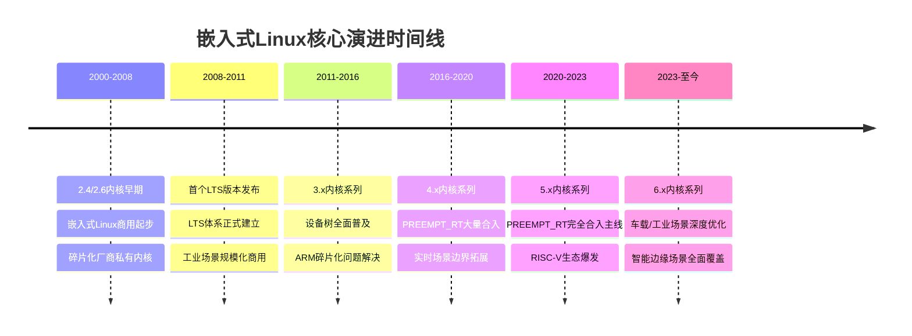
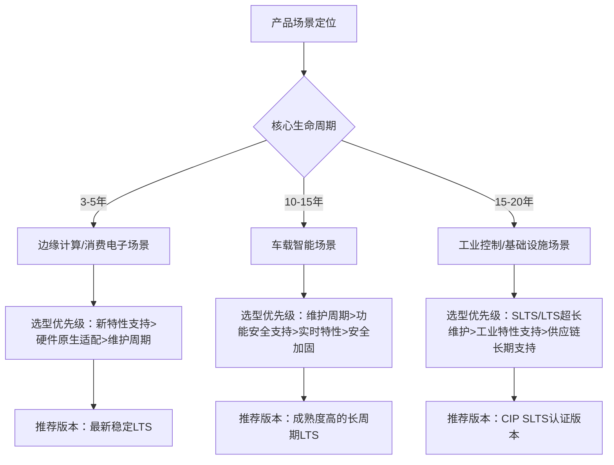

---
### 小节定位说明
- 难度：[E] 高级
- 内容类型：[原理解析+场景描述]
- 预计密度：中高密度
- 核心目标：从架构师视角拆解Linux内核主线演进的关键里程碑，建立「技术演进→行业规则变化→嵌入式产品选型决策」的完整逻辑链，而非单纯的历史流水账
- 重复规避：本小节仅聚焦演进历程与嵌入式场景的关联影响，内核内部原理、实操开发等内容均不展开，仅做跨章节引用
---

# 嵌入式Linux演进里程碑
> 📊 本节难度：E
> 📚 前置基础：Linux内核基础认知、嵌入式产品开发基本逻辑
> 🔗 关联章节：版本体系规则见本章02小节，实时化技术见10.6章节
---

> 核心结论：嵌入式Linux的商用化进程，完全绑定主线内核的「碎片化治理」与「场景化特性支持」两大演进主线，每一个里程碑都直接重塑了嵌入式产品的开发模式与选型逻辑。
{: .conclusion }

---

### <strong>内核主线关键阶段与嵌入式场景影响</strong>
内核主线演进阶段是嵌入式Linux生态发展的核心底层驱动力。 
不同于桌面/服务器场景，嵌入式场景对内核的核心诉求是**稳定性、长期维护、硬件适配、资源占用**。 
每个主线阶段的核心特性，都直接决定了嵌入式Linux的商用边界与开发模式。 

| 内核版本阶段 | 核心主线特性 | 对嵌入式场景的核心影响 |
|--------------|--------------|------------------------|
| 2.4及更早 | 基础嵌入式支持、uClinux无MMU适配 | 嵌入式Linux从实验室走向商用，打破VxWorks、QNX等商用RTOS的垄断 |
| 2.6系列 | 统一驱动模型、SMP多核支持、设备树雏形、PREEMPT_RT早期开发 | 终结厂商碎片化驱动开发模式，为多核嵌入式平台奠定基础，成为工业控制首个稳定商用基线 |
| 3.x系列 | 设备树全面普及、ARM架构统一支持、LTS体系正式固化 | 解决ARM平台碎片化问题，实现「一套内核适配多厂商芯片」，大幅降低嵌入式开发门槛 |
| 4.x系列 | PREEMPT_RT核心特性大量合入、eBPF基础框架、工业总线原生支持 | 为主线内核硬实时能力奠定基础，拓展Linux在工业自动化、车载场景的商用边界 |
| 5.x系列 | PREEMPT_RT核心逻辑完全合入主线、RISC-V架构成熟支持、安全加固特性完善 | 实现主线原生硬实时能力，RISC-V嵌入式生态爆发，满足车载/工业场景安全合规要求 |
| 6.x系列 | 嵌入式轻量化优化、异构多核原生支持、MIPI/TSN等车载/工业总线深度优化 | 全面适配智能座舱、工业边缘计算、边缘AI等新兴场景，成为车规级产品主流基线 |

---

### <strong>LTS/SLTS体系诞生与长期维护规则</strong>
LTS（Long Term Support，长期支持版）内核，是为解决主线内核短维护周期与嵌入式产品长生命周期的核心矛盾诞生的。 
早期主线稳定版的维护周期仅为6-24个月，而工业控制、车载等嵌入式产品的生命周期普遍在5-15年。 
厂商无法跟随主线快速迭代，只能停留在固定版本自行维护，最终导致补丁堆积、安全漏洞无法修复、版本锁死。 

| 时间节点 | 体系演进里程碑 | 嵌入式场景核心价值 |
|----------|----------------|--------------------|
| 2008年 | 首个正式LTS版本2.6.27发布，维护周期2年 | 首次为嵌入式产品提供稳定的内核基线 |
| 2011年 | LTS体系正式固化，每2年发布一个LTS版本，维护周期延长至6年 | 匹配绝大多数消费电子、工业产品的生命周期 |
| 2016年 | CIP（Civil Infrastructure Platform，民用基础设施平台）项目启动，推出SLTS（超长期支持版） | 维护周期延长至10+年，满足电网、轨道交通、工业控制等超长生命周期场景需求 |
| 2020年至今 | LTS维护周期进一步优化，核心LTS版本维护周期延长至6-10年 | 全面覆盖车载、工业、基础设施等全场景嵌入式产品需求 |

> 核心结论：LTS/SLTS体系是嵌入式Linux商用化的核心基石，没有长期维护保障的内核版本，不具备商用产品落地的基本条件。
{: .conclusion }

---

### <strong>PREEMPT_RT主线合入与实时化演进</strong>
PREEMPT_RT（实时抢占补丁集）是为Linux内核提供硬实时能力的核心补丁集，通过改造内核调度、中断、锁机制，将内核最大调度延迟从毫秒级压缩到微秒级。 
它的演进历程，直接决定了Linux在高实时要求的工业、车载场景的商用边界。 

| 内核版本 | PREEMPT_RT演进里程碑 | 嵌入式场景核心影响 |
|----------|------------------------|--------------------|
| 2.6系列 | PREEMPT_RT补丁集正式立项，独立于主线维护 | 首次让Linux具备硬实时能力，开始进入工业控制场景 |
| 3.x系列 | 抢占核心逻辑、中断线程化等特性逐步合入主线 | 降低实时补丁的维护成本，实时场景商用规模快速扩大 |
| 4.x系列 | 锁机制、调度器核心优化大量合入主线，补丁集规模大幅缩小 | 实时内核的适配难度大幅降低，开始进入车载预控制器等中高安全等级场景 |
| 5.3版本 | PREEMPT_RT核心逻辑完全合入主线，仅剩余少量补丁 | 主线内核原生支持硬实时能力，彻底打破商用RTOS的垄断地位 |
| 6.x系列 | 实时特性持续优化，延迟稳定性进一步提升，与安全特性深度融合 | 成为车规级、工业级高实时场景的主流内核基线 |

> ⚠️ 【关联提示】实时化技术的详细原理与落地实践，详见10.6-嵌入式Linux实时化技术章节
{: .tip }

---

### <strong>厂商BSP vs 主线内核的生态演变</strong>
BSP（Board Support Package，板级支持包）是芯片厂商提供的、适配对应芯片平台的内核补丁集与硬件适配代码，是嵌入式Linux开发的核心基础。 
厂商BSP与主线内核的关系演变，直接决定了嵌入式开发的模式与成本。 

#### 第一阶段：完全碎片化的厂商私有内核（2.4及更早）
芯片厂商拿到内核源码后，进行大量私有修改，完全不向主线社区提交。 
每个厂商的内核都是独立分支，与主线完全脱节，开发者无法跨平台复用代码。 
这个阶段的核心问题是「版本锁死」，产品发布后内核版本永远无法升级，安全漏洞只能自行修复。 

#### 第二阶段：基于主线的定制分支，少量上游化（2.6-3.x系列）
随着主线驱动模型、设备树的普及，厂商开始基于主线LTS版本开发BSP，减少私有修改。 
头部芯片厂商开始将核心架构适配代码提交到主线社区，但大部分驱动、优化代码仍保留在私有分支中。 
这个阶段的核心进步是实现了内核基础框架的统一，开发者可以复用主线的通用驱动与特性。 

#### 第三阶段：主线优先，全面上游化（4.x系列至今）
随着车载、工业场景的长生命周期、合规要求提升，厂商开始全面推进代码上游化。 
头部厂商（TI、NXP、瑞萨、Microchip等）的BSP完全基于主线LTS版本开发，所有核心适配代码、驱动代码优先提交主线，再回补到BSP中。 
这个阶段的核心价值是，开发者可以直接使用主线LTS内核适配芯片平台，无需依赖厂商的私有BSP，彻底解决了版本锁死问题。 

> 核心结论：厂商BSP的上游化程度，直接决定了对应芯片平台的长期维护成本与商用生命周期，是嵌入式产品芯片选型的核心评估指标。
{: .conclusion }

---

---
### 小节定位说明
- 难度：[E] 高级
- 内容类型：[原理解析+架构决策+实战落地]
- 预计密度：中高密度
- 核心目标：从嵌入式产品架构师视角，拆解Linux内核版本体系的官方底层规则，建立分场景的版本选型决策框架，明确长生命周期产品的版本约束，提供内核版本锁死的根源分析与可落地规避方案
- 重复规避：本小节聚焦「当前版本体系规则与商用落地决策」，上一小节已讲解的演进历史仅引用结论，不重复展开；内核内部原理、迁移实操等内容仅做跨章节引用，不深入讲解
---

# 嵌入式版本体系核心规则
> 📊 本节难度：E
> 📚 前置基础：嵌入式Linux演进里程碑（本章小节1）、Linux内核基础认知
> 🔗 关联章节：内核版本迁移实操见04模块，安全合规要求见08模块，实时化技术见10.6章节
---

> 核心结论：嵌入式Linux版本选型的本质，是用内核版本的维护规则匹配产品的全生命周期需求，所有选型决策都必须围绕「维护周期、合规要求、场景特性、长期成本」四大核心维度展开，脱离产品生命周期的版本选型必然导致后期维护灾难。
{: .conclusion }

---

### <strong>官方LTS维护周期与筛选机制</strong>
Linux内核版本体系的核心商用基线，是由内核社区官方维护的LTS长期支持版体系。 
所有嵌入式商用产品的内核选型，都必须以官方维护规则为核心依据，而非单纯的版本新旧。 

#### 内核版本四大核心分支边界
首先明确嵌入式场景下，四大内核分支的核心定位与适用边界，避免选型混淆：
| 分支类型 | 官方定义 | 维护周期 | 嵌入式场景适用范围 |
|----------|----------|----------|--------------------|
| 主线版（Mainline） | 内核核心开发分支，每2-3个月发布一个正式版本 | 仅维护到下一个正式版本发布 | 仅用于新特性预研、新硬件适配验证，禁止用于商用量产 |
| 稳定版（Stable） | 主线正式版发布后的bugfix分支，由稳定树维护团队负责 | 仅维护到下一个主线版本发布 | 仅用于LTS版本发布前的验证，禁止用于商用量产 |
| LTS长期支持版 | 从稳定版中筛选出的、提供长期维护的商用基线版本 | 6-10年，由官方维护团队+头部厂商共同维护 | 嵌入式商用产品唯一推荐的基线版本，覆盖绝大多数场景 |
| SLTS超长期支持版 | 基于LTS版本、由CIP项目维护的超长周期版本 | 10-20年，面向基础设施类产品 | 仅用于工业控制、电网、轨道交通等超长生命周期场景 |

#### LTS版本官方筛选机制
并非每一个主线稳定版都能成为LTS版本，其筛选有严格的社区规则与底层逻辑：
1.  发布周期规则：官方固定每2年发布一个新的LTS版本，通常选择每年的第一个主线版本作为LTS候选版本。
2.  厂商支持承诺：成为LTS版本的核心前提，是有头部芯片厂商、工业企业承诺长期参与维护，提供人力与测试资源。
3.  特性成熟度要求：候选版本的核心特性必须经过充分验证，无重大架构变更，适配主流嵌入式硬件平台。
4.  场景需求匹配：优先选择适配工业、车载等商用场景核心需求的版本，比如实时特性、安全加固、工业总线支持成熟的版本。

#### LTS版本维护核心规则
官方LTS版本的维护内容有严格的边界，并非所有修改都能合入LTS分支：
1.  维护内容边界：仅合入已在主线版本验证通过的bug修复补丁、安全漏洞修复补丁，**绝对不允许合入新特性**，保证版本的稳定性与兼容性。
2.  维护流程规范：所有补丁必须先合入主线稳定版，经过验证后再反向回补到LTS分支，禁止直接向LTS分支提交未经过主线验证的补丁。
3.  维护周期承诺：官方会在LTS版本发布时明确维护周期，核心LTS版本会根据厂商支持情况延长维护周期，比如6.1 LTS维护周期从6年延长至10年。

#### 主流LTS版本商用状态参考
| LTS版本 | 发布时间 | 官方维护截止时间 | 嵌入式场景适配状态 |
|---------|----------|------------------|--------------------|
| 6.6 LTS | 2023年10月 | 2029年12月 | 边缘计算、消费电子、新硬件平台首选，RISC-V架构适配成熟 |
| 6.1 LTS | 2022年12月 | 2033年12月 | 车载、工业场景主流基线，PREEMPT_RT特性成熟，功能安全认证支持完善 |
| 5.15 LTS | 2021年10月 | 2027年10月 | 工业控制、网关设备稳定基线，全平台适配成熟，维护资源充足 |
| 5.10 LTS | 2020年12月 | 2031年1月 | CIP SLTS超长期支持版本，工业基础设施、电网场景首选 |
| 4.19 LTS | 2018年10月 | 2029年12月 | 老旧平台长期维护基线，工业存量产品主流版本 |

---

### <strong>工业/车载/边缘场景版本选型逻辑</strong>
嵌入式场景版本选型没有通用的“最优版本”，只有最匹配产品场景约束的版本。 
不同场景的核心诉求、生命周期、合规要求差异极大，选型优先级完全不同。 

#### 车载智能场景选型核心逻辑
车载场景的核心约束是**ISO 26262功能安全合规**与**10-15年产品生命周期**，选型优先级完全围绕合规与长期维护展开：
1.  第一优先级：LTS维护周期必须完全覆盖产品的研发、量产、运维全生命周期，禁止选用维护截止时间早于产品停产时间的版本。
2.  第二优先级：版本必须有成熟的功能安全认证支持，内核代码可追溯、补丁合入流程可审计，满足ASIL等级认证要求。
3.  第三优先级：PREEMPT_RT实时特性成熟度，满足车载域控制器、动力系统的硬实时要求。
4.  第四优先级：车载总线（CAN-FD、TSN、车载以太网）、MIPI音视频接口的原生支持成熟度。
> 【实战选型示例】车载智能座舱、域控制器首选6.1 LTS，其次5.15 LTS，禁止选用非LTS版本或维护周期不足10年的版本。

#### 工业控制/基础设施场景选型核心逻辑
工业场景的核心约束是**15-20年超长生命周期**与**工业场景原生支持**，选型核心是长期可维护性：
1.  第一优先级：优先选用CIP SLTS超长期支持版本，其次是官方维护周期≥10年的LTS版本，完全覆盖产品全生命周期。
2.  第二优先级：工业总线（EtherCAT、Profinet、Modbus）、实时特性、工业级容错机制的原生支持成熟度。
3.  第三优先级：芯片厂商的长期BSP支持承诺，保证补丁回补与硬件适配的长期资源。
4.  第四优先级：IEC 61508功能安全、IEC 62443网络安全合规的适配成熟度。
> 【实战选型示例】PLC、工业网关、电网设备首选5.10 LTS（CIP SLTS），其次4.19 LTS，存量产品可延续3.16/4.4 LTS的自主维护体系。

#### 边缘计算/消费电子场景选型核心逻辑
边缘场景的核心约束是**新特性支持**与**硬件原生适配**，产品生命周期较短（3-5年），选型更灵活：
1.  第一优先级：对产品核心硬件（NPU、GPU、高速接口）的原生适配支持，减少厂商私有补丁的依赖。
2.  第二优先级：边缘AI、容器、虚拟化等新特性的原生支持成熟度，降低二次开发成本。
3.  第三优先级：LTS维护周期覆盖产品生命周期即可，无需追求超长维护周期。
4.  第四优先级：轻量化优化、资源占用优化，适配边缘设备的受限硬件资源。
> 【实战选型示例】边缘计算网关、智能家居设备首选6.6 LTS，其次6.1 LTS，可根据硬件适配需求选用最新稳定LTS版本。

---

### <strong>长生命周期产品的版本约束</strong>
长生命周期嵌入式产品，指生命周期≥10年的工业、车载、基础设施类产品。 
这类产品的内核版本选型，受到多维度的刚性约束，任何一个约束的缺失都会导致后期维护灾难。 

#### 核心刚性约束拆解
1.  维护周期约束：这是最核心的刚性约束。 
    内核版本的官方维护截止时间，必须晚于产品的停产+运维截止时间。 
    工业基础设施类产品通常需要预留5年以上的运维缓冲期，避免官方停止维护后无补丁可用。 

2.  合规性约束：行业合规标准对内核版本有明确的刚性要求。 
    车载ISO 26262、工业IEC 61508等标准，要求产品使用的内核版本必须有可追溯的维护记录，禁止使用已停止社区维护的“僵尸版本”。 
    网络安全合规标准要求产品必须能持续修复安全漏洞，无维护能力的内核版本无法通过合规认证。 

3.  供应链约束：芯片厂商的BSP支持周期，必须与内核版本的维护周期匹配。 
    若芯片厂商停止对应内核版本的BSP维护，即使社区仍在维护LTS版本，产品也无法完成补丁合入与适配。 
    长生命周期产品必须优先选择有长期BSP支持承诺的芯片平台与内核版本。 

4.  技术约束：内核版本必须兼容产品全生命周期的硬件迭代与功能升级需求。 
    过长的产品生命周期中，硬件平台可能会出现元器件替代、方案迭代，内核版本必须能支持新的硬件适配。 
    过于老旧的内核版本，无法适配新的元器件与接口，最终导致产品无法迭代。 

#### 产品全生命周期版本管理策略
长生命周期产品的内核版本管理，必须贯穿产品从研发到停产的全流程，分阶段制定明确规则：
| 产品生命周期阶段 | 核心版本管理规则 |
|------------------|------------------|
| 研发阶段 | 1. 选定与产品生命周期匹配的LTS/SLTS基线版本，冻结大版本号 2. 仅合入必要的硬件适配补丁，优先使用主线原生驱动，减少私有修改 3. 建立补丁管理台账，所有补丁必须可追溯、可上游化 |
| 量产阶段 | 1. 仅合入官方LTS分支的安全漏洞补丁、严重bug修复补丁，禁止合入新特性 2. 每季度同步一次官方LTS补丁，完成全量测试后发布量产固件更新 3. 建立版本基线台账，记录每一次量产固件的内核版本与补丁合入记录 |
| 长运维阶段 | 1. 官方维护周期结束前2年，启动版本迁移或自主维护方案规划 2. 若无法完成版本迁移，建立自主维护团队，持续跟踪安全漏洞与bug修复 3. 每半年完成一次全量安全扫描与漏洞修复，保证产品合规性 |
| 停产维护阶段 | 1. 发布最终稳定版本，完成全量功能与安全测试 2. 归档完整的内核源码、补丁台账、编译环境，保证后续可追溯 3. 制定应急补丁响应机制，应对高危安全漏洞的紧急修复需求 |

---

### <strong>内核版本锁死的根源与规避</strong>
内核版本锁死，指产品内核版本固定在某个已停止维护的旧版本，无法升级到主线LTS版本，只能自行维护补丁。 
这是嵌入式长生命周期产品最常见的维护灾难，最终会导致安全漏洞无法修复、合规不通过、硬件无法迭代。 

#### 版本锁死的核心根源
版本锁死从来不是单一的技术问题，而是技术、供应链、管理三重因素叠加的结果：
| 根源类型 | 核心问题拆解 |
|----------|--------------|
| 技术根源 | 1. 产品研发阶段引入了大量与旧版本深度耦合的私有补丁，未做上游化处理 2. 驱动代码、硬件适配逻辑与内核版本强绑定，无法迁移到新版本 3. 依赖的第三方组件、中间件仅适配旧版本内核，无新版本支持 |
| 供应链根源 | 1. 芯片厂商停止对应内核版本的BSP维护，无新版本的硬件适配支持 2. 核心元器件停产替代，新元器件仅提供新版本内核的驱动适配 3. 方案商交付的固件无源码、无补丁台账，无法进行版本升级 |
| 管理根源 | 1. 研发阶段只关注快速量产，完全不考虑产品长期维护需求，未做版本规划 2. 为了快速上线功能，大量引入未经验证的私有补丁，欠下技术债务 3. 无长期的内核维护团队与技术规划，错过版本迁移的最佳窗口期 |

> 核心结论：90%以上的版本锁死问题，都源于产品研发阶段的版本规划缺失，而非后期的技术能力不足。
{: .conclusion }

#### 事前规避：架构级版本锁死预防方案
版本锁死的核心解决思路，是事前预防，而非事后补救，核心方案如下：
1.  基线版本锁定规则：研发阶段必须选定官方维护周期覆盖产品全生命周期的LTS版本，禁止选用非LTS版本、即将停止维护的旧版本。
2.  补丁最小化与上游化策略：仅引入必要的私有补丁，所有补丁优先提交主线社区，再回补到产品基线，保证补丁可迁移、可维护。
3.  补丁隔离机制：硬件适配补丁、功能扩展补丁与内核核心代码完全隔离，采用设备树、驱动插件等方式实现，避免与内核版本强耦合。
4.  版本迭代窗口期规划：在产品全生命周期中，预留2-3次内核小版本升级的窗口期，提前完成版本迁移验证，避免一次性跨大版本升级的风险。

#### 事后补救：已锁死版本的应对方案
对于已经出现版本锁死的产品，根据产品所处生命周期阶段，采用分级补救方案：
1.  产品处于量产早期（量产3年内）：立即启动跨版本迁移项目，基于新的LTS版本重构内核基线，完成驱动与补丁的迁移适配，彻底解决版本锁死问题。
2.  产品处于量产中期（量产3-8年）：基于当前版本建立自主维护体系，持续跟踪主线LTS的安全补丁与bug修复，完成反向回补；同时规划下一代产品的版本迁移方案。
3.  产品处于量产末期（量产8年以上）：建立应急补丁响应机制，仅修复高危安全漏洞与严重功能bug；同时制定产品退市与替代方案，逐步淘汰锁死版本的产品。

---
### 自检清单
- [x] 每个知识点都有原理解析、表格/图示或实战选型示例支撑
- [x] 同章节无重复内容，与上一小节的演进历史仅做结论引用，不重复展开
- [x] 首次出现的专业术语均补充了清晰定义与解释
- [x] 密度与内容类型匹配，高密度内容无空洞，逻辑完整，贴合E级高级内容的实战决策定位
- [x] 完全符合排版规范，段落长度≤4行，无违规格式，边界清晰