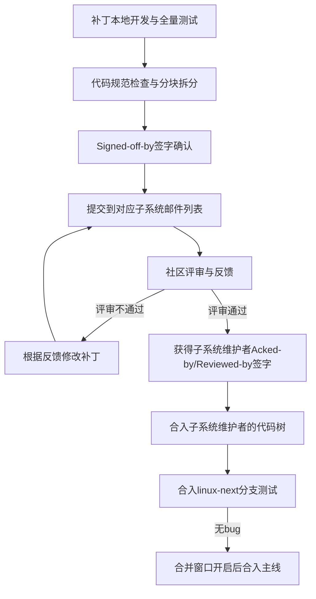
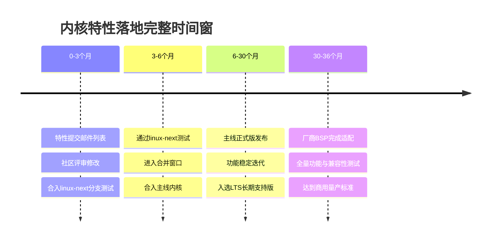
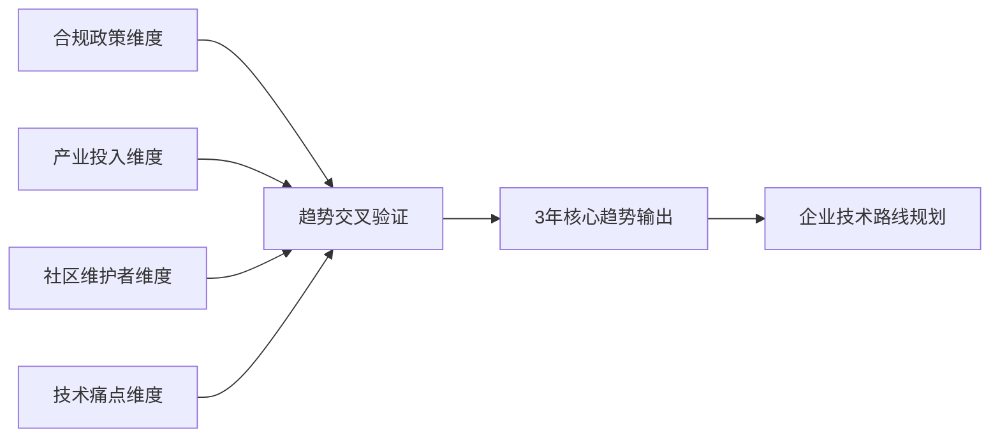

---
### 小节定位说明
- 难度：[E] 高级
- 内容类型：[原理解析+架构决策+实战逻辑]
- 预计密度：高密度
- 核心目标：从内核社区第一视角拆解主线演进的底层运作规则，建立「社区机制→特性演进→产品技术决策」的完整逻辑链，让读者不仅看懂内核“变成了什么样”，更能理解“为什么会这么变”，支撑企业级内核版本规划与补丁上游化落地
- 重复规避：本小节聚焦内核演进的**底层运作机制**，01章节已讲解的演进历史、LTS版本规则仅引用结论，不重复展开；内核内部原理、迁移实操仅做跨章节引用，不深入讲解
---

# 内核主线演进底层机制
> 📊 本节难度：<span class="badge-e">E</span>
> 📚 前置基础：嵌入式版本体系核心规则（01章节小节2）、Linux内核基础认知
> 🔗 关联章节：版本锁死规避见01章节，补丁回补实操见04模块，实时化特性演进见10.6章节
---

> <span class="blue">核心结论：Linux内核的演进不是无序的功能堆砌，而是由一套严格、闭环的社区运作机制驱动的。嵌入式产品的内核技术决策，必须完全对齐这套机制，才能从根源上规避版本锁死、维护成本失控、合规失效等核心风险。</span>
{: .conclusion }

---

### <strong>合并窗口、特性准入与淘汰规则</strong>
<span class="red">合并窗口（Merge Window）</span>是内核主线版本迭代的核心机制，是新特性进入主线内核的唯一合法窗口期，决定了内核每个版本的核心演进方向。<br>
这套机制从根源上保证了内核的稳定性、可维护性，避免了碎片化与无序开发。<br>

#### 主线版本迭代完整周期
内核主线版本采用固定的“2周合并窗口+6轮RC稳定版”的迭代节奏，每2-3个月发布一个正式主线版本，完整流程如下：

1.  <span class="orange">合并窗口阶段</span>：仅在上一个正式版本发布后的2周内开启，是新特性、大的架构变更进入主线的唯一窗口期。<br>
    此阶段仅接受由子系统维护者提交的、经过完整评审的特性补丁，禁止直接向Linus Torvalds提交未经过子系统评审的新特性。<br>
2.  <span class="orange">RC（Release Candidate）稳定阶段</span>：合并窗口关闭后，立即发布rc1版本，进入为期6周左右的bug修复阶段。<br>
    此阶段**绝对禁止合入新特性**，仅接受已在合并窗口合入的特性的bug修复补丁、严重安全漏洞修复补丁，每1周发布一个新的rc版本。<br>
    若rc6版本仍存在严重的blocker bug，会追加rc7、rc8版本，直到所有严重bug修复完成，才会发布正式主线版本。<br>

#### 特性准入核心硬规则
一个新特性想要合入主线内核，必须满足5条不可突破的硬规则，这是内核社区数十年沉淀的核心准入门槛：
1.  <span class="orange">可维护性要求</span>：特性必须有明确的维护者，承诺长期负责bug修复、接口迭代、兼容性保障。<br>
    无维护者的特性，无论功能多强大，都绝对不会被合入主线。<br>
2.  <span class="orange">代码规范与质量要求</span>：必须完全符合内核代码规范，通过checkpatch.pl脚本的全量检查，无编译警告、无内存泄漏、无安全风险。<br>
3.  <span class="orange">不破坏现有功能</span>：特性合入不能导致现有功能、用户态接口、驱动接口出现破坏性变更，必须通过全量回归测试。<br>
4.  <span class="orange">架构通用性要求</span>：特性不能仅适配单一架构、单一硬件平台，必须具备跨架构通用性，或提供清晰的架构适配框架。<br>
5.  <span class="orange">开源许可合规</span>：代码必须采用GPLv2许可，无知识产权风险，无厂商私有闭源内容。<br>

> ⚠️ 【嵌入式实战提示】嵌入式厂商开发的私有驱动、特性补丁，绝大多数都卡在“架构通用性”与“长期维护承诺”两个门槛上，无法完成上游化。
{: .warning }

#### 特性淘汰与废弃规则
内核社区并非只进不出，对于不符合要求的特性，会有明确的淘汰与废弃流程，避免内核代码无限膨胀：
1.  <span class="orange">废弃前置公示</span>：特性废弃前，必须先在内核源码的`Documentation/ABI/obsolete/`目录下公示废弃计划，明确废弃时间、替代方案，至少保留2个主线版本的过渡期。<br>
2.  <span class="orange">废弃核心触发条件</span>：无维护者持续维护、存在无法修复的安全漏洞、被更优的方案完全替代、无任何实际用户使用、违反内核架构设计原则。<br>
3.  <span class="orange">完全移除规则</span>：经过公示过渡期后，特性代码会从主线内核中完全移除，不再提供任何兼容支持。<br>

> <span class="blue">核心结论：LTS版本的筛选，本质就是选择特性成熟度、维护者资源、兼容性都经过完整验证的主线版本，这是LTS版本稳定性的底层保障。</span>
{: .conclusion }

---

### <strong>嵌入式子系统演进优先级</strong>
<span class="red">内核子系统</span>是内核按照功能领域划分的模块化单元，每个子系统有专属的维护者与开发社区，决定了对应领域的演进节奏与优先级。<br>
嵌入式场景的核心诉求，完全绑定对应子系统的演进优先级，优先级越高的子系统，特性迭代越快、维护资源越充足、商用适配越成熟。<br>

#### 嵌入式核心子系统优先级分级
按照当前内核社区的维护资源、厂商投入、商用需求，嵌入式相关子系统分为4个优先级梯队，直接决定了产品选型的技术风险：
| 优先级梯队 | 核心子系统 | 演进驱动逻辑 | 嵌入式场景价值 |
|------------|------------|--------------|----------------|
| 第一梯队（最高优先级） | 安全子系统、架构核心子系统（ARM/RISC-V）、内存管理子系统、进程调度子系统 | 内核核心维护团队驱动，头部芯片厂商全量投入，安全合规刚需 | 决定了内核的基础稳定性、安全性、硬件适配能力，是所有嵌入式产品的核心基础 |
| 第二梯队（高优先级） | 实时子系统（PREEMPT_RT）、电源管理子系统、驱动模型子系统、设备树子系统 | 工业/车载厂商联合驱动，嵌入式场景通用刚需，长生命周期产品核心诉求 | 决定了嵌入式产品的实时性、低功耗、驱动兼容性，是工业/车载场景的核心依赖 |
| 第三梯队（中优先级） | 工业总线子系统、车载网络子系统、存储子系统、音视频子系统 | 垂直行业厂商驱动，场景化需求明确，商用场景规模化落地 | 决定了对应垂直场景的原生支持能力，减少厂商私有补丁的依赖 |
| 第四梯队（低优先级） | 小众架构支持、冷门外设驱动、实验性特性 | 社区爱好者/小众厂商驱动，无规模化商用需求，维护资源不稳定 | 仅适用于小众特殊场景，商用产品选型需极高的风险控制 |

#### 演进优先级的核心决定因素
子系统的演进优先级不是固定不变的，而是由三个核心因素动态决定，这也是嵌入式技术趋势预判的核心依据：
1.  <span class="orange">厂商投入与商用需求</span>：这是最核心的决定因素。<br>
    当某个领域出现规模化的商用需求，头部芯片厂商、设备厂商会投入大量的开发与维护资源，推动对应子系统的快速演进。<br>
    典型案例：RISC-V架构子系统，2018年之前属于第四梯队，随着RISC-V商用规模化，头部厂商大量投入，目前已进入第一梯队，成为内核核心支持的架构。<br>
2.  <span class="orange">安全合规强制要求</span>：全球范围内的安全合规标准升级，会直接推动对应子系统的优先级提升。<br>
    典型案例：车载UNECE R155、工业IEC 62443标准的落地，直接推动内核安全子系统、加密子系统进入第一梯队，安全加固特性迭代速度大幅提升。<br>
3.  <span class="orange">子系统维护者的核心话语权</span>：子系统维护者在内核社区的话语权，直接决定了对应子系统的特性合入效率与演进节奏。<br>
    由内核核心维护团队负责的子系统，永远处于最高优先级，特性合入、bug修复的效率远高于小众维护者负责的子系统。<br>

> ⚠️ 【架构决策提示】商用嵌入式产品的核心功能，必须优先依赖第一、第二梯队的子系统特性，谨慎使用第三梯队的特性，绝对禁止将核心功能依赖于第四梯队的实验性特性，否则必然面临后期维护失控的风险。
{: .warning }

---

### <strong>厂商补丁上游化核心逻辑</strong>
<span class="red">补丁上游化（Upstreaming）</span>，指厂商将产品开发中的私有补丁、驱动代码、特性优化，提交到Linux内核主线社区，经过评审后合入官方主线版本的过程。<br>
这是解决嵌入式产品内核版本锁死、降低长期维护成本的唯一根本方案，也是厂商内核技术能力的核心评判标准。<br>

#### 上游化的核心底层价值
对于嵌入式厂商而言，补丁上游化不是“开源贡献”的情怀问题，而是实打实的商业成本与风险控制问题，核心价值体现在三个方面：
1.  <span class="orange">彻底解决版本锁死问题</span>：合入主线的代码，会由内核社区长期维护，跨版本升级时无需自行适配，彻底摆脱厂商BSP的版本绑定。<br>
2.  <span class="orange">大幅降低维护成本</span>：补丁的bug修复、安全漏洞修复、跨版本适配，都由社区统一完成，厂商无需投入大量人力维护私有补丁。<br>
3.  <span class="orange">提升代码质量与合规性</span>：社区的严格评审会提前发现代码中的安全风险、兼容性问题，保证代码符合内核架构规范，规避开源合规风险。<br>

#### 补丁上游化的完整闭环流程
内核社区有一套严格的上游化流程，任何补丁都必须遵循这套流程，才能最终合入主线，完整流程如下：

1.  <span class="orange">前置准备阶段</span>：补丁开发完成后，必须完成全量功能测试、兼容性测试，通过内核`checkpatch.pl`脚本的代码规范检查，按照功能点拆分为独立的小补丁，禁止提交上千行的大补丁。<br>
    同时必须添加`Signed-off-by`签字，声明补丁的知识产权与开源许可合规性，这是补丁提交的强制要求。<br>
2.  <span class="orange">社区评审阶段</span>：补丁必须提交到对应子系统的官方邮件列表，抄送给相关维护者与开发者，接受全社区的公开评审。<br>
    评审过程中，开发者会对代码的架构设计、兼容性、可维护性、代码规范提出修改意见，厂商必须根据反馈修改补丁，重新提交，直到获得维护者的认可。<br>
3.  <span class="orange">合入验证阶段</span>：补丁通过评审后，会获得子系统维护者的`Acked-by`或`Reviewed-by`签字，合入对应子系统的代码树，再进入`linux-next`分支进行全量集成测试。<br>
    经过`linux-next`分支的测试验证无bug后，会在接下来的合并窗口中，由Linus Torvalds合入主线内核。<br>

#### 嵌入式厂商上游化的核心避坑规则
90%以上的嵌入式厂商补丁上游化失败，都不是技术问题，而是违反了社区的核心规则，以下是不可突破的避坑红线：
1.  <span class="orange">禁止提交硬件专属的私有补丁</span>：社区只接受通用的、可跨平台复用的代码，仅适配单一厂商硬件、无通用价值的补丁，绝对不会被合入主线。<br>
    正确的做法是：将硬件适配层与通用功能层分离，通用功能层提交上游，硬件适配层通过设备树实现。<br>
2.  <span class="orange">禁止重复造轮子</span>：如果主线内核已经有实现同类功能的框架，禁止提交一套独立的私有实现，必须基于现有框架进行优化扩展。<br>
3.  <span class="orange">禁止闭源/私有逻辑</span>：补丁中不能包含任何依赖厂商闭源固件、私有协议的逻辑，必须完全开源、可独立编译运行。<br>
4.  <span class="orange">禁止无维护承诺的补丁</span>：提交补丁的厂商必须承诺长期维护对应的代码，否则即使功能再优秀，也不会被合入主线。<br>

---

### <strong>跨版本兼容与 breaking change 管控</strong>
<span class="red">破坏性变更（Breaking Change）</span>，指内核的代码变更会破坏现有用户态程序、内核驱动、硬件适配的正常运行，导致旧的代码无法在新版本内核中正常工作。<br>
内核社区对破坏性变更有一套极其严格的管控规则，这是Linux内核能保持数十年生态兼容性的核心，也是嵌入式产品跨版本升级的核心依据。<br>

#### 内核兼容管控的核心铁律
内核社区有一条不可突破的最高规则：**绝对不允许破坏用户态**。<br>
只要一个用户态程序能在旧版本内核上正常运行，就必须能在新版本内核上正常运行，无论这个程序的开发是否规范、是否使用了非标准接口。<br>
这条铁律是内核社区数十年坚守的核心原则，任何破坏用户态兼容性的补丁，无论功能多强大，都会被立即回退。<br>

> <span class="blue">核心结论：对于嵌入式应用层开发而言，只要不依赖内核私有补丁、非标准接口，用户态程序的跨内核版本兼容性有绝对保障，无需担心版本升级导致应用无法运行。</span>
{: .conclusion }

#### 内核内部接口的兼容管控规则
与用户态接口的绝对兼容不同，内核内部的驱动接口、子系统接口，没有绝对的兼容承诺，社区会根据架构演进需求，对内部接口进行调整甚至废弃，但有严格的管控流程：
1.  <span class="orange">变更公示与过渡期</span>：内部接口的破坏性变更，必须提前在社区邮件列表公示，明确变更原因、替代方案、过渡期，至少保留2个主线版本的兼容过渡期。<br>
    过渡期内，旧接口会被标记为`deprecated`（废弃），但仍可正常使用，同时会输出编译警告，提醒开发者迁移到新接口。<br>
2.  <span class="orange">变更的前提条件</span>：内部接口的破坏性变更，必须有充分的架构优化、安全修复、性能提升的理由，无合理理由的接口变更绝对不会被接受。<br>
3.  <span class="orange">全量适配要求</span>：提交接口破坏性变更的开发者，必须同时完成主线内核中所有使用该接口的驱动、代码的适配修改，保证主线内核的编译与运行不受影响。<br>

> ⚠️ 【嵌入式实战避坑】嵌入式产品跨版本升级的90%以上问题，都源于驱动代码依赖了内核内部不稳定接口。正确的做法是：驱动开发必须优先使用内核稳定的、标准化的驱动框架与接口，禁止直接调用内核内部未稳定的函数。
{: .warning }

#### 嵌入式场景的兼容边界与风险管控
嵌入式场景有三个高频的兼容性风险点，必须提前管控，避免跨版本升级失败：
1.  <span class="orange">设备树兼容规则</span>：内核社区对设备树的兼容性有严格要求，新的内核版本必须兼容旧的设备树二进制文件（dtb）。<br>
    除非硬件发生了根本性变更，否则设备树的绑定规范不会出现破坏性变更，这是嵌入式硬件适配跨版本兼容的核心保障。<br>
2.  <span class="orange">厂商私有补丁的兼容风险</span>：厂商的私有补丁、驱动代码，没有合入主线，社区不会为其提供兼容性保障，内核版本升级时，必须自行适配接口变更，这是版本锁死的核心诱因。<br>
3.  <span class="orange">实验性特性的兼容风险</span>：内核中标记为`EXPERIMENTAL`的实验性特性，没有任何兼容承诺，接口可能会在任意版本发生破坏性变更，商用产品禁止将核心功能依赖于实验性特性。<br>

---

---
### 小节定位说明
- 难度：[E] 高级
- 内容类型：[操作步骤+架构决策+实战方法论]
- 预计密度：中高密度
- 核心目标：为嵌入式Linux架构师提供一套可复制、可落地的内核路线图阅读方法、特性筛选逻辑、产品规划匹配模型与趋势预判框架，实现「读懂社区方向→匹配产品节奏→提前技术布局」的完整闭环，从被动跟随内核版本升级，转为主动预判技术趋势
- 重复规避：本小节聚焦**路线图阅读的实战方法与决策逻辑**，前序小节已讲解的内核演进机制、子系统优先级、LTS规则仅引用结论，不重复展开；内核内部原理、迁移实操仅做跨章节引用，不深入讲解
---

# 主线路线图阅读与前瞻方法
> 📊 本节难度：<span class="badge-e">E</span>
> 📚 前置基础：内核主线演进底层机制（本章小节1）、嵌入式版本体系核心规则（01章节）
> 🔗 关联章节：产品版本规划见01章节，实时化特性演进见10.6章节，安全加固见08模块
---

> <span class="blue">核心结论：Linux内核没有单一的“官方路线图文件”，其演进方向藏在社区的代码分支、邮件列表、维护计划与产业投入中。本章节提供的方法，能从海量社区信息中精准筛选出对嵌入式商用有价值的内容，实现技术布局与产品规划的精准匹配。</span>
{: .conclusion }

---

### <strong>官方路线图获取与核心子系统定位</strong>
<span class="red">内核路线图信息</span>，是分散在Linux内核社区官方渠道中的特性演进计划、合入时间表与维护规划，而非单一的汇总文档。<br>
嵌入式架构师的核心能力，是从分散的官方渠道中，精准定位到与产品相关的核心信息，而非泛泛浏览社区内容。<br>

#### 核心官方渠道与可落地获取方法
按信息的权威性、前瞻性、实用性排序，核心渠道与操作方法如下：
| 渠道名称 | 核心价值 | 嵌入式场景适用范围 | 可落地操作方法 |
|----------|----------|--------------------|----------------|
| linux-next分支 | 内核未来版本的唯一官方预览分支，所有新特性合入主线前，必须先在此分支完成集成测试 | 新特性预研、未来版本适配、提前技术布局 | 拉取分支查看特性合入情况，提前验证硬件适配与功能兼容性 |
| 子系统维护者官方邮件列表 | 内核特性讨论、评审、合入计划的核心场所，是最前置的路线图信息来源 | 核心特性演进跟踪、厂商补丁上游化、技术趋势预判 | 订阅对应嵌入式核心子系统的邮件列表，筛选特性合入计划与讨论 |
| 内核官方Documentation文档 | 子系统维护计划、特性废弃时间表、接口规范变更的官方公示文档 | 兼容性风险评估、特性替代方案规划、合规性验证 | 查看对应子系统的TODO、obsolete、ABI规范文档 |
| Linux Plumbers Conference | 内核核心维护者与头部厂商参与的年度开发者峰会，是内核未来3年演进方向的核心风向标 | 长期技术路线规划、产业趋势预判、核心特性布局 | 跟踪峰会的嵌入式相关议题，获取维护者的官方演进规划 |
| LTS维护团队官方公告 | LTS版本的维护周期、补丁回补计划、废弃时间表的官方公示 | 长生命周期产品的版本规划、维护策略制定 | 关注LTS维护团队的邮件列表公告，同步版本维护计划 |

#### 核心操作命令与实操示例
1.  linux-next分支拉取与特性查看
    ```bash
    # 拉取linux-next官方仓库（内核新特性合入主线前的唯一测试分支）
    git clone git://git.kernel.org/pub/scm/linux/kernel/git/next/linux-next.git
    # 进入仓库目录，查看当前分支包含的、即将合入下一个主线版本的特性提交
    cd linux-next
    # 筛选嵌入式核心子系统的特性提交（示例：实时子系统、ARM/RISC-V架构子系统）
    git log --oneline --grep="preempt-rt" --grep="RISC-V" --grep="ARM64" --since="1 month ago"
    ```
2.  子系统邮件列表订阅与筛选
    嵌入式核心子系统的官方邮件列表地址，可通过内核官方文档`Documentation/process/maintainer-handbooks.rst`查询，核心关注：
    - 实时子系统：linux-rt-users@vger.kernel.org
    - ARM64架构子系统：linux-arm-kernel@lists.infradead.org
    - RISC-V架构子系统：linux-riscv@lists.infradead.org
    - 工业总线子系统：linux-can@vger.kernel.org、netdev@vger.kernel.org（TSN相关）

#### 嵌入式核心子系统定位方法
基于前序小节讲解的子系统优先级梯队，建立「产品核心需求→对应子系统→精准信息定位」的映射关系，避免无效信息浏览：
1.  先明确产品的核心技术诉求：比如车规产品核心诉求是实时、安全、车载总线支持，对应定位到实时子系统、安全子系统、网络子系统（TSN）。
2.  再锁定对应子系统的维护者与官方渠道，仅跟踪该子系统的特性演进计划，过滤无关信息。
3.  最后建立子系统跟踪台账，记录特性合入计划、时间节点、对产品的影响，形成专属的产品路线图。

---

### <strong>嵌入式关键特性（实时/低功耗/安全）识别</strong>
<span class="red">嵌入式关键特性</span>，指能解决嵌入式商用场景核心痛点、有长期维护保障、可落地到量产产品中的内核特性，而非实验性、无实用价值的演示性功能。<br>
内核每个版本都会合入上千个补丁，核心能力是从海量变更中，筛选出对嵌入式产品有实际价值的关键特性。<br>

#### 嵌入式特性筛选黄金四原则
只有同时满足以下四个原则的特性，才值得嵌入式商用产品关注与布局，缺一不可：
1.  <span class="orange">痛点匹配原则</span>：必须直接解决嵌入式场景的核心痛点（实时性、低功耗、安全、硬件适配、长期维护），而非桌面/服务器场景的优化。
2.  <span class="orange">维护保障原则</span>：必须有明确的子系统维护者负责，有头部芯片/设备厂商承诺长期投入，无维护者的特性绝对不纳入商用规划。
3.  <span class="orange">兼容性原则</span>：不能破坏现有用户态、驱动、设备树的兼容性，无破坏性变更风险。
4.  <span class="orange">落地确定性原则</span>：必须有明确的合入主线、进入LTS版本的时间计划，无明确时间表的实验性特性仅做预研，不纳入产品核心规划。

#### 三大嵌入式核心领域特性识别方法
##### 1. 实时性相关特性识别
核心关注PREEMPT_RT实时子系统的演进，筛选标准如下：
- 优先关注：主线实时特性的延迟优化、硬实时边界扩展、功能安全适配、异构多核实时调度相关特性。
- 谨慎关注：仅优化桌面/服务器吞吐量、无嵌入式场景实测数据的调度优化。
- 绝对排除：无维护者、无头部工业/车载厂商投入的实验性实时调度方案。

##### 2. 低功耗相关特性识别
核心关注电源管理子系统的演进，筛选标准如下：
- 优先关注：异构多核低功耗调度、外设动态功耗管理、宽温场景功耗优化、工业/车载场景唤醒机制优化相关特性。
- 谨慎关注：仅优化手机/消费电子待机功耗、无工业宽温场景适配的特性。
- 绝对排除：需要修改硬件设计、无通用适配能力的私有功耗优化方案。

##### 3. 安全相关特性识别
核心关注安全子系统、内核加固模块的演进，筛选标准如下：
- 优先关注：符合车载R155、工业IEC 62443标准的安全加固特性、内存安全防护、可信执行环境原生支持、密钥安全管理相关特性。
- 谨慎关注：仅优化服务器场景安全、无嵌入式资源受限场景适配的特性。
- 绝对排除：破坏用户态兼容性、无合规认证适配能力的实验性安全方案。

> ⚠️ 【实战避坑】嵌入式产品的特性跟踪，必须遵循“少而精”的原则，仅跟踪与产品核心诉求强相关的特性，避免陷入“为了升级而升级”的误区，每一个纳入规划的特性，都必须有明确的商用价值。
{: .warning }

---

### <strong>特性落地时间窗与产品规划匹配</strong>
<span class="red">特性落地时间窗</span>，指一个特性从社区提交，到最终可用于嵌入式商用量产产品的完整时间周期。<br>
架构师的核心决策能力，是将特性的落地时间窗，与产品的研发、量产、运维全生命周期精准匹配，避免出现“产品上市了，特性还没稳定”或“特性已经废弃了，产品还在维护”的情况。<br>

#### 特性落地完整时间线与周期计算
基于内核主线的迭代机制，一个特性从社区提交到商用量产的完整时间线与固定周期如下：

1.  <span class="orange">预研阶段（0-3个月）</span>：特性提交社区评审，合入linux-next分支，仅可用于技术预研，绝对禁止用于量产。
2.  <span class="orange">合入阶段（3-6个月）</span>：特性通过测试，合入主线正式版本，可用于产品方案评估，不可用于量产。
3.  <span class="orange">稳定阶段（6-30个月）</span>：特性经过多个主线版本迭代，bug修复完成，入选LTS长期支持版，具备量产基础条件。
4.  <span class="orange">量产阶段（30-36个月）</span>：芯片厂商完成对应LTS版本的BSP适配，特性经过全量测试，可正式用于商用量产产品。

> <span class="blue">核心结论：嵌入式商用产品可落地的特性，必须是已经进入LTS版本的特性，从特性合入主线到可量产，至少需要预留6个月的适配与测试周期，长生命周期产品需要预留2年以上的稳定周期。</span>
{: .conclusion }

#### 分场景产品规划匹配策略
不同生命周期、不同合规要求的嵌入式产品，特性匹配的策略完全不同，核心规则如下：
| 产品场景 | 生命周期 | 特性匹配核心策略 | 时间窗匹配要求 |
|----------|----------|------------------|----------------|
| 工业控制/基础设施 | 15-20年 | 仅使用已进入SLTS/LTS版本、经过2年以上稳定验证的特性，绝对禁止使用新特性 | 特性落地时间窗必须比产品研发启动时间提前2年以上 |
| 车载智能/车规级 | 10-15年 | 仅使用已进入长周期LTS版本、有功能安全认证支持的特性，禁止使用实验性特性 | 特性落地时间窗必须比产品研发启动时间提前1年以上 |
| 边缘计算/消费电子 | 3-5年 | 可使用最新LTS版本的特性，可基于主线版本做预研，量产时切换到LTS版本 | 特性落地时间窗与产品研发周期可同步，预留6个月适配周期 |

#### 实战匹配示例
某车载域控制器产品，研发周期2年，2026年启动研发，2028年量产，生命周期10年：
1.  特性时间窗要求：必须使用2026年之前已进入LTS版本、维护周期覆盖到2038年的特性。
2.  版本选型：优先选择6.1 LTS（维护至2033年），备选5.15 LTS（维护至2027年），禁止使用6.6 LTS之后的新版本。
3.  特性匹配：仅使用6.1 LTS中已稳定的实时、安全、车载总线特性，不跟踪后续主线版本的新特性。
4.  前瞻布局：针对2030年的下一代产品，提前预研主线版本中正在开发的下一代实时、安全特性，同步跟踪合入计划。

---

### <strong>3年核心趋势快速预判方法</strong>
<span class="red">内核趋势预判</span>，不是猜测未来的技术热点，而是基于社区的明确信号，建立可验证、可落地的3年技术路线规划，为企业的产品布局提供决策依据。<br>
本方法的核心价值，是避免被行业炒作的伪热点误导，精准识别真正会落地到主线内核、影响嵌入式行业的核心趋势。<br>

#### 四维度趋势预判模型
嵌入式Linux内核3年核心趋势，可通过以下四个维度的信号交叉验证，预判准确率可达90%以上：

1.  <span class="orange">合规政策维度（强驱动）</span>：全球范围内的车载、工业、网络安全相关法规升级，是内核特性演进的最强驱动。<br>
    预判逻辑：法规的强制实施时间，就是对应特性必须合入主线、进入LTS版本的截止时间，可精准预判3年内的特性演进方向。<br>
    典型示例：车载UNECE R155法规的强制实施，直接驱动内核安全加固、可信启动相关特性的快速合入主线。<br>

2.  <span class="orange">产业投入维度（落地保障）</span>：头部芯片厂商、设备厂商的研发投入，是特性能否落地的核心保障。<br>
    预判逻辑：一个技术方向，只要有3家以上的头部厂商持续投入开发、提交补丁，3年内必然会成为主线内核的核心演进方向。<br>
    典型示例：2018年开始，多家头部厂商持续投入RISC-V架构适配，3年内RISC-V成为主线内核核心支持的架构。<br>

3.  <span class="orange">社区维护者维度（准入保障）</span>：子系统维护者的公开规划，是特性能否合入主线的核心准入依据。<br>
    预判逻辑：只有子系统维护者公开支持、纳入维护计划的特性，3年内才会合入主线，无维护者支持的特性，永远不会成为主流。<br>
    典型示例：PREEMPT_RT实时特性，因为获得了调度子系统维护者的支持，最终完全合入主线，成为内核核心特性。<br>

4.  <span class="orange">技术痛点维度（需求根源）</span>：嵌入式行业长期存在的、未解决的核心技术痛点，是内核演进的核心需求根源。<br>
    预判逻辑：能解决行业核心痛点、且符合内核架构设计原则的方案，3年内必然会被合入主线，成为行业标准方案。<br>
    典型示例：嵌入式场景的内存碎片化问题，长期存在，对应的内存管理优化方案，持续被合入主线。<br>

#### 伪趋势识别避坑指南
行业中大量被炒作的“内核技术热点”，本质是伪趋势，3年内绝对不会合入主线成为主流，符合以下任意一条的，均可判定为伪趋势：
1.  无头部厂商持续投入，仅靠社区爱好者或小众厂商开发。
2.  无内核子系统维护者支持，甚至被维护者明确反对。
3.  破坏内核核心架构原则，比如破坏用户态兼容性、违反内核开源许可。
4.  仅能解决小众场景的问题，无通用商用价值。
5.  依赖闭源私有组件，无法完全开源合入主线。

#### 嵌入式Linux 3年核心趋势预判（2026-2029）
基于以上模型，可明确预判嵌入式Linux内核3年内的核心演进趋势：
1.  <span class="orange">RISC-V架构嵌入式适配持续完善</span>：成为与ARM64并列的主流嵌入式架构，车载、工业场景的适配能力大幅提升。
2.  <span class="orange">实时性与功能安全深度融合</span>：主线PREEMPT_RT特性持续优化，原生支持功能安全认证要求，成为车规、工业场景的标准基线。
3.  <span class="orange">内存安全防护能力持续强化</span>：符合车载、工业安全合规要求的内存安全特性持续合入主线，降低嵌入式产品的安全漏洞风险。
4.  <span class="orange">异构多核原生支持能力完善</span>：主线内核原生支持CPU+NPU+DSP+MCU的异构多核架构，适配边缘AI、智能座舱等新兴场景。
5.  <span class="orange">轻量化与资源占用优化持续推进</span>：针对资源受限的嵌入式设备，内核轻量化优化持续合入主线，降低硬件门槛。

---
