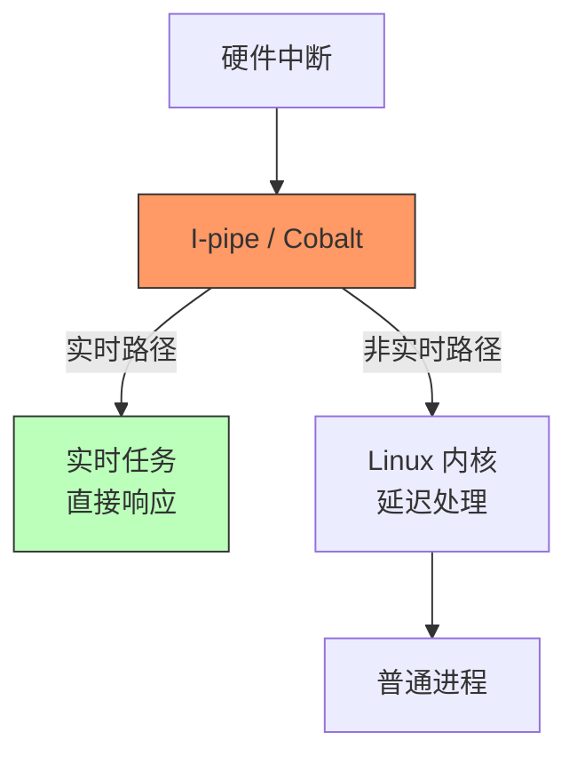
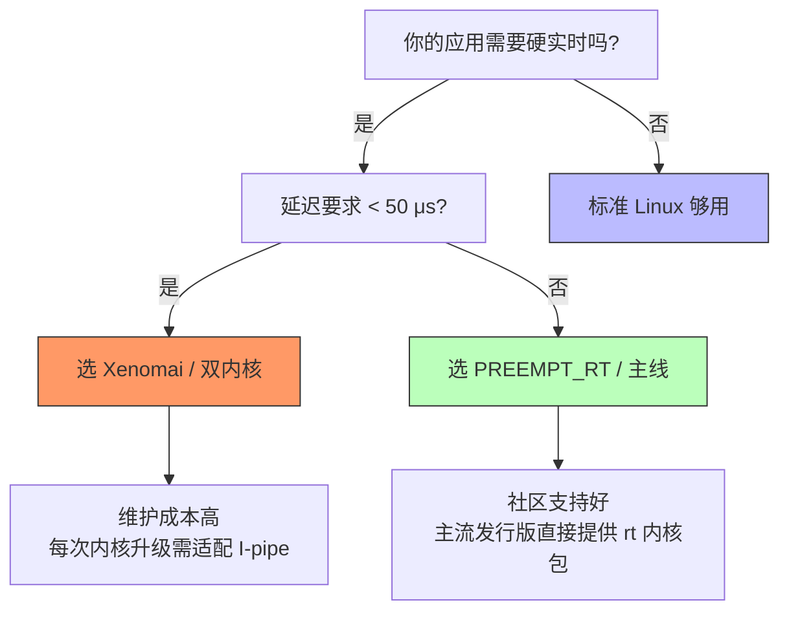

# Linux实时性基础

> 📊 **本节难度等级：** <span class="badge-b">**入门 (Beginner)**</span> → <span class="badge-i">**中级 (Intermediate)**</span><br>
> 📚 **前置基础：** 无（本章为模块10入门章）<br>
> 🔗 **关联章节：** 10.2 PREEMPT_RT补丁原理、10.6 实时性能测试与调优

---

## <strong>什么是实时系统</strong> <span class="badge-b">B</span>

> 💡 本节带你用四个真实工业场景建立"实时"的直觉，然后收敛到精确定义。最后留一个你能亲手跑的命令，感受非实时系统的抖动。
{: .tip }

### <strong>四个 deadline 场景</strong>

<span class="red">场景一：自动驾驶紧急制动</span>

一辆特斯拉 Model 3 以 120 km/h 行驶在高速上。<span class="green">前方货车突然掉落轮胎</span>，激光雷达在 50 米处检测到障碍物。<br>
车载计算机必须在 <span class="blue">100 毫秒</span> 内完成整个链条：激光点云分割 → 障碍物分类（轮胎 vs 纸箱）→ 轨迹预测 → 决策（变道还是刹车）→ 向 ESC 发送制动指令 → 液压系统建立压力。<br>
100 毫秒是物理极限：车速 120 km/h = 33.3 m/s，100 ms 内车前进 3.3 米。如果处理耗时 150 ms，车已经开到障碍物跟前 1.7 米处，AEB（自动紧急制动）即使全力刹车也撞上去了。<br>
这不是"越快越好"，而是 <span class="blue">有一个绝对不可协商的外部 deadline</span>。

<span class="red">场景二：六轴机械臂焊接</span>

汽车白车身焊接线上，KUKA KR QUANTEC 机械臂持焊枪以 2 m/s 速度沿焊缝移动。<span class="green">焊枪尖端与金属表面的距离必须稳定在 2.0±0.1 mm</span>。<br>
控制周期通常是 <span class="blue">250 μs ~ 1 ms</span>，每周期内必须完成：六关节编码器采样 → 正逆运动学解算 → PID 闭环修正 → 向伺服驱动器发送新的 PWM 占空比。<br>
如果某次控制周期因为系统"卡顿"延迟到了 5 ms，机械臂在这 5 ms 内多走了 10 mm，焊枪已经扎进钣金里。这一台车报废，整条流水线停线。<br>
更隐蔽的问题是 <span class="blue">抖动（Jitter）</span>：如果周期时而 250 μs 时而 800 μs，焊缝会出现鱼鳞状的高低起伏，质检无法通过。

<span class="red">场景三：医疗输液泵</span>

化疗药物以 0.1 mL/min 匀速注入患者静脉。<span class="green">每次微推的精度决定血药浓度</span>，推送间隔 100 ms，单次推送体积 0.167 μL，误差必须 < 1%。<br>
输液泵内部是一个步进电机驱动的精密丝杆。控制软件每 100 ms 计算一次步进脉冲数，发给电机驱动芯片。<br>
若某次推送因为系统卡顿延迟了 500 ms，患者会在 500 ms 内收到原本该分 5 次推送的药量——<span class="blue">5 倍剂量瞬间注入</span>。化疗药物的治疔窗极窄，过量直接中毒。

<span class="red">场景四：高频交易（HFT）</span>

纽约证券交易所的做市商算法在芝加哥商品交易所（CME）和纳斯达克之间套利。<span class="green">当 CME 的期货价格变化时，算法必须在 10 μs 内判断是否存在套利空间并下单</span>。<br>
10 μs 不是拍脑袋的数字：光纤从芝加哥到纽约单程需要 4 ms，但交易所在同一数据中心内部署的共置服务器（co-located server）之间，网络延迟可以压到 < 1 μs。<br>
算法的竞争不是"谁更聪明"，而是 <span class="blue">谁的系统延迟更稳定</span>。如果你的系统是 5 μs ± 2 μs，对手是 8 μs ± 0.5 μs，对手虽然平均更慢，但确定性更高，风控模型更敢下注。

### <strong>实时系统的定义与分类</strong>

从四个场景可以提炼出一个核心特征：<span class="red">正确性不仅取决于逻辑结果，还取决于结果产生的时间</span>。

**实时系统（Real-Time System）**：一个系统如果在规定的时间约束（deadline）内产生正确的响应，则称该响应是及时的；若超过 deadline，即使逻辑结果正确，系统也视为失效。

根据对 deadline 错过的容忍程度，分为三类：

| 类型 | 错过 deadline 的后果 | 典型场景 | Linux 类比 |
|------|---------------------|----------|------------|
| 硬实时 | 安全事故、人身伤害、财产损失 | 汽车 ABS、飞控、医疗、工业机器人 | 需要 PREEMPT_RT + 隔离 |
| 软实时 | 性能降级、用户体验下降 | 视频通话、在线游戏、音乐播放 | 标准 Linux 够用 |
| 固实时 | 逾期结果无价值但无害 | 传感器数据融合、行情报价 | 可丢弃，继续后续 |

> 一个常见误区：<span class="blue">实时 ≠ 快速。</span> 硬实时系统可能只需要每 10 秒响应一次（如核电站安全阀的周期性自检）；一个非实时系统可能 1 秒内完成计算，但如果这 1 秒是"有时 50 ms，有时 2 秒"的抖动，它就不是实时的。<br>
> <span class="green">确定性（Determinism）</span> 才是实时的核心——在已知最坏情况下，行为可预测、可验证、可保证。
{: .conclusion }

### <strong>Linux 为什么天生不是实时系统</strong>

通用操作系统的设计目标是 <span class="red">吞吐量和公平性</span>，而非确定性延迟。<br>
Linux 内核中存在大量不可抢占的临界区：自旋锁持有期间关闭抢占、中断处理程序运行至完毕、内核态大段路径不可调度。<br>
这些设计让 Linux 的平均响应很快（桌面打开应用几乎秒开），但最坏情况延迟无法被严格界定。

```bash
# 文件路径: 终端命令
# 功能: 用 cyclictest 测量标准 Linux 的调度延迟
sudo apt install rt-tests
sudo cyclictest -t1 -p 80 -n -i 1000 -l 100000 -q
# 参数说明:
#   -t1: 1个测试线程
#   -p80: SCHED_FIFO 优先级 80（很高，但还不是最高）
#   -n: 使用 clock_nanosleep（比 sleep 更精确）
#   -i1000: 目标周期 1000 μs（1 ms）
#   -l100000: 跑 10 万个周期
#   -q: 安静模式，只输出摘要
#
# 典型输出（标准 Linux，桌面负载轻）:
# T: 0 ( 1234) P:80 I:1000 C:100000 Min: 2 Avg: 5 Max: 45
# T: 0 ( 1234) P:80 I:1000 C:100000 Min: 2 Avg: 6 Max: 1200  ← 突然跳到 1.2 ms
#
# 在同一个系统上制造负载后再跑一次:
# 终端1: sudo stress --cpu 8 --io 4 --vm 2 --vm-bytes 128M
# 终端2: 再次跑 cyclictest
# Max 可能从 45 μs 跳到 3000 μs 甚至更高
```

> 同一个硬件，空闲时延迟 5 μs，高负载时跳到 3 ms。<span class="blue">600 倍的抖动差距</span>，这就是"平均很快、最坏情况不可预测"的典型表现。<br>
> 下一节将系统拆解 Linux 内核里具体哪些机制造成了这种不可预测性。
{: .conclusion }

---

## <strong>Linux内核的实时性瓶颈</strong> <span class="badge-i">I</span>

> 💡 本节回答上一节留下的悬念：Linux 为什么"平均很快，最坏不可预测"？三个具体机制，用命令和内核行为验证。
{: .tip }

### <strong>场景引入：一个实时任务的就绪时刻</strong>

假设你有一个 <span class="red">SCHED_FIFO 优先级 99</span> 的电机控制任务，周期 500 μs。<br>
某时刻传感器中断到来，数据已准备好，控制算法线程被唤醒、进入就绪队列。<br>
但它不一定立刻拿到 CPU——<span class="green">内核里可能正在跑一段无法被打断的代码</span>。<br>
从"任务就绪"到"实际执行"的这段时间，就是 <span class="blue">调度延迟（Scheduling Latency）</span>。<br>
在标准 Linux 下，这个延迟没有上限。

### <strong>瓶颈一：中断路径的"硬"壁垒</strong>

<span class="red">硬中断上下文（Hard IRQ Context）</span>是 Linux 内核中优先级最高的执行环境。外部设备触发中断后，CPU 立刻跳转到中断向量表对应入口，关本地中断，执行设备驱动注册的 <span class="green">irq_handler_t</span>。<br>
这个处理程序执行期间：<span class="blue">不可抢占、不可睡眠、不能调度</span>。

为什么？因为中断处理程序可能操作全局数据结构（设备状态寄存器、DMA 描述符环），如果中途被调度出去，另一个核或另一个中断进来访问同一数据结构，会导致竞态。<br>
所以内核的做法是简单粗暴的：<span class="red">硬中断里，调度器被冻结</span>。

代价是惨重的。一个网卡驱动在中断里读取 DMA 描述符、分配 sk_buff、拷贝数据、更新统计计数器，这一系列操作可能要 <span class="green">几十到上百微秒</span>。<br>
如果这期间你的电机控制任务就绪了，它只能等。

```bash
# 文件路径: /proc/interrupts
# 功能: 查看各中断在各 CPU 上的分布和触发次数
watch -n1 cat /proc/interrupts
# 输出示例（节选）:
#            CPU0       CPU1       CPU2       CPU3
#  45:    8923412    1230456          0          0  IR-PCI-MSI  eth0
#  46:     456789     567890     678901     789012  IR-PCI-MSI  nvme0q0
#
# 观察项：
# 1. 哪个 CPU 上 eth0 中断最密集？如果 CPU0 每秒近千万次，说明网卡绑在 CPU0
# 2. 如果你的实时任务也在 CPU0，它会被 eth0 的硬中断频繁阻塞
```

```bash
# 文件路径: /proc/irq/45/smp_affinity
# 功能: 查看和修改中断亲和性
cat /proc/irq/45/smp_affinity
# 输出: f  (二进制 1111，表示中断可在 CPU0~3 任意分发)
# 如果改为 2 (二进制 0010)，则该中断只分发到 CPU1
echo 2 | sudo tee /proc/irq/45/smp_affinity
```

> 硬中断的持续时间直接决定了调度延迟的下限。<span class="blue">如果设备驱动的 top-half 跑了 50 μs，你的 500 μs 周期控制任务就有 10% 的时间被偷走了</span>。<br>
> 这还不算最坏情况——如果多个中断"串糖葫芦"般在同一 CPU 上触发，延迟会线性叠加。
{: .conclusion }

### <strong>瓶颈二：调度延迟的"隐形"边界——内核临界区</strong>

即使不在中断上下文，Linux 内核里也存在大量 <span class="red">不可抢占的临界区</span>。<br>
最典型的就是 <span class="green">自旋锁（spinlock）</span> 持有期间：内核会执行 `preempt_disable()`，关闭当前 CPU 的抢占。

为什么？自旋锁的语义是"忙等直到锁释放"。如果获取锁的任务被调度出去，锁持有者变成另一个就绪任务，但由于锁还没释放，新任务会在锁上 spin，白白浪费 CPU 周期。<br>
所以 Linux 的设计是：<span class="blue">持有自旋锁时禁止抢占</span>，让当前任务尽快完成临界区。

```c
// 文件路径: kernel/locking/spinlock.c（概念示意）
// 行号范围: 示意，实际见主线版本
static inline void spin_lock(spinlock_t *lock)
{
    preempt_disable();      // ← 关闭抢占，调度器暂停
    raw_spin_lock(lock);    // ← 获取锁
    // ... 临界区操作 ...
    raw_spin_unlock(lock);  // ← 释放锁
    preempt_enable();       // ← 恢复抢占
}
```

这段代码的问题在于：<span class="red">临界区多长，抢占就被禁止多长</span>。<br>
如果临界区里遍历了一个有几千个节点的红黑树（比如虚拟内存区的 `vma` 链表），或者执行了一次慢速 I/O，实时任务就一直在就绪队列里干等。

```bash
# 文件路径: 终端命令
# 功能: 用 ftrace 观察调度延迟事件
sudo trace-cmd start -e sched:sched_wakeup -e sched:sched_switch
# 让系统跑压力负载
sudo stress --cpu 8 --io 4 --vm 2 --vm-bytes 128M &
# 同时运行 cyclictest
sudo cyclictest -t1 -p 99 -n -i 500 -l 10000 -q
# 停止追踪
sudo trace-cmd stop
sudo trace-cmd report | head -n 50
#
# 输出示例中找这种行：
# cyclictest-1234  [001] d...  1234.567890: sched_wakeup: comm=cyclictest pid=1234 target_cpu=001
# kworker/u8:0-89  [001] d...  1234.568340: sched_switch: prev_comm=kworker/u8:0 prev_pid=89 ...
#
# 时间差 1234.568340 - 1234.567890 = 450 μs
# 这就是"唤醒"到"实际切换"的调度延迟
```

> <span class="blue">标准内核的调度延迟没有契约</span>。文档不会告诉你"优先级 99 的任务最多等待 X μs"，因为它取决于此刻内核里有多少自旋锁、多长临界区、多少中断。<br>
> PREEMPT_RT 的核心改造，就是把 `preempt_disable()` 变成 `schedule()` 的触发点。
{: .conclusion }

### <strong>瓶颈三：优先级反转的"暗箭"</strong>

<span class="red">优先级反转（Priority Inversion）</span>是实时系统中最隐蔽、最致命的 bug。<br>
它的发生不需要高负载，不需要长临界区，只需要一个"不幸"的时序。

场景：三个任务，优先级 A(10) < B(50) < C(99)。<br>
- 任务 A（低优先级）持有一个自旋锁，正在临界区内。<br>
- 任务 C（最高优先级）试图获取同一个锁，失败，进入忙等（spin）。<br>
- 任务 B（中等优先级）就绪，由于 C 在 spin（不可抢占），B 实际上抢占了 C。<br>
- 任务 A 继续运行，但任务 B 比 A 优先级高，所以 B 先跑。<br>
- A 迟迟完不成临界区，C 就一直拿不到锁。

```mermaid
gantt
    title 优先级反转时序
    dateFormat X
    axisFormat %s
    
    section CPU
    A运行(持锁)       :a1, 0, 3
    B就绪            :milestone, b1, after a1, 0s
    B运行            :b2, 3, 8
    A继续(持锁)      :a2, 8, 10
    C就绪            :milestone, c1, after a1, 0s
    C等锁(spin)      :c2, after a1, 10
    A释放锁          :milestone, a3, 10, 0s
    C终于运行        :c3, 10, 13
```



> 在这个时序里，<span class="blue">优先级 99 的任务 C 被优先级 10 的任务 A 间接阻塞了 10 个时间单位</span>。<br>
> 而优先级 50 的任务 B 本来不该影响 C，却因为 A 持锁、C spin、B 抢占 A 的链条，成了"帮凶"。
{: .warning }

标准 Linux 的自旋锁 <span class="red">没有优先级继承</span>（Priority Inheritance）。<br>
持有锁的低优先级任务不会自动提升优先级，所以反转持续时间 = 低优先级任务在临界区内的执行时间 + 任何中间优先级任务的插入。<br>
在复杂系统里，这个时间完全无界。

```bash
# 文件路径: 终端命令
# 功能: 用 ps 查看实时任务的优先级和调度策略
ps -eo pid,comm,cls,rtprio | grep -E "FF|RR"
# 输出示例:
#   1234 cyclictask  FF  99
#   5678 data_logger FF  50
#   9012 heartbeat   FF  10
#
# 如果 9012 持有一个锁，1234 在等这个锁，而 5678 正在运行，
# 你就陷入了经典的优先级反转场景
```

> 优先级反转不是"低优先级任务故意捣乱"，而是<span class="blue">锁机制与优先级调度之间的结构性冲突</span>。<br>
> 解决它需要改变锁的语义——不是忙等，而是睡眠 + 优先级继承。这正是 RT-Mutex 的设计动机。
{: .conclusion }

### <strong>三个瓶颈的总结</strong>

| 瓶颈 | 根因 | 对实时任务的影响 | 标准 Linux 表现 | PREEMPT_RT 对策 |
|------|------|-----------------|----------------|----------------|
| 硬中断不可抢占 | 中断上下文关闭调度 | 任务就绪后等中断结束 | 延迟 ~10-100 μs 到 ms 级 | Threaded IRQs 拆分两半 |
| 自旋锁关抢占 | `preempt_disable()` 临界区 | 锁持有者期间任务不可调度 | 延迟无上限 | 自旋锁转 RT-Mutex 可睡眠 |
| 优先级反转 | 无继承机制，低优先级持锁阻塞高优先级 | 高优先级任务被无限期阻塞 | 无保护 | RT-Mutex 优先级继承协议 |

> 这三个瓶颈不是 Linux 的 bug，而是<span class="blue">通用操作系统设计目标的副作用</span>。Linux 追求吞吐量、公平性、代码简洁性，实时性不是首要目标。<br>
> 下一节将引入"如何用数字衡量实时性"，为后续的补丁和调优建立量化基准。
{: .conclusion }

---

## <strong>实时性度量指标</strong> <span class="badge-i">I</span>

> 💡 本节建立量化基准。上一节讲了 Linux 的实时瓶颈在哪，这一节讲"怎么测"——没有度量就没有管理。
{: .tip }

### <strong>场景：你的实时系统"足够好"了吗？</strong>

你拿到了一块工控主板，安装了 PREEMPT_RT 内核，绑定了 isolcpus，设置了 SCHED_FIFO 优先级 99。<br>
一切配置完成后，怎么证明这个系统真的满足硬实时要求？<br>
<span class="red">答案不是"感觉挺快的"，而是一组明确的数字</span>。

工业现场对实时性的验收标准通常是：<span class="blue">在 24 小时连续运行中，Max 延迟 < 100 μs，P99 延迟 < 30 μs</span>。<br>
没有这些数字，你就无法向客户证明系统可靠，也无法在延迟超标时定位根因。

### <strong>三个核心指标：延迟、抖动、确定性</strong>

<span class="orange">调度延迟（Scheduling Latency）</span><br>
从"外部事件发生"到"实时任务开始执行"的端到端时间。<br>
这个"事件"可以是：中断到达、定时器到期、消息队列收到信号。<br>
<span class="green">调度延迟 = 中断延迟 + 中断处理时间 + 调度器决策时间 + 上下文切换时间</span>。

<span class="orange">中断延迟（Interrupt Latency）</span><br>
从中断信号到达 CPU 引脚，到中断处理程序第一条指令被执行的时间。<br>
它由两部分组成：<span class="blue">硬件延迟</span>（中断控制器仲裁、总线传输，通常 1~5 μs）和 <span class="blue">软件延迟</span>（内核是否正在执行关中断的临界区）。

<span class="orange">抖动（Jitter）</span><br>
<span class="red">延迟的波动程度</span>。如果某系统的延迟分布是 5 μs ± 2 μs，我们说抖动 2 μs。<br>
抖动比平均延迟更致命——控制算法通常按固定周期设计，每次的延迟不可预测会导致积分器漂移、微分器噪声放大。

### <strong>测量工具：cyclictest 的原理与使用</strong>

<span class="red">cyclictest</span> 是 rt-tests 套件的核心工具，也是工业界的延迟测量标准。<br>
它的原理简单但精确：<span class="blue">创建一个高优先级实时线程，按固定周期（如 1 ms）唤醒自己，测量每次实际唤醒时间与预期时间的差值</span>。

```bash
# 文件路径: 终端命令（rt-tests 套件）
# 功能: 测量调度延迟的完整命令
sudo cyclictest -t4 -p 99 -n -i 1000 -l 1000000 -q -D 24h --histofall=1000
# 参数逐行说明:
#   -t4: 4个测试线程（模拟多核实时负载）
#   -p99: SCHED_FIFO 优先级 99（最高实时优先级）
#   -n: 使用 clock_nanosleep（比 sleep 更精确，绕过 glibc 封装）
#   -i1000: 目标周期 1000 μs（1 ms）
#   -l1000000: 共跑 100 万个周期
#   -q: 安静模式，只输出摘要
#   -D 24h: 跑满 24 小时（工业验收标准时长）
#   --histofall=1000: 输出延迟分布直方图，桶宽 1 μs，共 1000 桶
#
# 输出示例摘要:
# T: 0 ( 1234) P:99 I:1000 C:1000000 Min: 2 Avg: 5 Max: 18
# T: 1 ( 1235) P:99 I:1000 C:1000000 Min: 2 Avg: 4 Max: 15
# T: 2 ( 1236) P:99 I:1000 C:1000000 Min: 3 Avg: 6 Max: 120   ← 注意这一核
# T: 3 ( 1237) P:99 I:1000 C:1000000 Min: 2 Avg: 4 Max: 14
#
# 关键数字：
# Min: 系统能达到的最小延迟（受硬件时钟源限制，通常 1~3 μs）
# Avg: 平均延迟（负载轻时约 5 μs，PREEMPT_RT+隔离后约 3 μs）
# Max: 最坏情况延迟（这是硬实时验收的核心指标）
```

> 为什么线程 2 的 Max 是 120 μs，而其他线程只有 15 μs？<br>
> 这通常说明 <span class="blue">CPU2 上发生了异常事件</span>：某个设备中断绑到了 CPU2，或者某个内核线程（如 RCU 回调、workqueue）突然在 CPU2 上运行。<br>
> cyclictest 的价值不仅是给出一个 Max 数字，更是帮你<span class="red">定位"哪颗核、哪个时刻"出了问题</span>。
{: .conclusion }

### <strong>结果解读：百分位数与验收标准</strong>

只看 Max 是不够的。一个系统在 100 万次采样中，可能有 999,999 次延迟 5 μs，只有一次因为 BIOS SMI 中断跳到 500 μs。<br>
<span class="red">你需要看分布，而不是单点</span>。

cyclictest 的直方图输出（`--histogram`）给出延迟分布：

```bash
# 文件路径: 终端命令
# 功能: 输出延迟分布直方图
sudo cyclictest -t1 -p 99 -n -i 1000 -l 100000 --histogram=1000
# 输出示例（节选）:
# # Histogram
# 000000 000000
# 000001 000034    ← 延迟 1 μs 出现了 34 次
# 000002 045678    ← 延迟 2 μs 出现了 45,678 次（主峰）
# 000003 023456
# ...
# 000045 000001    ← 延迟 45 μs 出现了 1 次（异常点）
# Overflows: 000000
```

工业验收通常要求：

| 指标 | 一般工业控制 | 精密运动控制 | 高频交易 |
|------|-----------|-------------|---------|
| P50 (中位数) | < 10 μs | < 5 μs | < 1 μs |
| P99 | < 50 μs | < 20 μs | < 5 μs |
| P99.9 | < 100 μs | < 50 μs | < 10 μs |
| Max | < 200 μs | < 100 μs | < 20 μs |

> P99.9 的意义：<span class="blue">1000 次采样中只允许 1 次超标</span>。<br>
> 如果你的系统 P99.9 是 80 μs，Max 是 500 μs，那 500 μs 的异常点可能是 BIOS SMI、热插拔中断、或电源管理事件——它们不是内核问题，是硬件/固件问题。
{: .conclusion }

### <strong>进阶：用 ftrace 追踪延迟根因</strong>

cyclictest 告诉你"延迟多少"，但不告诉你"为什么"。<br>
<span class="red">ftrace</span> 是内核内置的追踪框架，可以精确到微秒级记录"谁阻塞了实时任务"。

```bash
# 文件路径: 终端命令
# 功能: 用 trace-cmd 记录调度事件并分析
sudo trace-cmd start -e sched:sched_wakeup -e sched:sched_switch \
    -e irq:irq_handler_entry -e irq:irq_handler_exit
# 同时运行你的实时任务
sudo cyclictest -t1 -p 99 -n -i 1000 -l 10000 &
sleep 30
sudo trace-cmd stop
sudo trace-cmd report > trace.log

# 分析日志：找 Max 延迟对应的时刻
# grep "cyclictest" trace.log | grep "sched_wakeup"
# 找到唤醒时间戳 T1
# grep "sched_switch" trace.log | grep "cyclictest"
# 找到实际执行时间戳 T2
# T2 - T1 = 调度延迟
# 在 T1~T2 之间查找什么事件占用了 CPU（irq_handler_entry? kworker?）
```

> ftrace 的精度依赖 <span class="green">trace_clock</span>。在 x86_64 上默认使用 TSC（Time Stamp Counter），精度约 1 ns；在 ARM 上使用 architected timer，精度约 10 ns。<br>
> 追踪本身会引入开销（约 1~3 μs 每事件），所以实际测量的延迟会比真实值略大。对于 < 50 μs 的延迟分析，这个误差可接受。
{: .conclusion }

### <strong>测量中的陷阱：预热与硬件噪声</strong>

第一次运行 cyclictest 时，Max 可能高达几千微秒。这不是系统问题，是<span class="red">缓存预热</span>。<br>
CPU 缓存、TLB、页表在冷启动时未加载，实时任务会触发大量 page fault 和 cache miss。<br>
<span class="blue">工业验收标准：预热 5 分钟后再开始正式采样</span>。

另一个常见陷阱是 <span class="orange">BIOS System Management Interrupts (SMI)</span>。<br>
x86 主板的 BIOS 会周期性地通过 SMI 处理温度监控、电池管理、风扇调速。<br>
SMI 进入后，操作系统被完全冻结，持续时间从 50 μs 到数毫秒不等。<br>
<span class="red">这个延迟内核完全不可见</span>，ftrace 里会显示为一个"黑洞"——没有任何调度事件，但时间流逝了。

```bash
# 文件路径: 终端命令
# 功能: 检测 SMI 中断
sudo apt install msr-tools
sudo rdmsr -a 0x34   # MSR_SMI_COUNT，读取 SMI 计数器
# 30 秒后再次读取
sudo rdmsr -a 0x34
# 如果数值增加，说明 BIOS 在发 SMI
```

> 解决 SMI 问题的方法：<span class="blue">进 BIOS 关闭所有电源管理选项（C-State、P-State、SpeedStep），或者换用支持 "SMI-free" 的工业主板</span>。<br>
> 这是硬件选型阶段就必须考虑的点，软件调优无法解决。
{: .warning }

---

## <strong>实时Linux发展路线</strong> <span class="badge-i">I</span>

> 💡 本节回答一个架构选择题：为什么实时 Linux 有两条完全不同的技术路线？它们各自的优劣是什么？2024 年主线化之后，选型策略如何变化？
{: .tip }

### <strong>场景：两条路线的诞生背景</strong>

2000 年前后，Linux 在服务器领域横扫千军，但在工业控制、航空航天、医疗设备领域寸步难行。<br>
一个飞控系统需要 50 μs 的调度延迟保证，而 Linux 2.4 内核在负载下的延迟可达数十毫秒——<span class="red">差距三个数量级</span>。

当时的工业界有两个选择：<span class="orange">改 Linux</span>，或者 <span class="orange">不用 Linux</span>。<br>
改 Linux 的人分成了两派：一派认为"Linux 内核本身不行，需要在它下面垫一个实时层"；另一派认为"Linux 内核底子很好，只要把调度器和同步原语改改就行"。<br>
这就是后来两条路线的起源。

### <strong>路线一：双内核架构（Dual-Kernel）</strong>

<span class="red">核心思想</span>：不改 Linux，而是在 Linux 内核和硬件之间插入一个<span class="green">微内核实时层</span>。<br>
Linux 本身作为一个<span class="blue">低优先级任务</span>运行在实时层之上，所有实时任务直接由微内核调度，绕过 Linux 内核的不可抢占路径。

<span class="orange">RTLinux（1998-2005）</span><br>
Victor Yodaiken 在新墨西哥矿业学院发起的项目。<br>
实现方式：将 Linux 内核打补丁，让它运行在<span class="green">虚拟 CPU</span>上。底层是一个抢占式的实时调度器，Linux 只是其中一个"任务"。<br>
当实时任务就绪时，调度器立即抢占 Linux；当没有实时任务时，Linux 获得 CPU。<br>
RTLinux 最终因为<span class="blue">GPL 许可证争议</span>（FSF 认为 RTLinux 的闭源版本违反 GPL）而分裂，衍生出 RTLinuxPro（闭源商业版）和开源分支。

<span class="orange">Xenomai（2001-至今）</span><br>
RTLinux 分裂后，Philippe Gerum 等人创建了 Xenomai。<br>
Xenomai 的核心是 <span class="green">I-pipe（Interrupt Pipeline）</span>：在硬件中断和 Linux 内核之间插入一个"管道"，实时任务可以<span class="blue">直接响应中断</span>，而 Linux 内核看到的中断是经过延迟和合并的。<br>
Xenomai 3 之后引入了 <span class="green">Cobalt</span> 实时核心，提供更现代的 API（POSIX Skin、RTDM 驱动框架）。



> 双内核路线的优势是<span class="blue">延迟极低</span>：Xenomai 在 x86 平台上可以做到 < 10 μs 的调度延迟，不受 Linux 内核负载影响。<br>
> 代价是<span class="red">维护负担</span>：每次 Linux 内核版本升级，I-pipe 补丁都需要重新适配。Linux 5.x 之后，内核内部 API 变化加速，Xenomai 的适配周期越来越长。
{: .conclusion }

### <strong>路线二：单内核补丁（PREEMPT_RT）</strong>

<span class="red">核心思想</span>：直接改造 Linux 内核本身，让它变得<span class="green">处处可抢占</span>。<br>
不引入额外的微内核，而是修改 Linux 的调度器、中断处理、同步原语，使其满足硬实时要求。

<span class="orange">技术改造的三根支柱</span>（后续章节详细展开）：

1. <span class="blue">线程化中断（Threaded IRQs）</span>：把中断处理拆成 top-half（硬中断，极短）和 bottom-half（内核线程，可抢占）。 lengthy 的设备处理不再阻塞实时调度。
2. <span class="blue">可抢占自旋锁（RT-Mutex）</span>：将 `spinlock_t` 的语义从"忙等"改为"睡眠 + 优先级继承"，消除优先级反转。
3. <span class="blue">高精度定时器 + Tickless</span>：用 hrtimers 替代 jiffies，时钟精度从毫秒跃升到微秒级；Dynamic Ticks 消除周期性的调度器 tick 干扰。

<span class="orange">主线化长征</span>：

| 年份 | 里程碑 | 意义 |
|------|--------|------|
| 1999 | RT-Patch 诞生 | 最早的可抢占内核补丁 |
| 2004 | PREEMPT_RT 补丁集成型 | Ingo Molnár 重构，形成系统方案 |
| 2006-2020 | 分散合入主线 | RT-Mutex、hrtimers、Threaded IRQs 陆续进入官方内核 |
| 2024.11 | Linux 6.12 | `CONFIG_PREEMPT_RT` 正式成为官方配置项 |

> 主线化的最后阻力来自 Linus Torvalds 对"代码复杂度"的担忧。妥协方案是：PREEMPT_RT 以独立配置项存在，默认关闭，不影响标准内核路径。<br>
> 这意味着编译内核时勾选 `CONFIG_PREEMPT_RT=y`，你就获得了一个官方支持的实时内核。
{: .conclusion }

### <strong>实战：查看你的系统走了哪条路线</strong>

登录一个 Linux 系统，如何快速判断它的实时能力来源？

```bash
# 文件路径: 终端命令
# 功能: 判断系统是否使用 PREEMPT_RT
uname -a
# 输出含 "PREEMPT_RT" 即表示主线实时内核
# 例如: Linux host 6.12.0-rt #1 SMP PREEMPT_RT ...

# 文件路径: /proc/config.gz
# 功能: 查看编译配置
zgrep PREEMPT_RT /proc/config.gz
# CONFIG_PREEMPT_RT=y          ← 主线实时
# CONFIG_PREEMPT_NONE=y        ← 服务器配置，无抢占

# 文件路径: 终端命令
# 功能: 判断 Xenomai 是否存在
dmesg | grep -i xenomai
# 输出 "I-pipe" 或 "Cobalt" 即表示双内核实时层已加载

# 文件路径: /dev
# 功能: 查看 RTDM 设备节点
ls /dev/rtdm*
# 存在则表明 Xenomai RTDM 框架活跃
```

```bash
# 文件路径: 终端命令
# 功能: 同时检查两种路线均未启用时的状态
#（标准内核，无 PREEMPT_RT，无 Xenomai）
cat /sys/kernel/debug/sched/preempt
# 标准内核下无此文件
# PREEMPT_RT 内核下输出 "full"
```

> 大多数嵌入式发行版（Yocto、Buildroot）在编译时会明确选择一条路线。<span class="blue">工业现场很少同时启用两条路线</span>——Xenomai 的 I-pipe 和 PREEMPT_RT 的抢占改造在底层有冲突，同时加载会导致未定义行为。
{: .warning }

### <strong>进阶：2024 年后的选型策略</strong>

主线化之后，实时 Linux 的格局发生了根本变化。

<span class="orange">选型决策树</span>：



| 维度 | PREEMPT_RT（主线） | Xenomai（双内核） |
|------|-------------------|------------------|
| 延迟 | 10-100 μs（依赖调优） | < 10 μs（典型 3-5 μs） |
| 内核版本 | 紧跟主线 6.12+ | 通常滞后主线 2-6 个月 |
| 维护成本 | 低（官方支持） | 高（需维护 I-pipe 补丁） |
| 驱动生态 | 完整（Linux 所有驱动） | 需 RTDM 封装或双核驱动 |
| 用户态 API | 标准 POSIX | Xenomai Skin / POSIX |
| 长期趋势 | <span class="green">主流</span> | 逐步边缘化 |

> <span class="blue">关键判断</span>：如果你的应用延迟要求是 100 μs 级别（工业机器人、PLC、医疗影像），PREEMPT_RT 是默认选择。<br>
> 只有当你的延迟要求压到 10 μs 以内（精密运动控制、高频交易 FPGA 协同），才需要考虑 Xenomai 的双内核架构。<br>
> 而且要考虑一个隐藏成本：<span class="red">Xenomai 的驱动开发比 PREEMPT_RT 复杂得多</span>——你需要写两套驱动，一套给 Cobalt 实时核，一套给 Linux 非实时核。
{: .conclusion }

> 未来趋势：PREEMPT_RT 在持续优化。Linux 6.12 之后，社区正在推进 <span class="green">"full dynamic ticks" 和 "CPU 调度域重构"</span>，目标是把 PREEMPT_RT 的延迟从当前 30-50 μs 压到 10 μs 级别。<br>
> 如果这个目标实现，Xenomai 双内核架构的"延迟优势"将被压缩到几乎无意义，届时 PREEMPT_RT 可能成为事实上的唯一选择。
{: .tip }

---

【章节合并完成】等待用户确认后继续下一章
