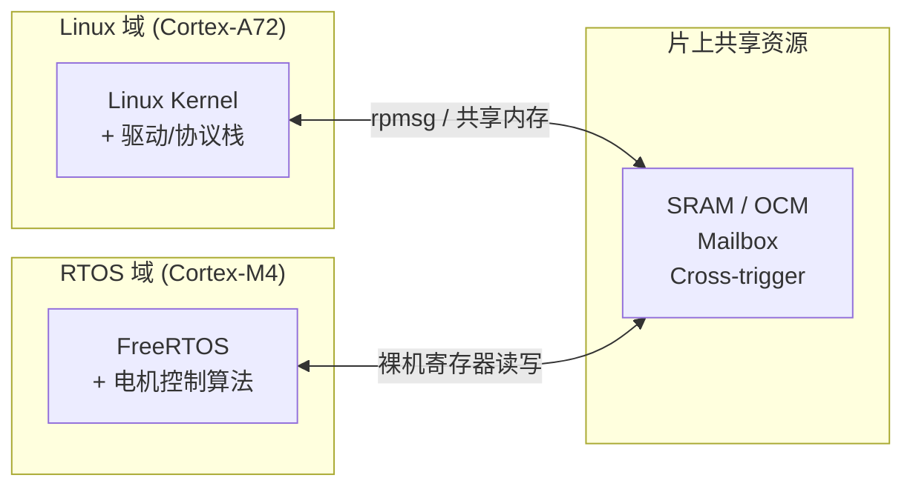

# 异构多核架构认知

[B] [I]

---

### 为什么需要异构

手机刷视频时发热严重、无人机电池撑不过20分钟、工厂机械臂抖动失控——这些问题的共同根源，往往是**用错了处理器**。 

让一个负责界面渲染的核去处理电机PID控制，就像让交响乐团的首席小提琴手同时去操控舞台灯光。不是能力问题，是**分工错位**。 

异构多核（Heterogeneous Multi-Core）的核心思想很简单：**不同任务交给最擅长的核**。具体在嵌入式场景中，这表现为三种典型分工： 

| 核心类型 | 典型架构 | 擅长什么 | 不擅长什么 | 类比 |
|---------|---------|---------|-----------|------|
| 高能效小核 | ARM Cortex-A53 | 后台常驻任务、轻量IO、待机保活 | 重计算、图形渲染 | 马拉松选手：续航久，爆发力弱 |
| 高性能大核 | ARM Cortex-A72/A76 | 突发计算、视频编解码、AI推理 | 持续运行发热大 | 短跑选手：速度快，功耗高 |
| 实时控制核 | ARM Cortex-M0+/M4/R5 | 微秒级响应、电机控制、传感器采样 | 复杂操作系统、大内存程序 | 反射神经：极快，但只能做单一动作 |

以一颗典型的手机SoC（如高通骁龙）为例： 

- A53小核处理微信后台消息推送、音乐播放 
- A72大核仅在打开游戏或4K视频时启动 
- M0协处理器管理陀螺仪、加速度计、始终在线的语音唤醒 

这种分工的底层逻辑是**能耗比**。A72的峰值性能可能是A53的3倍，但功耗是A53的10倍。用A53处理后台任务，整机电量可以多撑4小时。 

---

### 典型硬件拓扑

异构芯片里，核与核之间怎么连接？这决定了它们能高效协作还是互相拖累。 

AMP（Asymmetric Multi-Processing，非对称多处理）是最常见的异构模式。Linux跑在大核上，RTOS跑在小核上，两边各自独立启动、独立调度，通过共享内存交换数据。就像两台电脑用网线直连——各自跑各自的操作系统，但共享一块数据缓冲区。 

与AMP对应的SMP（Symmetric Multi-Processing），是同样架构的核跑同一个操作系统，由内核统一调度任务。这不算异构，而是同构多核——比如四颗A53一起跑Linux。 

还有BMP（Bound Multi-Processing），介于两者之间：核的架构相同，但人为绑定某些核跑特定任务。比如指定CPU0-1跑实时线程，CPU2-3跑普通应用。本质是同构核的异构用法。 

**一个关键认知**：异构的本质不是"核多"，而是"核不同"。如果四颗A53跑四个不同系统，这也算异构；如果一颗A53加一颗M4跑同一个Linux，这反而不算典型异构——因为操作系统无法利用M4的实时特性。 

---

### 工业案例

看懂芯片手册里的拓扑图，是读异构方案的第一步。 

**TI AM5728**： 
- 双核 Cortex-A15 @ 1.5GHz → 跑 Linux，做图像处理和网络通信 
- 双核 Cortex-M4 @ 212MHz → 跑 FreeRTOS，做电机控制和工业总线 
- 核间通信：OCMC RAM 256KB + Mailbox + 14 组 Cross-trigger 
- 典型场景：工业机械臂——A15处理视觉识别，M4实时控制伺服电机 

**NXP i.MX8QuadMax**： 
- 双核 Cortex-A72 + 双核 Cortex-A53 → 跑 Android Automotive 
- 双核 Cortex-M4F → 跑 AUTOSAR，控制仪表盘和CAN总线 
- 核间通信：MU（Messaging Unit）+ 共享 DDR + SEMA42 硬件信号量 
- 典型场景：智能座舱——A72跑导航和娱乐，M4处理车辆状态报警 

**Xilinx Zynq-7000**： 
- 双核 Cortex-A9 @ 667MHz → 跑 Linux 
- Artix-7 FPGA fabric → 跑自定义硬件加速逻辑 
- 核间通信：256KB OCM + AXI GP/HP 接口 + 中断 
- 典型场景：软件定义无线电——A9做协议栈，FPGA做FFT和滤波 

---

**学习路径提示**： 
- [B] 读者：看完本节知道"异构"不是简单的"多核"，而是"各干各的擅长事"。能看懂芯片手册的核间拓扑图即可。 
- [I] 读者：关注三种拓扑（AMP/SMP/BMP）的切换条件和通信瓶颈。思考：你手头的项目是否真需要异构，还是同构多核就够了？ 
- 本节不涉及代码操作，纯认知铺垫。下一节 `10.2.2 核间通信硬件机制` 开始讲寄存器和映射。
