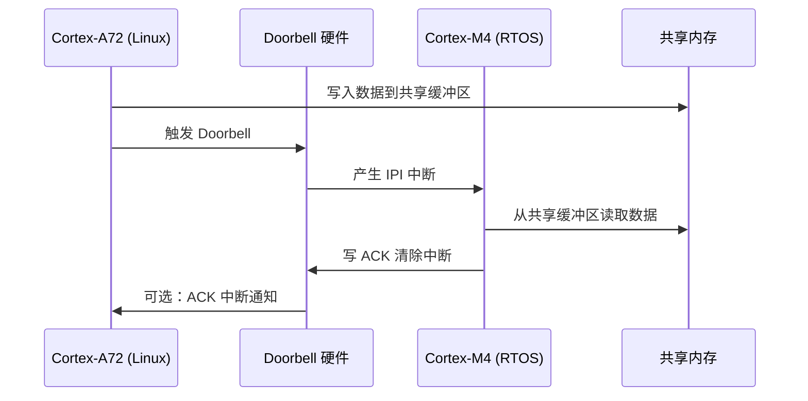

# 核间通信硬件机制

<span class="badge-i">[I]</span>

---

### 共享内存的物理基础

异构双核要交换数据，最朴素的方式就是**共享同一块物理内存**。问题是怎么让两个不同架构、不同操作系统的核，访问到同一段地址空间。<br>

<span class="red">OCM（On-Chip Memory，片上存储器）</span>是异构芯片中最常见的共享介质。它位于芯片内部，延迟远低于外部DDR，也不需要复杂的内存控制器仲裁。Zynq-7000的OCM有256KB，AM5728的OCMC有256KB，这些空间在芯片复位后就被两个核同时可见。<br>

共享内存映射不是"自动魔法"。大核跑Linux，地址经过MMU分页映射；小核跑裸机或RTOS，可能直接访问物理地址。以Zynq为例：<br>

| 资源 | 物理地址 | Linux 访问方式 | M4 访问方式 |
|------|---------|---------------|-------------|
| OCM | 0xFFFC_0000 | ioremap() 映射为虚拟地址 | 直接读 0xFFFC_0000 |
| DDR 低区 | 0x0000_0000 | 内核/用户空间常规内存 | 需配置 MPU 后访问 |
| DDR 保留区 | 0x1E00_0000 | memory-region 预留 | 链接脚本定位段到该地址 |

这里藏着第一个坑：<span class="blue">cache一致性</span>。A核写入共享内存后，B核读到的可能是cache里的旧值。大核有L1/L2 cache，小核可能也有cache。如果两边各自cache了同一块物理地址，数据会分裂成两个版本。<br>

解决方案有几种。最直接的是把共享内存区配置为<span class="green">Strongly-ordered 或 Device 属性</span>，让CPU访问时不经过cache。Linux侧用`ioremap_wc()`或`ioremap()`映射非cacheable区域；裸机侧通过MPU（Memory Protection Unit）将对应段标记为Shareable/Non-cacheable。<br>

类比一下：共享内存就像两个办公室共用的一块白板。如果A办公室在白板上写完就把纸抄走了（cache），B办公室看到的还是旧白板。要么规定"写完必须留在白板上"（Non-cacheable），要么设计一个"交换确认"机制（cache flush / invalidate）。<br>

---

### Mailbox 消息盒子

共享内存适合传大块数据，但核与核之间还需要**轻量事件通知**——比如"新数据到了请处理"。Mailbox就是干这个的。<br>

<span class="red">Mailbox（消息信箱）</span>本质上是一组寄存器加中断线。大核写 Mailbox 寄存器，触发小核的中断；小核读完数据写 ACK，触发大核的中断。典型的 Mailbox 寄存器结构如下：<br>

```c
/* i.MX8MU  Mailbox 寄存器结构示例 */
#define MU_TRn(n)   (0x00 + 4*(n))   /* 发送寄存器 0-3 */
#define MU_RRn(n)   (0x10 + 4*(n))   /* 接收寄存器 0-3 */
#define MU_SR       0x20             /* 状态寄存器 */
#define MU_CR       0x24             /* 控制寄存器 */

/* 状态寄存器位字段 */
#define MU_SR_TE0   (1 << 23)        /* 发送寄存器0空 */
#define MU_SR_RF0   (1 << 27)        /* 接收寄存器0满 */
#define MU_SR_GIPn(n) (1 << (n))     /* 通用中断 pending */
```

| 寄存器 | 位宽 | 用途 | 方向 |
|--------|------|------|------|
| TR0-TR3 | 32bit | 大核 → 小核 数据 | 大核写 |
| RR0-RR3 | 32bit | 小核 → 大核 数据 | 小核写 |
| SR | 32bit | FIFO空/满状态、中断标志 | 只读 |
| CR | 32bit | 中断使能、复位控制 | 读写 |

Mailbox 的 FIFO 深度通常只有 1-4 个 32bit 字。它不是为了传长数据，而是传"信"——一个32bit的指针、一个命令码、一个端点ID。数据本身放在共享内存，Mailbox只负责"敲门"。<br>

i.MX8的MU单元有4组TR/RR，每组一次最多传4个32bit字。如果要传更长的消息头，需要软件层拆包——这正是RPMsg存在的理由。<br>

---

### Doorbell 门铃机制

有些场景下，核之间只需要一个极简的"你醒醒"信号，不需要带任何数据载荷。Doorbell就是干这个的。<br>

<span class="red">Doorbell（门铃）</span>可以理解为一个二进制信号量加中断。A核拉一下门铃线，B核的中断处理函数被触发，然后B核去共享内存里取数据。没有数据经过Doorbell本身，它纯粹是通知载体。<br>

Doorbell 的典型握手流程：<br>



这个模式的关键是**ACK超时处理**。如果B核因为某种原因没有响应，A核不能无限等待。通常的实现是：<br>

- A核触发Doorbell后启动一个定时器（如100ms）<br>
- 超时未收到ACK，标记该次通信失败，上报错误<br>
- B核中断处理函数第一行就写ACK，防止中断丢失<br>

类比：Doorbell像酒店房间的服务铃。你按一下，服务员知道有事找你；但如果你连按三次都没人来，就该去前台投诉了，而不是继续按。<br>

---

### Cross-trigger 与 IPI

调试异构多核时，一个核跑到断点，希望另一个核也停下来——这靠的就是Cross-trigger。<br>

<span class="red">Cross-trigger（交叉触发）</span>是ARM CoreSight调试架构的一部分。它允许一个核的调试事件（断点、观测点）触发另一个核的断点请求。AM5728有14组Cross-trigger线，Zynq有4组CTI（Cross Trigger Interface）。<br>

开发中的典型用法：<br>

- A核在Linux驱动里设置断点<br>
- B核在FreeRTOS任务里设置断点<br>
- 任一核触发断点时，通过Cross-trigger暂停另一核<br>
- GDB同时看到两边的调用栈<br>

与调试无关的常态运行中，核之间用<span class="green">IPI（Inter-Processor Interrupt，核间中断）</span>做事件通知。IPI是GIC（Generic Interrupt Controller）的功能，一个核向GIC的SGI（Software Generated Interrupt）寄存器写目标CPU ID，目标核收到中断。<br>

Linux内核里的IPI发送代码：<br>

```c
/* arch/arm64/kernel/smp.c */
void smp_send_reschedule(int cpu)
{
    arch_send_call_function_single_ipi(cpu);
}

/* 底层通过 GICD_SGIR 寄存器触发 */
#define GICD_SGIR  0x0F00
/* 写 SGIR = (target_list << 16) | (SGI_id << 0) */
```

GICv2中，SGI编号0-15留给软件自定义。RPMsg和Mailbox的驱动层通常注册一个SGI，收到中断后去Mailbox寄存器里取具体消息。<br>

---

### 实战：Zynq OCM 映射与读写验证

理论落地到代码，就是在Linux里把0xFFFC_0000映射出来，验证大核写、小核读是否生效。<br>

OCM在Zynq的物理地址是0xFFFC_0000到0xFFFF_FFFF，共256KB。Linux侧通过`devm_ioremap_resource()`映射为内核虚拟地址：<br>

```c
#include <linux/io.h>
#include <linux/platform_device.h>

static void __iomem *ocm_base;

static int zynq_ocm_probe(struct platform_device *pdev)
{
    struct resource *res;
    
    res = platform_get_resource(pdev, IORESOURCE_MEM, 0);
    ocm_base = devm_ioremap_resource(&pdev->dev, res);
    if (IS_ERR(ocm_base))
        return PTR_ERR(ocm_base);
    
    /* 写入测试数据 */
    writel(0xDEADBEEF, ocm_base + 0x00);
    writel(0x12345678, ocm_base + 0x04);
    
    dev_info(&pdev->dev, "OCM mapped at %p, wrote test pattern\n", ocm_base);
    return 0;
}
```

小核（Cortex-M4或裸机A9）可以直接读该地址：<br>

```c
/* 裸机侧，无MMU */
#define OCM_BASE  0xFFFC0000UL

volatile uint32_t *ocm = (volatile uint32_t *)OCM_BASE;
uint32_t val0 = ocm[0];   /* 应读到 0xDEADBEEF */
uint32_t val1 = ocm[1];   /* 应读到 0x12345678 */
```

验证时的一个常见错误是忘了关cache。如果Linux用`ioremap()`默认是cacheable的，写完后小核读到的可能是旧数据。Zynq OCM区域在设备树中通常被标记为`no-map`，且映射属性为Device-nGnRnE（非cacheable）：<br>

```dts
ocm: ocm@0xFFFC0000 {
    compatible = "mmio-sram";
    reg = <0xFFFC0000 0x40000>;
    no-map;
};
```

<span class="blue">如果验证读出的数据和写入的不一致，先查cache属性，再查地址是否对齐（32bit对齐），最后确认小核侧MPU没有保护该地址。</span><br>

---

**学习路径提示**：<br>
- <span class="badge-i">[I]</span> 读者：掌握OCM/DDR映射方法、Mailbox寄存器操作、cache一致性处理。能独立完成Zynq/i.MX8的共享内存验证实验。<br>
- 下一节 `10.2.3 RPMsg原理与实现` 在硬件层之上构建消息协议，实现"带地址的可靠传输"。
