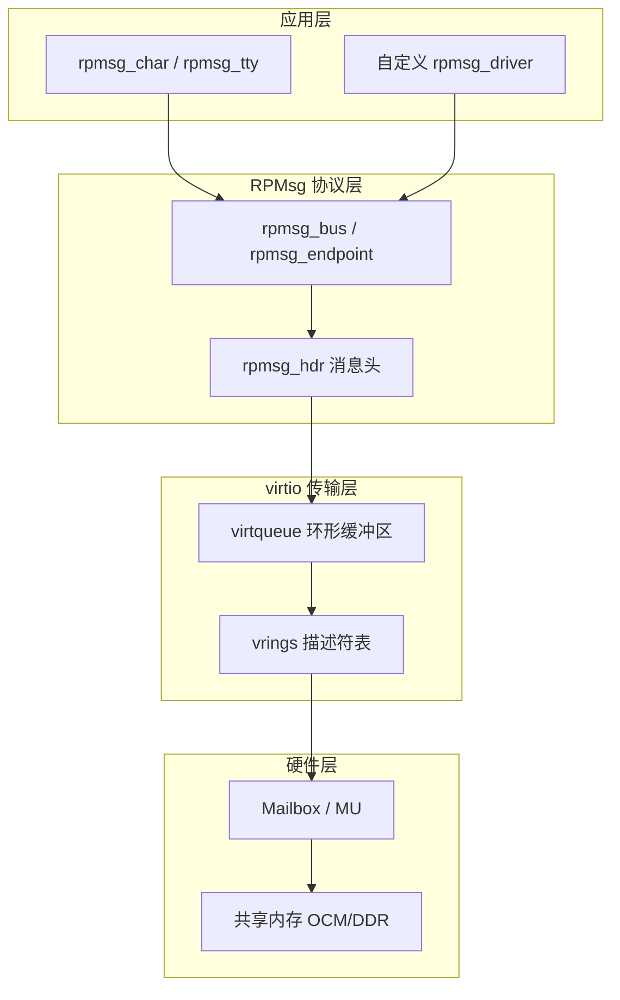
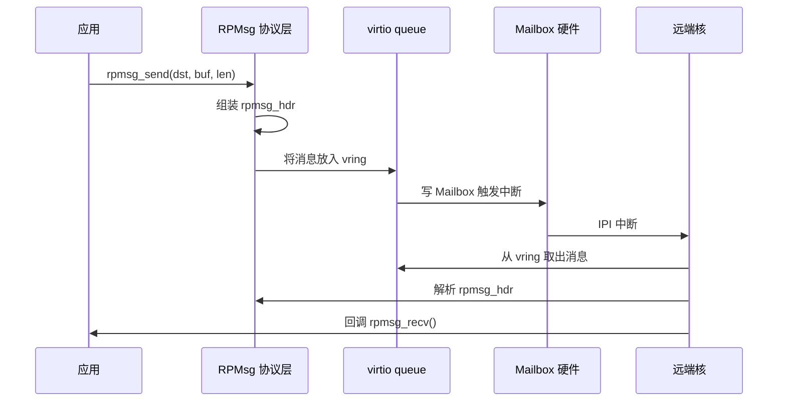

# RPMsg原理与实现

<span class="badge-i">[I]</span> <span class="badge-e">[E]</span>

---

### RPMsg 的定位与层次

Mailbox能敲门，但不能传长消息；共享内存能存数据，但没有地址和路由。RPMsg把两者拼起来，在硬件之上搭了一套**带端点地址的消息协议**。

<span class="red">RPMsg（Remote Processor Messaging）</span>是Linux内核中基于virtio的消息框架，设计初衷就是让Linux（大核）与远程协处理器（小核）之间像"发快递"一样通信：有发件人、有收件人、有包裹大小，还能排队等对方取。

从协议层次看，RPMsg位于中间层：



对比几个易混淆的概念：<br>

| 项目 | 定位 | 所在核 | 依赖 |
|------|------|--------|------|
| Linux rpmsg | 内核子系统 | A核（Linux） | virtio + remoteproc |
| OpenAMP | 用户空间库 | M4/裸机 | libmetal + rpmsg-lite |
| 裸机mailbox | 寄存器操作 | M4/裸机 | 无，直接读写 |

OpenAMP是RPMsg的"对端实现"。Linux侧跑内核rpmsg，M4侧链接OpenAMP库，两边通过共享内存里的virtqueue交换消息。就像两个邮局用同一套信封格式，各自用自己的运输队。

---

### 端点与地址空间

RPMsg不是核与核直连，而是<strong>端点与端点通信</strong>。一个核上可以开多个端点，每个端点有独立的32bit地址。

<span class="red">端点（Endpoint）</span>是RPMsg的最小通信单元。地址空间如下：<br>

| 地址范围 | 用途 |
|----------|------|
| 0x0000_0000 | 保留 |
| 0x0000_0001 - 0x0000_00FF | 静态预分配（如tty、echo服务） |
| 0x0000_0100 - 0x7FFF_FFFF | 动态分配 |
| 0x8000_0000 - 0xFFFF_FFFF | 保留 |

Linux端申请动态端点时，内核从0x100往上递增分配。M4端（OpenAMP）收到未知地址的消息时，会返回一个"地址不可达"的错误包。

类比：端点像公寓楼里的房间号。整栋楼（核）只有一个门牌（核ID），但快递要送到具体房间（端点地址）。RPMsg负责把包裹按房间号分拣。

---

### 消息格式字段级解析

RPMsg消息的每一个字节都有明确含义。看懂了消息头，debug时能直接从hex dump里读出问题。

<span class="red">rpmsg_hdr（消息头）</span>结构如下，共16字节固定头：

```c
struct rpmsg_hdr {
    uint32_t src;           /* 源端点地址 */
    uint32_t dst;           /* 目标端点地址 */
    uint32_t reserved;      /* 保留，用于对齐和扩展 */
    uint16_t len;           /* payload 数据长度 */
    uint16_t flags;         /* 消息标志位 */
    uint8_t  data[0];       /* 变长 payload */
} __packed;
```

| 字段 | 偏移 | 大小 | 说明 |
|------|------|------|------|
| src | 0x00 | 4B | 发件人端点地址 |
| dst | 0x04 | 4B | 收件人端点地址 |
| reserved | 0x08 | 4B | 保留字段，部分实现用于cookie |
| len | 0x0C | 2B | data[] 的实际字节数 |
| flags | 0x0E | 2B | bit0=1 表示需要ACK |

消息总长度 = 16字节头 + len字节payload。受virtqueue环大小限制，单次消息通常不能超过512字节（可配）。要传更大的数据，应用层需要自己分片——RPMsg本身不负责组包。

flags字段的bit0是**NS（No-Send）标志**，实际用途因实现而异。TI的OpenAMP实现里，bit0置位表示消息不需要回复ACK，适合单向通知。

---

### 与 Mailbox 的关系

很多人问：RPMsg能不能替代Mailbox？答案是<strong>不能</strong>，它们是互补的。

<span class="red">Mailbox是硬件门铃，RPMsg是软件邮局。</span>具体关系：<br>



Mailbox只负责"通知有消息"，RPMsg负责"消息是什么、给谁、多长"。virtqueue是两者之间的缓冲区：RPMsg把消息写入共享内存里的virtqueue，然后触发Mailbox中断通知对端；对端收到中断后从virtqueue里取出消息。

如果Mailbox坏了，RPMsg的消息发不出去；如果virtqueue满了，Mailbox中断触发了也没用，因为没地方放新消息。

---

### Linux 侧实现

Linux内核里的RPMsg框架位于`drivers/rpmsg/`目录下。要开发一个自定义RPMsg通信模块，需要理解三个核心结构。

<span class="red">rpmsg_client_device、rpmsg_driver、rpmsg_endpoint</span>的关系：<br>

```c
#include <linux/rpmsg.h>

/* 1. 定义 rpmsg_driver */
static struct rpmsg_driver my_rpmsg_drv = {
    .drv.name = "my-rpmsg-service",
    .probe    = my_rpmsg_probe,
    .remove   = my_rpmsg_remove,
    .callback = my_rpmsg_cb,    /* 收到消息时的回调 */
};

/* 2. probe 函数：远端核上线时被调用 */
static int my_rpmsg_probe(struct rpmsg_device *rpdev)
{
    struct rpmsg_endpoint *ept;
    
    /* 创建端点，绑定回调 */
    ept = rpmsg_create_ept(rpdev, my_rpmsg_cb,
                           NULL, RPMSG_ADDR_ANY,
                           rpdev->dst,
                           GFP_KERNEL);
    if (!ept)
        return -ENOMEM;
    
    dev_set_drvdata(&rpdev->dev, ept);
    
    /* 发送一条"上线"消息 */
    rpmsg_send(ept, "HELLO", 5);
    return 0;
}

/* 3. 消息回调 */
static int my_rpmsg_cb(struct rpmsg_device *rpdev,
                       void *data, int len,
                       void *priv, u32 src)
{
    dev_info(&rpdev->dev, "recv %d bytes from 0x%x: %.*s\n",
             len, src, len, (char *)data);
    return 0;
}
```

注册流程：`module_rpmsg_driver(my_rpmsg_drv)`宏会展开为标准的`register_rpmsg_driver()`调用。当remoteproc加载完M4固件后，M4侧的OpenAMP会向Linux发送一个"名称服务公告"（Name Service Announcement），Linux内核据此实例化对应的`rpmsg_device`，然后匹配`rpmsg_driver`，最终调用`probe()`。

发送接口有两个常用版本：<br>

| 函数 | 场景 | 阻塞行为 |
|------|------|----------|
| `rpmsg_send()` | 内核上下文，消息较小 | 可睡眠 |
| `rpmsg_sendto()` | 指定目标地址 | 可睡眠 |
| `rpmsg_trysend()` | 中断上下文 | 不阻塞，队列满直接返回 `-ENOMEM` |

---

### 实战：echo_test 双向消息测试

Linux源码里的`rpmsg_tty`和`rpmsg_char`是现成的测试工具。echo_test则是最基础的往返延迟测试。

echo_test的逻辑很简单：Linux发送一条消息，M4原样发回，Linux统计往返时间。

```bash
# 加载 remoteproc 和 rpmsg 模块
modprobe virtio_rpmsg_bus
modprobe remoteproc

# 启动 M4 固件（以 TI AM57x 为例）
echo /lib/firmware/am57xx-m4-fw.elf > /sys/class/remoteproc/remoteproc0/firmware
echo start > /sys/class/remoteproc/remoteproc0/state

# 查看生成的 rpmsg 设备节点
ls /dev/rpmsg*
# 输出：/dev/rpmsg0  /dev/rpmsg1

# 用 rpmsg_char 接口测试
cat /dev/rpmsg0 &
echo "ping" > /dev/rpmsg0
```

dmesg输出解读：

```
[   12.345] remoteproc remoteproc0: powering up 48822000.m4
[   12.350] remoteproc remoteproc0: Booting fw image am57xx-m4-fw.elf
[   12.360] virtio_rpmsg_bus virtio0: creating channel rpmsg-tty addr 0x1
[   12.365] virtio_rpmsg_bus virtio0: creating channel rpmsg-echo addr 0x2
[   15.123] rpmsg_echo: recv 4 bytes from 0x2: ping
[   15.125] rpmsg_echo: echo back 4 bytes to 0x2
```

关键日志行解析：<br>

| 时间戳 | 内容 | 含义 |
|--------|------|------|
| 12.360 | creating channel rpmsg-tty addr 0x1 | M4侧注册了tty服务端点 |
| 12.365 | creating channel rpmsg-echo addr 0x2 | M4侧注册了echo服务端点 |
| 15.123 | recv 4 bytes from 0x2 | Linux收到M4回的消息 |

<span class="blue">如果dmesg里只看到"powering up"但没有"creating channel"，说明M4固件里没有初始化OpenAMP，或者virtqueue内存地址没有对齐到4KB边界。</span><br>

---

**学习路径提示**：<br>
- <span class="badge-i">[I]</span> 读者：理解RPMsg的层次关系、端点地址分配、消息头结构。能看懂dmesg里的channel创建日志。<br>
- <span class="badge-e">[E]</span> 读者：动手写一个自定义rpmsg_driver，实现一个完整的发-收-处理闭环。下一节 `10.2.4 remoteproc处理器生命周期` 讲M4固件怎么被Linux加载。
