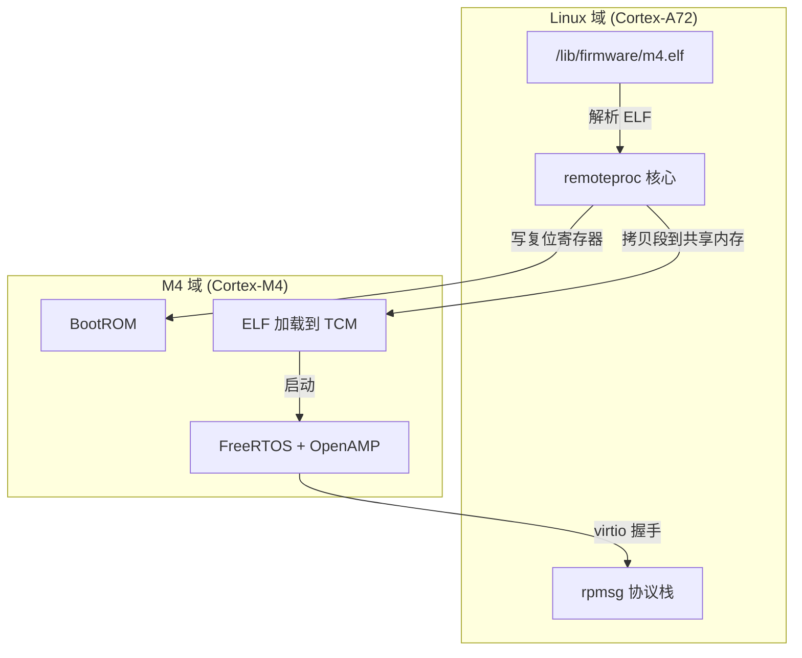
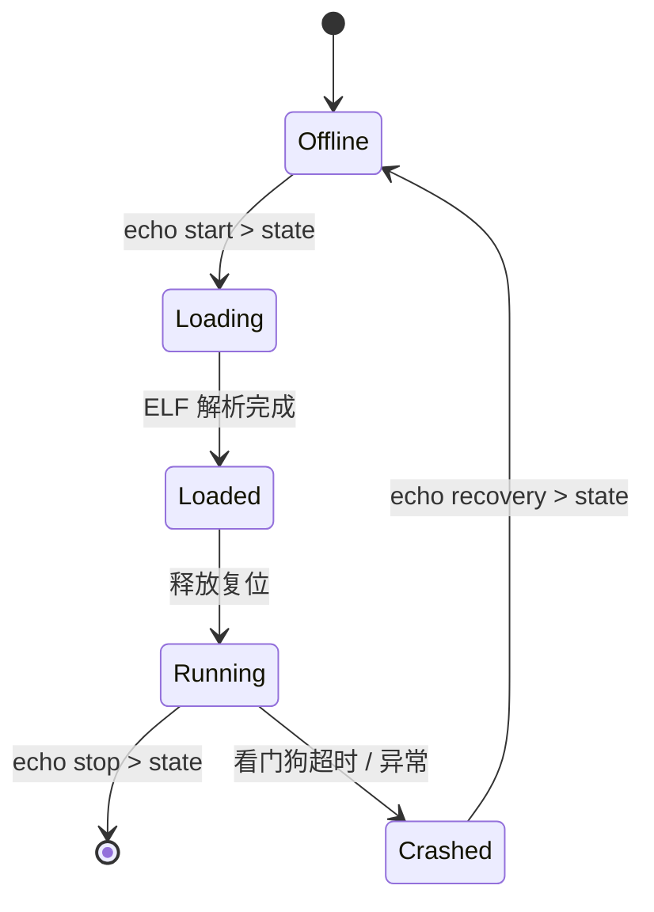

# remoteproc处理器生命周期

<span class="badge-i">[I]</span> <span class="badge-e">[E]</span>

---

### remoteproc 的定位

RPMsg负责通信，但通信的前提是"对端在线"。谁来把小核从沉睡中唤醒？谁来给它喂固件？这就是remoteproc的职责。

<span class="red">remoteproc（Remote Processor Framework）</span>是Linux内核的一个子系统，专门管理远程协处理器的生命周期：加载固件、复位释放、运行监控、崩溃恢复。简单说，**Linux是大管家，remoteproc是它手里的遥控器**。

典型场景里，A核跑Linux，M4核跑FreeRTOS/Baremetal。M4的固件是一个ELF文件，存在Linux文件系统的`/lib/firmware/`目录下。Linux通过remoteproc接口告诉M4："你的程序来了，开始跑吧。"



M4本身不能直接读Linux的文件系统。remoteproc驱动把ELF文件读入内存，解析段表，把代码段和数据段放到M4能访问的地址（通常是TCM或共享DDR），然后释放M4的复位信号。

---

### 固件格式：ELF 解析与资源表

remoteproc不是随便扔一个bin文件就行的，它要求固件是标准ELF格式，并且包含一个特殊段——**资源表（Resource Table）**。

<span class="red">资源表（Resource Table）</span>是M4固件里的一个数据结构，告诉Linux："我运行时需要哪些共享资源"。它位于ELF的一个自定义段里，段名通常是`.resource_table`。

```c
/* OpenAMP 标准 Resource Table 结构 */
struct resource_table {
    uint32_t ver;           /* 版本号，当前为 1 */
    uint32_t num;           /* 资源条目数量 */
    uint32_t reserved[2];   /* 保留对齐 */
    uint32_t offset[0];     /* 各条目偏移数组 */
};

/* 常用条目类型 */
enum {
    RSC_CARVEOUT = 0,       /* 共享内存 carveout */
    RSC_DEVMEM   = 1,       /* 设备内存映射 */
    RSC_TRACE    = 2,       /* 调试 trace 缓冲区 */
    RSC_VDEV     = 3,       /* virtio 设备定义 */
    RSC_RPMSG_VDEV = 4,     /* rpmsg virtio 设备 */
};
```

资源表在链接脚本中的声明：

```c
/* firmware.ld */
SECTIONS
{
    .text : { *(.text*) } > TCM
    .data : { *(.data*) } > TCM
    
    /* 资源表放在固定位置，方便 remoteproc 查找 */
    .resource_table : {
        __resource_table = .;
        *(.resource_table)
    } > DDR
}
```

ELF加载时，remoteproc遍历段表（Section Header Table），找到`.resource_table`段，按虚拟地址把它映射到共享内存。然后解析里面的条目，为每个virtio设备分配vring缓冲区。

| 段名 | 内容 | 加载地址 |
|------|------|----------|
| `.text` | M4 机器码 | TCM (0x0000_0000) |
| `.data` | 全局变量初值 | TCM |
| `.resource_table` | virtio 配置 | 共享 DDR |
| `.vdev0vrings` | vring 描述符表 | 共享 DDR |

---

### 启动流程

remoteproc启动M4不是一蹴而就的，它有一套严格的状态机。

<span class="red">remoteproc 状态转换：</span>



各阶段做的事情：

| 状态 | 动作 | 出错点 |
|------|------|--------|
| Loading | 打开ELF、校验魔数、读取段表 | 文件不存在、格式错误 |
| Loaded | 按资源表分配内存、拷贝段到TCM/DDR | carveout地址冲突 |
| Running | 写复位寄存器、触发IPI通知 | 固件入口地址错误 |
| Crashed | 冻结virtqueue、记录dump | 崩溃原因不明 |

代码层面的触发方式：

```bash
# 指定固件
echo /lib/firmware/am57xx-m4-fw.elf > /sys/class/remoteproc/remoteproc0/firmware

# 启动
echo start > /sys/class/remoteproc/remoteproc0/state

# 查看当前状态
cat /sys/class/remoteproc/remoteproc0/state
# 输出：running

# 停止
echo stop > /sys/class/remoteproc/remoteproc0/state
```

remoteproc_ops里的关键回调：

```c
static const struct remoteproc_ops am57x_rproc_ops = {
    .prepare    = am57x_rproc_prepare,      /* 上电/时钟配置 */
    .start      = am57x_rproc_start,        /* 释放复位 */
    .stop       = am57x_rproc_stop,         /* 拉回复位 */
    .load       = rproc_elf_load_segments,  /* ELF 段加载 */
    .parse_fw   = rproc_elf_load_rsc_table, /* 资源表解析 */
    .find_loaded_rsc_table = rproc_elf_find_loaded_rsc_table,
    .sanity_check = rproc_elf_sanity_check, /* ELF 校验 */
};
```

`start()`回调通常只做一件事：写某个复位控制寄存器，把M4从hold状态释放。具体寄存器地址因芯片而异——TI AM57x是`PRM_RSTST`寄存器，NXP i.MX8是`SRC_M4RCR`寄存器。

---

### 停止与恢复

M4不是一跑起来就万事大吉的。固件可能崩溃、死循环、或者只是需要升级新版本。

<span class="red">remoteproc 提供了多种停止和恢复手段：</span>

**正常停止**：`echo stop > state`。Linux主动拉回复位信号，M4立即停止，TCM里的内容还在。下次start不需要重新加载ELF，除非固件变了。

**崩溃检测**：有些芯片（如TI）有硬件看门狗。M4如果在约定时间内没有喂狗，硬件自动触发中断给A核。remoteproc捕获这个中断后，把状态标记为Crashed，并冻结对应的virtqueue防止脏数据流入Linux。

**Sysfs 控制接口**：

```bash
# 查看当前固件
cat /sys/class/remoteproc/remoteproc0/firmware

# 查看 coredump（如果支持）
cat /sys/class/remoteproc/remoteproc0/coredump

# 查看 trace 缓冲区
cat /sys/class/remoteproc/remoteproc0/trace0
```

trace缓冲区是资源表里`RSC_TRACE`类型条目定义的共享内存区。M4固件里的`printf()`输出到这个缓冲区，Linux侧通过sysfs直接读取——这是没有串口时的救命调试手段。

类比：remoteproc像一艘潜艇的发射系统。装载鱼雷（ELF固件）→打开舱门（释放复位）→发射（启动运行）。如果鱼雷卡住（崩溃），系统报警，你可以重新装填或者检修。

---

### 实战：TI AM57x M4 固件加载 dmesg 解读

下面是一段真实的AM57x启动日志，逐行拆解：

```
[   10.210] remoteproc remoteproc0: 48822000.m4 is available
[   10.215] remoteproc remoteproc0: Note: remoteproc is still under development
[   12.500] remoteproc remoteproc0: powering up 48822000.m4
[   12.505] remoteproc remoteproc0: Booting fw image am57xx-m4-fw.elf
[   12.510] remoteproc remoteproc0: rproc_elf_load_segments: loaded 0x8000 bytes to 0x0
[   12.515] remoteproc remoteproc0: rproc_elf_load_rsc_table: resource table: 0x8100
[   12.520] remoteproc remoteproc0: rproc_virtio_add_vdev: vdev id 7, dfeatures 1
[   12.525] remoteproc remoteproc0: registered virtio0 (type 7)
[   12.530] remoteproc remoteproc0: remote processor 48822000.m4 is now up
[   12.535] virtio_rpmsg_bus virtio0: rpmsg host is online
```

日志解读：

| 时间 | 日志 | 含义 |
|------|------|------|
| 10.210 | is available | 设备树里的m4节点被probe，remoteproc注册成功 |
| 12.500 | powering up | 用户写了`echo start > state` |
| 12.510 | loaded 0x8000 bytes to 0x0 | `.text`段加载到M4的TCM地址0x0 |
| 12.515 | resource table: 0x8100 | 资源表位于ELF偏移0x8100 |
| 12.520 | vdev id 7 | virtio设备ID为7，对应virtio_rpmsg |
| 12.535 | rpmsg host is online | RPMsg通道就绪，可以通信 |

<span class="blue">如果卡在"powering up"之后没有"loaded"，大概率是`/lib/firmware/`路径下没有这个ELF文件，或者文件权限不可读。如果"loaded"之后没有"is now up"，检查M4的复位寄存器配置和时钟门控。</span>

---

**学习路径提示**：<br>
- <span class="badge-i">[I]</span> 读者：理解remoteproc的状态机、ELF加载流程、资源表作用。能看懂dmesg日志定位启动失败。
- <span class="badge-e">[E]</span> 读者：动手修改OpenAMP的资源表条目，调整vring大小和carveout地址。下一节 `10.2.5 实战Linux+FreeRTOS AMP部署` 把所有组件串起来。
