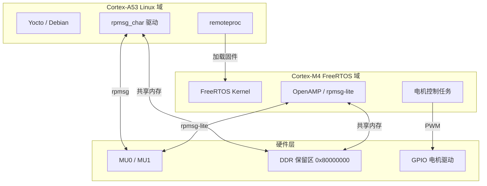

# 实战Linux+FreeRTOS AMP部署

<span class="badge-e">[E]</span>

---

### 场景与硬件选型

前面四节讲了原理，这一节把所有组件串起来，在真实硬件上跑通。

<span class="red">i.MX8MQ（NXP）</span>是理想的实验平台：四核 Cortex-A53 跑 Linux，一颗 Cortex-M4F 跑 FreeRTOS，片上有 MU（Messaging Unit）做核间中断，DDR4 做共享内存。A53负责多媒体解码和网络通信，M4负责实时电机控制和传感器采样——这是典型的异构分工场景。



选型理由：i.MX8MQ的NXP官方SDK（MCUXpresso）提供了完整的FreeRTOS+OpenAMP示例，设备树支持成熟，社区资料充足。

---

### FreeRTOS 编译与链接

M4侧不能直接用gcc裸编，需要NXP提供的SDK和链接脚本。

<span class="red">MCUXpresso SDK</span>是NXP官方的开发包，包含FreeRTOS源码、OpenAMP库、启动代码和链接脚本。下载对应板卡的SDK后，用arm-none-eabi-gcc编译：

```bash
# 解压 SDK
tar -xzf SDK_2.x_EVK-MIMX8MQ.zip -C ~/mcuxpresso/

# 设置工具链
export ARMGCC_DIR=/usr/local/gcc-arm-none-eabi-10.3
export PATH=$ARMGCC_DIR/bin:$PATH

# 进入 rpmsg 示例目录
cd ~/mcuxpresso/boards/evkmimx8mq/multicore_examples/rpmsg_lite_str_echo_rtos/armgcc

# 编译
./build_debug.sh
# 或手动：
cmake -DCMAKE_TOOLCHAIN_FILE="armgcc.cmake" -G "Unix Makefiles" \
      -DCMAKE_BUILD_TYPE=Debug .
make -j$(nproc)

# 输出：debug/rpmsg_lite_str_echo_rtos.elf
```

链接脚本里的关键地址：

```c
/* MIMX8MQ6xxxJZ_cm4.ld */
MEMORY
{
    m_interrupts (RX) : ORIGIN = 0x00000000, LENGTH = 0x00000240
    m_text      (RX) : ORIGIN = 0x00000240, LENGTH = 0x0003FDC0
    m_data      (RW) : ORIGIN = 0x1FFE0000, LENGTH = 0x00020000 /* 128KB TCM */
    m_rpmsg     (RW) : ORIGIN = 0xB8000000, LENGTH = 0x00100000 /* DDR 保留区 */
}
```

`.resource_table`段必须放在`m_rpmsg`区域，这样Linux的remoteproc才能通过共享DDR解析到它。编译完后，把`.elf`文件拷贝到Linux文件系统的`/lib/firmware/`目录。

---

### 设备树配置

Linux要认识M4，设备树里必须有remoteproc节点和共享内存预留。

<span class="red">i.MX8MQ 设备树片段：</span>

```dts
/* arch/arm64/boot/dts/freescale/fsl-imx8mq.dtsi */
/ {
    /* 为 M4 预留 DDR 内存 */
    reserved-memory {
        #address-cells = <2>;
        #size-cells = <2>;
        ranges;

        rpmsg_reserved: rpmsg@0xB8000000 {
            compatible = "shared-dma-pool";
            reg = <0 0xB8000000 0 0x00100000>;
            no-map;
        };

        rsc_table: rsc@0xB8100000 {
            compatible = "shared-dma-pool";
            reg = <0 0xB8100000 0 0x00001000>;
            no-map;
        };
    };

    /* M4 远程处理器节点 */
    imx8mq-cm4 {
        compatible = "fsl,imx8mq-cm4";
        method = "smc";           /* 通过 SMC 调用的 SCU */
        mbox-names = "tx", "rx";
        mboxes = <&mu 0 0>, <&mu 1 0>;
        mub-partition = <3>;
        memory-region = <&rpmsg_reserved>, <&rsc_table>;
        syscon = <&src>;
        fsl,startup-delay-ms = <500>;
    };

    /* MU 单元 */
    mu: mu@30aa0000 {
        compatible = "fsl,imx8mq-mu";
        reg = <0 0x30aa0000 0 0x10000>;
        interrupts = <GIC_SPI 7 IRQ_TYPE_LEVEL_HIGH>;
        #mbox-cells = <2>;
    };
};
```

关键字段解析：

| 属性 | 值 | 含义 |
|------|-----|------|
| `method = "smc"` | SMC调用 | 通过ARM Trusted Firmware安全切换M4状态 |
| `mboxes` | `<&mu 0 0>` | MU通道0用于发送，通道1用于接收 |
| `memory-region` | `rpmsg_reserved` | 共享内存区，1MB，no-map防止Linux内核使用 |
| `fsl,startup-delay-ms` | 500 | 启动后等待500ms让M4初始化完成 |

编译设备树：

```bash
cd ~/linux-imx
make ARCH=arm64 dtbs
# 输出：arch/arm64/boot/dts/freescale/fsl-imx8mq-evk.dtb

# 部署到 boot 分区
sudo cp arch/arm64/boot/dts/freescale/fsl-imx8mq-evk.dtb /boot/
```

<span class="blue">如果M4启动后Linux看不到rpmsg设备，先检查memory-region的物理地址是否与M4链接脚本里的m_rpmsg一致。地址不一致会导致virtqueue握手失败。</span><br>

---

### Linux 端点注册与双向测试

设备树就绪后，加载内核模块，启动M4固件，测试rpmsg通信。

```bash
# 1. 确保 remoteproc 和 rpmsg 模块已编译进内核或已加载
lsmod | grep rpmsg
# 应有：virtio_rpmsg_bus, rpmsg_char, rpmsg_ns

# 2. 拷贝固件
sudo cp rpmsg_lite_str_echo_rtos.elf /lib/firmware/imx8mq-m4.elf

# 3. 启动 M4
echo imx8mq-m4.elf > /sys/class/remoteproc/remoteproc0/firmware
echo start > /sys/class/remoteproc/remoteproc0/state

# 4. 查看生成的 rpmsg 设备
cat /sys/kernel/debug/remoteproc/remoteproc0/state
# 输出：running

ls /sys/bus/rpmsg/devices/
# 输出：virtio0.rpmsg-raw-channel.-1.-1

# 5. 使用 rpmsg_char 接口测试
# 绑定到 /dev/rpmsg_ctrl0，创建端点
echo create > /sys/bus/rpmsg/devices/virtio0.rpmsg-raw-channel.-1.-1/rpmsg_ctrl

# 或用 rpmsg_tty 直接生成 /dev/ttyRPMSG0
modprobe rpmsg_tty
```

双向消息测试：

```bash
# 终端1：监听
cat /dev/ttyRPMSG0 &

# 终端2：发送
echo "hello from A53" > /dev/ttyRPMSG0

# 终端1 应收到：
# hello from A53
# echo: hello from A53   <-- M4 原样发回
```

M4侧的rpmsg-lite代码响应逻辑：

```c
/* FreeRTOS 任务中 */
static void EchoTask(void *param)
{
    rpmsg_lite_endpoint_t *my_ept;
    void *rx_buf;
    uint32_t rx_len;
    int32_t result;
    
    /* 创建端点，地址由远端分配 */
    my_ept = rpmsg_lite_create_ept(my_rpmsg, RL_ADDR_ANY,
                                   RL_NS_EPT_ADDR,
                                   echo_cb, NULL);
    
    while (1) {
        /* 阻塞等待消息 */
        result = rpmsg_queue_recv(my_rpmsg, my_queue,
                                  &remote_addr, &rx_buf,
                                  &rx_len, RL_BLOCK);
        if (result == RL_SUCCESS) {
            /* 原样发回 */
            rpmsg_lite_send(my_rpmsg, my_ept,
                            remote_addr, rx_buf, rx_len);
            rpmsg_lite_release_rx_buffer(my_rpmsg, rx_buf);
        }
    }
}
```

---

### 坑点排查

真实部署时，问题往往不在代码，而在配置。

<span class="red">缓存一致性（dma_sync）：</span><br>

i.MX8MQ的A53有L1/L2 cache，M4也有cache。如果两边同时写共享DDR，数据可能不同步。解决方式：

- Linux侧：用`dma_sync_single_for_cpu()` / `dma_sync_single_for_device()`在读写前后同步cache
- 或者把共享区标记为Device属性，完全绕过cache（性能代价大）
- M4侧：在MPU里把共享段配置为Shareable/Normal Memory，使能cache一致性硬件

```c
/* Linux 内核驱动中同步示例 */
dma_sync_single_for_device(dev, dma_handle, size, DMA_TO_DEVICE);
/* 写入共享缓冲区 */
dma_sync_single_for_cpu(dev, dma_handle, size, DMA_FROM_DEVICE);
/* 读取 */
```

<span class="red">时钟域交叉：</span><br>

A53和M4可能运行在不同时钟域。如果M4的时钟在Linux启动后才打开，M4可能在收到固件前就已经跑飞了。解决：设备树里配置`clocks`属性，让remoteproc probe时自动使能M4时钟；或者U-Boot里先打开M4时钟再启动Linux。

<span class="red">固件崩溃定位：</span><br>

M4没有串口时，调试靠trace缓冲区和remoteproc coredump。在资源表里声明trace段：

```c
struct fw_rsc_trace {
    uint32_t type;      /* RSC_TRACE */
    uint32_t da;        /* M4 侧的 trace 缓冲区地址 */
    uint32_t len;       /* 缓冲区大小 */
    uint32_t reserved;
    uint8_t  name[32];  /* "trace0" */
};
```

崩溃后：`cat /sys/class/remoteproc/remoteproc0/trace0`直接读出M4的printf输出。

---

### 性能测量

通信延迟是实时系统的核心指标。如何测？

<span class="red">GPIO Toggle + ftrace 法：</span><br>

```bash
# Linux 侧：GPIO 库拉高
# 发送前拉高一瞬间，示波器/逻辑分析仪捕获
# M4 收到消息后立刻拉低另一个 GPIO
# 两者时间差 = 端到端延迟

# 或者用 ftrace（纯软件，精度约 1us）
echo 0 > /sys/kernel/debug/tracing/tracing_on
echo rpmsg:* > /sys/kernel/debug/tracing/set_event
echo 1 > /sys/kernel/debug/tracing/tracing_on

# 发送一条消息
echo "ping" > /dev/ttyRPMSG0

# 查看 trace
cat /sys/kernel/debug/tracing/trace
```

trace输出示例：

```
rpmsg_send: virtio0: msg src=0x400 dst=0x401 len=4
rpmsg_recv: virtio0: msg src=0x401 dst=0x400 len=4
```

实测i.MX8MQ上，rpmsg端到端延迟约**80-150微秒**（DDR共享内存路径）。如果改用OCM，延迟可以降到**30-50微秒**，但OCM容量有限。

类比：A53和M4的通信像跨国快递。地址写对（端点地址）、包裹格式合规（rpmsg_hdr）、运输队给力（virtqueue+Mailbox），快递才能准时到。任何一个环节卡住，包裹就会丢在仓库里。

---

**学习路径提示**：<br>
- <span class="badge-e">[E]</span> 读者：完成一次完整的i.MX8MQ或AM5728 AMP部署，从SDK编译到rpmsg双向测试。记录遇到的3个坑和解决方案。<br>
- 最后一节 `10.2.6 前沿Jailhouse虚拟化与生态演进` 跳出单个芯片视角，看异构多核的行业趋势。
