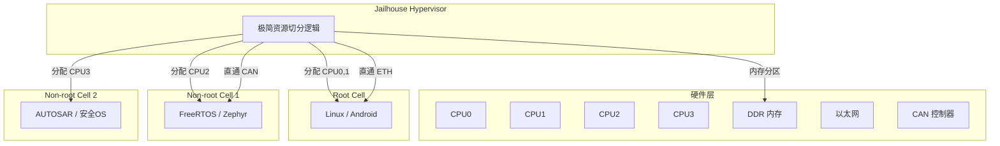
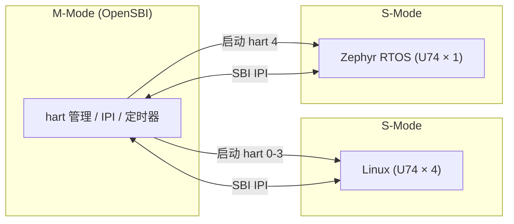

# 前沿Jailhouse虚拟化与生态演进

<span class="badge-e">[E]</span> <span class="badge-m">[M]</span>

---

### Jailhouse 的定位

前面五节讲的都是"一颗芯片上两个核各跑各的系统"。如果核的数量变成十几个，系统种类超过三种，裸机AMP的管理复杂度会爆炸。虚拟化技术就在这时登场。

<span class="red">Jailhouse（狱舍）</span>是一种裸金属分区虚拟化方案（Type-1 Hypervisor），由德国西门子主导开发。它的设计哲学极其精简：**没有调度器，没有模拟设备，只做一件事——把硬件资源切成几份，分给不同的Cell（分区）**。

与Xen/KVM的对比：

| 特性 | Jailhouse (Type-1) | Xen (Type-1) | KVM (Type-2) |
|------|-------------------|--------------|--------------|
| 调度策略 | 无全局调度，各Cell自主 | Dom0 协调 | Linux 内核调度 |
| 设备模型 | 直通（Pass-through）为主 | 半虚拟化/直通 | 半虚拟化/直通 |
| 代码量 | ~10K 行 | ~200K+ 行 | 内核模块 |
| 启动时间 | 数百微秒 | 数秒 | 毫秒级 |
| 实时性 | 硬实时（无VM Exit干扰） | 需RT-Xen补丁 | 差（VM Exit开销） |
| 适用场景 | 工业控制、汽车ECU | 云服务器虚拟化 | 桌面/服务器虚拟化 |

Jailhouse之所以叫"狱舍"，是因为每个Cell像一间独立牢房——有自己的CPU、内存、设备，彼此隔离，互不干扰。Root Cell跑Linux管理非实时任务，Non-root Cell跑RTOS处理硬实时任务。

---

### Cell 分区模型

Jailhouse的最小部署单元是Cell。系统启动时先加载Jailhouse hypervisor，然后由Root Cell启动其他Cell。



Root Cell是第一个被创建的Cell，它拥有全部硬件资源的管理权限。加载Jailhouse后，Root Cell主动"出让"一部分CPU、内存、中断给Non-root Cell，自己继续跑Linux。Non-root Cell的创建只需要一个配置文件（.cell），不需要修改Linux内核。

Cell配置文件的片段：

```c
/* inmate.cell —— Non-root Cell 配置 */
struct {
    .name = "rtos-inmate",
    .cpu_set_size = 1,
    .cpu_set = { 0x04 },       /* 绑定 CPU2 */
    .mem_regions_count = 1,
    .mem_regions = {
        {
            .phys_start = 0x82000000,
            .virt_start = 0x82000000,
            .size       = 0x08000000,  /* 128MB */
            .flags = JAILHOUSE_MEM_READ | JAILHOUSE_MEM_WRITE
        }
    },
    .irqchips = {
        {
            .address = 0x38800000,     /* GIC 基址 */
            .pin_base = 32,
            .pin_bitmap = { 0x00000001 } /* 只接管中断 32 */
        }
    }
};
```

<span class="blue">Jailhouse的隔离是硬件级别的。每个Cell运行在自己的虚拟机上下文里，Hypervisor只负责 trapped access（越权访问）时触发错误。没有共享驱动，没有虚拟设备队列，所以延迟极低。</span><br>

---

### 工业案例：汽车 zonal ECU

汽车电子是Jailhouse最重要的落地场景。现代汽车从分布式ECU（几十个独立控制器）转向zonal架构（几个中央计算单元），每个计算单元上要同时跑娱乐系统、安全控制、车身管理——这三者绝对不能互相干扰。

<span class="red">zonal ECU 的 Jailhouse 部署示意：</span><br>

| Cell | 系统 | 绑定核 | 职责 | 安全等级 |
|------|------|--------|------|----------|
| Root | Linux Android Automotive | A72×2 | 导航、娱乐、语音 | QM (非安全) |
| Non-root 1 | FreeRTOS AUTOSAR | R52×2 | 刹车、转向、气囊 | ASIL-D |
| Non-root 2 | Zephyr | R52×1 | 车身控制、灯光 | ASIL-B |

NXP S32G3是专为这类场景设计的芯片：四核Cortex-A53 + 四核Cortex-M7 + 双核Cortex-R52，片上集成Lock-step核用于安全校验。Jailhouse把A53分给Linux做座舱，R52分给AUTOSAR做底盘控制，硬件级隔离确保娱乐系统死机不会导致刹车失灵。

类比：Jailhouse像一栋楼的消防分区。每层有独立防火墙（Cell边界），电梯（共享资源）由管理员（Hypervisor）统一调度。即使一层着火，火势不会蔓延到其他分区。

---

### RISC-V AMP 现状

ARM不是唯一的选择。RISC-V的开放ISA为异构多核带来了新的可能性。

<span class="red">SiFive Freedom U740</span>是目前最成熟的RISC-V异构平台：四核SiFive U74（应用核）+ 一个S7管理核。不同于ARM的big.LITTLE，RISC-V的异构更灵活——你可以自己设计协处理器核，挂到同一个AXI总线上，只要它支持RISC-V调试协议。

RISC-V的多核启动由**OpenSBI**（RISC-V Supervisor Binary Interface）管理。OpenSBI运行在M-mode（机器模式），负责：

- 启动时把各个hart（硬件线程）分给不同操作系统<br>
- 提供IPI（核间中断）的标准接口<br>
- 处理安全监控调用（SBI ecall）<br>



RISC-V AMP的挑战在于生态。RPMsg和OpenAMP可以移植到RISC-V，但remoteproc需要芯片厂商提供特定的复位/加载驱动。目前国内平头哥（T-Head）的C906/C910系列已有Linux主线支持，但异构AMP的成熟度还不及ARM。

---

### OpenAMP 项目演进与生态工具链

异构多核通信的软件栈也在快速演进。

<span class="red">OpenAMP 生态组件：</span><br>

| 组件 | 定位 | 演进方向 |
|------|------|----------|
| libmetal | 硬件抽象层（MMU、cache、中断、内存） | 支持更多芯片平台，RISC-V适配中 |
| rpmsg-lite | 轻量版RPMsg，适用于M0+/M4小内存 | 代码量&lt;8KB，支持零拷贝 |
| OpenAMP | 完整virtio+rpmsg+remoteproc实现 | 与Zephyr深度集成 |
| Linux remoteproc | 内核态固件加载 | 新增自动恢复、热升级 |

Zephyr RTOS从2.4版本开始原生支持OpenAMP。这意味着你可以在Zephyr里直接调用`rpmsg_service_init()`，而不需要手动链接libmetal和rpmsg-lite。Zephyr的设备树（devicetree）系统还允许通过Kconfig开关配置vring大小和端点数量。

```c
/* Zephyr 侧初始化示例 */
#include <zephyr/kernel.h>
#include <zephyr/drivers/ipm.h>
#include <openamp/rpmsg_service.h>

static void ep_bound(void *priv)
{
    LOG_INF("RPMsg endpoint bound");
}

static int endpoint_cb(void *priv, void *data, size_t len, uint32_t src, void *priv_data)
{
    LOG_INF("Received %zu bytes", len);
    rpmsg_service_send(src, data, len);  /* echo back */
    return RPMSG_SUCCESS;
}

void main(void)
{
    ipm = DEVICE_DT_GET(DT_NODELABEL(mailbox));
    rpmsg_service_register_endpoint("zephyr-echo", endpoint_cb, ep_bound, NULL);
}
```

未来趋势时间线：<br>

| 年份 | 里程碑 |
|------|--------|
| 2016 | OpenAMP 从 Xilinx 捐赠给 Linux Foundation |
| 2019 | rpmsg-lite 发布，面向资源受限MCU |
| 2021 | Jailhouse 主线支持 ARM64，进入汽车量产 |
| 2022 | Zephyr 原生集成 OpenAMP，告别手动链接 |
| 2024 | RISC-V AMP 进入 Linux 主线讨论，OpenSBI hart 热插拔提案 |
| 2026 | 预计：Jailhouse 支持 RISC-V，zonal ECU 架构成为汽车标配 |

<span class="blue">异构多核已经从"高端芯片的特殊技能"变成了"嵌入式系统的默认配置"。无论ARM还是RISC-V，掌握AMP部署能力将成为嵌入式工程师的标配。</span><br>

---

**学习路径提示**：<br>
- <span class="badge-e">[E]</span> 读者：尝试在支持的硬件上部署一次Jailhouse，体验Cell分区配置。对比裸机AMP和Jailhouse AMP的管理复杂度。<br>
- <span class="badge-m">[M]</span> 读者：关注RISC-V AMP标准化进展、OpenAMP的Zephyr集成深度、汽车zonal ECU的安全认证（ISO 26262）。这些是异构多核领域未来3年的关键变量。<br>
- 至此，`10.2 异构多核通信`六节全部结束。从硬件到协议、从加载到部署、从当前到未来，构成了一条完整的异构多核学习路径。
