# B-A.1.2 PWM脉宽调制 [知识点266-267]

> 所属章节：第五部 B. 总线协议 > B-A.1 常见总线与接口基础
>
> 难度：[B] Beginner | 预计阅读时间：25分钟

## <span class="blue"> 本节导读

PWM（Pulse Width Modulation，脉宽调制）是嵌入式系统中最基础的模拟量"数字分身"技术。LED调光、电机调速、蜂鸣器发声、舵机控制、LCD背光调节——这些看似需要模拟电路才能完成的任务，PWM用一串高低电平的方波就全搞定了。本节从PWM的物理原理讲起，带你理解周期、占空比、极性这些核心概念，再深入到Linux PWM子系统的软件架构，最后用两个完整的行业实例（LCD背光 + 直流电机调速）打通从设备树配置到用户空间控制的全链路。读完这一节，你就能自己动手做一个亮度可调的背光板和转速可控的小风扇。

<br>

## <span class="blue"> 知识点266：PWM原理 [B]

### 什么是PWM？

PWM的核心思想可以用一句话概括：**通过改变数字方波的高电平持续时间，来模拟不同的平均电压输出**。想象一下，你有一个5V的电源和一个开关，如果你让开关以极快的速度开合，使得50%的时间导通、50%的时间断开，那么负载感受到的平均电压就是2.5V。占空比75%？平均电压就是3.75V。这就是PWM的魔法——纯数字手段实现模拟控制。

### 周期、频率与占空比

这三个参数是PWM的灵魂，缺一不可：

| 参数 | 说明 | 计算公式 | 典型值 |
|------|------|----------|--------|
| **周期（Period）** | 一个完整PWM波形的时间长度 | T = 1 / f | 50μs（20kHz时） |
| **频率（Frequency）** | 每秒完成的周期数 | f = 1 / T | 1Hz ~ 几十MHz |
| **占空比（Duty Cycle）** | 高电平时间占整个周期的百分比 | D = (t_on / T) × 100% | 0% ~ 100% |
| **脉宽（Pulse Width）** | 单个周期内高电平的持续时间 | t_on = D × T | 可变 |
| **分辨率（Resolution）** | 占空比可调节的最小粒度 | 取决于定时器位数 | 8bit/10bit/12bit |

PWM的频率选择是个平衡游戏。频率太低，LED会频闪、电机会抖动发出刺耳的啸叫声；频率太高，MOSFET的开关损耗会急剧增加，发热严重。后文的"陷阱"部分有更详细的说明。

### 极性（Polarity）

极性定义了PWM信号的有效电平：

- **Active High（正极性）**：高电平为"有效"状态。占空比80%意味着高电平占80%。这是最常用的模式。
- **Active Low（负极性）**：低电平为"有效"状态。占空比80%意味着低电平占80%。某些LED驱动或电机驱动芯片需要这种极性。

> 💡 **提示**：在配置PWM时，务必确认你的外设 datasheet 要求的极性。很多初学者在驱动有源低电平LED时，因为极性配反而怎么调占空比都是反的，浪费大把调试时间。

### PWM波形示意

```mermaid
%%{init: {'theme': 'base', 'themeVariables': { 'primaryColor': '#e1f5fe', 'primaryTextColor': '#01579b', 'primaryBorderColor': '#0288d1', 'lineColor': '#0288d1', 'secondaryColor': '#fff3e0', 'tertiaryColor': '#e8f5e9'}}}%%
graph LR
    subgraph "PWM波形示意图"
        direction LR
        
        subgraph "50% 占空比（Active High）"
            A0["0V"] -->|"↑"| B0["5V"]
            B0 -->|"T/2"| C0["5V"]
            C0 -->|"↓"| D0["0V"]
            D0 -->|"T/2"| E0["0V"]
            E0 -.->|"周期 T"| A0
            style B0 fill:#4caf50,stroke:#2e7d32,color:#fff
            style C0 fill:#4caf50,stroke:#2e7d32,color:#fff
        end
        
        subgraph "25% 占空比（Active High）"
            A1["0V"] -->|"↑"| B1["5V"]
            B1 -->|"T/4"| C1["5V"]
            C1 -->|"↓"| D1["0V"]
            D1 -->|"3T/4"| E1["0V"]
            E1 -.->|"周期 T"| A1
            style B1 fill:#ff9800,stroke:#ef6c00,color:#fff
            style C1 fill:#ff9800,stroke:#ef6c00,color:#fff
        end
        
        subgraph "75% 占空比（Active Low）"
            A2["5V"] -->|"↓"| B2["0V"]
            B2 -->|"T/4"| C2["0V"]
            C2 -->|"↑"| D2["5V"]
            D2 -->|"3T/4"| E2["5V"]
            E2 -.->|"周期 T"| A2
            style B2 fill:#f44336,stroke:#c62828,color:#fff
            style C2 fill:#f44336,stroke:#c62828,color:#fff
        end
    end
```



<br>

### PWM模式对比

MCU内部的定时器通常支持两种PWM输出模式：

| 模式 | 工作原理 | 特点 | 适用场景 |
|------|----------|------|----------|
| **Edge-aligned（边沿对齐）** | 计数器从0递增至ARR后归零，仅在向上计数过程中比较匹配时翻转电平 | 实现简单，占用定时器资源少，谐波含量较高 | 普通LED调光、简单电机调速、通用PWM输出 |
| **Center-aligned（中心对齐）** | 计数器先递增至ARR再递减至0，在向上/向下计数时各比较匹配一次 | 谐波含量低，波形对称性好，降低电机转矩脉动 | 无刷电机FOC控制、精密电机驱动、H桥逆变 |

边沿对齐模式是大多数应用场景的"默认选择"，配置简单，几乎所有MCU都支持。中心对齐模式则在对称性和谐波抑制方面有优势，特别适合电机控制场景。

### 互补输出与死区时间

当PWM用于驱动H桥或半桥电路时，同一桥臂的上下两个MOSFET**绝对不能同时导通**——否则电源直接对地短路，管子瞬间冒烟。为了防止这种悲剧，PWM控制器提供了两个关键机制：

**互补输出**：PWM通道可以输出两路完全相反的信号（PWM和PWM̄）。当上管导通时，下管必须关断，反之亦然。

**死区时间（Dead Time）**：在互补输出的两路信号之间插入一小段"全关"的时间窗口（通常几百纳秒到几微秒），确保上管完全关断后下管才开始导通。死区时间的长度需要根据MOSFET的开关特性（特别是关断延迟t_off）来精确计算。

```
        PWM (上管驱动)
        ┌──┐     ┌──┐
        │  │     │  │
    ────┘  └─────┘  └────
        
        PWM̄ (下管驱动)
    ────┐  ┌─────┐  ┌────
        │  │     │  │
        └──┘     └──┘
        ↑死区↑   ↑死区↑
        
    两管同时关断的安全窗口
```

> ⚠️ **陷阱**：死区时间设置太短，上下管可能短暂直通导致短路；设置太长，输出电压的有效时间会缩短，电机低速时转矩明显不足。一般从500ns开始调试，用示波器观察两路波形的交叠情况。

<br>

## <span class="blue"> 知识点267：Linux PWM子系统 [B]

### 子系统架构

Linux内核的PWM子系统采用统一的框架设计，将底层硬件差异抽象掉，向用户空间提供一致的访问接口。

核心数据结构：

- **pwmchip**：一个PWM控制器（chip）可以管理多路PWM通道。比如STM32的TIM3定时器可以输出4路PWM，就是一个pwmchip，包含4个PWM通道。
- **pwm_period**：PWM周期，单位是纳秒（ns）。比如20kHz对应的period = 50000ns。
- **pwm_duty_cycle**：有效电平的持续时间，单位也是纳秒。duty_cycle = period时，占空比就是100%。

### Sysfs接口

从Linux 4.x开始，PWM子系统通过sysfs暴露控制接口。这是目前最常用、最直接的PWM控制方式。

每个pwmchip在sysfs中的路径：

```
/sys/class/pwm/pwmchip0/          # 第0个PWM控制器
    ├── npwm                      # 该控制器支持的通道数
    ├── export                    # 导出某个通道（echo 0 > export 导出通道0）
    ├── unexport                  # 释放通道
    └── pwm0/                     # 导出的通道0
        ├── period                # 周期（写入纳秒值）
        ├── duty_cycle            # 有效时间（写入纳秒值）
        ├── enable                # 使能/禁用（echo 1 > enable 开启输出）
        └── polarity              # 极性（"normal"或"inversed"）
```

典型的控制流程：

```bash
# 1. 导出PWM通道
echo 0 > /sys/class/pwm/pwmchip0/export

# 2. 设置周期（20kHz = 50000纳秒）
echo 50000 > /sys/class/pwm/pwmchip0/pwm0/period

# 3. 设置占空比（50% = 25000纳秒）
echo 25000 > /sys/class/pwm/pwmchip0/pwm0/duty_cycle

# 4. 使能PWM输出
echo 1 > /sys/class/pwm/pwmchip0/pwm0/enable

# 5. 动态调整占空比（不需要disable，直接写入新值）
echo 37500 > /sys/class/pwm/pwmchip0/pwm0/duty_cycle
```

### 字符设备接口（PWM Consumer API）

内核驱动代码中，使用`pwm_*`系列函数来请求和控制PWM：

```c
#include <linux/pwm.h>

struct pwm_device *pwm;

// 从设备树获取PWM
pwm = devm_pwm_get(&pdev->dev, NULL);
if (IS_ERR(pwm))
    return PTR_ERR(pwm);

// 配置PWM参数
struct pwm_state state = {
    .period = 50000,        // 20kHz，单位ns
    .duty_cycle = 25000,    // 50%占空比
    .enabled = true,
    .polarity = PWM_POLARITY_NORMAL,
};
pwm_apply_state(pwm, &state);

// 释放PWM（devm_系列会自动释放）
```

### 设备树配置

设备树中，PWM控制器和PWM使用者通过`pwms`属性关联：

```dts
// PWM控制器节点（以STM32 TIM3为例）
timers3: timer@40000400 {
    compatible = "st,stm32-pwm";
    reg = <0x40000400 0x400>;
    clocks = <&rcc TIM3_K>;
    interrupts = <29>;
    status = "okay";

    pwm {
        compatible = "st,stm32-pwm";
        #pwm-cells = <3>;    // 引用时需要3个参数
    };
};

// PWM使用者节点（背光驱动）
backlight: backlight {
    compatible = "pwm-backlight";
    pwms = <&timers3 1 50000 PWM_POLARITY_NORMAL>;  // <控制器 通道 周期 极性>
    brightness-levels = <0 5 10 20 40 60 80 100>;
    default-brightness-level = <5>;
    status = "okay";
};
```

`#pwm-cells = <3>`表示引用这个控制器时需要3个参数：通道号、周期（纳秒）、极性标志。

<br>

## <span class="blue"> 行业实例：LCD背光亮度调节 + 直流电机调速

### 实例一：LCD背光亮度调节

嵌入式设备的LCD屏幕背光通常由一颗PWM控制的LED驱动芯片来驱动。人眼对低于约60Hz的闪烁非常敏感，所以背光PWM频率必须远高于这个阈值。

**硬件接线**：

```
SoC PWM引脚 (TIM3_CH1, PA6)
        │
        │  PWM信号 (20kHz)
        ▼
┌──────────────────┐
│  LED驱动芯片     │
│  (如MP3302/RT8546)│
│                  │
│  PWM输入 ──► 恒流 │──► LED灯串 (3串8并)
│  调光逻辑    驱动  │    19.2V/120mA
└──────────────────┘
```

**完整设备树配置**：

```dts
/ {
    backlight: backlight {
        compatible = "pwm-backlight";
        pwms = <&timers3 0 50000 PWM_POLARITY_NORMAL>;
                        /* │   │    │
                           │   │    └── 极性：正极性
                           │   └─────── 周期：50000ns = 20kHz
                           └────────── 通道：TIM3_CH1 (通道0)
                        */
        brightness-levels = <
            0   10  20  30  40  50  60  70
            80  90  100 110 120 130 140 150
            160 170 180 190 200 210 220 230
            240 250
        >;
        /* 26级亮度，从完全熄灭到最亮 */

        default-brightness-level = <12>;
        /* 默认亮度：第12级（约50%亮度） */

        status = "okay";
    };
};
```

**Sysfs控制代码（用户空间）**：

```c
#include <stdio.h>
#include <stdlib.h>
#include <string.h>
#include <unistd.h>
#include <fcntl.h>

#define PWM_CHIP    "/sys/class/pwm/pwmchip0"
#define PWM_CHANNEL PWM_CHIP "/pwm0"

/* 写入sysfs文件 */
int write_sysfs(const char *path, const char *value)
{
    int fd = open(path, O_WRONLY);
    if (fd < 0) {
        perror("open");
        return -1;
    }
    int ret = write(fd, value, strlen(value));
    close(fd);
    return (ret < 0) ? -1 : 0;
}

/* 初始化PWM：20kHz，初始占空比0% */
int pwm_init(unsigned long period_ns, unsigned long duty_ns)
{
    char buf[32];

    /* 导出PWM通道 */
    write_sysfs(PWM_CHIP "/export", "0");
    usleep(100000);  /* 等待内核创建sysfs节点 */

    /* 设置周期 */
    snprintf(buf, sizeof(buf), "%lu", period_ns);
    write_sysfs(PWM_CHANNEL "/period", buf);

    /* 设置初始占空比 */
    snprintf(buf, sizeof(buf), "%lu", duty_ns);
    write_sysfs(PWM_CHANNEL "/duty_cycle", buf);

    /* 使能输出 */
    write_sysfs(PWM_CHANNEL "/enable", "1");

    printf("PWM initialized: %luns period (%.1fkHz), duty=%luns\n",
           period_ns, 1000000000.0/period_ns, duty_ns);
    return 0;
}

/* 设置占空比百分比 0~100 */
int pwm_set_duty_percent(int percent)
{
    char buf[32];
    unsigned long duty;

    if (percent < 0) percent = 0;
    if (percent > 100) percent = 100;

    /* period = 50000ns，duty按比例计算 */
    duty = 50000UL * percent / 100;

    snprintf(buf, sizeof(buf), "%lu", duty);
    return write_sysfs(PWM_CHANNEL "/duty_cycle", buf);
}

int main(int argc, char *argv[])
{
    /* 初始化：20kHz，初始0%亮度 */
    pwm_init(50000, 0);

    printf("Breathing LED demo: fade in then fade out\n");

    /* 呼吸灯效果：渐亮 */
    for (int i = 0; i <= 100; i += 2) {
        pwm_set_duty_percent(i);
        usleep(20000);  /* 20ms步进 */
    }

    /* 呼吸灯效果：渐暗 */
    for (int i = 100; i >= 0; i -= 2) {
        pwm_set_duty_percent(i);
        usleep(20000);
    }

    /* 关闭 */
    pwm_set_duty_percent(0);
    write_sysfs(PWM_CHANNEL "/enable", "0");
    write_sysfs(PWM_CHIP "/unexport", "0");

    return 0;
}
```

**编译与运行**：

```bash
# 交叉编译
arm-linux-gnueabihf-gcc pwm_backlight.c -o pwm_backlight

# 拷贝到目标板运行
./pwm_backlight
# 输出：
# PWM initialized: 50000ns period (20000.0kHz), duty=0ns
# Breathing LED demo: fade in then fade out
```

**验证步骤**：

1. 示波器测量PWM引脚，确认频率为20kHz，占空比随程序变化
2. 肉眼观察LCD屏幕，确认无明显频闪（用手机相机对准屏幕，不应出现滚动条纹）
3. 用光度计测量亮度，验证亮度与占空比基本成线性关系

### 实例二：直流电机调速

直流电机的转速与施加的平均电压成正比，这正是PWM的拿手好戏。

**硬件接线**：

```
SoC PWM引脚 (TIM4_CH2, PB7)
        │
        │  PWM信号 (10kHz)
        ▼
┌──────────────────┐
│  H桥驱动芯片     │
│  (如TB6612/L298N) │
│                  │
│  PWM ──► 内部    │──► 直流电机 (12V有刷)
│  逻辑    功率驱动 │    额定3000RPM
└──────────────────┘
```

**带加减速曲线的电机控制代码**：

```c
#include <stdio.h>
#include <stdlib.h>
#include <unistd.h>
#include <math.h>

#define MOTOR_PWM_CHIP    "/sys/class/pwm/pwmchip1"
#define MOTOR_PWM         MOTOR_PWM_CHIP "/pwm0"

/* 加速曲线：S型加减速，减少对电机和驱动器的冲击 */
void motor_set_speed_with_ramp(int target_percent)
{
    static int current_percent = 0;
    char buf[32];

    /* 每步变化不超过5%，每步间隔50ms */
    int step = (target_percent > current_percent) ? 5 : -5;

    while (current_percent != target_percent) {
        if (abs(target_percent - current_percent) < abs(step))
            current_percent = target_percent;
        else
            current_percent += step;

        /* 10kHz周期 = 100000ns */
        unsigned long duty = 100000UL * current_percent / 100;
        snprintf(buf, sizeof(buf), "%lu", duty);

        int fd = open(MOTOR_PWM "/duty_cycle", O_WRONLY);
        if (fd >= 0) {
            write(fd, buf, strlen(buf));
            close(fd);
        }

        printf("Motor speed: %d%% (duty=%luns)\n", current_percent, duty);
        usleep(50000);  /* 50ms步进 */
    }
}

int main(void)
{
    char buf[32];

    /* 初始化：10kHz */
    write_sysfs(MOTOR_PWM_CHIP "/export", "0");
    usleep(100000);
    write_sysfs(MOTOR_PWM "/period", "100000");  /* 10kHz */
    write_sysfs(MOTOR_PWM "/duty_cycle", "0");
    write_sysfs(MOTOR_PWM "/enable", "1");

    printf("=== DC Motor Speed Control Demo ===\n");

    /* 加速到80% */
    printf("\n[Accelerating to 80%%]\n");
    motor_set_speed_with_ramp(80);
    sleep(3);

    /* 减速到30% */
    printf("\n[Decelerating to 30%%]\n");
    motor_set_speed_with_ramp(30);
    sleep(3);

    /* 全速 */
    printf("\n[Full speed 100%%]\n");
    motor_set_speed_with_ramp(100);
    sleep(2);

    /* 停止 */
    printf("\n[Stop]\n");
    motor_set_speed_with_ramp(0);
    write_sysfs(MOTOR_PWM "/enable", "0");

    return 0;
}
```

> 💡 **提示**：LCD背光用 >20kHz 避开人眼频闪，电机用 >10kHz 避开音频啸叫。如果电机在1kHz~8kHz范围内运行，你大概率会听到一种高频"吱吱"的尖叫声——这是PWM脉冲在驱动电机线圈时产生的音频谐波。提高频率到10kHz以上，人就听不到了。

> ⚠️ **陷阱**：PWM频率太低 → LED频闪/电机啸叫；频率太高 → 开关损耗增加，MOSFET发热严重。一般IGBT器件不超过20kHz，MOSFET可以到100kHz以上。选定频率后，务必在满载条件下测量驱动芯片/MOSFET的温升。

<br>

### 两个实例的关键参数对比

| 参数 | LCD背光调节 | 直流电机调速 |
|------|-------------|--------------|
| **PWM频率** | 20kHz（>人眼感知上限） | 10kHz（>音频范围下限） |
| **周期** | 50000ns | 100000ns |
| **占空比范围** | 0% ~ 100% | 0% ~ 100% |
| **分辨率需求** | 8bit（256级足够平滑） | 8bit即可 |
| **极性** | Active High | Active High |
| **驱动方式** | 直接驱动LED恒流芯片 | 经H桥驱动电机 |
| **调速曲线** | 线性或人眼对数曲线 | S型加减速曲线 |
| **关键考量** | 无频闪、低EMI | 无啸叫、转矩平稳 |

<br>

## <span class="blue"> 调试技巧与常见问题

### 常用调试命令

```bash
# 查看系统所有PWM控制器
ls /sys/class/pwm/

# 查看某个控制器支持的通道数
cat /sys/class/pwm/pwmchip0/npwm

# 查看当前PWM状态
cat /sys/class/pwm/pwmchip0/pwm0/period
cat /sys/class/pwm/pwmchip0/pwm0/duty_cycle
cat /sys/class/pwm/pwmchip0/pwm0/enable
cat /sys/class/pwm/pwmchip0/pwm0/polarity

# dmesg查看PWM相关日志
dmesg | grep -i pwm

# 用devmem直接读定时器寄存器（调试用）
devmem 0x40000400 32    # TIM3_CR1
devmem 0x40000434 32    # TIM3_CCR1（捕获比较寄存器）
```

### 示波器测量要点

1. **确认频率**：测量周期是否为预期值（如20kHz应为50μs）
2. **确认占空比**：高电平时间是否随写入值变化
3. **检查极性**：确认Active High/ Low 与代码设置一致
4. **观察上升沿**：检查有无过冲、振铃（布线过长或缺少RC吸收）
5. **互补输出时**：两路信号之间是否有足够死区时间，无交叠

<br>

## <span class="blue"> 本节总结

| 内容 | 要点 |
|------|------|
| **PWM三要素** | 周期（T）、频率（f=1/T）、占空比（D=t_on/T） |
| **极性** | Active High：高电平有效；Active Low：低电平有效 |
| **两种模式** | 边沿对齐（简单通用） vs 中心对齐（低谐波、电机FOC） |
| **互补输出** | H桥驱动必备，配合死区时间防止上下管直通短路 |
| **Linux接口** | sysfs（/sys/class/pwm/pwmchip*/pwm*/）或内核pwm_* API |
| **背光频率** | ≥20kHz，避开人眼频闪，占空比0-100%调光 |
| **电机频率** | ≥10kHz，避开音频啸叫，加减速曲线防止冲击 |

<br>

## <span class="blue"> 下一步

PWM让你能用数字手段控制"模拟量"，但世界是模拟的，嵌入式系统常常需要反过来——将模拟信号转换成数字量。下一节我们将学习 **B-A.1.3 ADC模数转换**，看看如何用ADC读取温度传感器、电池电压、光照强度等模拟信号，配合本节的PWM输出，你就能实现完整的闭环控制了。

<br>

## <span class="blue"> 配套资源

- **内核文档**：`Documentation/devicetree/bindings/pwm/pwm.txt`
- **PWM子系统源码**：`drivers/pwm/core.c`、`include/linux/pwm.h`
- **pwm-backlight驱动**：`drivers/video/backlight/pwm_bl.c`
- **STM32 PWM参考手册**：RM0433 参考手册 Timer章节
- **推荐阅读**：Linux Device Drivers, Chapter 18 - PWM子系统概述
