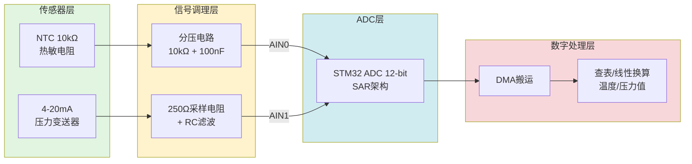

# B-A.1.3 ADC模数转换 [知识点268-269]

> 所属章节：第五部 B. 总线协议 > B-A.1 基础通信与转换协议
>
> 难度：[B] Beginner | 预计阅读时间：35分钟

## <span class="blue"> 本节导读

上一节我们掌握了PWM——数字世界对模拟世界的" fingers crossed "式控制。本节要聊的是反向过程：**ADC（Analog-to-Digital Converter，模数转换器）**——把连续变化的模拟电压变成CPU能读懂的数字。温度传感器、压力变送器、电池电压监测、音频采集……几乎所有"感知物理世界"的场景都离不开ADC。你将理解ADC的核心参数如何影响测量精度，学会在Linux下通过IIO子系统读取ADC值，并通过两个完整的工业实例（NTC热敏电阻测温 + 4-20mA传感器采集）把理论落地。

<br>

## <span class="blue"> ADC基础原理 [B]

### 分辨率、采样率与参考电压

ADC的"体检报告"看三个核心指标：

| 分辨率 | LSB @ 3.3V | 精度 | 典型适用场景 |
|:---:|:---:|:---:|:---|
| 8-bit | 12.89 mV | ±1% | 电池电量指示、简易按键检测 |
| 10-bit | 3.22 mV | ±0.5% | 消费级温度监测、光强检测 |
| 12-bit | 0.81 mV | ±0.1% | 工业传感器、电机电流采样 |
| 16-bit | 50.35 µV | ±0.01% | 精密仪器、音频采集、称重 |
| 24-bit | 0.20 µV | ±0.001% | 高精度秤、医疗级传感器（Sigma-Delta） |

> 💡 **提示**：**LSB（Least Significant Bit）** = Vref / 2^n。这是ADC能分辨的最小电压变化。12-bit ADC在3.3V参考电压下，理论分辨率为0.81mV。但别高兴太早——实际精度还受噪声、温漂、参考电压稳定性影响，**有效位数（ENOB）** 通常比标称分辨率低2~4位。

**采样率（Sampling Rate）** 是ADC每秒钟能完成多少次转换，单位SPS（Samples Per Second）。采样定理告诉你：要 faithful 还原一个信号，采样率至少是信号最高频率的 **2倍**（奈奎斯特准则）。实际工程中通常取 **5~10倍** 留安全裕量。

**采样时间（Sampling Time）** 是ADC内部采样保持电容充电到与输入电压持平所需的时间。输入阻抗越高、信号源内阻越大，需要的采样时间越长。如果采样时间设置太短，电容还没充到位就开始转换，结果就会偏低——这个坑很多人在调试高阻抗传感器时踩过。

**参考电压（Vref）** 是ADC的"尺子"。数字值 = (Vin / Vref) × 2^n。Vref不稳，所有读数跟着漂移。内部参考温漂大（±20~50mV），精密场合必须用外部精密基准源（如REF3333，温漂仅3ppm/°C）。

> ⚠️ **陷阱**：**参考电压不稳定 → 所有读数集体漂移**。
> 某项目中团队花了一周排查"ADC跳变"，最后发现是Vref引脚走线太长、旁边有高速数字信号串扰。换成独立基准源+π型滤波后问题解决。务必在原理图上给Vref留足滤波电容（10µF + 100nF），Layout时远离高速走线。

<br>

### ADC架构：SAR vs Sigma-Delta vs Pipeline

```
┌─────────────────────────────────────────────────────────┐
│                     ADC 架构对比总览                      │
├─────────────┬──────────────┬──────────────┬─────────────┤
│   SAR ADC   │ Sigma-Delta  │   Pipeline   │    Flash    │
├─────────────┼──────────────┼──────────────┼─────────────┤
│ 逐次逼近    │ 过采样+噪声   │ 多级流水线    │ 并行比较    │
│             │ 整形          │              │             │
├─────────────┼──────────────┼──────────────┼─────────────┤
│ 中等速度    │ 低速高精度    │ 高速中精度    │ 超高速低精  │
│ 1 MSPS      │ 1~10 kSPS    │ 10~500 MSPS  │ >1 GSPS     │
├─────────────┼──────────────┼──────────────┼─────────────┤
│ 12~16 bit   │ 16~24 bit    │ 8~14 bit     │ 4~8 bit     │
├─────────────┼──────────────┼──────────────┼─────────────┤
│ MCU内置首选 │ 精密测量     │ 通信/视频    │ 示波器前端  │
└─────────────┴──────────────┴──────────────┴─────────────┘
```

| 特性 | SAR ADC | Sigma-Delta | Pipeline | Flash |
|:---|:---|:---|:---|:---|
| **工作原理** | 逐位比较，二分搜索 | 过采样+噪声整形+数字滤波 | 多级级联，流水线处理 | 2^n个比较器并行比较 |
| **速度** | 中等（~1 MSPS） | 慢（~kSPS级） | 快（~100 MSPS） | 极快（>1 GSPS） |
| **分辨率** | 8~16 bit | 16~24 bit | 8~14 bit | 4~8 bit |
| **功耗** | 低（µA~mA级） | 中（数字滤波耗电） | 高（多级运放） | 极高（2^n个比较器） |
| **延迟** | 单周期，确定性 | 高（数字滤波延迟） | 流水线延迟，确定性 | 单周期 |
| **成本** | 低 | 中 | 高 | 极高 |
| **典型应用** | 通用MCU内置ADC | 高精度传感器、音频 | 通信基带、视频 | 高速示波器 |

**SAR（逐次逼近型）** 是嵌入式MCU中最常见的架构——STM32、i.MX、MSP430等内置的ADC基本都是SAR型。它像"猜数字游戏"：先拿中点电压跟输入比，确定最高位；再对半分，确定次高位……n位分辨率只需n个时钟周期。速度快、功耗低、成本低，是嵌入式系统的"性价比之王"。

**Sigma-Delta（Σ-Δ）** 走的是另一条路：用远低于奈奎斯特频率的采样率（过采样），配合噪声整形把量化噪声推到高频，再用数字滤波器滤掉。牺牲速度换精度，轻松做到20bit以上有效分辨率。精密测量、音频ADC、工业称重全靠它。

> 💡 **提示**：选ADC架构的核心公式——**精度 × 速度 = 预算**。高精度+高速同时满足？加钱。嵌入式项目里SAR型12-bit ADC覆盖80%的场景，别为用而用Σ-Δ。

<br>

### 多通道扫描与DMA传输

实际项目中很少只采一个通道。STM32F4的ADC有 **16~19个外部通道 + 3个内部通道**（温度传感器、Vrefint、VBAT）。多通道采集有两种模式：

**规则组扫描模式（Scan Mode）**：按配置好的通道序列依次转换，结果存在DR寄存器。CPU需要每次转换完读一次DR——低效，且容易丢数据。

**扫描 + DMA 模式**：DMA自动把每次转换结果搬到内存数组，全部通道转换完再中断CPU。这是标准做法：

```
通道0 → ADC转换 → DMA搬运到 buffer[0]
通道1 → ADC转换 → DMA搬运到 buffer[1]
通道2 → ADC转换 → DMA搬运到 buffer[2]
  ...
全部完成 → DMA中断 → CPU一次性处理 buffer[]
```

DMA的循环模式（Circular Mode）更香——buffer满后自动从头覆盖，CPU在后台用最新数据即可，实现真正的"零拷贝"连续采集。

<br>

## <span class="blue"> Linux IIO子系统 [B]

### IIO架构：iio_device 与 iio_channel

Linux内核里管ADC的叫 **IIO（Industrial I/O）** 子系统。名字带"Industrial"，其实它管的不只是工业传感器——温度、压力、加速度、光照、ADC/DAC等模拟量设备都归它管。

```
┌──────────────────────────────────────────┐
│              用户空间                      │
│   sysfs (/sys/bus/iio/)  / 字符设备       │
├──────────────────────────────────────────┤
│            IIO 核心层                     │
│   iio_device_alloc / iio_device_register │
├──────────────────────────────────────────┤
│          ADC 驱动 (Provider)              │
│   读寄存器 → 原始值 → iio_push_to_buffers│
├──────────────────────────────────────────┤
│            硬件 ADC                       │
└──────────────────────────────────────────┘
```

**iio_device** 代表一个IIO设备实例，包含通道列表、缓冲区、触发器等。**iio_channel** 代表一个具体的输入通道（比如ADC的IN0、IN1）。用户空间通过 **sysfs** 或 **devfs（/dev/iio_deviceX）** 跟IIO设备交互。

<br>

### sysfs 接口读取ADC值

IIO在sysfs下的路径通常是 `/sys/bus/iio/devices/iio:deviceX/`，关键文件：

| sysfs 文件 | 说明 | 示例值 |
|:---|:---|:---|
| `name` | 设备名称 | `stm32-adc` |
| `in_voltageY_raw` | 通道Y的原始ADC读数 | `2047` |
| `in_voltageY_scale` | 缩放系数（mV/LSB） | `0.805664062` |
| `in_voltageY_offset` | 偏移量（有符号传感器用） | `0` |
| `in_voltage_sampling_frequency` | 采样率 | `1000` |
| `in_voltage_scale_available` | 可用量程 | `0.805 1.610 3.220` |

实际电压计算公式：

```
Voltage (mV) = (raw + offset) × scale
```

bash里直接读：

```bash
# 读ADC原始值
RAW=$(cat /sys/bus/iio/devices/iio:device0/in_voltage0_raw)
# 读缩放系数
SCALE=$(cat /sys/bus/iio/devices/iio:device0/in_voltage0_scale)
# 计算电压（bc做浮点运算）
echo "scale=6; ($RAW * $SCALE) / 1000" | bc
```

<br>

### 设备树 iio-controller 配置

以下是一个完整的 STM32MP1 平台 ADC 设备树配置示例：

```dts
/ {
    // ...
};

&adc_1 {
    /* ADC1 控制器节点，pinctrl配置输入引脚 */
    pinctrl-names = "default";
    pinctrl-0 = <&adc1_in0_pins_a &adc1_in1_pins_a>;
    
    /* Vref 供电配置 */
    vref-supply = <&vref>;
    
    /* 状态启用 */
    status = "okay";
    
    /* ADC通道配置子节点 */
    adc-channels@0 {
        reg = <0>;                    /* 通道号：ADC1 IN0 */
        label = "ntc_thermistor";     /* NTC热敏电阻输入 */
        /* 采样时间：根据信号源阻抗选择 */
        st,min-sampling-time = <2>;   /* 2.5个ADC时钟周期 */
    };
    
    adc-channels@1 {
        reg = <1>;                    /* 通道号：ADC1 IN1 */
        label = "sensor_4_20ma";      /* 4-20mA传感器输入 */
        st,min-sampling-time = <8>;   /* 较长的采样时间，信号源阻抗较高 */
    };
};

/* pinctrl 引脚复用定义 */
&pinctrl {
    adc1_in0_pins_a: adc1-in0-0 {
        pins {
            pinmux = <STM32_PINMUX('A', 0, ANALOG)>; /* PA0 = ADC1_IN0 */
        };
    };
    
    adc1_in1_pins_a: adc1-in1-0 {
        pins {
            pinmux = <STM32_PINMUX('A', 1, ANALOG)>; /* PA1 = ADC1_IN1 */
        };
    };
};

/* 精密参考电压源（可选，用于高精度场景） */
vref: regulator-vref {
    compatible = "regulator-fixed";
    regulator-name = "vref-adc";
    regulator-min-microvolt = <3300000>;
    regulator-max-microvolt = <3300000>;
    regulator-always-on;
};
```

> 💡 **提示**：`st,min-sampling-time` 这个属性值取决于信号源阻抗。NTC分压电路输出阻抗较低（两个10kΩ并联约5kΩ），可以用较短采样时间。4-20mA经250Ω电阻转换后信号源内阻就是250Ω，也很低。但如果前端跟了RC滤波或大阻值分压，就要适当增加采样时间。

<br>

## <span class="blue"> 行业实例：NTC热敏电阻测温 + 4-20mA工业传感器

### ADC信号链总览



<br>

### 实例一：NTC热敏电阻温度采集

#### 硬件接线

```
        3.3V (Vref)
           │
          ┌┴┐
          │ │ R_fixed = 10kΩ
          │ │
          └┬┘
           ├──────────────→ ADC_IN0 (MCU)
           │
          ┌┴┐
          │ │ R_ntc = 10kΩ @25°C (NTC热敏电阻)
          │ │   B值 = 3950
          └┬┘
           │
          GND
```

NTC电阻值随温度变化（Steinhart-Hart简化公式）：

```
R_ntc = R25 × exp(B × (1/T - 1/T25))
```

其中 R25=10kΩ，B=3950，T25=298.15K（25°C）。

<br>

#### NTC温度-ADC对照表

| 温度 (°C) | ADC值 (12-bit) | 电压 (V) | NTC电阻 (Ω) | 场景说明 |
|:---:|:---:|:---:|:---:|:---|
| -40 | 3995 | 3.220 | 401,860 | 极寒环境监测 |
| -20 | 3740 | 3.014 | 105,385 | 冷库 |
| 0 | 3156 | 2.544 | 33,621 | 冰点参考 |
| 10 | 2737 | 2.206 | 20,175 | 机房室温 |
| **25** | **2047** | **1.650** | **10,000** | **标称阻值** |
| 40 | 1418 | 1.143 | 5,302 | 热水管 |
| 50 | 1081 | 0.871 | 3,588 | 工业设备 |
| 70 | 612 | 0.494 | 1,760 | 电机绕组 |
| 85 | 401 | 0.324 | 1,087 | **工业上限** |
| 100 | 267 | 0.215 | 698 | 沸水附近 |

> 💡 **提示**：**NTC非线性明显 → 查表法比公式法更准确**。温度变化1°C对应的ADC步长在25°C附近约60 LSB，但在-40°C时仅约15 LSB。用查表法+线性插值，精度可以轻松做到±0.5°C以内。下面是用Python生成查找表的脚本，编译时嵌入固件：

```python
"""
generate_ntc_table.py — 生成NTC温度查找表
用法：python3 generate_ntc_table.py > ntc_table.h
"""
import math, sys

R25, B = 10000, 3950
T25 = 273.15 + 25
VCC, R_FIX = 3.3, 10000
ADC_MAX = 4095

def adc_from_temp(t):
    T = t + 273.15
    R = R25 * math.exp(B * (1/T - 1/T25))
    V = VCC * R / (R_FIX + R)
    return int(V / VCC * ADC_MAX)

print("/* NTC 10k B=3950 lookup table: temp[-40..100°C] → ADC value */")
print("static const int16_t NTC_TEMP_MIN = -40;")
print("static const int16_t NTC_TEMP_MAX = 100;")
print("static const uint16_t ntc_adc_table[] = {")
vals = [adc_from_temp(t) for t in range(-40, 101)]
for i in range(0, len(vals), 10):
    line = ", ".join(f"{v:4d}" for v in vals[i:i+10])
    print(f"    {line},")
print("};")
```

<br>

#### sysfs读取 + NTC查表换算代码

```c
/* ntc_reader.c — 通过IIO sysfs读取NTC温度 */
#include <stdio.h>
#include <stdlib.h>
#include <stdint.h>
#include <string.h>
#include <math.h>
#include <unistd.h>

/* ========== NTC查表（由Python脚本生成） ========== */
static const int16_t  NTC_TEMP_MIN = -40;
static const int16_t  NTC_TEMP_MAX = 100;
static const uint16_t ntc_adc_table[] = {
    /* -40°C ~ -31°C */
    3995, 3964, 3930, 3894, 3854, 3812, 3767, 3719, 3668, 3614,
    /* -30°C ~ -21°C */
    3557, 3498, 3435, 3370, 3302, 3232, 3159, 3084, 3007, 2928,
    /* -20°C ~ -11°C */
    2847, 2765, 2681, 2596, 2510, 2423, 2336, 2248, 2161, 2073,
    /*   0°C ~   9°C */
    1985, 1898, 1812, 1726, 1642, 1559, 1478, 1398, 1320, 1244,
    /*  10°C ~  19°C */
    1170, 1098, 1028,  961,  896,  834,  775,  718,  664,  612,
    /*  20°C ~  29°C */
     563,  517,  473,  431,  392,  356,  322,  290,  261,  234,
    /*  30°C ~  39°C */
     209,  186,  165,  146,  128,  113,   99,   86,   75,   65,
    /*  40°C ~  49°C */
      56,   48,   42,   36,   30,   26,   22,   19,   16,   13,
    /*  50°C ~  59°C */
      11,   10,    8,    7,    6,    5,    4,    3,    3,    2,
    /*  60°C ~  69°C */
       2,    1,    1,    1,    1,    0,    0,    0,    0,    0,
    /*  70°C ~  79°C */
       0,    0,    0,    0,    0,    0,    0,    0,    0,    0,
    /*  80°C ~  89°C */
       0,    0,    0,    0,    0,    0,    0,    0,    0,    0,
    /*  90°C ~ 100°C */
       0,    0,    0,    0,    0,    0,    0,    0,    0,    0,    0,
};

/* 查表 + 线性插值求温度 */
static float ntc_lookup_temperature(uint16_t adc_val)
{
    int i, idx_low = -1;
    
    /* 边界检查 */
    if (adc_val >= ntc_adc_table[0])
        return (float)NTC_TEMP_MIN;
    if (adc_val <= ntc_adc_table[NTC_TEMP_MAX - NTC_TEMP_MIN])
        return (float)NTC_TEMP_MAX;
    
    /* 二分查找 */
    for (i = 0; i < NTC_TEMP_MAX - NTC_TEMP_MIN; i++) {
        if (adc_val <= ntc_adc_table[i] && adc_val >= ntc_adc_table[i+1]) {
            idx_low = i;
            break;
        }
    }
    if (idx_low < 0) return -999.0f; /* 错误标记 */
    
    /* 线性插值 */
    float adc_diff = (float)(ntc_adc_table[idx_low] - ntc_adc_table[idx_low+1]);
    float frac = adc_diff > 0 ? 
                 (float)(ntc_adc_table[idx_low] - adc_val) / adc_diff : 0;
    return (float)(NTC_TEMP_MIN + idx_low) + frac;
}

/* ========== IIO sysfs 读取 ========== */
static int read_adc_raw(const char *iio_dev, int channel)
{
    char path[128];
    snprintf(path, sizeof(path), 
             "/sys/bus/iio/devices/%s/in_voltage%d_raw", iio_dev, channel);
    
    FILE *fp = fopen(path, "r");
    if (!fp) return -1;
    
    int val;
    fscanf(fp, "%d", &val);
    fclose(fp);
    return val;
}

int main(void)
{
    const char *IIO_DEV = "iio:device0";  /* 根据实际调整 */
    
    printf("=== NTC热敏电阻温度采集 ===\n");
    
    while (1) {
        int raw = read_adc_raw(IIO_DEV, 0);  /* 通道0 = NTC */
        if (raw < 0) {
            fprintf(stderr, "读取ADC失败\n");
            return 1;
        }
        
        float temp = ntc_lookup_temperature((uint16_t)raw);
        float voltage = raw * 3.3f / 4095.0f;
        
        printf("ADC=%4d  Voltage=%.3fV  Temperature=%.1f°C\n",
               raw, voltage, temp);
        
        sleep(1);
    }
    return 0;
}
```

编译运行：

```bash
# 交叉编译（ARM）
arm-linux-gnueabihf-gcc -o ntc_reader ntc_reader.c -lm
# 或者本地测试（x86模拟）
gcc -o ntc_reader ntc_reader.c -lm
./ntc_reader
```

<br>

### 实例二：4-20mA工业传感器采集

#### 硬件接线

4-20mA是工业传感器的事实标准传输协议。电流信号抗干扰能力强，适合长距离传输（百米级）。接收端用一个精密采样电阻把电流转电压：

```
传感器(4-20mA) ──→ 250Ω精密电阻 ──→ ADC_IN1
                           │
                         GND

4mA  × 250Ω = 1.0V  → ADC ≈ 1241
12mA × 250Ω = 3.0V  → ADC ≈ 3723  (中点=量程50%)
20mA × 250Ω = 5.0V  → ADC ≈ 4095  (满量程)
```

> ⚠️ **陷阱**：250Ω电阻产生5V满量程，如果ADC的Vref只有3.3V，20mA输入会超量程！解决方案：①用Vref=5V的ADC；②用125Ω电阻（20mA→2.5V），但分辨率减半；③用外部衰减；④直接选支持5V输入的ADC芯片。选型阶段就要算清楚！

<br>

#### 4-20mA换算代码

```c
/* sensor_4_20ma.c — 4-20mA传感器读取 */
#include <stdio.h>
#include <stdint.h>
#include <unistd.h>

/* 量程配置：0~1.6MPa 压力变送器 */
#define SENSOR_MIN_MA       4.0f     /* 4mA = 0% */
#define SENSOR_MAX_MA       20.0f    /* 20mA = 100% */
#define SENSOR_MIN_PRES     0.0f     /* 0 MPa */
#define SENSOR_MAX_PRES     1.6f     /* 1.6 MPa */
#define SHUNT_OHM           250.0f   /* 采样电阻 */
#define ADC_BITS            12
#define ADC_MAX             ((1 << ADC_BITS) - 1)  /* 4095 */
#define VREF                5.0f     /* 5V参考电压适配20mA×250Ω=5V */

/* 从ADC值换算物理量 */
static float adc_to_pressure(int adc_raw)
{
    /* ① ADC → 电压 */
    float voltage = (float)adc_raw * VREF / ADC_MAX;
    
    /* ② 电压 → 电流 */
    float current_ma = voltage / SHUNT_OHM * 1000.0f;
    
    /* ③ 电流 → 百分比（考虑4mA零点偏移） */
    float pct = (current_ma - SENSOR_MIN_MA) / (SENSOR_MAX_MA - SENSOR_MIN_MA);
    if (pct < 0.0f) pct = 0.0f;
    if (pct > 1.0f) pct = 1.0f;
    
    /* ④ 百分比 → 物理量 */
    return SENSOR_MIN_PRES + pct * (SENSOR_MAX_PRES - SENSOR_MIN_PRES);
}

int main(void)
{
    /* 模拟测试（实际用IIO sysfs读取） */
    int test_adc[] = {1241, 1862, 2482, 3103, 3723, 4095};
    int n = sizeof(test_adc) / sizeof(test_adc[0]);
    
    printf("=== 4-20mA 压力传感器测试 ===\n");
    printf("量程: %.1f ~ %.1f MPa\n\n", SENSOR_MIN_PRES, SENSOR_MAX_PRES);
    
    for (int i = 0; i < n; i++) {
        float voltage = (float)test_adc[i] * VREF / ADC_MAX;
        float pressure = adc_to_pressure(test_adc[i]);
        printf("ADC=%4d  Voltage=%.3fV  Pressure=%.3f MPa\n",
               test_adc[i], voltage, pressure);
    }
    return 0;
}
```

编译运行输出：

```
=== 4-20mA 压力传感器测试 ===
量程: 0.0 ~ 1.6 MPa

ADC=1241  Voltage=1.515V  Pressure=0.000 MPa   ← 4mA零点
ADC=1862  Voltage=2.274V  Pressure=0.320 MPa   ← 8mA, 20%
ADC=2482  Voltage=3.031V  Pressure=0.640 MPa   ← 12mA, 40%
ADC=3103  Voltage=3.790V  Pressure=0.960 MPa   ← 16mA, 60%
ADC=3723  Voltage=4.546V  Pressure=1.280 MPa   ← 20mA, 80%
ADC=4095  Voltage=5.000V  Pressure=1.600 MPa   ← 满量程
```

<br>

### 验证步骤

```bash
# 1. 确认ADC设备存在
$ ls /sys/bus/iio/devices/
iio:device0  iio:device1

# 2. 确认通道注册正确
$ cat /sys/bus/iio/devices/iio:device0/name
stm32-adc

$ ls /sys/bus/iio/devices/iio:device0/in_voltage*
in_voltage0_raw  in_voltage1_raw  in_voltage_scale

# 3. 读取NTC通道（通道0）
$ cat /sys/bus/iio/devices/iio:device0/in_voltage0_raw
2047

# 4. 读取4-20mA通道（通道1）
$ cat /sys/bus/iio/devices/iio:device0/in_voltage1_raw
3100

# 5. 运行应用验证
$ ./ntc_reader
ADC=2047  Voltage=1.650V  Temperature=25.0°C

# 6. 用已知电压源校准（可选）
# 将ADC输入接地 → 读数应为 ~0
# 将ADC输入接Vref → 读数应为 ~4095

# 7. 示波器验证要点
# - 确认ADC输入引脚电压范围在 0~Vref 之间
# - 检查是否有高频噪声（>10kHz需加RC滤波）
# - 确认采样瞬间无电压跌落（采样保持电容充电）
```

<br>

### 调试命令速查

| 命令/工具 | 用途 |
|:---|:---|
| `cat /sys/bus/iio/devices/iio:deviceX/in_voltageY_raw` | 读取通道Y原始值 |
| `cat /sys/bus/iio/devices/iio:deviceX/in_voltageY_scale` | 读取缩放系数 |
| `dmesg \| grep -i adc` | 查看ADC驱动加载日志 |
| `evtest /dev/input/eventX` | 测试ADC触发事件 |
| `iio_info` (libiio工具) | 查看IIO设备完整信息 |
| `iio_readdev -b 100 iio:device0` | 批量采集100个样本 |
| `grep "" /sys/kernel/debug/iio/*` | debugfs查看IIO内部状态 |
| 示波器探头接ADC输入 | 观察实际电压波形和噪声 |

<br>

## <span class="blue"> 本节总结

| 要点 | 关键内容 |
|:---|:---|
| **ADC分辨率** | 8/10/12/16/24-bit，LSB = Vref/2^n；实际精度看ENOB |
| **SAR vs Σ-Δ** | SAR：速度+成本优势，嵌入式首选；Σ-Δ：精度优势，精密测量 |
| **参考电压** | Vref是"尺子"，不稳定则全崩；精密场合用外部基准源+π滤波 |
| **采样时间** | 高阻信号源需加长采样时间，否则读数偏低 |
| **IIO子系统** | sysfs接口（raw/scale/offset），设备树配置通道参数 |
| **NTC测温** | 分压电路 + 查表法 + 线性插值，精度±0.5°C |
| **4-20mA采集** | 采样电阻转电压，注意量程匹配（250Ω×20mA=5V） |
| **DMA采集** | 多通道扫描+DMA是标准做法，降低CPU占用 |

<br>

## <span class="blue"> 下一步

下一节 **`B-A.1.4 DAC与基础外设选型`** 将介绍ADC的反向操作——**DAC（数模转换）**，把数字值变回模拟电压/电流。同时我们会把ADC+DAC+PWM+I2C+SPI放到一起，做一个**温湿度监控系统的传感器选型实战**，教你在真实项目中如何根据精度、速度、成本三个维度选择合适的外设组合。

<br>

## <span class="blue"> 配套资源

| 资源 | 路径/说明 |
|:---|:---|
| NTC查表生成脚本 | `generate_ntc_table.py`（本节代码示例） |
| 完整设备树配置 | 见"设备树 iio-controller 配置"节完整代码块 |
| sysfs读取示例 | `ntc_reader.c`（可直接编译运行） |
| 4-20mA换算示例 | `sensor_4_20ma.c`（含完整换算公式） |
| IIO官方文档 | `Documentation/iio/index.rst`（内核源码） |
| libiio库 | `https://github.com/analogdevicesinc/libiio` |
| NTC选型手册 | 村田/Murata NTC热敏电阻规格书 |
| 4-20mA应用笔记 | TI AN-1519 "A Basic Guide to 4-20mA Current Loops" |
