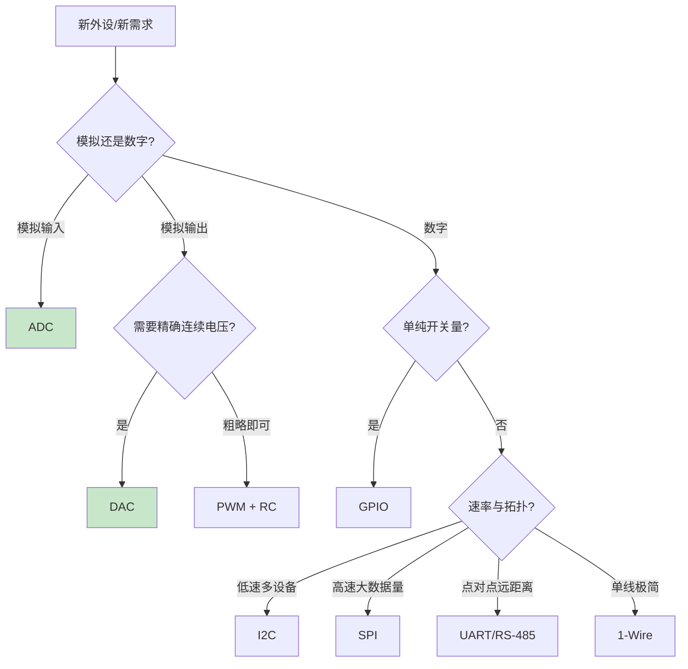

# B-A.1.4 DAC 与基础外设选型

> 所属章节：第五部 B. 总线协议 > B-A.1 基础外设接口
>
> 难度：[B] Beginner | 预计阅读时间：25 分钟

## <span class="blue"> 本节导读

GPIO 输出开关量，PWM 输出平均值可调的方波，DAC（Digital-to-Analog Converter，数模转换器）输出的是真正的连续模拟电压——变频器频率指令、可编程电源、模拟执行器控制都需要它。同时，基础外设四件套（GPIO/PWM/ADC/DAC）到此集齐，本节给出一套选型框架：拿到一个新外设，该用哪个接口接。

本节覆盖：R-2R 梯形网络的工作原理、分辨率与更新率的选型含义、输出缓冲与带载能力、SoC 无内置 DAC 时的三条替代路径（含 RK3568 的实际约束）、外设选型决策图与速查表，以及 DAC 控制变频器的完整信号链。

---

## <span class="blue"> DAC 原理

### R-2R 梯形网络

最常见的 DAC 架构只用 R 和 2R 两种电阻：

```text
        2R     2R     2R     2R
    ━━━/\/\━━/\/\━━/\/\━━/\/\━━━ → Vout
        │      │      │      │
       [S3]   [S2]   [S1]   [S0]    ← 数字开关（D3~D0）
        │      │      │      │
      GND 或 Vref（由对应比特位决定）

    输出电压：Vout = Vref × (D / 2ⁿ)
```

每一位开关控制的电流是前一位的一半，输出端叠加出与数字量成正比的电压。电阻种类少、温漂一致性好、易集成。实际芯片还有电容分压型（CMOS 工艺）与电流舵型（高速 DAC），但 R-2R 是理解 DAC 的标准起点。

### 分辨率与更新率

| 分辨率 | LSB @ 3.3 V | 适用场景 |
|--------|-------------|----------|
| 8-bit | 12.89 mV | 粗略调压、玩具级 |
| 10-bit | 3.22 mV | 通用工业控制 |
| 12-bit | 0.81 mV | 变频器指令、电源调节、音频（最常用档位） |
| 16-bit | 50.35 μV | 精密仪器、专业音频 |
| 24-bit | 0.20 μV | 计量校准、实验室仪器 |

更新率决定输出能多快变化：<10 kSPS 覆盖温度设定、阀门控制；10~500 kSPS 覆盖工业模拟输出与音频；波形发生、软件无线电需要 MSPS 级高速 DAC。

> 💡 分辨率先看负载端需求：负载（如变频器）本身只能分辨 mV 级差异时，12-bit 的 0.8 mV LSB 已足够。盲目上 16-bit 之前，先解决 PCB 噪声耦合问题——噪声会把高分辨率的收益全部吃掉。

### 输出缓冲与带载能力

R-2R 网络的输出阻抗在 kΩ 级，直接接负载会产生负载效应：输出电压随负载电流漂移。

| 输出形态 | 驱动能力 | 适用负载 |
|----------|----------|----------|
| 无缓冲 | 接近零 | 只能接运放等高阻输入 |
| 内置缓冲 | 几 mA | 轻负载 |
| 外接运放（电压跟随器/放大） | 几十 mA | 中等负载、电平转换 |
| 功率驱动级 | 数百 mA 以上 | 电磁阀、执行器 |

> ⚠️ DAC 输出的是精确电压信号，不是功率信号。驱动继电器、电磁阀、电机的正确链路是：DAC → 运放缓冲/隔离 → 功率驱动级（MOSFET/专用驱动芯片）。让 DAC 直接带功率负载，输出漂移是轻的，烧片是重的。

> ⚠️ 零刻度偏移与满刻度增益误差普遍存在：写 0 输出不恰好是 0 V，写满量程不恰好是 Vref。高精度应用做两点校准——写 0 与写满量程各实测一次，软件线性补偿。

---

## <span class="blue"> SoC 没有内置 DAC 怎么办

内置 DAC 在 MCU（STM32 等）上常见，但在应用处理器级 SoC 上并不普及——本书锚点硬件 RK3568 就没有内置 DAC。三条替代路径：

| 路径 | 精度 | 成本 | 适用场景 |
|------|------|------|----------|
| PWM + RC 滤波 | 8~10 bit 有效（受纹波限制） | 接近零 | 背光、粗略偏置电压 |
| 外置 I2C/SPI DAC（MCP4725、DAC8571 等） | 12~16 bit | 几元 | 工业模拟输出主流方案 |
| 专用音频/高速 DAC | 16~24 bit | 高 | 音频、波形发生 |

以外置 MCP4725（12-bit，I2C 接口）为例，内核有现成驱动（`drivers/iio/dac/mcp4725.c`），设备树挂在 I2C 控制器下：

```dts
&i2c1 {
    status = "okay";

    dac: mcp4725@60 {
        compatible = "microchip,mcp4725";
        reg = <0x60>;
        vref-supply = <&vcc_3v3>;
    };
};
```

注册后用户态经 IIO sysfs 控制，与内置 DAC 用法完全一致：

```bash
cat /sys/bus/iio/devices/iio:device0/out_voltage0_scale   # mV/LSB
echo 2047 > /sys/bus/iio/devices/iio:device0/out_voltage0_raw   # ≈ Vref/2
```

PWM+RC 滤波的原理是把 PWM 方波经低通滤波取平均值（见 B-A.1.2）：截止频率远低于 PWM 频率时，输出近似直流。纹波与响应速度矛盾——滤波越狠纹波越小、响应越慢，只适合慢变设定值场景。

---

## <span class="blue"> 信号链实例：DAC 控制变频器（0-10 V）

工业变频器的标准频率指令接口是 0-10 V 模拟输入：0 V 对应 0 Hz，10 V 对应上限频率（如 50 Hz）。完整信号链：

```text
┌───────────┐     ┌────────────┐     ┌──────────┐
│ SoC/外置   │     │ 运放级      │     │ 变频器    │
│ DAC 0~3.3V │────→│ 3.3V→10V   │────→│ AI1 0-10V │──→ 三相电机
└───────────┘     │ 增益≈3.03  │     └──────────┘
                  └────────────┘
        运放供电需 ≥12V 才能输出 10 V；两地共 AGND
```

频率到 DAC 码值的换算：

```c
/* freq_to_dac_raw：频率(Hz) → DAC 原始码值（12-bit）*/
#define VFD_MAX_HZ   50.0f     /* 变频器上限频率 */
#define VFD_MAX_MV   10000.0f  /* 10V 满量程 */
#define GAIN         (VFD_MAX_MV / 3300.0f)   /* 运放增益 ≈ 3.03 */
#define DAC_VREF_MV  3300.0f
#define DAC_FULL     4095

unsigned int freq_to_dac_raw(float hz)
{
    float vfd_mv = hz / VFD_MAX_HZ * VFD_MAX_MV;  /* 频率 → 变频器电压 */
    float dac_mv = vfd_mv / GAIN;                 /* → DAC 侧电压 */
    int raw = (int)(dac_mv / DAC_VREF_MV * DAC_FULL);
    if (raw < 0) raw = 0;
    if (raw > DAC_FULL) raw = DAC_FULL;           /* 限幅 */
    return raw;
}
```

写入与回读：

```bash
echo 2047 > /sys/bus/iio/devices/iio:device0/out_voltage0_raw   # ≈1.65V → 运放 ≈5V → 25Hz
cat /sys/bus/iio/devices/iio:device0/out_voltage0_raw           # 回读确认
```

DAC 输出异常时，第一排查手段是**阶梯写入 + 万用表三点测量**：写 0、半量程（2047/2048）、满量程（4095），在 DAC 引脚实测电压。三点呈线性（0 / ≈Vref/2 / ≈Vref）则数字侧与 DAC 正常，问题在运放级或变频器侧；三点异常则回到设备树与 IIO 节点查配置。阶梯不均匀还暴露 R-2R 电阻失配等硬件缺陷。

---

## <span class="blue"> 基础外设选型决策

四件套与低速总线的分工，一张图收敛：



选型速查表：

| 应用场景 | 首选 | 替代 | 不适用 |
|----------|------|------|--------|
| LED 开关/按键/继电器 | GPIO | — | 调光 |
| LED 调光/电机粗略调速 | PWM | DAC | 精密模拟输出 |
| 读电位器/模拟温度 | ADC | 外置 ADC | 远距离模拟传输 |
| 精确 0~x V 输出 | DAC | PWM+RC | 功率驱动 |
| 温湿度/气压等传感器 | I2C | SPI | 高速数据流 |
| Flash/显示屏/高速 ADC | SPI | I2C | 长距离 |
| GPS/蓝牙/调试口 | UART | RS-485（远距离） | 多设备共享 |
| 单线极简（DS18B20） | 1-Wire | I2C | 高速 |

选型顺序的工程惯例：先看传感器数据手册支持什么接口，再看 SoC 还剩什么引脚与控制器，最后看软件栈（内核有没有现成驱动）。引脚紧张时 I2C 优先（两线挂多设备）；带宽紧张时 SPI 优先；两者都不要为了用而用。

---

## <span class="blue"> 方案对比（Trade-off）

| 维度 | PWM+RC | 内置 DAC | 外置 DAC（I2C/SPI） |
|------|--------|----------|---------------------|
| 精度 | 8~10 bit 有效 | 12 bit 典型 | 12~16 bit |
| 纹波 | 有（滤波折中） | 无 | 无 |
| 成本 | ≈0 | 0（若有） | 芯片+BOM |
| 占用资源 | 1 路 PWM | DAC 通道 | 总线 + 地址 |
| 响应速度 | 慢（RC 时间常数） | 快 | 受总线速率限制 |
| 典型用途 | 背光、偏置 | 通用模拟输出 | 工业 0-10V/4-20mA 输出 |

---

## <span class="blue"> 常见陷阱

> ⚠️ DAC 引脚配错模式。外接/内置 DAC 的模拟引脚必须是模拟模式（数字缓冲关闭）；配成复用或 GPIO 模式会与其他模块争引脚，输出乱跳。

> ⚠️ 拿 DAC 直接带负载。kΩ 级输出阻抗遇低阻负载即漂移；功率负载必须经运放+驱动级。

> ⚠️ 忽略零点/满度误差。写 0 非 0 V、写满非 Vref 是常态；精密场合两点校准，软件补偿。

> ⚠️ 运放供电轨不够。要输出 10 V，运放供电至少 12 V（非轨到轨运放还需更高裕量）；症状是输出在高段削顶。

> ⚠️ 4-20 mA 与 0-10 V 混接。变频器两种输入端子电气完全不同，接错轻则无响应重则烧输入级；接线前核对手册端子定义。

---

## <span class="blue"> 动手练习

1. **阶梯测量**：找任一可用 DAC（或 PWM+RC 自制），写 0 / 半量程 / 满量程三点，万用表实测并计算零点偏移与增益误差。
2. **选型推演**：给定三个需求（机房温湿度采集、电磁阀驱动、变频器调速），用本节决策图各走一遍，写出接口、信号链与关键器件。
3. **PWM 转 DAC**：用 B-A.1.2 的 sysfs 输出 20 kHz PWM，接 RC（10 kΩ + 100 nF），改占空比并用万用表测输出电压，验证 V ≈ D × 3.3 V 与纹波的关系。
4. **无硬件后备**：无 DAC 硬件时，用 Python 完整复现频率→码值换算链并打印对照表；设备树与 sysfs 部分在 PC 上用 IIO dummy 框架（`drivers/iio/dummy/`）模拟。

---

## <span class="blue"> 本节总结

| 自查项 | 确认标准 |
|--------|----------|
| R-2R | Vout = Vref × D/2ⁿ；二进制加权电流 |
| 参数 | 分辨率/更新率/缓冲能力的选型含义；两点校准 |
| 无内置 DAC | PWM+RC / 外置 I2C DAC / 专用 DAC 三条路径及取舍 |
| MCP4725 路径 | 设备树节点、IIO sysfs 读写 |
| 变频器链 | 0-10 V 指令、增益换算、限幅 |
| 选型框架 | 决策图与速查表；接口选择的工程顺序 |
| 排查锚点 | 阶梯写入 + 三点实测，先分数字侧与模拟侧 |

---

## <span class="blue"> 配套资源

- **内核驱动参考**：`drivers/iio/dac/mcp4725.c`、`Documentation/iio/`
- **器件手册**：MCP4725（12-bit I2C DAC）、DAC8571（16-bit I2C DAC）数据手册
- **仿真工具**：LTspice 仿真 R-2R 网络与 RC 滤波纹波

---

## <span class="blue"> 下一步

基础外设四件套到此集齐。下一节 **B-A.1.5 实战：GPIO 按键中断 + PWM 呼吸灯 + ADC 电位器采集**，把三件套合成一个端到端代码案例：从数据手册与电路出发，经设备树到可运行的完整程序。之后进入 **B-A.2 I2C** 系列，开始真正的串行总线。

> 💡 螺旋衔接：本节的外置 DAC 走 I2C，正是 B-A.2 系列的第一类负载；DAC 驱动（`iio_info` 的 `write_raw` 实现）的完整写法归 D 扩展 IIO 篇。
