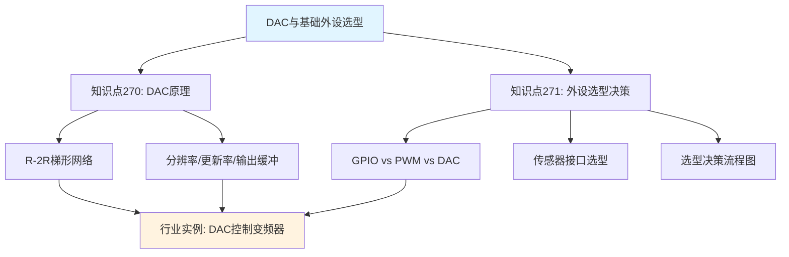
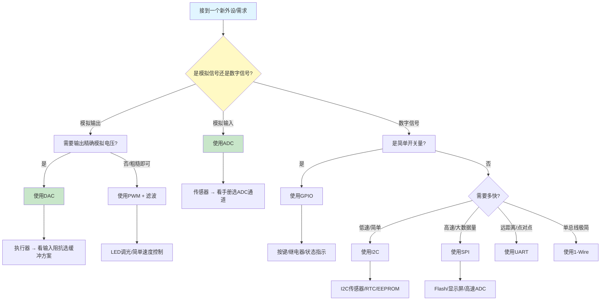

# B-A.1.4 DAC与基础外设选型 [知识点270-271]

> 所属章节：第五部 B. 总线协议 > B-A.1 通用外设与传感器接口
>
> 难度：[B] | 预计阅读时间：35分钟

## <span class="blue"> 本节导读

你已经学会了用GPIO控制LED、用PWM调光、用ADC读取温度——但如果你想让嵌入式系统**主动输出一个精确的模拟电压**，去控制变频器转速、调节电源输出、或者驱动模拟执行器，DAC就是你的答案。本节从DAC的底层原理（R-2R梯形网络）讲起，带你理解分辨率与更新率的含义；更重要的是，我们会建立一张"基础外设选型地图"，让你在面对具体项目时，能秒级判断该用GPIO、PWM、ADC、DAC还是总线。最后，通过一个完整的工业案例——DAC控制变频器频率——把选型思路和实操代码一次性串起来。

**本节知识结构图：**



---

## <span class="blue"> 知识点270 [B] — DAC原理：从数字到模拟的桥梁

DAC（Digital-to-Analog Converter，数模转换器）是ADC的"逆过程"：它把数字量（如0~4095）转换成对应的模拟电压（如0~3.3V）。如果说ADC是让嵌入式系统"看见"物理世界，那DAC就是让系统"影响"物理世界。

### R-2R梯形网络：DAC的"发动机"

最常见的DAC架构是**R-2R梯形网络**（Resistor Ladder），它只用两种阻值的电阻（R和2R）就能实现高精度的数字到模拟转换。

```text
        2R     2R     2R     2R
    ━━━/\/\━━/\/\━━/\/\━━/\/\━━━ → Vout
        │      │      │      │
       ┌┴┐    ┌┴┐    ┌┴┐    ┌┴┐
       │S3│    │S2│    │S1│    │S0│  ← 数字开关 (D3~D0)
       └┬┘    └┬┘    └┬┘    └┬┘
        │      │      │      │
       GND或Vref  ...
        
    R=10kΩ, 2R=20kΩ
    
    输出电压: Vout = Vref × (D/2^n)
    D = 数字输入值, n = 分辨率位数
```

R-2R网络的核心原理是**二进制加权电流分配**：每个比特位控制的电流是前一个位的一半，最终在输出端叠加成与数字量成正比的模拟电压。这种结构的好处是电阻种类少、温度漂移一致性好、容易集成到芯片里。

当然，实际芯片内部还可能是**电容分压型**（Charge Scaling，用于CMOS工艺）或者**电流舵型**（Current Steering，用于高速DAC），但R-2R是你理解DAC工作原理的最佳起点。

### 分辨率：你能输出多少个"台阶"

DAC的分辨率（Resolution）用位数（bit）表示，直接决定了输出电压的精细程度。

| 分辨率 | LSB @ 3.3V参考电压 | 典型精度 | 适用场景 |
|:---:|:---:|:---:|:---|
| 8-bit | 12.89 mV | ±1 LSB | 简单LED调光、粗略音量控制、玩具 |
| 10-bit | 3.22 mV | ±1 LSB | 通用工业控制、低精度信号源 |
| 12-bit | 0.81 mV | ±0.5 LSB | **最常用！** 变频器控制、电源调节、音频 |
| 16-bit | 50.35 μV | ±0.25 LSB | 精密仪器、医疗信号、音频专业设备 |
| 24-bit | 0.20 μV | ±0.1 LSB | 高端音频、计量校准、实验室仪器 |

> 💡 **提示**：别盲目追高分辨率。12-bit DAC在3.3V下LSB约0.8mV，已经远超大多数工业传感器的精度。选16-bit之前先问自己：你的负载能分辨50μV的差异吗？你的PCB Layout能避免噪声耦合吗？

### 更新率：你能多快"刷新"输出

更新率（Update Rate）指DAC每秒能改变输出的次数，单位MSPS（Million Samples Per Second）。

- **低速（<10 kSPS）**：温度设定、电池充电电压、慢速阀门控制
- **中速（10~500 kSPS）**：通用工业模拟输出、音频信号
- **高速（>1 MSPS）**：波形发生、软件无线电、视频信号

大多数MCU内置的DAC属于中低速（几十kSPS到几MSPS），够用了。需要高速时，通常会选择专用的高速DAC芯片配合SPI/I2S接口。

### 输出缓冲：带载能力的保障

DAC核心输出的驱动力非常有限——R-2R网络的输出阻抗在kΩ级别，直接接负载会导致严重的**负载效应**（输出电压随负载电流变化而漂移）。

| 输出类型 | 驱动能力 | 适用负载 | 注意事项 |
|:---:|:---:|:---|:---|
| 无缓冲输出 | 几乎为零 | 高阻输入（如运放输入端） | 必须外接缓冲 |
| 内置缓冲 | 几mA | 直接接轻负载、小电阻 | 注意短路保护 |
| 外接运放缓冲 | 可达几十mA | 中等负载、长线传输 | 关注带宽和压摆率 |
| 外接功率驱动 | 数百mA | 电磁阀、大功率执行器 | 需加保护电路 |

> ⚠️ **陷阱**：DAC输出无缓冲直接驱动负载 → 负载变化导致电压漂移！我曾见过一个项目中，DAC直接接了一个1kΩ的可变电阻，结果旋转电位器时输出电压漂移了5%以上，PID控制直接震荡。解决方案很简单：加一个电压跟随器运放（如LMV358）做缓冲。

> 🔴 **危险**：DAC不适合大电流驱动！如果你需要用DAC驱动继电器、电磁阀或者电机，别指望DAC本身。DAC输出的是**精确电压信号**，不是功率信号。需要功率驱动时，正确的链路是：**DAC → 运放缓冲/隔离 → 功率驱动级（晶体管/MOSFET/专用驱动芯片）**。把DAC当GPIO用，烧芯片是迟早的事。

---

## <span class="blue"> 知识点271 [B] — 外设选型决策：找到最合适的工具

嵌入式项目里，面对一个外设或传感器，最常见的灵魂拷问是："我用什么接口连它？" 本节给你一个系统化的决策框架。

### 选型决策流程图



### 基础外设选型速查表

| 应用场景 | 推荐接口 | 理由 | 替代方案 | 不适用场景 |
|:---|:---:|:---|:---|:---|
| LED亮灭控制 | GPIO | 最简单，一个bit搞定 | — | 调光（GPIO只能开关） |
| LED调光/电机粗略调速 | PWM | 硬件生成，CPU零开销 | DAC（更平滑） | 需要精确模拟电压 |
| 读取电位器/温度传感器(模拟) | ADC | 直接量化模拟电压 | 外接ADC芯片（精度更高） | 远距离传输模拟信号 |
| 输出精确0~3.3V/0~10V | DAC | 真正模拟输出，无纹波 | PWM+RC滤波（低成本） | 大电流驱动 |
| 温度/湿度/气压传感器 | I2C | 两根线挂多个设备，标准化 | SPI（更快） | 高速数据流 |
| 存储Flash/显示屏 | SPI | 时钟可达几十MHz，带宽高 | I2C（省引脚） | 长距离传输 |
| GPS/蓝牙/调试串口 | UART | 标准异步串口，点对点 | SPI（同步更快） | 多设备共享总线 |
| 温度传感器DS18B20 | 1-Wire | 单线极简，寄生供电 | I2C（更通用） | 高速采集 |
| 多设备共享总线 | I2C | 硬件地址寻址，协议成熟 | SPI（需片选线） | 实时性要求极高 |
| 实时控制/高速采集 | SPI | 全双工，无时隙开销 | I2C（省线） | 线多/布线复杂 |

### 传感器接口选型决策树

| 条件 | 选择 | 理由 |
|:---|:---:|:---|
| 传感器输出模拟电压，板载处理 | ADC | 大多数MCU内置ADC，零额外成本 |
| 传感器输出模拟电压，需远距离传输 | 外接ADC + 数字传输 | 模拟信号长距离衰减严重，先数字化再传 |
| 传感器有I2C地址，低速读取 | I2C | 标准化，多设备共享，驱动成熟 |
| 传感器需要连续高速数据流 | SPI | 带宽高，全双工，适合大数据量 |
| 传感器只有一个数据脚，极简布线 | 1-Wire | 寄生供电时甚至不需要VCC线 |
| 传感器是串口模块（GPS/蓝牙等） | UART | 即插即用，AT指令控制 |
| 需要输出精确模拟控制信号 | DAC | 真正的连续模拟输出 |
| 只需要粗略的模拟控制，成本敏感 | PWM + RC滤波 | 用PWM占空比模拟电压，几乎零成本 |

> 💡 **提示**：选型决策的黄金法则是——**先看传感器手册，再看MCU引脚，最后看软件栈支持**。别为了用SPI而用SPI，如果传感器只支持I2C，那就老老实实写I2C驱动。引脚不够时，优先考虑I2C（省线）而不是SPI（省软件复杂度）。

---

## <span class="blue"> 行业实例：DAC输出0-10V控制变频器频率

在工业现场，变频器（VFD）是最常见的电机调速设备。绝大多数变频器支持**0-10V模拟电压输入**作为频率指令：0V对应0Hz，10V对应50Hz（或最高频率）。我们要做的就是让嵌入式DAC输出这个精确的电压。

### 系统架构

```text
┌──────────────┐      ┌──────────────┐      ┌──────────────┐
│   STM32MP1    │      │  运放缓冲/   │      │   变频器      │
│  DAC_OUT1    │─────→│  电平转换    │─────→│  AI1 (0-10V) │
│  (0~3.3V)    │      │ 3.3V→10V    │      │              │
└──────────────┘      └──────────────┘      └──────┬───────┘
                                                   │
                                            ┌──────▼──────┐
                                            │  三相电机    │
                                            │  0~50Hz调速 │
                                            └─────────────┘
```

DAC输出0~3.3V，经过运放（如LM324）放大到0~10V，送入变频器模拟输入端。

> 💡 **提示**：如果你的变频器支持0-5V或4-20mA输入，调整运放增益即可。4-20mA是工业标准，抗干扰能力更强，长距离传输首选。

### 硬件接线

```text
STM32MP1                  运放电路 (LM324)
──────────                ────────────────
PA4 (DAC_OUT1) ───────→  IN+ (同相输入)
                         OUT ───────→ 变频器 AI1 (0-10V)
                         GND ───────→ 变频器 AGND
                         
VREF+ (3.3V) ─────────→ 运放供电/Vref参考

注意：运放需要12V供电才能输出10V信号
```

### 完整设备树配置

```dts
// arch/arm/boot/dts/stm32mp157-myboard.dts

/ {
    // ... 其他节点 ...
};

&dac {
    // 使能DAC控制器
    status = "okay";
    
    // 删除不需要的DMA配置（低速控制无需DMA）
    // 配置DAC输出通道1
    // pinctrl: PA4 = DAC_OUT1
    pinctrl-names = "default";
    pinctrl-0 = <&dac_out1_pins>;
    
    // 参考电压 3.3V (来自VDDA)
    vref-supply = <&vdda>;  
};

// pinmux配置
&pinctrl {
    dac_out1_pins: dac-out1-pins {
        // PA4 配置为模拟模式
        pins {
            pinmux = <STM32_PINMUX('A', 4, ANALOG)>;
        };
    };
};

// 电压参考
&vdda {
    regulator-min-microvolt = <3300000>;
    regulator-max-microvolt = <3300000>;
    regulator-always-on;
};
```

> 💡 **提示**：DAC引脚必须配置为`ANALOG`模式，不能是Alternate Function！如果误配成AF，DAC模块和GPIO模块会争夺引脚控制权，输出电压乱跳。这是新手最常见的错误之一。

### 驱动代码框架

```c
/* drivers/iio/dac/stm32-dac.c - 简化示意 */

#include <linux/iio/iio.h>
#include <linux/iio/sysfs.h>
#include <linux/regulator/consumer.h>

/* 设备结构体 */
struct stm32_dac {
    void __iomem *base;
    struct clk *clk;
    struct regulator *vref;
    int vref_mv;        /* 参考电压，单位mV */
    u16 resolution;     /* 12-bit = 4096 */
};

/* IIO Info */
static const struct iio_info stm32_dac_info = {
    .write_raw = stm32_dac_write_raw,
    .read_raw  = stm32_dac_read_raw,
};

/* Probe函数 */
static int stm32_dac_probe(struct platform_device *pdev)
{
    struct stm32_dac *dac;
    struct iio_dev *indio_dev;
    
    indio_dev = devm_iio_device_alloc(&pdev->dev, sizeof(*dac));
    if (!indio_dev)
        return -ENOMEM;
    
    dac = iio_priv(indio_dev);
    
    /* 1. 获取并映射寄存器 */
    dac->base = devm_platform_ioremap_resource(pdev, 0);
    
    /* 2. 使能时钟 */
    dac->clk = devm_clk_get(&pdev->dev, NULL);
    clk_prepare_enable(dac->clk);
    
    /* 3. 获取参考电压 */
    dac->vref = devm_regulator_get(&pdev->dev, "vref");
    regulator_enable(dac->vref);
    dac->vref_mv = regulator_get_voltage(dac->vref) / 1000;
    
    dac->resolution = 4096;  // 12-bit
    
    /* 4. 使能DAC通道 */
    writel(DAC_CR_EN1, dac->base + DAC_CR);
    
    /* 5. 注册IIO设备 */
    indio_dev->info = &stm32_dac_info;
    indio_dev->modes = INDIO_DIRECT_MODE;
    devm_iio_device_register(&pdev->dev, indio_dev);
    
    dev_info(&pdev->dev, "STM32 DAC ready, Vref=%dmV\n", dac->vref_mv);
    return 0;
}

/* Remove函数 */
static int stm32_dac_remove(struct platform_device *pdev)
{
    struct iio_dev *indio_dev = platform_get_drvdata(pdev);
    struct stm32_dac *dac = iio_priv(indio_dev);
    
    /* 关闭DAC输出 */
    writel(0, dac->base + DAC_CR);
    regulator_disable(dac->vref);
    clk_disable_unprepare(dac->clk);
    
    return 0;
}

static const struct of_device_id stm32_dac_of_match[] = {
    { .compatible = "st,stm32-dac", },
    { }
};
MODULE_DEVICE_TABLE(of, stm32_dac_of_match);

static struct platform_driver stm32_dac_driver = {
    .probe  = stm32_dac_probe,
    .remove = stm32_dac_remove,
    .driver = {
        .name = "stm32-dac",
        .of_match_table = stm32_dac_of_match,
    },
};
module_platform_driver(stm32_dac_driver);
```

### 用户空间控制代码

```c
/* 
 * dac_vfd_control.c
 * 
 * 用法: ./dac_vfd_control <频率_Hz>
 * 示例: ./dac_vfd_control 25    # 输出25Hz对应的电压
 */

#include <stdio.h>
#include <stdlib.h>
#include <string.h>
#include <unistd.h>
#include <fcntl.h>
#include <errno.h>

#define DAC_DEVICE      "/sys/bus/iio/devices/iio:device0/out_voltage1_raw"
#define DAC_SCALE       "/sys/bus/iio/devices/iio:device0/out_voltage1_scale"
#define DAC_VREF_MV     3300        /* 参考电压 3.3V */
#define DAC_RESOLUTION  4096        /* 12-bit DAC */
#define VFD_MAX_FREQ    50.0        /* 变频器最高频率 50Hz */
#define VFD_MAX_VOLTAGE 10000       /* 变频器满量程电压 10V (单位mV) */

/* 计算指定频率对应的DAC原始值 */
unsigned int freq_to_dac_raw(double freq_hz)
{
    double voltage_mv;      /* 目标输出电压(mV) */
    double dac_voltage_mv;  /* DAC输出电压(mV) */
    unsigned int raw;
    
    /* 频率→电压: 线性映射 0-50Hz → 0-10V */
    voltage_mv = (freq_hz / VFD_MAX_FREQ) * VFD_MAX_VOLTAGE;
    
    /* 考虑运放增益: 3.3V → 10V, 增益 ≈ 3.03 */
    /* 所以DAC输出 = 目标电压 / 增益 */
    dac_voltage_mv = voltage_mv / 3.03;
    
    /* 电压→DAC原始值: raw = voltage / Vref * 4096 */
    raw = (unsigned int)((dac_voltage_mv / DAC_VREF_MV) * DAC_RESOLUTION);
    
    /* 限幅保护 */
    if (raw >= DAC_RESOLUTION)
        raw = DAC_RESOLUTION - 1;
    
    printf("频率=%.1fHz → 变频器电压=%.1fmV → DAC电压=%.1fmV → raw=%u\n",
           freq_hz, voltage_mv, dac_voltage_mv, raw);
    
    return raw;
}

int main(int argc, char *argv[])
{
    int fd;
    char buf[32];
    unsigned int raw_value;
    double target_freq;
    
    if (argc != 2) {
        fprintf(stderr, "用法: %s <频率_Hz (0-50)>\n", argv[0]);
        return 1;
    }
    
    target_freq = atof(argv[1]);
    if (target_freq < 0 || target_freq > VFD_MAX_FREQ) {
        fprintf(stderr, "错误: 频率必须在 0~%.0f Hz 范围内\n", VFD_MAX_FREQ);
        return 1;
    }
    
    /* 计算DAC原始值 */
    raw_value = freq_to_dac_raw(target_freq);
    
    /* 写入DAC */
    fd = open(DAC_DEVICE, O_WRONLY);
    if (fd < 0) {
        perror("打开DAC设备失败");
        fprintf(stderr, "请确认设备树已正确配置DAC，且驱动已加载\n");
        fprintf(stderr, "检查: ls /sys/bus/iio/devices/\n");
        return 1;
    }
    
    snprintf(buf, sizeof(buf), "%u\n", raw_value);
    if (write(fd, buf, strlen(buf)) < 0) {
        perror("写入DAC失败");
        close(fd);
        return 1;
    }
    close(fd);
    
    printf("✓ DAC已设置: raw=%u (频率=%.1fHz)\n", raw_value, target_freq);
    
    /* 读取确认 */
    fd = open(DAC_DEVICE, O_RDONLY);
    if (fd >= 0) {
        memset(buf, 0, sizeof(buf));
        read(fd, buf, sizeof(buf));
        printf("✓ 回读确认: %s", buf);
        close(fd);
    }
    
    return 0;
}
```

**编译与运行：**

```bash
# 交叉编译（目标板为ARM）
arm-linux-gnueabihf-gcc -o dac_vfd_control dac_vfd_control.c

# 复制到目标板
scp dac_vfd_control root@192.168.1.100:/usr/bin/

# ===== 在目标板上执行 =====

# 1. 确认DAC设备存在
ls /sys/bus/iio/devices/
# 输出: iio:device0

cat /sys/bus/iio/devices/iio:device0/name
# 输出: 40017000.dac

# 2. 查看DAC可用的scale
# 先找到正确的IIO设备号
cat /sys/bus/iio/devices/iio:device0/out_voltage1_scale 2>/dev/null || \
cat /sys/bus/iio/devices/iio:device1/out_voltage1_scale 2>/dev/null || \
find /sys/bus/iio/devices -name "out_voltage*scale" -exec cat {} \;

# 3. 设置频率
./dac_vfd_control 0      # 输出0Hz（0V）
./dac_vfd_control 10     # 输出10Hz（2V）
./dac_vfd_control 25     # 输出25Hz（5V）
./dac_vfd_control 50     # 输出50Hz（10V）

# 4. 也可以用sysfs直接操作
echo 0   > /sys/bus/iio/devices/iio:device0/out_voltage1_raw   # 0V
echo 800 > /sys/bus/iio/devices/iio:device0/out_voltage1_raw   # ~0.64V
echo 2048 > /sys/bus/iio/devices/iio:device0/out_voltage1_raw  # ~1.65V
echo 3723 > /sys/bus/iio/devices/iio:device0/out_voltage1_raw  # ~3.0V
```

### 验证步骤

用万用表测量DAC输出电压，确保数字→模拟转换准确：

```bash
# ===== 验证清单 =====

# 步骤1: 确认DAC硬件存在
[root@board ~]# dmesg | grep -i dac
[    2.341] stm32-dac 40017000.dac: STM32 DAC ready, Vref=3300mV

# 步骤2: 检查IIO设备节点
[root@board ~]# ls /sys/bus/iio/devices/iio:device0/
out_voltage1_raw      # DAC输出值（0~4095）
out_voltage1_scale    # 每个LSB对应的电压值
name                  # 设备名

# 步骤3: 用万用表测量PA4引脚对GND的电压
echo 0    > /sys/bus/iio/devices/iio:device0/out_voltage1_raw
# 万用表读数应为 ~0.000V（±几个mV的偏移）

echo 2048 > /sys/bus/iio/devices/iio:device0/out_voltage1_raw
# 万用表读数应为 ~1.650V（Vref/2）

echo 3723 > /sys/bus/iio/devices/iio:device0/out_voltage1_raw
# 万用表读数应为 ~3.000V（接近Vref但不超过）

echo 4095 > /sys/bus/iio/devices/iio:device0/out_voltage1_raw
# 万用表读数应为 ~3.290V（接近Vref，略小）

# 步骤4: 测量运放输出（变频器侧）
# 如果加了3.3V→10V的运放，对应上面的测试点：
# 2048 → 万用表 ~5.0V
# 3723 → 万用表 ~9.0V

# 步骤5: 观察变频器反馈
# 登录变频器操作面板，查看AI1输入电压和目标频率
# 如果变频器显示AI1=5.0V 且目标频率=25Hz，验证通过
```

> ⚠️ **陷阱**：DAC输出有个容易忽视的问题——**零刻度偏移（Offset Error）**和**满刻度增益误差（Gain Error）**。你写入0不代表输出恰好是0V，写入4095也不恰好是3.3V。高精度应用中需要做两点校准：写入0测实际偏移，写入4095测实际增益，然后在软件里做线性补偿。

---

## <span class="blue"> 本节总结

| 主题 | 核心要点 |
|:---|:---|
| DAC原理 | R-2R梯形网络将数字量转为模拟电压；分辨率决定精细度（12-bit最常用）；更新率决定响应速度 |
| 输出缓冲 | DAC不能直接驱动负载，必须加运放缓冲或功率驱动；无缓冲时负载变化导致电压漂移 |
| 分辨率选择 | 8-bit够用就别上12-bit；12-bit够用就别上16-bit；追高分辨率前先解决噪声问题 |
| GPIO vs 其他 | 简单开关量用GPIO；需要调光/调速用PWM；需要精确模拟电压用DAC；读取模拟信号用ADC |
| 传感器选型 | I2C适合低速多设备；SPI适合高速大数据；UART适合点对点串口模块；1-Wire适合极简布线 |
| DAC控变频器 | DAC→运放缓冲→0-10V→变频器AI1；12-bit DAC精度足够；注意增益校准和限幅保护 |
| 关键陷阱 | DAC引脚必须配ANALOG模式；DAC不能大电流驱动；零刻度偏移需要校准 |

---

## <span class="blue"> 下一步

DAC的输出搞定了，接下来要进入串行总线的世界了。在B-A.2.1中，我们会深入**I2C物理层与电气特性**——理解SDA/SCL的线与逻辑、上拉电阻的计算、以及为什么I2C能一条总线挂几十个设备。这是连接绝大多数传感器的第一步。

---

## <span class="blue"> 配套资源

**推荐资料：**
- STM32MP1 Reference Manual: DAC章节（RM0436 Rev 7, Chapter 27）
- 《嵌入式硬件系统接口电路设计》第5章：D/A转换器接口设计
- IIO子系统文档：`Documentation/iio/index.rst`

**在线工具：**
- DAC分辨率计算器：[https://www.analog.com/en/design-center/dac-resolution-calculator.html](https://www.analog.com/en/design-center/dac-resolution-calculator.html)
- R-2R网络仿真器：LTspice免费版可仿真DAC电路

**调试命令速查：**

| 命令 | 用途 |
|:---|:---|
| `dmesg \| grep -i dac` | 查看DAC驱动加载信息 |
| `ls /sys/bus/iio/devices/` | 列出IIO设备 |
| `cat out_voltage1_scale` | 查看DAC电压刻度 |
| `echo N > out_voltage1_raw` | 设置DAC输出值 |
| `cat out_voltage1_raw` | 回读当前DAC值 |
| `devmem 0x40017000` | 直接读DAC寄存器（调试） |
| `watch -n 0.5 'cat out_voltage1_raw'` | 实时监控DAC输出变化 |

**示波器调试要点：**
- 通道1接DAC输出，DC耦合，量程1V/div
- 写入阶梯值（0, 512, 1024, 2048, 4095），观察台阶是否均匀
- 台阶不均匀 → R-2R网络可能有电阻不匹配或芯片故障
- 输出有纹波 → 电源去耦不足，在VREF引脚加10μF+0.1μF电容
