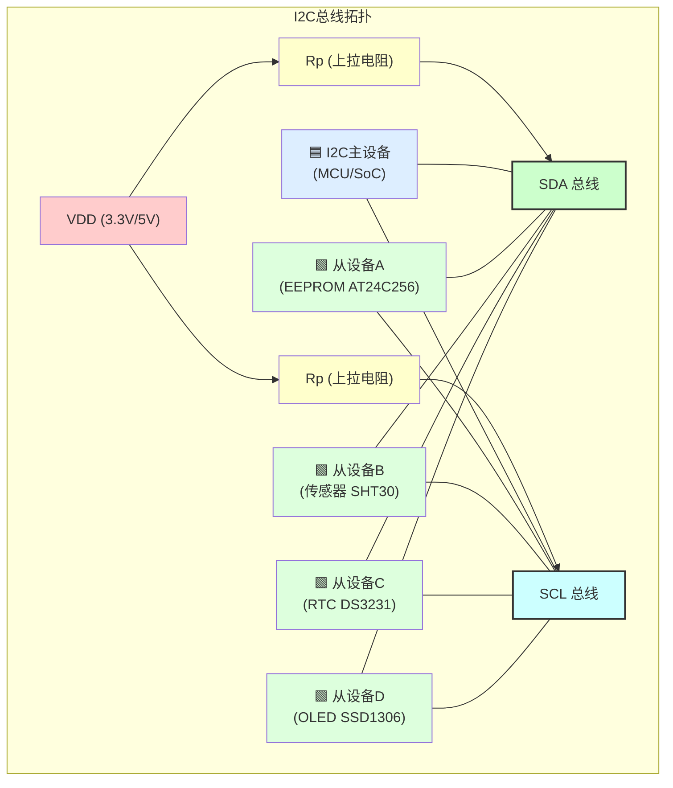

# B-A.2.1 I2C物理层与电气特性 [知识点272-274]

> 所属章节：第五部 B. 总线协议 > B-A.2 I2C总线
>
> 难度：[B][M] | 预计阅读时间：35分钟

## <span class="blue"> 本节导读

I2C（Inter-Integrated Circuit）是嵌入式领域使用最广泛的低速串行总线之一。它只需要两根线就能挂多个设备，硬件设计极其简洁。但看似简单的东西里藏着不少门道——上拉电阻选多大？总线能拉多长？地址会不会冲突？高速模式怎么搞？本节带你从物理层和电气特性角度，把I2C的硬件底细摸个透。读完你会明白为什么I2C叫"线与"总线，也知道怎么根据实际场景选对速率和参数。

<br>

## <span class="blue"> 知识点272 [B] — I2C硬件结构

I2C总线由两条信号线构成：

- **SDA**（Serial Data，串行数据）：双向数据线，收发都在这根线上
- **SCL**（Serial Clock，串行时钟）：时钟线，由主设备驱动，从设备在特定时机也可以拉低（时钟延展）

这两条线的物理实现有一个极其关键的设计——**开漏输出（Open-Drain/Open-Collector）**。每个设备的I2C引脚内部只有一个NMOS管（或NPN三极管）能把线拉低，**没有主动把线拉高的能力**。

```
        VDD (3.3V/5V)
          │
          ▼
        ┌─┴─┐
        │Rp │  上拉电阻 (Pull-up)
        └─┬─┘
          │
    ┌─────┴─────┐
    │    SDA    │◄──────── 总线（多设备共享）
    └─────┬─────┘
          │
    ┌─────┼─────┐
    │     │     │
  ┌─┴─┐ ┌─┴─┐ ┌─┴─┐
  │Q1 │ │Q2 │ │Q3 │  各设备的开漏输出
  └─┬─┘ └─┬─┘ └─┬─┘
    │     │     │
   GND   GND   GND

任何设备的NMOS导通 → 线被拉低（逻辑0）
所有设备截止 → 上拉电阻把线拉高（逻辑1）
```

这种设计天然实现了**"线与"逻辑**（Wired-AND）：所有设备输出的高电平由外部上拉保证，任何设备都能把线拉低。这正是I2C多主仲裁的物理基础——后面会细讲。

> 💡 **提示**：实际选芯片时，注意看GPIO的I2C复用引脚是否支持开漏模式。有些SoC内部可以配置为推挽输出，**千万不要在I2C总线上用推挽**——两个设备一个输出高一个输出低，直接短路，轻则通信失败，重则烧芯片。

<br>

### I2C物理连接拓扑

下面这张图展示了一个典型的I2C总线物理连接：



所有设备**并联**在SDA和SCL两根总线上。每个总线都需要一个上拉电阻。设备数量受限于总线电容（最大400pF）。

<br>

## <span class="blue"> 知识点273 [I] — I2C速率模式

I2C协议发展过程中定义了四种速率模式，分别对应不同的应用场景：

| 模式 | 最大频率 | 推出年代 | 典型应用场景 | 代表设备 |
|------|----------|----------|-------------|----------|
| Standard-mode (Sm) | 100 kHz | 1982年原始规范 | 低速传感器、EEPROM、RTC | AT24C02、DS1307 |
| Fast-mode (Fm) | 400 kHz | 1992年更新 | 主流嵌入式外设、温湿度传感器 | SHT30、BMP280、MPU6050 |
| Fast-mode Plus (Fm+) | 1 MHz | 2006年更新 | 高速EEPROM、LED驱动、触摸屏 | AT24C512C、FT5406 |
| High-speed mode (Hs) | 3.4 MHz | 2000年更新 | 高速数据采集、视频/音频接口 | 专用高速ADC/DAC |

> 💡 **提示**：实际项目中，**Fast-mode（400kHz）是最常用的选择**。它兼容绝大多数设备，性能也够用。如果你的主控支持1MHz，确认所有从设备都支持Fm+再往上提速率。混用不同速率的设备时，总线速率要按最慢的设备来配置。

<br>

## <span class="blue"> 知识点274 [E] — I2C时序参数

I2C的可靠性高度依赖时序的精确性。下面列出各模式的关键时序参数：

| 参数 | 符号 | Standard (100kHz) | Fast (400kHz) | Fast+ (1MHz) | HS (3.4MHz) | 说明 |
|------|------|:-----------------:|:-------------:|:------------:|:-----------:|------|
| SCL时钟频率 | f_SCL | ≤100 kHz | ≤400 kHz | ≤1 MHz | ≤3.4 MHz | 总线运行速率 |
| START保持时间 | t_HD;STA | 4.0 μs | 0.6 μs | 0.26 μs | 160 ns | SCL下降沿后SDA保持低的时间 |
| START建立时间 | t_SU;STA | 4.7 μs | 0.6 μs | 0.26 μs | 160 ns | 重复START前SDA高电平最小宽度 |
| STOP建立时间 | t_SU;STO | 4.0 μs | 0.6 μs | 0.26 μs | 160 ns | SCL上升沿前SDA变高的最小时间 |
| 总线空闲时间 | t_BUF | 4.7 μs | 1.3 μs | 0.5 μs | 280 ns | STOP到下一个START的最小间隔 |
| SDA建立时间 | t_SU;DAT | 250 ns | 100 ns | 50 ns | 10 ns | SCL上升沿前SDA必须稳定的时间 |
| SDA保持时间 | t_HD;DAT | 3.45 μs* | 0.9 μs* | 0.45 μs* | 70 ns* | SCL下降沿后SDA保持稳定的时间 |
| SCL低电平时间 | t_LOW | 4.7 μs | 1.3 μs | 0.5 μs | 160 ns | SCL一个周期内的低电平持续时间 |
| SCL高电平时间 | t_HIGH | 4.0 μs | 0.6 μs | 0.26 μs | 60 ns | SCL一个周期内的高电平持续时间 |
| SDA/SCL上升时间 | t_R | ≤1000 ns | ≤300 ns | ≤120 ns | ≤40 ns | 信号从低变高所需时间 |
| SDA/SCL下降时间 | t_F | ≤300 ns | ≤300 ns | ≤120 ns | ≤40 ns | 信号从高变低所需时间 |

> \* 实际值取决于器件实现，现代芯片通常远小于规范最大值。

<br>

### I2C时序波形图

下面用ASCII图展示一次完整的I2C通信时序（以START + 发送地址 + 接收ACK + 发送数据 + STOP为例）：

```
SDA:    ─┐                                              ┌─
         │    SDA由1变0，START条件                      │
         └────┐     ┌────┐     ┌────┐     ┌────┐       │
              │ SDA │ SDA│ SDA │ SDA│ SDA │ SDA│       │
              │ D7  │ D6 │ D5 │ D4 │ D3 │ D2 │ D1 │ D0 │ ACK
              └────┘     └────┘     └────┘     └────┘     └────┘
SCL:         ┌────┐     ┌────┐     ┌────┐     ┌────┐     ┌────┐
         ────┘    └─────┘    └─────┘    └─────┘    └─────┘    └──
              ↑           ↑           ↑           ↑           ↑
           START        采样点      采样点      采样点       ACK

详细展开（以发送地址 0x50 (0101_0000) + 读位0 为例）：

SDA: ────┐     ┌─────┐  ┌────┐  ┌────┐  ┌────┐  ┌────┐  ┌──┐        ┌────
         │     │  0  │  │ 1  │  │ 0  │  │ 1  │  │ 0  │  │0 │   0    │
         └─────┘     └──┘    └──┘    └──┘    └──┘    └──┘  └──┘      └┘
         ↑START   D7  D6   D5   D4   D3   D2   D1   D0   ACK
SCL:  ─────┐     ┌────┐     ┌────┐     ┌────┐     ┌────┐     ┌────┐    ┌───
            └─────┘    └─────┘    └─────┘    └─────┘    └─────┘    └────┘

                ┌─────────────────────────────────────┐
                │  地址帧：0x50 = 0b0101_0000        │
                │  0(Write) + 000 + 1010(高位在前)   │
                │  实际传输顺序：0-1-0-1-0-0-0-0       │
                └─────────────────────────────────────┘

后续数据传输（以发送字节 0xA5 为例）：

SDA: ────┐     ┌────┐  ┌──┐  ┌────┐  ┌──┐  ┌────┐  ┌──┐  ┌──┐       ┌───┐
         │     │ 1  │  │0 │  │ 1  │  │0 │  │ 0  │  │1 │  │0 │   1   │   │
         └─────┘    └──┘   └──┘    └──┘   └──┘    └──┘  └──┘  └─────┘   │
         D7=1  D6=0 D5=1 D4=0 D3=0 D2=1 D1=0 D0=1  ACK=1(NACK)    STOP ─┘
SCL:  ─────┐    ┌────┐    ┌────┐    ┌────┐    ┌────┐    ┌────┐    ┌────┐
            └────┘    └────┘    └────┘    └────┘    └────┘    └────┘

STOP条件：SCL为高电平时，SDA由低变高

        SDA ──────┐                         ┌─────────
                  │                         │
                  └─────────────────────────┘
                        ↑ STOP
        SCL ──────────────────────────────┐
                                            └───────────
```

时序要点提炼：
- **START**：SCL高电平时，SDA从高变低
- **STOP**：SCL高电平时，SDA从低变高
- **数据位**：SDA在SCL低电平期间变化，在SCL高电平期间必须保持稳定（主设备在SCL上升沿采样SDA）
- **ACK/NACK**：每传输8位后，第9个时钟周期由接收方拉低SDA表示ACK，保持高电平表示NACK

<br>

## <span class="blue"> 上拉电阻与总线电容 [I]

### 上拉电阻计算

上拉电阻的大小直接影响I2C信号的质量。太小了电流过大、功耗高；太大了上升沿太慢、可能超时时序。

计算公式（基于I2C规范推荐的上升时间要求）：

$$
R_p = \frac{t_r}{0.8473 \times C_{bus}}
$$

其中：
- $t_r$ = 允许的最大上升时间（查时序参数表）
- $C_{bus}$ = 总线总电容（包括走线电容、各设备引脚电容，最大400pF）
- 0.8473 = RC电路从0上升到70% VDD的ln(10/3)常数

用Python快速计算：

```python
#!/usr/bin/env python3
"""
i2c_pullup_calculator.py - I2C上拉电阻计算器
用法: python3 i2c_pullup_calculator.py
"""

import math

def calc_pullup(mode_name, tr_max_ns, c_bus_pf, vdd_volts=3.3):
    """
    计算I2C上拉电阻值
    
    参数:
        mode_name: 模式名称
        tr_max_ns: 最大允许上升时间(ns)
        c_bus_pf:  总线总电容(pF)
        vdd_volts: 供电电压(V)
    
    返回:
        建议的Rp阻值(Ω)
    """
    # 单位转换
    tr = tr_max_ns * 1e-9       # 秒
    c_bus = c_bus_pf * 1e-12    # 法拉
    
    # 核心公式: Rp = tr / (ln(10/3) * Cbus)
    # ln(10/3) ≈ 1.204,  1/0.8473 = 1.18
    # 这里直接用规范常数 0.8473
    Rp = tr / (0.8473 * c_bus)
    
    # 电流限制检查 (I2C规范最大3mA灌电流)
    I_max = vdd_volts / Rp
    I_spec_max = 3e-3  # 3mA
    
    # 给出建议值（取标准E24系列最接近的较小值，留裕量）
    e24_series = [1.0, 1.1, 1.2, 1.3, 1.5, 1.6, 1.8, 2.0, 2.2, 2.4,
                  2.7, 3.0, 3.3, 3.6, 3.9, 4.3, 4.7, 5.1, 5.6, 6.2,
                  6.8, 7.5, 8.2, 9.1]
    
    # 标准化到kΩ级别
    Rp_kohm = Rp / 1000
    decade = 10 ** math.floor(math.log10(Rp_kohm))
    mantissa = Rp_kohm / decade
    
    # 找最接近的E24值（向下取，留裕量）
    rec_mantissa = max([v for v in e24_series if v <= mantissa], default=9.1)
    Rp_recommended = rec_mantissa * decade
    
    print(f"\n{'='*50}")
    print(f"  模式: {mode_name}")
    print(f"  总线电容: {c_bus_pf} pF")
    print(f"  供电电压: {vdd_volts} V")
    print(f"  最大上升时间: {tr_max_ns} ns")
    print(f"{'='*50}")
    print(f"  理论计算 Rp = {Rp/1000:.2f} kΩ")
    print(f"  最大灌电流 = {I_max*1000:.2f} mA", end="")
    print(f" {'✓' if I_max <= I_spec_max else '✗ 超3mA规范!'}")
    print(f"  建议选用 Rp = {Rp_recommended:.1f} kΩ (E24系列)")
    print(f"{'='*50}")
    
    return Rp_recommended


if __name__ == "__main__":
    # 典型场景：总线电容100pF，3.3V供电
    C_BUS = 100  # pF
    VDD = 3.3    # V
    
    print("\n" + "="*50)
    print("   I2C 上拉电阻快速计算工具")
    print("="*50)
    
    # Standard mode (100kHz): tr_max = 1000ns
    calc_pullup("Standard (100kHz)", 1000, C_BUS, VDD)
    # Fast mode (400kHz): tr_max = 300ns
    calc_pullup("Fast (400kHz)", 300, C_BUS, VDD)
    # Fast+ mode (1MHz): tr_max = 120ns
    calc_pullup("Fast+ (1MHz)", 120, C_BUS, VDD)
    
    print("\n" + "-"*50)
    print("通用经验法则（总线电容<200pF时）：")
    print("  • Standard (100kHz):   4.7kΩ ~ 10kΩ")
    print("  • Fast (400kHz):       1.5kΩ ~ 4.7kΩ")
    print("  • Fast+ (1MHz):        1.0kΩ ~ 2.2kΩ")
    print("  • 供电3.3V时通常选 2.2kΩ 或 4.7kΩ")
    print("  • 供电5V时通常选 4.7kΩ 或 10kΩ")
    print("-"*50)
```

运行输出示例：
```
==================================================
   I2C 上拉电阻快速计算工具
==================================================

==================================================
  模式: Standard (100kHz)
  总线电容: 100 pF
  供电电压: 3.3 V
  最大上升时间: 1000 ns
==================================================
  理论计算 Rp = 11.80 kΩ
  最大灌电流 = 0.28 mA ✓
  建议选用 Rp = 11.0 kΩ (E24系列)
==================================================

==================================================
  模式: Fast (400kHz)
  总线电容: 100 pF
  供电电压: 3.3 V
  最大上升时间: 300 ns
==================================================
  理论计算 Rp = 3.54 kΩ
  最大灌电流 = 0.93 mA ✓
  建议选用 Rp = 3.3 kΩ (E24系列)
==================================================
```

> 💡 **提示**：上拉电阻不要太小（小于1kΩ会过流，超过I2C规范的3mA灌电流限制），也不要太大（大于10kΩ上升沿太慢，可能导致高电平无法及时建立）。**3.3V供电时4.7kΩ是最通用的选择**，5V供电时可以用10kΩ。

<br>

### 总线长度与电容的关系

总线电容是决定I2C物理极限的核心因素。主要贡献来源：

| 来源 | 典型电容值 | 说明 |
|------|-----------|------|
| 设备引脚 | 10-20 pF/个 | 每个I2C设备在SDA和SCL上各贡献 |
| PCB走线 | 1-3 pF/cm | FR4基材，与线宽和到地距离有关 |
| 连接器 | 2-5 pF/引脚 | 排针、FPC连接器等 |
| 线缆（外部） | 50-100 pF/m | 双绞线或排线，取决于线缆类型 |
| **总计限制** | **≤400 pF** | I2C规范硬性上限 |

一条经验公式估算最大走线长度：

$$
L_{max} = \frac{400pF - C_{devices} - C_{connectors}}{C_{trace\_per\_cm}}
$$

假设4个设备（4×15pF=60pF），一个连接器（5pF），走线电容2pF/cm：

$$
L_{max} = (400 - 60 - 5) / 2 = 167cm \approx 1.6m
$$

也就是说，**板上走线控制在1米以内通常是安全的**。但如果用长电缆连接，总线电容会急剧上升。

> ⚠️ **陷阱**：总线电容一旦超过400pF，SDA/SCL的上升时间会急剧恶化，信号边沿变得圆钝。主设备采样时可能读到错误电平，导致ACK丢失、数据错乱甚至总线死锁。如果你发现i2cdetect扫不出设备、通信间歇性失败，先用示波器看上升沿——**如果上升沿超过对应模式的t_R限制，加总线缓冲器（如PCA9515/PCA9517/TCA9517）是最可靠的解决方案**。

<br>

## <span class="blue"> 多主仲裁与线与逻辑 [M]

I2C支持多主模式（Multi-master），即总线上可以有多个主设备。它们通过**线与逻辑**实现无冲突仲裁：

1. 每个主设备在发送数据时，同时回读SDA线上的实际电平
2. 如果发送的是1，但读到的是0，说明有另一个主设备在发送0
3. 发送1却读到0的主设备**自动退让**，停止发送
4. 发送0的主设备不受影响，继续完成通信

因为"0比1强"（开漏结构中任何设备都能强制拉低），这种仲裁机制天然公平——**地址/数据数值更小的一方赢得仲裁**。

```
主设备A发送:  0  1  0  1  ...
主设备B发送:  0  1  1  0  ...
              ↓  ↓  ↓  ↓
SDA实际电平:   0  1  0  0  (线与结果)
              ↑  ↑  ↑  ↑
A读回:        0  1  0≠1 ← 仲裁失败！A退让
B读回:        0  1  1≠0 ← 仲裁失败！B退让

等等... 让我重新画：

时钟周期:     1   2   3   4
主A发送:      0   1   0   1
主B发送:      0   1   1   0
SDA实际:      0   1   0   0  ← 线与: 任意0即为0
              ↑   ↑   ↑   ↑
A读回:        0   1   0   0≠1 ← 第4位不匹配，A失败
B读回:        0   1   0≠1     ← 第3位不匹配，B失败

修正 —— 正确的仲裁分析：

周期1: A发0, B发0 → SDA=0 → A读到0(匹配), B读到0(匹配) → 继续
周期2: A发1, B发1 → SDA=1 → A读到1(匹配), B读到1(匹配) → 继续
周期3: A发0, B发1 → SDA=0 → A读到0(匹配), B读到0≠1(不匹配!) → B退让
周期4: 只有A在发 → A赢得仲裁
```

关键点：**仲裁只在多个主设备同时尝试通信时发生**。赢得仲裁的主设备继续完成完整传输，输掉的主设备等总线空闲后重试。

<br>

## <span class="blue"> I2C地址分配与冲突检测 [I]

### 7位地址空间

I2C标准地址是7位的，理论上可以有128个地址（0x00~0x7F），但有不少保留地址：

| 地址范围 | 类型 | 用途 | 可否分配给用户设备 |
|----------|------|------|:----------------:|
| 0x00 | 保留 | 通用呼叫地址（General Call） | ❌ 否 |
| 0x01-0x07 | 保留 | CBUS地址、不同总线格式 | ❌ 否 |
| 0x08-0x77 | **可用** | **用户设备地址空间（112个）** | ✅ 是 |
| 0x78-0x7B | 保留 | 10位从设备地址前缀 | ❌ 否 |
| 0x7C-0x7F | 保留 | 未来扩展 | ❌ 否 |

实际可用的地址范围是 **0x03 到 0x77**（不同厂商文档略有差异，保守做法是使用0x08-0x77），共112个地址。

### 地址冲突怎么办？

这是硬件设计中最头疼的问题之一。常见解决方案：

| 方案 | 原理 | 适用场景 |
|------|------|----------|
| 硬件地址引脚 | 芯片有1-3个ADDR引脚，接地/接VDD组合选择地址 | EEPROM、传感器等（如MPU6050的AD0引脚） |
| 地址分配器/Switch | 用PCA954x系列I2C多路复用器把一条总线拆成多条 | 同型号设备必须共存时 |
| 软件I2C（GPIO模拟） | 用普通GPIO模拟I2C，每条总线独立 | 设备数量极少、速率要求低时 |
| 选不同型号芯片 | 直接选不同I2C地址的替代芯片 | 设计阶段最容易实现的方案 |

> 💡 **提示**：设计原理图时，**务必制作一张I2C地址分配表**，列出所有I2C设备及其地址。两片芯片地址相同的话，总线上会混乱——你可能会发现单独测试每个设备都正常，但全接上去就出鬼问题。

<br>

## <span class="blue"> 本节总结

| 项目 | 核心要点 |
|------|----------|
| 硬件结构 | SDA+SCL两根线，开漏输出，必须外接上拉电阻 |
| 速率模式 | Standard(100k)/Fast(400k)/Fast+(1M)/HS(3.4M)，推荐400kHz作为默认 |
| 总线电容 | 最大400pF，超过会信号畸变，需加总线缓冲器 |
| 上拉电阻 | Rp = tr/(0.8473×Cbus)，3.3V常用4.7kΩ，5V常用10kΩ |
| 时序关键 | t_HD;STA、t_SU;STA、t_SU;STO、t_BUF必须满足对应模式 |
| 多主仲裁 | 线与逻辑实现，"0赢1输"，数值小的地址赢得仲裁 |
| 可用地址 | 0x08-0x77共112个，注意避开保留地址和冲突 |
| 常见陷阱 | 电容超标、电阻选错、地址冲突、推挽输出短路 |

<br>

## <span class="blue"> 下一步

下一节 **B-A.2.2 I2C协议层与帧格式** 将深入讲解：
- START/STOP/重复START条件的精确定义
- 完整的数据帧格式：地址帧 + 数据帧 + ACK/NACK
- 10位扩展地址的传输方式
- 时钟延展（Clock Stretching）机制
- 通用呼叫地址和软件复位

还会用逻辑分析仪抓图，展示真实的I2C波形细节。

<br>

## <span class="blue"> 配套资源

**推荐阅读**：
- NXP《I2C-bus specification and user manual》（UM10204，第5版，2021）—— I2C的权威规范文档
- TI《I2C Bus Pullup Resistor Calculation》（SLVA689）—— 上拉电阻计算的详细推导

**推荐工具**：
- `i2cdetect`（Linux i2c-tools包）：扫描I2C总线上的设备
- 示波器：观察SDA/SCL波形和上升沿时间
- 逻辑分析仪（如Saleae）：捕获完整I2C时序并解码

**实验建议**：
- 用万用表测量I2C总线空闲时的电平（应被上拉电阻拉到VDD）
- 用示波器观察不同上拉电阻（1kΩ/4.7kΩ/10kΩ）下的上升沿差异
- 尝试在总线上接入过多设备，观察400pF以上电容时的通信失败现象
