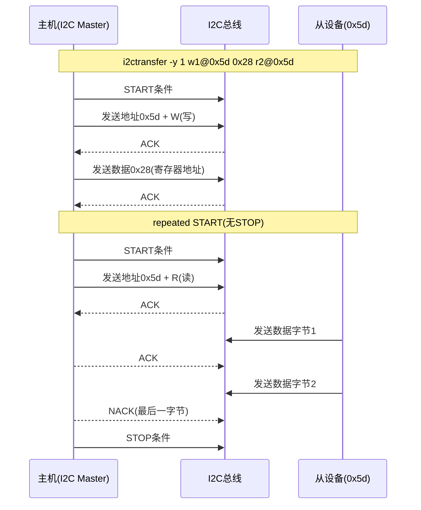
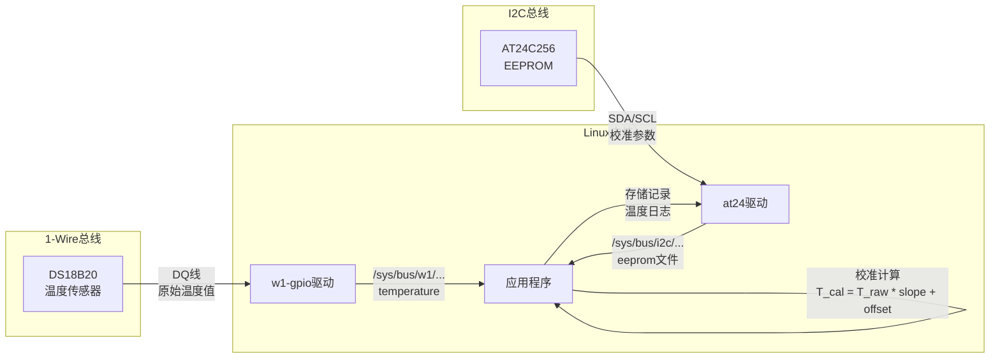

# B-A.2.4 I2C调试工具与1-Wire [知识点279-280]

> 所属章节：第五部 B. 总线协议 > B-A.2 I2C总线
>
> 难度：[I] Intermediate / [B] Beginner | 预计阅读时间：45分钟

## <span class="blue"> 本节导读

上一节你学会了写I2C设备驱动，但驱动上线之前，总线上到底有没有这个设备？地址对不对？寄存器读得通吗？这时候就需要一套称手的**用户空间调试工具**。本节先给你介绍Linux下最经典的`i2c-tools`套件——四个命令覆盖扫描、读写、批量dump、高级传输全场景，再配合逻辑分析仪的实战抓包，让你肉眼看到SCL/SDA上的每一bit跳动。

但I2C并不是唯一的低速串行总线。在温湿度采集、身份识别等场景中， Dallas/Maxim 推出的**1-Wire（单总线）**协议用一根线就能完成供电+通信，DS18B20温度传感器更是嵌入式领域的"常青树"。本节后半段带你理解1-Wire的时序本质、ROM命令体系，并在Linux下用`w1-gpio`驱动让它跑起来。

最后的行业实例把两者拧在一起：**1-Wire读温度 + I2C存校准参数**，这就是工业温控小系统的核心数据流。

<br>

---

## <span class="blue"> 知识点279：i2c-tools套件详解 [I]

### 四把利器：i2c-tools全家桶

`i2c-tools`是Linux下I2C调试的事实标准，由Jean Delvare（也就是`sensors-detect`的作者）维护。四个命令各司其职，几乎覆盖了日常调试的全部需求。

| 命令 | 功能 | 语法 | 示例输出 |
|------|------|------|----------|
| `i2cdetect` | 扫描总线上所有设备，显示7bit地址矩阵 | `i2cdetect -y <bus>` | `-- 1a 2b -- --` |
| `i2cdump` | 批量读取某设备的全部寄存器 | `i2cdump -y <bus> <addr>` | `00: 00 1a ff 03 ...` |
| `i2cget` | 读取单个寄存器值 | `i2cget -y <bus> <addr> <reg>` | `0x1a` |
| `i2cset` | 写入单个寄存器值 | `i2cset -y <bus> <addr> <reg> <val>` | （无输出） |
| `i2ctransfer` | 高级传输：多消息、多字节、任意格式 | `i2ctransfer -y <bus> w<len>@<addr> <data> r<len>@<addr>` | 读取的字节值 |

<br>

#### i2cdetect —— "谁在线上？"

这是最常用的第一个命令。总线编号通常对应`/dev/i2c-N`：

```bash
# 扫描I2C-1总线上的所有设备（7bit地址范围0x03~0x77）
$ i2cdetect -y 1
     0  1  2  3  4  5  6  7  8  9  a  b  c  d  e  f
00:                         -- -- -- -- -- -- -- --
10: -- -- -- -- -- -- -- -- -- -- -- -- -- -- -- --
20: -- -- -- -- -- -- -- -- -- -- -- -- -- -- -- --
30: -- -- -- -- -- -- -- -- -- -- -- -- -- 3d -- --
40: -- -- -- -- -- -- -- -- -- -- -- -- -- -- -- --
50: 50 -- -- -- -- -- -- -- -- -- -- -- -- -- -- --
60: -- -- -- -- -- -- -- -- -- -- -- -- -- -- -- --
70: -- -- -- -- -- -- -- --
```

输出中每个数字代表一个应答的7bit地址。上面这个例子说明：
- `0x3d`：某个外设（比如OLED显示屏SSD1306常见地址0x3c/0x3d）
- `0x50`：某块EEPROM（AT24C系列常用0x50~0x57）

> ⚠️ **陷阱**：`i2cdetect`默认用"快速扫描"（写地址后立刻停止），某些只读设备（比如某些传感器）可能不响应写操作，会被漏扫。加`-r`参数改用读扫描试试。

<br>

#### i2cdump —— "寄存器全景图"

确认设备在线后，下一步就是看它里面有什么：

```bash
# 以字节模式dump 0x50地址(EEPROM)的全部256字节
$ i2cdump -y 1 0x50 b
     0  1  2  3  4  5  6  7  8  9  a  b  c  d  e  f    0123456789abcdef
00: ff ff ff ff ff ff ff ff ff ff ff ff ff ff ff ff    ................
10: ff ff ff ff ff ff ff ff ff ff ff ff ff ff ff ff    ................
20: 00 00 00 00 00 00 00 00 00 00 00 00 00 00 00 00    ................
```

`b`参数表示`byte`模式（逐字节读取），适合寄存器型设备。还有`w`（word模式）、`i`（I2C block）等模式，针对不同的设备协议。

<br>

#### i2cget / i2cset —— "手术刀式精确读写"

读单个寄存器：

```bash
# 从0x3d设备的寄存器0x00读取1字节
$ i2cget -y 1 0x3d 0x00
0x00

# 读16bit（word模式，高字节在前）
$ i2cget -y 1 0x5d 0x28 w
0x1a3b
```

写单个寄存器：

```bash
# 向0x3d设备的寄存器0x00写入0xae
$ i2cset -y 1 0x3d 0x00 0xae

# 写16bit word
$ i2cset -y 1 0x5d 0x28 0x1234 w

# 写入后调用SMBus "Quick"命令发送信号（部分设备需要）
$ i2cset -y 1 0x60 0x01 0 i
```

<br>

#### i2ctransfer —— "瑞士军刀"

`i2ctransfer`是`i2c-tools` 4.0版本后新增的利器，支持任意组合的多消息传输，完美对应Linux I2C协议的`i2c_msg`机制：

```bash
# 先写1字节寄存器地址0x28，再读2字节数据（典型传感器读取流程）
$ i2ctransfer -y 1 w1@0x5d 0x28 r2@0x5d
0x1b 0x83

# 连续写多个字节（向EEPROM写入数据）
$ i2ctransfer -y 1 w5@0x50 0x10 0x48 0x65 0x6c 0x6f

# 多消息：msg1写3字节，msg2读4字节（复合设备初始化+读取）
$ i2ctransfer -y 1 w3@0x20 0x01 0x02 0x03 r4@0x20
```

语法解析：`w1@0x5d 0x28` = write 1 byte to address 0x5d, data is 0x28。`r2@0x5d` = read 2 bytes from address 0x5d。两个消息之间用空格分隔，会自动插入重复的START条件（不发送STOP），这在I2C协议中称为"repeated START"，是很多设备的必需操作。

**i2ctransfer通信流程图：**



<br>

### 逻辑分析仪抓包：让波形说话

软件工具只能看到"应答/非应答"，当信号质量有问题时，必须上硬件抓包。Saleae Logic系列（现在叫Saleae Logic Analyzer）和DSLogic（DreamSourceLab）是两款性价比极高的逻辑分析仪，都内置I2C协议解码器。

**Saleae抓I2C的典型设置：**

```
通道分配：
  Ch0 → SCL
  Ch1 → SDA
采样率：≥ 1MHz（I2C标准模式100kbit/s时，至少10x过采样）
触发条件：SDA Falling Edge（START条件自动触发）
协议解码器：I2C → 填入SCL/SDA通道号
```

**抓包界面解读：**

```
时间轴    SCL  ‾|__|‾‾|__|‾‾‾‾|__|‾‾|__|‾‾‾‾‾‾
          SDA  ‾‾‾___|‾‾‾‾‾‾|___|‾‾‾‾‾‾|___|‾‾
                [S][Addr+R][ACK][Data0][ACK][Data1][NACK][P]
                 7bit   R/W
解码结果：
  [0] START
  [1] Address: 0x50 + Read(1)
  [2] ACK (from Master? No, from Slave)
  [3] Data: 0x1A
  [4] ACK
  [5] Data: 0x3B
  [6] NACK  ← 注意！主机主动发NACK表示"最后一字节，别发了"
  [7] STOP
```

> 💡 **提示**：Saleae可以导出CSV/二进制，方便和示波器波形对比。如果看到ACK位上SDA只被拉低了半个bit周期就弹回高电平，大概率是**从设备驱动能力不足**——检查上拉电阻是否过大。

<br>

### I2C常见问题排查

做I2C调试，十有八九会遇到这些坑。下面这张表收好，遇事不决翻一翻：

| 问题现象 | 根本原因 | 检测方法 | 解决方案 |
|----------|----------|----------|----------|
| `i2cdetect`扫描不到设备 | 地址不对 / 设备未供电 / 接线错误 | 先用万用表量VCC/GND，再核对datasheet地址表 | 检查电源，核对A0~A2引脚电平 |
| 某些地址格子显示`UU` | 该地址被内核驱动占用 | `ls /sys/bus/i2c/devices/`查看绑定关系 | 卸载对应驱动或修改设备地址 |
| 信号边沿缓慢、圆顶波形 | 上拉电阻过大或总线电容过大 | 逻辑分析仪/示波器观察SDA下降沿 | 减小上拉电阻（典型1kΩ~10kΩ），或降低总线频率 |
| 随机读写失败、时好时坏 | 信号完整性差 / 线缆过长 | 缩短排线至<30cm，降低波特率 | 用屏蔽线，加I2C缓冲器（如PCA9515），改400kHz→100kHz |
| 主机死等、总线挂死 | 从设备时钟拉伸超时 / 死锁 | 示波器抓SCL看是否被从设备拉低太久 | 重启从设备电源，检查从设备固件，配置主机clock-stretch超时 |
| 两个设备同地址冲突 | 硬件设计上地址引脚接法相同 | 拔掉一个设备看另一个是否正常工作 | 修改A0~A2引脚接法换地址，或加I2C地址转换器（PCA9546A多路复用器） |

<br>

**时钟拉伸死锁的深入解析：**

I2C协议允许从设备在SCL低电平期间将其继续拉低，以此表示"我还没准备好，你等等"。这叫做**Clock Stretching（时钟拉伸）**。正常情况下这很美好——慢速设备也能和高速主机通信。但如果从设备有bug，把SCL拉低后忘了释放，主机就会永远等下去。

```
正常时钟拉伸：
  SCL:  ‾|__‾‾‾‾‾‾‾‾|__|‾‾  （低电平被从设备适当延长）
  SDA:  ‾‾‾‾‾‾‾‾‾‾‾|___|‾‾
        数据bit准备期间SCL被短暂拉伸，随后恢复

死锁：
  SCL:  ‾|_______________...  （永远低电平！）
  SDA:  ‾‾‾‾‾‾‾‾‾‾‾‾‾‾‾‾
        从设备固件崩溃，SCL拉低不释放，总线彻底卡死
```

检测方法：用示波器或逻辑分析仪持续监测SCL，如果SCL低电平时间超过1ms（在100kHz模式下），几乎可以确认是从设备在异常拉伸。解决方案：给从设备加看门狗，或在主机侧实现总线恢复（GPIO模拟SCL发9个时钟周期强制解锁）。

> 🔴 **危险**：某些STM32从设备在进入低功耗模式时自动拉伸SCL，如果此时主机刚好发起通信，且主机不支持clock stretch等待，会直接报错`-EIO`。务必在主机驱动中启用`I2C_M_NOSTART`等标志时确认硬件能力。

<br>

---

## <span class="blue"> 知识点280：1-Wire协议与DS18B20 [B]

### 为什么需要1-Wire？

 Dallas Semiconductor（现Maxim Integrated，又被ADI收购）在1980年代末设计了一套极致简化的总线协议：**只需要一根信号线 + 一根地线**就能完成通信，甚至还能通过信号线本身给设备供电——这叫**寄生供电（Parasite Power）**模式。

```
I2C 需要4根线：VCC + GND + SDA + SCL
1-Wire只需2根线：GND + DQ（数据线兼供电线，寄生模式时）
                 或3根线：VCC + GND + DQ（外部供电模式）
```

对于距离不远（通常<30m）、速率要求低（默认16.3kbps标准模式）的场景，少一根线就是少一个连接器、少一个引脚、少一份故障点。温控、门禁、资产追踪都是1-Wire的经典战场。

<br>

### 1-Wire物理层

```
外部供电模式                寄生供电模式
    VCC(3.3V) ──┬── VDD        VCC(3.3V) ──┬────────┐
                │                             │        │
    GPIO  ──────┴── DQ        GPIO ──────────┴── DQ   │
                │                             │        │
    GND  ───────┴── GND        GND ──────────┴────────┘
                │                          [4.7kΩ上拉]
            4.7kΩ上拉到VCC                （强上拉MOSFET
                                              在转换期间激活）
```

1-Wire的电气特性很特别：
- **空闲状态**：DQ被上拉电阻拉到高电平（3.3V/5V）
- **主机发起**：主机把DQ拉低（发送"复位脉冲"，最低480μs）
- **从机响应**：从机检测到复位后，在15~60μs内拉低DQ发送"存在脉冲"
- **数据编码**：1-Wire不用独立的时钟线，而是用**时隙（Time Slot）**来编码bit。每个bit周期60~120μs，主机在开始时隙时拉低DQ，然后在特定时间点采样DQ电平来读0或1。

<br>

### DS18B20：最经典的1-Wire温度传感器

DS18B20是嵌入式领域用得最多的1-Wire器件，参数如下：

| 参数 | 值 |
|------|-----|
| 温度范围 | -55°C ~ +125°C |
| 精度 | ±0.5°C（-10~85°C范围内） |
| 分辨率 | 9~12bit 可配置（0.5°C ~ 0.0625°C） |
| 转换时间 | 93.75ms（9bit）~ 750ms（12bit） |
| 供电 | 3.0V~5.5V，外部供电或寄生供电 |
| 每个器件有 | 唯一的64bit ROM ID（含8bit家族码0x28） |

<br>

### 1-Wire ROM命令：设备寻址

每个1-Wire器件出厂时烧录了全球唯一的64bit ROM ID。主机通过ROM命令来选择要和哪个从设备说话。

| ROM命令 | 代码 | 功能 |
|---------|------|------|
| Search ROM | 0xF0 | 搜索总线上所有设备的64bit ROM ID（可识别多设备） |
| Read ROM | 0x33 | 读取单个设备的ROM ID（总线上只能有一个设备） |
| Match ROM | 0x55 | 主机发送64bit ROM ID，选中特定设备 |
| Skip ROM | 0xCC | 跳过ROM寻址，直接向总线上唯一/所有设备发功能命令 |
| Alarm Search | 0xEC | 仅响应温度报警标志置位的设备 |

**Search ROM**是多设备总线的核心。它使用一种巧妙的"二叉树"搜索算法：每次问所有设备ROM的某一位是0还是1，有冲突时分别走两个分支，最终逐个发现所有设备的完整64bit ID。Linux内核的`w1_master`自动完成了这个过程，你不需要自己实现。

<br>

### DS18B20功能命令：温度转换与读取

ROM命令之后，跟着的是功能命令——也就是"真正的业务"。

| 功能命令 | 代码 | 功能 | 说明 |
|----------|------|------|------|
| Convert T | 0x44 | 启动温度转换 | 转换期间总线会被拉低（寄生供电时需强上拉），12bit模式约750ms |
| Read Scratchpad | 0xBE | 读取9字节暂存器 | 包含原始温度值（2字节LSB在前）、TH/TL报警阈值、配置寄存器 |
| Write Scratchpad | 0x4E | 写入3字节配置 | 设置TH（上限）、TL（下限）、配置寄存器（分辨率） |
| Copy Scratchpad | 0x48 | 将配置写入EEPROM | 断电后仍保持 |
| Recall E² | 0xB8 | 从EEPROM恢复配置 | 上电时自动执行 |

**温度值在暂存器中的格式：**

```
Scratchpad字节0（LSB）:  S S S S S R3 R2 R1   S=符号位, R=分辨率位
Scratchpad字节1（MSB）:  S S S S S S S S

12bit模式: 每bit = 0.0625°C
  0x0190 = 0000 0001 1001 0000b = 400 × 0.0625 = 25.00°C
  0xFF5E = 1111 1111 0101 1110b = -10 × 0.0625 = -10.00°C（补码）

分辨率bit在配置寄存器中:
  R1 R0 = 0 0 → 9bit (93.75ms)
  R1 R0 = 0 1 → 10bit (187.5ms)
  R1 R0 = 1 0 → 11bit (375ms)
  R1 R0 = 1 1 → 12bit (750ms, 出厂默认)
```

<br>

### Linux w1-gpio驱动：内核帮你搞定时序

1-Wire的时序非常严格——复位脉冲480μs、写0时隙60μs、写1时隙<15μs、读采样窗口15μs内完成。用户空间用`usleep`做bit-banging？大概率因为调度延迟导致时序错乱。

Linux内核提供了`w1-gpio`驱动，用GPIO模拟1-Wire时序，且在中断上下文里完成关键操作，可靠性远高于用户空间实现。

**设备树配置（w1-gpio节点）：**

```dts
// 在根节点或合适位置添加w1-gpio主控节点
&{/} {
    w1: onewire {
        compatible = "w1-gpio";
        gpios = <&gpio1 7 GPIO_ACTIVE_HIGH>;  /* GPIO1_7, 推挽输出+开漏输入 */
        status = "okay";
    };
};
```

> ⚠️ **陷阱**：寄生供电模式下，DS18B20在温度转换（Convert T，0x44命令）期间需要从总线吸取大量电流（典型1.5mA，峰值可达1.5mA以上，持续750ms）。仅靠4.7kΩ上拉电阻提供不了这么多电流——**必须在转换期间将DQ线通过MOSFET强拉到VCC**（Strong Pull-Up）。如果你的DS18B20读取总是返回`85000`（85.0°C，上电复位默认值）或固定不变，八成是这个原因。

设备树中启用强上拉（如果硬件支持）：

```dts
w1: onewire {
    compatible = "w1-gpio";
    gpios = <&gpio1 7 GPIO_ACTIVE_HIGH>;
    
    /* 如果硬件设计了MOSFET强上拉电路，指定控制GPIO */
    /* 不是标准属性，需查看具体平台文档 */
    
    status = "okay";
};
```

> 💡 **提示**：如果没有强上拉MOSFET电路，最简单的方案是用**外部供电模式**——给DS18B20的VDD引脚接3.3V，这样转换时电流从VDD走，不再依赖DQ线上的寄生供电。这就是推荐新手首选的接法。

<br>

**DS18B20温度读取（内核自动识别 + sysfs接口）：**

`w1-gpio`驱动会自动扫描总线上的所有1-Wire设备，并在`/sys/bus/w1/devices/`下为每个设备创建目录。

```bash
# 查看内核是否识别到DS18B20
$ ls /sys/bus/w1/devices/
28-0000072431ff/     w1_bus_master1/

# 28- 开头 = 家族码0x28 = DS18B20
# 0000072431ff = 48bit序列号

# 读取温度（内核自动完成ROM命令+功能命令时序）
$ cat /sys/bus/w1/devices/28-0000072431ff/temperature
25687
# 结果 = 25687 → 25.687°C（内核已做除1000处理前的原始值是25687，即25.687°C）

# 读取完整w1_slave信息（调试用）
$ cat /sys/bus/w1/devices/28-0000072431ff/w1_slave
0f 01 4b 46 7f ff 01 10 4e : crc=4e YES
0f 01 4b 46 7f ff 01 10 4e t=25687
```

`w1_slave`文件输出的解读：
- 第一行9字节scratchpad原始数据 + CRC校验，`YES`表示CRC通过
- 第二行末尾`t=25687`就是温度值（milli°C，除以1000得°C）
- 如果看到`crc=XX NO`，说明通信出错，检查接线和上拉电阻

**用C程序读取温度：**

```c
#include <stdio.h>
#include <stdlib.h>
#include <string.h>
#include <unistd.h>
#include <dirent.h>

#define W1_DEVICES_DIR "/sys/bus/w1/devices/"
#define W1_FAMILY_CODE "28-"        /* DS18B20家族码 */

/**
 * read_ds18b20_temperature - 从sysfs读取DS18B20温度
 * @return: 温度值(°C)，失败返回-NaN
 */
double read_ds18b20_temperature(void)
{
    DIR *dir;
    struct dirent *entry;
    char path[256];
    char buf[256];
    FILE *fp;
    double temp = 0.0 / 0.0;  /* NaN */
    
    dir = opendir(W1_DEVICES_DIR);
    if (!dir) {
        perror("opendir");
        return temp;
    }
    
    /* 遍历查找28-开头的DS18B20设备 */
    while ((entry = readdir(dir)) != NULL) {
        if (strncmp(entry->d_name, W1_FAMILY_CODE, 3) != 0)
            continue;
        
        /* 构造temperature文件路径 */
        snprintf(path, sizeof(path), "%s%s/temperature",
                 W1_DEVICES_DIR, entry->d_name);
        
        fp = fopen(path, "r");
        if (!fp)
            continue;
        
        /* 读取温度值(milli°C) */
        if (fgets(buf, sizeof(buf), fp) != NULL) {
            long milli_c = atol(buf);
            temp = milli_c / 1000.0;
            printf("Device %s: %.3f°C\n", entry->d_name, temp);
        }
        fclose(fp);
        break;  /* 读取第一个找到的设备 */
    }
    
    closedir(dir);
    return temp;
}

int main(int argc, char *argv[])
{
    double temp;
    
    printf("=== DS18B20 Temperature Reader ===\n");
    
    /* 连续读取5次 */
    for (int i = 0; i < 5; i++) {
        temp = read_ds18b20_temperature();
        if (temp != temp) {  /* NaN check */
            fprintf(stderr, "Failed to read temperature\n");
            return 1;
        }
        printf("Reading %d: %.3f°C\n", i + 1, temp);
        sleep(1);
    }
    
    return 0;
}
```

<br>

---

## <span class="blue"> 行业实例：DS18B20温度采集 + AT24C256参数存储（混合系统）

这个实例来自一个实际的工业温控节点：用1-Wire总线挂载DS18B20采集环境温度，用I2C总线挂载AT24C256 EEPROM存储温度校准系数和报警阈值。两者结合，实现"采集→校准→存储→报警"的完整闭环。

**系统数据流：**



### 硬件接线图

```
                 ┌─────────────────┐
                 │   嵌入式主板     │
                 │                 │
     GPIO1_7 ────┤──► DQ           │
                 │     │           │
   /dev/i2c-1 ───┤──► SDA ─────────┼────┬──────────┬──────...
                 │     SCL ─────────┼────┘          │
                 │                 │            4.7kΩ x2
                 │   3.3V ─────────┼────────────────┘
                 │   GND  ─────────┼────┬──────────┬───
                 └─────────────────┘    │          │
                                        │          │
                 ┌──────────┐      ┌───┴───┐  ┌───┴─────┐
                 │ DS18B20  │      │AT24C256│  │AT24C256 │
     寄生供电:    │   DQ ◄───┘      │ SDA ◄──┘  │ SDA ◄──┘ (另一地址)
     DQ→GPIO1_7  │   VDD ──NC(寄生) │ SCL ◄─────┘  SCL ◄────
                 │   GND ──────────┤ A0=0,A1=0    A0=1,A1=0
                 └──────────┘      │ Addr=0x50    Addr=0x51
                                   └──────────┘  └─────────┘
```

### 完整的设备树配置

```dts
/dts-v1/;

/ {
    model = "Industrial Temp Controller";
    compatible = "mycompany,temp-controller";
    
    /*  aliases for convenience */
    aliases {
        i2c0 = &i2c_1;
    };
};

/* I2C1 控制器 - 挂载AT24C256 */
&i2c_1 {
    status = "okay";
    clock-frequency = <100000>;    /* 100kHz标准模式 */
    
    /* 第一片AT24C256，A0=A1=A2=GND，地址0x50 */
    eeprom@50 {
        compatible = "atmel,24c256";
        reg = <0x50>;
        pagesize = <64>;           /* 24C256每页64字节 */
        size = <32768>;            /* 256Kbit = 32KB */
        status = "okay";
    };
    
    /* 第二片AT24C256（可选），A0=3.3V, A1=A2=GND，地址0x51 */
    eeprom@51 {
        compatible = "atmel,24c256";
        reg = <0x51>;
        pagesize = <64>;
        size = <32768>;
        status = "disabled";
    };
};

/* 1-Wire主控 - GPIO模拟，挂载DS18B20 */
&{/} {
    w1: onewire {
        compatible = "w1-gpio";
        gpios = <&gpio1 7 GPIO_ACTIVE_HIGH>;
        status = "okay";
    };
};
```

### 温度校准参数存储（I2C EEPROM）

校准系数存储格式设计：

```
EEPROM地址布局 (AT24C256 = 32KB):
┌─────────────────┬──────────────────────────────────────┐
│ 0x0000 ~ 0x000F │ 魔数 + 版本号  "TCALv1\0"           │
│ 0x0010 ~ 0x001F │ 传感器1校准: slope(4B) + offset(4B)  │
│ 0x0020 ~ 0x002F │ 传感器2校准: slope(4B) + offset(4B)  │
│ 0x0030 ~ 0x003F │ 报警阈值: high(4B) + low(4B)         │
│ 0x0040 ~ 0x0043 │ CRC32校验值                          │
│ 0x0044 ~ ...    │ 预留                                 │
└─────────────────┴──────────────────────────────────────┘
```

**校准数据读写代码：**

```c
#include <stdio.h>
#include <stdint.h>
#include <fcntl.h>
#include <unistd.h>
#include <sys/ioctl.h>
#include <linux/i2c-dev.h>
#include <linux/i2c.h>
#include <string.h>

#define EEPROM_ADDR      0x50
#define I2C_BUS          "/dev/i2c-1"
#define EEPROM_PAGE_SIZE 64

/**
 * eeprom_write - 向AT24C256写入数据（带页边界处理）
 * @fd:     I2C设备文件描述符
 * @offset: EEPROM内部地址（0~32767）
 * @data:   待写入数据
 * @len:    数据长度
 */
int eeprom_write(int fd, uint16_t offset, const uint8_t *data, size_t len)
{
    uint8_t buf[EEPROM_PAGE_SIZE + 2];  /* +2 for 16bit address */
    size_t written = 0;
    
    while (written < len) {
        /* 计算当前页可写的字节数 */
        uint16_t page_offset = offset % EEPROM_PAGE_SIZE;
        size_t page_remain = EEPROM_PAGE_SIZE - page_offset;
        size_t chunk = len - written;
        if (chunk > page_remain)
            chunk = page_remain;
        
        /* 构造写缓冲区: [地址高字节][地址低字节][数据...] */
        buf[0] = (offset >> 8) & 0xFF;
        buf[1] = offset & 0xFF;
        memcpy(&buf[2], data + written, chunk);
        
        /* 使用i2ctransfer方式：写地址+数据 */
        struct i2c_msg msg = {
            .addr  = EEPROM_ADDR,
            .flags = 0,           /* 写方向 */
            .len   = chunk + 2,   /* 2字节地址 + 数据 */
            .buf   = buf,
        };
        struct i2c_rdwr_ioctl_data ioctl_data = {
            .msgs  = &msg,
            .nmsgs = 1,
        };
        
        if (ioctl(fd, I2C_RDWR, &ioctl_data) < 0) {
            perror("I2C_RDWR write");
            return -1;
        }
        
        /* AT24C256写入周期约5ms，必须等待 */
        usleep(5000);
        
        offset += chunk;
        written += chunk;
    }
    return 0;
}

/**
 * eeprom_read - 从AT24C256读取数据
 */
int eeprom_read(int fd, uint16_t offset, uint8_t *data, size_t len)
{
    uint8_t addr_buf[2];
    struct i2c_msg msgs[2];
    
    /* msg[0]: 写16bit内部地址（无STOP） */
    addr_buf[0] = (offset >> 8) & 0xFF;
    addr_buf[1] = offset & 0xFF;
    msgs[0].addr  = EEPROM_ADDR;
    msgs[0].flags = 0;        /* 写 */
    msgs[0].len   = 2;
    msgs[0].buf   = addr_buf;
    
    /* msg[1]: 读数据（Repeated START） */
    msgs[1].addr  = EEPROM_ADDR;
    msgs[1].flags = I2C_M_RD; /* 读 */
    msgs[1].len   = len;
    msgs[1].buf   = data;
    
    struct i2c_rdwr_ioctl_data ioctl_data = {
        .msgs  = msgs,
        .nmsgs = 2,
    };
    
    if (ioctl(fd, I2C_RDWR, &ioctl_data) < 0) {
        perror("I2C_RDWR read");
        return -1;
    }
    return 0;
}

/**
 * 校准数据结构
typedef struct {
    char     magic[8];      /* "TCALv1\0\0" */
    float    slope;         /* 校准斜率，如1.002 */
    float    offset;        /* 校准偏移，如-0.35 */
    float    alarm_high;    /* 高温报警阈值 */
    float    alarm_low;     /* 低温报警阈值 */
    uint32_t crc32;         /* 校验 */
} temp_cal_data_t;

/**
 * 将校准参数写入EEPROM
 */
int save_calibration(int fd, const temp_cal_data_t *cal)
{
    return eeprom_write(fd, 0x0000, (const uint8_t *)cal, sizeof(*cal));
}

/**
 * 从EEPROM读取校准参数
 */
int load_calibration(int fd, temp_cal_data_t *cal)
{
    return eeprom_read(fd, 0x0000, (uint8_t *)cal, sizeof(*cal));
}
```

### 混合验证流程

完整的"1-Wire读温度 → I2C读校准参数 → 计算真实温度"流程：

```c
#include <stdio.h>
#include <stdint.h>
#include <fcntl.h>
#include <unistd.h>
#include <dirent.h>
#include <string.h>
#include <stdlib.h>
#include <math.h>

#define W1_DIR       "/sys/bus/w1/devices/28-"
#define EEPROM_BUS   "/dev/i2c-1"
#define EEPROM_ADDR  0x50

typedef struct { float slope; float offset; } cal_t;

/* 从DS18B20读取原始温度（milli°C） */
long read_w1_temp(const char *device_id)
{
    char path[128], buf[32];
    FILE *fp;
    
    snprintf(path, sizeof(path), "/sys/bus/w1/devices/%s/temperature", device_id);
    fp = fopen(path, "r");
    if (!fp) return -1;
    
    if (fgets(buf, sizeof(buf), fp) == NULL) {
        fclose(fp);
        return -1;
    }
    fclose(fp);
    return atol(buf);  /* 返回milli°C */
}

/* 从EEPROM读取校准系数（简化版，实际应检查CRC） */
int read_eeprom_cal(int fd, cal_t *cal)
{
    /* 假设校准参数存在EEPROM 0x0010处 */
    /* 这里用i2cget/i2cdump或ioctl读取，代码省略 */
    /* 返回值示例 */
    cal->slope = 1.002;
    cal->offset = -0.35;
    return 0;
}

int main(void)
{
    long raw_milli;
    double raw_c, calibrated_c;
    cal_t cal;
    int fd;
    
    printf("=== Temperature Acquisition + Calibration Demo ===\n\n");
    
    /* 步骤1: 从1-Wire读取DS18B20原始温度 */
    /* 实际应扫描 /sys/bus/w1/devices/ 找到28-xxxxx */
    DIR *dir = opendir("/sys/bus/w1/devices/");
    struct dirent *ent;
    char w1_device[32] = "";
    while ((ent = readdir(dir)) != NULL) {
        if (strncmp(ent->d_name, "28-", 3) == 0) {
            strncpy(w1_device, ent->d_name, sizeof(w1_device)-1);
            break;
        }
    }
    closedir(dir);
    
    if (strlen(w1_device) == 0) {
        fprintf(stderr, "No DS18B20 found!\n");
        return 1;
    }
    printf("[1-Wire] Found DS18B20: %s\n", w1_device);
    
    raw_milli = read_w1_temp(w1_device);
    if (raw_milli < 0) {
        fprintf(stderr, "Failed to read temperature!\n");
        return 1;
    }
    raw_c = raw_milli / 1000.0;
    printf("[1-Wire] Raw temperature: %.3f°C\n", raw_c);
    
    /* 步骤2: 从I2C EEPROM读取校准系数 */
    fd = open(EEPROM_BUS, O_RDWR);
    if (fd < 0) {
        perror("open i2c");
        return 1;
    }
    
    if (ioctl(fd, I2C_SLAVE, EEPROM_ADDR) < 0) {
        perror("ioctl I2C_SLAVE");
        close(fd);
        return 1;
    }
    
    if (read_eeprom_cal(fd, &cal) < 0) {
        fprintf(stderr, "Failed to read calibration! Using default.\n");
        cal.slope = 1.0;
        cal.offset = 0.0;
    }
    close(fd);
    printf("[I2C]    Calibration: slope=%.4f, offset=%.2f\n", cal.slope, cal.offset);
    
    /* 步骤3: 应用校准公式 */
    calibrated_c = raw_c * cal.slope + cal.offset;
    printf("[Result] Calibrated temperature: %.3f°C\n", calibrated_c);
    
    /* 步骤4: 报警判断 */
    if (calibrated_c > 80.0)
        printf("[ALARM]  High temperature warning!\n");
    else if (calibrated_c < -20.0)
        printf("[ALARM]  Low temperature warning!\n");
    
    return 0;
}
```

### 实测验证步骤

```bash
# ===== 步骤1: 检查设备树是否加载 =====
$ dmesg | grep -i "w1\|onewire\|at24"
[   3.456] Driver for 1-wire Dallas network protocol.
[   3.512] w1-gpio onewire.0: gpio 7 is not up...
[   4.123] at24 1-0050: 32768 byte 24c256 EEPROM, writable, 64 bytes/write

# ===== 步骤2: 验证1-Wire设备识别 =====
$ ls /sys/bus/w1/devices/
28-0000072431ff/  w1_bus_master1/

$ cat /sys/bus/w1/devices/28-0000072431ff/w1_slave
2d 01 4b 46 7f ff 03 10 a4 : crc=a4 YES
2d 01 4b 46 7f ff 03 10 a4 t=18812
# t=18812 → 18.812°C

# ===== 步骤3: 验证I2C EEPROM =====
$ i2cdetect -y 1
     0  1  2  3  4  5  6  7  8  9  a  b  c  d  e  f
00:                         -- -- -- -- -- -- -- --
10: -- -- -- -- -- -- -- -- -- -- -- -- -- -- -- --
20: -- -- -- -- -- -- -- -- -- -- -- -- -- -- -- --
30: -- -- -- -- -- -- -- -- -- -- -- -- -- -- -- --
40: -- -- -- -- -- -- -- -- -- -- -- -- -- -- -- --
50: 50 -- -- -- -- -- -- -- -- -- -- -- -- -- -- --
60: -- -- -- -- -- -- -- -- -- -- -- -- -- -- -- --
70: -- -- -- -- -- -- -- --
# 0x50 = AT24C256已识别

# 测试EEPROM读写
$ i2cset -y 1 0x50 0x00 0x10 0x48 i   # 向地址0x0010写入'H' (0x48)
$ i2cset -y 1 0x50 0x00 0x10          # 设置读指针到0x0010
$ i2cget -y 1 0x50                    # 读取
0x48
# 写入成功！

# ===== 步骤4: 运行完整采集程序 =====
$ ./temp_cal_reader
=== Temperature Acquisition + Calibration Demo ===
[1-Wire] Found DS18B20: 28-0000072431ff
[1-Wire] Raw temperature: 18.812°C
[I2C]    Calibration: slope=1.0020, offset=-0.35
[Result] Calibrated temperature: 18.497°C
```

<br>

---

## <span class="blue"> 调试实战：1-Wire时序测量与逻辑分析仪

### 用逻辑分析仪抓1-Wire

1-Wire的速率比I2C慢得多（标准模式约16.3kbps），用100kHz采样率就够了。关键时序参数：

```
时序参数           最小值    典型值    最大值
复位脉冲(主机)     480μs     512μs     ∞
存在脉冲(从机)     15μs      60μs      240μs
写0时隙           60μs      60μs      120μs
写1时隙           1μs       8μs       15μs（主机拉低时间）
读时隙            1μs       8μs       15μs（主机拉低时间）
采样窗口                   15μs
```

**Saleae设置：**
- Ch0 → DQ线
- 采样率：500kHz（足以分辨μs级时隙）
- 触发：Ch0 Falling Edge（DQ从高到低跳变）
- 协议解码器：1-Wire

**正常波形特征：**
```
DQ线:    ‾‾‾‾‾‾‾‾‾‾‾‾‾‾‾‾‾‾‾|___________|‾‾‾‾‾‾‾‾‾‾‾‾‾‾‾‾‾‾‾‾‾
         空闲高电平          复位脉冲512μs  存在脉冲60~240μs

时隙放大：
DQ线:    ‾‾‾‾|__|‾‾‾‾‾‾‾‾‾‾‾|__|‾‾‾‾‾‾‾‾‾|____|‾‾‾‾‾‾‾‾‾‾‾‾
              写1时隙         写1时隙       写0时隙
              (主机拉低~8μs)  (主机拉低~8μs) (主机拉低~60μs)
              随后释放，从机  随后释放       主机保持低电平
              不拉低（bit=1）              整个时隙（bit=0）
```

### 常见问题排查

| 现象 | 可能原因 | 排查方法 |
|------|----------|----------|
| 无`28-xxx`目录出现 | GPIO引脚不对/上拉缺失 | 万用表量DQ空闲时应为高电平3.3V |
| `w1_slave`显示CRC错误 | 信号畸变/线缆过长 | 逻辑分析仪看时隙是否变形，缩短线缆至<10m |
| 始终读到85000（85°C） | 寄生供电不足/强上拉缺失 | 检查是否启用了强上拉，或改用外部供电 |
| 读数跳变/不稳定 | 电源噪声/采样时序冲突 | 加100nF退耦电容，检查内核dmesg是否有w1错误 |

<br>

---

## <span class="blue"> 本节总结

| 知识点 | 核心内容 | 难度 |
|--------|----------|------|
| i2c-tools五命令 | `i2cdetect`扫描、`i2cdump`批量读、`i2cget/i2cset`单寄存器、`i2ctransfer`多消息 | I |
| I2C常见问题 | 地址冲突、上拉电阻、总线电容、时钟拉伸死锁的识别与解决 | I |
| 1-Wire协议 | 单总线+地线、寄生供电、时隙编码bit、复位+存在脉冲 | B |
| DS18B20 | -55~125°C、9~12bit分辨率、64bit ROM ID、温度暂存器格式 | B |
| w1-gpio驱动 | 设备树配置、内核自动扫描、sysfs读取temperature | B |
| 混合系统 | 1-Wire采集 + I2C存储 + 校准计算，完整的温度监测闭环 | I |

**关键记忆点：**
- `i2ctransfer`的`wN@addr rM@addr`语法是I2C高级调试的核心武器
- DS18B20的85°C固定读数 = 寄生供电失败的典型症状
- 1-Wire时隙只有60~120μs宽，用户空间bit-banging不可靠，用`w1-gpio`驱动
- I2C地址冲突时，`PCA9546A`多路复用器是硬件层面的终极解决方案

<br>

---

## <span class="blue"> 下一步

下一节进入**SPI总线**的世界。和I2C相比，SPI有四根线（SCLK/MOSI/MISO/CS）、全双工通信、无地址机制靠片选区分设备，而且时钟极性/相位组合出四种模式——`CPOL`和`CPHA`的理解是很多初学者卡在SPI门口的第一块石头。做好准备，我们这就去征服B-A.3.1《SPI物理层与四种模式》。

<br>

---

## <span class="blue"> 配套资源

| 资源 | 链接/位置 | 说明 |
|------|-----------|------|
| i2c-tools源码 | `https://git.kernel.org/pub/scm/utils/i2c-tools/i2c-tools.git` | 官方Git仓库 |
| Linux w1子系统文档 | `Documentation/w1/w1-generic.rst`（内核源码内） | w1子系统通用说明 |
| DS18B20 Datasheet | Maxim Integrated官网搜索"DS18B20" | 完整时序图和寄存器说明 |
| AT24C256 Datasheet | Microchip/Atmel官网 | EEPROM时序和页写说明 |
| Saleae逻辑分析仪 | `https://www.saleae.com/` | 支持I2C/1-Wire/SPI解码 |
| DSLogic逻辑分析仪 | `https://dreamsourcelab.com/` | 开源硬件，性价比高 |
| PCA9546A数据手册 | NXP官网 | I2C多路复用器，解决地址冲突 |
| 本节示例代码 | `examples/B-A.2.4/` | 完整读写代码+Makefile |
| 逻辑分析仪抓包样本 | `examples/B-A.2.4/captures/` | Saleae `.logicdata`格式样本文件 |

<br>

---

> 📚 **扩展阅读**
>
> - 《I2C Bus Specification and User Manual》（NXP, UM10204）—— I2C协议的权威定义
> - 《1-Wire Bus System》（Maxim AN937）—— Maxim官方的1-Wire总线应用笔记
> - 《Understanding the I2C Bus》（TI SLVA704）—— TI的I2C入门手册，图解极佳
> - Linux内核`drivers/w1/`目录下`w1_gpio.c`—— 了解内核如何用GPIO精确控制1-Wire时序
