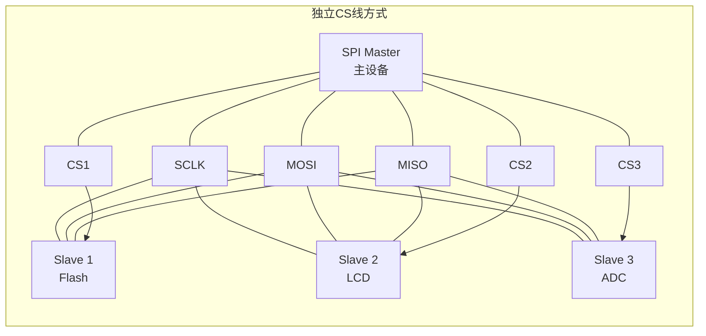
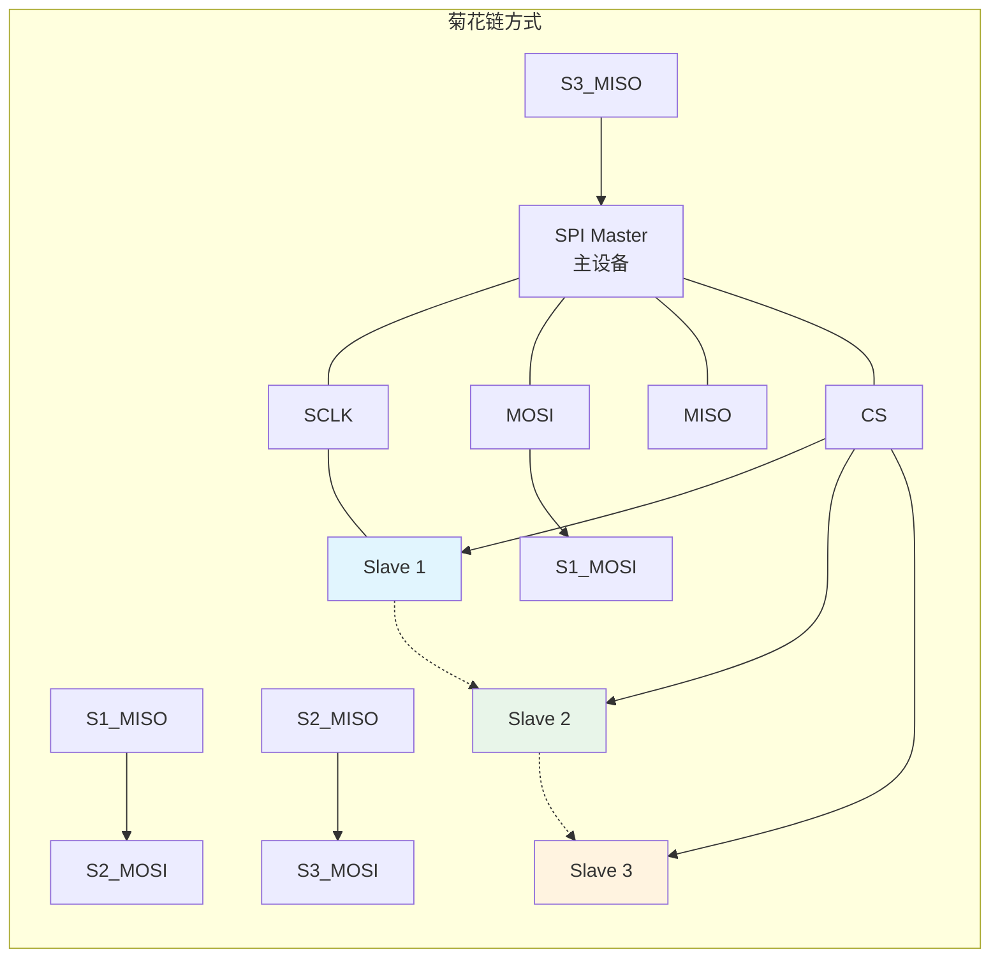

# B-A.3.1 SPI物理层与四种模式 [知识点281-282]

> 所属章节：第五部 B. 总线协议 > B-A.3 SPI子系统
>
> 难度：[B] Beginner | 预计阅读时间：25分钟

## <span class="blue"> 本节导读

SPI（Serial Peripheral Interface）是嵌入式领域最常用的同步串行总线之一。相比I2C，SPI用更多的信号线换取了更高的传输速度和更简单的协议。本节从物理层出发，先搞清楚4根线各自干什么，再深入理解让无数新手栽跟头的"四种模式"——CPOL和CPHA的组合。这两个参数如果主从设备不匹配，数据就会莫名其妙地错乱，也是SPI调试中最常见的问题根源。

读完本节，你会掌握SPI的物理连接方式、四种工作模式的本质区别、速率计算方法，以及多从设备拓扑的设计选择。

---

## <span class="blue"> 知识点281 [B] — SPI硬件结构与4线接口

SPI总线由Motorola在1980年代提出，采用**主从架构（Master-Slave）**。整个通信过程由主设备发起并控制，从设备被动响应。

### 信号线定义

SPI标准定义了4根信号线，每个信号线都有明确的方向和功能：

| 信号线 | 方向（主设备视角） | 功能 | 主设备端 | 从设备端 |
|:---:|:---:|:---|:---|:---|
| **SCLK** | 输出 | 串行时钟，由主设备产生，同步所有数据传输 | 输出时钟 | 接收时钟 |
| **MOSI** | 输出 | Master Out Slave In，主设备发送数据到从设备 | 数据输出 | 数据输入 |
| **MISO** | 输入 | Master In Slave Out，从设备发送数据到主设备 | 数据输入 | 数据输出 |
| **CS** (或SS) | 输出 | Chip Select，片选信号，低电平有效 | 控制从设备使能 | 接收使能信号 |

<br>

> 💡 **提示**：不同厂商对SPI信号线的命名可能不同。比如TI的文档中可能把MOSI叫做SIMO（Slave In Master Out），MISO叫做SOMI。看原理图时要注意对照。

SPI是全双工通信——MOSI和MISO可以同时传输数据。这意味着在SCLK的每个时钟周期内，主设备和从设备各发送1位数据，理论数据传输效率比半双工的I2C高出一倍。

```
        主设备 (Master)                          从设备 (Slave)
     ┌─────────────────┐                    ┌─────────────────┐
     │                 │──── SCLK ─────────→│                 │
     │                 │                    │                 │
     │                 │──── MOSI ─────────→│                 │
     │    ┌───────┐    │    (Master Out     │    ┌───────┐    │
     │    │  SPI  │    │     Slave In)      │    │  SPI  │    │
     │    │Controller    │←─── MISO ──────────│    │Controller    │
     │    └───────┘    │    (Master In      │    └───────┘    │
     │                 │     Slave Out)      │                 │
     │                 │──── CS ───────────→│                 │
     │                 │   (低电平有效)      │                 │
     └─────────────────┘                    └─────────────────┘
```

CS信号线在每个从设备上独立连接。主设备要和哪个从设备通信，就把对应从设备的CS线拉低，其他从设备的CS保持高电平（它们会忽略总线上的时钟和数据）。

---

## <span class="blue"> 知识点282 [I] — SPI四种工作模式

这是SPI最核心也最容易出问题的概念。

SPI通过两个参数定义时钟和数据的关系：

- **CPOL**（Clock Polarity，时钟极性）：决定SCLK空闲时的电平
  - CPOL = 0：空闲时SCLK为低电平
  - CPOL = 1：空闲时SCLK为高电平

- **CPHA**（Clock Phase，时钟相位）：决定数据在哪条边沿被采样
  - CPHA = 0：数据在第一个时钟边沿采样
  - CPHA = 1：数据在第二个时钟边沿采样

这两个参数各有两种取值，组合成SPI的**四种模式（Mode 0 ~ Mode 3）**：

| 模式 | CPOL | CPHA | 空闲时钟电平 | 采样边沿 | 典型设备 |
|:---:|:---:|:---:|:---:|:---:|:---|
| **Mode 0** | 0 | 0 | 低电平 | 上升沿采样 | 最常见；如W25Q系列Flash、大部分ADC/DAC |
| **Mode 1** | 0 | 1 | 低电平 | 下降沿采样 | 某些传感器（如ADXL345） |
| **Mode 2** | 1 | 0 | 高电平 | 下降沿采样 | 较少见 |
| **Mode 3** | 1 | 1 | 高电平 | 上升沿采样 | 常见；如SD卡SPI模式、CC1101射频芯片 |

<br>

### Mode 0 时序详解（CPOL=0, CPHA=0）

Mode 0是最常用的模式。理解它的时序对理解其他模式至关重要。

```
Mode 0 (CPOL=0, CPHA=0) 时序图

CS:    ──┐                                          ┌──
          └──────────────────────────────────────────┘
          ↑                                          ↑
        选中从设备                                 释放从设备

SCLK:  ────┐  ┌──┐  ┌──┐  ┌──┐  ┌──┐  ┌──┐  ┌──┐  ┌────
            └──┘  └──┘  └──┘  └──┘  └──┘  └──┘  └──┘
           ↑  ↑  ↑  ↑  ↑  ↑  ↑  ↑
           │  │  │  │  │  │  │  │
         上升沿采样(奇数边沿)  →  数据在每个上升沿被读取
         下降沿变化(偶数边沿)  →  数据在每个下降沿改变

MOSI:  ────╪════╪════╪════╪════╪════╪════╪════╪────
           D7   D6   D5   D4   D3   D2   D1   D0
           ↑  ↑  ↑  ↑  ↑  ↑  ↑  ↑
         主设备在下降沿改变数据
         从设备在上升沿采样数据

MISO:  ────╪════╪════╪════╪════╪════╪════╪════╪────
           D7   D6   D5   D4   D3   D2   D1   D0
           ↑  ↑  ↑  ↑  ↑  ↑  ↑  ↑
         从设备在下降沿改变数据
         主设备在上升沿采样数据

时序说明：
• CS拉低后，SCLK开始输出
• SCLK空闲为低，每个周期：上升沿采样，下降沿数据变化
• 数据先传MSB（最高位D7）还是LSB可配置，图中按MSB-first示意
```

在Mode 0中，关键点是**数据在SCLK的上升沿被采样**。所以发送方需要在下降沿改变数据电平，确保在下一个上升沿到来时数据已经稳定（满足建立时间要求）。

### Mode 3 时序详解（CPOL=1, CPHA=1）

Mode 3也很常见，特别是SD卡等设备。对比Mode 0就能看出CPOL和CPHA的影响。

```
Mode 3 (CPOL=1, CPHA=1) 时序图

CS:    ──┐                                          ┌──
          └──────────────────────────────────────────┘
          ↑                                          ↑
        选中从设备                                 释放从设备

SCLK:  ┌────┐  ┌──┐  ┌──┐  ┌──┐  ┌──┐  ┌──┐  ┌──┐  ┌──
        └────┘  └──┘  └──┘  └──┘  └──┘  └──┘  └──┘  └──
                ↑  ↑  ↑  ↑  ↑  ↑  ↑  ↑
                │  │  │  │  │  │  │  │
              下降沿采样(奇数边沿)  →  数据在每个下降沿被读取
              上升沿变化(偶数边沿)  →  数据在每个上升沿改变

MOSI:  ────┬────╪════╪════╪════╪════╪════╪════╪────
           │   D7   D6   D5   D4   D3   D2   D1   D0
                ↑  ↑  ↑  ↑  ↑  ↑  ↑  ↑
              主设备在上升沿改变数据
              从设备在下降沿采样数据

MISO:  ────┬────╪════╪════╪════╪════╪════╪════╪────
           │   D7   D6   D5   D4   D3   D2   D1   D0
                ↑  ↑  ↑  ↑  ↑  ↑  ↑  ↑
              从设备在上升沿改变数据
              主设备在下降沿采样数据

时序说明：
• SCLK空闲为高电平（CPOL=1的区别）
• CS拉低后SCLK从高电平开始翻转
• 数据在下降沿采样（CPHA=1的区别）
• 与Mode 0相比：空闲电平和采样边沿都"反"了
```

> ⚠️ **陷阱**：**主设备和从设备的SPI模式必须完全一致**，包括CPOL、CPHA、数据位宽、MSB/LSB顺序。任何一个参数不匹配都会导致数据错乱。比如主设备用Mode 0而从设备用Mode 3，主设备在上升沿采样时从设备的数据还没准备好，读出来的全是乱的。这是SPI调试中最常见的问题，新手往往花几小时排查"硬件问题"，最后发现只是模式配错了。

---

## <span class="blue"> SPI时钟速率计算 [I]

SPI没有I2C那种总线仲裁机制，速率由主设备的SCLK频率直接决定。理论上：

```
f_SPI_max = f_PCLK / 2
```

其中 `f_PCLK` 是SPI控制器挂载的外设总线时钟。例如STM32F407的APB2总线时钟最高84MHz，则SPI1的最高速率可达42MHz。

实际使用中，需要考虑以下因素：

| 限制因素 | 说明 | 典型影响 |
|:---|:---|:---|
| **从设备最高速率** | 每个从设备有自己的最高SCLK限制 | Flash通常50~133MHz，传感器可能只有几MHz |
| **PCB走线质量** | 信号完整性限制（详见下文） | 长走线或恶劣EMI环境需降速 |
| **GPIO模拟SPI** | 软件模拟时受CPU频率和延时精度限制 | 通常不超过几MHz |
| **时钟分频比** | 实际速率 = f_PCLK / (2 × 分频系数) | 分频系数为整数，可能无法精确匹配目标值 |

<br>

> 💡 **提示**：不确定从设备支持什么SPI模式时，**用逻辑分析仪抓波形反推CPOL/CPHA**。观察SCLK空闲电平可确定CPOL，再观察数据在哪个边沿变化、哪个边沿稳定，就能确定CPHA。这比反复试错的效率高得多。

---

## <span class="blue"> 多从设备拓扑设计 [I]

一个SPI主设备可以连接多个从设备，有两种典型的连接方式：





### 独立CS线方式（最常见）

- SCLK、MOSI、MISO三根线**并联**到所有从设备
- 每个从设备有**独立的CS线**，主设备需要多少个GPIO就用多少
- 优点：各从设备独立工作，可以同时挂载不同模式的设备（只要一次只通信一个）
- 缺点：N个从设备需要N+3根线，引脚开销大

### 菊花链方式（Daisy Chain）

- SCLK和CS**并联**到所有从设备
- MOSI接到第一个从设备，第一个从设备的MISO接到第二个的MOSI，以此类推
- 最后一个从设备的MISO回到主设备
- 优点：N个从设备只需4根线，节省引脚
- 缺点：所有从设备必须**同类型、同配置**；数据需要依次经过所有设备，延迟大；不能单独访问某个从设备

| 特性 | 独立CS线方式 | 菊花链方式 |
|:---|:---|:---|
| 信号线数量 | N个从设备需 N+3 根线 | 始终4根线 |
| 从设备独立性 | 高，可单独访问任意设备 | 低，必须按顺序访问全部设备 |
| 从设备类型要求 | 可以混合不同类型 | 通常要求同型号 |
| 通信延迟 | 低，直接访问目标设备 | 高，数据需逐个传递 |
| 典型应用 | 通用场景，多个不同外设 | 多个LED驱动器、级联移位寄存器 |

<br>

---

## <span class="blue"> 电气特性与信号完整性 [I]

### 推挽输出 vs 开漏输出

SPI使用**推挽输出（Push-Pull）**驱动信号线，这和I2C的开漏输出有本质区别：

| 特性 | SPI（推挽输出） | I2C（开漏输出） |
|:---|:---|:---|
| 输出结构 | 内部有PMOS+NMOS，主动拉高/拉低 | 只能主动拉低，拉高靠外部上拉电阻 |
| 信号上升速度 | 快，驱动能力强 | 慢，受上拉电阻和电容限制 |
| 上拉电阻 | **不需要** | 必须外接 |
| 总线冲突风险 | 有，两个设备同时驱动会短路 | 无，线与逻辑天然支持仲裁 |
| 电平兼容性 | 需确保主从IO电压匹配 | 较灵活，不同电压可通过上拉实现 |
| 最高速率 | 可达数十MHz甚至百MHz | 标准模式100Kbps，快速模式400Kbps |

<br>

推挽输出的优势是驱动能力强、边沿陡峭，能实现高吞吐率。但也意味着**不能直接把两个主设备的SPI口并联**——如果它们同时驱动MOSI线到相反电平，会形成低阻通路，可能烧毁IO。

### 信号完整性与走线设计

SPI速率越高，信号完整性问题越突出：

```
走线长度与最大速率的关系（经验值，仅供参考）

速率范围        建议最大走线长度        注意事项
━━━━━━━━━━━━━━━━━━━━━━━━━━━━━━━━━━━━━━━━━━━━━━━━━━━━━
< 1 MHz         数十厘米~1米           几乎无限制，可用排线
1~10 MHz        10~30厘米              注意回路面积，尽量短
10~25 MHz       5~15厘米               需要良好地平面，避免过孔
25~50 MHz       < 10厘米               建议阻抗控制，终端匹配
> 50 MHz        < 5厘米                必须PCB内层走线，严格SI设计
```

影响SPI信号质量的关键因素：

| 问题 | 原因 | 解决方法 |
|:---|:---|:---|
| **信号反射** | 走线阻抗不连续，终端不匹配 | 串联端接电阻（22~47Ω），控制走线阻抗50Ω |
| **串扰** | 时钟线与数据线平行过长 | 增加线间距，用地线隔离，减少平行长度 |
| **地弹** | 回流路径过长或不连续 | 确保完整的地平面，时钟线靠近回流路径 |
| **时钟偏移** | 不同从设备走线长度差异 | 尽量等长布线，或降低速率 |

> ⚠️ **陷阱**：用杜邦线飞线连接SPI设备时，速率通常不要超过几MHz。杜邦线的电感和电容很大，25MHz以上基本无法可靠工作。如果你发现数据偶尔出错、时好时坏，先把速率降到1MHz以下试试，很多时候"硬件问题"其实是信号质量问题。

---

## <span class="blue"> 本节总结

| 要点 | 内容 |
|:---|:---|
| **SPI信号线** | SCLK（时钟）、MOSI（主出从入）、MISO（主入从出）、CS（片选，低有效），全双工 |
| **四种模式** | 由CPOL（时钟极性）和CPHA（时钟相位）组合：Mode0(0,0)、Mode1(0,1)、Mode2(1,0)、Mode3(1,1) |
| **最常用模式** | Mode 0（上升沿采样）和 Mode 3（下降沿采样） |
| **最大速率** | f_PCLK/2，实际受从设备限制和信号完整性制约 |
| **多从设备** | 独立CS（灵活、占线多）vs 菊花链（省线、需同型号） |
| **电气特性** | 推挽输出，无上拉电阻，速率远高于I2C |
| **调试要点** | 主从模式必须一致；不确定时用逻辑分析仪抓波形 |

---

## <span class="blue"> 下一步

下一节 **B-A.3.2 SPI协议层与时序**，我们将深入SPI的协议细节：从设备数据手册中的时序参数解读（Setup/Hold时间、CLK-to-Q延迟等）、SPI的读写时序流程、以及如何根据时序图配置Linux SPI控制器驱动。

---

## <span class="blue"> 配套资源

**推荐阅读**
- 《STM32参考手册》SPI章节：了解硬件SPI控制器的寄存器配置
- 目标从设备的数据手册：找到SPI模式要求、时序参数、最高速率

**推荐工具**
- 逻辑分析仪（Saleae Logic或国产LA1010）：抓波形确认CPOL/CPHA
- 示波器：观察信号质量和边沿
- `spidev_test` 工具（Linux自带）：用户空间SPI测试

**自检问题**
1. 如果SCLK空闲为高电平、数据在第二个边沿采样，这是哪种模式？
2. 一个SPI主设备接3个独立CS的从设备，需要几根信号线？如果改成菊花链呢？
3. SPI为什么不需要上拉电阻？推挽输出的优缺点是什么？
