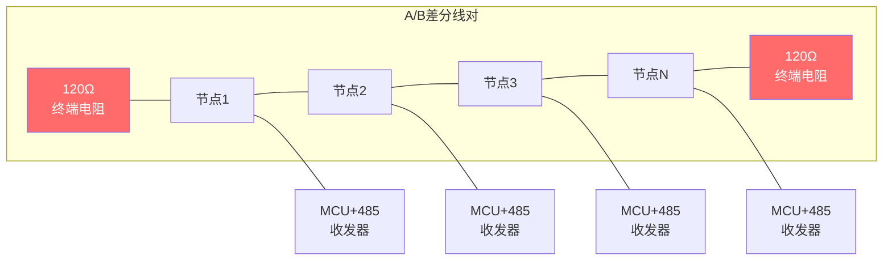

# B-A.4.1 UART物理层与协议 [知识点289-290]

> 所属章节：第五部 B. 总线协议 > B-A.4 UART子系统
>
> 难度：[B] Beginner | 预计阅读时间：25分钟

## <span class="blue"> 本节导读

UART（Universal Asynchronous Receiver/Transmitter，通用异步收发传输器）是嵌入式领域最基础、最普遍的串行通信方式。从你第一次用串口打印 "Hello World"，到GPS模块回传NMEA语句，再到蓝牙模组的AT指令交互——UART无处不在。本节我们从物理层出发，搞懂每一帧数据的时序构成、波特率的来龙去脉，以及RS-232/RS-485/TTL三种电平标准的本质区别。这些知识是你后续调试任何串口设备的基石。

---

## <span class="blue"> 知识点289 [B] — UART硬件基础

UART的硬件极简，只需要两根数据线就能工作：

| 信号线 | 方向 | 说明 |
|--------|------|------|
| TX | 输出 | 发送数据（Transmit） |
| RX | 输入 | 接收数据（Receive） |
| GND | — | 共地参考（必须连接） |

注意接线时要**交叉连接**：设备A的TX接设备B的RX，设备A的RX接设备B的TX。很多人第一次调试串口没出数据，查了半天发现是TX-TX、RX-RX直连了——这种"直通"接法在UART里是错误的，只有在某些特殊调试场景（如回环测试）才会用。

UART是**异步通信**，没有时钟线。收发双方依靠**事先约定的波特率**来同步每一位的持续时间。这也是UART与SPI、I2C最大的区别——后者都有独立的时钟线（SCLK/SCL）来同步数据。

<br>

### UART一帧数据的构成

UART传输的基本单元是"帧"（Frame）。在空闲状态下，TX线保持**高电平**。当要开始发送数据时，线路电平变化构成完整帧：

```
空闲(H)  起始位    D0(LSB)   D1       D2       D3       D4       D5       D6       D7(MSB)   停止位   空闲(H)
  │        │        │        │        │        │        │        │        │        │         │        │
  ├────────┴────────┴────────┴────────┴────────┴────────┴────────┴────────┴────────┴─────────┴────────┤
  │   ↓    │   ↑    │   ↑    │   ↑    │   ↑    │   ↑    │   ↑    │   ↑    │   ↑    │   ↑     │
  │  低电平 │ bit0   │ bit1   │ bit2   │ bit3   │ bit4   │ bit5   │ bit6   │ bit7   │ 高电平  │
  │ (1bit) │(=0/1)  │(=0/1)  │(=0/1)  │(=0/1)  │(=0/1)  │(=0/1)  │(=0/1)  │(=0/1)  │(1bit)   │

  │<───────── 1 bit duration = 1/波特率 ────────────────────────────────────────────────────────────>│

  @115200bps: 1bit ≈ 8.68μs
  @9600bps:   1bit ≈ 104.2μs
```

一帧典型的UART数据（8N1配置，即8数据位、无校验、1停止位）从上到下的顺序是：

| 位段 | 位数 | 电平 | 功能说明 |
|------|------|------|----------|
| 起始位 | 1 bit | 低电平（0） | 标志一帧开始，从高到低的下降沿触发接收方开始采样 |
| 数据位 | 5-9 bit | 按数据变化 | 实际承载数据，LSB在前（先发最低位） |
| 校验位 | 0-1 bit | 按校验方式 | 可选：无/奇校验/偶校验/标记/空间 |
| 停止位 | 1-2 bit | 高电平（1） | 标志一帧结束，回到空闲状态 |

> 💡 **提示**：最常用的配置是 **8N1**（8数据位、无校验、1停止位），这也是Linux串口工具的默认配置。如果你看到奇怪的数据，先确认双方是否都用8N1。

<br>

### 校验位怎么工作

校验位用于简单的错误检测，不是纠错：

| 校验方式 | 说明 | 校验位值（假设数据中有3个1） |
|----------|------|---------------------------|
| None（无） | 不检错 | — |
| Even（偶校验） | 数据位+校验位中1的总数为偶数 | 1（3+1=4，偶数） |
| Odd（奇校验） | 数据位+校验位中1的总数为奇数 | 0（3+0=3，奇数） |
| Mark | 校验位固定为1 | 1 |
| Space | 校验位固定为0 | 0 |

实际使用中，Most Significant Bit（MSB）模式多见于与老旧设备的兼容性场景。现代设备通常选择无校验，因为更高层的协议（如Modbus CRC、Checksum）已经提供了更可靠的校验机制。

<br>

### 波特率与误差

波特率（Baud Rate）表示每秒传输的码元数。对于二进制UART，波特率=比特率（bps）。常见波特率如下：

| 波特率 | 每bit时长 | 应用场景 | 典型芯片支持 |
|--------|----------|----------|-------------|
| 9600 | 104.2μs | 低速调试、老旧设备兼容 | 所有UART |
| 115200 | 8.68μs | **最常用**，串口控制台默认 | 所有UART |
| 230400 | 4.34μs | 中等速率GPS模块 | 大多数 |
| 460800 | 2.17μs | 高速传感器数据 | 较新芯片 |
| 921600 | 1.09μs | 蓝牙HCI、高速下载 | 需确认支持 |
| 1500000 | 0.67μs | 部分SoC内置调试 | 高端芯片 |
| 3000000 | 0.33μs | 高速ISP下载 | 部分专用芯片 |

当MCU使用某个主频时钟分频来产生波特率时，分频不一定能整除，会产生误差。以下是一个典型16MHz晶振MCU的波特率误差分析：

| 目标波特率 | 分频系数 | 实际波特率 | 误差% | 是否可用 |
|-----------|---------|-----------|-------|---------|
| 9600 | 1666.67 | 9603.8 | +0.04% | ✅ 优秀 |
| 19200 | 833.33 | 19200.8 | +0.004% | ✅ 优秀 |
| 38400 | 416.67 | 38409.6 | +0.025% | ✅ 优秀 |
| 57600 | 277.78 | 57553.9 | -0.08% | ✅ 良好 |
| 115200 | 138.89 | 115107 | -0.08% | ✅ 良好 |
| 230400 | 69.44 | 230215 | -0.08% | ✅ 良好 |
| 460800 | 34.72 | 461538 | +0.16% | ✅ 可用（临界） |
| 921600 | 17.36 | 941176 | +2.12% | ⚠️ 有风险 |

> ⚠️ **陷阱**：**波特率不匹配是UART乱码的头号原因**。更隐蔽的是——双方都"号称"115200，但由于各自晶振精度不同，实际波特率一个是115107、另一个是115384（2%偏差）。UART通常能承受约2-3%的误差，超过这个范围就开始丢数据了。调试时务必用逻辑分析仪或示波器抓实际波形，反推真实波特率。

> 💡 **提示**：调试UART的第一步永远是**确认波特率**。乱码时别急着怀疑代码，先用 `stty -F /dev/ttyUSB0 speed` 查看当前速率，或者接上逻辑分析仪抓TX/RX波形，测量一个bit的宽度，用 `1/宽度` 反推实际波特率。这是一个万能排障口诀。

<br>

### 流控（Flow Control）

当接收方处理速度跟不上发送方时，需要流控来防止数据丢失：

| 流控类型 | 信号线 | 原理 | 适用场景 |
|----------|--------|------|----------|
| 无流控 | — | 依赖接收方CPU足够快 | 低速、短帧、CPU空闲率高 |
| 硬件流控（RTS/CTS） | RTS、CTS | RTS表示"我可以接收"，CTS表示"你可以发送" | 高速大数据量传输 |
| 软件流控（XON/XOFF） | 无 | 用0x11(XON)和0x13(XOFF)控制字符 | 只有TX/RX两根线的场景 |

硬件流控需要额外连接RTS和CTS线，形成完整的"5线串口"。软件流控不增加线缆，但会占用0x11和0x13两个字符——如果你的数据流中可能包含这两个字节值，就别用软件流控，否则会误判为流控命令。

---

## <span class="blue"> 知识点290 [B] — RS-232 vs RS-485 vs TTL电平

UART只是**协议规范**（规定了帧格式和时序），它不关心电平是多少伏。实际的物理层电平由RS-232、RS-485或TTL等标准定义。

### 三种电平标准对比

| 对比维度 | RS-232 | RS-485 | TTL |
|----------|--------|--------|-----|
| **信号类型** | 单端（对地电压） | 差分（A-B电压） | 单端（对地电压） |
| **逻辑1电平** | -3V ~ -15V | A-B ≥ +200mV | 3.3V / 5V |
| **逻辑0电平** | +3V ~ +15V | A-B ≤ -200mV | 0V |
| **最大距离** | ~15米 | ~1200米 | ~1米（板内） |
| **最大节点数** | 点对点（1发1收） | 32/128/256节点 | 点对点 |
| **通信方式** | 全双工 | 半双工或全双工 | 全双工 |
| **常用接口** | DB9、DB25 | 接线端子、凤凰头 | 排针、杜邦线 |
| **典型应用** | 台式机串口、调制解调器 | 工业传感器网络、PLC | MCU与模块直连 |

<br>

### RS-232详解

RS-232是最早的串口标准，常见于老式台式机后面的DB9接口。它用**负电压表示逻辑1**、**正电压表示逻辑0**，这种反直觉的定义叫"负逻辑"。±3V到±15V的大摆幅让它有一定的抗干扰能力，但也限制了传输距离（约15米）和速率（通常不超过115200bps）。

RS-232是**点对点**的，一个DB9串口只能连接一个设备。典型的DB9引脚定义：

```
DB9母头（计算机侧）引脚定义：
    5-4-3-2-1  (上排，从左到右)
    9-8-7-6    (下排)

  Pin1: DCD   数据载波检测
  Pin2: RXD   接收数据 ← 注意：这里是计算机视角的RX
  Pin3: TXD   发送数据 ← 注意：这里是计算机视角的TX
  Pin4: DTR   数据终端就绪
  Pin5: GND   信号地
  Pin6: DSR   数据设备就绪
  Pin7: RTS   请求发送
  Pin8: CTS   清除发送
  Pin9: RI    振铃指示
```

连接MCU（TTL电平）到PC的RS-232串口时，需要一个**电平转换芯片**，如MAX3232（3.3V）或MAX232（5V）。直接把MCU的TX接到DB9上会烧芯片，因为RS-232的±12V远超3.3V容限。

<br>

### RS-485详解

RS-485是工业场景的主力军。它采用**差分信号**——逻辑状态由A、B两根线的电压差决定，而不是对地电压。这意味着它天然抵抗共模干扰，一根线上感应到的噪声会同时出现在A和B上，差值不变。

#### RS-485半双工时序

RS-485最常见的配置是**半双工**——A、B两根线既用于发送也用于接收，但不能同时进行。需要一个控制信号来切换方向：

```
MCU侧                    RS-485收发器                 总线侧
┌──────┐                ┌──────────┐                ┌────────┐
│  TX  │───────────────→│   DI     │                │        │
│  RX  │←───────────────│   RO     │                │        │
│  GPIO│───────────────→│DE/RE(←)  │────A───────────│  总线A │
│      │                │          │────B───────────│  总线B │
└──────┘                └──────────┘                └────────┘

半双工时序图：

    发送阶段                          接收阶段              发送阶段
    │<──────────────>│                │<──────>│           │<───>│
    │                │                │        │           │     │
    │   数据帧       │   切换间隙     │ 数据帧 │ 切换间隙  │数据 │
────┴────────────────┴────────────────┴────────┴───────────┴─────┴───
DE/RE
(高=发) ─────┐              ┌─────────┐        ┌─────────┐
(低=收)      └──────────────┘         └────────┘         └─────

TX        ───┐              ┌─────────┐        ┌─────────┐
(数据)       └─UART帧───────┘  空闲   └─帧─────┘ 空闲   └─帧──

RX                高阻态          ←─帧────→  高阻态
(接收) ───────────────────────────┐        ┌───────────────────
                                  └────────┘

关键参数：
- DE/RE切换延迟：通常需要1个bit时间的保护间隔
- 总线空闲时：A-B ≈ +200mV（偏置电阻保证确定状态）
- 总线上多节点时：所有发送器的DE为低（高阻态），只有发送方的DE为高
```

DE（Driver Enable）和RE（Receiver Enable）通常连在一起由同一个GPIO控制。**高电平**时收发器进入发送模式，**低电平**时进入接收模式（接收器始终使能的情况下RE可能单独处理）。

> 💡 **提示**：半双工RS-485最容易出的问题是**方向切换时机不对**。发送完最后一个停止位后，要延时一段时间再把DE拉低切换到接收模式。如果切得太早，最后一个bit还没发完；切得太晚，可能错过对方的立即回应。通常在驱动里用定时器或计算bit时间来精确控制。

#### RS-485总线拓扑

RS-485采用**总线型拓扑**，所有设备并联在同一对A/B线上：



终端电阻（120Ω）必须加在总线两端，用于阻抗匹配、消除信号反射。如果总线短（<10米）且速率低（<9600bps），有时可以省略，但工业场景下强烈建议 always-on。短截线（Stub）要尽量短——从主干线到节点的引线越短越好，否则会产生反射。

RS-485标准最初规定32个节点（单位负载），后来有了1/2负载和1/8负载的收发器，节点数可以扩展到128甚至256个。

<br>

### TTL电平

TTL（Transistor-Transistor Logic）就是我们MCU直接用的高低电平：

| 电压标准 | 逻辑1 | 逻辑0 | 常见MCU |
|----------|-------|-------|---------|
| 3.3V LVTTL | 2.0V ~ 3.3V | 0V ~ 0.8V | STM32、ESP32、树莓派 |
| 5V TTL | 2.0V ~ 5V | 0V ~ 0.8V | Arduino Uno、51单片机 |

两个3.3V的MCU之间UART直连即可，TX接RX、RX接TX、共地。但要注意：**5V TTL的输出接到3.3V的输入可能会烧GPIO**。如果需要混接，中间加电平转换电路或模块（如TXB0108、分压电阻）。

---

## <span class="blue"> 本节总结

| 要点 | 核心内容 |
|------|----------|
| UART帧格式 | 起始位(低) + 数据位(5-9, LSB先) + 校验位(可选) + 停止位(高)，8N1最常用 |
| 波特率误差 | 双方误差在2%内通常可正常通信，超3%大概率乱码；务必用逻辑分析仪验证实际波特率 |
| 流控选择 | 低速短帧可无流控；高速用RTS/CTS硬件流控；两线场景用XON/XOFF软件流控 |
| RS-232 | ±12V单端信号，15米，点对点，接MCU需MAX3232电平转换 |
| RS-485 | 差分信号，1200米，32~256节点，半双工需方向控制，总线两端加120Ω终端电阻 |
| TTL | 3.3V/5V单端，板内/短距直连MCU，注意电压等级匹配 |

---

## <span class="blue"> 下一步

**B-A.4.2 UART Linux驱动与调试** — 在掌握物理层协议的基础上，我们将进入Linux内核视角：如何编写UART设备树节点、`platform_driver`的probe流程、`termios`结构体的配置方法、以及用户空间用`stty`和`minicom`调试串口的实战技巧。你还会看到如何用手头的USB转串口模块配合逻辑分析仪做端到端的数据通路验证。

---

## <span class="blue"> 配套资源

- 在线工具：🔍 "UART baud rate calculator"（用于计算分频系数和误差）
- 逻辑分析仪：Saleae Logic /  cheap 8-channel LA（推荐必备，抓波形反推波特率）
- 电平转换芯片手册：MAX3232E datasheet（TI官网）、SP3485E datasheet（RS-485收发器）
- 推荐实践：用USB转TTL模块连接STM32开发板，分别从9600改到115200再到921600，观察何时开始出现误码
