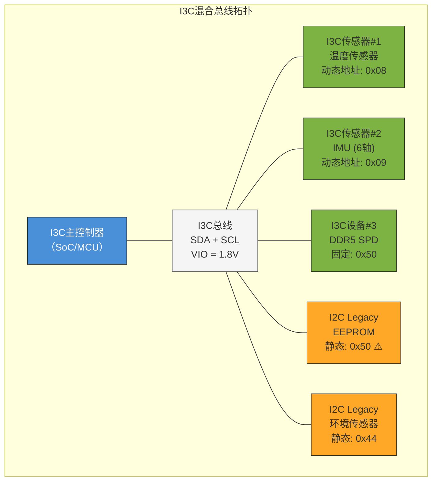

# B-A.5.1 I3C物理层与I2C演进 [知识点295-296]

> 所属章节：第五部 B. 总线协议 > B-A.5 I3C：智能传感器总线
>
> 难度：[I] Intermediate | [M] Master | 预计阅读时间：25分钟

## <span class="blue"> 本节导读

I3C（Improved Inter-Integrated Circuit）是MIPI联盟制定的下一代传感器总线标准，设计目标很明确：**用两根线干更多的事，而且干得更快、更省电**。它和I2C共用SDA/SCL引脚，老设备能直接插上新总线——但别急着高兴，推挽驱动和开漏驱动的切换里头有不少门道。DDR5的SPD（内存参数芯片）已经从I2C全面切换到I3C，2024年起主流手机SoC、汽车ECU、工业MCU纷纷集成I3C控制器。如果你正在设计一个需要挂多个传感器的系统，这一节帮你判断该不该跳过I2C直接用I3C。

---

## <span class="blue"> 知识点295 [I] — I3C硬件物理层

I3C的物理接口和I2C看起来几乎一样——还是**SDA（数据线）**和**SCL（时钟线）**两根线，上拉电阻也还在。但别被外表骗了，底层驱动方式已经发生了本质变化。

### 引脚兼容与电气差异

| 参数 | I2C | I3C | 说明 |
|------|-----|-----|------|
| 信号线 | SDA + SCL | SDA + SCL | 引脚完全兼容 |
| 驱动方式 | 纯开漏（Open-Drain） | 开漏 + 推挽（Push-Pull）混合 | I3C根据阶段切换 |
| 最大速率 | Fast-mode+ 1MHz | SDR 12.5MHz / HDR 33.3Mbps | 10~33倍提升 |
| 总线电容限制 | 400pF | **50pF** | 更严格的布线要求 |
| 上拉电阻 | 必须（通常1k~10kΩ） | 可选，推挽阶段可移除 | 降低静态功耗 |
| 从设备数量 | 理论127（7位地址） | 理论同样127 | 但I3C支持动态地址 |
| 中断机制 | 额外IRQ引脚或时钟拉伸 | **IBI带内中断**（In-Band Interrupt） | 省一根GPIO |

I3C总线电容限制从I2C的400pF骤降到50pF，这是个关键设计约束。意味着你不能在I3C总线上挂太多设备，或者走线太长。实际产品中，I3C总线通常控制在**20cm以内**，设备数不超过**10个**。

### 混合驱动：开漏 vs 推挽

I3C最精妙的设计在于**混合驱动机制**——总线仲裁阶段用开漏（和I2C一样），数据传输阶段切到推挽（速率飙升）。

**开漏模式**（Open-Drain）：
- 只有下拉晶体管，上拉靠外部电阻
- 优点：多设备不会冲突（线与逻辑），适合仲裁
- 缺点：上升沿由RC充电决定，速度慢

**推挽模式**（Push-Pull）：
- 有独立的上拉和下拉晶体管
- 优点：主动驱动，边沿陡峭，速率可达33Mbps
- 缺点：两个设备同时驱动会短路，必须避免冲突

```
I2C 纯开漏波形（SDA）                I3C 推挽波形（SDA，数据阶段）

     ___________                          ┌───┐   ┌───┐
_____|           |_____                ───┘   └───┘   └───
     <--- RC --->                          ↑  ↑
     缓慢的上升沿                     陡峭边沿 <10ns

     开漏：主控只拉低，                 推挽：主控主动拉高/拉低
     释放后靠上拉电阻充电               无需等待RC充电
```

I3C的状态机大概是这样的流程：

1. **总线空闲** → 开漏模式，上拉电阻生效
2. **START + 地址仲裁** → 开漏模式，多设备可以竞争（和I2C兼容）
3. **ACK确认后** → 如果通信双方都是I3C设备，切换到推挽模式
4. **数据传输** → 推挽模式，速率飙升
5. **STOP前** → 切回开漏模式，安全释放总线

---

## <span class="blue"> 知识点296 [I] — I3C速率模式详解

| 模式 | 速率 | 编码方式 | 驱动类型 | 适用场景 |
|------|------|----------|----------|----------|
| **SDR**（Single Data Rate） | 最高12.5MHz | 1bit/clock，类似I2C | 开漏→推挽 | 常规寄存器读写，兼容I2C设备 |
| **HDR-DDR**（Double Data Rate） | 最高25Mbps | 2bit/clock，双边沿采样 | 纯推挽 | 大数据量传输，如图像传感器 |
| **HDR-TSP**（Ternary Symbol Pure） | 最高33.3Mbps | 三态编码，1.5bit/clock | 纯推挽 | 最高吞吐场景，如DDR5 SPD |
| **HDR-TSL**（Ternary Symbol Legacy） | 最高33.3Mbps | 三态编码，兼容I2C设备 | 混合驱动 | 混合总线中的高速传输 |
| **I2C FM**（Fast-mode） | 400kHz | 标准I2C | 开漏 | 纯I2C legacy设备 |
| **I2C FM+**（Fast-mode+） | 1MHz | 标准I2C | 开漏 | 较新的I2C设备 |

SDR模式下，I3C的基本时序和I2C很像——每个SCL周期传1bit，主机发8bit地址+读/写位，从机回ACK/NACK。老I2C设备在I3C总上能正常工作（只要地址不冲突），这就是**向后兼容**的物理基础。

HDR系列模式是I3C的"极速档"。进入HDR需要特殊的**进入序列**（Enter HDR CCC命令），一旦进入，总线上的I2C legacy设备会忽略后续数据（它们认不出HDR帧格式），等HDR传输结束发出退出序列后，I2C设备才重新参与。这种设计很聪明——I3C设备和I2C设备可以**共存于同一总线**，高速数据传输不会干扰legacy设备。

---

## <span class="blue"> I3C电压等级 [I]

| 电压等级 | 典型应用场景 | I2C兼容性 | 注意事项 |
|----------|-------------|-----------|----------|
| **1.0V** | 先进手机SoC内部传感器总线 | ❌ 不兼容 | 仅纯I3C设备，需确认所有设备支持 |
| **1.2V** | 低功耗IoT、可穿戴设备 | ❌ 不兼容 | 常见于1.2V MCU内部总线 |
| **1.8V** | 主流手机、平板、汽车ECU | ⚠️ 部分兼容 | 大部分I2C设备最高1.8V，需查规格书 |
| **3.3V** | 工业控制、开发板、legacy系统 | ✅ 完全兼容 | 传统I2C设备主流电压 |

> ⚠️ **陷阱**：I3C推挽驱动在高电压下可能损坏纯I2C从设备！
>
> 如果你的I3C总线工作在3.3V，上面挂了一个只耐压1.8V的I2C传感器——推挽阶段的信号摆幅会直接击穿它的输入保护二极管。**设计混合总线时，必须确认所有I2C legacy设备的Vih(max)和Viab(max)**。如果不确定，统一用1.8V是最安全的选择。

---

## <span class="blue"> I2C→I3C演进：7大改进 [M]

MIPI联盟在设计I3C时，针对I2C在移动设备和传感器网络中的痛点做了系统性升级。下面这张对比表帮你一眼看清差距：

| 维度 | I2C | I3C | 提升 |
|------|-----|-----|------|
| **峰值速率** | 1MHz（FM+） | 12.5MHz SDR / 33.3Mbps HDR | **12x ~ 33x** |
| **功耗** | 静态功耗高（上拉电阻持续耗电） | 推挽阶段无上拉，功耗降低 | **↓ ~60%** |
| **中断机制** | 需额外IRQ引脚或时钟拉伸 | IBI带内中断，不额外占GPIO | **省1根线** |
| **地址分配** | 静态地址，出厂固化，易冲突 | 动态地址分配（SETAASA/SETDASA） | **即插即用** |
| **热插拔** | 不支持 | 支持动态加入/离开总线 | **在线维护** |
| **控制命令** | 无统一标准 | CCC命令集（标准化控制） | **统一管理** |
| **向后兼容** | — | 原生兼容I2C设备 | **保护投资** |

逐个拆解这7个改进点：

**① 速度提升10倍以上**
I2C的1MHz在传感器越来越多的场景下成了瓶颈。一个IMU（惯性测量单元）要读加速度+陀螺仪+温度三个寄存器，I2C可能要花几毫秒。I3C的HDR模式把这个时间压缩到几十微秒——对于需要1kHz采样率的姿态算法来说，这是质变。

**② 功耗降低约60%**
I2C的上拉电阻是个"电老虎"。3.3V总线、1kΩ上拉，每次传输低电平时就有3.3mA的静态电流。推挽驱动取消了持续上拉，只在开漏阶段需要上拉电阻。手机里有十几个传感器，累积下来能省不少电。

**③ IBI带内中断替代GPIO**
这是我最喜欢的设计。以前每个传感器都要连一根中断线到SoC——加速度中断、触摸屏中断、接近传感器中断……十几根线密密麻麻。I3C的IBI（In-Band Interrupt）让从设备在总线空闲时主动"举手"，主机轮询到后读取事件。**省下来的GPIO pin可以用来做其他事**。

**④ 动态地址避免冲突**
I2C的7位静态地址是灾难之源。两个传感器出厂地址一样怎么办？要么飞线改地址引脚，要么换型号。I3C上电时通过CCC命令给每个设备分配动态地址，**同一总线上可以有多个同型号设备**，再也不会地址打架。

**⑤ 热插拔支持**
传感器可以在系统运行时加入或离开总线。对于需要在线校准、模块化维护的工业场景非常实用。

**⑥ CCC命令集**
Common Command Codes（CCC）是I3C的标准化控制指令集，比如`ENEC`（使能事件）、`DISEC`（禁用事件）、`ENTAS0~3`（设置活动状态）、`RSTACT`（复位动作）。所有I3C设备都认得这些命令，**驱动开发不用再翻每家厂商的秘籍**。

**⑦ 向后兼容I2C**
这是最务实的决定。你不需要一次性把所有I2C设备换成I3C——新主控+I3C总线，老的I2C传感器照常工作，逐步替换即可。

> 💡 **提示**：设计新系统时**优先选I3C** → 向后兼容I2C老设备 → 未来升级painless。I3C主控可以驱动I2C从设备，但I2C主控无法驱动I3C从设备（I3C特有的推挽模式和CCC命令I2C主控不理解）。选I3C做主控是只赚不赔的买卖。

---

## <span class="blue"> I3C+I2C混合总线拓扑

实际系统中，I3C总线上往往同时挂着I3C设备和I2C legacy设备。下面这张图展示了典型的混合拓扑：



注意图中DDR5 SPD（I3C设备）和EEPROM（I2C设备）都用了地址0x50。这在I3C中是可以管理的——I3C主机会通过动态地址分配区分它们，但**设计时仍要尽量避免静态地址重叠**，减少初始化阶段的复杂性。

混合总线的工作时序大概是这样的：

```
时间轴 ————————————————————————————————————————————————————>

[开漏]  START + 0x7E(W)  [CCC广播: 发动态地址给I3C设备]
[开漏]  ACK + STOP
         ↓
[开漏]  START + 0x08(W)   [选中I3C设备#1]
[推挽]  数据突发传输      ←→ ←→ ←→  高速！
[推挽]  数据突发传输      ←→ ←→ ←→
[开漏]  STOP
         ↓
[开漏]  START + 0x50(W)   [选中I2C EEPROM —— 回退到I2C时序]
[开漏]  慢速I2C读写      ~ ~ ~ ~ ~   legacy速度
[开漏]  STOP
         ↓
[开漏]  START + 0x02/WR   [IBI: 从设备主动中断请求]
[开漏]  主机响应IBI → 读取中断源
[开漏]  STOP
```

---

## <span class="blue"> 实际应用案例：DDR5 SPD的I3C切换

DDR5内存条上的SPD（Serial Presence Detect）芯片存储了内存的时序参数、容量、制造商信息。DDR4及之前用I2C（SM总线）读SPD，DDR5全面切换到I3C。

**为什么DDR5非用I3C不可？**

- DDR5支持片上ECC和更复杂的时序训练，SPD数据量增大
- 服务器单条DDR5 DIMM上有2个独立子通道，需要分别读取SPD
- JEDEC规定DDR5 SPD必须支持I3C的HDR-TSP模式，最高33.3Mbps

**接线示意**（服务器主板）：

```
CPU SoC (I3C主控)
    │
    ├── I3C_SCL ──┬──► SPD0 (DIMM_A0槽)
    │             ├──► SPD1 (DIMM_A1槽)
    │             ├──► SPD2 (DIMM_B0槽)
    │             └──► SPD3 (DIMM_B1槽)
    │
    └── I3C_SDA ──( shared bus )

    地址分配：
    - SPD0: 静态地址 0x50 (DIMM_A0)
    - SPD1: 静态地址 0x51 (DIMM_A1)
    - SPD2: 静态地址 0x52 (DIMM_B0)
    - SPD3: 静态地址 0x53 (DIMM_B1)
```

DDR5 SPD芯片（如Renesas RA8T1系列、Microchip 24CS512）支持1.0V/1.2V工作电压，纯I3C无I2C向后兼容。**不要尝试把DDR4的I2C SPD芯片插到DDR5插槽上**。

---

## <span class="blue"> 设计 checklist

| 检查项 | 状态 |
|--------|------|
| 总线走线长度 < 20cm | ☐ |
| 总线电容 < 50pF（包括线缆+设备输入电容） | ☐ |
| 所有I2C legacy设备的耐压 ≥ 总线VIO | ☐ |
| I2C设备输入电容 < 10pF（避免拖慢总线） | ☐ |
| 上拉电阻值匹配总线电容（通常1k~4.7kΩ@1.8V） | ☐ |
| 确认主控支持所需的HDR模式 | ☐ |
| 混合总线上I2C设备地址不与I3C静态地址冲突 | ☐ |

---

## <span class="blue"> 本节总结

| 要点 | 一句话总结 |
|------|-----------|
| 引脚兼容 | I3C复用I2C的SDA/SCL，但内部驱动机制完全不同 |
| 混合驱动 | 开漏（仲裁）+ 推挽（数据）的智能切换是核心创新 |
| 速率 | SDR 12.5MHz / HDR-TSP 33.3Mbps，比I2C快10~33倍 |
| 总线电容 | 50pF限制比I2C的400pF严格得多，布线要短 |
| 电压选择 | 混合总线优先选1.8V，保护I2C legacy设备 |
| 7大改进 | 速度↑、功耗↓、IBI省GPIO、动态地址、热插拔、CCC标准化、向后兼容 |
| 行业趋势 | DDR5 SPD、手机传感器、汽车ECU已全面转向I3C |

---

## <span class="blue"> 下一步

下一节 **B-A.5.2 I3C协议层与CCC命令** 将深入讲解：
- I3C的7E广播地址机制与动态地址分配流程
- CCC命令集完整分类：广播CCC vs 定向CCC
- IBI带内中断的完整时序与实现细节
- HDR模式进入/退出序列的代码实现
- Linux内核I3C子系统架构与驱动编写

---

## <span class="blue"> 配套资源

- MIPI I3C Specification v1.1.1（官方规范）：https://www.mipi.org/specifications/i3c-sensor-specification
- JEDEC DDR5 SPD标准：JESD300-5A（I3C接口要求）
- Linux内核I3C文档：`Documentation/i3c/`（内核源码树）
- NXP i.MX8/9系列I3C控制器参考手册
- STM32H5系列I3C外设应用笔记 AN5407
