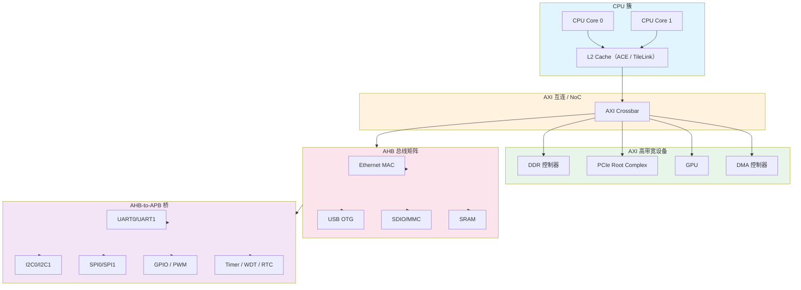

# B-A.1.1 APB/AHB/AXI/TileLink 概念认知

> 所属章节：第五部 B. 总线协议 > B-A.1 片内总线认知
>
> 难度：[B] Beginner | 预计阅读时间：25 分钟

## <span class="blue"> 本节导读

本板块是 B 扩展《总线协议》的第一站。认知顺序采用由片内向片外：先建立 SoC 内部互连的宏观图景，再逐层向外延伸到板级低速接口、高速接口和系统级网络总线。

打开一份 SoC 数据手册，第一章往往是密密麻麻的总线互联框图。作为软件工程师，你不需要设计地址译码逻辑，也不需要分析握手信号的建立保持时间。你的核心关注点是三件事：设备挂在哪条总线上、它的物理地址是多少、在设备树里如何描述它。

本节覆盖：AMBA 总线家族（APB/AHB/AXI）的分层定位与能力差异、AXI 五通道的工作方式、RISC-V 生态的 TileLink 总线、典型 SoC 片内拓扑，以及设备树 `reg` 属性与 `/proc/iomem` 的地址核对方法。

---

## <span class="blue"> AMBA 总线家族：APB、AHB、AXI

### 为什么需要分层

不同外设的带宽需求相差几个数量级：DDR 控制器需要每秒几十 GB，UART 每秒几 KB 就足够。用统一的高速总线连接所有外设，会带来两个直接后果：低速外设被迫实现复杂的高速接口协议，硅片面积和功耗白白增加。ARM 的 AMBA（Advanced Microcontroller Bus Architecture）家族按带宽需求分层设计，让每类外设使用与其流量相匹配的总线：

```
┌─────────────────────────────────────────────────────────────┐
│                    AMBA 总线家族分层                          │
├─────────────────────────────────────────────────────────────┤
│                                                             │
│   AXI（高带宽层）───► CPU, GPU, DDR 控制器, PCIe, DMA        │
│      │                                                      │
│      ▼                                                      │
│   AHB（中速层）─────► Ethernet MAC, USB Host,                │
│      │                 SDIO/MMC 控制器, SRAM                  │
│      ▼                                                      │
│   APB（低速层）─────► UART, I2C, SPI, GPIO,                  │
│                        Timer, RTC, WDT                        │
│                                                             │
└─────────────────────────────────────────────────────────────┘
```

### APB：低速外设总线

APB（Advanced Peripheral Bus）是 AMBA 家族中结构最简单的总线，UART、I2C、SPI、GPIO 的寄存器访问大多经 APB 完成。

设计取向是简单、低功耗：

- 无流水线，一次传输固定占用 2 个时钟周期（setup 相 + access 相）
- 不支持突发传输（burst），每次事务只传一个数据
- 地址总线与数据总线分离但均为单向，译码逻辑极简
- 总线上只有一个主设备——通常是一座 AHB-to-APB 或 AXI-to-APB 桥

> 💡 用 `devmem` 读写 UART 控制器寄存器时，访问最终经 APB 总线到达控制器。APB 对软件透明，但知道它存在，可以理解为什么这类寄存器访问有固定延迟、为什么不能指望它有吞吐能力。

### AHB：中速流水线总线

AHB（Advanced High-performance Bus）面向中等带宽外设，关键特性是流水线与突发传输：

- 流水线：当前传输的 data 相与下一次传输的 address 相重叠，稳态下每周期完成一次传输
- 突发传输：一次发起连续传 4/8/16 个数据，DMA 搬运场景效率显著提升
- 多主仲裁：CPU 与 DMA 等多个主设备竞争总线使用权
- 典型时钟频率 100~200 MHz

> 💡 DMA 控制器常挂在 AHB 上。用 dmaengine 框架提交一次 Scatter-Gather 传输，DMA 经 AHB 在内存与外设之间搬数据，全程不需要 CPU 参与。

<!-- 【待补图】images/B-A.1.1-APB与AHB传输节奏对比.png（优先级：★必要）
图名：APB 两周期传输 vs AHB 流水线传输时序对比图
生图提示词：数字时序图风格，白底，工程教科书插画，上下两组对照。上组"APB：固定两周期"：画出 CLK 方波（T1~T6），PADDR 信号在 T1~T2 保持有效（填充矩形）标注"setup 相"，PSEL 在 T1 拉高，PENABLE 在 T2 拉高，PWDATA 在 T2 有效，标注"access 相"，T2 结束处画竖虚线标注"一次传输完成=2 周期"；下方再画背靠背第二次传输占 T3~T4，用括号标注"两次传输共 4 周期，无重叠"。下组"AHB：流水线重叠"：CLK 同样 T1~T6，HADDR 在 T1、T2、T3 连续给出三个地址（三段填充矩形标注 A1/A2/A3），HWDATA 在 T2、T3、T4 给出对应数据（标注 D1/D2/D3），用斜向箭头连接 A1→D1、A2→D2 体现"地址相与前一数据相重叠"，括号标注"稳态每周期完成一次传输，三次传输共 4 周期"。两组右端各一行小字结论。信号线深蓝色，时钟灰色，关键竖虚线与标注红色，中文标注，扁平矢量，无阴影渐变。比例 16:9。 -->

### AXI：高性能总线

AXI（Advanced eXtensible Interface）是现代 ARM SoC 的主干，CPU、GPU、DDR 控制器、PCIe Root Complex 都挂在 AXI 上。

AXI 最显著的结构特征是 5 个相互独立的通道：

| 通道 | 方向 | 用途 | 代表信号 |
|------|------|------|----------|
| AR（Address Read） | Master → Slave | 读请求地址与控制信息 | ARADDR, ARVALID, ARREADY |
| R（Read Data） | Slave → Master | 返回读数据与响应 | RDATA, RVALID, RRESP |
| AW（Address Write） | Master → Slave | 写请求地址与控制信息 | AWADDR, AWVALID, AWREADY |
| W（Write Data） | Master → Slave | 写数据与字节使能 | WDATA, WSTRB, WVALID |
| B（Write Response） | Slave → Master | 写完成确认 | BVALID, BRESP |

五通道独立带来三个直接收益：

- 读写并行：读走 AR+R，写走 AW+W+B，两个方向互不占用对方资源
- 乱序完成：事务携带 ID 标签，先发出的请求不必先完成，慢速设备不阻塞快速设备
- QoS：事务可携带 4-bit 优先级标签，互连网络据此仲裁，避免 CPU 访存被 GPU 流量饿死

此外 AXI4 单次突发最长 256 个数据拍（AXI3 为 16），配合 64/128/256-bit 数据位宽，是 DDR 级别的带宽承载者。

### AMBA 演进路线

| 总线 | 推出时间 | 核心特征 | 典型挂载设备 | 软件工程师关注点 |
|------|----------|----------|--------------|------------------|
| APB | 1996 | 无流水线，2 周期固定传输 | UART, I2C, SPI, GPIO, Timer | 寄存器基地址、位域定义 |
| AHB | 1996 | 流水线，突发传输，多主仲裁 | Ethernet MAC, USB, SDIO, SRAM | DMA burst 对齐 |
| AXI3 | 2003 | 5 独立通道，乱序，QoS | CPU, GPU, DDR, PCIe | cache 属性、内存屏障 |
| AXI4 | 2010 | 写通道简化，长突发（256 拍） | 同上 | QoS 语义、原子操作 |
| AXI4-Lite | 2010 | AXI4 子集，无突发 | 轻量寄存器接口 | 与 APB 类似，地址对齐规则 |
| ACE | 2011 | AXI 之上增加缓存一致性 | 多核 CPU 簇 | 缓存维护操作、barrier 指令 |
| CHI | 2014 起 | 面向多核一致性，包交换分层 | 服务器级 SoC、大核簇 | 见 B-A.1.3 |

> 💡 AXI 之上的缓存一致性扩展（ACE）和面向多核/Chiplet 时代的 CHI，分别在 B-A.1.2 与 B-A.1.3 展开，本篇只需要知道它们在演进序列中的位置。

---

## <span class="blue"> TileLink：RISC-V 生态的开放总线

### TileLink 是什么

TileLink 是 SiFive 公司提出并开源的片内总线协议，专为 RISC-V SoC 设计。如果说 AXI 绑定了 ARM 生态，TileLink 就是 RISC-V 生态的对应选择——协议规范完全公开，配套开源实现（Rocket Chip、BOOM）可直接用于流片。

### 五通道架构

TileLink 借鉴了 AXI 的多通道思想，但通道划分围绕缓存一致性重新设计：

| 通道 | 方向 | 用途 | 与 AXI 的对应关系 |
|------|------|------|-------------------|
| A（Acquire） | Master → Slave | 请求数据或权限 | 类似 AR+AW |
| B（Probe） | Slave → Master | 查询/回收缓存权限（一致性） | AXI 无直接对应 |
| C（Release） | Master → Slave | 释放权限/写回数据 | 写回场景类似 W |
| D（Grant） | Slave → Master | 返回数据或授权 | 类似 R+B |
| E（GrantAck） | Master → Slave | 确认收到 Grant | AXI 无对应 |

B/C/E 三个通道为缓存一致性专用。多核共享内存时，互连经这些通道追踪"哪一行数据被哪个核缓存"，保证各核缓存不会读到过期数据——这是一致性协议的原生实现，而非 AXI 那样靠 ACE 外挂扩展。

### PLIC：RISC-V 的中断控制器

PLIC（Platform-Level Interrupt Controller）是 RISC-V 平台级中断控制器，功能对应 ARM 的 GIC。软件层面需要知道：

- PLIC 通常挂在 TileLink（或 APB）总线上，通过 MMIO 寄存器操作
- 每个外部中断源有独立的优先级寄存器与使能位
- 中断响应走 Claim/Complete 机制：读 Claim 寄存器获知中断号，处理完写 Complete 寄存器

### TileLink 与 AXI 对比

| 维度 | TileLink | AXI |
|------|----------|-----|
| 设计方 | SiFive（开源） | ARM（授权使用） |
| 生态绑定 | RISC-V | ARM Cortex 系列 |
| 通道数 | 5（A/B/C/D/E） | 5（AR/R/AW/W/B） |
| 缓存一致性 | 原生支持（B/C/E 通道） | 需 ACE 扩展 |
| 协议复杂度 | 相对简洁 | 信号更多，规范更厚 |
| 乱序支持 | 支持 | 支持 |
| QoS | 无原生 QoS 字段 | 原生 4-bit QoS |
| 典型 SoC | SiFive FU740、平头哥玄铁系列 | ARM Cortex-A/M 全系 SoC |
| 开源实现 | Rocket Chip、BOOM | 官方 IP 需授权 |

> ⚠️ 试图吃透 AXI 时序细节再动手写驱动，是典型的投入产出失衡。AXI 的握手细节、AxCACHE 编码、QoS 仲裁策略属于 SoC 架构师与数字前端工程师的领域。驱动工程师真正需要的是两条：设备挂在哪个地址区间（设备树 `reg` 与 `/proc/iomem`），以及寄存器访问的 cache 属性要求（MMIO 必须是 Device 类型映射）。把精力放在设备寄存器功能、中断处理流程和用户态接口上，回报高得多。

---

## <span class="blue"> SoC 片内总线拓扑



绝大多数 ARM SoC 的片内拓扑遵循同一条规律：

1. CPU 簇经 L2 Cache 接入 AXI 互连矩阵
2. AXI 承载最高带宽设备（DDR、PCIe、GPU、DMA）
3. AXI-to-AHB 桥将事务降速到 AHB 域，挂接中速外设
4. AHB-to-APB 桥再次降速，挂接低速外设
5. 每座桥完成地址译码与协议转换，保证各总线域地址空间不重叠

> 💡 多级桥接意味着外设寄存器访问要穿越一到两级协议转换。这解释了调试中常见的现象：对 APB 外设寄存器的单次读延迟明显高于对 SRAM 的访问。

---

## <span class="blue"> 软件工程师视角：地址映射与设备树

### 设备树中的总线层级

设备树是软件工程师与片内总线打交道的主要界面。以下片段取自 RK3568 的 `rk356x.dtsi`（本书配套源码缓存 `help-docs/kernel-src-v6.6/rk356x.dtsi`），为便于展示做了删减：

```dts
/ {
    soc {
        compatible = "simple-bus";
        #address-cells = <2>;
        #size-cells = <2>;
        ranges;

        // I2C1 控制器，地址 0xfe5a0000，占 4KB
        i2c1: i2c@fe5a0000 {
            compatible = "rockchip,rk3568-i2c", "rockchip,rk3399-i2c";
            reg = <0x0 0xfe5a0000 0x0 0x1000>;
            interrupts = <GIC_SPI 47 IRQ_TYPE_LEVEL_HIGH>;
        };

        // UART2（调试串口），地址 0xfe660000，占 256 字节
        uart2: serial@fe660000 {
            compatible = "rockchip,rk3568-uart", "snps,dw-apb-uart";
            reg = <0x0 0xfe660000 0x0 0x100>;
            interrupts = <GIC_SPI 150 IRQ_TYPE_LEVEL_HIGH>;
        };

        // GPIO1，地址 0xfe740000，占 256 字节
        gpio1: gpio@fe740000 {
            compatible = "rockchip,gpio-bank";
            reg = <0x0 0xfe740000 0x0 0x100>;
            interrupts = <GIC_SPI 66 IRQ_TYPE_LEVEL_HIGH>;
        };
    };
};
```

`reg = <地址高32位 地址低32位 长度高32位 长度低32位>`，地址编排直接反映总线层级。RK3568 的实际地址分配摘录：

| 设备 | 地址 | 占用长度 | 备注 |
|------|------|----------|------|
| i2c0 | 0xfdd4_0000 | 4 KB | 位于 PMU 电源域 |
| i2c1 ~ i2c5 | 0xfe5a_0000 ~ 0xfe5e_0000 | 各 4 KB | 连续排布 |
| uart0 | 0xfdd5_0000 | 256 B | PMU 域 |
| uart1 ~ uart9 | 0xfe65_0000 ~ 0xfe6d_0000 | 各 256 B | 步长 0x10000 |
| gpio1 | 0xfe74_0000 | 256 B | — |
| spi0 ~ spi3 | 0xfe61_0000 ~ 0xfe64_0000 | 各 4 KB | — |
| gmac0 / gmac1 | 0xfe2a_0000 / 0xfe01_0000 | 各 64 KB | 挂 AXI 域，含 DMA 引擎 |
| sdhci（eMMC） | 0xfe31_0000 | 16 KB | — |

两条可验证的规律：

- 寄存器型低速外设（UART、GPIO）每个只占 256 字节，是 APB 挂点的典型密度
- 带 DMA 能力的控制器（GMAC、SDHCI）地址区间大一到两个数量级，挂在 AXI/AHB 域

### /proc/iomem：内核视角的地址分配

设备寄存器读写异常时，第一排查手段是 `/proc/iomem` 与设备树 `reg` 对照：确认设备物理地址是否如预期注册、是否与其他驱动区间重叠。在运行的系统上执行：

```bash
cat /proc/iomem | grep -E "serial|i2c|ethernet"
```

RK3568 上的典型输出（节点名来自设备树）：

```
fe010000-fe01ffff : ethernet@fe010000
fe2a0000-fe2affff : ethernet@fe2a0000
fe5a0000-fe5a0fff : i2c@fe5a0000
fe5b0000-fe5b0fff : i2c@fe5b0000
fe650000-fe6500ff : serial@fe650000
fe660000-fe6600ff : serial@fe660000
```

逐行读出的信息：

- 两个以太网控制器各占 64 KB，属 AXI 域设备
- I2C 控制器各占 4 KB，从 `fe5a0000` 起连续排布，与 dtsi 一致
- UART 各占 256 字节，APB 挂点的典型尺寸

再进一步，可以从 sysfs 反查某个具体设备节点的设备树属性：

```bash
cat /sys/class/tty/ttyS2/device/of_node/compatible
cat /sys/class/tty/ttyS2/device/of_node/reg
```

第一行输出 `rockchip,rk3568-uart`、`snps,dw-apb-uart`，第二行输出 `reg` 属性的原始字节序数据。这条链路（`/proc/iomem` → sysfs `of_node` → dtsi）是确认"内核看到的设备"与"手册描述的设备"一致性的标准动作。

---

## <span class="blue"> APB vs AHB vs AXI 对比（Trade-off）

| 维度 | APB | AHB | AXI |
|------|-----|-----|-----|
| 全称 | Advanced Peripheral Bus | Advanced High-performance Bus | Advanced eXtensible Interface |
| 定位 | 低速外设寄存器 | 中速外设与 DMA | 高带宽主干 |
| 流水线 | 无 | 有（address/data 相重叠） | 有（5 通道全独立） |
| 突发传输 | 不支持 | 4/8/16 拍 | 最长 256 拍（AXI4） |
| 读写并行 | 不支持 | 不支持 | 支持（读写通道分离） |
| 乱序完成 | 不支持 | 不支持 | 支持（ID 标签） |
| 多主设备 | 不支持（单主） | 支持（仲裁器） | 支持（互连矩阵） |
| 典型时钟 | <50 MHz | 100~200 MHz | >200 MHz |
| 数据位宽 | 32-bit 为主 | 32/64-bit | 64/128/256-bit |
| 功耗 | 极低 | 中 | 较高 |
| 面积开销 | 最小 | 中等 | 最大 |
| 典型外设 | UART, I2C, SPI, GPIO, Timer, RTC | Ethernet, USB, SDIO, SRAM | CPU, GPU, DDR, PCIe, DMA |
| 软件关注点 | 寄存器地址与位域 | DMA burst 对齐 | cache 属性、QoS、内存序 |

选型逻辑一目了然：带宽需求决定挂载层级，外设功能决定寄存器接口复杂度。软件工程师不需要做这个选型（SoC 出厂已定），但需要会读——看到设备地址落在哪个区间，大致就能判断它在总线层级中的位置。

---

## <span class="blue"> 排障：地址与总线层问题的五张面孔

| 症状 | 根因 | 定位动作 |
|------|------|----------|
| 寄存器读写结果完全不可预期 | MMIO 被当普通内存：用户态 `mmap` 未设 uncached，或内核态映射属性错 | 检查映射方式（MMIO 内存序见第 13 章） |
| 照抄的设备树节点不工作 | 不同 SoC/版本地址映射不同（本书旧稿曾把 RK3568 uart2 错写成 gpio1 的地址） | 唯一可信来源：本板 dtsi + 数据手册，`/proc/iomem` 交叉核对 |
| `devmem` 操作后驱动行为异常 | 驱动已接管该控制器，两个"主"同时操作寄存器 | `devmem` 只用于设备未被 claim 的调试场景 |
| 串口乱码但波特率算得"对" | 拿 APB 总线时钟当 UART 工作时钟算分频 | 查设备树 `clocks`/`clock-frequency` 指定的输入时钟 |
| APB 外设单次读延迟明显高于 SRAM | 访问穿越一到两级桥（协议转换+降速域） | 正常现象，了解即可；批量访问考虑 DMA 或合并读 |


## <span class="blue"> 本节总结

AMBA 分层的逻辑一句话：带宽需求差几个数量级，总线就分几层——APB 用两周期固定传输服务寄存器型低速外设，AHB 用流水线和突发服务 DMA 与中速外设，AXI 用五通道、读写并行、乱序和 QoS 扛起 DDR 级带宽。这套分层对软件不是透明的礼仪，而是排障的地图：看到设备地址落在哪个区间、占多大空间，就能判断它在总线层级的哪一级，预期它的访问延迟与吞吐上限。

TileLink 是同一思想在 RISC-V 生态的开源答案，且把缓存一致性做进了原生通道（B/C/E），不必像 AXI 那样外挂 ACE。而驱动工程师真正要熟练的不是任何一家的时序细节，而是那条三件套交叉核对链：设备树 `reg` → `/proc/iomem` → sysfs `of_node`——内核看到的设备与手册描述的设备是否一致，三分钟就能验证。时序与仲裁是 SoC 架构师的领域，地址与属性才是你的。

**速查表**

| 要点 | 结论 |
|------|------|
| 分层逻辑 | APB 低速寄存器 / AHB 中速+DMA / AXI 高带宽主干，带宽定层级 |
| APB | 无流水线、固定 2 周期、单主（桥）、无突发 |
| AHB | 流水线（地址相与前一数据相重叠）、4/8/16 拍突发、多主仲裁 |
| AXI | 5 通道独立、读写并行、乱序（ID）、QoS、256 拍长突发 |
| TileLink | RISC-V 开放总线；B/C/E 通道原生一致性；PLIC 对应 GIC |
| 地址密度规律 | APB 设备 256B~4KB；带 DMA 的控制器 64KB 起且挂 AXI/AHB 域 |
| 核对链 | dtsi `reg` → `/proc/iomem` → sysfs `of_node`，三处一致才算数 |
| 时钟纪律 | 波特率/速率按设备树 `clocks` 输入时钟算，不是 APB 总线时钟 |

---

## <span class="blue"> 本节自查

1. 能说清 AXI/AHB/APB 各自承载什么设备、为什么必须分层吗？
2. APB 的一次传输为什么是固定 2 周期？AHB 的流水线把稳态吞吐提到多少？
3. AXI 五通道独立带来哪三个直接收益？
4. TileLink 的 B/C/E 通道管什么？PLIC 的 Claim/Complete 机制怎么工作？
5. 给你一块陌生板子，如何用三件套核对链确认一个 UART 节点的地址正确？
6. 为什么"吃透 AXI 时序再写驱动"是投入产出失衡？驱动工程师真正需要的是哪两条？


## <span class="blue"> 下一步

下一节 **B-A.1.2 AXI 深入与 NoC 片上网络**，把本篇"只需知道位置"的 AXI 再往下走一层：突发类型、AxCACHE/AxPROT 属性与 MMIO 映射的关系、Crossbar 向 NoC 的演进，以及总线带宽竞争在软件层面的可见性。再往后 **B-A.1.3 CHI 与 UCIe** 进入多核一致性与 Chiplet 互连。完成片内三篇后，进入板块 2 的第一个具体外设接口——**B-B.2.1 GPIO 通用输入输出**。

> 💡 螺旋衔接：第 11 章 11.1.4 讲过的 `ioremap` 裸驱动，访问的正是挂在 APB/AHB 上的这类寄存器；第 12 章 12.1.4 的字符设备则是这些寄存器操作通向用户态的出口。片内总线是把这两头串起来的底层路径。
