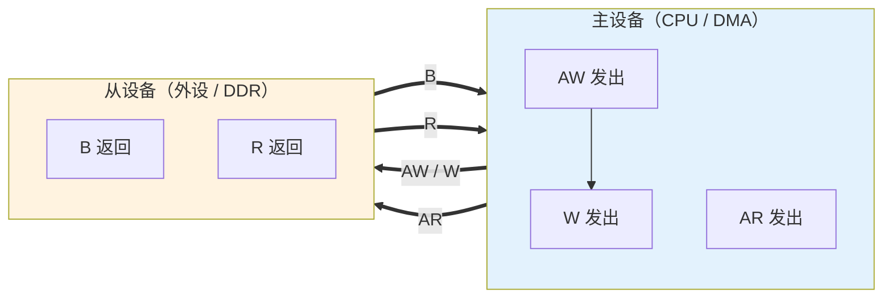
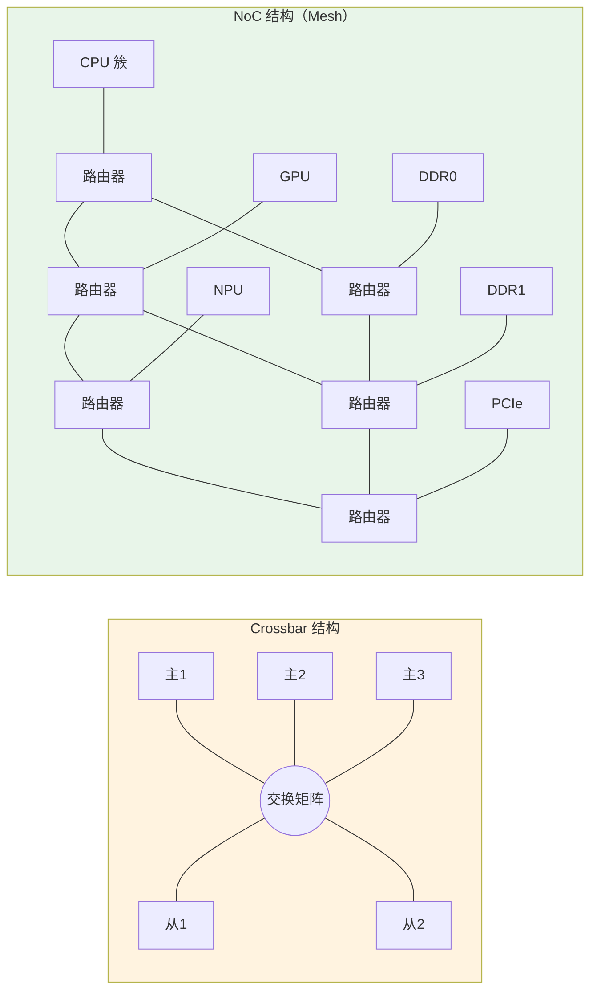

# B-A.1.2 AXI 深入与 NoC 片上网络

> 所属章节：第五部 B. 总线协议 > B-A.1 片内总线认知
>
> 难度：[I] Intermediate | 预计阅读时间：45 分钟

## <span class="blue"> 本节导读

B-A.1.1 给了片内总线的地图：设备挂在哪条总线、地址多少、设备树怎么配。本篇往下走一层，回答"软件什么时候会被总线层的问题咬到"——`devmem` 读错地址为什么整机挂死、DMA 传输为什么要求地址对齐、`ioremap` 与 `ioremap_wc` 映射出来的内存有何不同、系统 CPU 负载不高却周期性丢帧该怀疑谁。这些问题的答案都在 AXI 的事务属性与互连结构里。

阅读顺序按"你接触总线的距离"排：先看你每天都要用的寄存器读写底下发生了什么（握手与通道），再看你唯一能控制的总线行为（映射属性），然后拉到 SoC 全局看互连结构（Crossbar 到 NoC），最后落在最常见的一类现场问题（带宽竞争）。

读完你应能：解释一次 MMIO 读写在总线上的完整旅程；说清 `ioremap` 系列 API 各自对应的总线事务属性并选对；把"CPU 无辜的周期性卡顿"与 DDR 带宽竞争挂上钩，并用对照实验证明或排除。

> 主设备 / 从设备：总线上发起事务的一端（CPU、DMA 控制器、GPU）与响应事务的一端（外设寄存器、DDR 控制器）。AMBA 新版规范已改称 Manager / Subordinate，老手册与内核社区仍混用 Master / Slave，两者同义。

> 拍（beat）：总线在一个时钟沿完成的一次数据交接。AXI 一次事务可以只传一拍，也可以连续传几十上百拍（突发）。

---

## <span class="blue"> AXI 骨架：为什么是五个通道

APB 只有"地址+数据"两条线，AHB 把读写数据分开，而 AXI 把一次传输拆成**五个独立通道**，各有自己的握手信号：

| 通道 | 方向 | 载荷 |
|------|------|------|
| AW（写地址） | 主 → 从 | 写事务的地址与控制信息 |
| W（写数据） | 主 → 从 | 写数据拍 |
| B（写应答） | 从 → 主 | 写事务的完成状态 |
| AR（读地址） | 主 → 从 | 读事务的地址与控制信息 |
| R（读数据） | 从 → 主 | 读数据拍 + 响应状态 |



通道分离买的是三样东西：

1. **读写全双工**——读事务和写事务可以同时推进，互不占用对方的数据线。这是 AXI 相对 AHB 的最大带宽来源
2. **地址与数据解耦**——地址通道先走，数据通道随后，从设备可以提前知道"接下来要来什么"，从容安排内部流水
3. **多笔事务在途**——配合 ID 标签，前一笔没回完就能发下一笔（后文 outstanding 详述）

软件工程师不用画这张图的时序，但要建立一个直觉：**你的一次 `readl()`，在总线上是 AR 通道一次握手加 R 通道若干拍；你的一次 `writel()`，是 AW+W 两次握手加 B 通道一次应答**。寄存器读写不是"瞬间完成"的，它是一段有来有回的总线旅程。

---

## <span class="blue"> VALID/READY 握手：旅程的基本步伐

AXI 每个通道的传输都遵循同一规则：发送方拉高 VALID 表示"数据就绪"，接收方拉高 READY 表示"可以接收"，两者同时为高的那个时钟沿完成一次交接。

<!-- 【待补图】images/B-A.1.2-valid-ready握手时序.png（优先级：★必要）
图名：AXI VALID/READY 握手时序图（三种交接情形）
生图提示词：数字时序图风格，白底，工程教科书插画。横轴为时钟周期（画出方波 CLK，标注 T1~T6），三组对照上下排列。组一"VALID 先到"：VALID 在 T2 拉高，READY 在 T3 拉高，T3 上升沿处画竖直虚线标注"交接点：双方同时为高"，DATA 信号在 T2~T3 间画成填充的斜纹矩形（表示有效数据），T3 后变为交叉纹（无效）。组二"READY 先到"：READY 在 T2 拉高，VALID 在 T4 拉高，T4 为交接点。组三"同时到达"：VALID 与 READY 同在 T2 拉高，T2 即交接。每组下方一行小字结论："谁都可以等谁，同时为高才算数"。信号线用深蓝色，交接点用红色圆点加箭头强调，中文标注，扁平矢量风格，无阴影渐变。比例 16:9。 -->

这一规则的两个推论，各对应一类经典现场：

- **任一方都可以让对方等**。外设控制器内部 FIFO 满了，它会压住 READY——这就是驱动里偶尔观测到"写寄存器卡顿"的硬件来源：不是 CPU 慢，是总线另一端在消化
- **握手可以永远等不到对方**。设备树地址写错、时钟没使能、复位的设备不响应，AR 发出去就没有 R 回来，事务永远悬在那里。表现为 `devmem` 一读就整机挂死——CPU 发出的 AXI 读事务无人应答，核一直停在等数据的状态

> 💡 "devmem 读错地址导致系统挂死"是嵌入式的经典事故，根因就是 AXI 事务**没有超时机制**。部分 SoC 在互连中加了超时响应单元（超时后返回错误响应而非死等），但这属于厂商福利，不能当作可以依赖的设计前提。

---

## <span class="blue"> 突发传输：一趟拉走一整批

AXI 一次事务由地址通道给出起始地址与控制信息，数据通道连续传多个数据拍。突发类型（AxBURST）决定后续拍的地址如何推进：

| 突发类型 | 地址推进方式 | 典型使用者 |
|----------|--------------|------------|
| FIXED | 地址不变 | 外设 FIFO（I2C/SPI/UART 的数据寄存器，反复读写同一个地址） |
| INCR | 地址递增 | DMA 大块内存搬运 |
| WRAP | 到达边界后回卷 | CPU cache line 填充（先取急需的那个字，再回卷补全整行） |

```text
INCR（起始 0x1000，4 拍，每拍 8 字节）:  0x1000 → 0x1008 → 0x1010 → 0x1018
FIXED（4 拍）:                          0x2000 → 0x2000 → 0x2000 → 0x2000
WRAP（边界 32B，起始 0x3010，4×8B）:     0x3010 → 0x3018 → 0x3000 → 0x3008
                                          ↑ 到边界 0x3020 回卷到行首
```

控制字段还有 AxLEN（突发长度，AXI4 最长 256 拍）与 AxSIZE（每拍字节数）。

软件侧的直接对应物是 **DMA 对齐约束**：多数 DMA 控制器要求源/目的地址按突发粒度对齐（如 64 字节），长度是突发长度的整数倍。不满足时控制器要么报错，要么退化为单拍传输，带宽掉一个数量级。`dmaengine` 的 alignment 参数、网卡驱动的 buffer 对齐要求，根源都在这里。

### 乱序与 Outstanding

AXI 事务携带 ID 标签，主设备可以在前一笔事务未完成时发出下一笔（outstanding，在途事务），不同 ID 的事务允许乱序完成。这解释了为什么慢速 APB 外设不会拖死 DDR 访问——它们在不同 ID、不同通路上并行推进，慢设备慢慢回，快设备照跑。

### Exclusive 访问：第 13 章的硬件底座

AXI 还有一种特殊事务类型叫 Exclusive（独占）：主设备先做一次"独占读"标记某地址，之后做"独占写"时，互连检查这段期间有没有人动过这个地址——没动过才放行写入，动过就返回失败让主设备重试。

这正是第 13 章 13.3.1 讲过的 LDXR/STXR 指令在总线上的延伸：CPU 核内的独占监视器管核内，总线上的 Exclusive 事务把同一语义扩展到跨主设备（CPU 对 DMA 一致性缓冲区之外的共享外设区域）。`atomic_cmpxchg` 在多核间能成立，底层就是这条"标记-检查-条件写入"的链路在贯穿。

---

## <span class="blue"> AxCACHE / AxPROT：软件真正要打交道的部分

五通道握手中，软件唯一能"控制"总线行为的途径是内存映射时指定的属性，它们最终编码进 AXI 事务的 AxCACHE 与 AxPROT 信号。

### AxCACHE：缓存属性

AxCACHE[3:0] 各比特含义：

| 位 | 名称 | 含义 |
|----|------|------|
| [0] | Bufferable | 写事务可在互连的写缓冲中提前应答 |
| [1] | Cacheable（Modifiable） | 事务可被缓存、合并、拆分 |
| [2] | Read-Allocate | 读 miss 时分配 cache line |
| [3] | Write-Allocate | 写 miss 时分配 cache line |

> cache line：CPU 缓存与内存交换数据的最小单位，通常 64 字节。你写一个字节，硬件是按整行换入换出的——这是 13.3.4 伪共享问题的同一物理基础。

在 ARMv8 软件侧，这组属性体现为页表中的内存类型：

| 内存类型 | 语义 | 内核映射 API | 用途 |
|----------|------|--------------|------|
| Device-nGnRnE | 不聚合、不重排、不提前写应答 | `ioremap()`（ARM64 默认） | 绝大多数外设寄存器 |
| Device-nGnRE | 允许提前写应答 | `ioremap()` 变体（少见） | 对写应答延迟敏感的寄存器 |
| Normal Non-Cacheable | 普通内存语义但不缓存 | `ioremap_wc()` 的非合并路径 | 需字节序正常但不要求缓存 |
| Normal Cacheable（WC） | 允许写合并 | `ioremap_wc()` | 帧缓冲、显存类大块显式写区域 |
| Normal Cacheable | 完全缓存 | 常规 `kmalloc`/`vmalloc` 内存 | 普通数据 |

> 💡 第 11 章 11.1.4 的裸驱动用 `ioremap` 映射 SoC 寄存器地址，得到的正是 Device-nGnRnE 映射：每次读写都真实地落到总线上，不被缓存、不被重排、不被合并。如果把 MMIO 区域错误地映射成 Normal Cacheable，CPU 读到的可能是 cache 里的旧值——寄存器"读了没反应"是这种错误配置的典型症状。

### `readl`/`writel` 的隐含屏障

驱动里访问映射后的寄存器用 `readl()`/`writel()`，而不是直接解引用指针——除了字节序转换，这两个 API 还携带内存屏障语义（`Documentation/memory-barriers.txt`）：

- `writel()` 保证其前的内存写（比如你填好的 DMA 描述符）先于这次 MMIO 写对其他观察者可见——这就是"先填描述符、再敲 doorbell 寄存器"不会出乱序的原因
- `readl()` 保证其后的内存访问不会被投机地提到这次 MMIO 读之前

热路径上确认安全时可用 `writel_relaxed()` 系列去掉这层屏障，自己用 `wmb()`/`dma_wmb()` 在关键点补齐。跨平台可移植性优先时用 `ioread32()`/`iowrite32()`。这根链条在 B-D.10.3 PCIe 驱动与 DMA 里会用到：描述符环、doorbell、中断状态读取，每一步都踩着这套屏障语义。

### AxPROT：权限与安全属性

AxPROT[2:0] 标记事务的特权级（特权/非特权）、安全态（Secure/Non-secure）、类型（指令/数据）。设备树里常见的 `secure` 属性、TrustZone 隔离的外设（如 secure watchdog），最终都靠互连检查 AxPROT 来拦截非安全世界的访问。驱动访问一个被划给安全世界的寄存器，事务会被互连直接拒绝——表现为读回全 0 或总线错误。

---

## <span class="blue"> 版本简史：AXI 在 AMBA 家族里的位置

| 代际 | 规范 | 关键变化 |
|------|------|----------|
| AMBA 3（2003） | AXI 初版 | 五通道架构、乱序 outstanding 确立 |
| AMBA 4（2010） | AXI4 / AXI4-Lite / AXI4-Stream | 突发加长到 256 拍；Lite 砍突发服务寄存器接口；Stream 去地址化服务流式数据（B-F.16.6 Aurora 的用户侧接口） |
| AMBA 4 ACE（2011） | ACE / ACE-Lite | 在 AXI 上加一致性通道，多核缓存一致（下一篇的瓶颈主角） |
| AMBA 5（2014 起） | AXI5 / CHI | AXI5 补原子事务（AtomicStore/Load/Swap/Compare，让 DMA 主设备也能做原子操作）、唤醒信号、QoS 增强；CHI 另立门户，是下一篇的主题 |

嵌入式 SoC 上最常见的是 AXI4 + AXI4-Lite 组合：高速通路走全功能 AXI4，寄存器配置面走 Lite。你写的 platform 驱动 `readl` 的终点，多半是一个 AXI4-Lite 从接口。

---

## <span class="blue"> 从 Crossbar 到 NoC

### Crossbar 的扩展瓶颈

B-A.1.1 拓扑图里的 "AXI Crossbar" 是一个全互连交换矩阵：N 个主设备对 M 个从设备，任意主可在同一时刻与任意从建立通路。它的问题随主从数量增长而暴露：

- 连线复杂度按 N×M 增长，硅片布线面积急剧膨胀
- 仲裁路径变长，最高时钟频率被拉低
- 所有主设备共享同一时钟域，无法按区域独立降频省电

主从数量在十几条以内时 Crossbar 够用（绝大多数嵌入式 SoC 如此）；核数上到几十、还要挂 GPU/NPU/多个 DDR 通道时，就必须换结构。

### NoC：把网络引入芯片

NoC（Network-on-Chip，片上网络）把片内互连改造成包交换网络：

- 事务被打成**数据包**，经**路由器**逐级转发到目的节点
- 拓扑可以是环形、Mesh（网格）、Torus（环面），按流量模型选择
- 每个路由器/节点有独立时钟域，支持按区域调频与电源门控
- QoS 在包级实现：虚拟通道、优先级仲裁、带宽整形



产业界的对应实现：ARM 的 CMN（Coherent Mesh Network）系列用于服务器与旗舰移动 SoC；Arteris 的 FlexNoC/Ncore 是独立的商业 NoC IP，被大量车载与 AI SoC 采用。

### 对软件的影响

NoC 引入了一个嵌入式工程师开始需要面对的变量：**跨节点的延迟差异**。CPU 访问"近处"的 DDR 通道与"远处"的通道延迟不同，这就是片上 NUMA 的雏形。在服务器级 ARM SoC（多 Die、多 DDR 控制器）上，内核的 NUMA 调度、`numactl` 绑核绑内存的收益，直接来自这个物理事实。

---

## <span class="blue"> 带宽竞争：总线层问题在软件层面的样子

### 典型症状

嵌入式现场有一类问题 CPU 视角完全无辜：负载不高、调度正常，但系统周期性卡顿、显示丢帧、音频爆音、实时任务偶发超时。常见根因之一是 **DDR 带宽竞争**——GPU 渲染、摄像头 DMA、显示控制器扫显、CPU 访存全部汇聚到同一个 DDR 控制器，互连按 QoS 仲裁，优先级低的事务被饿死一段窗口。

显示控制器是最典型的受害者：扫显（scanout）不能等，FIFO 空了就是画面撕裂。所以 SoC 厂商通常把显示控制器的 QoS 优先级调到最高，在寄存器手册里能看到对应的 QoS 配置位。

### 观测手段

| 手段 | 命令/路径 | 能看什么 |
|------|-----------|----------|
| SoC PMU/NoC 计数器 | `perf list` 中 `arm_cmn_*`、`imx8_ddr*` 等事件 | DDR 吞吐、各主设备带宽占比 |
| 厂商 QoS 寄存器 | 数据手册 QoS/Priority 章节 + `devmem` | 各主设备当前优先级 |
| 带宽压测对照 | `mbw`、`tinymembench` 压内存同时观察业务 | 复现"带宽打满→业务异常"的因果 |
| ftrace/延迟跟踪 | `cyclictest` + 干扰注入 | 实时任务的延迟毛刺与带宽竞争的相关性 |

系统出现"CPU 无辜的周期性卡顿"时，第一排查手段是打满 DDR 带宽做对照实验（如 `mbw` 后台运行）：症状若随带宽压力同步恶化，问题在总线层而非调度层，后续手段是调 QoS 优先级、给关键业务做缓存/内存隔离，而不是在进程调度里打转。

### 缓解手段（软件可做部分）

- 提高关键主设备的 QoS 优先级（厂商寄存器，常见于显示/实时采集路径）
- 用 CMA/预留内存减少分配时的碎片化间接影响
- 大流量搬运集中提交长突发，避免大量短事务占用仲裁窗口
- 实时业务参考 B-E.15.6 PREEMPT_RT 与总线实时性调优

---

## <span class="blue"> Crossbar vs NoC（Trade-off）

| 维度 | Crossbar | NoC |
|------|----------|-----|
| 适用规模 | 主从各 ~10 条以内 | 几十至上百节点 |
| 延迟 | 低且确定（单跳） | 多跳转发，跳数相关 |
| 面积/布线 | 随 N×M 爆炸 | 随节点数近似线性 |
| 时钟域 | 单一 | 每节点独立，支持分区调频 |
| QoS | 端口级优先级 | 包级：虚拟通道 + 整形 |
| 一致性支持 | 需 ACE 外挂 | 原生（CMN 等带一致性） |
| 典型场景 | 嵌入式 SoC（RK3568、i.MX 级） | 服务器/AI/旗舰移动 SoC |
| 软件可见性 | 基本透明 | NUMA、QoS 配置、PMU 事件 |

---

## <span class="blue"> 排障：总线层问题的四种面孔

| 症状 | 总线层根因 | 定位动作 |
|------|------------|----------|
| `devmem` 一读就整机挂死 | 读事务无人应答（地址错/时钟未使能/设备复位中），AXI 无超时 | 核对地址与设备树；查时钟树该控制器时钟是否使能 |
| 写寄存器"卡顿"但结果正确 | 从设备压 READY（内部 FIFO 满/时钟比低） | 换连续写测试看吞吐；查外设时钟分频配置 |
| DMA 带宽比手册低一个数量级，日志干净 | 地址/长度不满足突发对齐，静默退化单拍 | 对照手册 alignment 章节查 `dmaengine` 配置与 buffer 分配方式 |
| 帧缓冲写屏极慢 | 误用 `ioremap`（Device 属性禁写合并），逐字节落总线 | 显示类大块区域改 `ioremap_wc`；控制寄存器保持 `ioremap` |
| 寄存器读回全 0 | 被 TrustZone 划走 / 时钟未使能 / 地址不存在 | 先查时钟树与安全属性，再怀疑外设硬件 |
| 多通道 SoC 上程序性能飘忽 | 跨 NoC 节点访存延迟差异（片上 NUMA） | `numactl --hardware` 看拓扑，绑核绑内存成对做 |

---

## <span class="blue"> 本节总结

一次 MMIO 读写在总线上是一段有来有回的旅程：AR 发出、R 返回，中间经过握手、仲裁、可能的多跳转发。这段旅程有三个软件必须记住的性质——没有超时（读错地址就是挂死）、有属性（AxCACHE/AxPROT 由你的映射方式决定）、有秩序（`readl`/`writel` 的隐含屏障护住 DMA 协作的正确性）。突发与对齐决定 DMA 的真实带宽，Exclusive 事务则是第 13 章原子操作延伸到总线上的同一根链条。

结构上，Crossbar 服务于十几条主从以内的嵌入式 SoC，NoC 服务于几十上百节点的服务器/AI 芯片；两者的分水岭不只是规模，还有软件可见性——NoC 把 NUMA、QoS 配置、PMU 事件这些新变量放到了工程师桌上。遇到"CPU 无辜的周期性卡顿"，先打满带宽做对照实验，把总线层从调度层里分离出来，是这一类问题唯一可靠的起点。

**速查表**

| 要点 | 结论 |
|------|------|
| 五通道 | AW/W/B 管写、AR/R 管读，读写全双工；`readl` = AR+R，`writel` = AW+W+B |
| 握手推论 | 无超时机制：读错地址挂死；从设备压 READY：写卡顿 |
| 突发 | FIXED=FIFO、INCR=DMA、WRAP=cache 填充；对齐不满足→静默降级 |
| 映射属性 | 寄存器 `ioremap`、帧缓冲 `ioremap_wc`，两类区域不可混用 |
| 隐含屏障 | `writel` 前的内存写先可见（doorbell 安全的根源）；热路径可用 `_relaxed` 变体 |
| Exclusive | 总线级的"标记-检查-条件写"，13.3.1 LDXR/STXR 的跨主设备延伸 |
| Crossbar→NoC | 规模、跳数延迟、独立时钟域、包级 QoS；NoC 带来片上 NUMA |
| 带宽竞争 | CPU 无辜的卡顿先怀疑 DDR 仲裁；`mbw` 对照实验定性，QoS 寄存器缓解 |

---

## <span class="blue"> 本节自查

1. 能画出 `readl()`/`writel()` 各自经过哪些通道，并解释"devmem 读错地址挂死"与"写寄存器卡顿"的总线层原因吗？
2. FIXED/INCR/WRAP 三种突发各自的使用者是谁？DMA 对齐约束从哪个字段来？
3. `ioremap` 与 `ioremap_wc` 对应的内存类型和 AxCACHE 属性有何不同？帧缓冲用错映射的症状是什么？
4. 为什么"先填 DMA 描述符、再敲 doorbell"不需要额外加屏障？
5. Crossbar 的三个扩展瓶颈是什么？NoC 用什么结构解决？
6. 面对"负载不高但周期性丢帧"，你的第一组排查动作是什么？

---

## <span class="blue"> 下一步

下一节 **B-A.1.3 CHI 与 UCIe：Chiplet 互连**，走出单芯片边界：AXI/ACE 在多核时代的一致性瓶颈如何催生 CHI，Chiplet 封装如何把互连从片上延伸到封装内，以及 UCIe 标准对固件与系统拓扑发现的影响。随后板块 1 收尾，进入板块 2 低速外设接口的 **B-B.2.1 GPIO 通用输入输出**。

> 💡 螺旋衔接：本篇的 DMA 对齐与带宽竞争，会在 B-D.10.3 PCIe 驱动与 DMA、B-D.10.6 PCIe 卡实战中再次出现——届时瓶颈从片内互连换成 PCIe 链路，分析方法是同一套。
