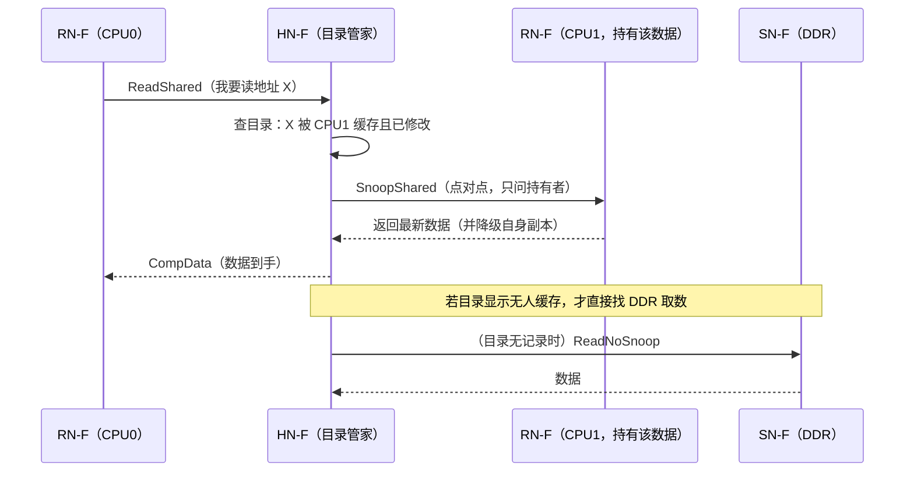

# B-A.1.3 CHI 与 UCIe：Chiplet 互连

> 所属章节：第五部 B. 总线协议 > B-A.1 片内总线认知
>
> 难度：[I] Intermediate / [M] Master | 预计阅读时间：45 分钟

## <span class="blue"> 本节导读

前两篇的范围是单颗 SoC 内部。本篇跨出两条边界：一是多核规模化——核数上到几十上百后，AXI/ACE 的广播式一致性撑不住，ARM 的答案是 CHI；二是单芯片的物理边界——光罩面积与良率逼着芯片拆成 Chiplet，封装内互连的标准答案是 UCIe。

对嵌入式工程师，这一层看似遥远，实则正在下沉：多 Die 服务器 SoC 已进入边缘计算场景，Chiplet 也开始出现在高端车载与 AI 芯片里；你买的下一代开发板，SoC 内部很可能就是几个 die 拼出来的。阅读顺序按"边界由近到远"排：先看核与核之间的一致性怎么维持（CHI），再看 die 与 die 之间怎么连（Chiplet 与 UCIe），最后落到你直接面对的部分——多 Die 系统在软件眼里的样子（NUMA、启动、运维）。

读完你应能：说明目录式一致性相对广播式的扩展性来源；说清 DMA 一致性问题的物理根因与两类 DMA API 的分工；解释 `numactl` 输出里 node distances 的物理含义；判断一个多 die 性能问题该不该怀疑 NUMA 本地性。

> 缓存一致性（cache coherency）：多核各自有缓存，同一份内存数据可能同时存在于多个 cache 里。"一致性"就是保证任何核读到的都是最新值的硬件机制。最经典的实现是 MESI 协议（13.3.4 讲过它的四状态），本篇关心的是核数规模化之后，MESI 的"交通组织方式"怎么从广播改成点对点。

> NUMA（Non-Uniform Memory Access）：CPU 访问不同内存区域的延迟不一致的系统架构。本地内存快、远端内存慢，差异来自互连转发。"远近"是物理拓扑决定的，不是配置出来的。

---

## <span class="blue"> 从 AXI/ACE 到 CHI

### ACE 的广播瓶颈

ACE 在多核簇内维护缓存一致性的方式是**广播嗅探（snoop）**：一个核对某地址的操作，要向簇内所有核广播询问"你缓存了吗"。核数少时可行，核数上升后广播流量按核数平方级增长，一致性流量本身就把互连带宽吃掉了。

### CHI 的分层架构

AMBA 5 CHI（2014 年随 AMBA 5 引入，此后 Issue A→G 持续演进，逐代补充 QoS、安全与功耗特性）把互连改造成面向一致性的包交换协议，分四层：

| 层 | 职责 | 类比对象 |
|----|------|----------|
| 协议层 | 一致性事务语义（读、写、失效、监听） | — |
| 网络层 | 包的路由与节点寻址 | NoC 的路由层 |
| 链路层 | 流控（credit 机制）、重试 | 类似 PCIe 链路层 |
| 物理层 | 信道与电气 | — |

关键角色由节点类型定义：

| 节点 | 全称 | 角色 |
|------|------|------|
| RN-F | Request Node Full | 带一致性缓存的请求方：CPU 核、DSU 内的大小核 |
| RN-I / RN-D | Request Node I/O / DMA | 不带缓存的请求方：DMA、外设 |
| HN-F | Home Node Full | 一致性"管家"：管理 L3/SLC，内置**目录**记录每行数据被谁缓存 |
| HN-I | Home Node I/O | 普通从设备的归属点 |
| SN-F | Slave Node Full | 终端存储：DDR 控制器 |

一致性机制从广播改为**目录式**：HN-F 的目录记录每个 cache line 的缓存者清单，需要失效时按清单点对点发送，不再全网广播。这是 CHI 能扩展到上百核的根本原因。

一次读未命中（ReadShared）在 CHI 网络上的完整旅程长这样：



对照 ACE 的做法，差别一目了然：同样的读未命中，广播式要向**所有核**各发一份询问，目录式只向**清单上的持有者**发一份。核数从 8 涨到 128，广播流量涨 256 倍，目录流量只跟"这行数据实际被几个人缓存"有关。

产业落点：ARM DynamIQ 时代的 DSU（DynamIQ Shared Unit）内部用 CHI 连接大小核与 L3；服务器级的 CMN 网状网络同样跑 CHI。B-A.1.2 提到的 CMN PMU 事件（`arm_cmn_*`）统计的就是 CHI 层的事务。

### 软件视角：一致性不是免费的

多核一致性由硬件保证"核与核之间"的数据可见，但**外设 DMA 不在一致性域内**（或只在部分 SoC 上以 IO-coherent 方式挂入）。这正是内核 DMA API 存在的物理原因：

| API | 一致性处理 | 适用场景 |
|-----|------------|----------|
| `dma_map_single()` / `dma_unmap_single()` | 驱动在映射/解除时做 cache 清理与失效 | 流式 DMA：收发缓冲区 |
| `dma_alloc_coherent()` | 分配时直接给非缓存（或硬件一致）映射 | 长期共享：描述符环 |
| 硬件 IO-coherent（如挂入 ACE/CHI 的 DMA） | 无需软件维护 | 部分高端 SoC 的特定主设备 |

> 💡 "DMA 读完的数据是旧值"几乎总是 cache 维护问题：CPU 写入的数据还在 cache 里，DMA 直接从 DDR 读走了旧内容。反方向同样成立——DMA 写进 DDR 的新数据，CPU 读到的是 cache 里的旧副本。第 11 章与 D 扩展的 DMA 篇会反复用到本篇这条根因链。

---

## <span class="blue"> Chiplet：单芯片的物理边界

### 为什么拆

三个硬约束把单芯片设计逼到墙角：

1. **光罩极限**：光刻机单次曝光面积约 858 mm²（26×33 mm），芯片不能无限做大——想堆更多核、更大缓存，单 die 已经放不下
2. **良率**：缺陷密度固定时，die 面积越大良率越低。一颗 800 mm² 的大芯片，一片晶圆上可能一半都是废品；拆成四颗 200 mm² 小芯片，良率立刻回来——成本随面积超线性下降
3. **工艺混搭**：计算逻辑需要先进工艺（5nm/3nm），IO/模拟单元在成熟工艺（12nm/28nm）上反而更好更便宜——单芯片被迫全部用先进工艺，等于拿黄金做螺丝

Chiplet 方案：把大芯片拆成多个小 die（计算 die、IO die、缓存 die），各自用最合适的工艺流片，再在封装内互连成一个系统。

### 封装形态

| 形态 | 互连介质 | 凸点间距 | 代表技术 |
|------|----------|----------|----------|
| 2D（基板走线） | 有机基板 | ~110 μm | 传统 MCM |
| 2.5D（硅中介层） | 硅转接板/桥 | 40~55 μm | TSMC CoWoS、Intel EMIB |
| 3D（垂直堆叠） | 混合键合直连 | <10 μm | TSMC SoIC、Intel Foveros Direct |

间距每缩小一个量级，互连的带宽密度和能耗就改善一个量级——这是封装技术竞争的核心指标。

<!-- 【待补图】images/B-A.1.3-chiplet封装形态对比.png（优先级：★必要）
图名：Chiplet 三种封装形态截面对比图
生图提示词：技术剖面示意图风格，横向三联对比排版。左图"2D 基板"：两个方形 die 并排放在有机基板（绿色矩形）上，标注凸点间距约110μm；中图"2.5D 硅中介层"：两个 die 下方垫一层灰色硅转接板，die 间经转接板内走线连接，标注凸点间距40~55μm，标注"CoWoS/EMIB"；右图"3D 堆叠"：两个 die 垂直叠放，标注混合键合间距<10μm，标注"SoIC/Foveros Direct"。每图下方标注带宽密度趋势箭头递增。配色：浅灰背景、芯片用深蓝色、基板绿色、转接板灰色，工程蓝图风格，扁平矢量，无渐变阴影，中文标注。比例 16:9。 -->

### UCIe：封装内互连的开放标准

UCIe（Universal Chiplet Interconnect Express）联盟 2022 年 3 月由 AMD、Arm、Google、Intel、Meta、微软、高通、三星、台积电、日月光等发起，目标是为封装内 die-to-die 互连建立开放标准，让不同厂商的 Chiplet 能互插。

| 版本 | 时间 | 关键内容 |
|------|------|----------|
| UCIe 1.0 | 2022 | die-to-die 物理层 + 适配层；协议层映射 PCIe/CXL/自定义流；分 UCIe-S（标准 2D）与 UCIe-A（先进 2.5D） |
| UCIe 2.0 | 2024 | 系统级管理能力（DFx：可测、可调试、遥测），3D 封装支持 |
| UCIe 3.0 | 2025-08 | 速率翻倍至 48/64 GT/s；运行时重校准；边带通道延伸至 100 mm；Raw 模式支持 ADC/DAC 类连续传输；MTP 标准化早期固件下载；优先级边带包；快速节流与紧急关机 |

一条 UCIe 链路的内部分工值得单独看一眼：

- **主带（mainband）**：高速数据通路，跑映射后的 PCIe/CXL/自定义流协议，速率随版本攀升
- **边带（sideband）**：独立的管理通路，负责链路训练、参数协商、寄存器访问与遥测上报——3.0 把它延伸到 100 mm，正是为了跨基板的大封装形态

<!-- 【待补图】images/B-A.1.3-ucie链路分层.png（优先级：△有更好）
图名：UCIe die-to-die 链路分层与主带/边带分工图
生图提示词：技术架构图，左右两个标注"Die A（计算）"与"Die B（IO）"的圆角矩形，中间是封装基板连接区。两 Die 之间画两组通道：上方一组粗箭头标注"主带 mainband：PCIe/CXL/流协议，48~64 GT/s"，由多条并行细线组成；下方一组细虚线箭头标注"边带 sideband：训练/管理/遥测，可达 100mm"。每个 Die 内部从外到内画三层小方块标注"物理层（凸点）→ 适配层 → 协议层"。右上角小注："协议层直接复用 PCIe/CXL 事务模型"。浅灰背景，深蓝色 Die，主带用橙色强调，边带用灰色虚线，扁平矢量工程图风格，中文标注。比例 16:9。 -->

两点值得注意：

- **协议层直接映射 PCIe/CXL**——这意味着 B-D.10 的 PCIe 知识在 Chiplet 时代依然是通用语言，die 间通信复用同一套事务模型
- **3.0 的管理面增强**（早期固件下载、遥测、紧急关机）直接对应多 die 系统的固件启动与运维需求

产业实例：AMD EPYC 的 CCD+IOD 结构（Infinity Fabric 封装内互连）、Apple M1 Ultra 的 UltraFusion（2.5 TB/s 中介层）、Intel Meteor Lake/Ponte Vecchio（EMIB+Foveros）。NVIDIA Blackwell 用自研 NV-HBI，概念同族。

---

## <span class="blue"> 软件视角：多 Die 系统的拓扑与启动

Chiplet 对软件不是透明的。三个直接影响：

### NUMA 拓扑显形

多 die 各有本地 DDR 控制器，CPU 访问本地 die 内存与远端 die 内存的延迟、带宽明显不同。内核经 ACPI SRAT/SLIT 表获知拓扑，呈现为多个 NUMA 节点：

> ACPI SRAT/SLIT：固件向操作系统描述硬件拓扑的两张表。SRAT 说明"哪些 CPU 和内存属于哪个节点"，SLIT 给出"节点两两之间的距离"。内核启动时读这两张表建立 NUMA 视图——`numactl` 看到的一切都来自这里。

```bash
numactl --hardware
```

典型输出（双 die 服务器）：

```text
available: 2 nodes (0-1)
node 0 cpus: 0-63
node 0 size: 128000 MB
node 1 cpus: 64-127
node 1 size: 128000 MB
node distances:
node   0   1
  0:  10  21
  1:  21  10
```

`node distances` 里 10 与 21 的差距，物理来源就是 die 间互连的转发延迟——B-A.1.2 的 NoC 多跳延迟，在多 die 系统里放大成了体系结构级别的可见事实。性能敏感服务绑核绑内存（`numactl --cpunodebind --membind`）的收益由它决定；`lstopo`（hwloc 工具包）能把同一拓扑画成树状图，核、缓存、NUMA 节点、PCIe 设备的隶属关系一图看清。

### 固件启动序列

多 die 系统的固件要处理"谁先起、谁等谁"：主 die 完成自身初始化后，经 die 间链路为从 die 下载早期固件（UCIe 3.0 的 MTP 把这一步标准化）、协商链路参数、交换拓扑信息，然后才把完整系统呈现给 OS。启动日志里 die 间链路训练相关的条目，就属于这一阶段。

### 遥测与运维

UCIe 2.0/3.0 的 DFx 与管理面让 die 间链路像 PCIe 链路一样可观测：链路状态、误码、降速事件可经带外通道上报。排查多 die 系统的间歇性性能问题时，die 间链路降速是一个独立嫌疑对象。

多 die 系统出现"同型号机器性能不一致"或"迁移后性能掉档"时，第一排查手段是 `numactl --hardware` / `lstopo` 核对拓扑与内存本地性——进程漂到了远端 NUMA 节点，比代码问题常见得多。

---

## <span class="blue"> 一致性方案与互连代际（Trade-off）

| 维度 | ACE（广播嗅探） | CHI（目录式） | 备注 |
|------|-----------------|---------------|------|
| 一致性机制 | 全网广播询问 | HN-F 目录点对点 | 目录占用少量片内存储 |
| 可扩展核数 | 个位数~十位数 | 上百 | — |
| 互连结构 | 总线/Crossbar | 包交换 NoC | — |
| 典型载体 | Cortex-A53/A72 时代 CCI/CCN | DSU、CMN | — |
| 软件可见性 | 基本透明 | PMU 事件、NUMA | — |

| 维度 | 单芯片 SoC | Chiplet（UCIe） |
|------|------------|------------------|
| die 间带宽 | —（片内互连） | 3.0 达 48/64 GT/s/pin |
| 内存一致性 | 片内完成 | 跨 die 需协议保证（CXL.cache 等） |
| 启动复杂度 | 单固件序列 | 多 die 分级启动、MTP 固件下载 |
| 软件拓扑 | 平铺 | NUMA 显形 |
| 运维观测 | PMU | + die 间链路遥测 |

---

## <span class="blue"> 排障：多核/多 Die 层问题的四张面孔

| 症状 | 根因 | 定位动作 |
|------|------|----------|
| DMA 读到的数据是旧值（或 CPU 读到 DMA 写入前的旧值） | DMA 不在一致性域内，cache 未维护 | 审计代码：buffer 是否走了 `dma_map_single`/`dma_alloc_coherent`，杜绝 `kmalloc` 直交 DMA |
| 多 NUMA 系统绑核后性能无改善 | 绑核没绑内存（或反之），访存全部跨 die | `numactl --cpunodebind` 与 `--membind` 成对使用；`numastat` 看跨节点命中率 |
| 同型号机器性能不一致 / 迁移后掉档 | 进程漂到远端 NUMA 节点；die 间链路降速 | `numactl --hardware`/`lstopo` 核对拓扑；查 die 间链路遥测 |
| 多 die 系统起不来或拓扑不对 | die 间链路训练失败 / 固件版本不匹配 / SRAT 上报错误 | 翻启动日志的链路训练条目；核对双 die 固件版本一致性 |

---

## <span class="blue"> 本节总结

核数规模化把一致性从"广播交通"逼成了"目录交通"：CHI 用 HN-F 的目录把"谁缓存了这行数据"记下来，失效通知从全网广播变成点对点，这是上百核能活在一颗芯片里的根本原因。而目录管不到的地方——DMA——就成了驱动工程师的责任区：`dma_map_single` 管流式收发的 cache 维护，`dma_alloc_coherent` 管长期共享的描述符环，选错的症状永远是"读到旧值"。

芯片物理边界被光罩、良率、工艺混搭三条约束打破后，Chiplet 把互连从片上延伸到封装内，UCIe 用"主带跑 PCIe/CXL、边带管训练运维"的分工给出开放答案。对软件而言这一切都不透明：NUMA 在 `numactl` 的输出里显形，固件要分级启动，die 间链路成了新的运维对象。记一个总原则：多 die 系统的性能问题，先查拓扑本地性，再怀疑代码。

**速查表**

| 要点 | 结论 |
|------|------|
| CHI 动因 | ACE 广播流量随核数平方增长；目录式点对点失效才可扩展 |
| CHI 角色 | RN-F 带缓存请求方；HN-F 目录管家；SN-F 是 DDR；DMA 是 RN-I/D |
| DMA 一致性 | 流式 `dma_map_single`、常驻 `dma_alloc_coherent`；`kmalloc` 直交 DMA = 旧值事故 |
| Chiplet 动因 | 光罩 858mm²、良率超线性、工艺混搭三约束 |
| 封装三形态 | 2D ~110μm / 2.5D 40~55μm / 3D <10μm，间距决定带宽密度 |
| UCIe | 主带传协议（映射 PCIe/CXL）、边带管训练运维；3.0 到 48/64 GT/s |
| 与 PCIe 关系 | 不互斥：UCIe 是承载层，PCIe/CXL 是被承载的协议 |
| NUMA 实践 | node distances 的差 = die 间转发延迟；绑核绑内存成对做 |

---

## <span class="blue"> 本节自查

1. 能用一句话说清广播式一致性为什么在 128 核上不可行，目录式把流量从什么量级降到什么量级吗？
2. ReadShared 事务中 HN-F 的目录起什么作用？目录无记录时找谁要数据？
3. `dma_map_single` 与 `dma_alloc_coherent` 各自适合什么缓冲区？"DMA 读到旧值"的双向版本分别缺了哪一步维护？
4. 拆 Chiplet 的三条硬约束分别是什么？三种封装形态的凸点间距量级？
5. UCIe 主带与边带各管什么？为什么说"这个 die 间接口是 UCIe 还是 PCIe"是个伪问题？
6. `numactl --hardware` 输出里 `10` 和 `21` 的差距从哪来？绑核不绑内存的后果是什么？

---

## <span class="blue"> 下一步

板块 1 片内总线认知到此收尾。三篇建立了完整链条：**B-A.1.1 地图**（设备在哪）→ **B-A.1.2 机制**（事务与属性怎么工作）→ **B-A.1.3 边界**（多核与多 die 时会发生什么）。

下一站进入板块 2 低速外设接口，从最基础的 **B-B.2.1 GPIO 通用输入输出** 开始——片内总线将退到幕后，但每接一个外设时"它挂在哪条总线、地址多少"的第一反应，来自这个板块。

> 💡 螺旋衔接：本篇的 DMA 一致性根因链，会在 D 扩展的 DMA 子系统写法篇落到具体代码；跨 die 一致性则与 B-D.10.5 CXL 的 cache 协议一脉相承；多 die NUMA 实践在 B-E.15.5 数通仪器仪表整机架构中直接复用。
