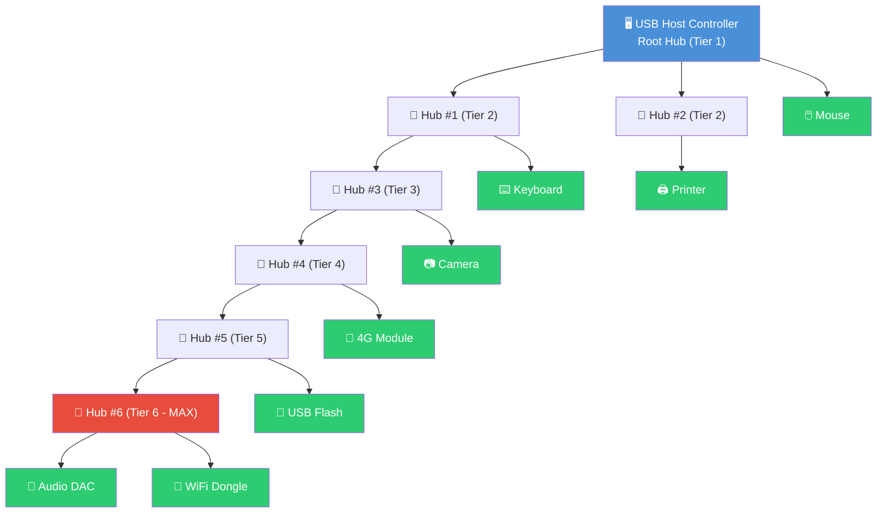

# B-B.6.1 USB物理层与拓扑

> 所属章节：第五部 B. 总线协议 > B-B.6 USB子系统
>
> 难度：[I] Intermediate | 预计阅读时间：35分钟

## <span class="blue"> 本节导读

USB（Universal Serial Bus）是嵌入式Linux系统中使用最广泛的外设接口之一。从最早期的键盘鼠标，到后来的U盘、4G模块、摄像头，再到如今的高速SSD和Type-C显示器，USB几乎无处不在。

本节我们从最底层的物理层出发，搞清楚两件事：**信号怎么在两根线上跑得又快又稳**，以及**一台主机怎么挂上那么多设备**。理解了差分信号的抗干扰原理、四种速率的差异，还有Hub级联的拓扑规则，你后续读USB驱动代码、调试枚举失败、甚至画PCB走线时都会心里有底。

**本节知识地图**：物理层信号（D+/D-差分对）→ 四种速率与编码 → 连接检测机制 → OTG双角色动态切换 → 星型拓扑与Hub级联限制

---

## <span class="blue"> USB 1.1/2.0/3.0 物理层：差分信号与四种速率 [I]

### 差分信号：两根线跳恰恰

USB 1.x/2.0 只用了一对差分数据线：**D+ 和 D-**。所谓的"差分"，就是数据并不是靠某一根线对地的绝对电平来表示0或1，而是靠两根线之间的**电压差**来传递信息。

当 D+ 比 D- 高大约 +200mV 时，表示逻辑"1"；当 D- 比 D+ 高大约 +200mV 时，表示逻辑"0"。两根线受到的干扰噪声是共模的——电磁干扰会让 D+ 和 D- 同时抬高或压低，但它们的差值基本不变。这就像两个人在摇晃的船上跳舞，只要他们相对位置不变，舞步就不会乱。

USB 2.0 规范要求这对差分线的**特性阻抗为 90Ω（±15%）**。PCB 布板时，D+ 和 D- 必须保持等长、等距、同层走线，差分阻抗不匹配会导致信号反射，眼图闭合。

```
    理想差分信号眼图                              长距离衰减后眼图
    
    D+ ─────┐   ┌─────┐   ┌─────            D+ ────┐  ┌───┐  ┌───
            │   │     │   │                        │  │   │  │
            └───┘     └───┘                        └──┘   └──┘
    D- ────┐   ┌─────┐   ┌─────            D- ───┐  ┌───┐  ┌───
           │   │     │   │                       │  │   │  │
           └───┘     └───┘                       └──┘   └──┘
    
    <─── 张开的眼图，裕量充足 ───>            <─── 眼图闭合，裕量不足 ───>
         ┌──┐      ┌──┐                              ┌┐     ┌┐
    ─────┘  └──────┘  └────              ───────────┘ └────┘ └────
    
    判决点清晰，误码率低                        判决点模糊，容易误判
```

> 💡 **提示**：90Ω差分阻抗是USB 2.0的硬性指标。四层板布线时，D+/D- 走线宽度通常约8~10mil，线与线间距约5~6mil，到参考层的距离约5~6mil，用Si9000等阻抗计算器验证后再出Gerber，别凭感觉走线。

### 四种速率：从蜗牛到猎豹

USB从1996年诞生到现在，速率跨越了三个数量级。每个版本都在编码方式、信号电平、线缆要求上做了升级。

| 版本 | 速率名称 | 数据速率 | 信号线 | 编码方式 | 推出年份 |
|:---:|:---:|:---:|:---:|:---:|:---:|
| USB 1.0/1.1 | Low-speed (LS) | 1.5 Mbps | D+/D- | NRZI + 位填充 | 1996/1998 |
| USB 1.1 | Full-speed (FS) | 12 Mbps | D+/D- | NRZI + 位填充 | 1998 |
| USB 2.0 | High-speed (HS) | 480 Mbps | D+/D- | NRZI + 位填充 + 高速握手 | 2000 |
| USB 3.0/3.1 Gen1 | Super-speed (SS) | 5 Gbps | D+/D- + SSTX±/SSRX± | 8b/10b | 2008 |
| USB 3.1 Gen2 | Super-speed+ | 10 Gbps | D+/D- + SSTX±/SSRX± | 128b/132b | 2013 |
| USB 3.2/4 | 更高 | 20+ Gbps | 同上或Type-C多通道 | 更高阶编码 | 2019+ |

**NRZI（Non-Return-to-Zero Inverted）编码**的规则很简单：数据为1时电平翻转，数据为0时电平保持不变。这样避免了长串0导致的时钟漂移。但如果出现长串1，电平会频繁翻转，反而没问题——真正的问题在于长串0。USB用"位填充"来解决：发送端在连续6个1之后强制插入一个0，接收端检测到这个填充位后丢弃它。

**High-speed 的握手过程很有意思**。设备上电时先以 Full-speed 连接到主机，主机检测到设备支持 HS 后，发送一个特定的"啁啾"信号（Chirp K/J 序列），双方协商成功后切换到 480Mbps 模式。这个过程在几十毫秒内完成，对用户完全透明。

USB 3.0 引入了**全新的差分对**：SSTX±（SuperSpeed Transmit）和 SSRX±（SuperSpeed Receive），是独立的全双工链路。D+/D- 这对老线依然保留，向下兼容 USB 2.0。所以一根 USB 3.0 线缆内部实际上有两套独立的信号通道。

> ⚠️ **陷阱**：USB线缆超过5m@High-speed时，信号衰减严重，设备会时断时续。很多工程师误以为是驱动bug，反复调试软件，最后发现换个短线就好了。长距离场景请使用 **active extension cable**（带信号中继放大器的延长线），或者改用USB-over-Cat5方案，不要在软件层面浪费时间。

---

## <span class="blue"> 连接检测与 OTG：谁做主谁做从 [I]

### 速度判断：看上拉电阻接在哪根线

USB Host（主机）的 D+ 和 D- 各有一个 **15kΩ 下拉电阻**到地。Device（设备）端则在自己的速度对应线上接一个 **1.5kΩ 上拉电阻**到 3.3V。

| 设备速度 | 上拉电阻位置 | 上拉电压 |
|:---:|:---:|:---:|
| Low-speed (1.5Mbps) | D- 上拉到 3.3V | 3.3V |
| Full-speed (12Mbps) | D+ 上拉到 3.3V | 3.3V |
| High-speed (480Mbps) | D+ 上拉到 3.3V（握手后切HS） | 3.3V |

Host 检测到这个上拉信号就知道"有设备插进来了"，然后通过判断 D+ 还是 D- 被拉高来识别设备的速度等级。High-speed 设备一开始也以 Full-speed 上拉，后续的 chirp 握手才切换到真正的高速模式。

### OTG：一根线，两种角色

传统USB有个硬伤：Host 永远是 Host，Device 永远是 Device。但嵌入式设备经常需要"既当爹又当儿子"——比如平板电脑既要接U盘读文件（Host），又要连PC拷照片（Device）。**USB OTG（On-The-Go）**就是为了解决这个问题。

OTG 增加了一根 **ID 引脚**，位于 Micro-USB / Mini-USB 的第五脚（普通USB只有VBUS/D+/D-/GND四根线）。ID 引脚的状态决定了初始角色：

| ID 引脚状态 | 初始角色 | 简称 | HNP 支持 | SRP 支持 |
|:---:|:---:|:---:|:---:|:---:|
| ID = 0（接地） | Host（主机） | A-Device | 可选 | 可选 |
| ID = 1（悬空） | Device（外设） | B-Device | 可选 | 可选 |

**HNP（Host Negotiation Protocol，主机协商协议）** 允许 A-Device 和 B-Device 在连接后动态交换角色。比如手机（A-Device，初始Host）连着打印机（B-Device），手机想省电让打印机当Host来发起操作，就可以通过 HNP 交换角色。交换完成后，原来的 B-Device 变成 Host，原来的 A-Device 变成 Device。

**SRP（Session Request Protocol，会话请求协议）** 允许 B-Device 在总线挂起后请求 A-Device 重新供电。这在电池供电场景很有用——A-Device 可以关掉 VBUS 省电，B-Device 需要工作时再唤醒它。

在实际嵌入式Linux中，OTG 控制器的角色切换由 **内核的 OTG 驱动栈** 管理。你可以通过 sysfs 查看和强制设置角色：

```bash
# 查看当前 OTG 角色
cat /sys/class/udc/<controller>/current_speed
# 查看 ID 引脚状态
cat /sys/kernel/debug/usb/devices | grep "OTG"
# 强制切换为 Host 模式（部分平台支持）
echo host > /sys/bus/platform/drivers/usb-otg/.../role
# 强制切换为 Device 模式
echo device > /sys/bus/platform/drivers/usb-otg/.../role
```

### 嵌入式三种USB工作模式

| 模式 | 场景 | Linux内核配置 | 典型应用 |
|:---:|:---:|:---:|:---:|
| USB Host | 接U盘、键盘、4G模块等外设 | `USB_EHCI_HCD` / `USB_OHCI_HCD` | 工业网关接USB传感器 |
| USB Device (Gadget) | 被PC识别为大容量存储/网卡/串口 | `USB_CONFIGFS` / `USB_GADGET` | 智能手表连PC充电+传数据 |
| USB OTG | 动态切换Host/Device | `USB_OTG` + 控制器驱动 | 平板、手机、双角色工控机 |

> 💡 **提示**：嵌入式调试Console通常接UART串口，但在大批量产线烧录固件时，用USB的DFU（Device Firmware Update）模式比UART快得多。DFU配合`dfu-util`工具，一台PC通过USB Hub可以同时烧录几十块板子，UART可做不到这个效率。

---

## <span class="blue"> USB 星型拓扑：一台主机挂127个设备

USB 的拓扑结构是**分层星型（Tiered Star）**。所有设备都通过 Hub 连接到 Root Hub，不允许设备之间直接相连，也不允许环路。

### 拓扑规则

| 参数 | 限制 | 说明 |
|:---:|:---:|:---|
| 最大层级深度 | 6 层（含Root Hub） | Root Hub = Tier 1，最多再级联5级Hub |
| 最多设备数 | 127 个 | 7-bit地址，0号保留给未枚举设备 |
| 每级Hub端口数 | 通常 4~7 个 | 理论上限受Hub控制器设计约束 |
| 线缆最大长度 | LS: 3m / FS: 5m / HS: 5m / SS: 3m | 超过需用active cable或光纤方案 |
| Hub级联数 | 最多 5 级 | Root Hub → Hub1 → Hub2 → ... → Hub5 |

**为什么是127个设备？** USB协议用7位地址字段（2⁷ = 128），地址0保留给刚插入尚未枚举的设备，所以可用地址是1~127，共127个。

### 拓扑图示



层级最多到 Tier 6（Hub #6），设备地址范围 1~127。实际产品中，很少需要级联这么深的Hub链，但做产品兼容性测试时，USB-IF 的认证测试确实会验证6层深度和127设备地址的极限场景。

---

## <span class="blue"> 本节总结

| 要点 | 核心内容 |
|:---|:---|
| 差分信号 | D+/D- 差分传输，抗共模干扰，90Ω特性阻抗是PCB布线硬指标 |
| 四种速率 | LS 1.5M / FS 12M / HS 480M / SS 5G+，编码从NRZI升级到8b/10b |
| 连接检测 | D+上拉=FS/HS，D-上拉=LS，15kΩ下拉在Host端检测 |
| OTG双角色 | ID引脚决定初始角色，HNP动态交换，SRP省电唤醒 |
| 拓扑限制 | 星型分层，最多6层（含Root）、5级Hub、127设备 |
| 长距离陷阱 | >5m@HS需active cable，别在软件层面排查信号问题 |
| 嵌入式实践 | Host接外设、Gadget被PC识别、OTG动态切换三种模式 |

---

## <span class="blue"> 下一步

下一节 **B-B.6.2 USB枚举与描述符**，我们将深入USB协议的核心——设备枚举流程。你会看到USB设备插上后，主机如何通过控制传输读取设备描述符、配置描述符、接口描述符和端点描述符，最终加载匹配的驱动程序。我们还会拆解 `lsusb -v` 的每一行输出，让你能读懂任何一个USB设备的"身份证"。

---

## <span class="blue"> 配套资源

- **官方规范**：USB 2.0 Specification（usb.org，免费下载），重点阅读 Chapter 7（Physical Layer）和 Chapter 4（Architecture）
- **工具命令**：`lsusb`（查看设备拓扑）、`lsusb -t`（树形结构）、`cat /sys/kernel/debug/usb/devices`（内核调试信息）
- **书籍推荐**：《USB Complete》by Jan Axelson，第五版，物理层和枚举章节写得极其实用
- **示波器调试要点**：HS信号用≥1GHz带宽示波器，差分探头探测D+/D-，重点看chirp握手阶段的眼图张开度
