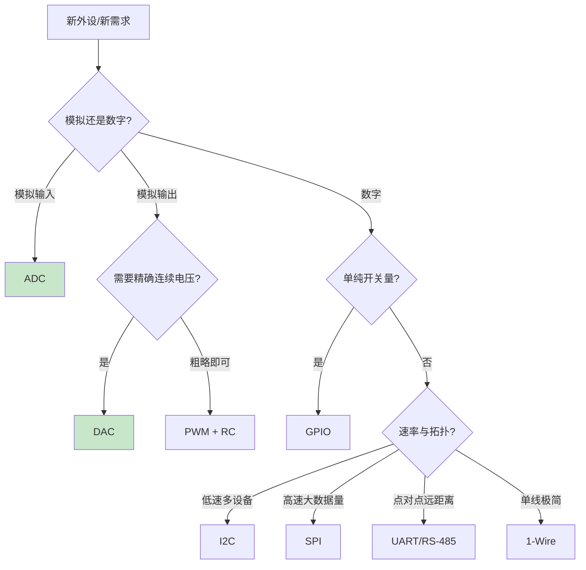

# B-B.2.4 DAC 与基础外设选型

> 所属章节：第五部 B. 总线协议 > B-B.2 基础外设接口
>
> 难度：[B] Beginner | 预计阅读时间：25 分钟

## <span class="blue"> 本节导读

GPIO 输出开关量，PWM 输出平均值可调的方波，DAC（Digital-to-Analog Converter，数模转换器）输出的是真正的连续模拟电压——变频器频率指令、可编程电源、模拟执行器控制都需要它。同时，基础外设四件套（GPIO/PWM/ADC/DAC）到此集齐，本节给出一套选型框架：拿到一个新外设，该用哪个接口接。

本节覆盖：R-2R 梯形网络的工作原理、分辨率与更新率的选型含义、输出缓冲与带载能力、SoC 无内置 DAC 时的三条替代路径（含 RK3568 的实际约束）、外设选型决策图与速查表，以及 DAC 控制变频器的完整信号链。

---

## <span class="blue"> DAC 原理

### R-2R 梯形网络

最常见的 DAC 架构只用 R 和 2R 两种电阻：

```text
        2R     2R     2R     2R
    ━━━/\/\━━/\/\━━/\/\━━/\/\━━━ → Vout
        │      │      │      │
       [S3]   [S2]   [S1]   [S0]    ← 数字开关（D3~D0）
        │      │      │      │
      GND 或 Vref（由对应比特位决定）

    输出电压：Vout = Vref × (D / 2ⁿ)
```

每一位开关控制的电流是前一位的一半，输出端叠加出与数字量成正比的电压。电阻种类少、温漂一致性好、易集成。实际芯片还有电容分压型（CMOS 工艺）与电流舵型（高速 DAC），但 R-2R 是理解 DAC 的标准起点。

<!-- 【待补图】images/B-B.2.4-R2R梯形网络原理.png（优先级：★必要）
图名：R-2R 梯形网络 DAC 工作原理与二进制加权电流图
生图提示词：电路原理示意图，白底，左右两联。左联"R-2R 网络结构"：画 4 位 R-2R 梯形网络——顶部一条水平线上串联 4 个电阻（标注 2R），每个节点向下接一个开关（画标准开关符号 S3~S0），开关下接电阻（标注 R），再分岔到 GND 与 Vref 两个汇流排（标注"数字位=1 接 Vref，=0 接 GND"），最右端输出标注 Vout，旁边公式"Vout = Vref × D/2ⁿ"。右联"二进制加权"：画 4 条水平柱状条，从上到下标注"S3 贡献 1/2、S2 贡献 1/4、S1 贡献 1/8、S0 贡献 1/16"，柱长按比例递减，每柱标注开关掷向 Vref 时的电压贡献值（以 Vref=3.3V 为例：1.65V/0.825V/0.41V/0.21V），底部总和示例"S3+S1=1010：1.65+0.41=2.06V"。电阻用标准锯齿符号，开关闭合用实心、断开用空心，Vref 路径红色、GND 路径黑色，柱状图蓝色渐变，中文标注，扁平矢量风格。比例 16:9。 -->

### 分辨率与更新率

| 分辨率 | LSB @ 3.3 V | 适用场景 |
|--------|-------------|----------|
| 8-bit | 12.89 mV | 粗略调压、玩具级 |
| 10-bit | 3.22 mV | 通用工业控制 |
| 12-bit | 0.81 mV | 变频器指令、电源调节、音频（最常用档位） |
| 16-bit | 50.35 μV | 精密仪器、专业音频 |
| 24-bit | 0.20 μV | 计量校准、实验室仪器 |

更新率决定输出能多快变化：<10 kSPS 覆盖温度设定、阀门控制；10~500 kSPS 覆盖工业模拟输出与音频；波形发生、软件无线电需要 MSPS 级高速 DAC。

> 💡 分辨率先看负载端需求：负载（如变频器）本身只能分辨 mV 级差异时，12-bit 的 0.8 mV LSB 已足够。盲目上 16-bit 之前，先解决 PCB 噪声耦合问题——噪声会把高分辨率的收益全部吃掉。

### 输出缓冲与带载能力

R-2R 网络的输出阻抗在 kΩ 级，直接接负载会产生负载效应：输出电压随负载电流漂移。

| 输出形态 | 驱动能力 | 适用负载 |
|----------|----------|----------|
| 无缓冲 | 接近零 | 只能接运放等高阻输入 |
| 内置缓冲 | 几 mA | 轻负载 |
| 外接运放（电压跟随器/放大） | 几十 mA | 中等负载、电平转换 |
| 功率驱动级 | 数百 mA 以上 | 电磁阀、执行器 |

> ⚠️ DAC 输出的是精确电压信号，不是功率信号。驱动继电器、电磁阀、电机的正确链路是：DAC → 运放缓冲/隔离 → 功率驱动级（MOSFET/专用驱动芯片）。让 DAC 直接带功率负载，输出漂移是轻的，烧片是重的。

> ⚠️ 零刻度偏移与满刻度增益误差普遍存在：写 0 输出不恰好是 0 V，写满量程不恰好是 Vref。高精度应用做两点校准——写 0 与写满量程各实测一次，软件线性补偿。

---

## <span class="blue"> SoC 没有内置 DAC 怎么办

内置 DAC 在 MCU（STM32 等）上常见，但在应用处理器级 SoC 上并不普及——本书锚点硬件 RK3568 就没有内置 DAC。三条替代路径：

| 路径 | 精度 | 成本 | 适用场景 |
|------|------|------|----------|
| PWM + RC 滤波 | 8~10 bit 有效（受纹波限制） | 接近零 | 背光、粗略偏置电压 |
| 外置 I2C/SPI DAC（MCP4725、DAC8571 等） | 12~16 bit | 几元 | 工业模拟输出主流方案 |
| 专用音频/高速 DAC | 16~24 bit | 高 | 音频、波形发生 |

以外置 MCP4725（12-bit，I2C 接口）为例，内核有现成驱动（`drivers/iio/dac/mcp4725.c`），设备树挂在 I2C 控制器下：

```dts
&i2c1 {
    status = "okay";

    dac: mcp4725@60 {
        compatible = "microchip,mcp4725";
        reg = <0x60>;
        vref-supply = <&vcc_3v3>;
    };
};
```

注册后用户态经 IIO sysfs 控制，与内置 DAC 用法完全一致：

```bash
cat /sys/bus/iio/devices/iio:device0/out_voltage0_scale   # mV/LSB
echo 2047 > /sys/bus/iio/devices/iio:device0/out_voltage0_raw   # ≈ Vref/2
```

输出侧与 ADC 侧（B-B.2.3）是同一套 IIO 约定的镜像——文件前缀从 `in_voltage` 换成 `out_voltage`，换算公式同形：

```text
Vout(mV) = (raw + offset) × scale
```

写之前先读一次 `scale` 确认换算系数（12-bit 与 16-bit DAC 差 16 倍），不要硬编码。IIO 输出侧还有两个低频但关键的属性：`out_voltageY_powerdown`（通道掉电控制，省电场景用）与 buffer 接口（`/dev/iio:deviceX` 连续写入，配 trigger 输出周期波形——波形发生的正规路径，驱动侧写法归 D 扩展 IIO 篇）。

> 💡 没有 DAC 硬件也能练：IIO dummy 框架（`drivers/iio/dummy/`）可虚拟出输出通道，sysfs 写链与换算逻辑先在 PC 上跑通；频率→码值的换算纯软件，用 Python 复现验证后再上板。

PWM+RC 滤波的原理是把 PWM 方波经低通滤波取平均值（见 B-B.2.2）：截止频率远低于 PWM 频率时，输出近似直流。纹波与响应速度矛盾——滤波越狠纹波越小、响应越慢，只适合慢变设定值场景。

<!-- 【待补图】images/B-B.2.4-PWM_RC滤波纹波权衡.png（优先级：★必要）
图名：PWM+RC 滤波输出纹波与响应速度权衡图
生图提示词：波形示意图，白底，上下三组共享横轴时间。组一"PWM 输入（50% 占空比）"：标准方波。组二"小时间常数（响应快、纹波大）"：方波经过后变成围绕平均值（画水平虚线标注 V_avg=D×3.3V≈1.65V）上下大幅波动的三角纹波，标注"纹波 ±200mV"，并在占空比从 50% 跳到 75% 的时刻画竖虚线，输出快速爬升到新均值，标注"响应快"。组三"大时间常数（响应慢、纹波小）"：纹波幅度明显变小（标注"纹波 ±20mV"），同一跳变时刻输出缓慢指数爬升，用双向箭头标注"稳定时间数十 ms"。右侧配一句结论框："滤波越狠纹波越小、响应越慢——慢变设定值场景专用"。PWM 方波灰色，输出曲线深蓝色，均值虚线橙色，纹波区间红色底纹，中文标注，扁平矢量风格。比例 16:9。 -->

---

## <span class="blue"> 信号链实例：DAC 控制变频器（0-10 V）

工业变频器的标准频率指令接口是 0-10 V 模拟输入：0 V 对应 0 Hz，10 V 对应上限频率（如 50 Hz）。完整信号链：

```text
┌───────────┐     ┌────────────┐     ┌──────────┐
│ SoC/外置   │     │ 运放级      │     │ 变频器    │
│ DAC 0~3.3V │────→│ 3.3V→10V   │────→│ AI1 0-10V │──→ 三相电机
└───────────┘     │ 增益≈3.03  │     └──────────┘
                  └────────────┘
        运放供电需 ≥12V 才能输出 10 V；两地共 AGND
```

> 💡 变频器也有 4-20 mA 指令端子（与 0-10 V 端子电气完全不同，接线前核对手册）。DAC 做 4-20 mA 输出不用电阻硬凑——用 XTR111 类专用电流环发送芯片，DAC 电压进、环路电流出，抗干扰与断线诊断的好处与采集侧（B-B.2.3）对称。

频率到 DAC 码值的换算：

```c
/* freq_to_dac_raw：频率(Hz) → DAC 原始码值（12-bit）*/
#define VFD_MAX_HZ   50.0f     /* 变频器上限频率 */
#define VFD_MAX_MV   10000.0f  /* 10V 满量程 */
#define GAIN         (VFD_MAX_MV / 3300.0f)   /* 运放增益 ≈ 3.03 */
#define DAC_VREF_MV  3300.0f
#define DAC_FULL     4095

unsigned int freq_to_dac_raw(float hz)
{
    float vfd_mv = hz / VFD_MAX_HZ * VFD_MAX_MV;  /* 频率 → 变频器电压 */
    float dac_mv = vfd_mv / GAIN;                 /* → DAC 侧电压 */
    int raw = (int)(dac_mv / DAC_VREF_MV * DAC_FULL);
    if (raw < 0) raw = 0;
    if (raw > DAC_FULL) raw = DAC_FULL;           /* 限幅 */
    return raw;
}
```

写入与回读：

```bash
echo 2047 > /sys/bus/iio/devices/iio:device0/out_voltage0_raw   # ≈1.65V → 运放 ≈5V → 25Hz
cat /sys/bus/iio/devices/iio:device0/out_voltage0_raw           # 回读确认
```

DAC 输出异常时，第一排查手段是**阶梯写入 + 万用表三点测量**：写 0、半量程（2047/2048）、满量程（4095），在 DAC 引脚实测电压。三点呈线性（0 / ≈Vref/2 / ≈Vref）则数字侧与 DAC 正常，问题在运放级或变频器侧；三点异常则回到设备树与 IIO 节点查配置。阶梯不均匀还暴露 R-2R 电阻失配等硬件缺陷。

---

## <span class="blue"> 进阶形态：用 DAC 发波形（DDS 思路）

设定值输出只是 DAC 的一半能力，另一半是波形发生——正弦、三角、任意波形。思路叫 DDS（Direct Digital Synthesis，直接数字合成）：把波形的一个周期预先存成码值表，按固定时间间隔逐点写入 DAC，输出就是该波形的周期重复。

```c
/* 正弦表：64 点/周期，12-bit DAC，编译期生成（同 NTC 表思路） */
static const uint16_t sine64[64] = {
    2048, 2249, 2447, 2642, 2831, 3013, 3185, 3346,
    3495, 3630, 3750, 3853, 3939, 4007, 4056, 4085,
    4095, 4085, 4056, 4007, 3939, 3853, 3750, 3630,
    /* … 后半周期对称下降 … */
};

/* 每个更新周期写一个点，写满 64 点回到表头 */
void dds_tick(void)
{
    static unsigned int idx;
    dac_write_raw(sine64[idx]);       /* IIO buffer 或直写寄存器 */
    idx = (idx + 1) & 63;
}
```

输出频率由更新率决定：`f_out = f_update / 64`。约束同样来自奈奎斯特——每周期点数越多波形越光滑，但更新率有上限（I2C DAC 受总线速率限制，MCP4725 标准模式 100 kHz 下实际只能出几 Hz 的波形；要音频级以上波形须用 SPI 高速 DAC 或内置 DAC + DMA 自动发表，后者正是 IIO buffer + trigger 的用武之地）。

DDS 的工程价值在于"波形是数据不是电路"：改表就改波形，正弦换三角换任意调制曲线都不动硬件。测试激励、可编程电源的软启动曲线、压电驱动，都是这个思路的落地。

---

## <span class="blue"> 基础外设选型决策

四件套与低速总线的分工，一张图收敛：



选型速查表：

| 应用场景 | 首选 | 替代 | 不适用 |
|----------|------|------|--------|
| LED 开关/按键/继电器 | GPIO | — | 调光 |
| LED 调光/电机粗略调速 | PWM | DAC | 精密模拟输出 |
| 读电位器/模拟温度 | ADC | 外置 ADC | 远距离模拟传输 |
| 精确 0~x V 输出 | DAC | PWM+RC | 功率驱动 |
| 温湿度/气压等传感器 | I2C | SPI | 高速数据流 |
| Flash/显示屏/高速 ADC | SPI | I2C | 长距离 |
| GPS/蓝牙/调试口 | UART | RS-485（远距离） | 多设备共享 |
| 单线极简（DS18B20） | 1-Wire | I2C | 高速 |

选型顺序的工程惯例：先看传感器数据手册支持什么接口，再看 SoC 还剩什么引脚与控制器，最后看软件栈（内核有没有现成驱动）。引脚紧张时 I2C 优先（两线挂多设备）；带宽紧张时 SPI 优先；两者都不要为了用而用。

---

## <span class="blue"> 方案对比（Trade-off）

| 维度 | PWM+RC | 内置 DAC | 外置 DAC（I2C/SPI） |
|------|--------|----------|---------------------|
| 精度 | 8~10 bit 有效 | 12 bit 典型 | 12~16 bit |
| 纹波 | 有（滤波折中） | 无 | 无 |
| 成本 | ≈0 | 0（若有） | 芯片+BOM |
| 占用资源 | 1 路 PWM | DAC 通道 | 总线 + 地址 |
| 响应速度 | 慢（RC 时间常数） | 快 | 受总线速率限制 |
| 典型用途 | 背光、偏置 | 通用模拟输出 | 工业 0-10V/4-20mA 输出 |

---

## <span class="blue"> 排障：DAC 输出问题的六张面孔

| 症状 | 根因 | 定位动作 |
|------|------|----------|
| 输出乱跳、与其他模块争引脚 | 模拟引脚配成复用/GPIO 模式 | 引脚必须是模拟模式（数字缓冲关闭） |
| 接负载后输出电压漂移 | kΩ 级输出阻抗遇低阻负载 | DAC → 运放缓冲 → 功率级，不直带负载 |
| 写 0 非 0V、写满非 Vref | 零刻度偏移与增益误差（普遍存在） | 两点校准，软件线性补偿 |
| 输出高段削顶 | 运放供电轨不够（要 10V 至少供 12V） | 核对运放供电与轨到轨特性 |
| 接变频器无响应/烧输入级 | 4-20 mA 与 0-10 V 端子混接 | 核对手册端子定义，两种输入电气完全不同 |
| 阶梯写入三点不成线性 | 数字侧配置错，或 R-2R 电阻失配等硬件缺陷 | 先查设备树与 IIO 节点，再怀疑芯片 |

---


## <span class="blue"> 本节总结

DAC 是四件套的最后一角：R-2R 网络用两种电阻叠出 Vref × D/2ⁿ，原理一页纸就能讲完，工程约束才是主体——输出是精确电压不是功率（带载必须经运放加驱动级），零点和满度误差普遍存在（精密场合两点校准），分辨率先看负载端能分辨多少（噪声不解决，16-bit 是浪费）。

SoC 没有内置 DAC 是常态（RK3568 就没有），三条替代路径按精度排：PWM+RC 白捡 8~10 bit 给慢变设定值，外置 I2C/SPI DAC（MCP4725 类，内核现成驱动、IIO 接口与内置完全一致）是工业主流，高速波形发生走 SPI DAC 或内置 DAC + DMA。变频器信号链给了完整样板：增益换算、限幅、阶梯写入三点测量——三点不成线性先分数字侧与模拟侧。四件套集齐后的选型收敛成一张决策图：模拟输入 ADC、精确模拟输出 DAC、粗略用 PWM+RC、开关量 GPIO，总线类需求交给 I2C/SPI/UART。

**速查表**

| 要点 | 结论 |
|------|------|
| R-2R | Vout = Vref × D/2ⁿ；每位贡献是前一位的一半 |
| 分辨率 | 12-bit 是工业最常用档；先看负载分辨率再谈位数 |
| 带载 | DAC 输出≠功率信号：DAC→运放→驱动级，直带烧片 |
| 精度误差 | 写 0 非 0V、写满非 Vref 是常态；两点校准软件补偿 |
| 无内置 DAC | PWM+RC（≈0 成本慢变）/ 外置 I2C DAC（主流）/ 高速 DAC（波形） |
| IIO 写路径 | Vout=(raw+offset)×scale，先读 scale 再写 raw；波形走 buffer+trigger |
| DDS | 波形是数据不是电路：码值表+定时发表，f_out=f_update/点数 |
| 变频器链 | 0-10V 指令+运放增益≈3.03；4-20mA 输出用 XTR111 类专用芯片 |
| 排查锚点 | 阶梯写入 0/半/满三点实测，线性则问题在模拟侧 |

---

## <span class="blue"> 本节自查

1. R-2R 网络为什么只用两种电阻就能合成任意电压？写出输出公式。
2. 为什么不能拿 DAC 直接驱动电磁阀？正确链路是什么？
3. SoC 无内置 DAC 时的三条路径各自精度和适用场景？
4. IIO 输出侧的换算公式与 ADC 侧有何异同？写 raw 前先读什么？
5. DDS 的输出频率由什么决定？MCP4725 为什么出不了音频波形？
6. DAC 输出异常时，阶梯写入三点测量怎么分数字侧与模拟侧问题？


## <span class="blue"> 下一步

基础外设四件套到此集齐。下一节 **B-B.2.5 实战：GPIO 按键中断 + PWM 呼吸灯 + ADC 电位器采集**，把三件套合成一个端到端代码案例：从数据手册与电路出发，经设备树到可运行的完整程序。之后进入 **B-B.3 I2C** 系列，开始真正的串行总线。

> 💡 螺旋衔接：本节的外置 DAC 走 I2C，正是 B-B.3 系列的第一类负载；DAC 驱动（`iio_info` 的 `write_raw` 实现）的完整写法归 D 扩展 IIO 篇。
