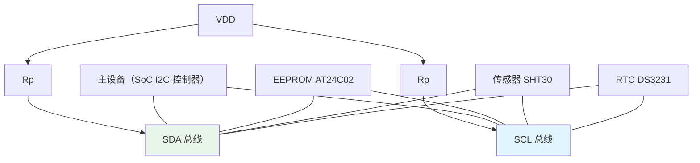

# B-B.3.1 I2C 物理层与电气特性

> 所属章节：第五部 B. 总线协议 > B-B.3 I2C 总线
>
> 难度：[B] Beginner / [I] Intermediate | 预计阅读时间：30 分钟

## <span class="blue"> 本节导读

I2C（Inter-Integrated Circuit）只用两根线挂接多个设备，是嵌入式领域覆盖面最广的低速串行总线：EEPROM、温湿度传感器、RTC、触摸屏、电量计都在它上面。物理层的设计决定了一切上层行为——为什么必须开漏、上拉电阻怎么算、总线能拉多长、地址冲突怎么办。

本节覆盖：SDA/SCL 开漏结构与"线与"逻辑、四种速率模式与时序参数、上拉电阻与总线电容的工程计算、多主仲裁机制、7 位地址空间与冲突规避方案。

---

## <span class="blue"> 硬件结构：两线、开漏、线与

### 两条信号线

- **SDA**（Serial Data）：双向数据线
- **SCL**（Serial Clock）：时钟线，主设备驱动；从设备可拉低实现时钟延展（见 B-B.3.2）

### 开漏输出：I2C 的物理基石

每个设备的 I2C 引脚内部只有一个 NMOS 能把线拉低，**没有主动拉高的能力**：

```
        VDD (3.3V/5V)
          │
        [Rp]     上拉电阻（每条线各一个）
          │
    ──────┴────── SDA 总线
          │
     ┌────┼────┐
   [NMOS][NMOS][NMOS]   各设备的开漏输出
     │    │    │
    GND  GND  GND

任一设备导通 → 总线为 0
全部截止    → 上拉电阻把线拉回 1
```

这就是"线与"（Wired-AND）：任何设备都能强制输出 0，只有所有设备都释放时才为 1。它是 I2C 两个核心能力的物理来源——多主仲裁（本节末）与 ACK 机制（接收方在第 9 拍拉低 SDA 应答）。

> ⚠️ I2C 引脚绝不可配成推挽输出。两个设备一高一低直接电源短路，轻则通信全灭，重则烧输出级。SoC 侧确认引脚复用到 I2C 控制器（控制器本身开漏），不要用普通 GPIO 推挽去"客串"。

### 拓扑



所有设备并联在两线上，设备数量不受地址限制（112 个可用地址），真正的物理上限是**总线电容 ≤400 pF**。

---

## <span class="blue"> 速率模式

| 模式 | 最大频率 | 引入年份 | 典型设备 |
|------|----------|----------|----------|
| Standard-mode（Sm） | 100 kHz | 1982 | EEPROM、RTC（AT24C02、DS3231） |
| Fast-mode（Fm） | 400 kHz | 1992 | 主流传感器（SHT30、BMP280） |
| Fast-mode Plus（Fm+） | 1 MHz | 2006 | 大容量 EEPROM、触摸屏 |
| High-speed mode（Hs） | 3.4 MHz | 2000 | 高速 ADC/DAC（Hs 有特殊电气规则，少用） |

工程默认 **Fast-mode 400 kHz**：设备兼容性最好，性能够用。提速前确认总线上所有从设备都支持目标模式——总线速率按最慢设备配置。

---

## <span class="blue"> 时序参数与波形

### 关键时序参数（UM10204 规范值摘录）

| 参数 | 符号 | Sm 100k | Fm 400k | Fm+ 1M |
|------|------|---------|---------|--------|
| SCL 频率 | f_SCL | ≤100 kHz | ≤400 kHz | ≤1 MHz |
| START 保持时间 | t_HD;STA | 4.0 μs | 0.6 μs | 0.26 μs |
| 总线空闲时间 | t_BUF | 4.7 μs | 1.3 μs | 0.5 μs |
| SDA 建立时间 | t_SU;DAT | 250 ns | 100 ns | 50 ns |
| SCL 低电平 | t_LOW | 4.7 μs | 1.3 μs | 0.5 μs |
| SCL 高电平 | t_HIGH | 4.0 μs | 0.6 μs | 0.26 μs |
| 上升时间 | t_R | ≤1000 ns | ≤300 ns | ≤120 ns |
| 下降时间 | t_F | ≤300 ns | ≤300 ns | ≤120 ns |

SoC 的 I2C 控制器硬件自动满足这些时序，软件工程师通常不直接配置；但**读示波器波形判故障时必须拿这张表对照**——上升沿超标是最常见的物理层故障。

### 一次完整传输的波形

```
      START        8 位数据（高位先行）            ACK       STOP
        ↓                                             ↓        ↓
SDA  ───┐   ┌───┬───┬───┬───┬───┬───┬───┬───┐   ┌───┐      ┌────
        └───┘ D7│D6 │D5 │D4 │D3 │D2 │D1 │D0 └───┘   └──────┘
                └───┴───┴───┴───┴───┴───┴───┘
SCL  ─────┐ ┌─┐ ┌─┐ ┌─┐ ┌─┐ ┌─┐ ┌─┐ ┌─┐ ┌─┐ ┌─┐ ┌──────────
          └─┘ └─┘ └─┘ └─┘ └─┘ └─┘ └─┘ └─┘ └─┘ └─┘
            数据在 SCL 低电平期间变化，高电平期间必须稳定
```

四条铁律：

- **START**：SCL 高电平时 SDA 由高变低
- **STOP**：SCL 高电平时 SDA 由低变高
- **数据位**：SCL 低电平期间允许变化，高电平期间保持稳定（采样点在高电平）
- **ACK/NACK**：每 8 位后第 9 拍，接收方拉低为 ACK、保持高为 NACK

---

## <span class="blue"> 上拉电阻与总线电容

### 上拉电阻计算

规范给出的上限公式（TI SLVA689 同式）：

```
Rp(max) = t_R / (0.8473 × C_bus)
```

`t_R` 查上表，`C_bus` 为总线总电容。下限由灌电流决定：标准/快速模式器件保证 3 mA 灌电流能力，`Rp(min) = (VDD − V_OL) / 3mA`。

计算示例（C_bus = 100 pF，VDD = 3.3 V）：

| 模式 | t_R | Rp(max) | Rp(min) | 工程取值 |
|------|-----|---------|---------|----------|
| Sm 100k | 1000 ns | 11.8 kΩ | ≈1 kΩ | 4.7 kΩ~10 kΩ |
| Fm 400k | 300 ns | 3.54 kΩ | ≈1 kΩ | 1.5 kΩ~4.7 kΩ |
| Fm+ 1M | 120 ns | 1.42 kΩ | ≈1 kΩ | 1.0 kΩ~2.2 kΩ |

> 💡 3.3 V 系统盲选 4.7 kΩ（Sm/Fm 都安全）；5 V 系统盲选 4.7 kΩ~10 kΩ。总线长或设备多时按上表重新核算。

### 总线电容与走线长度

| 电容来源 | 典型值 |
|----------|--------|
| 设备引脚 | 10~20 pF/个 |
| PCB 走线 | 1~3 pF/cm |
| 连接器 | 2~5 pF/引脚 |
| 外部线缆 | 50~100 pF/m |
| **规范上限** | **≤400 pF** |

估算示例：4 个设备（60 pF）+ 1 个连接器（5 pF），走线 2 pF/cm，剩余裕量 335 pF → 走线可达约 1.6 m。板上走线 1 米以内通常安全；拉外部线缆时电容急剧上升。

> ⚠️ 电容超 400 pF 后上升沿变圆钝，采样出错表现为 ACK 丢失、数据错乱、总线死锁。`i2cdetect` 扫不出设备或间歇性失败时，示波器量上升沿对照 t_R 表；超标的最可靠对策是加总线缓冲器（PCA9515/TCA9517 类）分段。

---

## <span class="blue"> 多主仲裁

多主共享总线时，冲突靠线与逻辑无损解决：

1. 主设备发每位的同时回读 SDA 实际电平
2. 发 1 却读到 0 → 说明有别的主在发 0 → 自动退出
3. 发 0 的不受影响，继续传输

```
周期:     1   2   3   4
主A 发:   0   1   0   1
主B 发:   0   1   1   0
SDA 实际: 0   1   0   0     ← 线与：任何 0 胜出

周期1/2：双方一致，各自匹配，继续
周期3：  A 发0读到0（匹配）；B 发1读到0（不匹配）→ B 退出
周期4：  A 独自完成传输
```

输掉仲裁的主设备等总线空闲后重试。结果规律：发送数值较小（前导 0 更多）的一方胜出——仲裁无损，赢家甚至不知道发生过竞争。

---

## <span class="blue"> 地址空间与冲突规避

7 位地址理论 128 个，扣掉保留段后可用 **0x08~0x77，共 112 个**：

| 范围 | 用途 |
|------|------|
| 0x00 | 通用呼叫（General Call） |
| 0x01~0x07 | 保留（CBUS 等） |
| 0x08~0x77 | 用户设备（112 个） |
| 0x78~0x7F | 10 位地址前缀与保留 |

地址冲突的解决方案：

| 方案 | 适用场景 |
|------|----------|
| 芯片地址引脚（ADDR/A0~A2 接高低组合） | EEPROM、传感器自带，首选 |
| I2C 多路复用器（PCA9548 等，一分八） | 同型号设备必须共存（如 8 个相同传感器） |
| 选不同地址的替代型号 | 设计阶段零成本方案 |
| GPIO 模拟 I2C（独立软件总线） | 设备极少、速率无要求时的兜底 |

> 💡 原理图评审时维护一张 I2C 地址分配表。地址撞车的典型症状是"单独测都正常，全挂上就出灵异问题"——两个设备同时应答，ACK 与数据全部错乱。

I2C 通信异常时，第一排查手段分两步：**断电状态用万用表量 SDA/SCL 对地电平**——上电空闲时应为上拉电压（≈VDD），若接近 0 V 说明有设备死拉总线或上拉缺失；**空闲电平正常后跑 `i2cdetect -y -r <bus>` 扫描**（工具细节见 B-B.3.4），扫不到地址再回头查物理层。

---

## <span class="blue"> 方案对比（Trade-off）

| 维度 | 评价 |
|------|------|
| 上拉电阻偏小 | 上升沿快、抗干扰好；代价是功耗与灌电流压力 |
| 上拉电阻偏大 | 省电；代价是上升沿慢、速率上不去 |
| 提速到 Fm+ | 吞吐翻倍；代价是所有从设备都要支持、布线要求提高 |
| 加总线缓冲器 | 电容限制突破、可分段隔离；代价是 BOM 与延迟 |
| GPIO 模拟 I2C | 不占用控制器、时序可控；代价是 CPU 占用、无硬件仲裁 |

---

## <span class="blue"> 常见陷阱

> ⚠️ 上拉电阻缺失或虚焊。空闲电平浮空，表现为完全无通信或随机成功。万用表量空闲电平即可确认。

> ⚠️ 推挽引脚上 I2C 总线。线与机制失效，多设备时直接短路风险。

> ⚠️ 总线电容超标仍按标准速率跑。上升沿超限的故障是间歇性的——温度、批次差异都会改变表现，现场最难查的一类。

> ⚠️ 混速率设备按快速率配置。慢设备应答跟不上，表现为该设备偶发 NACK。总线速率按最慢设备来。

> ⚠️ 地址表不做评审。两个同地址设备互相应答，故障现象与接触不良无异，浪费大量排查时间。

---

## <span class="blue"> 动手练习

1. **空闲电平测量**：板子上电、无通信时，万用表量 SDA/SCL 对地电压，确认 ≈VDD；断电测上拉电阻阻值，对照原理图。
2. **上拉核算**：按本板实际（设备数 × 15 pF + 走线估算），用 Rp(max) 公式核算当前上拉电阻是否在合法区间。
3. **扫描验证**：`i2cdetect -y -r 1`（总线号按实际）扫描，对照地址分配表确认所有设备应答。
4. **无硬件后备**：阅读 NXP UM10204 第 7 章（电气规范与时序），手工推导一遍 C_bus=200 pF、Fm 模式的 Rp 合法区间；或用 QEMU/开发板自带 I2C 总线跑 `i2cdetect` 观察已有设备的地址分布。

---

## <span class="blue"> 本节总结

| 自查项 | 确认标准 |
|--------|----------|
| 电气结构 | 开漏 + 上拉 = 线与；仲裁与 ACK 的物理来源 |
| 速率 | 四档速率与默认 400 kHz 的理由 |
| 时序 | START/STOP/数据位/ACK 四条铁律；t_R 超标的症状 |
| 上拉计算 | Rp(max)/Rp(min) 公式与工程取值 |
| 电容上限 | 400 pF 来源构成；缓冲器对策 |
| 仲裁 | 回读比较机制、无损、小地址胜出 |
| 排查锚点 | 先量空闲电平，再 i2cdetect 扫描 |

---

## <span class="blue"> 配套资源

- **权威规范**：NXP《I2C-bus specification and user manual》UM10204
- **上拉推导**：TI《I2C Bus Pullup Resistor Calculation》SLVA689
- **工具**：i2c-tools（`i2cdetect` 等，详见 B-B.3.4）、示波器/逻辑分析仪

---

## <span class="blue"> 下一步

物理层就绪后进入协议层：**B-B.3.2 I2C 协议层与帧格式**——地址帧与读写位、完整读写事务的帧序列、重复 START 的用途、10 位地址与时钟延展。随后 **B-B.3.3** 讲 Linux 驱动框架，**B-B.3.5 实战篇**用 AT24C02 EEPROM 把物理层到代码全链路走一遍。

> 💡 螺旋衔接：本篇的开漏/线与正是 B-B.2.1「开漏必配上拉」的总线级应用；设备树里 I2C 控制器挂在 APB 上的位置，回看 B-A.1.1 的地址映射。
