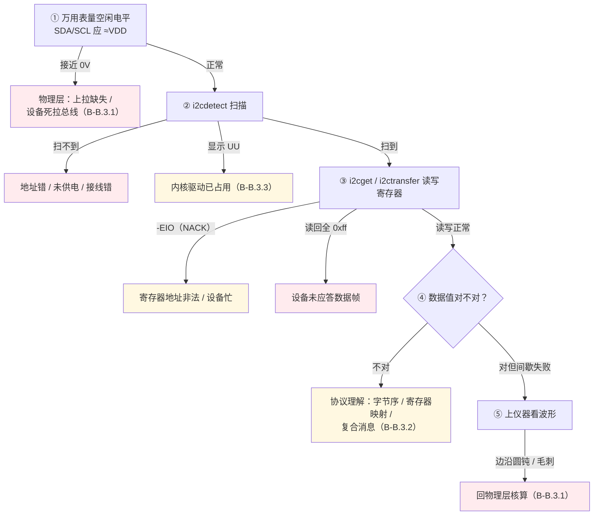

# B-B.3.4 I2C 调试工具与故障排查

> 所属章节：第五部 B. 总线协议 > B-B.3 I2C 总线
>
> 难度：[I] Intermediate | 预计阅读时间：30 分钟

## <span class="blue"> 本节导读

前面三篇讲了物理层、协议层、驱动框架，本节把它们收敛成一套可执行的排查方法论。I2C 故障的表现五花八门，但排查路径是收敛的：先用软件工具确认"谁在总线上、寄存器通不通"，工具答不上来再上仪器看波形，波形畸形回到物理层核算。i2c-tools 四件套加逻辑分析仪，覆盖 95% 以上的 I2C 调试场景。

本节覆盖：统一排查决策树、i2c-tools 四件套与 i2ctransfer、内核侧观察手段（sysfs/dmesg/动态调试）、逻辑分析仪抓包要点、高频故障对照表。

---

## <span class="blue"> 统一排查决策树

任何 I2C 异常，按这个顺序走，每一层排除一类问题：



决策树对应前面三篇的排查锚点：①是物理层锚点，②③是工具层主力，④⑤分别回协议层和物理层。**绝大多数故障在前三步就能定位，不要一上来就抓波形。**

---

## <span class="blue"> i2c-tools 四件套

i2c-tools 是 Linux I2C 调试的事实标准，全部走 `/dev/i2c-N` 用户态接口（B-B.3.3）。

| 命令 | 功能 | 典型用法 |
|------|------|----------|
| `i2cdetect` | 扫描总线应答地址 | `i2cdetect -y -r 1` |
| `i2cdump` | 批量读寄存器全景 | `i2cdump -y 1 0x50 b` |
| `i2cget` / `i2cset` | 单寄存器读/写 | `i2cget -y 1 0x48 0x00` |
| `i2ctransfer` | 任意组合多消息传输 | `i2ctransfer -y 1 w1@0x50 0x10 r4@0x50` |

### i2cdetect：谁在线上

```bash
i2cdetect -y -r 1
     0  1  2  3  4  5  6  7  8  9  a  b  c  d  e  f
00:                         -- -- -- -- -- -- -- --
30: -- -- -- -- -- -- -- -- -- -- -- -- -- 3d -- --
50: 50 -- -- -- -- -- -- -- -- -- -- -- -- -- -- --
60: -- -- -- -- -- -- -- UU -- -- -- -- -- -- -- --
```

三种格子含义：数字 = 设备应答；`--` = 无应答；**`UU` = 该地址已被内核驱动绑定**（此时用户态访问会被拒绝，见 B-B.3.3 陷阱）。

> ⚠️ 默认扫描方式可能被只读设备漏掉。`-r` 参数改用 SMBus Read Byte 扫描，兼容性更好；对疑似被扫描弄挂的设备（罕见），用 `-q`（SMBus Quick）更温和。

### i2cdump：寄存器全景

```bash
i2cdump -y 1 0x50 b
     0  1  2  3  4  5  6  7  8  9  a  b  c  d  e  f
00: ff ff ff ff ff ff ff ff ff ff ff ff ff ff ff ff
20: 48 65 6c 6c 6f 00 ...
```

模式参数：`b` 逐字节（最常用）、`w` 16 位、`i` I2C 块读。新设备上手先 dump 全景，对照手册寄存器表找规律，比逐个 i2cget 快得多。

> ⚠️ i2cdump 对某些设备有副作用——逐地址读会触发设备的状态机推进（如 FIFO 弹出、中断清除）。对这类设备用 `i2cget` 定点读，或先确认手册说明。

### i2cget / i2cset：定点读写

```bash
i2cget -y 1 0x48 0x00            # 读 0x48 的寄存器 0x00（字节模式）
i2cget -y 1 0x48 0x00 w          # 16 位 word 模式
i2cset -y 1 0x48 0x01 0x60       # 写寄存器
```

> ⚠️ word 模式读回的 16 位是**小端**（SMBus 规定低字节先发），而很多传感器手册按"高字节在前"描述寄存器。读数离谱时先做字节交换再换算——这是工具使用层面最高频的错误。

### i2ctransfer：复合消息

对应内核 `i2c_transfer()` 的多 msg 机制，消息间自动生成 Repeated START：

```bash
i2ctransfer -y 1 w1@0x50 0x10 r4@0x50
```

含义：向 0x50 写 1 字节（0x10，寄存器/内存地址），Repeated START 后读 4 字节。语法 `w<长度>@<地址> <数据...>` / `r<长度>@<地址>`，空格分隔多个消息。

"写寄存器地址再读数据"这类操作必须用 i2ctransfer——拆成 i2cset + i2cget 会在中间插入 STOP，部分器件因此复位内部地址指针，读回错误数据（B-B.3.2 的原子性问题）。

---

## <span class="blue"> 内核侧观察手段

### sysfs 拓扑

```bash
ls /sys/bus/i2c/devices/          # 所有 client：如 1-0050（总线1-地址0x50）
cat /sys/bus/i2c/devices/1-0050/name   # 该 client 绑定的设备名
ls /sys/class/i2c-adapter/        # 本板有几路 I2C 控制器
```

### dmesg 与动态调试

```bash
dmesg | grep i2c                  # probe 失败、传输超时的内核日志
echo 'file i2c-core-base.c +p' > /sys/kernel/debug/dynamic_debug/control
                                  # 打开 i2c-core 的动态调试输出
```

probe 失败时 dmesg 是第一现场：compatible 不匹配、地址冲突、`-EIO`/`ETIMEDOUT` 都会在日志里留下直接原因。

### tracepoint：看每一笔传输

内核 I2C 子系统内置 tracepoint，可以不改代码观察每一笔 `i2c_transfer` 的发起与结果——用户态程序谁在访问、访问哪个地址、返回什么错误，全部可见：

```bash
cd /sys/kernel/debug/tracing
echo 1 > events/i2c/enable        # 打开 i2c 事件组（i2c_write/i2c_read/i2c_reply/i2c_result）
cat trace_pipe                    # 实时观察；Ctrl-C 停止
# 典型输出：i2c_read: i2c-1 #0 a=050 f=0000 l=1
#          i2c_result: i2c-1 n=1 ret=1   （ret<0 即传输失败及错误码）
echo 0 > events/i2c/enable        # 用完关闭
```

适用场景：怀疑"有别的进程在偷偷访问设备"、想确认驱动实际发出的消息序列、定位间歇性失败时抓住失败那笔的错误码。比 strace 更底层——strace 只能看到 ioctl 调用，tracepoint 看到的是 Core 层实际组装的 i2c_msg。

---

## <span class="blue"> 逻辑分析仪抓包

软件工具只能回答"应答/不应答"，信号质量问题必须看波形。常见选择：Saleae Logic、DSLogic（百元级，内置 I2C 解码器）。

```
接线：Ch0 → SCL，Ch1 → SDA，GND 共地
采样率：≥ 总线速率 10 倍（400 kHz 总线用 4 MHz 以上）
触发：SDA 下降沿（START 条件）
解码器：I2C，指定 SCL/SDA 通道
```

解码结果逐条对应 B-B.3.2 的帧格式：START / 地址+R/W / ACK / 数据 / NACK / STOP。抓包时重点核对三处：

1. **地址帧第 9 拍**：ACK 与否区分"设备不存在"与"设备在但后续出错"（协议层排查锚点）
2. **ACK 位电平质量**：ACK 只被拉低半个周期就弹回——从设备驱动能力不足，查上拉电阻
3. **SCL 低电平时长**：异常拉长 = 时钟延展；持续不释放 = 死锁（SCL 低电平超过数毫秒即可确认）

<!-- 【待补图】images/b-b-3-4-logic-capture.png（优先级：★必要）
图名：逻辑分析仪 I2C 抓包标注图
生图提示词：深色背景示波器/逻辑分析仪截图风格，SDA、SCL 双通道数字波形，上方叠加协议解码行（色块分段标注：绿色 START、蓝色地址帧 0xA0、橙色 ACK、蓝色数据字节、红色 NACK、绿色 STOP）。地址帧第 9 拍 ACK 位画放大特写圆圈，旁注"第 9 拍：从机拉低应答"。SCL 某段低电平拉长处标注"时钟延展：从机拖住 SCL"。整体像真实 Saleae/DSLogic 软件界面截图，带时间标尺，中文标注，比例 16:9。 -->

### 示波器：看模拟质量

逻辑分析仪只能分辨 0/1，**边沿快慢、电平幅度、毛刺这些模拟特性必须上示波器**。间歇性失败、温度相关故障走到这一步：

| 测量项 | 探头接法 | 判据 |
|--------|----------|------|
| 上升时间 t_R | 单端探头接 SDA（再测 SCL），GND 就近 | 对照 B-B.3.1 时序表：Fm ≤300 ns；超标即电容/上拉问题 |
| 高电平幅度 | 同上 | 应 ≈上拉电压；明显偏低查上拉阻值过大或漏电路径 |
| 低电平幅度 V_OL | 同上 | 应 <0.4 V；偏高说明灌电流超器件能力（上拉太小） |
| 毛刺与振铃 | 触发设在边沿，提高采样率 | SCL 高电平期 SDA 毛刺会被误判为 START/STOP |

两个使用要点：探头接地线尽量短（长地线自己就会引入振铃假象）；测量时总线保持正常通信负载，空载波形不代表真实工况。

---

## <span class="blue"> 高频故障对照表

| 现象 | 根因 | 定位手段 | 处理 |
|------|------|----------|------|
| 扫描不到设备 | 地址错/未供电/接线错 | 决策树 ①② | 核对地址引脚电平与供电 |
| 格子显示 UU | 内核驱动已占用 | `ls /sys/bus/i2c/devices/` | 解绑驱动或换用户态 `I2C_SLAVE_FORCE`（明确风险） |
| 读写返回 -EIO | NACK：寄存器非法/设备忙/地址错 | i2ctransfer 复现 + 抓包看第 9 拍 | 核对寄存器表；等待写周期 |
| 读回全 0xff | 数据帧无应答，SDA 全程上拉 | 抓包看数据帧 ACK | 设备未真正在线，回物理层 |
| 读数离谱 | 字节序/寄存器映射理解错 | word 模式读回做字节交换验证 | 对照手册重推换算公式 |
| 间歇性失败 | 边沿超标/线缆过长/速率过高 | 示波器量上升沿对照 t_R 表 | 减小上拉/缩短走线/降速（B-B.3.1） |
| 总线挂死 | 时钟延展死锁/异常中断未发 STOP | 量空闲电平 + 看 SCL | clock out 恢复（B-B.3.2） |
| 同地址冲突 | 两设备地址引脚接法相同 | 拔一个测另一个 | 改地址引脚/加 PCA9548 多路复用器 |

---

## <span class="blue"> 关于 1-Wire

单总线协议 1-Wire（Dallas/Maxim，经典器件 DS18B20）与 I2C 无技术关联——不同物理层、不同时序机制、内核中是独立的 w1 子系统（`Documentation/w1`）。现代嵌入式测温主流已转向 I2C/SPI 数字传感器，本书不展开；遇到时知道它是什么、去哪查即可。

---

## <span class="blue"> 方案对比（Trade-off）

| 维度 | 评价 |
|------|------|
| i2cdump 全景 | 快速建立寄存器地图；代价是对状态机型设备有副作用 |
| i2ctransfer | 复合消息保原子性；代价是语法门槛、写错就是直接动硬件 |
| 逻辑分析仪 | 协议解码自动化、便宜；代价是看不到模拟特性（边沿/电平幅度） |
| 示波器 | 信号完整性金标准；代价是贵、协议解码通常需选配 |
| 动态调试 | 不改代码看内核路径；代价是需要 debugfs 与内核配置支持 |

---

## <span class="blue"> 排障速查

| 症状 | 根因 | 定位动作 |
|------|------|----------|
| 架起仪器半小时，问题没复现 | 没走决策树直接抓波形，问题其实在 ①②③ 步（如地址写错） | 先跑量电平→扫描→读写三步，成本一分钟 |
| 读数离谱、规律性地错 | word 模式读回未交换字节序（SMBus 低字节先发） | 字节交换后再换算，对照手册验证 |
| 复合读操作读回寄存器 0 的数据 | i2cset+i2cget 拆分，中间 STOP 复位了器件地址指针 | 改 `i2ctransfer` 单命令完成（Repeated START） |
| 测试后设备行为异常 | 对状态机型设备跑了 i2cdump，逐地址读推进 FIFO/清中断 | 定点 `i2cget`；先查手册读操作副作用 |
| 用户态访问地址被拒或数据诡异 | 把 UU 地址当空闲地址硬怼，与内核驱动并发冲突 | `ls /sys/bus/i2c/devices/` 确认绑定关系，解绑或知情使用 FORCE |

---

## <span class="blue"> 本节总结

I2C 调试的核心纪律只有一句：按决策树的顺序走，不要在低成本手段没耗尽之前上高成本手段。万用表一分钟排除物理层死症，i2cdetect 十秒钟确认设备在不在，i2cget/i2ctransfer 半分钟验证寄存器通路——95% 的故障死在这三步里。仪器留给真正的硬骨头：间歇性失败看示波器的模拟质量，协议争议看逻辑分析仪的解码，谁在内核里动了设备看 tracepoint。

工具层面的两个高频错误值得单独记忆，它们都不是技术不懂、是习惯没养成：word 模式读回不交换字节序（SMBus 低字节先发，手册高字节在前，两者撞出离谱读数）；"写地址再读"拆成两条命令（中间 STOP 复位器件地址指针，复合消息必须 i2ctransfer 一笔完成）。把这两条内化成本能，I2C 调试就没有玄学了。

**速查表**

| 项 | 要点 |
|----|------|
| 决策树 | 量电平 → i2cdetect → i2cget/i2ctransfer → 协议理解 → 上仪器 |
| i2cdetect | 数字=应答、`--`=无、`UU`=内核驱动占用；`-r` 扫描兼容性好 |
| i2cdump | 寄存器全景快速建图；状态机型设备慎用（有副作用） |
| i2cget/set | 定点读写；word 模式小端，读数离谱先做字节交换 |
| i2ctransfer | 复合消息保原子性；`w1@0x50 0x10 r4@0x50` 语法 |
| 内核侧 | sysfs 拓扑、dmesg 第一现场、i2c tracepoint 看每笔传输 |
| 逻辑分析仪 | 看协议解码：第 9 拍 ACK、ACK 电平质量、SCL 延展 |
| 示波器 | 看模拟质量：t_R 对照表、电平幅度、毛刺；短地线、带载测 |

**本节自查**

1. 决策树为什么把"量空闲电平"放在第一步？它排除的是哪一类故障？
2. `i2cdetect` 显示 `UU`，继续用 `/dev/i2c` 访问会发生什么？正确做法是什么？
3. 为什么"写寄存器地址再读数据"不能用 i2cset+i2cget 两条命令完成？
4. word 模式读回 0x1234，手册说该寄存器高字节在前，实际温度值该按什么顺序换算？
5. 逻辑分析仪和示波器各看什么？间歇性失败该上哪个？
6. 怀疑有别的进程在偷偷访问设备，用什么手段确认？它比 strace 强在哪？

---

## <span class="blue"> 下一步

工具链就绪后进入实战：**B-B.3.5 实战：AT24C02 EEPROM 端到端**——从手册时序读起，经设备树配置、内核 at24 驱动、sysfs 与 `/dev/i2c` 双路径读写，到写周期与页边界两个经典坑的实测验证，把 B-B.3.1~2.4 的知识全部落地。

> 💡 螺旋衔接：决策树 ① 的电气参数表在 B-B.3.1；抓包解读的帧格式在 B-B.3.2；UU 与 `I2C_SLAVE_FORCE` 的机制在 B-B.3.3 用户态一节。本篇是 I2C 板块四篇知识的收敛点。
