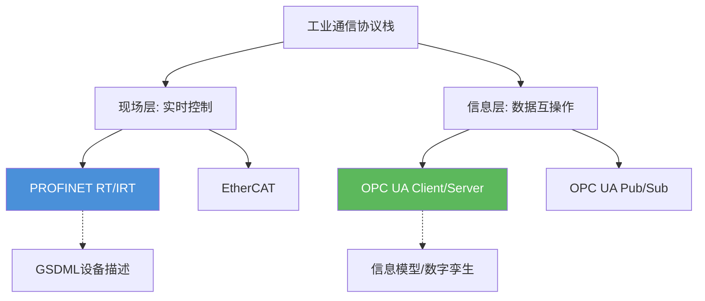

# B-C.10.4 PROFINET与OPC UA

> 所属章节：第五部 B. 总线协议 > B-C.10 工业以太网
>
> 难度：[E] Expert | 预计阅读时间：30分钟

## <span class="blue"> 本节导读

前面几节我们深入分析了EtherCAT的DC时钟机制和从站同步原理——它像一列准点的高速列车，每个站点精确停靠。但EtherCAT并非工业通信的唯一答案。

在实际的工厂车间里，你会面临这样的现实：**新采购的设备支持PROFINET，而老产线用的是EtherCAT；IT部门要求数据上传到MES系统，而OT工程师只懂PLC寄存器地址。** 这种IT/OT融合的需求催生了两类关键协议：一类是桥接不同实时以太网的工业现场协议（PROFINET），另一类是打通设备到云端的信息模型协议（OPC UA）。本节将深入剖析两者，帮你建立"协议选型的决策框架"。



---

## <span class="blue"> PROFINET：西门子主导的工业以太网 [E]

### PROFINET的起源与定位

PROFINET（Process Field Network）由PI（PROFIBUS & PROFINET International）组织开发，2003年发布，被纳入IEC 61158国际标准。与EtherCAT的"专用以太网"路线不同，PROFINET选择了一条更务实的路径：**基于标准IEEE 802.3以太网，通过优先级调度（IEEE 802.1Q VLAN Tag + QoS）实现实时性**。

这种设计哲学让PROFINET拥有天然的兼容性——你可以在同一根网线上混接PLC、HMI、摄像头、甚至办公打印机。付出的代价则是实时性的天花板：纯软件实现的RT（Real Time）模式只能到1~10ms，而EtherCAT轻松突破100μs。

### 三种通信等级的本质差异

PROFINET定义了三个明确的通信等级，本质上是用不同的技术手段在"通用性"与"实时性"之间做取舍：

| 等级 | 名称 | 周期 | 实现方式 | 适用场景 |
|:---:|:---|:---:|:---|:---|
| NRT | Non-Real Time | > 100ms | 标准TCP/IP协议栈 | 参数配置、诊断、Web服务 |
| RT | Real Time | 1~10ms | 绕过TCP/IP，直接以太网帧传输（EtherType = 0x8892）| 常规I/O控制、过程控制 |
| IRT | Isochronous RT | < 1ms（典型250μs）| **专用ASIC（ERTEC芯片）**，硬件时间切片 | 运动控制、凸轮同步 |

NRT很好理解——就是普通以太网。RT模式的关键在于绕过操作系统协议栈：发送端直接将数据封装为以太网帧，接收端用专用驱动从网卡DMA取数据，跳过TCP/IP处理流水线。这类似于我们在Socket编程里用`SOCK_RAW`绕过内核，但PROFINET RT在驱动层做了更深的优化。

IRT则是完全不同的故事。ERTEC（Enhanced Real Time Ethernet Controller）芯片在物理层实现了**时间切片（Time Slicing）**：将通信周期划分为"IRT窗口"和"开放窗口"，IRT窗口内只传输时间关键的同步数据，开放窗口才留给NRT流量。这需要网卡硬件精确知道周期的起始点，普通网卡根本无法做到。

### GSDML：设备的"自描述简历"

每个PROFINET设备都附带一个GSDML（General Station Description Markup Language）文件，本质是XML格式的设备描述文档。它定义了：

- 设备身份标识（Vendor ID、Device ID、Order Number）
- 支持的通信等级（RT/IRT能力声明）
- 过程数据接口（输入/输出数据块的长度与数据类型）
- 模块配置（可插拔I/O模块的排列组合）
- 参数默认值与允许范围

在TIA Portal（西门子工程工具）中导入GSDML后，系统会自动识别设备能力，用户只需拖拽配置即可——这种即插即用的体验是PROFINET在西门子生态圈中普及的重要原因。

```
+---------------+      GSDML文件      +---------------+
|  TIA Portal   | <================> |  PROFINET设备  |
|  工程工具      |   (XML描述文件)     |  (PLC/IO模块)  |
+---------------+                     +---------------+
        |                                    |
        | Step 1: 导入GSDML                   |
        | Step 2: 拖拽配置拓扑                 |
        | Step 3: 自动分配设备名/IP             |
        | Step 4: 下载配置+启动                 |
        v                                    v
   +---------+  PROFINET RT帧  +---------+
   |  S7-1500 | <============> |  ET200SP |
   |   PLC    |   周期1-10ms   |  IO从站   |
   +---------+                +---------+
```

### PROFINET vs EtherCAT：核心差异

| 对比维度 | PROFINET | EtherCAT | 分析与建议 |
|:---|:---|:---|:---|
| **标准归属** | IEC 61158 Type 10 | IEC 61158 Type 12 | 同为IEC标准，无本质差异 |
| **实时性** | RT: 1~10ms；IRT: <1ms | 典型100μs，最小12.5μs | EtherCAT高一个数量级，运动控制首选 |
| **拓扑灵活性** | 星型/树型/线型，支持标准交换机 | 线型/分支最佳，需EtherCAT专用交换机或从站集成 | PROFINET适合改造现有网络 |
| **标准设备混用** | ✅ 同一网络可接摄像头、PC | ❌ 纯EtherCAT网络，异构设备需网关 | PROFINET在IT/OT融合场景占优 |
| **主站成本** | 标准网卡 + 软件栈即可（RT） | 需EtherCAT主站卡或专用芯片 | PROFINET RT入门门槛更低 |
| **设备生态** | 西门子生态主导 | 倍福主导，Beckhoff自动化 | 看甲方用什么品牌 |
| **Linux支持** | 较薄弱，官方无开源主站 | EtherLab开源主站成熟 | Linux嵌入式首选EtherCAT |
| **IRT硬件要求** | **必须ERTEC芯片** | 无需专用ASIC（从站用ESC芯片） | 两者都需要专用芯片，只是位置不同 |

⚠️ **陷阱**：**PROFINET IRT需要专用硬件（ERTEC芯片）**——普通网卡（包括树莓派的板载网卡、Intel i219-V、Realtek RTL8111等）均不支持IRT。如果你打算用树莓派跑PROFINET IRT运动控制，这条路走不通。RT模式可以跑（需要适配的协议栈），但1~10ms的周期满足不了高速伺服需求。

💡 **提示**：**EtherCAT适合运动控制（1kHz+）→ PROFINET适合过程控制（10~100ms）**——选型时不要只看实时性数字，要看你的工艺需求。一条灌装产线的温度PID控制，50ms周期绰绰有余，PROFINET RT的灵活性和诊断能力反而更实用；但一条六轴机器人的关节插补，必须EtherCAT的125μs周期。

---

## <span class="blue"> OPC UA：工业互操作的信息模型 [E]

### 从OPC Classic到OPC UA的跨越

OPC Classic（DA/HDA/AE）诞生于1996年，基于微软DCOM技术——这注定了它只能运行在Windows平台。OPC UA（Unified Architecture，IEC 62541）彻底重写了架构，用**TCP/IP + 自定义二进制协议**替代DCOM，实现了真正的跨平台。现在你可以在ARM Linux网关上运行OPC UA服务器，让iPhone上的客户端直接读取PLC数据。

但OPC UA的核心价值不是跨平台，而是**信息模型（Information Model）**。

### 信息模型：给数据赋予语义

传统MODBUS通信中，你知道`0x0001`地址存的是一个16位整数——但这个数字代表什么？温度？压力？还是故障代码？单位是摄氏度还是华氏度？量程范围多少？这些信息全部丢失在"原始字节"层面。

OPC UA的信息模型解决了这个问题。它定义了一套**面向对象的地址空间**：

```
Objects Folder
└── ProductionLine_1
    └── TemperatureSensor_T1
        ├── Value          (Variable, Double, 125.5)
        ├── Unit           (Property, String, "°C")
        ├── RangeMin       (Property, Double, 0.0)
        ├── RangeMax       (Property, Double, 200.0)
        └── AlarmHigh      (Method, threshold=180.0)
```

每个节点不仅有值，还有类型定义、语义描述、访问权限和历史趋势。更重要的是，OPC UA标准定义了**配套规范（Companion Specifications）**——例如ISA-95（企业-控制系统集成）规范定义了设备、物料、人员等标准对象类型。这意味着：如果两家厂商的OPC UA服务器都实现了ISA-95，上位机软件可以直接理解对方的语义，无需人工映射。

### Pub/Sub机制：从轮询到发布

传统OPC UA使用Client/Server模式：客户端定时发起Read/Write请求——这本质上是轮询。Pub/Sub（发布/订阅，OPC UA Part 14）改变了游戏规则：

| 模式 | 通信方式 | 带宽效率 | 实时性 | 适用场景 |
|:---|:---|:---:|:---:|:---|
| Client/Server | 请求-响应轮询 | 低（每次需建立连接） | 取决于轮询间隔 | 配置、诊断、按需读取 |
| Pub/Sub (Broker) | 发布到MQTT Broker，订阅者接收 | 中 | 中 | 云边协同、多对多 |
| Pub/Sub (UDP) | 多播/广播直连 | **高** | **高（μs级）** | TSN网络下的实时控制 |

Pub/Sub over UDP在TSN（Time-Sensitive Networking）网络上可以实现微秒级同步，这使得OPC UA开始进入传统现场总线的领地。2020年后，OPC UA over TSN被公认为下一代工业通信的统一框架。

### 安全性：内建而非附加

OPC UA将安全性融入协议设计，而非像MODBUS TCP那样"后期打补丁"：

| 安全机制 | 实现方式 | 说明 |
|:---|:---|:---|
| 身份认证 | X.509证书 | 双向证书验证，替代用户名密码 |
| 通道加密 | AES-128/256、RSA-2048 | 防窃听 |
| 消息签名 | HMAC-SHA256 | 防篡改 |
| 会话管理 | SecureChannel + UserToken | 多层安全上下文 |
| 审计日志 | 内建审计事件 | 记录所有安全相关操作 |

> 💡 **提示**：在生产环境中部署OPC UA时，**务必启用证书验证**。跳过证书检查（accept_all）虽然调试方便，但等于把产线数据裸奔在网络上。很多工控安全事件并非高科技攻击，而是协议本身的安全特性被管理员手动关闭了。

### open62541：Linux上的OPC UA实现

open62541是用C99编写的开源OPC UA栈（LGPL v3），移植性极佳——已经在STM32、Raspberry Pi、x86 Linux上广泛验证。以下是一个完整的客户端示例：

```c
/* open62541_client.c
 * 编译: gcc -o ua_client open62541_client.c -lopen62541
 */
#include <open62541/client_config_default.h>
#include <open62541/client_highlevel.h>
#include <stdio.h>
#include <stdlib.h>

int main(int argc, char *argv[])
{
    UA_Client *client = UA_Client_new();
    UA_ClientConfig_setDefault(UA_Client_getConfig(client));

    /* Step 1: 连接到服务器 */
    UA_StatusCode retval = UA_Client_connect(client, "opc.tcp://192.168.1.100:4840");
    if (retval != UA_STATUSCODE_GOOD) {
        fprintf(stderr, "连接失败: %s\n", UA_StatusCode_name(retval));
        UA_Client_delete(client);
        return EXIT_FAILURE;
    }
    printf("[+] 已连接到OPC UA服务器\n");

    /* Step 2: 读取变量节点
     * NodeId格式: ns=命名空间索引;i=标识符
     * 示例读取ns=1, i=1001的Double类型变量（温度值）
     */
    UA_Variant value;
    UA_Variant_init(&value);
    retval = UA_Client_readValueAttribute(
                client,
                UA_NODEID_STRING(1, "TemperatureSensor_T1.Value"),
                &value);
    if (retval == UA_STATUSCODE_GOOD && UA_Variant_hasScalarType(&value, &UA_TYPES[UA_TYPES_DOUBLE])) {
        UA_Double temperature = *(UA_Double *)value.data;
        printf("[+] 温度读数: %.2f °C\n", temperature);
    } else {
        fprintf(stderr, "[-] 读值失败或类型不匹配: %s\n", UA_StatusCode_name(retval));
    }
    UA_Variant_clear(&value);

    /* Step 3: 断开连接 */
    UA_Client_disconnect(client);
    UA_Client_delete(client);
    printf("[+] 已断开连接\n");

    return EXIT_SUCCESS;
}
```

**在目标板上编译运行：**

```bash
# 交叉编译（以ARM为例）
arm-linux-gnueabihf-gcc -o ua_client open62541_client.c \
    -I/path/to/open62541/include -L/path/to/open62541/lib \
    -lopen62541 -lpthread -Wl,-rpath,/usr/local/lib

# 部署到目标板运行
scp ua_client root@192.168.1.50:/tmp/
ssh root@192.168.1.50 '/tmp/ua_client'
# 输出:
# [+] 已连接到OPC UA服务器
# [+] 温度读数: 125.50 °C
# [+] 已断开连接
```

> 💡 **提示**：open62541同时提供服务器API。如果你的嵌入式Linux网关需要采集MODBUS数据并暴露为OPC UA接口，可以用libmodbus读数据 + open62541创建节点，两行代码创建一个UA_Variable节点，把传感器数据映射进去。这是工业物联网关的经典实现模式。

---

## <span class="blue"> OPC UA协议架构分层

| 层级 | 功能 | 协议/机制 | 说明 |
|:---:|:---|:---|:---|
| **应用层** | 信息模型、方法调用、事件通知 | Companion Specs (ISA-95, PackML) | 语义层，不同行业的标准化对象定义 |
| **服务层** | Read/Write/Browse/Call/Publish等 | OPC UA服务集 | 抽象的UA服务接口，与传输无关 |
| **传输层** | 数据序列化与连接管理 | UA Binary / UA JSON / UA XML | 推荐UA Binary（效率高），Web场景用JSON |
| **安全通道层** | 加密/签名/证书验证 | X.509 + AES/RSA | 可配置的安全策略，从无安全到最高级 |
| **传输层** | TCP/IP或MQTT/UDP | opc.tcp / mqtt / udp | Client/Server用TCP；Pub/Sub用MQTT或UDP多播 |

---

## <span class="blue"> 工业协议选型决策表

| 协议 | 实时性 | 推荐拓扑 | 适用场景 | Linux支持 | 推荐度 |
|:---|:---:|:---|:---|:---:|:---:|
| **EtherCAT** | < 100μs | 线型/分支 | 运动控制、CNC、机器人关节 | ⭐⭐⭐ 开源主站成熟 | ★★★★★（运动控制） |
| **PROFINET RT** | 1~10ms | 星型/树型 | 过程控制、西门子产线集成 | ⭐⭐ 商业方案为主 | ★★★★☆（西门子生态） |
| **PROFINET IRT** | 250μs | 星型+IRT交换机 | 高速凸轮同步、飞剪 | ⭐ 无开源方案 | ★★☆☆☆（Linux不友好） |
| **OPC UA C/S** | > 100ms | 任意以太网 | MES集成、云端上传、跨平台互操作 | ⭐⭐⭐⭐ open62541优秀 | ★★★★★（信息层首选） |
| **OPC UA Pub/Sub** | μs级(TSN) | TSN网络 | 下一代统一架构，替代现场总线 | ⭐⭐⭐ 需要TSN硬件 | ★★★☆☆（未来方向） |
| **EtherNet/IP** | 1~10ms | 星型/线型 | 罗克韦尔/OMRON生态 | ⭐⭐ OpENer可用 | ★★★☆☆（北美市场） |
| **TSN (802.1AS)** | < 1ms | 任意 | 工业以太网的"统一底层" | ⭐⭐⭐ Linux TSN协议栈发展中 | ★★★★☆（基础设施） |

---

## <span class="blue"> 本节总结

| 关键要点 | 详细说明 |
|:---|:---|
| PROFINET的双层实时 | RT（软件实现，1~10ms）满足多数过程控制；IRT（ERTEC硬件，<1ms）进入运动控制领域 |
| GSDML的自描述能力 | XML设备描述实现即插即用，是PROFINET生态工程效率的核心 |
| PROFINET vs EtherCAT | PROFINET赢在灵活性（标准以太网混用）和诊断能力；EtherCAT赢在实时性和Linux开源支持 |
| OPC UA的信息模型 | 给数据赋予语义（类型/单位/量程/方法），Companion Specs实现跨厂商互操作 |
| Pub/Sub革命 | 从轮询到发布订阅，over UDP + TSN可达到μs级，是现场总线的未来统一方向 |
| 安全内建设计 | X.509证书 + AES加密 + HMAC签名，替代传统工控协议的"明文裸奔" |
| open62541实践 | C99实现的LGPL开源栈，ARM Linux网关部署OPC UA服务器的首选方案 |
| 选型核心逻辑 | 运动控制→EtherCAT；西门子生态→PROFINET；IT/OT融合→OPC UA；未来统一→OPC UA over TSN |

---

## <span class="blue"> 下一步

B-C.10节关于工业以太网的内容至此告一段落——我们从EtherCAT的帧结构、DC时钟、从站同步，走到PROFINET的RT/IRT分级、GSDML配置，再到OPC UA的信息模型与Pub/Sub。你已具备在真实项目中做协议选型的能力。

接下来我们将进入 **B-C.11.1 PCIe基础与物理层** ——从工业现场总线转向计算机系统内部的高速总线。理解PCIe的TLP（Transaction Layer Packet）、枚举流程和BAR空间配置，是后续理解网卡、GPU、NVMe等高速设备驱动的基础。如果说CAN/EtherNET是设备的"外部神经网络"，那PCIe就是"内部骨架"。

---

## <span class="blue"> 配套资源

**参考文档：**
- PI组织官网: https://www.profibus.com （PROFINET技术规范、GSDML规范下载）
- OPC Foundation: https://opcfoundation.org （OPC UA标准、Companion Specifications）
- open62541文档: https://open62541.org/doc/current/ （API参考、Pub/Sub教程）
- IEC 61158: 工业以太网协议国际标准
- IEC 62541: OPC UA国际标准

**推荐书籍：**
- 《OPC UA: Unified Architecture》— Wolfgang Mahnke 等著（OPC UA标准作者写的权威参考书）
- 《Industrial Communication Technology Handbook》— Richard Zurawski（工业通信百科全书式手册）

**开源项目：**
- open62541: https://github.com/open62541/open62541 （⭐ 6k+，最活跃的C语言OPC UA实现）
- p-net: https://github.com/rtlabs-com/p-net （开源PROFINET设备栈，RT级别，LGPL）

**调试工具：**
- `UAExpert` — Free的OPC UA客户端GUI工具（Unified Automation出品），支持浏览地址空间、读写变量、调用方法
- Wireshark内置PROFINET和OPC UA协议解析器（过滤器：`pn_io` 或 `opcua`）
- 工业抓包要点：交换机需配置端口镜像（Port Mirroring），普通交换机无法抓取PROFINET RT帧
