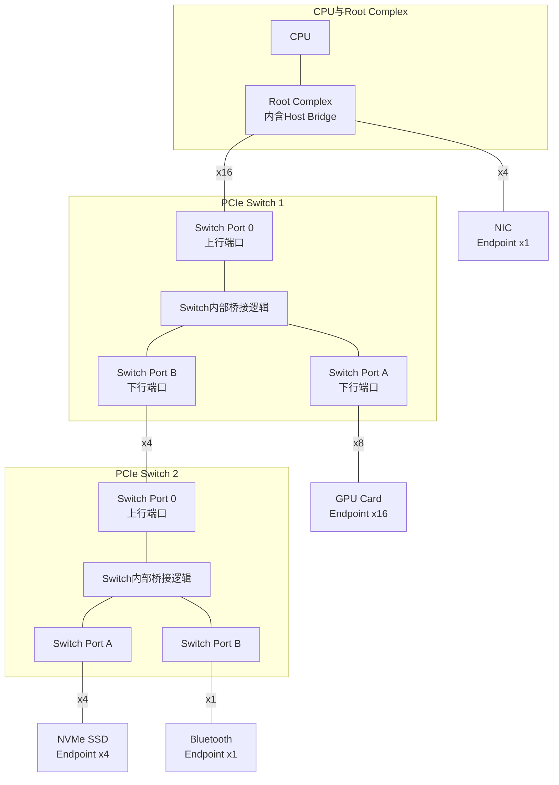

# B-C.11.1 PCIe基础与物理层

> 所属章节：第五部 B. 总线协议 > B-C.11 PCI Express总线
>
> 难度：Expert | 预计阅读时间：25分钟

## <span class="blue">本节导读

PCI Express（PCIe）彻底改变了计算机内部互连的方式。如果说PCI时代的主板像一条繁忙的单行道，所有设备挤在一起抢带宽，那么PCIe就像为每个设备修建了专属的高速公路——点对点、全双工、串行传输。本节从物理层出发，带你理解Lane的构成、各代速率的演进、链路训练的完整流程，以及Root Complex如何织就整张PCIe拓扑网络。理解这些底层机制，是后续掌握枚举、配置空间和驱动开发的基础。

<br>

## <span class="blue">PCIe架构：从并行到串行的革命 [E]

PCIe与它的前辈PCI最本质的区别在于：**PCI是并行共享总线，PCIe是串行点对点链路**。

想象一下老式的PCI总线——32根地址/数据线像一条宽阔的公共马路，所有设备挂在上面，同一时刻只能有一对设备进行通信。这种设计在当时够用了，但随着频率提升，并行信号间的串扰和时钟偏移成了噩梦，总线频率被牢牢限制在33MHz或66MHz。

PCIe的解决思路非常激进：**抛弃共享总线，每条链路专属于一对设备**。需要更多带宽？不是加宽总线，而是增加Lane数量。

### 什么是Lane？

一条**Lane**由两对差分信号组成：

```
    设备A                              设备B
  ┌─────────┐                      ┌─────────┐
  │  TX+ ───┼──────────────────────┼───► RX+ │
  │  TX- ───┼──────────────────────┼───► RX- │
  │  RX+ ◄──┼──────────────────────┼───  TX+ │
  │  RX- ◄──┼──────────────────────┼───  TX- │
  └─────────┘                      └─────────┘
        ◄──── 一条 Lane（全双工）────►
```

每对差分信号以100Ω阻抗端接，支持同时收发（全双工）。多个Lane捆绑在一起形成更宽的链路：

| 链路宽度 | Lane数量 | 方向 | 典型应用场景 |
|:------:|:------:|:---:|:----------|
| x1 | 1条Lane | 全双工 | 网卡、声卡、低速扩展卡 |
| x4 | 4条Lane | 全双工 | NVMe SSD、万兆网卡 |
| x8 | 8条Lane | 全双工 | RAID控制器、高端网卡 |
| x16 | 16条Lane | 全双工 | 显卡、GPU加速卡、FPGA |

> 💡 **提示**：Lane数量在硬件上是物理连线决定的。一块x16的显卡插入x4插槽，只会使用其中的4条Lane，带宽相应降为1/4。反过来，x1设备插入x16插槽则完全没问题，多余的Lane悬空不用。

### 编码方式与有效带宽

PCIe不同时代采用不同的线路编码，直接影响有效带宽：

| 世代 | 线路速率 | 编码方式 | 编码开销 | 推出年份 | 每Lane有效带宽 | x16总带宽 |
|:---:|:------:|:------:|:------:|:------:|:-----------:|:--------:|
| Gen 1 | 2.5 GT/s | 8b/10b | 20% | 2003 | ~250 MB/s | ~4 GB/s |
| Gen 2 | 5.0 GT/s | 8b/10b | 20% | 2007 | ~500 MB/s | ~8 GB/s |
| Gen 3 | 8.0 GT/s | 128b/130b | 1.5% | 2010 | ~1 GB/s | ~16 GB/s |
| Gen 4 | 16.0 GT/s | 128b/130b | 1.5% | 2017 | ~2 GB/s | ~32 GB/s |
| Gen 5 | 32.0 GT/s | 128b/130b | 1.5% | 2019 | ~4 GB/s | ~64 GB/s |

> 注：GT/s = GigaTransfers per second。8b/10b编码每10bit传输8bit有效数据；128b/130b编码每130bit传输128bit有效数据，开销大幅降低。

8b/10b编码除了20%的开销外，还保证了DC平衡和足够的位跳变供接收端时钟恢复——这是PCIe Gen1/2时代的功臣。到了Gen3，速率太高，8b/10b的20%开销变得不可接受，于是换上了更高效的128b/130b编码，同时依靠更先进的时钟恢复电路来保证信号完整性。

### 差分信号与阻抗匹配

PCIe物理层的核心是一组高速差分对：

| 信号名 | 方向 | 阻抗 | 说明 |
|:-----:|:---:|:---:|:-----|
| TX+ / TX- | 发送端输出 | 100Ω差分 | 从设备A的发送器到设备B的接收器 |
| RX+ / RX- | 接收端输入 | 100Ω差分 | 从设备B的发送器到设备A的接收器 |
| REFCLK+ / REFCLK- | 参考时钟输入 | 100Ω差分 | 通常100MHz，可选嵌入式时钟（SRNS） |
| PERST# | 复位输入 | — | 全局复位信号，低有效 |
| WAKE# | 唤醒输出 | — | 用于从低功耗状态唤醒链路 |
| PRSNT1#/PRSNT2# | 存在检测 | — | 热插拔卡存在检测引脚 |

差分信号的好处在于对外部噪声有很强的抑制能力——噪声同时耦合到两根线上，在接收端相减时被抵消。100Ω差分阻抗需要PCB走线精确控制线宽和线间距，任何阻抗不连续（过孔、直角走线、连接器）都会引起信号反射，导致眼图闭合。

> ⚠️ **陷阱**：实际插槽标注的x16不一定等于16条有效Lane。主板厂商常在物理x16插槽上只连接x4或x8的Lane（成本控制或芯片组Lane数限制）。一块PCIe Gen4 x16的显卡如果插在只连了x4 Lane的插槽上，带宽会从~64GB/s暴跌到~8GB/s，性能大打折扣。

<br>

## <span class="blue">PCIe拓扑结构：树形网络 [E]

PCIe采用树形拓扑，所有设备通过一个根节点连接到系统：



### 拓扑组件

| 组件 | 功能描述 | 典型实例 |
|:---:|:------|:------|
| **Root Complex（RC）** | PCIe树的根节点，连接CPU/Memory到PCIe域，发起所有配置请求 | Intel PCH、AMD IO Hub、ARM SoC集成RC |
| **Switch** | 扩展PCIe端口，类似USB Hub，将一个上行端口扩展为多个下行端口 | Broadcom PEX系列、ASMedia ASM系列 |
| **Endpoint（EP）** | 树的最末端，真正的功能设备，只能响应请求不能发起路由 | 显卡、网卡、NVMe SSD、声卡 |
| **Bridge** | 协议转换桥梁，连接PCIe与其他总线（如PCI、PCI-X或Legacy） | PCIe-to-PCI桥 |

Root Complex是整个PCIe域的主宰。CPU通过RC访问PCIe设备，所有DMA操作也由RC协调完成。一台主板上通常有多个RC（多路服务器可能有数十个），每个RC管理一棵独立的PCIe树。

Switch在内部看起来像一个PCIe设备，包含一个上游桥和多个下游桥。数据包进入Switch后，根据目标地址或路由ID被转发到对应的下游端口。好的Switch支持**非阻塞交换**——多个端口可以同时全速传输。

### 热插拔（Hot Plug）

PCIe从设计之初就支持热插拔——可以在系统运行时插入或移除设备。这依赖于一组硬件和软件机制：

- **PRSNT1#/PRSNT2#引脚**：物理卡存在检测，卡插入时这两个引脚与地形成不同连接状态
- ** attention按钮（可选）**：按下后产生中断通知系统准备移除
- **MRL（Manually Retained Latch）传感器**：检测卡是否被机械锁定
- **软件状态机**：操作系统通过PCIe热插拔控制器（HP Controller）管理电源状态和数据链路

Linux下热插拔由ACPI和pciehp驱动协同处理。插入一张卡后，固件检测到PRSNT信号变化，通知内核重新扫描该总线段，发现新设备后加载对应驱动。

<br>

## <span class="blue">链路训练：从静默到通信 [E]

PCIe链路在能传输数据之前，必须经过一套严格的"握手"流程——链路训练（Link Training）。这个过程由物理层的LTSSM（Link Training and Status State Machine）自动完成，无需软件介入。

```
Detect ──► Polling ──► Configuration ──► L0
  ▲          │              │             │
  │          ▼              ▼             ▼
  │      Recovery ◄──────  L0s  ◄──────  Active
  │          ▲           (低功耗)      (正常传输)
  │          │
  └──────────┘

  链路训练阶段          正常操作阶段
```

| 状态 | 说明 |
|:---:|:-----|
| **Detect** | 检测对端是否存在。发送端改变TX的输出阻抗，通过检测反射判断是否有接收器连接。如果没检测到，就在此状态循环等待。 |
| **Polling** | 双方都检测到对方后，开始发送Training Sequence（TS1/TS2有序集）。这个阶段完成位锁定（Bit Lock）和符号锁定（Symbol Lock），并协商链路速率。 |
| **Configuration** | 协商Lane数量和Lane极性翻转（如果PCB布线时正负极接反了可以自动纠正）。完成后进入L0。 |
| **L0** | 链路完全激活，可以传输TLP（Transaction Layer Packet）和DLLP（Data Link Layer Packet）。这是正常工作状态。 |
| **L0s/L1/L2** | 各种低功耗状态。L0s恢复最快但省电最少；L2最深但恢复需要毫秒级时间。 |
| **Recovery** | 链路出现错误需要从L0重新训练时进入此状态。 |

整个过程通常在几毫秒内完成。上电时你能看到NVMe SSD或网卡的LED在系统启动后短暂闪烁——那往往就是链路训练完成的信号。

<br>

## <span class="blue">MSI与MSI-X中断机制 [E]

PCI时代使用INTA#-INTD#物理引脚传递中断，所有设备共享4条中断线，容易冲突且需要中断路由表。PCIe彻底改为**消息 signaled 中断（MSI）**：

- **MSI**：设备通过向一个特定的内存地址写入数据来触发中断。最多支持32个中断向量，但通常受限于系统只提供1-2个。
- **MSI-X**：MSI的扩展版本，支持多达2048个中断向量，每个向量独立配置目标和数据值。现代设备（NVMe、高端网卡）基本都使用MSI-X。

MSI/MSI-X的优势是显而易见的：没有物理中断引脚、每个中断独立可屏蔽、天然支持多队列（网卡可以将每个RX队列绑定到独立的中断向量，实现NUMA友好的中断分发）。

在Linux中，`lspci -v`可以看到设备支持的中断类型：

```bash
# 查看设备中断能力
$ lspci -s 03:00.0 -v
...
Capabilities: [50] MSI: Enable+ Count=1/32 Maskable+ 64bit+
Capabilities: [b0] MSI-X: Enable- Count=64 Maskable-
...
```

<br>

## <span class="blue">PCIe与PCI的软件兼容性 [E]

这是PCIe设计中最精妙的决策之一：**软件完全兼容，硬件完全不同**。

从设备驱动的角度看，PCIe设备仍然是挂在一个枚举树上，有BDF（Bus:Device:Function）地址，有配置空间（256字节或4KB），有BAR（Base Address Register）。一个2003年写的PCI网卡驱动，不加修改就能驱动一块2023年的PCIe网卡。

但硬件层面二者毫无共同之处：

| 对比项 | PCI | PCIe |
|:---:|:---:|:---:|
| 拓扑 | 共享并行总线 | 串行点对点链路 |
| 引脚数 | 120+（PCI-X更多） | x1仅需4条信号 |
| 时钟 | 33/66MHz公共时钟 | 嵌入式时钟/REFCLK |
| 仲裁 | 集中式总线仲裁 | 无需仲裁，独占链路 |
| 数据传输 | 地址+数据周期 | 数据包（TLP）交换 |
| 中断 | 4条物理中断线 | MSI/MSI-X消息中断 |
| DMA | 通过总线控制器 | 基于请求/完成数据包 |

这种兼容性是通过**事务层**的抽象实现的。PCIe在顶层保留了PCI的配置空间模型和编程接口，但底层将所有操作封装成数据包（TLP）在串行链路上传输。枚举、BAR分配、中断配置这些概念一脉相承，让操作系统和驱动开发者平滑过渡。

> 💡 **提示**：Linux下的`lspci -vv | grep LnkCap`可以查看插槽支持的最大速率和Lane数；`LnkSta`则显示当前实际协商的速率和宽度。如果发现二者不一致（比如LnkCap显示x16但LnkSta只显示x4），说明插槽或设备存在物理限制。

```bash
# 查看PCIe链路能力与实际状态
$ lspci -vv -s 01:00.0 | grep -E "LnkCap|LnkSta"
        LnkCap: Port #0, Speed 16GT/s, Width x16
        LnkSta: Speed 16GT/s, Width x16  ← 完美匹配

# 如果发现带宽不对
$ lspci -vv -s 02:00.0 | grep -E "LnkCap|LnkSta"
        LnkCap: Port #0, Speed 16GT/s, Width x16
        LnkSta: Speed 8GT/s, Width x4   ← 只协商到Gen3 x4！
```

<br>

## <span class="blue">本节总结

| 主题 | 核心要点 |
|:---:|:------|
| **Lane架构** | 每Lane = 2对差分信号（TX±, RX±），全双工，100Ω阻抗。x1/x4/x8/x16按需求组合 |
| **速率演进** | Gen1 2.5GT/s → Gen5 32GT/s，编码从8b/10b(20%开销)进步到128b/130b(1.5%开销) |
| **拓扑结构** | Root Complex → Switch → Endpoint 的树形结构，软件兼容PCI枚举模型 |
| **链路训练** | Detect→Polling→Configuration→L0的LTSSM状态机，硬件自动完成 |
| **中断机制** | MSI/MSI-X替代物理中断线，MSI-X支持2048个独立向量 |
| **兼容性** | 软件层完全兼容PCI（配置空间/BAR/BDF），硬件层完全不同（串行/点对点/包交换） |

<br>

## <span class="blue">下一步

下一节 **B-C.11.2 PCIe枚举与配置空间** 将深入PCIe的软件层面——系统如何枚举总线、分配BDF地址、解析256字节/4KB配置空间、配置BAR内存映射。这些知识是编写PCIe设备驱动的基础，也是调试"设备认不到"、"BAR映射失败"等问题的关键。

<br>

## <span class="blue">配套资源

- **PCIE M.2规范**：PCI-SIG官方文档（pcisig.com），获取各代电气规范
- **内核文档**：`Documentation/PCI/`（较老内核）或内核源码中的PCI子系统说明
- **调试工具**：`lspci`（pciutils包）、`setpci`、`pciutils`库
- **推荐实践**：找一台Linux PC，运行`lspci -tv`查看拓扑树，再用`lspci -vv`逐条分析链路能力和状态
