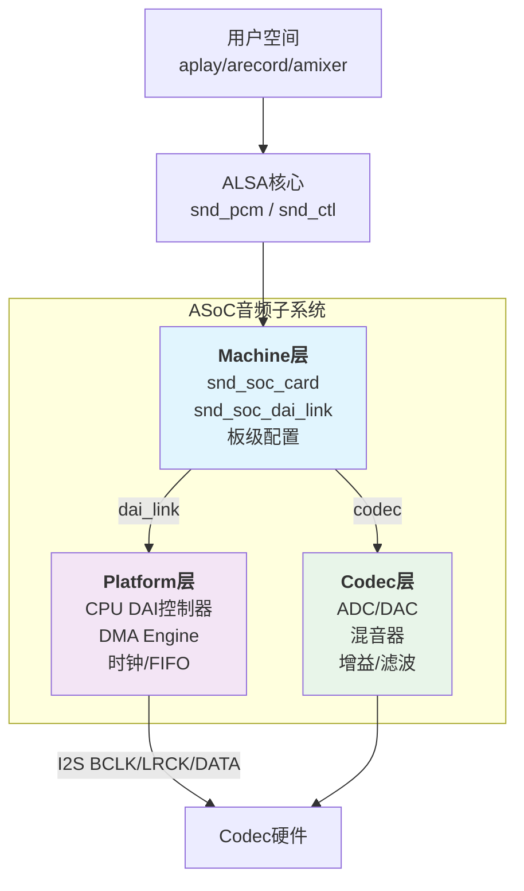

# B-C.12.2 I2S Linux驱动与ALSA

> 所属章节：第五部 B. 总线协议 > B-C.12 I2S音频总线
>
> 难度：[I] Intermediate | 预计阅读时间：30分钟

## <span class="blue"> 本节导读

上一节我们把I2S的硬件时序摸透了——BCLK、LRCK、DATA三线配合，采样位深、通道数都搞清楚了。但硬件通了只是第一步，Linux里怎么把I2S用起来？怎么播一段wav、录一段音？怎么让Codec芯片和CPU的DAI控制器配合工作？这就是ALSA子系统的地盘了。

本节聚焦两个核心问题：

1. ALSA的ASoC架构怎么把Codec、Platform、Machine三层串起来
2. 设备树怎么配，用户空间怎么验证

读完你会明白为什么ALSA不是"一个驱动"而是一套"音频基础设施"，也会掌握从设备树到aplay播放的完整链路。本节的技术栈截至Linux 6.x / ALSA 1.2.x。

---

## <span class="blue"> ALSA与ASoC架构 [I]

ALSA（Advanced Linux Sound Architecture）是Linux内核的音频子系统。但嵌入式SoC场景下，音频硬件通常是"CPU DAI控制器 + 外部Codec芯片"的组合，直接用传统ALSA驱动会显得笨重。于是内核社区搞出了**ASoC（ALSA System on Chip）**——一套专门针对嵌入式音频的框架。

### ASoC的三层架构

ASoC把音频驱动拆成三个独立组件，再用Machine层把它们粘合：

| 组件 | 核心结构体 | 职责 | 示例芯片/IP |
|------|-----------|------|------------|
| **Codec** | `snd_soc_codec` / `snd_soc_component` | 音频编解码：ADC/DAC、增益控制、混音、数字滤波 | WM8960、ES8388、INMP441 |
| **Platform** | `snd_soc_platform` / `snd_soc_component` | CPU侧的DAI控制器驱动：DMA传输、时钟配置、FIFO管理 | Rockchip I2S、Samsung I2S |
| **Machine** | `snd_soc_card` / `snd_soc_dai_link` | 板级连接：把Codec和Platform的DAI对接，配置时钟主从关系 | 设备树`sound`节点 |

<br>

用Mermaid图看架构更清晰：



<br>

**Codec层**负责模拟世界和数字世界的转换。比如ES8388这颗常见Codec，内部有ADC把麦克风模拟信号转成数字I2S流，也有DAC把数字I2S流转成模拟信号推耳机。Codec驱动要暴露所有控制接口——音量、 mute、通路选择、采样率限制等。

**Platform层**是SoC厂商写的，驱动CPU内部的I2S控制器。它管DMA传输（音频数据量大，不能用CPU轮询）、管时钟分频（从MCLK分出BCLK和LRCK）、管FIFO水位。你通常不用改这层，SoC厂商BSP里已经写好了。

**Machine层**是你需要关心的。它用`snd_soc_dai_link`结构体告诉内核："我的板子上，CPU的I2S0接口（Platform）连着ES8388的I2S接口（Codec），用I2S格式、主模式、48kHz采样率"。这个描述在现代内核里主要通过**设备树**完成。

### DAPM：自动功耗管理

嵌入式设备省电是刚需。DAPM（Dynamic Audio Power Management）是ASoC里的一套自动功耗管理机制——**你不需要手动开关Codec的电源，DAPM根据音频通路的使用情况自动决定哪些模块该上电、哪些该断电**。

| 组件 | 类型 | 功能 | 连接关系 |
|------|------|------|----------|
| **Widget** | 输入/输出/混音器/ADC/DAC/电源 | 音频通路上的功能节点 | 通过`paths`互相连接形成通路 |
| **Path** | 有向连接 | 描述Widget之间的音频流向 | 由`snd_soc_dapm_path`表示 |
| **Route** | 静态路由声明 | 定义Widget之间的连接关系 | 在驱动或设备树中用字符串对声明 |
| **Control** | kcontrol | 用户空间可控制的开关/音量/枚举 | amixer可以读写，影响通路状态 |
| **Supply** | 电源Widget | 代表Codec内部的电源域 | 依赖的通路上电时自动使能 |

<br>

DAPM的核心逻辑是**"反向电源开关"**：当用户要播放音频时，ALSA会沿着"DAC → 混音器 → 输出"这条通路反向检查，把所有相关的Widget标记为"需要上电"；播放停止后，这些Widget又自动下电。整个过程对用户透明。

```
播放请求 → DAPM检查通路 → 标记Widget为ON → Codec驱动上电对应模块
停止播放 → DAPM检查通路 → 标记Widget为OFF → Codec驱动下电对应模块
```

在驱动代码里，你通过`snd_soc_dapm_route`数组声明路由：

```c
// 示例：Codec输出的DAPM路由声明
static const struct snd_soc_dapm_route es8388_dapm_routes[] = {
    // 播放通路
    {"Left Mixer", NULL, "Left DAC"},      // 左DAC输出到左混音器
    {"Right Mixer", NULL, "Right DAC"},    // 右DAC输出到右混音器
    {"LOUT1", NULL, "Left Mixer"},         // 左混音器到左LineOut
    {"ROUT1", NULL, "Right Mixer"},        // 右混音器到右LineOut
    // 录音通路
    {"Left ADC", NULL, "Left PGA"},        // 左输入增益到左ADC
    {"Right ADC", NULL, "Right PGA"},      // 右输入增益到右ADC
};
```

每条路由都是一个三元组：`{目的Widget, 控制信号, 源Widget}`。NULL表示没有额外的控制开关——信号直连。如果中间有可控开关，第三个字段就是kcontrol的名字。

> 💡 **提示**：调试DAPM时，`/sys/kernel/debug/asoc/`目录下有完整的DAPM图。挂载debugfs后看这个目录，能看到当前所有Widget的状态（On/Off）和连接关系，排查"为什么没声音"时非常有用。

---

## <span class="blue"> ALSA用户空间工具与设备树配置 [I]

### 常用ALSA工具一览

ALSA提供了一套完整的用户空间工具，覆盖了从设备枚举到播放录音、混音控制的全链路：

| 工具 | 功能 | 常用命令 | 说明 |
|------|------|----------|------|
| `aplay` | PCM播放 | `aplay -l`（列出设备）、`aplay test.wav` | 支持wav、raw格式，-D指定设备 |
| `arecord` | PCM录音 | `arecord -d 10 -f cd test.wav` | -d时长秒，-f cd = 16bit 44100 stereo |
| `amixer` | 混音器控制（命令行） | `amixer contents`（列出所有控件）、`amixer cset numid=1 80%` | 脚本友好，适合自动化 |
| `alsamixer` | 混音器控制（TUI） | 直接运行，方向键操作 | ncurses界面，直观但无法脚本化 |
| `alsactl` | 配置存取 | `alsactl store`（保存）、`alsactl restore`（恢复） | 掉电保存音量等设置 |
| `speaker-test` | 扬声器测试 | `speaker-test -t sine -f 1000 -c 2` | 生成测试音，排查硬件通路 |

<br>

### 设备树sound节点配置

设备树是连接ASoC三层的粘合剂。一个完整的`sound`节点要声明DAI Link、指向Codec和CPU DAI，以及板级特定的时钟和格式配置。

以下是一个**完整的设备树sound节点示例**——基于RK3568 + INMP441（麦克风）+ MAX98357A（功放）的配置：

```dts
// ===== arch/arm64/boot/dts/rockchip/rk3568-myboard.dts =====

/ {
    // 根节点下的sound节点——ASoC Machine层入口
    sound {
        compatible = "simple-audio-card";           // 使用通用Machine驱动
        simple-audio-card,name = "rk3568-audio";    // 声卡名称，aplay -l会显示

        // ---- 时钟主从配置 ----
        // "continues" = CPU端提供连续时钟（CPU主模式）
        simple-audio-card,mclk-fs = <256>;           // MCLK = 256 * 采样率
        simple-audio-card,format = "i2s";            // DAI格式：I2S标准时序

        // ---- 时钟引脚配置（pinctrl） ----
        pinctrl-0 = <&i2s0_mclk>;                    // MCLK输出引脚
        pinctrl-names = "default";

        // ===== DAI Link 0：INMP441 MEMS麦克风（录音） =====
        simple-audio-card,dai-link@0 {
            format = "i2s";                          // I2S格式
            bitclock-master = <&cpu_dai0>;            // CPU输出BCLK（主模式）
            frame-master = <&cpu_dai0>;               // CPU输出LRCK（主模式）
            mclk-fs = <256>;                          // MCLK = 256 * fs

            cpu_dai0: cpu {
                sound-dai = <&i2s0_8ch>;             // 指向CPU的I2S0控制器
                dai-tdm-slot-num = <2>;               // 2个slot（左右声道）
                dai-tdm-slot-width = <24>;            // 每个slot 24bit（INMP441是24bit）
            };

            codec_dai0: codec {
                sound-dai = <&inmp441>;              // 指向INMP441 Codec节点
            };
        };

        // ===== DAI Link 1：MAX98357A D类功放（播放） =====
        simple-audio-card,dai-link@1 {
            format = "i2s";
            bitclock-master = <&cpu_dai1>;
            frame-master = <&cpu_dai1>;
            mclk-fs = <256>;

            cpu_dai1: cpu {
                sound-dai = <&i2s1_8ch>;             // 指向CPU的I2S1控制器
                dai-tdm-slot-num = <2>;
                dai-tdm-slot-width = <16>;            // MAX98357A支持16bit
            };

            codec_dai1: codec {
                sound-dai = <&max98357a>;            // 指向MAX98357A节点
            };
        };
    };
};

// ===== I2C总线上的Codec设备 =====
&i2c1 {
    status = "okay";

    // INMP441：MEMS麦克风，I2S数字输出，24bit
    // 注意：INMP441没有I2C控制接口，纯I2S数据输出
    // 它不需要I2C节点，但需要GPIO控制SD引脚（模式选择）
    inmp441: inmp441@0 {
        compatible = "invensense,inmp441";
        // INMP441的SD引脚连到GPIO，低电平=正常工作
        sd-gpios = <&gpio3 RK_PA2 GPIO_ACTIVE_LOW>;
    };

    // MAX98357A：D类功放，I2S输入，I2C控制增益
    max98357a: max98357a@2c {
        compatible = "maxim,max98357a";
        reg = <0x2c>;
        // 不需要额外控制时可以不接SD_MODE引脚
        // 接上的话可以通过GPIO控制关断
        sdmode-gpios = <&gpio3 RK_PA3 GPIO_ACTIVE_HIGH>;
    };
};

// ===== I2S控制器配置 =====
&i2s0_8ch {                                         // I2S0 → 接INMP441（录音）
    status = "okay";
    // pinctrl: SCLK（BCLK）、LRCK_RX（LRCK）、SDI0（数据输入）
    pinctrl-0 = <&i2s0_sclk &i2s0_lrck_rx &i2s0_sdi0>;
    pinctrl-names = "default";
};

&i2s1_8ch {                                         // I2S1 → 接MAX98357A（播放）
    status = "okay";
    // pinctrl: SCLK、LRCK_TX、SDO0（数据输出）
    pinctrl-0 = <&i2s1_sclk &i2s1_lrck_tx &i2s1_sdo0>;
    pinctrl-names = "default";
};
```

<br>

这个设备树有几个关键点：

- `simple-audio-card`是一个通用Machine驱动，适合大多数不需要复杂板级逻辑的场景。如果你需要特殊的时钟处理或上电时序，可能要自己写Machine驱动。
- `dai-tdm-slot-width = <24>`必须和Codec的实际位深匹配。INMP441输出24bit数据，这里配成24；如果配成16，会截断数据导致动态范围下降。
- INMP441没有标准的ALSA Codec驱动（它没有I2C/SPI控制接口），实际项目中你可能需要写一个极简单的`dummy-codec`驱动，或者用`snd-soc-dummy`占位。
- `mclk-fs = <256>`表示MCLK = 256 × 采样率。比如48kHz采样时MCLK = 12.288MHz。这个值需要Codec datasheet确认支持范围。

> ⚠️ **陷阱**：DAI Link的format不匹配是最常见的"没声音"原因。比如Codec支持I2S格式，但CPU端设备树配成了`format = "dsp_a"`，两边时序对不上——LRCK极性、数据偏移都不一致，导致Codec解析不出数据。遇到这种情况先看Codec datasheet的Audio Interface Timing章节，确认支持的格式，再核对设备树。

---

## <span class="blue"> 行业实例：MEMS麦克风 + D类功放 + 回声消除

这个实例来自一个带语音交互功能的智能家居中控面板：需要收音（唤醒词识别）、播音（语音反馈），还要消除自身播放声音对麦克风的干扰（回声消除）。

### 硬件连接图

```
┌──────────────────────────────────────────────────────────────┐
│                      RK3568 SoC                               │
│  ┌──────────────┐           ┌──────────────┐                  │
│  │   I2S0       │           │   I2S1       │                  │
│  │  8ch Master  │           │  8ch Master  │                  │
│  │              │           │              │                  │
│  │ BCLK ────────┼───────────┼── BCLK ──────┼───┐              │
│  │ LRCK ────────┼───────────┼── LRCK ──────┼───┤              │
│  │ SDI0 ◄───────┼────┐      │   SDO0 ──────┼───┼──┐           │
│  │              │    │      │              │   │  │           │
│  └──────────────┘    │      └──────────────┘   │  │           │
│                      │                           │  │           │
└──────────────────────┼───────────────────────────┼──┼───────────┘
                       │                           │  │
                   ┌───┴───┐                   ┌──┴──┴──┐
                   │ INMP441│                  │MAX98357A│
                   │ MEMS   │                  │ D类功放 │
                   │麦克风  │                  │         │
                   │        │                  │ SD_MODE │
                   └────────┘                  └────┬────┘
                                                    │
                                              ┌─────┴─────┐
                                              │  4Ω 3W    │
                                              │ 扬声器     │
                                              └───────────┘
```

INMP441是TDK InvenSense的MEMS麦克风，I2S数字输出，24bit精度，支持左/右声道数据选择（通过L/R引脚）。MAX98357A是Maxim的D类功放芯片，I2S数字输入，内部集成DAC和功放，SD_MODE引脚控制关断/正常模式。

### 内核驱动与固件

1. **INMP441驱动**：由于INMP441没有控制接口（纯I2S数据输出），需要注册一个dummy codec：

```c
// drivers/sound/soc/codecs/inmp441.c —— 极简dummy codec示例
#include <linux/module.h>
#include <linux/of.h>
#include <sound/soc.h>

static struct snd_soc_dai_driver inmp441_dai = {
    .name = "inmp441-hifi",
    .capture = {
        .stream_name = "Capture",
        .channels_min = 2,              // I2S输出2ch（左右声道数据相同）
        .channels_max = 2,
        .rates = SNDRV_PCM_RATE_48000 | SNDRV_PCM_RATE_44100,
        .formats = SNDRV_PCM_FMTBIT_S24_LE,  // 24bit小端有符号
    },
    .symmetric_rates = 1,
};

static struct snd_soc_component_driver inmp441_component = {
    .name = "INMP441",
};

static int inmp441_probe(struct platform_device *pdev)
{
    struct device *dev = &pdev->dev;
    
    devm_snd_soc_register_component(dev, &inmp441_component,
                                    &inmp441_dai, 1);
    dev_info(dev, "INMP441 dummy codec registered\n");
    return 0;
}

static const struct of_device_id inmp441_dt_ids[] = {
    { .compatible = "invensense,inmp441" },
    { }
};
MODULE_DEVICE_TABLE(of, inmp441_dt_ids);

static struct platform_driver inmp441_driver = {
    .driver = {
        .name = "inmp441",
        .of_match_table = inmp441_dt_ids,
    },
    .probe = inmp441_probe,
};
module_platform_driver(inmp441_driver);
```

<br>

2. **MAX98357A驱动**：内核已有`max98357a.c`驱动，一般不需要重写。关键是在设备树里正确配置`sdmode-gpios`。

### 用户空间测试

板子启动后，先检查声卡是否注册成功：

```bash
# ===== 步骤1：检查声卡注册 =====
$ aplay -l                          # 列出所有播放设备
**** List of PLAYBACK Hardware Devices ****
card 0: rk3568audio [rk3568-audio], device 0: fe410000.i2s1-max98357a-hifi max98357a-hifi-0 []
  Subdevices: 1/1
  Subdevice #0: subdevice #0

card 0: rk3568audio [rk3568-audio], device 1: fe400000.i2s0-inmp441-hifi inmp441-hifi-1 []
  Subdevices: 1/1
  Subdevice #0: subdevice #0

# ===== 步骤2：查看DAPM控件 =====
$ amixer contents
numid=1,iface=MIXER,name='Playback Volume'
  ; type=INTEGER,access=rw---R--,values=1,min=0,max=255,step=0
  : values=200
numid=2,iface=MIXER,name='Capture Volume'
  ; type=INTEGER,access=rw---R--,values=2,min=0,max=255,step=0
  : values=200,200

# ===== 步骤3：播放测试 =====
# 生成1kHz正弦波测试音（10秒）
$ speaker-test -t sine -f 1000 -c 2 -D hw:0,0 -d 10

# 播放wav文件
$ aplay -D hw:0,0 /usr/share/sounds/test.wav
     # -D hw:0,0 = 声卡0设备0（MAX98357A播放通路）

# ===== 步骤4：录音测试 =====
# 录制10秒CD质量音频
$ arecord -D hw:0,1 -d 10 -f cd -t wav /tmp/rec_test.wav
     # -D hw:0,1 = 声卡0设备1（INMP441录音通路）
     # -f cd = 16bit 44100Hz stereo（实际INMP441输出24bit，ALSA自动转换）
     # -d 10 = 录制10秒

# 回放录制的音频验证
$ aplay -D hw:0,0 /tmp/rec_test.wav
```

<br>

### 回声消除（AEC）集成

回声消除是这个产品的核心功能——播放语音反馈时，麦克风不能"听到"自己播放的声音，否则唤醒词识别会被干扰。

```
┌──────────────┐     I2S      ┌──────────────┐
│  MAX98357A   │◄─────────────│  AEC算法处理 │
│  D类功放     │   播放信号    │  （WebRTC AEC│
│              │              │   或Speex）  │
└──────┬───────┘              └──────┬───────┘
       │                            │
     扬声器                       麦克风
       │                            │
       │     ┌──────────────┐       │
       └────►│   回声耦合    │───────┘
             │   （声学路径）  │
             │               │◄────── 参考信号
             └───────────────┘
```

实现方式通常有两种：

1. **软件AEC**：用WebRTC AEC3或SpeexDSP库，在用户空间处理。ALSA同时打开播放和录音设备，播放信号作为"参考"送入AEC算法，算法从录音信号中减去回声成分。这种方式对CPU有额外开销（约10-20% ARM Cortex-A55），但灵活性强。

```bash
# 使用PulseAudio的echo-cancel模块（软件AEC示例）
$ pactl load-module module-echo-cancel \
    source_name=echo_cancel_source \
    sink_name=echo_cancel_sink \
    aec_method=webrtc \
    source_master=alsa_input.hw_0_1 \
    sink_master=alsa_output.hw_0_0
```

2. **硬件AEC**：有些SoC（如全志R329、瑞芯微部分芯片）内部集成硬件AEC加速器。RK3568没有硬件AEC，需要软件方案。

> 💡 **提示**：软件AEC的延迟必须严格控制。从aplay写入到speaker发声，再从mic拾音到arecord读出，整个环路延迟如果超过AEC算法的tail length（通常100-200ms），回声消除效果会急剧下降。优化手段：用较小的period_size（如128 frames）、避免不必要的buffer、关闭PulseAudio直接用ALSA。

---

## <span class="blue"> 调试手段与排错流程

音频驱动出问题，最常见的现象是"aplay没报错但听不到声音"。以下是系统的排查流程：

```
┌──────────────────────────────────────────────────────────────┐
│                    音频问题排查流程                            │
├──────────────────────────────────────────────────────────────┤
│  1. dmesg | grep -i snd                                      │
│     → 有没有"probing... failed"或"can't find codec"？        │
│     → 确认声卡是否成功注册                                   │
│                                                              │
│  2. aplay -l                                                 │
│     → 有没有列出card/device？                                │
│     → 没有 = Machine驱动或设备树有问题                       │
│                                                              │
│  3. amixer contents                                          │
│     → 有没有控件？                                           │
│     → 没有 = Codec驱动没加载或DAPM路由未建立                 │
│                                                              │
│  4. cat /proc/asound/card0/pcm0p/sub0/status                 │
│     → state: RUNNING 表示确实在播放                          │
│     → state: OPEN 但不变RUNNING = DMA可能有问题              │
│                                                              │
│  5. 示波器抓I2S波形                                          │
│     → BCLK有没有？频率对不对？（48kHz×32bit×2ch = 3.072MHz）│
│     → LRCK频率对不对？（应该=采样率）                        │
│     → DATA线上有没有数据？                                   │
│                                                              │
│  6. 检查DAI Link格式                                         │
│     → Codec的I2S格式和CPU的format是否一致                    │
│     → bitclock-master/frame-master是否配反                   │
└──────────────────────────────────────────────────────────────┘
```

### 常用调试命令速查

```bash
# 查看内核ALSA/ASoC日志
$ dmesg | grep -iE "snd|asoc|alsa|i2s"

# 查看声卡详情
$ cat /proc/asound/cards
$ cat /proc/asound/devices

# 查看PCM设备的当前状态
$ cat /proc/asound/card0/pcm0p/sub0/status    # 播放状态
$ cat /proc/asound/card0/pcm1c/sub0/status    # 录音状态

# 查看DAPM控件和路由（需挂载debugfs）
$ mount -t debugfs none /sys/kernel/debug
$ cat /sys/kernel/debug/asoc/rk3568-audio/dapm

# 抓取ALSA配置信息
$ alsactl --file /tmp/asound.state store
$ cat /tmp/asound.state

# 用aplay详细输出调试
$ aplay -v -D hw:0,0 test.wav    # -v = verbose，显示参数

# 检查I2S寄存器（需root，通过debugfs或iomem）
$ devmem 0xfe410000 32           // 读I2S1控制寄存器（RK3568）
```

> 💡 **提示**：排错黄金法则——**先看dmesg有没有snd_soc报错 → 再看amixer控件有没有 → 最后测试aplay**。80%的问题在第一步就能定位。如果dmesg干净、控件都有、aplay状态是RUNNING但还是没声音——上示波器，八成是时钟或格式不匹配。

---

## <span class="blue"> 本节总结

| 主题 | 核心要点 | 速查/记忆锚点 |
|------|----------|--------------|
| **ASoC架构** | Codec + Platform + Machine三层分离 | Codec管编解码、Platform管DMA/时钟、Machine管连接 |
| **snd_soc_dai_link** | 描述DAI连接关系：CPU侧 ↔ Codec侧 | 设备树`sound`节点的`dai-link`子节点 |
| **DAPM** | 自动功耗管理，按音频通路上下电 | Widget + Path + Route三级结构，debugfs可查状态 |
| **DAI格式** | I2S/DSP_A/DSP_B/LEFT_J/RIGHT_J | 必须Codec和CPU匹配，否则无声 |
| **INMP441** | MEMS麦克风，I2S输出24bit，无控制接口 | 需要dummy codec驱动 |
| **MAX98357A** | D类功放，I2S输入，I2C控制 | 内核已有驱动，配好sdmode-gpios |
| **AEC回声消除** | 播放信号作为参考，从录音中减去回声 | 延迟是关键，尽量<50ms环路延迟 |
| **排查流程** | dmesg → aplay -l → amixer → 示波器 | 按顺序排查，不要跳步 |

<br>

本节我们完整走通了I2S音频在Linux中的软件链路：从ASoC的三层架构到DAPM的自动功耗管理，从设备树的DAI Link配置到aplay/arecord的测试验证。嵌入式音频驱动的核心不在于写多少代码——大多数情况下`simple-audio-card`就能搞定——而在于理解时钟主从、格式匹配、DAPM路由这些概念。概念清楚了，调试才有方向。

---

## <span class="blue"> 下一步

下一节 **B-C.12.3 SPDIF与音频接口选型**，我们将跳出I2S，看看另一种常见的数字音频接口——SPDIF（Sony/Philips Digital Interface Format）。SPDIF只需一根线（同轴或光纤）就能传输数字音频，不需要BCLK/LRCK分离时钟，在电视、音响、功放之间的互联场景非常流行。我们会对比I2S和SPDIF的适用场景，帮你做音频接口选型决策。

---

## <span class="blue"> 配套资源

- **内核文档**：`Documentation/devicetree/bindings/sound/simple-audio-card.yaml`
- **ALSA官方文档**：https://www.alsa-project.org/main/index.php/ASoC
- **INMP441 Datasheet**：TDK InvenSense，重点看I2S Interface Timing章节
- **MAX98357A Datasheet**：Analog Devices（原Maxim），重点看Digital Audio Interface章节
- **RK3568 TRM**：Rockchip Technical Reference Manual，I2S控制器寄存器说明
- **WebRTC AEC3**：https://webrtc.googlesource.com/src/ + `modules/audio_processing/aec3/`
