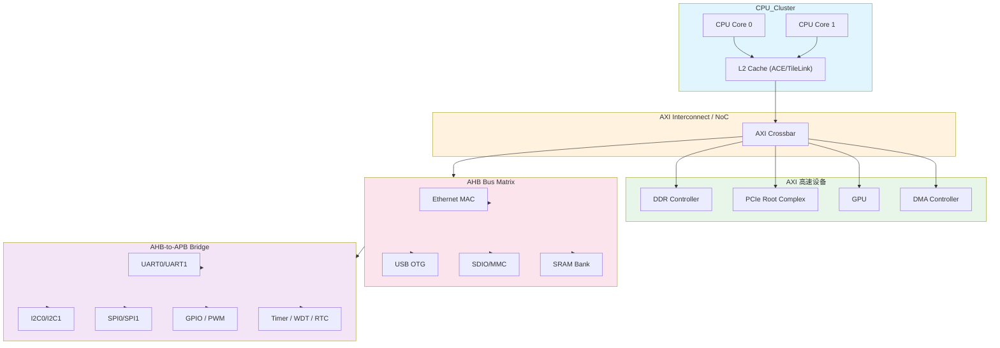

# B-D.13.1 APB/AHB/AXI/TileLink概念认知 [知识点358-359]

> 所属章节：第五部 B. 总线协议 > B-D.13 片内总线架构
>
> 难度：[B] Beginner | 预计阅读时间：25分钟

## <span class="blue"> 本节导读

当你打开一份SoC数据手册，看到密密麻麻的AXI、AHB、APB总线互联图时，是不是有点发怵？别怕。作为**软件工程师**，你不需要搞懂握手信号的时序波形，也不需要设计地址译码逻辑。你的核心关注点只有三件事：我的设备挂在哪条总线上？它的物理地址是多少？我该怎么在设备树里配置它？本节给你一张"片内总线地图"，让你能快速定位任何外设的位置，同时建立对总线架构的宏观认知。

---

## <span class="blue"> 知识点358 [B] — AMBA总线家族：APB、AHB、AXI

### 为什么ARM要搞这么多总线？

想象一个城市的交通系统：高速公路走大卡车（大批量数据），城市快速路走公交车（中等流量），小巷子里走电瓶车（零星访问）。片内总线也一样——**不同的外设有不同的带宽需求**，用统一的高速总线去接所有外设，既浪费面积又费电。这就是ARM设计AMBA（Advanced Microcontroller Bus Architecture）总线家族的初衷。

```
┌─────────────────────────────────────────────────────────────┐
│                    AMBA 总线家族全景图                         │
├─────────────────────────────────────────────────────────────┤
│                                                             │
│   AXI (高速公路) ────► CPU, GPU, DDR控制器, PCIe, DMA引擎      │
│      │                                                      │
│      ▼                                                      │
│   AHB (快速路) ──────► 高速外设: Ethernet MAC, USB Host,      │
│      │                  SDIO/MMC控制器, SRAM                  │
│      ▼                                                      │
│   APB (小巷子) ──────► 低速外设: UART, I2C, SPI, GPIO,        │
│                          Timer, RTC, WDT                      │
│                                                             │
└─────────────────────────────────────────────────────────────┘
```

#### APB：低速外设总线

APB（Advanced Peripheral Bus）是AMBA家族中最简单的总线，专门给那些"慢吞吞"的外设用——UART、I2C、SPI、GPIO的寄存器访问，基本都是通过APB完成的。

它的设计哲学是**"简单、低功耗、够用就好"**：

- 没有流水线，一次传输固定消耗2个时钟周期（setup + access）
- 不支持突发传输（burst），每次只传一个数据
- 地址总线和数据总线都是单向的，译码逻辑极其简单
- 总线主设备（master）永远只有一个——通常是一个AHB-to-APB桥

> 💡 **提示**：你在调试UART驱动时，用`devmem`读写的`0xFE20xxxx`这种地址，底层就是通过APB总线传到UART控制器的。APB对你是透明的，但知道它存在能帮你理解为什么寄存器访问有固定的延迟。

#### AHB：中速流水线总线

AHB（Advanced High-performance Bus）比APB复杂不少，适合中等带宽的外设。

它的关键特性是**流水线传输 + 突发传输**：

- 支持流水线：当前传输的data phase可以和下一个传输的address phase重叠
- 支持突发传输：一次发起可以连续传4/8/16个数据，DMA搬数据时特别高效
- 多主设备仲裁：多个master（比如CPU和DMA）可以竞争总线使用权
- 典型的时钟频率在100~200MHz范围

> 💡 **提示**：DMA控制器通常挂在AHB上。当你用`dmaengine`框架提交一个SG（Scatter-Gather）传输时，DMA通过AHB总线高效地把数据从内存搬到外设，全程不需要CPU干预。

#### AXI：高性能总线之王

AXI（Advanced eXtensible Interface）是现代SoC的骨架，CPU、GPU、DDR控制器、PCIe这些"大流量"设备都挂在AXI上。

AXI最显著的特征是**5个独立的通道**：

| 通道 | 方向 | 用途 | 信号举例 |
|------|------|------|----------|
| AR (Address Read) | Master → Slave | 发起读请求的地址和控制信息 | ARADDR, ARVALID, ARREADY |
| R (Read Data) | Slave → Master | 返回读数据和响应 | RDATA, RVALID, RRESP |
| AW (Address Write) | Master → Slave | 发起写请求的地址和控制信息 | AWADDR, AWVALID, AWREADY |
| W (Write Data) | Master → Slave | 写数据和字节使能 | WDATA, WSTRB, WVALID |
| B (Write Response) | Slave → Master | 写完成确认 | BVALID, BRESP |

这5个通道全部独立，意味着：

- **读和写可以完全并行**：读操作走AR+R通道，写操作走AW+W+B通道，两路互不干扰
- **支持乱序完成**：先发起的请求不一定先完成，slave可以用ID标签来标识不同事务
- **支持QoS（服务质量）**：可以给不同主设备的事务打优先级标签，确保CPU的访存不被GPU饿死
- **支持突发传输**：单次事务最多传256个数据beat

#### AMBA演进路线

| 总线 | 推出时间 | 核心特点 | 典型外设 | 软件工程师关注 |
|------|----------|----------|----------|----------------|
| APB | 1996 | 无流水线，2周期固定传输 | UART, I2C, SPI, GPIO, Timer | 寄存器基地址、位域定义 |
| AHB | 1996 | 流水线，突发传输，多主仲裁 | Ethernet MAC, USB, SDIO, SRAM | DMA配置、burst大小对齐 |
| AXI3 | 2003 | 5独立通道，乱序，QoS | CPU, GPU, DDR, PCIe | cache一致性属性、内存屏障 |
| AXI4 | 2010 | 简化AW/AW握手，长burst(256) | 同上 | QoS值含义、原子操作支持 |
| AXI4-Lite | 2010 | AXI的子集，无突发，轻量级 | 轻量寄存器接口 | 与APB类似，地址对齐规则 |
| ACE | 2011 | 增加缓存一致性协议 | 多核CPU cluster | 缓存维护操作、barrier指令 |

---

## <span class="blue"> 知识点359 [B] — TileLink：RISC-V生态的开放总线

### TileLink是什么？

如果说AXI是ARM帝国的"官方语言"，那TileLink就是RISC-V世界的"通用语"。由SiFive公司开源提出，TileLink是专门为RISC-V SoC设计的**开放性片内总线协议**。

#### 5个通道架构

TileLink借鉴了AXI的多通道思想，但设计得更简洁：

| 通道 | 方向 | 用途 | 对应AXI通道 |
|------|------|------|------------|
| A (Acquire) | Master → Slave | 请求数据或权限 | 类似AR+AW |
| B (Probe) | Slave → Master | 查询缓存状态（一致性用） | AXI无直接对应 |
| C (Release) | Master → Slave | 释放缓存行/写回数据 | 类似W通道（写回场景） |
| D (Grant) | Slave → Master | 返回数据或权限确认 | 类似R+B通道 |
| E (GrantAck) | Master → Slave | 确认收到Grant | AXI无对应 |

TileLink最独特的地方在于它的**B/C/E三个通道是专门为缓存一致性设计的**。当多个CPU核心共享内存时，这些通道用来广播"谁缓存了哪行数据"的信息，确保各核心的缓存不会看到陈旧数据。

#### PLIC：RISC-V的中枢

PLIC（Platform-Level Interrupt Controller）是RISC-V架构的标准中断控制器，功能上对应ARM的GIC（Generic Interrupt Controller）。软件工程师需要知道的是：

- PLIC通常挂在TileLink（或APB）总线上
- 每个外部中断源有一个优先级寄存器和一个使能位
- 中断Claim/Complete机制通过MMIO寄存器操作完成

### TileLink vs AXI 对比

| 维度 | TileLink | AXI |
|------|----------|-----|
| **设计方** | SiFive（开源） | ARM（授权使用） |
| **生态绑定** | RISC-V | ARM Cortex系列 |
| **通道数** | 5个（A/B/C/D/E） | 5个（AR/R/AW/W/B） |
| **缓存一致性** | 原生支持（B/C/E通道） | 需ACE扩展（AXI4-ACE） |
| **协议复杂度** | 相对简洁 | 较复杂，信号更多 |
| **乱序支持** | 支持 | 支持 |
| **QoS** | 无原生QoS | 原生支持4-bit QoS |
| **典型SoC** | SiFive FU540, 平头哥玄铁 | 所有ARM Cortex-A/M SoC |
| **开源IP** | Rocket Chip, BOOM | ARM官方IP需授权 |

> ⚠️ **陷阱**：试图深入AXI时序 → 浪费时间 → 这不是驱动工程师的工作
>
> 很多新手看到AXI的5个通道和几十页协议规范，会产生一种"必须完全掌握才能做驱动"的错觉。事实恰恰相反：AXI是SoC架构师和数字前端工程师的领域。你作为软件/驱动工程师，只需要知道两件事——你的设备挂在哪个地址区间（看设备树和`/proc/iomem`），以及它的寄存器访问是否需要特殊的cache属性（比如Device-nGnRnE）。深入到`ARREADY/ARVALID`握手机制、`AxCACHE`编码细节、`QoS`优先级策略，对于驱动开发几乎没有实际回报。把有限的时间花在理解设备寄存器功能、中断处理流程和用户空间接口上，ROI要高得多。

---

## <span class="blue"> SoC片内总线拓扑：一张图看懂全貌



这张图展示了绝大多数ARM SoC的总线拓扑规律：

1. **CPU簇**通过L2 Cache连接到AXI总线矩阵
2. **AXI**承载最高带宽的设备（DDR、PCIe、GPU、DMA）
3. **AXI到AHB桥**把高速总线降速到AHB域，接中速外设
4. **AHB到APB桥**进一步降速，接低速外设
5. 每条桥都会做**地址译码**，确保不同总线段的地址空间不重叠

---

## <span class="blue"> 软件工程师视角：地址映射与设备树

### 设备树中的片内总线地址映射

设备树（Device Tree）是软件工程师唯一需要和片内总线打交道的地方。下面是一个典型SoC的设备树层级：

```dts
/ {
    // AXI总线段 - 高速设备
    amba_axi: axi@0 {
        compatible = "simple-bus";
        #address-cells = <2>;
        #size-cells = <2>;
        ranges;

        // DDR控制器 - AXI接口
        ddr: memory-controller@80000000 {
            reg = <0x0 0x80000000 0x0 0x40000000>; // 1GB DDR
        };

        // DMA控制器 - AXI主/从设备
        dmac: dma-controller@9000000 {
            compatible = "arm,pl330";
            reg = <0x0 0x09000000 0x0 0x1000>;
            interrupts = <GIC_SPI 100 IRQ_TYPE_LEVEL_HIGH>;
        };

        // AHB总线桥
        amba_ahb: ahb@0 {
            compatible = "simple-bus";
            #address-cells = <2>;
            #size-cells = <2>;
            ranges = <0x0 0x0a000000 0x0 0x0a000000 0x0 0x01000000>;

            // Ethernet MAC - AHB设备
            ethernet: eth@a0000000 {
                compatible = "snps,dwmac";
                reg = <0x0 0x0a000000 0x0 0x10000>;
                interrupts = <GIC_SPI 50 IRQ_TYPE_LEVEL_HIGH>;
            };

            // AHB-to-APB桥
            amba_apb: apb@0 {
                compatible = "simple-bus";
                #address-cells = <2>;
                #size-cells = <2>;
                ranges = <0x0 0x0b000000 0x0 0x0b000000 0x0 0x01000000>;

                // UART0 - APB设备
                uart0: serial@b0000000 {
                    compatible = "ns16550a";
                    reg = <0x0 0x0b000000 0x0 0x100>;
                    interrupts = <GIC_SPI 30 IRQ_TYPE_LEVEL_HIGH>;
                    clock-frequency = <24000000>;
                };

                // I2C0 - APB设备
                i2c0: i2c@b0010000 {
                    compatible = "snps,designware-i2c";
                    reg = <0x0 0x0b001000 0x0 0x100>;
                    interrupts = <GIC_SPI 31 IRQ_TYPE_LEVEL_HIGH>;
                };

                // GPIO - APB设备
                gpio0: gpio@b0020000 {
                    compatible = "snps,dw-apb-gpio";
                    reg = <0x0 0x0b002000 0x0 0x100>;
                    interrupts = <GIC_SPI 32 IRQ_TYPE_LEVEL_HIGH>;
                    ngpios = <32>;
                };
            };
        };
    };
};
```

注意到规律了吗？地址的编排直接反映了总线层级：

| 总线层级 | 地址范围 | 设备举例 | 地址长度 |
|----------|----------|----------|----------|
| AXI | 0x8000_0000 ~ 0xBFFF_FFFF | DDR, DMA, PCIe | 通常1GB+ |
| AHB | 0xA000_0000 ~ 0xAFFF_FFFF | Ethernet, USB, SDIO | 通常16MB |
| APB | 0xB000_0000 ~ 0xBFFF_FFFF | UART, I2C, GPIO, Timer | 通常每个设备4KB |

### /proc/iomem：查看内核视角的地址分配

> 💡 **提示**：在运行的Linux系统中，用`cat /proc/iomem`可以看到内核视角下所有硬件资源的物理地址分配，这是调试驱动时定位设备地址的利器。

```bash
# 在RK3568上执行 cat /proc/iomem 的示例输出
$ cat /proc/iomem | head -50
00000000-09ffffff : System RAM          # DDR内存区域
  00008000-00bfffff : Kernel code
  00c00000-00d27fff : reserved
  00d28000-014bffff : Kernel data
  014c0000-09dfffff : System RAM
fd000000-fdffffff : pcie@fe260000      # PCIe配置空间
fe010000-fe01ffff : ethernet@fe010000  # GMAC以太网
fe2a0000-fe2a0fff : i2c@fe2a0000      # I2C0控制器
fe2b0000-fe2b0fff : i2c@fe2b0000      # I2C1控制器
fe660000-fe66ffff : dwmmc@fe660000    # SDIO控制器
fe740000-fe7400ff : serial@fe740000    # UART0
fe750000-fe7500ff : serial@fe750000    # UART1
fe760000-fe7600ff : serial@fe760000    # UART2
ff520000-ff5200ff : pwm@ff520000       # PWM控制器
```

从这个输出你能直接读出：

- DDR物理地址从`0x0000_0000`开始（注意大小端是由CPU决定的，不是总线）
- 以太网控制器在`0xFE01_0000`，属于AHB或AXI域
- 所有UART集中在`0xFE74_0000`附近，间距256字节，典型的APB地址密度
- 每个I2C控制器只占4KB（`0x1000`），APB设备的标配大小

```bash
# 快速过滤某类设备
$ grep -i uart /proc/iomem
fe740000-fe7400ff : serial@fe740000
fe750000-fe7500ff : serial@fe750000
fe760000-fe7600ff : serial@fe760000

# 查看某个设备的详细信息（通过 sysfs）
$ cat /sys/class/tty/ttyS0/device/of_node/compatible
snps,dw-apb-uart
$ cat /sys/class/tty/ttyS0/device/of_node/reg
00000000 00fe74000 00000000 00000100
```

---

## <span class="blue"> APB vs AHB vs AXI 全面比较

| 维度 | APB | AHB | AXI |
|------|-----|-----|-----|
| **全称** | Advanced Peripheral Bus | Advanced High-performance Bus | Advanced eXtensible Interface |
| **定位** | 低速外设 | 中速高性能 | 高速高带宽 |
| **流水线** | 无 | 有（address/data重叠） | 有（5通道全独立） |
| **突发传输** | 不支持 | 支持（4/8/16 beat） | 支持（最长256 beat） |
| **通道数** | 1组（PADDR/PWDATA/PRDATA） | 1组（HADDR/HWDATA/HRDATA） | 5组（AR/R/AW/W/B） |
| **读/写并行** | 不能 | 不能 | 能（独立通道） |
| **乱序完成** | 不支持 | 不支持 | 支持（通过ID标签） |
| **多主设备** | 不支持 | 支持（仲裁器） | 支持（交叉开关） |
| **典型时钟** | <50MHz | 100~200MHz | >200MHz |
| **每周期数据** | 1个（2周期延迟） | 1个（流水后每周期1个） | 读写各1个（并行） |
| **总线位宽** | 32-bit为主 | 32/64-bit | 64/128/256-bit |
| **功耗** | 极低 | 中 | 较高 |
| **面积** | 最小 | 中等 | 最大 |
| **典型外设** | UART, I2C, SPI, GPIO, Timer, RTC | Ethernet, USB, SDIO, SRAM | CPU, GPU, DDR, PCIe, DMA |
| **软件关注点** | 寄存器地址 | DMA burst对齐 | Cache属性、QoS、内存序 |

---

## <span class="blue"> 本节总结

本节你建立了对片内总线架构的宏观认知。核心收获如下：

| 要点 | 内容 |
|------|------|
| **总线分层设计** | AXI（高速）→ AHB（中速）→ APB（低速），逐层桥接 |
| **APB核心特征** | 无流水线，2周期，适合UART/I2C/SPI寄存器访问 |
| **AHB核心特征** | 流水线+突发传输，适合DMA和中等带宽外设 |
| **AXI核心特征** | 5独立通道，支持读写并行+乱序+QoS，现代SoC骨架 |
| **TileLink定位** | RISC-V生态的开放替代方案，原生支持缓存一致性 |
| **软件工程师关注点** | 设备物理地址、设备树`reg`属性、`/proc/iomem`验证 |
| **不需要关注** | 握手时序、仲裁算法、QoS策略、总线桥的内部实现 |

---

## <span class="blue"> 配套资源

- **推荐阅读**：ARM AMBA AXI and ACE Protocol Specification (ARM IHI 0022E)
- **开源参考**：SiFive TileLink Specification 1.8.1 — https://starfivetech.com/uploads/tilelink_spec_1.8.1.pdf
- **实践命令**：在任意Linux ARM板子上执行 `cat /proc/iomem` 和 `ls /sys/bus/platform/devices/` 对照学习

---

## <span class="blue"> 下一步

接下来，我们将离开片内总线的抽象世界，踏入第一个具体的低速外设总线——**B-A.2.1 I2C物理层与电气特性**。在那里，你会学到SDA和SCL两条线如何完成半双工通信，以及为什么I2C的上拉电阻值会影响通信速率。准备好你的示波器，我们要看真实的波形了！
