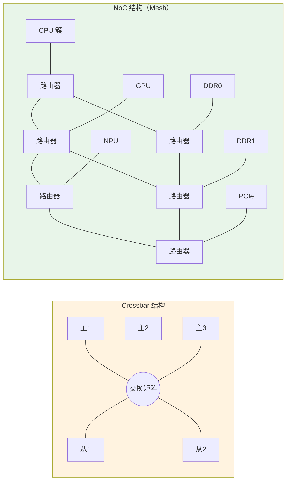

# B-D.13.2 AXI 深入与 NoC 片上网络

> 所属章节：第五部 B. 总线协议 > B-D.13 片内总线认知
>
> 难度：[I] Intermediate | 预计阅读时间：30 分钟

##  本节导读

B-D.13.1 给了片内总线的地图：设备挂在哪条总线、地址多少、设备树怎么配。本篇往下走一层，回答"软件什么时候会被总线层的问题咬到"——DMA 传输为什么要求地址对齐、`ioremap` 与 `ioremap_wc` 映射出来的内存有何不同、系统 CPU 负载不高却周期性丢帧该怀疑谁。这些问题的答案都在 AXI 的事务属性与互连结构里。

本节覆盖：AXI 握手与突发的最小必要机制、AxCACHE/AxPROT 属性与内核映射 API 的对应关系、Crossbar 向 NoC 的演进、总线带宽竞争在软件层面的可见性与调优手段。

---

##  AXI 事务机制：软件视角的最小集合

### VALID/READY 握手

AXI 每个通道的传输都遵循同一规则：发送方拉高 VALID 表示"数据就绪"，接收方拉高 READY 表示"可以接收"，两者同时为高的那个时钟沿完成一次传输。

软件工程师不需要画时序图，但要理解这一规则的两个推论：

- **任一方都可以让对方等**。外设控制器内部 FIFO 满了，它会压住 READY——这就是驱动里偶尔观测到"写寄存器卡顿"的硬件来源
- **握手可以永远等不到对方**。设备树地址写错、时钟没使能、复位的设备不响应，事务就永远悬在那里。表现为 `devmem` 一读就整机挂死——CPU 发出的 AXI 读事务无人应答，核一直等

> 💡 "devmem 读错地址导致系统挂死"是嵌入式的经典事故，根因就是 AXI 事务无超时机制。部分 SoC 在互连中加入了超时响应单元（返回错误响应而非死等），但不能依赖。

### 突发传输：FIXED / INCR / WRAP

AXI 一次事务由地址通道给出起始地址与控制信息，数据通道连续传多个数据拍。突发类型决定后续拍的地址如何推进：

| 突发类型 | 地址推进方式 | 典型使用者 |
|----------|--------------|------------|
| FIXED | 地址不变 | 外设 FIFO（I2C/SPI/UART 数据寄存器） |
| INCR | 地址递增 | DMA 大块内存搬运 |
| WRAP | 到达边界后回卷 | CPU cache line 填充（先取急需的那个字） |

控制字段还有 AxLEN（突发长度，AXI4 最长 256 拍）与 AxSIZE（每拍字节数）。

软件侧的直接对应物是 **DMA 对齐约束**：多数 DMA 控制器要求源/目的地址按突发粒度对齐（如 64 字节），长度是突发长度的整数倍。不满足时控制器要么报错，要么退化为单拍传输，带宽掉一个数量级。`dmaengine` 的 alignment 参数、网卡驱动的 buffer 对齐要求，根源都在这里。

### 乱序与 Outstanding

AXI 事务携带 ID 标签，主设备可以在前一笔事务未完成时发出下一笔（outstanding），不同 ID 的事务允许乱序完成。这解释了为什么慢速 APB 外设不会拖死 DDR 访问——它们在不同 ID、不同通路上并行推进。

---

##  AxCACHE / AxPROT：软件真正要打交道的部分

五通道握手中，软件唯一能"控制"总线行为的途径是内存映射时指定的属性，它们最终编码进 AXI 事务的 AxCACHE 与 AxPROT 信号。

### AxCACHE：缓存属性

AxCACHE[3:0] 各比特含义：

| 位 | 名称 | 含义 |
|----|------|------|
| [0] | Bufferable | 写事务可在互连的写缓冲中提前应答 |
| [1] | Cacheable（Modifiable） | 事务可被缓存、合并、拆分 |
| [2] | Read-Allocate | 读miss 时分配 cache line |
| [3] | Write-Allocate | 写miss 时分配 cache line |

在 ARMv8 软件侧，这组属性体现为页表中的内存类型：

| 内存类型 | 语义 | 内核映射 API | 用途 |
|----------|------|--------------|------|
| Device-nGnRnE | 不聚合、不重排、不提前写应答 | `ioremap()`（ARM64 默认） | 绝大多数外设寄存器 |
| Device-nGnRE | 允许提前写应答 | `ioremap()` 变体（少见） | 对写应答延迟敏感的寄存器 |
| Normal Non-Cacheable | 普通内存语义但不缓存 | `ioremap_wc()` 的非合并路径 | 需字节序正常但不要求缓存 |
| Normal Cacheable（WC） | 允许写合并 | `ioremap_wc()` | 帧缓冲、显存类大块显式写区域 |
| Normal Cacheable | 完全缓存 | 常规 `kmalloc`/`vmalloc` 内存 | 普通数据 |

> 💡 第 11 章 11.1.4 的裸驱动用 `ioremap` 映射 SoC 寄存器地址，得到的正是 Device-nGnRnE 映射：每次读写都真实地落到总线上，不被缓存、不被重排、不被合并。如果把 MMIO 区域错误地映射成 Normal Cacheable，CPU 读到的可能是 cache 里的旧值——寄存器"读了没反应"是这种错误配置的典型症状。

### AxPROT：权限与安全属性

AxPROT[2:0] 标记事务的特权级（特权/非特权）、安全态（Secure/Non-secure）、类型（指令/数据）。设备树里常见的 `secure` 属性、TrustZone 隔离的外设（如 secure watchdog），最终都靠互连检查 AxPROT 来拦截非安全世界的访问。驱动访问一个被划给安全世界的寄存器，事务会被互连直接拒绝——表现为读回全 0 或总线错误。

---

##  从 Crossbar 到 NoC

### Crossbar 的扩展瓶颈

13.1 拓扑图里的 "AXI Crossbar" 是一个全互连交换矩阵：N 个主设备对 M 个从设备，任意主可在同一时刻与任意从建立通路。它的问题随主从数量增长而暴露：

- 连线复杂度按 N×M 增长，硅片布线面积急剧膨胀
- 仲裁路径变长，最高时钟频率被拉低
- 所有主设备共享同一时钟域，无法按区域独立降频省电

主从数量在十几条以内时 Crossbar 够用（绝大多数嵌入式 SoC 如此）；核数上到几十、还要挂 GPU/NPU/多个 DDR 通道时，就必须换结构。

### NoC：把网络引入芯片

NoC（Network-on-Chip，片上网络）把片内互连改造成包交换网络：

- 事务被打成**数据包**，经**路由器**逐级转发到目的节点
- 拓扑可以是环形、Mesh（网格）、Torus（环面），按流量模型选择
- 每个路由器/节点有独立时钟域，支持按区域调频与电源门控
- QoS 在包级实现：虚拟通道、优先级仲裁、带宽整形

产业界的对应实现：ARM 的 CMN（Coherent Mesh Network）系列用于服务器与旗舰移动 SoC；Arteris 的 FlexNoC/Ncore 是独立的商业 NoC IP，被大量车载与 AI SoC 采用。

### 对软件的影响

NoC 引入了一个嵌入式工程师开始需要面对的变量：**跨节点的延迟差异**。CPU 访问"近处"的 DDR 通道与"远处"的通道延迟不同，这就是片上 NUMA 的雏形。在服务器级 ARM SoC（多 Die、多 DDR 控制器）上，内核的 NUMA 调度、`numactl` 绑核绑内存的收益，直接来自这个物理事实。

---

##  带宽竞争：总线层问题在软件层面的样子

### 典型症状

嵌入式现场有一类问题 CPU 视角完全无辜：负载不高、调度正常，但系统周期性卡顿、显示丢帧、音频爆音、实时任务偶发超时。常见根因之一是 **DDR 带宽竞争**——GPU 渲染、摄像头 DMA、显示控制器扫显、CPU 访存全部汇聚到同一个 DDR 控制器，互连按 QoS 仲裁，优先级低的事务被饿死一段窗口。

显示控制器是最典型的受害者：扫显（scanout）不能等，FIFO 空了就是画面撕裂。所以 SoC 厂商通常把显示控制器的 QoS 优先级调到最高，在寄存器手册里能看到对应的 QoS 配置位。

### 观测手段

| 手段 | 命令/路径 | 能看什么 |
|------|-----------|----------|
| SoC PMU/NoC 计数器 | `perf list` 中 `arm_cmn_*`、`imx8_ddr*` 等事件 | DDR 吞吐、各主设备带宽占比 |
| 厂商 QoS 寄存器 | 数据手册 QoS/Priority 章节 + `devmem` | 各主设备当前优先级 |
| 带宽压测对照 | `mbw`、`tinymembench` 压内存同时观察业务 | 复现"带宽打满→业务异常"的因果 |
| ftrace/延迟跟踪 | `cyclictest` + 干扰注入 | 实时任务的延迟毛刺与带宽竞争的相关性 |

系统出现"CPU 无辜的周期性卡顿"时，第一排查手段是打满 DDR 带宽做对照实验（如 `mbw` 后台运行）：症状若随带宽压力同步恶化，问题在总线层而非调度层，后续手段是调 QoS 优先级、给关键业务做缓存/内存隔离，而不是在进程调度里打转。

### 缓解手段（软件可做部分）

- 提高关键主设备的 QoS 优先级（厂商寄存器，常见于显示/实时采集路径）
- 用 CMA/预留内存减少分配时的碎片化间接影响
- 大流量搬运集中提交长突发，避免大量短事务占用仲裁窗口
- 实时业务参考 B-E.14.6 PREEMPT_RT 与总线实时性调优

---

##  Crossbar vs NoC（Trade-off）

| 维度 | Crossbar | NoC |
|------|----------|-----|
| 适用规模 | 主从各 ~10 条以内 | 几十至上百节点 |
| 延迟 | 低且确定（单跳） | 多跳转发，跳数相关 |
| 面积/布线 | 随 N×M 爆炸 | 随节点数近似线性 |
| 时钟域 | 单一 | 每节点独立，支持分区调频 |
| QoS | 端口级优先级 | 包级：虚拟通道 + 整形 |
| 一致性支持 | 需 ACE 外挂 | 原生（CMN 等带一致性） |
| 典型场景 | 嵌入式 SoC（RK3568、i.MX 级） | 服务器/AI/旗舰移动 SoC |
| 软件可见性 | 基本透明 | NUMA、QoS 配置、PMU 事件 |

---

##  常见陷阱

> ⚠️ DMA 地址/长度不满足突发对齐，传输静默降级。控制器不报错的型号直接退化为单拍模式，带宽暴跌而日志干净。判断方法：对照数据手册的 alignment 章节检查 `dmaengine` 配置。

> ⚠️ 帧缓冲用 `ioremap` 而非 `ioremap_wc`。Device 属性禁止写合并，逐像素写显存性能掉一个数量级以上；反过来，控制寄存器用 `ioremap_wc` 则会因写合并丢失中间状态。两类区域必须分开映射。

> ⚠️ 把"读回全 0"一律当外设故障。访问被 TrustZone 划走的寄存器、时钟未使能的控制器、不存在的地址，读回全 0 是常见表现。先查时钟树与安全属性，再怀疑硬件。

> ⚠️ 用 Crossbar 时代的假设调 NoC 系统。"所有内存访问延迟相同"在多 DDR 通道的服务器 SoC 上不成立，跨节点访问延迟可差一倍以上。性能敏感任务先 `numactl --hardware` 看拓扑再谈优化。

---

##  动手练习

1. **对齐验证**：找一份本板数据手册的 DMA 章节，记录突发对齐约束；再到内核 `Documentation/devicetree/bindings/dma/` 找对应 binding，确认设备树里哪些属性映射到这些约束。
2. **带宽对照实验**：开发板上先后台跑 `tinymembench`（或 `dd` 大文件循环写）打满内存带宽，同时观察显示/采集业务是否出现卡顿，验证"带宽竞争"路径是否存在。
3. **PMU 观察**：`perf list | grep -iE "ddr|cmn|noc"` 查看本板是否有总线级 PMU 事件；有则用 `perf stat -e <事件>` 测一次业务运行的带宽占比。
4. **无硬件后备**：阅读 ARM AXI 规范的信号列表章节（IHI 0022），把 AR/AW 通道的信号名按"地址/控制/握手"三类手工分组；再对照 13.1 的 RK3568 地址表，推算 uart2 一次寄存器读会经过几级桥。

---

##  本节总结

| 自查项 | 确认标准 |
|--------|----------|
| 握手推论 | 能解释"devmem 读错地址挂死"与"写寄存器卡顿"的总线层原因 |
| 突发类型 | FIXED/INCR/WRAP 各自的使用者；DMA 对齐约束的来源 |
| 内存属性 | `ioremap`/`ioremap_wc` 与 AxCACHE、内存类型的对应关系 |
| AxPROT | TrustZone 拦截非安全访问的机制 |
| Crossbar vs NoC | 规模瓶颈、跳数延迟、NUMA 雏形的由来 |
| 带宽竞争 | 能列出症状、观测手段（PMU/压测对照）、缓解手段 |

---

##  配套资源

- **协议规范**：ARM AMBA AXI and ACE Protocol Specification（IHI 0022）信号与属性章节
- **NoC 参考**：ARM CoreLink CMN 系列技术参考手册；Arteris FlexNoC 公开白皮书
- **内核文档**：`Documentation/devicetree/bindings/dma/`、`Documentation/admin-guide/mm/numa_memory_policy.rst`

---

##  下一步

下一节 **B-D.13.3 CHI 与 UCIe：Chiplet 互连**，走出单芯片边界：AXI/ACE 在多核时代的一致性瓶颈如何催生 CHI，Chiplet 封装如何把互连从片上延伸到封装内，以及 UCIe 标准对固件与系统拓扑发现的影响。随后板块 1 收尾，进入板块 2 低速外设接口的 **B-A.1.1 GPIO 通用输入输出**。

> 💡 螺旋衔接：本篇的 DMA 对齐与带宽竞争，会在 B-C.11.3 PCIe 驱动与 DMA、B-C.11.6 PCIe 卡实战中再次出现——届时瓶颈从片内互连换成 PCIe 链路，分析方法是同一套。
