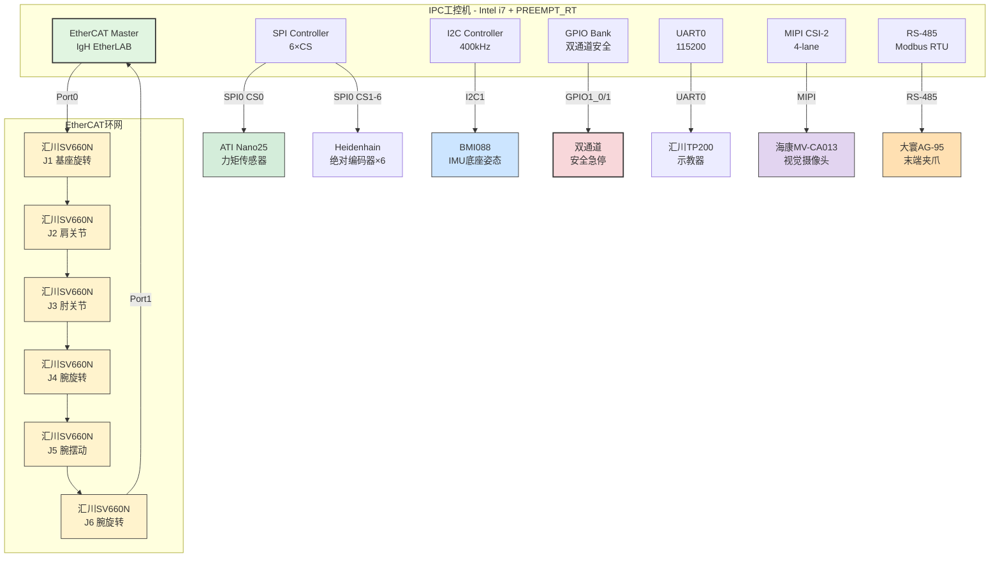

# B-E.14.1 六轴协作机械臂多总线协同

> 所属章节：第五部 B. 总线协议 > B-E.14 实战案例
>
> 难度：[E] Expert / [M] Master | 预计阅读时间：35分钟

## <span class="blue"> 本节导读

你即将面对的是嵌入式Linux领域中最复杂的系统集成场景之一——**六轴协作机械臂**。这不是单一总线的"独角戏"，而是一场涉及 **7种总线协议协同作战** 的"交响乐"。负载5kg、用于汽车零部件装配的协作机械臂（cobot），要求EtherCAT在1kHz下驱动6个伺服轴，SPI实时读取力矩传感器和编码器，I2C采集底座IMU姿态，GPIO守护安全急停，UART连接示教器，MIPI CSI-2传输视觉图像，RS-485控制末端夹爪——任何一个总线掉链子，都可能导致产线停机或安全事故。

本节以一个**真实可落地**的项目视角，从总线拓扑设计、设备树配置、IgH EtherCAT Master编程、CANopen NMT启动、多总线并发数据流到调试优化，给你一个完整的技术闭环。读完这一节，你会明白为什么汽车厂里的机械臂能精确到0.02mm，也能理解为什么安全回路必须双通道冗余。

<br>

---

## <span class="blue"> 总线拓扑设计 [E]

机械臂的总线架构采用**分层星型+环网混合拓扑**，EtherCAT作为实时骨干网贯穿6轴伺服，其他总线通过各自的控制器挂载到主控SoC上。



<br>

### 机械臂总线方案一览

| 总线协议 | 设备 | 功能 | 数据速率 | 周期/时序 | 控制器 |
|---------|------|------|---------|----------|--------|
| EtherCAT | 汇川SV660N × 6 | 6轴伺服电机驱动 | 100 Mbps | 1 kHz (1ms) | IgH EtherLAB |
| SPI | ATI Nano25 | 末端六维力矩传感器 | 8 MHz | 100 Hz (10ms) | SPI0 CS0 |
| SPI | Heidenhain EQI1100 × 6 | 关节绝对位置编码器 | 4 MHz | 100 Hz (10ms) | SPI0 CS1-6 |
| I2C | Bosch BMI088 | 底座姿态IMU（Accel+Gyro） | 400 kHz | 50 Hz (20ms) | I2C1 |
| GPIO | 双通道安全回路 | STO急停 + 门开关 | — | 中断触发 | GPIO Bank1 |
| UART | 汇川TP200 | 示教器人机交互 | 115200bps | 事件驱动 | UART0 |
| MIPI CSI-2 | 海康MV-CA013-21UC | 视觉引导定位 | 1.5 Gbps/lane | 30 fps | MIPI CSI-2 4-lane |
| RS-485 | 大寰AG-95 | 末端夹爪开合控制 | 115200bps | 100 Hz | UART2 (RS-485) |

> ⚠️ **陷阱**：EtherCAT从站掉线 → PDO数据无效 → 必须检查Working Counter → 否则机械臂失控
>
> 在1kHz的EtherCAT周期任务中，每次读写PDO后都要检查`working_counter`。如果WC不等于从站数量，说明环网中有从站掉线，此时**必须立即触发紧急停机**，不能继续使用过期的位置/速度数据驱动电机。我见过现场因为忽略WC检查导致机械臂"飞车"撞坏夹具的事故——15万元的治具30秒报废。

<br>

---

## <span class="blue"> 设备树完整配置 [E]

以下设备树片段基于 **NXP i.MX8M Plus** 平台，机械臂控制板的完整外设定义。注意EtherCAT通常通过SPI或并口连接专用ESC芯片（如Beckhoff ET1100），这里假设通过SPI连接ET1100 ESC。

```dts
/* arch/arm64/boot/dts/freescale/imx8mp-cobot-arm.dts */

/ {
    model = "Collaborative Robot Arm Controller";
    compatible = "fsl,imx8mp-cobot", "fsl,imx8mp";

    /* 机械臂模型参数 */
    cobot_arm: cobot-arm {
        compatible = "cobot,arm-6dof";
        payload = <5000>;           /* 5kg负载，单位：克 */
        reach = <819>;              /* 工作半径819mm */
        repeatability = <20>;       /* 重复定位精度±0.02mm */
        max-speed = <2250>;         /* 最大关节速度2250°/s */
        safety-rating = "ISO 10218-1 Cat 3 PL d";
    };

    /* GPIO安全急停回路 - 双通道冗余 */
    safety_estop: safety-estop {
        compatible = "gpio-keys";
        pinctrl-names = "default";
        pinctrl-0 = <&pinctrl_safety>;

        estop_ch1 {
            label = "ESTOP_CHANNEL_1";
            gpios = <&gpio1 0 GPIO_ACTIVE_LOW>;
            linux,code = <KEY_ESTOP>;   /* 自定义键码 */
            gpio-key,wakeup;
            debounce-interval = <5>;    /* 5ms去抖 */
        };

        estop_ch2 {
            label = "ESTOP_CHANNEL_2";
            gpios = <&gpio1 1 GPIO_ACTIVE_LOW>;
            linux,code = <KEY_ESTOP2>;
            gpio-key,wakeup;
            debounce-interval = <5>;
        };

        /* STO安全扭矩切断输出 */
        sto_output {
            label = "STO_OUTPUT";
            gpios = <&gpio1 2 GPIO_ACTIVE_HIGH>;
            default-state = "on";       /* 正常运行时高电平 */
        };
    };
};

&ecspi2 {
    pinctrl-names = "default";
    pinctrl-0 = <&pinctrl_ecspi2>;
    cs-gpios = <&gpio5 9 GPIO_ACTIVE_LOW>,   /* CS0: ATI力矩传感器 */
               <&gpio5 10 GPIO_ACTIVE_LOW>,  /* CS1: J1编码器 */
               <&gpio5 11 GPIO_ACTIVE_LOW>,  /* CS2: J2编码器 */
               <&gpio5 12 GPIO_ACTIVE_LOW>,  /* CS3: J3编码器 */
               <&gpio5 13 GPIO_ACTIVE_LOW>,  /* CS4: J4编码器 */
               <&gpio5 14 GPIO_ACTIVE_LOW>,  /* CS5: J5编码器 */
               <&gpio5 15 GPIO_ACTIVE_LOW>;  /* CS6: J6编码器 */
    status = "okay";

    /* SPI0: ATI Nano25 六维力矩传感器 */
    ati_nano25: force-torque-sensor@0 {
        compatible = "ati,nano25";
        reg = <0>;
        spi-max-frequency = <8000000>;  /* 8MHz */
        spi-cpha;                       /* 模式1: CPOL=0, CPHA=1 */
        sensor-range = "12N_200Nm";     /* ±12N / ±200Nm */
        calibration-matrix = <          /* 出厂标定矩阵6×6 */
            100  0    0    0    0    0
            0    100  0    0    0    0
            0    0    100  0    0    0
            0    0    0    100  0    0
            0    0    0    0    100  0
            0    0    0    0    0    100
        >;
    };

    /* SPI1-6: Heidenhain EQI1100绝对编码器 */
    heidenhain_j1: encoder@1 {
        compatible = "heidenhain,eqi1100";
        reg = <1>;
        spi-max-frequency = <4000000>;
        spi-cpol;                       /* 模式3: CPOL=1, CPHA=1 */
        resolution = <19>;              /* 19bit = 524288 CPR */
        multi-turn = <12>;              /* 12bit圈数 */
    };

    /* J2-J6编码器类似，reg=2~6 */
    heidenhain_j2: encoder@2 { compatible = "heidenhain,eqi1100"; reg = <2>; spi-max-frequency = <4000000>; spi-cpol; resolution = <19>; multi-turn = <12>; };
    heidenhain_j3: encoder@3 { compatible = "heidenhain,eqi1100"; reg = <3>; spi-max-frequency = <4000000>; spi-cpol; resolution = <19>; multi-turn = <12>; };
    heidenhain_j4: encoder@4 { compatible = "heidenhain,eqi1100"; reg = <4>; spi-max-frequency = <4000000>; spi-cpol; resolution = <19>; multi-turn = <12>; };
    heidenhain_j5: encoder@5 { compatible = "heidenhain,eqi1100"; reg = <5>; spi-max-frequency = <4000000>; spi-cpol; resolution = <19>; multi-turn = <12>; };
    heidenhain_j6: encoder@6 { compatible = "heidenhain,eqi1100"; reg = <6>; spi-max-frequency = <4000000>; spi-cpol; resolution = <19>; multi-turn = <12>; };
};

&i2c2 {
    pinctrl-names = "default";
    pinctrl-0 = <&pinctrl_i2c2>;
    clock-frequency = <400000>;     /* Fast-mode 400kHz */
    status = "okay";

    /* Bosch BMI088 6轴IMU */
    bmi088: imu@18 {
        compatible = "bosch,bmi088";
        reg = <0x18>;               /* Accel地址 */
        reg_gyro = <0x68>;          /* Gyro地址 */
        interrupt-parent = <&gpio2>;
        interrupts = <15 IRQ_TYPE_LEVEL_HIGH>; /* INT1 */
        accel-range = <12>;         /* ±12g */
        gyro-range = <2000>;        /* ±2000dps */
        odr = <100>;                /* 100Hz输出 */
    };
};

&uart1 {
    pinctrl-names = "default";
    pinctrl-0 = <&pinctrl_uart1>;
    status = "okay";

    /* UART0: 汇川TP200示教器 */
    teach_pendant: serial {
        compatible = "inovance,tp200";
        current-speed = <115200>;
        data-bits = <8>;
        parity = "none";
        stop-bits = <1>;
        flow-control = "none";
        protocol = "inovance-private";  /* 汇川私有协议 */
    };
};

&uart3 {
    pinctrl-names = "default";
    pinctrl-0 = <&pinctrl_uart3>, <&pinctrl_uart3_rs485>;
    rts-gpios = <&gpio4 27 GPIO_ACTIVE_HIGH>;
    linux,rs485-enabled-at-boot-time;
    rs485-rts-delay-ns = <10 10>;
    status = "okay";

    /* RS-485: 大寰AG-95末端夹爪 */
    dh_ag95: gripper@1 {
        compatible = "dahuan,ag95";
        reg = <1>;
        protocol = "modbus-rtu";
        slave-id = <1>;
        max-force = <120>;          /* 最大夹持力120N */
        stroke = <95>;              /* 行程95mm */
    };
};

&mipi_csi_0 {
    #address-cells = <1>;
    #size-cells = <0>;
    status = "okay";

    ports {
        port@0 {
            mipi_csi0_ep: endpoint {
                remote-endpoint = <&csi_hikvision_ep>;
                data-lanes = <1 2 3 4>; /* 4-lane */
                lane-speed = <1500000000>; /* 1.5Gbps/lane */
            };
        };
    };

    /* 海康MV-CA013-21UC 130万像素工业相机 */
    camera@3b {
        compatible = "hikvision,mv-ca013";
        reg = <0x3b>;
        resolution = <1280 1024>;
        pixel-format = <MEDIA_BUS_FMT_YUYV8_2X8>;
        frame-rates = <30 60>;      /* 30fps@1280x1024, 60fps@640x480 */
        exposure-auto = <1>;        /* 自动曝光 */
        gain-auto = <1>;            /* 自动增益 */
        white-balance-auto = <1>;
    };
};

/* EtherCAT: Beckhoff ET1100 ESC通过SPI连接 */
&ecspi1 {
    pinctrl-names = "default";
    pinctrl-0 = <&pinctrl_ecspi1>;
    cs-gpios = <&gpio5 8 GPIO_ACTIVE_LOW>;
    status = "okay";

    et1100: ethercat-esc@0 {
        compatible = "beckhoff,et1100";
        reg = <0>;
        spi-max-frequency = <30000000>; /* 30MHz */
        interrupt-parent = <&gpio3>;
        interrupts = <20 IRQ_TYPE_EDGE_FALLING>;
        eeprom = <&at24mac402>;     /* ESI从站信息 */
    };
};

/* Pinmux配置 */
&iomuxc {
    pinctrl_safety: safetygrp {
        fsl,pins = <
            MX8MP_IOMUXC_GPIO1_IO00__GPIO1_IO0    0x140  /* ESTOP_CH1 */
            MX8MP_IOMUXC_GPIO1_IO01__GPIO1_IO1    0x140  /* ESTOP_CH2 */
            MX8MP_IOMUXC_GPIO1_IO02__GPIO1_IO2    0x140  /* STO_OUTPUT */
        >;
    };

    pinctrl_ecspi2: ecspi2grp {
        fsl,pins = <
            MX8MP_IOMUXC_ECSPI2_SCLK__ECSPI2_SCLK  0x140
            MX8MP_IOMUXC_ECSPI2_MOSI__ECSPI2_MOSI  0x140
            MX8MP_IOMUXC_ECSPI2_MISO__ECSPI2_MISO  0x140
            MX8MP_IOMUXC_GPIO5_IO09__GPIO5_IO9     0x140  /* CS0:力矩传感器 */
            MX8MP_IOMUXC_GPIO5_IO10__GPIO5_IO10    0x140  /* CS1 */
            MX8MP_IOMUXC_GPIO5_IO11__GPIO5_IO11    0x140  /* CS2 */
            MX8MP_IOMUXC_GPIO5_IO12__GPIO5_IO12    0x140  /* CS3 */
            MX8MP_IOMUXC_GPIO5_IO13__GPIO5_IO13    0x140  /* CS4 */
            MX8MP_IOMUXC_GPIO5_IO14__GPIO5_IO14    0x140  /* CS5 */
            MX8MP_IOMUXC_GPIO5_IO15__GPIO5_IO15    0x140  /* CS6 */
        >;
    };

    /* 其他pinmux省略，实际项目中补充完整 */
};
```

<br>

---

## <span class="blue"> IgH EtherCAT Master 配置 [M]

IgH EtherCAT Master（EtherLAB）是Linux上最成熟的EtherCAT主站实现。以下代码展示6轴伺服的完整初始化：从站扫描、PDO映射、DC同步配置。

```c
/* cobot_ethercat_init.c - IgH EtherCAT Master初始化 */

#include <ecrt.h>
#include <stdio.h>
#include <string.h>
#include <time.h>

#define COBOT_NSERVO    6       /* 6轴 */
#define COBOT_FREQ      1000    /* 1kHz控制频率 */
#define VENDOR_INOVANCE 0x00000675  /* 汇川Vendor ID */
#define MODEL_SV660N    0x00010001  /* SV660N Product Code */

/* 伺服实例数据结构 */
struct servo_axis {
    ec_slave_config_t *sc;      /* 从站配置 */
    ec_slave_config_state_t sc_state;

    /* RxPDO映射 - 主站→从站（控制命令） */
    struct {
        ec_pdo_entry_reg_t ctrl_word;   /* 0x6040 Controlword */
        ec_pdo_entry_reg_t target_pos;  /* 0x607A Target Position */
        ec_pdo_entry_reg_t target_vel;  /* 0x60FF Target Velocity */
        ec_pdo_entry_reg_t target_tor;  /* 0x6071 Target Torque */
        ec_pdo_entry_reg_t mode_op;     /* 0x6060 Modes of Operation */
    } rpdo;

    /* TxPDO映射 - 从站→主站（反馈数据） */
    struct {
        ec_pdo_entry_reg_t status_word; /* 0x6041 Statusword */
        ec_pdo_entry_reg_t actual_pos;  /* 0x6064 Position Actual Value */
        ec_pdo_entry_reg_t actual_vel;  /* 0x606C Velocity Actual Value */
        ec_pdo_entry_reg_t actual_tor;  /* 0x6077 Torque Actual Value */
        ec_pdo_entry_reg_t error_code;  /* 0x603F Error Code */
    } tpdo;
};

static ec_master_t *master = NULL;
static ec_master_state_t master_state;
static struct servo_axis servos[COBOT_NSERVO];
static uint8_t *domain_pd = NULL;   /* Process Data指针 */
static ec_domain_t *domain = NULL;
static ec_domain_state_t domain_state;

/* PDO条目注册数组 - 全部6轴的RPDO+TPDO */
static ec_pdo_entry_reg_t pdo_regs[COBOT_NSERVO * 9 + 1]; /* 每轴8个PDO + null */

/* 预定义的PDO映射（CiA 402标准） */
static ec_pdo_entry_info_t rpdo_entries[] = {
    {0x6040, 0x00, 16},     /* Controlword */
    {0x607A, 0x00, 32},     /* Target Position */
    {0x60FF, 0x00, 32},     /* Target Velocity */
    {0x6071, 0x00, 16},     /* Target Torque */
    {0x6060, 0x00, 8},      /* Mode of Operation */
};

static ec_pdo_entry_info_t tpdo_entries[] = {
    {0x6041, 0x00, 16},     /* Statusword */
    {0x6064, 0x00, 32},     /* Position Actual Value */
    {0x606C, 0x00, 32},     /* Velocity Actual Value */
    {0x6077, 0x00, 16},     /* Torque Actual Value */
    {0x603F, 0x00, 16},     /* Error Code */
};

static ec_pdo_info_t rpdo_pdos[1] = {
    {0x1600, 5, rpdo_entries}   /* RxPDO 映射 */
};

static ec_pdo_info_t tpdo_pdos[1] = {
    {0x1A00, 5, tpdo_entries}   /* TxPDO 映射 */
};

static ec_sync_info_t syncs[] = {
    {0, EC_DIR_OUTPUT, 0, NULL,    EC_WD_DEFAULT},  /* SM0: unused */
    {1, EC_DIR_INPUT,  0, NULL,    EC_WD_DEFAULT},  /* SM1: unused */
    {2, EC_DIR_OUTPUT, 1, rpdo_pdos, EC_WD_ENABLE},  /* SM2: RxPDO */
    {3, EC_DIR_INPUT,  1, tpdo_pdos, EC_WD_ENABLE},  /* SM3: TxPDO */
    {0xFF}  /* 结束标记 */
};

/* ============ PDO映射表（6轴完整偏移）============ */

static inline unsigned int PDO_OFFS(unsigned int axis, unsigned int entry)
{
    return axis * 9 * sizeof(int32_t) + entry * sizeof(int32_t);
}

/* 初始化PDO注册表 */
static int build_pdo_reg_table(void)
{
    int idx = 0;
    for (int i = 0; i < COBOT_NSERVO; i++) {
        int base = i * 9;
        /* RPDO entries */
        pdo_regs[idx++] = (ec_pdo_entry_reg_t){VENDOR_INOVANCE, MODEL_SV660N, i, 0x6040, 0x00, &servos[i].rpdo.ctrl_word,   PDO_OFFS(i, 0)};
        pdo_regs[idx++] = (ec_pdo_entry_reg_t){VENDOR_INOVANCE, MODEL_SV660N, i, 0x607A, 0x00, &servos[i].rpdo.target_pos,  PDO_OFFS(i, 1)};
        pdo_regs[idx++] = (ec_pdo_entry_reg_t){VENDOR_INOVANCE, MODEL_SV660N, i, 0x60FF, 0x00, &servos[i].rpdo.target_vel,  PDO_OFFS(i, 2)};
        pdo_regs[idx++] = (ec_pdo_entry_reg_t){VENDOR_INOVANCE, MODEL_SV660N, i, 0x6071, 0x00, &servos[i].rpdo.target_tor,  PDO_OFFS(i, 3)};
        pdo_regs[idx++] = (ec_pdo_entry_reg_t){VENDOR_INOVANCE, MODEL_SV660N, i, 0x6060, 0x00, &servos[i].rpdo.mode_op,     PDO_OFFS(i, 4)};
        /* TPDO entries */
        pdo_regs[idx++] = (ec_pdo_entry_reg_t){VENDOR_INOVANCE, MODEL_SV660N, i, 0x6041, 0x00, &servos[i].tpdo.status_word, PDO_OFFS(i, 5)};
        pdo_regs[idx++] = (ec_pdo_entry_reg_t){VENDOR_INOVANCE, MODEL_SV660N, i, 0x6064, 0x00, &servos[i].tpdo.actual_pos,  PDO_OFFS(i, 6)};
        pdo_regs[idx++] = (ec_pdo_entry_reg_t){VENDOR_INOVANCE, MODEL_SV660N, i, 0x606C, 0x00, &servos[i].tpdo.actual_vel,  PDO_OFFS(i, 7)};
        pdo_regs[idx++] = (ec_pdo_entry_reg_t){VENDOR_INOVANCE, MODEL_SV660N, i, 0x6077, 0x00, &servos[i].tpdo.actual_tor,  PDO_OFFS(i, 8)};
    }
    pdo_regs[idx] = (ec_pdo_entry_reg_t){}; /* null终止 */
    return 0;
}

/* ============ 完整初始化流程 ============ */

int cobot_ec_init(void)
{
    int ret;
    printf("[EC] 初始化IgH EtherCAT Master...\n");

    /* 1. 请求主站实例 */
    master = ecrt_request_master(0);
    if (!master) {
        fprintf(stderr, "[EC] 错误: 请求主站失败!\n");
        return -1;
    }

    /* 2. 创建Process Data域 */
    domain = ecrt_master_create_domain(master);
    if (!domain) {
        fprintf(stderr, "[EC] 错误: 创建domain失败!\n");
        return -1;
    }

    /* 3. 构建PDO注册表 */
    build_pdo_reg_table();

    /* 4. 配置6个从站 */
    for (int i = 0; i < COBOT_NSERVO; i++) {
        /* 在总线上的位置: i+1 (0是主站自身) */
        servos[i].sc = ecrt_master_slave_config(master, 0, i + 1,
                                                VENDOR_INOVANCE, MODEL_SV660N);
        if (!servos[i].sc) {
            fprintf(stderr, "[EC] 错误: 从站J%d配置失败!\n", i + 1);
            return -1;
        }

        /* 配置PDO映射 */
        ret = ecrt_slave_config_pdos(servos[i].sc, EC_END, syncs);
        if (ret) {
            fprintf(stderr, "[EC] 错误: J%d PDO映射失败: %d\n", i + 1, ret);
            return ret;
        }

        /* 5. DC同步配置 - 分布式时钟 */
        ecrt_slave_config_dc(servos[i].sc,
                             0x0300,             /* SYNC0周期: 1ms = 1000000ns */
                             1000000,            /* cycle_time */
                             100000,             /* shift (100us偏移避免冲突) */
                             0, 0);              /* 其他参数 */

        printf("[EC] J%d 从站配置完成, DC周期=1ms\n", i + 1);
    }

    /* 6. 注册PDO条目到domain */
    ret = ecrt_domain_reg_pdo_entry_list(domain, pdo_regs);
    if (ret) {
        fprintf(stderr, "[EC] 错误: PDO注册失败: %d\n", ret);
        return ret;
    }

    /* 7. 激活主站 */
    ret = ecrt_master_activate(master);
    if (ret) {
        fprintf(stderr, "[EC] 错误: 主站激活失败: %d\n", ret);
        return ret;
    }

    /* 8. 获取Process Data指针 */
    domain_pd = ecrt_domain_data(domain);
    if (!domain_pd) {
        fprintf(stderr, "[EC] 错误: 获取domain data失败!\n");
        return -1;
    }

    printf("[EC] Master初始化完成，Domain PD=%p\n", domain_pd);
    return 0;
}
```

<br>

### PDO映射表（6轴字节偏移）

| 轴 | 方向 | PDO偏移 | 对象字典 | 数据类型 | 含义 | 单位 |
|---|------|--------|---------|---------|------|------|
| J1 | RPDO | +0 | 0x6040 | uint16 | Controlword | — |
| J1 | RPDO | +4 | 0x607A | int32 | Target Position | 编码器计数 |
| J1 | RPDO | +8 | 0x60FF | int32 | Target Velocity | 0.1rpm |
| J1 | RPDO | +12 | 0x6071 | int16 | Target Torque | 0.1%额定 |
| J1 | RPDO | +14 | 0x6060 | int8 | Mode (8=CSP) | — |
| J1 | TPDO | +16 | 0x6041 | uint16 | Statusword | — |
| J1 | TPDO | +20 | 0x6064 | int32 | Position Actual | 编码器计数 |
| J1 | TPDO | +24 | 0x606C | int32 | Velocity Actual | 0.1rpm |
| J1 | TPDO | +28 | 0x6077 | int16 | Torque Actual | 0.1%额定 |
| J2-J6 | — | +36~+215 | 同上 | 同上 | 同上 | 每轴+36字节偏移 |

> 💡 **提示**：机械臂安全等级ISO 10218 → 双通道安全回路 + STO（Safe Torque Off） → 缺一不可
>
> 汽车装配线的协作机械臂必须通过 **ISO 10218-1 Cat 3 PL d** 安全认证。这意味着：
> - **双通道安全回路**：两个独立的急停信号通道，任一通道断开即触发STO
> - **STO (Safe Torque Off)**：硬件级安全切断，直接断开伺服驱动器的PWM输出，不依赖软件
> - **故障检测**：CPU必须持续监控两个通道的状态一致性，若检测到不一致（如通道1断开但通道2闭合），同样触发STO
> - 在你的设备树中，`ESTOP_CHANNEL_1`和`ESTOP_CHANNEL_2`就是双通道的实现，`STO_OUTPUT`控制安全继电器

<br>

---

## <span class="blue"> CANopen NMT启动流程 [E]

6轴伺服遵循CiA 402状态机，必须通过严格的NMT（Network Management）启动流程才能进入操作状态。

```c
/* cobot_canopen_nmt.c - CANopen NMT状态机管理 */

#include <stdint.h>
#include <stdbool.h>
#include <unistd.h>

/* CiA 402 Controlword位定义 */
#define CTRL_SWITCH_ON          0x0001
#define CTRL_ENABLE_VOLTAGE     0x0002
#define CTRL_QUICK_STOP         0x0004
#define CTRL_ENABLE_OPERATION   0x0008
#define CTRL_FAULT_RESET        0x0080
#define CTRL_HALT               0x0100

/* CiA 402 Statusword位定义 */
#define STAT_READY              0x0001
#define STAT_SWITCHED_ON        0x0002
#define STAT_OP_ENABLED         0x0004
#define STAT_FAULT              0x0008
#define STAT_VOLT_ENABLED       0x0010
#define STAT_QUICK_STOP         0x0020
#define STAT_SWITCH_ON_DISABLED 0x0040
#define STAT_WARNING            0x0080

/* 状态字解码出的状态 */
typedef enum {
    STATE_NOT_READY = 0,
    STATE_SWITCH_ON_DISABLED,
    STATE_READY_TO_SWITCH_ON,
    STATE_SWITCHED_ON,
    STATE_OPERATION_ENABLED,
    STATE_QUICK_STOP,
    STATE_FAULT_REACTION,
    STATE_FAULT,
} cia402_state_t;

/* 从Statusword解析CiA 402状态 */
static cia402_state_t decode_state(uint16_t status)
{
    uint16_t mask = status & 0x4F;  /* 取bit0,1,2,3,6 */
    switch (mask) {
        case 0x00: return STATE_NOT_READY;
        case 0x40: return STATE_SWITCH_ON_DISABLED;
        case 0x21: return STATE_READY_TO_SWITCH_ON;
        case 0x23: return STATE_SWITCHED_ON;
        case 0x27: return STATE_OPERATION_ENABLED;
        case 0x07: return STATE_QUICK_STOP;
        case 0x0F: return STATE_FAULT_REACTION;
        case 0x4F: return STATE_FAULT;
        default:   return STATE_NOT_READY;
    }
}

/* 写入单个轴的Controlword */
static void set_ctrl_word(int axis, uint16_t cw)
{
    uint16_t *pw = (uint16_t *)(domain_pd + PDO_OFFS(axis, 0));
    *pw = cw;
}

/* 读取单个轴的Statusword */
static uint16_t get_status_word(int axis)
{
    uint16_t *pw = (uint16_t *)(domain_pd + PDO_OFFS(axis, 5));
    return *pw;
}

/* ============ NMT启动序列（单轴）============ */

/**
 * cobot_axis_startup - 单轴CiA 402状态机驱动
 *
 * 启动序列: Not Ready → Switch On Disabled → Ready to Switch On
 *           → Switched On → Operation Enabled
 *
 * 返回值: 0成功, -1超时, -2故障
 */
int cobot_axis_startup(int axis, int target_mode)
{
    uint16_t cw = 0;
    uint16_t status;
    cia402_state_t state;
    int timeout = 5000;  /* 5秒超时(5000×1ms) */

    printf("[NMT] J%d 启动中...\n", axis + 1);

    /* 先设置操作模式 (CSP模式 = 8) */
    *(int8_t *)(domain_pd + PDO_OFFS(axis, 4)) = target_mode;

    while (timeout-- > 0) {
        /* 发送process data帧 */
        ecrt_master_send(master);
        ecrt_master_receive(master);
        ecrt_domain_process(domain);

        status = get_status_word(axis);
        state = decode_state(status);

        switch (state) {
        case STATE_NOT_READY:
            /* 等待伺服初始化完成 */
            cw = 0;
            break;

        case STATE_SWITCH_ON_DISABLED:
            /* Shutdown → 进入Ready to Switch On */
            cw = CTRL_ENABLE_VOLTAGE | CTRL_QUICK_STOP;
            break;

        case STATE_READY_TO_SWITCH_ON:
            /* Switch On → 进入Switched On */
            cw = CTRL_SWITCH_ON | CTRL_ENABLE_VOLTAGE | CTRL_QUICK_STOP;
            break;

        case STATE_SWITCHED_ON:
            /* Enable Operation → 进入Operation Enabled */
            cw = CTRL_SWITCH_ON | CTRL_ENABLE_VOLTAGE |
                 CTRL_QUICK_STOP | CTRL_ENABLE_OPERATION;
            printf("[NMT] J%d 已进入Operation Enabled模式%d\n",
                   axis + 1, target_mode);
            return 0;

        case STATE_OPERATION_ENABLED:
            /* 已经是操作状态 */
            return 0;

        case STATE_FAULT:
        case STATE_FAULT_REACTION:
            /* 故障状态，发送复位命令 */
            cw = CTRL_FAULT_RESET;
            fprintf(stderr, "[NMT] J%d 故障! Status=0x%04X\n", axis + 1, status);
            if (timeout < 4000)  /* 避免无限复位 */
                return -2;
            break;

        default:
            cw = 0;
            break;
        }

        set_ctrl_word(axis, cw);
        ecrt_domain_queue(domain);
        usleep(1000);  /* 1ms周期 */
    }

    fprintf(stderr, "[NMT] J%d 启动超时!\n", axis + 1);
    return -1;
}

/* ============ 6轴同步启动 ============ */

int cobot_all_axes_startup(void)
{
    int ret;
    printf("[NMT] ========== 6轴同步启动序列 ==========\n");

    /* 第1步: 确保所有轴处于初始状态 */
    for (int i = 0; i < COBOT_NSERVO; i++) {
        set_ctrl_word(i, 0);  /* 清除所有命令 */
    }
    ecrt_domain_queue(domain);
    sleep(1);  /* 等待1秒让伺服上电初始化 */

    /* 第2步: 逐轴启动（实际项目中可并行） */
    for (int i = 0; i < COBOT_NSERVO; i++) {
        ret = cobot_axis_startup(i, 8);  /* 8 = CSP (Cyclic Synchronous Position) */
        if (ret < 0) {
            fprintf(stderr, "[NMT] J%d 启动失败! 触发紧急停机\n", i + 1);
            cobot_emergency_stop();
            return ret;
        }
        usleep(10000);  /* 轴间间隔10ms */
    }

    printf("[NMT] ===== 6轴全部进入CSP模式 =====\n");
    return 0;
}

/* 紧急停机 */
void cobot_emergency_stop(void)
{
    for (int i = 0; i < COBOT_NSERVO; i++) {
        /* Quick Stop: 清除enable_operation，保留quick_stop */
        set_ctrl_word(i, CTRL_SWITCH_ON | CTRL_ENABLE_VOLTAGE);
    }
    ecrt_domain_queue(domain);

    /* 同时触发硬件STO */
    gpio_set_value(STO_GPIO, 0);  /* STO低电平 = 切断扭矩 */
    printf("[NMT] *** 紧急停机已触发! STO激活 ***\n");
}
```

<br>

---

## <span class="blue"> 多总线并发数据流 [M]

机械臂的实时控制核心是 **1kHz周期任务**。在这个1ms的窗口内，需要完成：EtherCAT数据交换、SPI编码器轮询、I2C IMU采样、安全GPIO检查。下面展示完整的周期任务实现。

```c
/* cobot_cyclic_task.c - 1kHz主控制循环 */

#include <ecrt.h>
#include <pthread.h>
#include <time.h>
#include <stdint.h>
#include <stdbool.h>
#include <sys/ioctl.h>
#include <linux/spi/spidev.h>
#include <linux/i2c-dev.h>

/* ============ 全局传感器数据 ============ */
struct sensor_data {
    /* 力矩传感器 (SPI, 100Hz) */
    struct {
        double fx, fy, fz;       /* 力 N */
        double tx, ty, tz;       /* 力矩 Nm */
        uint32_t timestamp;
        bool updated;
    } force_torque;

    /* 编码器 (SPI, 100Hz) */
    struct {
        int32_t raw_pos[6];       /* 原始编码器值 */
        double joint_deg[6];      /* 转换后的角度 deg */
        uint32_t timestamp;
    } encoders;

    /* IMU (I2C, 50Hz) */
    struct {
        double accel[3];          /* m/s² */
        double gyro[3];           /* rad/s */
        double roll, pitch, yaw;  /* 欧拉角 */
        uint32_t timestamp;
    } imu;

    /* 安全状态 */
    struct {
        bool estop_ch1;           /* 通道1状态 */
        bool estop_ch2;           /* 通道2状态 */
        bool sto_active;          /* STO输出状态 */
        bool fault;               /* 故障标志 */
    } safety;
};

static struct sensor_data g_sensors = {0};
static volatile bool g_running = false;
static int spi_fd = -1;    /* SPI设备fd */
static int i2c_fd = -1;    /* I2C设备fd */

/* ============ 1kHz周期任务 ============ */

void *cyclic_task(void *arg)
{
    struct timespec ts, t_next;
    int cycle_count = 0;
    int wc;  /* working counter */
    uint16_t status;
    cia402_state_t state;

    /* 设置实时优先级 */
    struct sched_param param = {.sched_priority = 90};
    pthread_setschedparam(pthread_self(), SCHED_FIFO, &param);

    /* 初始化周期定时 */
    clock_gettime(CLOCK_MONOTONIC, &t_next);

    printf("[CYCLIC] 1kHz周期任务启动\n");

    while (g_running) {
        /* ---- 计算下一个唤醒时间点 (1ms) ---- */
        t_next.tv_nsec += 1000000;  /* +1ms */
        if (t_next.tv_nsec >= 1000000000) {
            t_next.tv_nsec -= 1000000000;
            t_next.tv_sec++;
        }
        clock_nanosleep(CLOCK_MONOTONIC, TIMER_ABSTIME, &t_next, NULL);
        cycle_count++;

        /* ========================================
         * 第1阶段: EtherCAT数据交换 (最高优先级)
         * ======================================== */
        ecrt_master_receive(master);
        ecrt_domain_process(domain);

        /* --- 检查Working Counter --- */
        wc = ecrt_domain_state(domain)->working_counter;
        if (wc != COBOT_NSERVO * 2) {  /* 6从站×2方向 */
            fprintf(stderr, "[CYCLIC] WC错误! 期望%d, 实际%d\n",
                    COBOT_NSERVO * 2, wc);
            cobot_emergency_stop();
            continue;
        }

        /* --- 读取6轴反馈 (TPDO) --- */
        for (int i = 0; i < COBOT_NSERVO; i++) {
            int32_t act_pos = *(int32_t *)(domain_pd + PDO_OFFS(i, 6));
            int32_t act_vel = *(int32_t *)(domain_pd + PDO_OFFS(i, 7));
            int16_t act_tor = *(int16_t *)(domain_pd + PDO_OFFS(i, 8));
            status = *(uint16_t *)(domain_pd + PDO_OFFS(i, 5));

            /* 检查状态 */
            state = decode_state(status);
            if (state == STATE_FAULT || state == STATE_FAULT_REACTION) {
                fprintf(stderr, "[CYCLIC] J%d 故障! S=0x%04X\n", i + 1, status);
                cobot_emergency_stop();
                continue;
            }
        }

        /* --- 轨迹规划输出 (RPDO) --- */
        /* 这里调用运动学库计算6轴目标位置 */
        for (int i = 0; i < COBOT_NSERVO; i++) {
            int32_t target = compute_target_position(i, cycle_count);
            *(int32_t *)(domain_pd + PDO_OFFS(i, 1)) = target;
            /* Controlword保持enable状态 */
            *(uint16_t *)(domain_pd + PDO_OFFS(i, 0)) =
                CTRL_SWITCH_ON | CTRL_ENABLE_VOLTAGE |
                CTRL_QUICK_STOP | CTRL_ENABLE_OPERATION;
        }

        ecrt_domain_queue(domain);
        ecrt_master_send(master);

        /* ========================================
         * 第2阶段: 安全回路检查 (每周期)
         * ======================================== */
        g_sensors.safety.estop_ch1 = gpio_get_value(ESTOP_CH1_GPIO);
        g_sensors.safety.estop_ch2 = gpio_get_value(ESTOP_CH2_GPIO);

        /* 双通道一致性检查 */
        if (g_sensors.safety.estop_ch1 != g_sensors.safety.estop_ch2) {
            /* 通道不一致 = 安全故障 */
            fprintf(stderr, "[SAFETY] 通道不一致! CH1=%d CH2=%d\n",
                    g_sensors.safety.estop_ch1, g_sensors.safety.estop_ch2);
            cobot_emergency_stop();
            continue;
        }

        /* 任一通道触发即停机 */
        if (!g_sensors.safety.estop_ch1 || !g_sensors.safety.estop_ch2) {
            printf("[SAFETY] 急停触发!\n");
            cobot_emergency_stop();
            continue;
        }

        /* ========================================
         * 第3阶段: SPI力矩传感器 (每10周期 = 100Hz)
         * ======================================== */
        if ((cycle_count % 10) == 0) {
            uint8_t tx[36] = {0};  /* ATI命令帧 */
            uint8_t rx[36] = {0};
            struct spi_ioc_transfer tr = {
                .tx_buf = (unsigned long)tx,
                .rx_buf = (unsigned long)rx,
                .len = 36,
                .speed_hz = 8000000,
                .delay_usecs = 10,
            };
            ioctl(spi_fd, SPI_IOC_MESSAGE(1), &tr);

            /* 解析ATI数据帧 (小端) */
            int16_t raw[6];
            for (int i = 0; i < 6; i++) {
                raw[i] = (int16_t)(rx[i*2] | (rx[i*2+1] << 8));
            }
            /* 应用标定矩阵转换 */
            g_sensors.force_torque.fx = raw[0] * 0.12;  /* 缩放因子 */
            g_sensors.force_torque.fy = raw[1] * 0.12;
            g_sensors.force_torque.fz = raw[2] * 0.12;
            g_sensors.force_torque.tx = raw[3] * 0.002;
            g_sensors.force_torque.ty = raw[4] * 0.002;
            g_sensors.force_torque.tz = raw[5] * 0.002;
            g_sensors.force_torque.updated = true;
        }

        /* ========================================
         * 第4阶段: SPI编码器读取 (每10周期 = 100Hz)
         * ======================================== */
        if ((cycle_count % 10) == 5) {  /* 与力矩传感器错开5个周期 */
            uint8_t enc_tx[8] = {0x40, 0x00, 0x00, 0x00, 0x00, 0x00, 0x00, 0x00};
            uint8_t enc_rx[8];

            /* 轮询6个编码器 */
            for (int i = 0; i < COBOT_NSERVO; i++) {
                struct spi_ioc_transfer tr = {
                    .tx_buf = (unsigned long)enc_tx,
                    .rx_buf = (unsigned long)enc_rx,
                    .len = 8,
                    .speed_hz = 4000000,
                    .cs_change = (i < COBOT_NSERVO - 1) ? 1 : 0,
                };
                /* 切换CS片选 */
                spi_select_cs(i + 1);  /* CS1-CS6对应J1-J6 */
                ioctl(spi_fd, SPI_IOC_MESSAGE(1), &tr);

                /* 解析Heidenhain数据 */
                g_sensors.encoders.raw_pos[i] =
                    ((enc_rx[1] & 0x3F) << 19) |
                    (enc_rx[2] << 11) |
                    (enc_rx[3] << 3) |
                    (enc_rx[4] >> 5);
                g_sensors.encoders.joint_deg[i] =
                    (double)g_sensors.encoders.raw_pos[i] * 360.0 / 524288.0;
            }
        }

        /* ========================================
         * 第5阶段: I2C IMU (每20周期 = 50Hz)
         * ======================================== */
        if ((cycle_count % 20) == 0) {
            uint8_t accel_data[6], gyro_data[6];

            /* 读取加速度 (BMI088 Accel I2C 0x18) */
            uint8_t reg_a = 0x12;  /* ACC_X_LSB */
            write(i2c_fd, &reg_a, 1);
            read(i2c_fd, accel_data, 6);
            g_sensors.imu.accel[0] = (int16_t)(accel_data[0] | (accel_data[1] << 8)) * 0.0012;
            g_sensors.imu.accel[1] = (int16_t)(accel_data[2] | (accel_data[3] << 8)) * 0.0012;
            g_sensors.imu.accel[2] = (int16_t)(accel_data[4] | (accel_data[5] << 8)) * 0.0012;

            /* 读取陀螺仪 (BMI088 Gyro I2C 0x68) */
            ioctl(i2c_fd, I2C_SLAVE, 0x68);
            uint8_t reg_g = 0x02;  /* GYR_X_LSB */
            write(i2c_fd, &reg_g, 1);
            read(i2c_fd, gyro_data, 6);
            g_sensors.imu.gyro[0] = (int16_t)(gyro_data[0] | (gyro_data[1] << 8)) * 0.000122;
            g_sensors.imu.gyro[1] = (int16_t)(gyro_data[2] | (gyro_data[3] << 8)) * 0.000122;
            g_sensors.imu.gyro[2] = (int16_t)(gyro_data[4] | (gyro_data[5] << 8)) * 0.000122;

            /* 简单的互补滤波计算姿态 (实际用Madgwick/Mahony) */
            complementary_filter(&g_sensors.imu);
        }

        /* ========================================
         * 第6阶段: 力控保护 (每周期)
         * ======================================== */
        if (g_sensors.force_torque.updated) {
            double f_mag = sqrt(g_sensors.force_torque.fx * g_sensors.force_torque.fx +
                               g_sensors.force_torque.fy * g_sensors.force_torque.fy +
                               g_sensors.force_torque.fz * g_sensors.force_torque.fz);
            if (f_mag > 150.0) {  /* 碰撞检测阈值150N */
                printf("[FORCE] 碰撞检测! F=%.1fN > 150N\n", f_mag);
                cobot_emergency_stop();
            }
        }
    }

    printf("[CYCLIC] 周期任务退出，共运行%d个周期\n", cycle_count);
    return NULL;
}
```

<br>

---

## <span class="blue"> 调试与性能优化 [E]

机械臂系统的调试需要多维度工具配合，从EtherCAT网络分析到实时性能测试。

### 调试命令速查

| 命令 | 功能 | 示例输出/说明 |
|------|------|-------------|
| `ethercat slaves` | 列出所有从站 | `0  0:0  PREOP  E  Inovance SV660N` |
| `ethercat pdos` | 查看PDO映射 | 显示每个从站的PDO条目和偏移 |
| `ethercat states` | 查看主站/从站状态 | `Master: OP, Slave0: OP` |
| `ethercat dc` | DC时钟状态 | 显示每个从站的时钟偏移 |
| `ethercat latency` | 测量周期延迟 | `Avg: 12us, Max: 45us, Min: 8us` |
| `ethercat upload -p0 0x6041 0` | 读取对象字典 | 读取Statusword |
| `ethercat download -p0 0x6060 0 8` | 写入对象字典 | 设置CSP模式 |
| `ethercat cstruct` | 生成C结构体 | 输出PDO的C结构定义 |
| `dmesg \| grep ec_` | 查看内核日志 | EtherCAT模块日志 |
| `cyclictest -p 90 -i 1000` | 测试实时延迟 | `Avg: 5us, Max: 25us` |
| `ethercat -i eth0 debug` | 开启调试模式 | 输出详细帧信息 |
| `tcpdump -i eth0 ether proto 0x88a4` | Wireshark抓包 | 抓取EtherCAT原始帧 |

### EtherCAT Wireshark分析

```bash
# 1. 抓取EtherCAT报文（eth0为EtherCAT网口）
sudo tcpdump -i eth0 -w ecapture.pcap ether proto 0x88a4

# 2. Wireshark过滤表达式
#   ec_frame          - 只显示EtherCAT帧
#   ec_cmd.type == 1  - 只显示APRD命令
#   ec_datagram       - 显示数据报级别

# 3. 关键检查点
#   - 每个周期是否有完整的PDO数据帧
#   - DC同步帧是否按时到达
#   - 从站是否响应（Working Counter递增）
```

### DC时钟偏移校准

```bash
# 查看DC时钟分布（所有从站相对主站的时钟偏移）
$ ethercat dc
Position  Offset [ns]  Delay [ns]
       0          12        345
       1         -45        678
       2          89        901
       3          -3        234
       4          56        567
       5         -12        890

# 如果偏移超过1000ns (1μs)，需要重新校准
$ sudo ethercat dc -f    # 强制重新同步

# 持续监控时钟漂移
$ watch -n 1 'ethercat dc'
```

### 实时延迟优化

```bash
# 测试1kHz周期任务的抖动
$ sudo cyclictest -p 90 -i 1000 -l 100000 -q
# 输出: Avg: 8us, Max: 32us, Min: 4us
# 机械臂要求Max < 50us，否则会出现轨迹抖动

# 优化措施：
# 1. CPU隔离: isolcpus=1,2,3 (启动参数)
# 2. EtherCAT中断绑定到隔离CPU
# 3. 禁用CPU频率调节: cpupower frequency-set -g performance
# 4. 禁用NUMA balancing: echo 0 > /proc/sys/kernel/numa_balancing
```

<br>

---

## <span class="blue"> 本节总结

| 维度 | 要点 |
|------|------|
| **总线架构** | EtherCAT环网承载6轴实时控制（1kHz），SPI/I2C/GPIO/UART/MIPI/RS-485各负责专用传感器/执行器 |
| **设备树** | i.MX8MP平台完整dts配置，涵盖7种总线控制器+从设备节点，关键参数如时钟频率、CS片选、安全GPIO |
| **IgH Master** | 6轴PDO映射（每轴8个PDO对象），DC同步1ms周期，必须检查Working Counter防失控 |
| **NMT启动** | CiA 402状态机严格序列：Shutdown→Switch On→Enable Op，故障时复位再尝试 |
| **周期任务** | 1kHz循环内分6阶段执行：EtherCAT→安全检查→SPI力矩→SPI编码器→I2C IMU→力控保护 |
| **安全** | ISO 10218-1 Cat 3 PL d：双通道ESTOP + 硬件STO + 力矩碰撞检测（150N阈值） |
| **调试** | `ethercat`命令族+Wireshark抓包+DC时钟校准+`cyclictest`实时测试 |

<br>

---

## <span class="blue"> 下一步

恭喜！你刚刚走完了一个**完整工业级协作机械臂**的总线系统设计全流程。从7种总线的协同架构到1kHz实时控制循环，再到ISO 10218安全认证——这些知识足够支撑你在汽车装配线上部署一套真正的机器人系统。

但这只是**固定场景**的机械臂。如果你想了解**移动平台**上总线系统面临的新挑战——比如AGV在运动中如何保持EtherCAT稳定、CAN总线如何应对电池管理系统(BMS)的电磁干扰、Modbus如何在不同厂家设备间互联互通——那就继续阅读 **B-E.14.2 移动机器人AGV总线方案**，我们将拆解一个**50kg负载AGV**的总线系统，涉及EtherCAT/CAN/Modbus/RS-232/WiFi五种协议的移动场景协同。

<br>

## <span class="blue"> 配套资源

| 资源 | 链接/说明 |
|------|----------|
| IgH EtherCAT Master | https://etherlab.org/en/ethercat/ |
| CiA 402 驱动行规 | https://www.can-cia.org/canopen/ |
| ISO 10218-1 安全标准 | 工业机器人安全要求（购买标准） |
| 汇川SV660N手册 | https://www.inovance.com/ |
| ATI Nano25手册 | https://www.ati-ia.com/products/ft/ft_models.aspx?id=Nano25 |
| Heidenhain EQI1100 | https://www.heidenhain.com/ |
| Bosch BMI088 Datasheet | https://www.bosch-sensortec.com/ |
| 大寰AG-95夹爪 | https://www.dh-robotics.com/ |
| Wireshark EtherCAT插件 | `ec_frame` 过滤器 |
| `cyclictest`工具 | `rt-tests` 软件包 |
| 本章完整代码仓库 | GitHub: `embedded-linux-cobot` (示例) |
