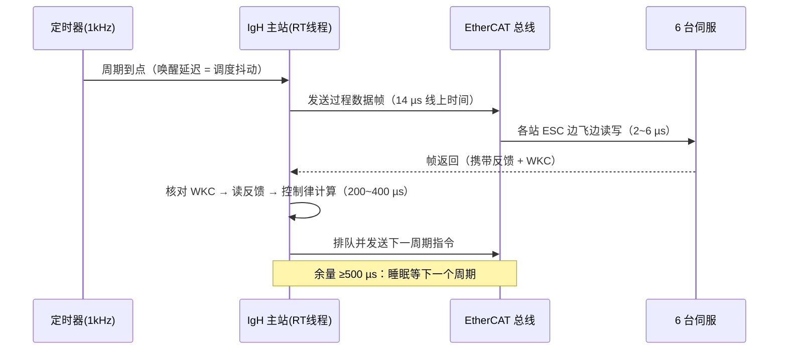

# B-E.15.1 六轴协作机械臂：多总线协同架构

> 所属章节：第五部 B. 总线协议 > E. 综合实战
>
> 难度：[M] | 预计阅读时间：90 分钟

## <span class="blue"> 本节导读

单条总线的机制在前面各组都讲过了：EtherCAT 在 B-D.12，CAN/CANopen 在 B-D.11，SPI/I2C/UART 在 B 板块。但真实的整机不是一条总线，是七八条总线同时跑——而"每条总线单独会用"和"七八条总线装进一台机器不出事"之间，隔着一整套系统设计问题：每条总线分给谁、为什么这么分、周期预算怎么核算、时钟怎么对齐、一条总线故障时整机怎么不死。

本篇以一台六轴协作机械臂控制器为对象，完整演练这套总线层面的系统设计。它是 B 扩展 E 板块的开篇，定位是"总线架构设计方法在一个具体整机上的走查"；通用方法论的提炼在 B-E.15.4，IgH 主站的安装与单轴走通在 B-D.12.5，本篇不重复它们。

本节覆盖：整机约束与拓扑选型（每条总线的"为什么是它"与被排除方案的定量理由）、实时域划分与两条硬规则、EtherCAT 周期预算的完整核算、多源时钟的对齐策略、总线故障的安全降级设计、软件栈组织与 bring-up 工具输出的逐段解读、整机联调顺序与排障表。

阅读顺序按决策依赖组织：先有整机约束才有拓扑，拓扑定了才谈得上划实时域，域划完才能核算周期预算，预算成立才能讨论同步与降级——每个新主题出现时，它要解决的问题都是上一节刚制造出来的。

## <span class="blue"> 整机对象与约束

先把设计对象钉死，后面每个决策都要回到这张表上算账：

| 项 | 约束 | 出处 |
|:---|:---|:---|
| 机型 | 六轴协作机械臂，额定负载 5 kg，重复定位精度 ±0.02 mm | 产品规格 |
| 控制周期 | 伺服位置环 1 kHz（1 ms） | 控制性能要求 |
| 安全等级 | 急停与 STO 满足 ISO 13849 PL d / Cat.3 | 协作机器人准入（ISO 10218-1、ISO/TS 15066） |
| 主控 | x86 工控机（4 核），PREEMPT_RT 内核 | 见下文选型理由 |
| 外设清单 | 6 台伺服驱动器、末端六维力矩传感器、6 个关节绝对编码器、底座 IMU、示教器、末端夹爪、视觉相机、上位机接口 | 硬件方案 |

> STO（Safe Torque Off，安全转矩关断）：IEC 61800-5-2 定义的安全功能——切断伺服驱动器功率级的 PWM 门极驱动信号，电机立即失去转矩输出。关键在于它是**硬件级**的：STO 信号走独立的安全回路进驱动器，不经过任何软件与通信总线，所以软件死机、总线断开都拦不住它动作。协作机器人的"拍急停后关节立即卸力"靠的就是它。

> 干接点：不提供电源、只通断的一对机械触点（急停按钮、安全门开关都是）。它把"安全回路的电"和"控制系统的电"完全隔开——安全回路自己供电自成环路，控制系统只读取触点状态，两边的电气故障互不传播。

主控为什么选 x86 工控机而不是嵌入式 SoC：EtherCAT 主站是纯软件实现，对 CPU 单核性能和网卡兼容性敏感；x86 工控机的网卡（Intel i210 等）有 IgH 原生驱动支持，且算力余量足以把轨迹规划和视觉放进同一台机器。代价是体积与功耗——协作臂控制柜里这个代价通常付得起。PREEMPT_RT 的作用是把 1 ms 周期任务的调度抖动压到几十微秒量级，没有这个前提，后面的周期预算全部不成立（PREEMPT_RT 的调优细节在 B-E.15.6，本篇只用它提供的抖动上限）。

## <span class="blue"> 拓扑与选型：每条总线分给谁

<!-- 【待补图】images/be15-1-整机总线拓扑与实时域.png（优先级：★必要，建议生图）
图名：六轴协作机械臂整机总线拓扑与实时域划分
生图提示词：技术插图风格，左半部分绘制主控工控机方框，向外引出八条总线分别连接：EtherCAT 线型拓扑串联 J1~J6 六台伺服（标注 1kHz/DC 同步）、SPI 总线两个片选（六维力矩传感器、六个关节编码器）、I2C 接底座 IMU、UART 接示教器、RS-485 接末端夹爪（标注 Modbus RTU）、GPIO 接双通道安全回路（急停/STO，用红色区别于其他总线）、MIPI CSI-2 接视觉相机、标准以太网接上位机（标注非实时）。右半部分用三个横向色带表示实时域划分：硬实时域（红，1ms 周期）、软实时域（黄，10~30ms）、非实时域（灰，事件驱动），用虚线箭头表示各总线归属的域。白底，蓝色系为主，安全相关元素用红色，细线条，无装饰，中文标注。横版 16:9。-->

```
 ┌──────────────── 主控（x86 工控机，PREEMPT_RT）────────────────┐
 │                                                                 │
 │  EtherCAT 口1 ── 线型 ── J1 ─ J2 ─ J3 ─ J4 ─ J5 ─ J6 ─┐        │
 │  （IgH 主站，1 kHz）                                    │        │
 │  EtherCAT 口2 ◀────────────── 冗余回环 ────────────────┘        │
 │                                                                 │
 │  SPI0  ── CS0：六维力矩传感器（末端）                            │
 │         ── CS1~6：各关节绝对编码器                               │
 │  I2C1  ── 底座 IMU（姿态监测）                                   │
 │  UART0 ── 示教器（人机交互）                                     │
 │  RS-485 ── 末端夹爪（Modbus RTU）                                │
 │  GPIO  ── 双通道安全回路（急停/STO 干接点）                       │
 │  MIPI CSI-2 ── 视觉相机（引导定位）                              │
 │  以太网口3 ── 上位机/示教软件（TCP/IP，非实时）                   │
 └─────────────────────────────────────────────────────────────────┘
```

EtherCAT 口2 是线缆冗余回环：线型拓扑末端接回主控第二个网口，线中间断一处时主站从两端分别够到两段从站，整链不掉（这是 EtherCAT 主站的线缆冗余功能，需要主站协议栈支持）。

选型理由表——每个分配都要回答"为什么是它"和"为什么不是别的"：

| 功能 | 总线 | 选型理由 | 被排除的方案与原因 |
|:---|:---|:---|:---|
| 6 轴伺服闭环 | EtherCAT 1 kHz | 从站 ESC 硬件转发，轴间 DC 同步 <1 µs；CoE 复用 CiA 402 伺服行规 | CAN：带宽算式见下；PROFINET：RT 变体抖动大于 EtherCAT，IRT 变体绑死 ERTEC 专用 ASIC；EtherNet/IP：无硬实时周期能力定位 |
| 力矩传感器 | SPI 8 MHz | 板内芯片级连接，SPI 延迟最低、协议最简 | EtherCAT IO 从站：多一颗 ESC 的成本与布板面积，板内场景无收益 |
| 关节编码器 | SPI 4 MHz ×6 | 同上，6 个片选分时复用一根总线 | 每轴独立 SPI 控制器：SoC/桥片没有那么多控制器 |
| 底座 IMU | I2C 400 kHz | 低速率传感器的标准接口，布线两根 | SPI：省不出有意义的延迟，且主流 IMU 芯片原生 I2C |
| 示教器 | UART | 低速人机交互，UART 软硬件都最省事 | USB：示教器侧要驻留 USB 协议栈，投入产出不成比例 |
| 夹爪 | RS-485 / Modbus RTU | 夹爪厂商的标准交付接口，差分信号抗现场干扰 | CAN：夹爪不支持，加协议网关多一个故障点 |
| 安全回路 | GPIO 干接点 | 安全功能独立于一切通信总线（黑色通道原则，B-D.14.3） | 走 EtherCAT PDO：非安全数据通道驱动安全功能是评审红灯 |
| 视觉 | MIPI CSI-2 | SoC/桥片原生相机接口，驱动成熟 | USB 相机：CPU 占用与传输延迟都更差 |
| 上位机 | 标准以太网 | 非实时管理流量，与控制网物理隔离 | 与控制网共网段：广播风暴可顶爆周期任务，违反确定性前提 |

表里有两行值得展开，因为它们的排除理由是定量的，不是口味问题。

**为什么 CAN 排不开 6 轴 1 kHz**。CAN 2.0 帧有效数据 8 字节，算上帧头、CRC、位填充余量，一帧线上约 130 bit。每个轴每周期至少要一帧指令（目标位置）加一帧反馈（实际位置+状态），6 轴 × 2 帧 × 130 bit ≈ 1560 bit，1 Mbps 波特率下仅线上时间就要 1.6 ms——还没算总线仲裁。1 ms 周期在 CAN 2.0 上物理排不开。CAN FD（5 Mbps 数据段）带宽上可行，但 CAN 系没有与 EtherCAT DC 等价的轴间硬件同步机制，6 轴位置环的执行时刻靠软件对齐，抖动直接吃进轨迹精度。这是"带宽"和"确定性"两个指标要分开算的典型例子。

**为什么安全回路不走总线**。功能安全里有个黑色通道原则：安全功能可以经过一个不做安全认证的通信通道（比如 EtherCAT + FSoE，B-D.14.3 讲过），但前提是端到端的安全协议与认证从站。用普通 PDO 映射一个"急停位"则什么保护都没有——主站死机、从站掉线、过程数据停留在旧值，急停位可能永远读不到变化。急停/STO 走纯硬件回路，GPIO 只负责让软件"知道发生了"，不负责"让它发生"。

> PDO（Process Data Object，过程数据对象）：EtherCAT/CANopen 里周期传输的实时数据单元——伺服的目标位置、实际位置、控制字、状态字都装在 PDO 里每周期间往返。方向细分：主站发给从站的叫 **RPDO**（Receive，从站视角的收），从站发回主站的叫 **TPDO**（Transmit）。与它相对的是 SDO/邮箱通道：非周期、按需读写的参数通道，用来读驱动器参数、下配置。判断一个数据该走哪类通道的标准就一个：它是否每周期都需要。

> CiA 402：CAN in Automation 协会制定的伺服驱动行规（IEC 61800-7 系列同源），定义了控制字/状态字位布局、驱动状态机（Switch on disabled → Ready to switch on → Switched on → Operation enabled）和运行模式。**CSP**（Cyclic Sync Position，循环同步位置模式，模式字 = 8）是机械臂的标配：主站每周期下目标位置，从站只做位置环跟随，轨迹规划全部在主站侧——多轴协调因此有了统一的计算点。EtherCAT 伺服通过 CoE（CANopen over EtherCAT）原样复用这套行规，所以换总线不换伺服语义。

> Modbus RTU：RS-485 物理层上的主从问答协议——主站发一帧"从站地址+功能码+寄存器地址+CRC"，从站回一帧数据。没有冲突检测、没有多主，一次只有一问一答，因此节奏天然慢（9600~115200 bps）。它活在夹爪这类"几十毫秒读一次够不够？够"的场合。

> ESC（EtherCAT Slave Controller）：EtherCAT 从站里的专用芯片（如 ET1100/AX58100 或集成进伺服 SoC），报文经过它时在硬件里"边飞边处理"——读走属于本站的输出、写入本站的输入，全程约 0.3~1 µs，不打扰从站 CPU。EtherCAT 的低延迟与拓扑无关性（线型/环型混着来）都是这颗芯片给的。

## <span class="blue"> 实时域划分

总线分完之后，软件按实时性分三域，各域的调度策略与总线访问权不同：

| 域 | 内容 | 周期 | 调度 |
|:---|:---|:---|:---|
| 硬实时 | EtherCAT 周期任务（读反馈→控制律→写指令）、安全回路监控 | 1 ms | SCHED_FIFO 90+，隔离核，mlockall |
| 软实时 | 轨迹规划、力控算法、视觉处理 | 10~30 ms | SCHED_FIFO 中优先级 |
| 非实时 | 示教器 UI、日志、以太网通信、文件 IO | 事件驱动 | 普通调度 |

> SCHED_FIFO / isolcpus / mlockall：硬实时三件套。**SCHED_FIFO** 是 Linux 的先进先出实时调度策略——同优先级先来先跑、高优先级无条件抢占，不看时间片；数字越大优先级越高，90+ 意味着系统里几乎只有中断能比它先跑。**isolcpus** 是内核启动参数（如 `isolcpus=2,3`），把指定 CPU 核从普通调度的负载均衡中摘除，上面的线程只有被显式绑核才会放上去——把硬实时线程绑到隔离核上，它就不会被普通线程抢核。**mlockall(MCL_CURRENT|MCL_FUTURE)** 把进程当前和未来的内存页全部锁进 RAM，防止缺页中断——一次缺页进 swap 是毫秒级惩罚，够毁掉几十个 1 ms 周期。

划域的两条硬规则，每条都对应一类真实事故：

1. **非实时域永远不能阻塞硬实时域**。EtherCAT 周期任务不打印日志、不分配内存、不碰文件系统；与外界的交换走无锁环形缓冲。打印一行日志听起来无害——`printf` 内部要拿 stdio 锁，日志线程拿着锁时被调度器切走，周期任务就在锁上等了一个不可控的时间。
2. **总线按域隔离优先级**。EtherCAT 网口专用（B-D.12.5 的纪律）；SPI/I2C/UART 的访问由对应域的线程独占，不跨域共享。跨域共享总线意味着互斥锁，互斥锁意味着**优先级反转**：高优先级的硬实时线程等一把锁，锁被低优先级线程持有，而低优先级线程又被中优先级线程抢占——三个线程优先级倒挂着排队，硬实时线程的等待时间理论上无界。火星探路者号 1997 年的反复复位就是这个问题。解法要么不共享（本篇的选择），要么用带优先级继承的锁（内核 `rt_mutex`，用户态 `PTHREAD_PRIO_INHERIT`）——但能不共享就不共享，锁的审计成本远高于多开一条访问通道。

## <span class="blue"> 带宽与周期预算

域划完了，1 ms 周期能不能成立需要核算。EtherCAT 主干的一次周期预算（6 轴，每轴 RPDO 10 B + TPDO 10 B，单个 LRW 数据报携带全部轴）：

```
 过程数据：6 轴 × (10 + 10) B = 120 B
 帧开销：以太网头 14 B + EtherCAT 头 2 B + 数据报头 10 B
        + WKC 字段 2 B + FCS 4 B = 32 B
 帧长：120 + 32 = 152 B（已超过 64 B 最小帧，无需补齐）
 线上时间（含前导码与帧间隙 20 B）：
        (152 + 20) × 8 bit / 100 Mbps ≈ 14 µs
 从站硬件转发延迟：6 站 × 0.3~1 µs ≈ 2~6 µs
 ────────────────────────────────────────────────
 通信侧合计 < 25 µs
 主站协议栈处理 + 控制律计算：实测 200~400 µs（取决于算法）
 总占用 < 500 µs，1 ms 周期留 ≥50% 余量 ← 工程合格线
```

> WKC（Working Counter，工作计数器）：每个 EtherCAT 数据报末尾的计数字段——报文经过从站时，每个成功完成读写动作的从站把它加一。主站收回报文后核对 WKC 是否等于"本周期应响应的从站操作数"。它是整机最重要的健康信号：WKC 不符 = 有从站没收到/没回 = 总线上出了事。帧长、带宽算的是性能账，WKC 算的是性命账。

这个核算的形状值得记住：**通信侧只占 25 µs，主站 CPU 时间占 200~400 µs**。机械臂这类系统带宽永远够、时间确定性永远稀缺——真正要预算的不是线上微秒，而是主站处理时间和抖动。所以工程上盯两个数：周期任务的**最坏执行时间**（WCET，用 `cyclictest` + `perf` 实测，见 B-E.15.6）和**最坏调度抖动**，两者之和必须小于周期余量。

一个周期内的事件次序，以及预算花在哪：



其余总线的负载率都是小菜：SPI 力矩传感器 10 ms 读一次几十字节，I2C IMU 20 ms 读一次十几字节，UART 示教器按人操作速率达几十字节每秒。它们不进周期预算，进的是另一个预算：CPU 中断与线程时间的总量。

## <span class="blue"> 时钟与同步策略

周期预算保证"每个周期跑得完"，时钟对齐保证"每个轴在同一时刻动"。整机的时钟策略分三层：

```
 EtherCAT 域内（硬同步）：
   DC 参考时钟（首个伺服从站的 ESC 时钟）
        │  EtherCAT DC 机制：主站周期性校准备从站时钟（B-D.12.3）
        ▼
   6 轴伺服 SYNC0 信号对齐，抖动 <1 µs ── 位置环在同一拍执行

 SPI/I2C 传感器（不同步，打时间戳）：
   读取时打主站 CLOCK_MONOTONIC 时间戳，
   控制算法侧按时间戳外推，补偿 10~20 ms 的采样延迟

 视觉（自由运行，时间戳进规划）：
   30 fps 自由采集，结果带时间戳进轨迹规划器，
   规划器按时间戳做运动学外推
```

> DC（Distributed Clocks，分布式时钟）：EtherCAT 的轴间同步机制——所有从站的 ESC 各有一本地时钟，主站测量传播延迟并周期性下发校正值，把全网时钟对齐到亚微秒级；各从站的 SYNC0 硬件信号由本校准后的时钟驱动，于是 6 个位置环在同一拍上执行。**没有 DC，"6 轴 1 kHz"只是六个各自为战的 1 kHz**——它们的相位缓慢漂移，笛卡尔轨迹上就表现为周期性抖动。

原则只有一条：**参与同一控制律的量必须时间对齐，不对齐的量带时间戳交给算法补偿。** 不要试图把 IMU、视觉硬塞进 EtherCAT 的同步节拍——给 I2C 传感器加同步触发的硬件成本与软件复杂度，远超在算法侧做一阶外推的成本。工程上区分"必须对齐"（多轴位置环，影响轨迹精度）与"可以补偿"（低频传感器，影响可建模）。

## <span class="blue"> 总线故障的安全降级

预算和同步解决"正常时跑得好"，这一节解决"出故障时死得对"。整机安全设计的总线维度：

| 故障 | 检测手段 | 降级动作 |
|:---|:---|:---|
| EtherCAT 从站掉线 | WKC ≠ 预期值 | 当周期内触发 Quick Stop + STO 流程，禁止用旧数据驱动 |
| EtherCAT 周期超时 | 主站看门狗（周期 >1.2 ms） | 同上 |
| EtherCAT 链路中断 | 冗余回环自动接管 + WKC 变化 | 回环接管则告警运行；接管失败按掉线处理 |
| 编码器 SPI 读数跳变 | 连续两次读比对 + CRC | 降速运行并报错；三次不一致停机 |
| 夹爪 Modbus 超时 | 应答超时计数 | 夹爪保持原位（非安全件），任务报错 |
| 安全回路 GPIO 动作 | 硬件中断 | 硬件级 STO 直接执行，软件只做记录与上报 |

> Quick Stop：CiA 402 状态机里的受控减速停机——按驱动器里配置的减速斜坡把电机刹停，转矩保持到停稳。它与 STO 的分工：Quick Stop 管"尽快停"（受控、可恢复），STO 管"停后绝不再有力矩"（硬件、不可旁路）。安全链路的完整动作是"先 Quick Stop 减速，到位后 STO 卸力"。

> ⚠️
> WKC 检查是每周期的必修课，不是可选项。EtherCAT 从站掉线后，主站侧过程数据镜像里留的是最后一次收来的旧值——继续拿它做闭环，等于蒙着眼开车：你控制的轴的反馈是历史，指令作用在一个已经不在总线上的驱动器上。`ecrt_domain_process` 之后、控制律计算之前核对 WKC，不一致就走安全停机路径，这是协作机器人量产代码里不可删减的三行。

降级表的设计逻辑：每个故障三要素——**谁检测**（该域里跑得最快的那个）、**降到哪**（安全状态 = 停机卸力，非安全故障 = 局部保持）、**软件还是硬件执行**（涉及人身的一律硬件）。夹爪那行是对照组：夹爪张开最坏掉个工件，不走安全链路，按普通故障处理——安全资源只花在人身安全上，这是功能安全的成本意识。

## <span class="blue"> 软件栈组织

进程与线程布局——单进程多线程，避免进程间通信延迟：

```
 ┌─────────────────────────────────────────────────┐
 │ RT 线程（core 2，SCHED_FIFO 90）：EtherCAT 循环   │
 │   ecrt 四段式（B-D.12.3），WKC 门禁，CiA 402 状态机 │
 │ RT 线程（core 2，SCHED_FIFO 80）：安全回路监控    │
 │ 软实时线程（core 1，SCHED_FIFO 50）：轨迹规划     │
 │ 普通线程（core 0）：视觉 / 示教器 / 网络 / 日志   │
 └─────────────────────────────────────────────────┘
 域间数据交换：无锁环形缓冲（SPSC），方向单向
```

> 无锁环形缓冲（SPSC，单生产者单消费者）：一块定长数组加读写两个游标，生产者只写、消费者只读，两边用原子操作（C11 `atomic` 带正确 memory order）发布游标。因为只有一个写一个读，不需要互斥锁——这正好绕开前面讲的优先级反转。它是硬实时线程对外交数据的**唯一**推荐通道：规划线程把轨迹点写进环形缓冲，EtherCAT 线程每周期读一个点；反过来状态数据由 EtherCAT 线程写、UI 线程读。方向必须单向——双向同一块缓冲会引入写-写竞争。

设备树侧的组织很薄：SPI/I2C/UART/GPIO/MIPI 外设各有节点；**EtherCAT 没有节点**——IgH 主站走独立网卡驱动（`ec_generic` 或 Intel 原生驱动），直接接管一块网卡，这块网卡对内核网络栈是消失的（`ifconfig` 里看不到，这正是"EtherCAT 网口专用"在系统里的样子）。

ecrt 实时循环骨架（结构与 B-D.12.5 相同，此处只列多轴组织的差异）：

```c
/* 每周期：收 → 门禁 → 逐轴控制 → 发 */
ecrt_master_receive(master);        /* 从网卡收报文 */
ecrt_domain_process(domain1);       /* 更新过程数据镜像、算 WKC */

/* WKC 门禁：不一致立即安全停机 */
if (domain1_wkc.counter != expected_wkc) {
    enter_safe_stop();              /* 停 PDO 输出、上报、走 Quick Stop/STO 流程 */
}

for (int ax = 0; ax < 6; ax++) {
    status[ax]  = EC_READ_U16(pd + off_status[ax]);   /* 状态字 */
    act_pos[ax] = EC_READ_S32(pd + off_actpos[ax]);   /* 实际位置 */
    ctrl[ax]    = cia402_next_cw(status[ax]);         /* 状态机推控制字 */
    EC_WRITE_U16(pd + off_ctrl[ax], ctrl[ax]);
    if (cia402_enabled(status[ax]))                   /* Operation enabled */
        EC_WRITE_S32(pd + off_tgt[ax], trajectory_next(ax)); /* 读规划环形缓冲 */
    else
        EC_WRITE_S32(pd + off_tgt[ax], act_pos[ax]);  /* 未使能：跟随当前位置 */
}

ecrt_domain_queue(domain1);         /* 排队待发 */
ecrt_master_send(master);           /* 发帧 */
```

`expected_wkc` 在配置期算好：每个从站每周期预期完成的读写操作数之和（比如每轴 LRW 一次成功加 3，6 轴 = 18，具体值以主站配置为准）。配置期定死、运行期比对——这就是为什么从站数量在运行中不能变。

## <span class="blue"> bring-up：工具输出逐段读

联调阶段的三份工具输出，每份都直接回答一个"通没通"的问题。

**第一份：加载 IgH 主站驱动后的 dmesg**（联调阶段 1 的 EtherCAT 部分）：

```
EtherCAT: Master driver 1.6.3
EtherCAT 0: Registering RTDM device.
EtherCAT 0: Link state of ecm0: UP.
EtherCAT 0: 6 slave(s) responding on main device.
EtherCAT 0: Slave states on main device: INIT.
EtherCAT 0: Scanning bus...
EtherCAT 0: Bus scanning completed in 112 ms.
EtherCAT 0: Using slave 0 as DC reference clock.
```

逐段读：

- `Master driver 1.6.3`：主站协议栈已加载，版本号对不上说明你装的 IgH 和计划不一致。
- `Link state of ecm0: UP`：网卡链路起来了。停在这步之前，查的是网线和网卡——`ifconfig` 里看不到这块卡是正常的（已被主站接管），用 `ethercat master` 查。
- `6 slave(s) responding`：总线上有 6 个站应答，数量必须等于实际轴数。少了：从下游往上游排查——EtherCAT 线型拓扑里第一个不应答的站之后全部不可见，问题就在"最后一个可见站"和"第一个不可见站"之间。
- `Slave states: INIT`：从站上电默认在 INIT，还没进工作循环——正常，状态推进是后面应用层的事。
- `Using slave 0 as DC reference clock`：DC 机制已生效，参考时钟是首站。这行不出现，说明从站不支持 DC 或配置有误——伺服同步的前提没了。

**第二份：`ethercat master` 输出**（确认链路质量）：

```
Master0
  Phase: Operation
  Active: yes
  Slaves: 6 on main device and 6 on link 0.
  Ethernet devices:
    Main: 00:e0:4c:68:01:23 (attached)
      Link: UP, 100 Mb/s, full-duplex, MII.
    Backup: 00:e0:4c:68:01:24 (attached)
      Link: UP, 100 Mb/s, full-duplex, MII.
  TX frames: 8640123, RX frames: 8640123, datagrams lost: 0
```

逐段读：`Phase: Operation` 表示主站处于运行态；`Active: yes` 表示应用层已接管（`ecrt_master_activate` 之后）；两个网口都 `UP` 且 100 Mb/s 全双工——EtherCAT 从站就是 100 Mbps，协商成千兆反而说明接错设备；`TX = RX` 且 `datagrams lost: 0` 是健康线，lost 非零说明有丢帧，查线缆质量与回环接线。

**第三份：`ethercat slaves` 输出**（联调阶段 2，六轴进 OP 后）：

```
0  0:0   OP  +  J1 Servo Drive (CSP/CSV/CST)
1  0:1   OP  +  J2 Servo Drive (CSP/CSV/CST)
2  0:2   OP  +  J3 Servo Drive (CSP/CSV/CST)
3  0:3   OP  +  J4 Servo Drive (CSP/CSV/CST)
4  0:4   OP  +  J5 Servo Drive (CSP/CSV/CST)
5  0:5   OP  +  J6 Servo Drive (CSP/CSV/CST)
```

列的含义：从站编号；`alias:position`（position 是拓扑序号，从主站方向数）；EtherCAT 状态机状态（`INIT → PREOP → SAFEOP → OP`，只有 OP 才交换过程数据）；`+` 是错误标志位（无错误，`E` 表示该站有错误）；设备名。**六轴全 OP 是"总线层通了"的判据**——任何一轴停在 SAFEOP，通常是 PDO 配置与该站实际映射不符，用 `ethercat pdos -p <编号>` 对比该站与其他五站的配置差异。

## <span class="blue"> 联调顺序

整机 bring-up 按"先单总线、后集成、再闭环"推进，每阶段有明确的出口判据——判据不是形式，它决定"能不能进入下一阶段"：

1. **单总线逐个通**：EtherCAT 用 B-D.12.5 流程单轴 CSP 走通；SPI/I2C/UART 各自用命令行工具（`spidev_test`/`i2cget`/`minicom`）读到数据；安全回路用万用表验证干接点动作。判据：每条总线独立可读写，且 dmesg 输出与上一节第一份样本一致。
2. **六轴 EtherCAT 集成**：六轴同时进 OP，DC 锁定（dmesg 有 reference clock 行），全轴使能后点动。判据：72 小时老化运行，`datagrams lost` 恒为 0、WKC 错误计数为 0。
3. **闭环集成**：轨迹规划接入，跑标准测试轨迹（空载→额定负载）。判据：轨迹跟踪误差与重复定位精度达到产品规格。
4. **故障注入**：拔 EtherCAT 网线、堵 SPI 片选、拍急停——验证安全降级表的每一行。判据：所有故障注入的结果都是表上写的那一行，无一例外。**这一阶段的产出是安全评审的直接证据，不是可省环节。**

## <span class="blue"> 排障：整机级故障

| 症状 | 优先怀疑 | 验证方法 |
|:---|:---|:---|
| 某轴偶发抖动 | 该轴编码器 SPI 采样与控制周期不同步 | 时间戳对齐检查；控制律输入加延迟补偿 |
| 周期性（每 N 秒）位置跳变 | 非实时线程抢占了硬实时核 | `cat /proc/interrupts` 核对中断是否绑错核；`ps -eLo pid,cls,rtprio,comm` 核对调度类与优先级 |
| 六轴整体周期性轨迹摆动 | DC 未锁定或 SYNC0 配置错误 | dmesg 查 reference clock 行；`ethercat dc` 查各校正值 |
| 视觉引导轨迹漂移 | 视觉时间戳与运动时间不同源 | 统一到 `CLOCK_MONOTONIC` 并标定采集到应用的固定延迟 |
| 急停后伺服仍有力矩 | STO 路径被软件逻辑旁路 | 硬件回路审查：STO 必须是纯硬件链路，软件只有知情权 |
| 大负载下周期超时 | 控制律计算时间超预算 | `perf` 剖周期任务；算法优化，或降频到 500 Hz 重新核算预算 |
| WKC 间歇性不符 | 线缆/连接器接触不良，或 EMI | 晃动线束复现；查 RJ45 屏蔽与接地；`ethercat master` 看 lost 计数 |
| 系统运行数小时后卡死 | 非实时域内存泄漏顶爆，或环形缓冲溢出未处理 | 环形缓冲必须有满/空策略（丢最旧或拒写），不允许静默覆盖 |

## <span class="blue"> 本节总结

本篇用一台六轴协作臂走完了总线系统设计的完整链条：选型表里的每个"为什么是它"都要有定量理由（CAN 是被 1.6 ms 线上时间排掉的，不是被口味排掉的）；实时域划分的两条硬规则各自对应一类真实事故（锁与阻塞）；周期预算的形状是通信侧 25 µs、主站 CPU 占大头——带宽永远够，确定性永远稀缺；时钟策略只对齐"必须对齐"的轴，其余交给时间戳；安全降级表按"谁检测、降到哪、软硬件谁执行"三要素逐故障设计。最值得记住的一条：WKC 门禁是整机安全和盲目运行之间的三行代码，它不在任何一条单总线的教程里，但它在每一台量产协作机器人的代码里。

### 速查表

| 问题 | 一句话答案 | 详见 |
|:---|:---|:---|
| 伺服闭环为什么是 EtherCAT | 1 ms 周期 CAN 排不开（1.6 ms 线上时间），DC 同步无对手 | 拓扑与选型 |
| 硬实时三件套 | SCHED_FIFO 90+ + isolcpus 绑核 + mlockall 锁页 | 实时域划分 |
| 周期预算合格线 | 总占用 < 周期 50%，盯 WCET 与抖动而非带宽 | 带宽与周期预算 |
| 哪些量要时间对齐 | 参与同一控制律的量；其余打时间戳算法补偿 | 时钟与同步 |
| 从站掉线怎么发现 | WKC ≠ 预期值，当周期触发 Quick Stop + STO | 安全降级 |
| 总线通没通看什么 | dmesg 从站数与 DC 行 → `ethercat master` 零丢帧 → `ethercat slaves` 全 OP | bring-up |
| 联调总顺序 | 单总线逐个通 → 六轴集成 72h 老化 → 闭环 → 故障注入 | 联调顺序 |

## <span class="blue"> 本节自查

读完本篇，你应能独立完成以下动作：

- 为一台六轴机械臂画出总线拓扑，并对每条总线给出选型理由与被排除方案的定量论证
- 把整机软件划分到三个实时域，陈述两条划域硬规则及各自防的事故形态
- 完整核算 EtherCAT 主干的周期预算，指出预算大头在哪里、合格线是什么
- 设计"参与同一控制律的量如何时间对齐"的策略，说清哪些必须同步、哪些可以补偿
- 写出 WKC 门禁的三行逻辑，说明 `expected_wkc` 何时定值、防的是什么事故
- 逐段读懂 bring-up 三份工具输出（dmesg / `ethercat master` / `ethercat slaves`），用它们定位"链路、从站数、状态机"三类问题
- 排出整机 bring-up 的四阶段顺序及各阶段出口判据，并说明故障注入为什么是安全评审证据

## <span class="blue"> 配套资源

- 本篇引用的协议细节：B-D.11（CAN/CANopen）、B-D.12（EtherCAT/IgH 主站与 DC）、B-D.14.3（FSoE 与黑色通道）、B-E.15.6（PREEMPT_RT 调优与 cyclictest）
- ISO 10218-1 — 机器人安全要求；ISO/TS 15066 — 协作机器人；IEC 61800-5-2 — STO 等驱动安全功能；CiA 402 / IEC 61800-7 — 伺服行规
- IgH EtherCAT Master 文档与 `ethercat` 命令行工具手册
- LinuxCNC / ROS 2 control — 多轴控制软件栈的开源参照
