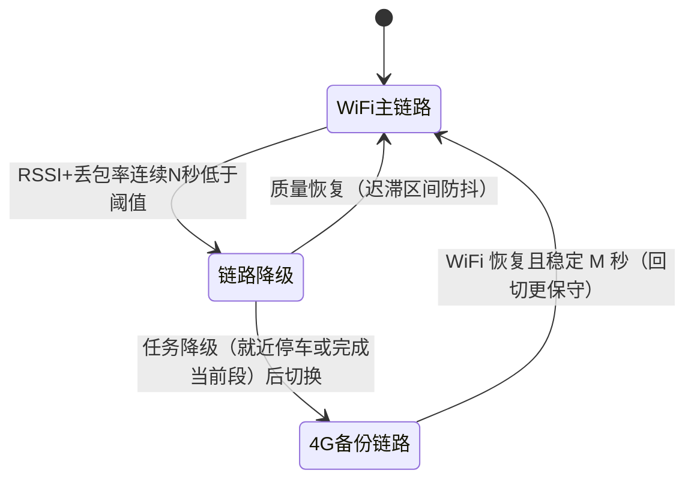

# B-E.15.2 移动机器人 AGV 总线方案

> 所属章节：第五部 B. 总线协议 > E. 综合实战
>
> 难度：[E] | 预计阅读时间：90 分钟

## <span class="blue"> 本节导读

B-E.15.1 的机械臂选了 EtherCAT，本篇的 AGV 选了 CAN FD——同样是"让电机转起来"，两台机器收敛到完全不同的答案。这个差异不是工程师口味不同，而是需求约束不同：机械臂要 6 轴硬同步（DC 的地盘），AGV 是 2 轮差速加大量低速外设加大带宽传感器，它的痛点是布线要穿过运动部件、现场电磁环境恶劣、成本敏感——CAN FD 的仲裁寻址与抗扰性比 EtherCAT 的极致周期更对路。本篇做与 15.1 同构的总线架构演练，重点在对比中看清"总线选型是被系统需求逼出来的，不是参数表比出来的"。

本篇是 E 板块第二篇，与 15.1 共享方法论（选型表、周期/负载预算、安全降级、联调判据），差异在总线主体从 EtherCAT 换成 CAN FD，因此负载率核算、ID 规划、错误帧处理这些 CAN 特有的功课在本篇展开。

本节覆盖：AGV 整机约束与拓扑选型（含 CAN FD vs EtherCAT 的定量对比）、CAN 布线与电气规则、节点与报文 ID 规划、PDO 映射实操、总线负载率的完整核算、实时性策略、传感器链路三层划分、总线故障的安全降级、无线双链路的切换设计、bring-up 工具输出逐段解读、联调顺序与排障表。

阅读顺序沿 15.1 的决策链：约束定拓扑，拓扑定 ID 规划与负载率，负载率成立才谈实时性策略，最后传感器、降级、无线是整机的三个外挂面——每一节的问题都是上一节的答案引出来的。

## <span class="blue"> 整机对象与约束

| 项 | 约束 | 出处 |
|:---|:---|:---|
| 机型 | 差速驱动 AGV，额定载重 1.5 t，最大速度 1.5 m/s | 产品规格 |
| 控制周期 | 速度环 250 Hz（4 ms），非硬同步 | 差速控制无轴间相位要求 |
| 安全等级 | ISO 3691-4（工业车辆安全），安全扫描仪区域防护 | 行业准入 |
| 主控 | 嵌入式 SoC（4 核 Cortex-A55），Linux | 成本与功耗约束 |
| 外设清单 | 左右轮伺服、顶升机构、BMS、激光雷达、安全激光扫描仪、超声波 ×8、HMI 屏、WiFi/4G、辅助电机 | 硬件方案 |

与 15.1 的对照从这张表就开始了：机械臂的控制周期是 1 ms 硬实时加轴间亚微秒同步，AGV 是 4 ms 软实时加"两轮别差太多就行"——后者的时间误差由里程计融合算法吸收。同步要求的缺席，是 AGV 不必上 EtherCAT 的第一块多米诺骨牌。

> 里程计（Odometry）：由轮速积分推算车位姿的方法——左轮走 100 个脉冲、右轮走 102 个脉冲，就知道车向右偏了一个角度。它是 AGV 定位的骨架，激光 SLAM 只是用来修正它的累积漂移。两轮反馈的**采样时刻差**会直接折算成航向误差，所以后面对 CAN 帧时间戳较真。

## <span class="blue"> 拓扑与选型

<!-- 【待补图】images/be15-2-AGV总线拓扑.png（优先级：★必要，建议生图）
图名：差速 AGV 整机总线拓扑
生图提示词：技术插图风格，中心绘制 AGV 主控 SoC 方框，向外引出七条总线：CAN FD 总线用粗线串联左轮伺服、右轮伺服、顶升机构、BMS 四个节点（标注 500k/2M、两端 120Ω 终端电阻符号），千兆以太网接激光雷达与安全激光扫描仪（安全扫描仪用红色标注"安全认证器件"并画一条硬件切断动力的粗红线），I2C 接 8 路超声波阵列（画成车头弧形排列），MIPI DSI+I2C 接触摸屏，SDIO 接 WiFi6 模块、USB 接 4G 模块（两者标注"双链路备份"），RS-485 接辅助电机。白底，蓝色系为主，安全路径用红色，细线条，无装饰，中文标注。横版 16:9。-->

```
 ┌──────────────── AGV 主控（SoC，Linux）────────────────┐
 │                                                        │
 │  CAN FD（500k/2M）──┬─ 左轮伺服                         │
 │        （两端 120Ω） ├─ 右轮伺服                         │
 │                     ├─ 顶升机构                          │
 │                     └─ BMS（电池管理）                   │
 │                                                        │
 │  千兆以太网 ──┬─ 激光雷达（UDP 点云）                    │
 │              └─ 安全激光扫描仪（UDP，区域入侵检测）       │
 │  I2C ── 超声波阵列 ×8（近距避障）                        │
 │  MIPI DSI + I2C ── 7 寸屏 + 电容触摸（HMI）              │
 │  SDIO ── WiFi6 模块（厂内调度）                          │
 │  USB ── 4G 模块（远程备份链路）                          │
 │  RS-485 ── 辅助电机驱动器（Modbus RTU）                  │
 └────────────────────────────────────────────────────────┘
```

> BMS（Battery Management System，电池管理系统）：动力电池包的"监护人"板——逐串测量电芯电压、温度、电流，估算 SOC（剩余电量百分比）与 SOH（健康度），执行过充/过放/过温保护。它在 CAN 上的角色是慢变量信息源（SOC/温度 100 ms 广播）加急告警源（EMCY 通道）。AGV 的充电策略、续班调度都以它的 SOC 为输入，所以 BMS 报文虽然不实时，却是调度系统的决策依据——丢 BMS 心跳的降级动作不是停车，是禁止接受新任务。

选型理由表——每条总线的"为什么是它"与"为什么不是别的"：

| 功能 | 总线 | 理由 | 被排除方案 |
|:---|:---|:---|:---|
| 左右轮伺服 | CAN FD | 差速无轴间硬同步需求；CANopen 伺服生态成熟；总线型拓扑线缆可走拖链，差分抗扰 | EtherCAT：ESC 成本与线型专用布线不划算（定量见下）；RS-485：带宽与错误处理机制不足 |
| 顶升/BMS | 同上 CAN FD | 与驱动轮共网，ID 规划隔离优先级 | 独立总线：浪费控制器与布线 |
| 激光雷达 | 千兆以太网 UDP | 点云 10+ MB/s，厂商原生 UDP 输出 | USB：点云带宽与驱动复杂度都不合适 |
| 安全扫描仪 | 以太网 UDP | 厂商标准接口；安全判定在扫描仪内部完成，总线只传结果 | 串行接入控制环路：违反安全独立原则 |
| 超声波阵列 | I2C | 低速、近距离、成本极低 | 单总线/并口：布线复杂 |
| HMI | MIPI DSI + I2C 触摸 | SoC 原生显示/触摸路径 | HDMI：转接芯片多余 |
| 无线 | SDIO（WiFi6）+ USB（4G） | 双链路异构备份：WiFi 断时 4G 接管 | 单链路：厂区漫游存在盲区 |
| 辅助电机 | RS-485 / Modbus RTU | 风机/毛刷这类辅助件的标准接口 | CAN：辅助驱动器多为 Modbus 交付 |

> CAN FD（CAN with Flexible Data-rate）：CAN 2.0 的两个扩展——数据段从 8 字节扩到 64 字节，且数据段可切换到更高的第二波特率（BRS，比如仲裁段 500 kbps、数据段 2 Mbps）。仲裁机制与错误处理与 CAN 2.0 完全一致。**CAN FD 控制器向后兼容 CAN 2.0 帧**：经典 CANopen 网络（8 字节帧）可以原样跑在 CAN FD 控制器上，只是用不到 FD 的加速；要用满 64 字节与 BRS，需要 CANopen FD（CiA 1301）或厂商自定义 FD 报文。本篇的 AGV 正是"FD 控制器跑经典 CANopen"的常见形态。

表里第一行值得展开算一笔账，因为它是本篇与 15.1 的分水岭。**EtherCAT 在 AGV 上不划算的三个定量理由**：①ESC 成本——每个节点多一颗从站控制器芯片（或集成授权的 SoC），4 个节点约多出 4 颗芯片的 BOM；②拓扑——EtherCAT 线型拓扑要求网线沿链逐级串接，AGV 的左右轮分处车体两侧，线型布线要绕行；CAN 是总线型，一根主干线穿拖链，四个节点就近挂支线；③收益为零——EtherCAT 的核心卖点 DC 同步，在"两轮速度环 4 ms"的需求下没有使用场景。反过来，CAN 的卖点全部命中 AGV 的痛点：差分信号抗车载电磁干扰、总线型布线、仲裁机制天然支持"谁急谁先发"。

**安全扫描仪为什么单独一层**。与 15.1 的黑色通道原则同源：安全激光扫描仪（Sick microScan3、Pilz PSENscan 这类）内部是安全认证器件，区域入侵判定在它内部完成，输出的是安全继电器触点（直接切断动力）外加一份 UDP 状态上报。主控软件**读不到**原始点云做安全判定——也不该读到：让未经认证的软件做安全判定是 ISO 3691-4 评审红灯。以太网在这里只是记录仪，安全链路是硬件。

## <span class="blue"> CAN 布线与电气：车载环境的生存条件

AGV 的 CAN 主干要穿过拖链、贴近电机动力线走，电气设计是总线能不能活过试用期的大头。四条硬规则：

1. **终端电阻**：总线两端各一个 120 Ω，并联后等效 60 Ω——用万用表在总线任意点量 CANH-CANL 之间的直流电阻，读数应在 55~65 Ω。读 120 Ω 说明只装了一个（信号反射，高速段误码），读无穷大说明两个都没装。这是 bring-up 第一天的测量项，也是 bus-off 排障的第一怀疑对象。
2. **支线长度**：500 kbps 下支线（stub）不超过 0.3 m，节点间距之和建议小于总长的 1/10。支线是阻抗不连续点，长了就是天线兼反射源。AGV 上四个节点就近挂主干，别为省线走星型。
3. **线缆**：拖链段用高柔性双绞屏蔽线（百万次弯折等级），屏蔽层单点接地。CANH/CANL 必须是同一对双绞线——差分抗扰的前提是两条线受到的干扰一样。
4. **电气隔离**：BMS 挂在电池高压域，伺服驱动器功率侧是几十伏动力电——这些节点必须用**隔离型 CAN 收发器**（或收发器+隔离电源），把总线逻辑地与各自功率地隔开。省掉隔离的代价是地环路：电机启停的电流尖峰通过地线灌进 BMS 的采样前端，表现为 SOC 读数跳变和莫名错误帧。

> 差分信号抗扰的原理：CAN 用 CANH 与 CANL 的电压**差**表示位值，干扰以共模形式同时加到两条线上时被接收器直接减掉。前提是干扰对两条线"一样大"——这就是双绞（等间距耦合）与单点接地（避免地电位差叠加成差模）要同时满足的原因。

PDO 映射是 ID 规划的另一半——COB-ID 决定"这帧是谁的"，映射决定"帧里 8 个字节装什么"。以左轮伺服 TPDO1 为例，用 SDO 写映射参数：

```bash
# 0x1A00 = TPDO1 映射参数，子索引 0 是映射条目数
cansend can0 601#2F.00.1A.00.00           # 清映射（写 0）
cansend can0 601#23.00.1A.01.10.00.41.60  # 条目1：状态字 0x6041，16 bit
cansend can0 601#23.00.1A.02.20.00.4C.60  # 条目2：实际速度 0x604C，32 bit（CiA 402 对象）
cansend can0 601#2F.00.1A.00.02           # 生效：2 个条目
```

`601#` 是发往节点 1 的 SDO（0x600+Node-ID）；`23`/`2F` 是 SDO expedited 写命令（4 字节/1 字节）。映射条目按小端读：`10.00.41.60` = 值 0x60410010，拆成"对象 0x6041、子索引 0x00、长度 0x10 bit"——0x6041 状态字、0x604C 实际速度都是 CiA 402 标准对象，与 15.1 机械臂的伺服语义同源。映射改完后 0x181 帧的 8 字节布局随之确定，主站侧按此解包——**映射表要进设计文档，产线刷错映射的故障形态是"数据全是乱的但通信完全正常"**，比断线难查得多。

**FD 能力在 AGV 上的真实用例**：日常控制流量用经典帧就够（前面核算过负载率仅 45%），FD 的 64 字节数据段有两个落点：①**固件升级**——伺服驱动器/顶升控制器的固件包按 64 字节分块走 SDO 块传输或厂商自定义 FD 报文，刷写时间比经典 8 字节帧缩短约 7 倍，AGV 车队的批量升级从小时级降到分钟级；②**高密度传感器节点**——若未来接入 CAN 接口的毫米波雷达，每周期几十字节的目标列表必须 FD 才装得下。选型时定 CAN FD 控制器而不是 CAN 2.0 控制器，买的就是这两个未来的可能性——控制器价差可以忽略，固件升级通道的有无在三年后的运维期是实打实的成本差。

## <span class="blue"> CAN FD 节点与 ID 规划

单条 CAN FD 挂四类节点。CAN 的仲裁机制决定 ID 规划就是优先级规划：总线冲突时逐位比较 ID，**ID 越小优先级越高**（显性位 0 赢隐性位 1，低 ID 前面 0 多）——冲突帧不损坏不重发等待，输家自动延后，这是 CAN 区别于以太网碰撞退避的核心特性，也是"ID=优先级"原则（B-D.11.2）的机制基础。

仲裁逐位比的实例：0x181（左轮 TPDO）与 0x184（BMS 状态）同时发——二进制前 7 位相同（`0011000`），第 8 位 0x181 是 0、0x184 是 1。每个发送节点在发隐性位（1）时回读总线：BMS 节点发出 1 却读到 0（左轮发的显性位覆盖了它），立即知道自己输了，当位停止发送转为只听。全程没有任何一帧损坏、没有退避计时器、没有浪费一个位时间——左轮帧原样发完，BMS 等总线空闲自动重发。这就是"高优先级帧延迟有硬保证"的机制出处，也是 ID 规划表的每一行都不能随手填的原因。

| 节点 | Node-ID | 周期报文 | COB-ID | 周期 | 优先级理由 |
|:---|:---:|:---|:---|:---:|:---|
| 左轮伺服 | 1 | TPDO1 状态字+实际速度 | 0x181 | 4 ms | 驱动控制最实时 |
| 右轮伺服 | 2 | TPDO1 同上 | 0x182 | 4 ms | 同上 |
| 顶升机构 | 3 | TPDO1 状态 | 0x183 | 20 ms | 任务级动作 |
| BMS | 4 | 电池 SOC/温度/告警 | 0x184+ | 100 ms | 慢变量；告警走 EMCY 不占周期位 |
| 心跳 | — | Heartbeat | 0x701~0x704 | 100 ms | 节点存活监控 |
| 主站下发 | — | RPDO1 目标速度+控制字 | 0x201~0x203 | 4/20 ms | 下行指令优先级高于反馈 |

> COB-ID / Node-ID：CANopen 的寻址约定——**Node-ID** 是节点地址（1~127），**COB-ID** 是报文标识符，由"功能码 + Node-ID"拼成：TPDO1 = 0x180 + Node-ID，RPDO1 = 0x200 + Node-ID，EMCY = 0x80 + Node-ID，Heartbeat = 0x700 + Node-ID。所以看到 0x181 就知道是 1 号节点的第一路周期上行报文。TPDO/RPDO 的概念与 15.1 的卡片一致：T/R 是从站视角的发/收，周期数据走 PDO，按需参数走 SDO。

> EMCY（Emergency，紧急报文）：CANopen 的故障主动上报通道——节点内部检出故障（过流、过温、编码器断线）时不等主站来问，立即发一帧 0x80+Node-ID，载荷含 2 字节错误码、1 字节错误寄存器、5 字节厂商自定义。它是"慢节点出急事"的出口：BMS 的周期报文 100 ms 才来一次，但过温告警必须立刻到。

> Heartbeat（心跳）：节点周期广播一个字节的自身状态（0=BOOTUP，4=STOPPED，5=OPERATIONAL，127=PRE-OPERATIONAL），主站按"超时未收到"判节点死亡。它与 EMCY 互补：EMCY 报"我病了"，心跳缺失报"我死了"。

PDO 与 SDO 的分工在规划阶段就要定死：周期数据（目标速度、实际速度、状态字）走 PDO，预映射、到点自发；非周期数据（参数读写、PDO 映射配置、厂商调试命令）走 SDO，主站逐个问答。SDO 是**不可靠时序**通道——它优先级低（0x580/0x600 段在仲裁中排在 TPDO 之后）且无重传保证之外的时限，所以运行期控制量严禁走 SDO：用 SDO 下发目标速度的系统，负载高峰时指令延迟不可控，这是 AGV 低速抖动的一个经典根因。

**负载率核算**（仲裁段 500 kbps，经典 8 字节帧约 130 bit/帧）：

```
 左轮：TPDO 4ms + RPDO 4ms → 2 帧/4ms
 右轮：同上             → 2 帧/4ms
 顶升：2 帧/20ms       → 0.5 帧/4ms
 BMS ：1 帧/100ms      → 0.04 帧/4ms
 心跳：4 节点/100ms    → 0.16 帧/4ms
 ────────────────────────────────
 合计 ≈ 4.7 帧/4ms ≈ 1175 帧/s × 130 bit ≈ 153 kbps
 负载率 ≈ 153 / 500 ≈ 31%（常态）
 叠加偶发 SDO 与错误重传余量，工程上按 45% 估计
```

CAN 总线负载率的工程合格线是常态 < 50%、峰值 < 70%：CAN 的仲裁保证高优先级帧总能抢到，但负载越高，低优先级帧（BMS、心跳）的延迟越不可控——心跳延迟过大会误判节点死亡。核算完必须用 `canbusload` 实测确认，计算漏掉的东西（厂商私有报文、上电风暴）只有实测看得见。

两条设计纪律：

1. **EMCY 的接收处理必须写**。BMS 过温、伺服过流都走 EMCY 主动上报；主站收到后的动作是减速停车并上报调度系统，不是写日志了事。量产代码评审时，"EMCY handler 存在且有实机注入测试记录"是检查项。
2. **轮速反馈的时间戳要对齐**。左右轮 TPDO 到达时刻有先后（仲裁顺序与 ID 差），4 ms 周期下两轮采样差可达毫秒级。1.5 m/s 直行时，2 ms 的采样差折算成两轮位移差 3 mm，轮距 0.5 m 的底盘上就是约 0.34° 的瞬时航向角误差——里程计融合时必须按 CAN 帧的硬件时间戳对齐，不能假设"同一周期读到的就是同时采样的"。

## <span class="blue"> 实时性策略：环在哪一级闭合

15.1 的机械臂把位置环放在主控（EtherCAT 每周期下目标位置，主控算控制律），AGV 不做这个选择——**差速底盘的速度环闭合在伺服驱动器内部**，主控只以 4~10 ms 的刷新率下发目标速度（RPDO），驱动器本地以 1 kHz 以上的内部周期闭合速度环与电流环。分工的机制理由：

- 主控环（4 ms）管的是**轨迹级**的事：目标线速度/角速度随路径变化，4 ms 刷新的阶梯足够平滑；
- 驱动器内环管的是**物理级**的事：电机电流、轮速的快速扰动，这些量的时间常数是亚毫秒级，跨总线闭合环等于把总线抖动直接注入电流环。

这个分工直接改写实时性预算：主控侧的 4 ms 是"目标值刷新率"，不是环周期——抖动容忍度从机械臂的几十微秒放宽到毫秒级。**结论是 AGV 主控不强制 PREEMPT_RT**：主线内核 + SCHED_FIFO 中优先级的控制线程通常够用；是否上 PREEMPT_RT 按实测决定——`cyclictest` 跑 24 小时，若最大抖动超过刷新周期的 1/4（1 ms）再上。这与 15.1"PREEMPT_RT 是一切预算的前提"形成第二个对照：实时性投入跟着环的位置走，不跟着"机器人"的标签走。

但有两处不放宽：EMCY 的处理延迟（安全相关，目标百毫秒级）和 CAN 帧的硬件时间戳（SocketCAN 的 `SO_TIMESTAMPING`，里程计对齐的命根子）——这两处与调度抖动无关，是代码必须提供的硬特性。

## <span class="blue"> 传感器链路分层

```
 安全层：安全激光扫描仪（安全认证器件）
   → 区域入侵直接输出安全继电器信号切断动力（硬件路径）
   → 同时 UDP 上报区域状态供上层记录与减速预策略
   原则：安全判定在认证器件内完成，不依赖主控软件

 感知层：激光雷达（SLAM 建图与避障决策输入）
   → UDP 点云 → 主控 SLAM 节点
   → 时间对齐：雷达时钟与主控 PTP/NTP 对齐，
     点云时间戳与轮速里程计（CAN 帧时间戳）进同一时间轴

 补盲层：超声波 ×8（I2C 轮询，50 ms 周期）
   → 覆盖激光雷达的近距盲区与透明/吸波材质盲区
```

> SLAM（Simultaneous Localization and Mapping，同步定位与建图）：边走路边画地图、边用地图定自己位置的算法族。它对总线的要求不是带宽均值而是**时间戳质量**——点云里每个点带采集时刻，与里程计对齐时 10 ms 的时钟偏差在 1.5 m/s 下就是 15 mm 的定位误差，比雷达本身的测距误差还大。

> PTP（Precision Time Protocol，IEEE 1588）：局域网时钟同步协议，主从时钟交换带硬件时间戳的报文，把从钟对齐到微秒级。NTP 是毫秒级的广域方案，给传感器对齐用太糙；激光雷达与主控之间用 PTP 或厂商私有同步，以雷达手册为准。

感知层的带宽也值得核算一次：主流 16 线激光雷达每秒约 30 万点，每点 UDP 打包占 12~18 字节，原始流约 40~70 Mbps——千兆以太网占用不到 10%，但**已经超过 100M 网口的物理能力**，这就是拓扑里雷达必须挂千兆口的定量原因。用 UDP 不用 TCP 的原因：点云是流式传感数据，丢一帧等下一帧即可，TCP 的重传机制会把瞬时拥塞放大成延迟尖峰——传感数据要最新不要完整，这与文件传输的需求正好相反。

三层各司其职，分层的价值在故障分析时显现：避障误停车，先看是安全层（扫描仪区域配置）还是补盲层（超声波串扰）；定位漂移，查感知层的时间对齐。**8 路超声波的串扰机制**值得展开：超声波靠回波测距，8 路同时发射时，A 路的声波打到障碍物反射进 B 路的接收头，B 路把别人的回波当自己的——近距离虚警就是这么来的。解法是分时触发：8 路轮着发，每路 6 ms（声波往返 1 米约 6 ms），一圈 48 ms，正好落在 50 ms 轮询周期内。

## <span class="blue"> 总线故障的安全降级

AGV 的降级设计沿用 15.1 的三要素（谁检测、降到哪、软硬件谁执行），但故障谱不同——CAN 网络的故障形态比 EtherCAT 丰富（错误帧、bus-off、仲裁延迟），无线链路则是 EtherCAT 场景没有的新变量：

| 故障 | 检测手段 | 降级动作 |
|:---|:---|:---|
| 伺服节点掉线 | Heartbeat 超时 + TPDO 周期监控 | 差速丢一轮 = 车辆不可控：立即停车，上报调度 |
| CAN 错误计数爬升 | `ip -s link` 周期轮询 berr-counter | 超阈值先降速（电气环境恶化是渐进的），到 ERROR-PASSIVE 报警 |
| CAN bus-off | SocketCAN 错误帧/状态变化 | restart-ms 自动恢复；恢复失败停车——bus-off 期间车辆无驱动指令通道 |
| EMCY 过温/过流 | EMCY handler | 减速停车 + 上报，等人工或远程确认后复位 |
| 安全扫描仪区域入侵 | 硬件安全继电器（不经过软件） | 硬件切断动力；软件从 UDP 上报获知并记录 |
| 超声波全部失效 | 轮询连续超时 | 降速运行（补盲层不是安全层），靠安全扫描仪兜底 |
| 无线断链 | RSSI+丢包率阈值（N 秒确认） | 任务降级：就近停车或完成当前段，切 4G 上报 |
| 里程计/雷达时间戳失锁 | PTP 偏移量监控 | 定位降级为纯里程计 + 降速，禁止高速行驶 |

与 15.1 机械臂的对照点：机械臂的降级终点是"停机卸力"（STO），AGV 的降级终点是"停车"——但**停车本身是个受控动作**：差速底盘丢一条驱动通道时不能"自由滑行"，要主动刹停，否则 1.5 t 的车体在坡道上就是事故。所以伺服掉线的降级不是"什么都不做"，而是"用剩下的通道做受控停车"——左轮掉线时右轮执行制动序列。降级表里每一行都要回答"用什么残余资源完成降级"，没有残余资源的故障（双轮同时掉线）才轮到纯硬件抱闸。

## <span class="blue"> 无线双链路

```
 主链路：WiFi6（SDIO）—— 厂内 AP 漫游，低延迟调度通信
 备份链路：4G（USB）—— 出厂区/WiFi 盲区时接管
```

切换策略的状态机：



> RSSI（Received Signal Strength Indicator，接收信号强度指示）：无线链路质量的读数，单位 dBm，-50 很好、-70 可用、-85 以下接近断链。单看 RSSI 不够——信号强但丢包高（干扰）的情况常见，所以判据是"RSSI + 丢包率"组合，且要**连续 N 秒**低于阈值才动作：瞬时抖动触发切换会造成两个链路间乒乓。

注意状态机的两个不对称设计：降级用 N 秒确认，回切用更长的 M 秒确认——切换有成本（连接重建、调度会话迁移），宁可慢不可抖。这与机械臂的 WKC"当周期即停"形成对照：**安全链路要最快，通信链路要最稳**，两种时间观取决于动作失败的代价方向。

无线链路的总线视角只有一条：**它是不可靠链路，控制闭环不能跨无线**。调度系统下发的是任务（去 A 点取货），不是实时控制量（速度指令）；实时闭环永远在车载主控本地。断链期间 AGV 按最后任务继续或就地停车，两者都是安全姿态。这条原则同样适用于 AMR、无人车和远程驾驶场景——远程驾驶的"低延迟视频+远程接管"是把人放进慢环，车载的快速环路依然是本地的。

> 漫游（Roaming）：WiFi 客户端在多个 AP 之间移动时切换接入点的过程——扫描、认证、关联重建，切换窗口通常几十到几百毫秒，期间链路中断。厂区覆盖靠多 AP 漫游实现，所以"AGV 过漫游区"是每台车每天几十次的常态事件，不是故障——无线降级状态机就是为这个常态设计的。802.11r（快速漫游）能把切换窗口压到 50 ms 内，但它缩短的是中断时长，不改变"会中断"这个事实。

## <span class="blue"> bring-up：工具输出逐段读

CAN FD 初始化（固化进 systemd 服务）：

```bash
ip link set can0 type can bitrate 500000 sample-point 0.75 \
    dbitrate 2000000 dsample-point 0.70 fd on restart-ms 100
ip link set can0 txqueuelen 1000 up
```

两个 sample-point 的含义：采样点 0.75 表示位时间的 75% 处采样——车载长线束场景把采样点后移（0.75~0.875）能容忍更大的传播延迟；`restart-ms 100` 是总线关闭（bus-off）后 100 ms 自动恢复，没有它，一次严重干扰就永久掉线。

> ⚠️
> 全网节点的 bitrate 与 sample-point 必须逐位一致。波特率差 1% 以内时通信"看起来正常"，但错误计数缓慢爬升，数小时或数天后某个节点 bus-off——这是间歇性疑难故障的经典根因，bring-up 阶段用 `ip -details` 逐节点核对参数比事后查半个月日志便宜得多。

**第一份：`ip -details -statistics link show can0`**（健康基线与故障定位的核心）：

```
3: can0: <NOARP,UP,LOWER_UP,ECHO> mtu 72 qdisc pfifo_fast state UP qlen 1000
    link/can  promiscuity 0
    can <FD> state ERROR-ACTIVE (berr-counter tx 0 rx 0) restart-ms 100
      bitrate 500000 sample-point 0.750
      tq 25 prop-seg 14 phase-seg1 15 phase-seg2 10 sjw 1
      dbitrate 2000000 dsample-point 0.700
    RX:  bytes    packets  errors  dropped  missed  mcast
         8641200  108015   0       0        0       0
    TX:  bytes    packets  errors  dropped  carrier  collsns
         4320600  54007    0       0        0        0
```

逐段读：

- `mtu 72`：MTU 72 说明 CAN FD 模式生效（经典 CAN 是 16）——看到 16 说明 `fd on` 没进去。
- `state ERROR-ACTIVE`：CAN 错误状态机的健康态。每个节点维护收发两个错误计数器，发错/收错加分、成功减分；超过 127 进 ERROR-PASSIVE（只能被动听），超过 255 进 **bus-off**（彻底下线，靠 restart-ms 复活）。排障时先看这个状态和计数器。
- `(berr-counter tx 0 rx 0)`：交付基线必须是 0。rx 计数爬升说明线上有干扰或波特率不匹配——常见根因是某节点波特率配错，它发的每个位都是错误帧。
- `bitrate 500000 sample-point 0.750` 与 tq/segment 分解：确认实际生效参数与配置一致，采样点由内核按时段参数算出。
- RX/TX 的 errors/dropped 恒 0 是健康线；dropped 非零通常是应用层收不及（`txqueuelen` 与接收线程优先级问题）。

**第二份：`candump -ta can0`**（正常流量样本，交付前录制存档）：

```
(1694345550.004812)  can0  201  [8]  40 62 00 00 00 00 00 00
(1694345550.005031)  can0  181  [8]  60 62 00 00 3A 01 00 00
(1694345550.005198)  can0  202  [8]  40 62 00 00 00 00 00 00
(1694345550.005412)  can0  182  [8]  60 62 00 00 41 01 00 00
(1694345550.106330)  can0  084  [8]  10 30 01 00 00 00 00 00
```

逐行读：第一列绝对时间戳（里程计对齐用的就是它）；`201/202` 是主站下发左右轮的 RPDO1，`181/182` 是两轮上行的 TPDO1——看时序可见 201 与 181 间隔约 0.2 ms，说明总线空闲、仲裁无竞争。最后一行 `084` 是 BMS（Node-ID 4）的 EMCY：载荷前两字节 `10 30` 是错误码 0x3010（CANopen 标准码：过温），第三字节 `01` 是错误寄存器（温度类）——读到这一行，主站的 EMCY handler 就该执行减速停车。

**第三份：`canbusload can0@500000`**：输出按秒刷新总线负载率百分比、帧数与比特数。用法是建立基线（正常运行约 45%）后看趋势——负载率缓慢爬升往往意味着某节点 PDO 周期被误改或错误帧重传风暴，比故障爆发早几小时露出端倪。

**交付前的主动验证**：用 `cansend` 从主站侧模拟 BMS 的 EMCY 帧，验证 EMCY 处理链真实存在且动作正确：

```bash
cansend can0 084#10.30.01.00.00.00.00.00   # 模拟 BMS 过温 EMCY
```

预期行为：主站在百毫秒级内进入减速停车流程并上报调度。这条注入测试要进出厂检验项——EMCY 处理链是"写了但从来没真跑过"代码的重灾区，第一次触发不该发生在客户现场。

## <span class="blue"> 联调顺序

AGV 的 bring-up 同样按"先单总线、后集成、再闭环"推进，出口判据与 15.1 同构：

1. **单总线逐个通**：CAN FD 先量 60 Ω 终端再通电，`candump` 确认四个节点的周期帧全部到位；以太网 ping 通两个激光器件并确认 UDP 流；I2C 用 `i2cdetect` 扫到 8 路超声波；WiFi/4G 各自拨通。判据：每条总线独立可读写，`ip -details` 的 berr-counter 恒 0。
2. **底盘集成**：两轮伺服使能，开环给定小速度直行/原地旋转。判据：直行 10 m 跑偏量达标（暴露轮径标定与时间戳对齐问题）；`canbusload` 负载率与核算值偏差 <10%。
3. **导航闭环**：SLAM 建图→定位→路径跟踪逐级接入。判据：典型路线重复跑 20 次，定位丢失次数为 0，PTP 偏移量全程在阈值内。
4. **故障注入与安全验证**：拔 CAN 支线、制造 bus-off、遮挡超声波、cansend 注入 EMCY、遮挡安全扫描仪、AP 断电模拟漫游断链——逐条对安全降级表。判据：每行故障的实际动作与表上写的一致；扫描仪触发的停车必须是硬件路径执行（拔主控网线照样停）。**这一阶段的记录是 ISO 3691-4 评审证据。**

第 2 阶段的"直行跑偏"判据值得多说一句：它是两轮时间戳对齐问题最早的暴露点——开环直行时理论航向误差为零，实测跑偏量按来源分解：轮径差是线性累积，时间戳差是速度相关项，两者用不同速度的两次直行就能区分开。

## <span class="blue"> 排障：整机级故障

| 症状 | 优先怀疑 | 验证方法 |
|:---|:---|:---|
| 里程计原地打转 | 单轮 TPDO 丢失（该轮 EMCY 或掉线） | candump 核对 0x181/0x182 双通道都在 |
| 直线跑偏 | 两轮采样时间未对齐 / 轮径参数未标定 | 时间戳差统计；轮径标定流程 |
| 负载率缓慢爬升 | 某节点 PDO 周期被误改 / 错误帧重传 | canbusload 趋势 + `ip -s link` 错误计数 |
| can0 进 bus-off | 终端电阻缺失/短路/波特率不匹配节点 | 万用表量总线两端间电阻应 ≈60Ω（两个 120Ω 并联）；逐个下电隔离法找问题节点 |
| 避障误触发停车 | 超声波串扰（8 路同发互串） | 改分时触发，核对轮询时序 |
| 过 WiFi 漫游区后任务丢 | 漫游断链期间无降级策略 | 模拟断链测试切换路径 |
| BMS 告警主站无反应 | EMCY 接收处理缺失 | cansend 模拟 EMCY 帧验证处理链 |
| 定位周期性跳变 | 雷达与主控时钟未对齐（PTP 失锁） | 查 PTP 偏移量；点云与里程计时间戳差统计 |

## <span class="blue"> 本节总结

本篇与 15.1 构成一组对照实验：同一套总线架构方法，在"6 轴硬同步"约束下收敛到 EtherCAT，在"2 轮差速 + 成本 + 布线"约束下收敛到 CAN FD——选型表里每行的排除理由都必须能算出数或指出机制。CAN 特有的功课在此展开：ID 即优先级（仲裁机制的直接推论）、负载率常态 50% 合格线（低优先级帧延迟的不可控性）、错误计数器与 bus-off 状态机（车载环境的日常）、终端电阻与隔离收发器（总线在拖链和动力线旁边的生存条件）。最值得记住的一条跨篇原则：控制闭环不跨无线链路——调度给任务，闭环在本地，这条原则比任何具体总线选型都活得久。

### 速查表

| 问题 | 一句话答案 | 详见 |
|:---|:---|:---|
| AGV 为什么不用 EtherCAT | 无轴间同步需求，ESC 成本与线型布线纯付出无收益 | 拓扑与选型 |
| CAN 的优先级怎么定 | ID 越小优先级越高（仲裁逐位比，显性赢隐性） | ID 规划 |
| 负载率合格线 | 常态 < 50%，峰值 < 70%，核算完 canbusload 实测 | 负载率核算 |
| 节点死了怎么发现 | Heartbeat 超时；节点病了看 EMCY（0x80+Node-ID） | 概念卡片 |
| 直线跑偏先查什么 | 两轮 CAN 帧时间戳对齐，再查轮径标定 | 设计纪律 2 |
| bus-off 怎么恢复 | restart-ms 自动复活；根因查 60Ω 终端与波特率 | 排障表 |
| 无线断链车怎么办 | 任务降级就地停车或完成当前段，闭环永不跨无线 | 无线双链路 |
| 主控要不要 PREEMPT_RT | 速度环在驱动器内闭合，主控是刷新率不是环周期——cyclictest 实测说话 | 实时性策略 |
| 直行跑偏怎么分解 | 轮径差线性累积、时间戳差速度相关，两种速度两次直行分开 | 联调顺序 |

## <span class="blue"> 本节自查

读完本篇，你应能独立完成以下动作：

- 为差速 AGV 画出总线拓扑，并对每条总线给出选型理由与被排除方案的定量论证
- 解释"机械臂上 EtherCAT、AGV 上 CAN FD"背后的需求约束推导（同步需求、BOM、拓扑）
- 规划单条 CAN FD 上四类节点的 ID 分配，完整核算负载率并说出合格线与理由
- 说明两轮采样时间差对里程计的影响量级及时间戳对齐的修正方法
- 画出安全层/感知层/补盲层的分层，指出安全判定为什么必须留在认证器件内
- 用 `ip -details -statistics` 读出 CAN 错误状态机与计数器，用 candump 识别 RPDO/TPDO/EMCY 三类帧
- 陈述"控制闭环不跨无线链路"原则，并解释切换状态机两个不对称迟滞的设计意图
- 说明"速度环闭合在驱动器内部"的分工理由，以及它对主控 PREEMPT_RT 决策的影响
- 执行 CAN 布线四项验收（60 Ω 终端、支线长度、拖链线缆、隔离收发器）并说出每条的故障形态

## <span class="blue"> 配套资源

- 本篇引用的协议细节：B-D.11（CAN FD 物理层/协议层/SocketCAN/CANopen）、B-D.14.1（车载以太网与 TSN）
- ISO 3691-4 — 工业车辆（AGV/AMR）安全要求；CiA 301 / CiA 1301 — CANopen 与 CANopen FD
- can-utils 文档（candump/canbusload/cansend）；Linux SocketCAN 文档
- ROS 2 Nav2 文档（导航栈与传感器时间同步实践）
- 激光雷达与安全扫描仪厂商的 UDP 协议手册（以所用型号为准）
