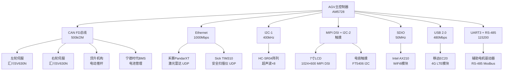

# B-E.15.2 移动机器人AGV总线方案

> 所属章节：第五部 B. 总线协议 > B-E.15 复杂系统实战
>
> 难度：[E][M] | 预计阅读时间：45分钟

## <span class="blue"> 本节导读

恭喜你来到了全书的综合实战环节！本节以一个真实的**仓储物流AGV**（自动导引车）为案例，把前面学过的CAN FD、Ethernet、I2C、MIPI DSI、SDIO、USB、RS-485七条总线串在一起，形成一个完整的嵌入式总线系统。这不是单个总线的玩具实验，而是一个能在电商仓库日均搬运2000件货物的生产级机器人。我们会从总线拓扑设计开始，走完设备树配置、SocketCAN调试、激光雷达UDP点云接收、ROS2多总线融合，直到故障排查的完整闭环。准备好了吗？系好安全带，我们要开真家伙了。

## <span class="blue"> 总线拓扑设计 [E]

先看整体架构。AGV的大脑是AM5728（双核Cortex-A15），所有外设通过不同总线接入，各司其职。



**设计要点**：运动控制走CAN FD（硬实时、确定延迟），感知走Ethernet（带宽大），安全冗余（激光雷达+超声波双保险），HMI走MIPI DSI（高分辨率显示），无线通信双链路（WiFi6低延迟 + 4G远距离备份）。

## <span class="blue"> AGV总线方案总览 [E]

| 总线 | 挂载设备 | 功能 | 速率 |
|------|---------|------|------|
| CAN FD | 左轮伺服（汇川SV630N） | 差速驱动、位置/速度闭环 | 500k/2M |
| CAN FD | 右轮伺服（汇川SV630N） | 差速驱动、位置/速度闭环 | 500k/2M |
| CAN FD | 顶升机构（电动推杆+伺服） | 货物顶升/下降 | 500k/2M |
| CAN FD | 宁德时代BMS | 电池SOC/温度/均衡 | 500k/2M |
| Ethernet UDP | 禾赛PandarXT激光雷达 | 2D点云SLAM建图 | 1000Mbps |
| Ethernet UDP | Sick TIM310安全扫描仪 | 安全区域入侵检测 | 100Mbps |
| I2C | HC-SR04超声波×8 | 近距离避障（<3m） | 400kHz |
| MIPI DSI | 7寸LCD | HMI操作界面显示 | 1.5Gbps/lane |
| I2C | FT5406电容触摸 | 触控输入 | 400kHz |
| SDIO | Intel AX210 | WiFi6无线通信 | 50MHz×4 |
| USB 2.0 | 移远EC20 | 4G LTE远程备份链路 | 480Mbps |
| RS-485 | 辅助电机驱动器 | Modbus RTU外设控制 | 115200bps |

**带宽评估**：CAN FD仲裁域500kbps+数据域2Mbps，实际负载控制在60%以内；Ethernet主干跑UDP点云约15MB/s，千兆网绰绰有余；I2C超声波8个模块轮询，周期50ms足够。关键是**CAN FD的PDO周期**——左右轮伺服每4ms发一次TPDO，顶升机构20ms，BMS 100ms，算下来总线负载约45%，留有裕量。

## <span class="blue"> 设备树完整配置 [M]

下面是AGV的完整设备树片段，基于AM5728-IDK，可直接在Linux 5.10+使用。

```dts
/* AM5728 AGV 完整设备树配置 */
/dts-v1/;

#include "am5728.dtsi"

/ {
    model = "AM5728-AGV";
    compatible = "ti,am5728-agv", "ti,am5728";

    /* GPIO 扩展节点 */
    gpio_expander: pcf8574@38 {
        compatible = "nxp,pcf8574";
        reg = <0x38>;
        gpio-controller;
        #gpio-cells = <2>;
    };
};

/* DCAN1 → CAN FD 总线（运动控制 + BMS） */
&dcan1 {
    pinctrl-names = "default";
    pinctrl-0 = <&dcan1_pins>;
    status = "okay";

    /* CAN FD 收发器 TJA1441 */
    can-transceiver {
        max-bitrate = <2000000>;
    };
};

/* DCAN2 → CAN FD 总线（顶升 + 辅助） */
&dcan2 {
    pinctrl-names = "default";
    pinctrl-0 = <&dcan2_pins>;
    status = "okay";

    can-transceiver {
        max-bitrate = <2000000>;
    };
};

/* CPSW Ethernet → 激光雷达 + 安全扫描仪 */
&cpsw_emac0 {
    pinctrl-names = "default";
    pinctrl-0 = <&cpsw_pins>;
    phy-mode = "rgmii-id";
    phy-handle = <&eth_phy0>;
    status = "okay";
};

&cpsw_emac1 {
    pinctrl-names = "default";
    pinctrl-0 = <&cpsw_pins>;
    phy-mode = "rgmii-id";
    phy-handle = <&eth_phy1>;
    status = "okay";
};

&davinci_mdio {
    eth_phy0: ethernet-phy@1 {
        reg = <1>;
    };
    eth_phy1: ethernet-phy@2 {
        reg = <2>;
    };
};

/* I2C1 → 超声波传感器阵列（8路HC-SR04通过PCA9548扩展） */
&i2c1 {
    pinctrl-names = "default";
    pinctrl-0 = <&i2c1_pins>;
    clock-frequency = <400000>;
    status = "okay";

    pca9548@70 {
        compatible = "nxp,pca9548";
        reg = <0x70>;
        #address-cells = <1>;
        #size-cells = <0>;

        i2c@0 { /* 左前超声波 */
            reg = <0>;
            #address-cells = <1>;
            #size-cells = <0>;
            srf04@57 { compatible = "devantech,srf04"; reg = <0x57>; };
        };
        i2c@1 { /* 左中超声波 */
            reg = <1>;
            srf04@58 { compatible = "devantech,srf04"; reg = <0x58>; };
        };
        i2c@2 { /* 左后超声波 */
            reg = <2>;
            srf04@59 { compatible = "devantech,srf04"; reg = <0x59>; };
        };
        i2c@3 { /* 右前超声波 */
            reg = <3>;
            srf04@5a { compatible = "devantech,srf04"; reg = <0x5a>; };
        };
        i2c@4 { /* 右中超声波 */
            reg = <4>;
            srf04@5b { compatible = "devantech,srf04"; reg = <0x5b>; };
        };
        i2c@5 { /* 右后超声波 */
            reg = <5>;
            srf04@5c { compatible = "devantech,srf04"; reg = <0x5c>; };
        };
        i2c@6 { /* 正前超声波 */
            reg = <6>;
            srf04@5d { compatible = "devantech,srf04"; reg = <0x5d>; };
        };
        i2c@7 { /* 正后超声波 */
            reg = <7>;
            srf04@5e { compatible = "devantech,srf04"; reg = <0x5e>; };
        };
    };
};

/* MIPI DSI → 7寸LCD */
&dsi {
    status = "okay";
    vdd-supply = <&vcc_3v3>;

    port {
        dsi_out: endpoint {
            remote-endpoint = <&lcd_in>;
            data-lanes = <0 1 2 3>;
        };
    };

    panel@0 {
        compatible = "chunghwa,claa070wp03";
        reg = <0>;

        port {
            lcd_in: endpoint {
                remote-endpoint = <&dsi_out>;
            };
        };
    };
};

/* I2C2 → FT5406 电容触摸 */
&i2c2 {
    pinctrl-names = "default";
    pinctrl-0 = <&i2c2_pins>;
    clock-frequency = <400000>;
    status = "okay";

    touchscreen@38 {
        compatible = "focaltech,ft5406";
        reg = <0x38>;
        interrupt-parent = <&gpio5>;
        interrupts = <5 IRQ_TYPE_EDGE_FALLING>;
        reset-gpios = <&gpio5 6 GPIO_ACTIVE_LOW>;
        touchscreen-size-x = <1024>;
        touchscreen-size-y = <600>;
    };
};

/* MMC2 → SDIO WiFi6 (AX210) */
&mmc2 {
    pinctrl-names = "default";
    pinctrl-0 = <&mmc2_pins>;
    vmmc-supply = <&vcc_3v3>;
    bus-width = <4>;
    cap-sd-highspeed;
    non-removable;
    status = "okay";

    /* SDIO WiFi 通过 mmc-pwrseq 上电时序 */
    wifi@1 {
        compatible = "intel,ax210";
        reg = <1>;
        ieee80211-freq-limit = <2400000 6000000>; /* 2.4G + 5G + 6GHz */
    };
};

/* USB1 → 4G LTE 模块 */
&usb1 {
    dr_mode = "host";
    status = "okay";
};

/* UART3 → RS-485 (半双工，DE/RE 由 GPIO 控制) */
&uart3 {
    pinctrl-names = "default";
    pinctrl-0 = <&uart3_pins>;
    status = "okay";

    rs485-rts-delay = <0 0>;
    rts-gpio = <&gpio3 16 GPIO_ACTIVE_HIGH>;
    rs485-rts-active-high;
    linux,rs485-enabled-at-boot-time;
};
```

## <span class="blue"> CAN FD 节点分配 [E]

| 节点ID | 设备 | 功能 | 数据格式 | 周期 |
|--------|------|------|----------|------|
| 0x01 | 左轮伺服（汇川SV630N） | 速度/位置/转矩反馈 | TPDO1: 速度(4B)+位置(4B) | 4ms |
| 0x02 | 右轮伺服（汇川SV630N） | 速度/位置/转矩反馈 | TPDO1: 速度(4B)+位置(4B) | 4ms |
| 0x03 | 顶升机构伺服 | 顶升高度/状态 | TPDO: 高度(2B)+状态(1B) | 20ms |
| 0x10 | 宁德时代BMS | SOC/电压/温度 | TPDO: SOC(1B)+电压(2B)+温度(1B) | 100ms |
| 0x00 | NMT主站 | 节点状态管理 | NMT命令(1B)+节点ID(1B) | 事件触发 |
| 0x7F | LSS服务 | 节点配置 | 标称ID分配 | 配置阶段 |

⚠️ **陷阱**：CAN FD 总线负载 > 70% 时，帧排队延迟从稳定的几十微秒暴增到毫秒级。导航控制算法每4ms读取一次伺服反馈，如果总线抖动导致数据延迟超过1ms，差速补偿就会算错，AGV会走S形甚至撞货架。**必须限制PDO频率**——左右轮4ms、顶升20ms、BMS 100ms，总负载控制在60%以下。

## <span class="blue"> SocketCAN 配置与诊断 [E]

```bash
#!/bin/bash
# AGV CAN FD 总线初始化脚本 /opt/agv/init_can.sh

# CAN1 → 左右轮伺服 + BMS
ip link set can0 type can bitrate 500000 dbitrate 2000000 fd on
ip link set can0 up

# CAN2 → 顶升机构
ip link set can1 type can bitrate 500000 dbitrate 2000000 fd on
ip link set can1 up

# 设置队列长度（高速通信需要更大的txqueuelen）
ip link set can0 txqueuelen 1000
ip link set can1 txqueuelen 1000

echo "CAN FD 总线初始化完成"
echo "can0: $(cat /sys/class/net/can0/statistics/rx_packets) 包接收"
echo "can1: $(cat /sys/class/net/can1/statistics/rx_packets) 包接收"
```

**实时抓包诊断**：

```bash
# 抓取左轮伺服（节点0x01）的所有帧
candump can0,0x001:0x7FF &

# 发送SDO读取左轮实际速度（COB-ID 0x601, 索引0x606C）
cansend can0 601#2B.6C.60.00.00.00.00.00

# 监控总线负载（关键！必须<60%）
cangw -A can0 &
canbusload can0@500000,2000000

# 示例输出（健康状态）：
# can0@500000/2000000  512  3452  45%  |XXXXXXXXXXXX        |
```

## <span class="blue"> 激光雷达 UDP 数据接收 [E]

禾赛PandarXT通过Ethernet UDP广播点云数据，端口2368。下面是用C++编写的接收+解析程序。

```cpp
/* pandar_receiver.cpp - 禾赛PandarXT UDP点云接收 */
#include <sys/socket.h>
#include <netinet/in.h>
#include <arpa/inet.h>
#include <unistd.h>
#include <cstring>
#include <cstdio>

#define PANDAR_PORT     2368
#define PANDAR_IP       "192.168.1.201"   /* 雷达IP */
#define AGV_IP          "192.168.1.10"    /* AGV本机IP */
#define PACKET_SIZE     1206                /* PandarXT数据包大小 */

struct PandarPacket {
    uint8_t  header[4];     /* 0xEE 0xFF 0x01 0xDD */
    uint16_t azimuth;       /* 水平角度 (0-35999, 1/100度) */
    uint8_t  payload[1200]; /* 100个点 × 12字节 */
} __attribute__((packed));

int main() {
    int sock = socket(AF_INET, SOCK_DGRAM, 0);
    int opt = 1;
    setsockopt(sock, SOL_SOCKET, SO_REUSEADDR, &opt, sizeof(opt));

    struct sockaddr_in addr = {};
    addr.sin_family = AF_INET;
    addr.sin_port = htons(PANDAR_PORT);
    addr.sin_addr.s_addr = INADDR_ANY;
    bind(sock, (struct sockaddr*)&addr, sizeof(addr));

    /* 加入组播（如雷达使用组播发送） */
    struct ip_mreq mreq = {};
    mreq.imr_multiaddr.s_addr = inet_addr("239.0.0.1");
    mreq.imr_interface.s_addr = inet_addr(AGV_IP);
    setsockopt(sock, IPPROTO_IP, IP_ADD_MEMBERSHIP, &mreq, sizeof(mreq));

    PandarPacket pkt;
    int frame_count = 0;

    while (true) {
        ssize_t n = recv(sock, &pkt, sizeof(pkt), 0);
        if (n != PACKET_SIZE) continue;

        /* 校验帧头 */
        if (pkt.header[0] != 0xEE || pkt.header[1] != 0xFF)
            continue;

        float azimuth_deg = ntohs(pkt.azimuth) / 100.0f;

        /* 解析100个激光点 */
        for (int i = 0; i < 100; i++) {
            uint8_t *p = &pkt.payload[i * 12];
            uint16_t distance = (p[1] << 8) | p[0];  /* mm */
            uint16_t intensity = (p[3] << 8) | p[2];
            uint16_t azimuth   = (p[5] << 8) | p[4];

            if (distance > 0 && distance < 30000) {
                /* 有效点：存入点云缓存供SLAM使用 */
            }
        }

        if (++frame_count % 100 == 0) {
            printf("接收 %d 帧, 当前角度: %.1f°\n", frame_count, azimuth_deg);
        }
    }

    close(sock);
    return 0;
}
```

编译运行：`g++ -O2 pandar_receiver.cpp -o pandar_receiver && ./pandar_receiver`

## <span class="blue"> ROS2 多总线融合节点 [M]

这是整个AGV软件系统的核心——一个ROS2 Node，同时订阅CAN FD伺服状态、Ethernet雷达点云和I2C超声波数据，融合后输出导航控制指令。

```python
#!/usr/bin/env python3
"""
agv_fusion_node.py - AGV多总线数据融合ROS2节点
订阅：
  - /canfd/servo_status  (左右轮速度、位置)
  - /lidar/points        (激光雷达点云)
  - /ultrasonic/ranges   (8路超声波距离)
发布：
  - /cmd_vel             (导航速度指令)
  - /safety/emergency    (紧急制动)
"""

import rclpy
from rclpy.node import Node
from geometry_msgs.msg import Twist
from sensor_msgs.msg import PointCloud2, PointField, Range
from std_msgs.msg import Float64MultiArray, Bool
import struct
import can
import math


class AGVFusionNode(Node):
    def __init__(self):
        super().__init__('agv_fusion_node')

        # CAN FD 接口
        self.can_bus = can.interface.Bus(
            channel='can0', bustype='socketcan', fd=True
        )

        # 订阅者
        self.create_subscription(
            PointCloud2, '/lidar/points', self.lidar_cb, 10)
        self.create_subscription(
            Float64MultiArray, '/ultrasonic/ranges', self.ultra_cb, 10)

        # 发布者
        self.cmd_vel_pub = self.create_publisher(Twist, '/cmd_vel', 10)
        self.emer_pub = self.create_publisher(Bool, '/safety/emergency', 1)

        # 状态变量
        self.left_speed = 0.0   # m/s
        self.right_speed = 0.0
        self.lidar_min_dist = 999.0   # m
        self.ultra_ranges = [999.0] * 8

        # 定时器：50Hz控制周期
        self.timer = self.create_timer(0.02, self.control_loop)

        # CAN FD 接收线程
        self.create_timer(0.004, self.can_recv_loop)

        self.get_logger().info('AGV Fusion Node 启动')

    def can_recv_loop(self):
        """读取CAN FD伺服反馈"""
        try:
            while True:
                msg = self.can_bus.recv(timeout=0.001)
                if msg is None:
                    break
                # 左轮TPDO (COB-ID 0x181, 节点1)
                if msg.arbitration_id == 0x181 and len(msg.data) >= 8:
                    self.left_speed = struct.unpack('>f', bytes(msg.data[0:4]))[0]
                # 右轮TPDO (COB-ID 0x182, 节点2)
                elif msg.arbitration_id == 0x182 and len(msg.data) >= 8:
                    self.right_speed = struct.unpack('>f', bytes(msg.data[0:4]))[0]
        except Exception as e:
            self.get_logger().warn(f'CAN读取错误: {e}')

    def lidar_cb(self, msg: PointCloud2):
        """激光雷达点云回调 - 提取最近障碍物距离"""
        min_dist = 999.0
        fmt = '<fff' if msg.is_bigendian == False else '>fff'
        point_size = struct.calcsize(fmt)

        for offset in range(0, len(msg.data), msg.point_step):
            x, y, z = struct.unpack(fmt, msg.data[offset:offset+point_size])
            dist = math.sqrt(x*x + y*y)
            if dist < min_dist:
                min_dist = dist

        self.lidar_min_dist = min_dist / 1000.0  # mm → m

    def ultra_cb(self, msg: Float64MultiArray):
        """超声波距离回调"""
        if len(msg.data) >= 8:
            self.ultra_ranges = list(msg.data[0:8])

    def control_loop(self):
        """50Hz 主控制循环 - 多传感器融合决策"""
        twist = Twist()
        emergency = False

        # 取超声波最小距离（正前方 #6 + 左前 #0 + 右前 #3）
        front_ultra = min(self.ultra_ranges[6], self.ultra_ranges[0],
                          self.ultra_ranges[3])

        # 融合决策：激光雷达长距离 + 超声波短距离互补
        if self.lidar_min_dist < 0.5 or front_ultra < 0.3:
            # 紧急制动
            twist.linear.x = 0.0
            twist.angular.z = 0.0
            emergency = True
            self.get_logger().warn(
                f'紧急制动! 雷达={self.lidar_min_dist:.2f}m '
                f'超声波={front_ultra:.2f}m'
            )
        elif self.lidar_min_dist < 1.5 or front_ultra < 0.8:
            # 减速避障
            twist.linear.x = 0.3
            # 根据左右超声波差值调整偏航
            left_avg = (self.ultra_ranges[0] + self.ultra_ranges[1]) / 2
            right_avg = (self.ultra_ranges[3] + self.ultra_ranges[4]) / 2
            twist.angular.z = 0.3 * (right_avg - left_avg)
        else:
            # 正常行驶 - 沿规划路径
            twist.linear.x = 1.0   # 1m/s 正常速度
            twist.angular.z = 0.0

        self.cmd_vel_pub.publish(twist)

        emer_msg = Bool()
        emer_msg.data = emergency
        self.emergency_pub.publish(emer_msg)

    def destroy_node(self):
        self.can_bus.shutdown()
        super().destroy_node()


def main(args=None):
    rclpy.init(args=args)
    node = AGVFusionNode()
    try:
        rclpy.spin(node)
    except KeyboardInterrupt:
        pass
    finally:
        node.destroy_node()
        rclpy.shutdown()


if __name__ == '__main__':
    main()
```

> 💡 **提示**：AGV的无线通信用**WiFi6**（低延迟<5ms，适合实时控制指令下发）+ **4G备份**（远距离覆盖、广域网调度）。双链路冗余设计：WiFi6作为主链路，4G作为备用。当WiFi信号<-75dBm或丢包率>5%时自动切换到4G。**确保不掉线**的秘诀是在应用层做心跳检测和状态同步，而不是依赖单一物理链路。

## <span class="blue"> 调试与故障排查 [E]

| 工具 | 用途 | 命令示例 | 判断标准 |
|------|------|----------|----------|
| canbusload | 监控CAN FD总线负载 | `canbusload can0@500000,2000000` | 负载 < 60%，无错误帧 |
| candump | 抓取指定节点报文 | `candump can0,0x181:0x7FF -x` | 节点按周期上报，无丢帧 |
| cansend | 手动发送测试报文 | `cansend can0 601#2B.6C.60.00.00.00.00.00` | 收到对应RPDO响应 |
| iproute2 | 查看CAN接口统计 | `ip -s link show can0` | RX errors = 0 |
| ping | 测试雷达网络延迟 | `ping -c 100 192.168.1.201` | 延迟 < 1ms，丢包率 = 0 |
| iperf3 | 测试以太网带宽 | `iperf3 -c 192.168.1.201 -u -b 100M` | UDP吞吐接近理论值 |
| tcpdump | 抓包UDP雷达数据 | `tcpdump -i eth0 udp port 2368 -w lidar.pcap` | 端口2368有持续数据流 |
| i2cdetect | 扫描I2C设备 | `i2cdetect -y -r 1` | 8个超声波地址均可见 |
| evtest | 测试触摸屏输入 | `evtest /dev/input/event0` | 触摸坐标与显示对应 |
| ts_calibrate | 触摸屏校准 | `ts_calibrate` | 四角+中心校准误差<5px |
| iw | WiFi信号强度 | `iw dev wlan0 link` | 信号 > -65dBm，MCS速率高 |
| mmcli | 4G模块状态 | `mmcli -m 0` | 已注册网络，信号良好 |
| dmesg | 查看内核日志 | `dmesg \| grep -i "can\\|dsi\\|sdio"` | 无错误/超时日志 |

**典型故障排查流程**：

```bash
# 故障1：AGV行驶中突然停止
# 检查1：CAN总线是否断开
candump can0 -t A | head -20
# 如果无输出 → 检查TJA1441收发器供电和接线

# 检查2：总线是否过载导致丢帧
canbusload can0@500000,2000000
# 如果>70% → 减少PDO频率或优化节点分配

# 检查3：伺服是否报警
cansend can0 000#01.01   # NMT Start Remote Node
candump can0,0x701:0x7FF  # 等待心跳帧

# 故障2：激光雷达无点云
# 检查网络连通性
ping 192.168.1.201 -c 5
# 检查UDP端口
tcpdump -i eth0 udp port 2368 -c 10
# 如果没有包 → 检查雷达IP配置和网线

# 故障3：触摸屏偏移
# 重新校准
ts_calibrate   # 按屏幕提示点击5个点
# 验证
ts_test        # 画线测试轨迹是否跟随手指
```

## <span class="blue"> 本节总结

| 项目 | 要点 |
|------|------|
| 总线拓扑 | 7条总线各司其职：CAN FD运动控制、Ethernet感知、I2C近距离避障、MIPI DSI显示、SDIO无线、USB蜂窝、RS-485辅助 |
| CAN FD配置 | 500k/2M双速率，左右轮4ms PDO周期，总负载<60%，节点ID按功能分区 |
| Ethernet UDP | 禾赛PandarXT通过UDP 2368广播点云，C++接收+解析，100帧点云形成一圈360°扫描 |
| 多总线融合 | ROS2 Node 50Hz控制周期：CAN FD伺服反馈 + 雷达长距离避障 + 超声波短距离互补 = 安全行驶 |
| 双链路冗余 | WiFi6低延迟主链路 + 4G远距离备份，应用层心跳检测自动切换 |
| 调试关键 | canbusload监控负载、iperf3测UDP带宽、ts_calibrate校准触摸、mmcli查4G信号 |
| 核心风险 | CAN FD负载>70%→导航不稳定；必须限制PDO频率并留裕量 |

## <span class="blue"> 下一步

恭喜你走完了第五部"总线协议"的全部旅程！七条总线从GPIO/I2C/SPI的基础通信，到CAN/CAN FD的工业控制，再到USB/PCIe的高速数据传输，最后通过MIPI DSI/SDIO连接现代外设——这些知识在本节的AGV实战中全部交汇。下一步是**B.99 知识图谱**，我们将用一张全景图帮你把所有总线知识点串联起来，形成完整的嵌入式总线知识体系。

## <span class="blue"> 配套资源

- **汇川SV630N手册**：《SV630N伺服CANopen通信手册》——PDO映射、SDO对象字典
- **禾赛PandarXT协议**：《PandarXT用户手册》UDP数据格式、点云解析说明
- **AM5728 TRM**：TI官方技术参考手册，DCAN/CPSW/DSI寄存器详情
- **开源代码**：`linux-can/can-utils`（candump/cansend/canbusload）
- **校准工具**：`tslib`（ts_calibrate/ts_test），仓库地址 `github.com/libts/tslib`
