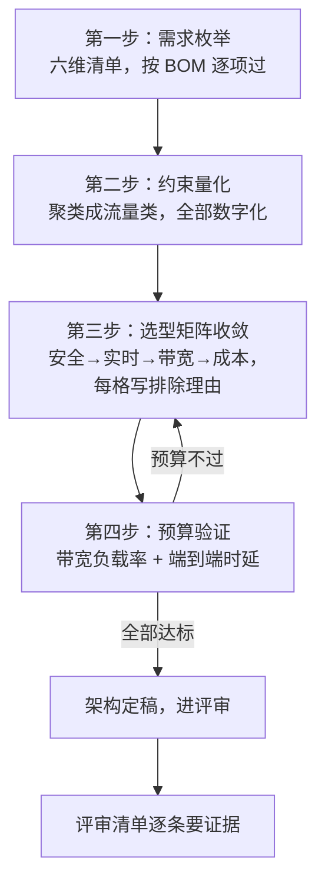

# B-E.15.4 整机总线架构设计方法

> 所属章节：第五部 B. 总线协议 > E. 综合实战
>
> 难度：[M] | 预计阅读时间：90 分钟

## <span class="blue"> 本节导读

15.1~15.3 是三台具体整机的答案——机械臂收敛到 EtherCAT、AGV 收敛到 CAN FD、人形收敛到分支化 EtherCAT。本篇把答案背后的方法抽出来：拿到任何一个新整机需求，怎样系统地推导出总线架构，而不是凭经验拍脑袋或者抄上一个项目。

方法是一条四步流程：**需求枚举 → 约束量化 → 选型矩阵收敛 → 预算验证**。前三篇回头验证过它——每台机器的总线方案都能被这四步重现出来，且四步缺一不可：跳过枚举会漏功能，跳过量化会留下"尽量快"这种没法验证的指标，跳过排除理由的选型是惯性不是设计，跳过预算验证的架构要在现场才暴露丢帧。这套流程对机器人成立，对数通设备、仪器仪表、车载域控同样成立——15.5 的数通整机就是同一套方法在另一行业的实例。

本节覆盖：需求枚举的六维度与三视角交叉核对、约束量化的流量聚类与总线有效速率参考、选型矩阵的构建与收敛优先级、带宽与时延预算的核算模板（含完整算例与实测对账）、架构评审检查清单（证据制）、常见决策失误与纠正、方法论的适用边界。

四步的顺序是依赖序：枚举的产物（需求清单）是量化的输入，量化出的流量类是选型的输入，选型结果是预算的对象——预算不过再回到选型。任何一步跳做，后面都是在沙滩上盖楼。



## <span class="blue"> 第一步：需求枚举

把整机里**每一个需要通信的功能**列出来，逐项填六个维度：

| 维度 | 问题 | 示例（某检测设备） |
|:---|:---|:---|
| 数据内容 | 传什么 | 伺服指令 / 传感器读数 / 视频流 / 日志 |
| 周期/时延 | 多快一次、允许多大延迟与抖动 | 1 ms 周期，抖动 <100 µs |
| 数据量 | 单次多少字节 | 10 B / 帧 vs 10 MB/s 流 |
| 距离与拓扑 | 物理上隔多远、中间过什么结构 | 板内 / 穿关节 / 跨机柜 |
| 环境 | EMC、温度、振动 | 工业现场强干扰 |
| 安全等级 | 错误数据的后果 | 普通数据 / 安全相关 |

安全等级这一列的填法要展开一句：判据是"这个数据错了/丢了/迟到了，最坏后果是什么"——答案是设备损坏或任务失败，填普通；答案涉及人身伤害风险，填安全相关。它不看数据本身的"重要性"（订单数据很重要但填普通），只看后果的类别。填错的两个方向都有代价：安全相关填成普通，安全链路缺一环；普通填成安全相关，为假安全需求付认证与隔离的真成本。

距离与环境两列同样直接参与初筛。距离划出物理层候选池：板内（<30 cm）是 I2C/SPI 的地盘，板间/机柜内（<3 m）进入 CAN/EtherCAT/以太网的射程，跨车间（百米级）只剩工业以太网与光纤，再远就是无线或运营商网络的事。环境列决定电气形态：强 EMC（电机动力线邻近、变频环境）逼出差分与隔离；宽温（-40°C 起步）刷掉消费级器件；振动场景把连接器锁扣与应力释放写成强制项（15.3 的布线规范就是这一列的产物）。六列里每一列都对应一类排除动作——清单填得越满，第三步的候选池自动越小，这正是设计质量高的表现。

> 抖动（Jitter）：周期的**不稳定度**——1 ms 周期的任务实际间隔在 0.9~1.1 ms 之间晃，这个 ±0.1 ms 就是抖动。实时系统里抖动比平均延迟更致命：控制环的相位裕度被抖动直接消耗，而平均延迟大但稳定的系统至少是可建模、可补偿的。所以量化时延迟与抖动必须分开写。

> EMC（Electromagnetic Compatibility，电磁兼容）：设备在电磁环境中既不被干扰也不干扰别人的能力。总线维度上它落地为：差分还是单端、屏蔽还是非屏蔽、隔离还是共地——电机动力线旁边的通信线，EMC 答案直接决定选 CAN/RS-485（差分）还是单端信号。

漏项是架构失败的第一来源，所以方法上要求**按整机 BOM 和功能清单逐行过**，不允许凭记忆列举。执行上用三个视角交叉核对：①按 BOM 物料过（每颗带通信口的芯片一行）；②按结构舱过（每个腔体/运动部件里有哪些需要对外说话的部件）；③按生命周期场景过（上电启动、正常运行、故障降级、产线制造、售后维护——每个场景各有哪些流量）。三个视角的清单合并去重后，与 BOM 清单的差异行就是漏项重灾区。三类最容易被漏掉的功能，每类都对应真实事故形态：

1. **调试与维护通道**：调试串口、日志导出、现场诊断接口。样机阶段没人想它，量产售后阶段它是唯一能进现场的通道——定板后才想起"要留个调试口"，往往没有多余的 UART 可留。
2. **固件升级通道**：每个带固件的节点（伺服、传感器、BMS）都要回答"它的固件怎么升级"。15.2 里 CAN FD 的 64 字节帧就是为这个功能买的单；漏掉它的产品，售后只能拆机刷固件。
3. **生产制造通道**：产线终检的校准数据写入、序列号烧录、测试模式入口。这些流量不在产品运行态出现，但必须在架构里占位——产线节拍是按秒算钱的。

输出物是一张"通信需求清单"，每行一个功能，六列填满。把检测设备的清单填满一遍作示范（节选）：

| 功能 | 数据内容 | 周期/时延 | 数据量 | 距离/拓扑 | 环境 | 安全等级 |
|:---|:---|:---|:---|:---|:---|:---|
| 8 轴伺服闭环 | 目标/实际位置、状态字 | 1 ms，抖动 <50 µs | 20 B/轴 | <3 m，机柜内 | 电机动力线邻近 | 安全相关 |
| 12 路温度/压力采集 | 传感器读数 | 10 ms，抖动宽松 | 8 B/路 | 板内 | 常规 | 普通 |
| 线阵相机 | 图像行数据流 | 持续流，无周期 | 200 MB/s | <1 m | 常规 | 普通 |
| 急停/安全门 | 干接点状态 | 硬件中断，<1 ms | — | 机柜周边 | 强干扰 | **安全** |
| 上位机管理 | 任务/日志/参数 | 事件驱动 | KB 级 | 车间网络 | 常规 | 普通 |
| 产测校准 | 校准参数写入 | 产线单次 | KB 级 | 板内 | 常规 | 普通 |
| 节点固件升级 | 固件包 | 售后按需 | 数百 KB | 各节点 | — | 普通 |

这张表是后续所有决策的输入，也是架构评审的受审对象——评审第一问就是"这张表怎么证明没有漏项"，答案是 BOM 逐行核对记录。注意最后两行：产测与升级不进运行态，但必须在清单里有行，它们的列值决定了"预留哪条通道"。

## <span class="blue"> 第二步：约束量化

把需求清单聚类成若干"流量类"，每类量化出硬指标：

```
 流量类 A：伺服闭环（8 轴）
   周期 1 ms、抖动 <50 µs、单帧 20 B、距离 <3 m、安全相关
 流量类 B：传感采集（12 路）
   周期 10 ms、抖动宽松、单帧 8 B、板内
 流量类 C：高速数据（相机/采集）
   持续 200 MB/s、无周期要求、距离 <1 m
 流量类 D：管理/日志
   无实时要求、带宽小、要走标准网络
```

聚类的规则是"**约束谱相近的归一类**"——周期、距离、安全等级三项最接近的功能才放一起。聚错的类会在第三步害人：把 1 ms 伺服和 100 ms 温度采集归一类，收敛时要么为温度采集付了实时总线的钱，要么伺服闭环被拖进慢总线。

量化需要一张"总线有效速率"的参考表打底——标称速率不是有效吞吐，协议开销与拓扑方式都要打折：

| 总线 | 标称速率 | 有效吞吐参考 | 关键损耗 |
|:---|:---|:---|:---|
| RS-485（Modbus RTU） | 115.2 kbps | ~60% | 主从轮询间隙 |
| CAN 2.0 | 500k~1 Mbps | 50~70% | 帧开销+仲裁；负载率上限是硬约束 |
| CAN FD | 500k/2M | ~1 MB/s | 仲裁段仍是瓶颈 |
| I2C | 100k~3.4 MHz | 70~80% | 应答位+地址开销 |
| SPI | 1~50 MHz | 85%+ | 仅片选切换间隙 |
| EtherCAT（100M） | 100 Mbps | 90%+（fly-by） | 帧头占比随帧长摊薄 |
| 千兆以太网 | 1 Gbps | 60~90% | 取决于帧长与协议栈路径 |
| PCIe Gen3 x4 | 32 GT/s | ~3.5 GB/s 单向 | TLP 开销 |
| USB 3.0 | 5 Gbps | ~400 MB/s 实际 | 协议栈与调度 |

表里的"有效吞吐"是工程经验值而非规范值——它的用途是第三步初筛时快速排除明显不够格的候选，精算仍在第四步做。

量化时不许写"快一点""尽量低"这种词——每个指标必须有数字和测量方法。写不出数字的需求是没想清楚的需求，回到需求方确认。这句话不是洁癖：第四步的预算验证是"实测/计算值 ≤ 指标值"的不等式，指标写不出数字，不等式就没有右边，预算表整列作废。

> ⚠️
> "回到需求方确认"会遇到阻力——需求方常说"你先做个差不多的"。顶住它的理由是分工：指标是需求方的责任，架构师的责任是暴露"没有指标就没法验证"这个事实。替需求方编一个数字，等于替他签了验收标准，量产扯皮时编数字的人负责。

量化完做两项一致性检查：①**安全相关类不得与普通类合并**——安全等级的差异不是程度差异，是性质差异（认证对象不同），合并必然在第三步污染选型；②**同一类内周期跨度超过 10 倍的拆开**——1 ms 和 100 ms 的流量共享一类，等于让慢流量按快流量的标准付钱。

> 流量类（Traffic Class）：本篇的核心抽象——把几十个通信功能按"约束谱"聚成 4~6 类，选型矩阵和预算表都只对着类做，不对单个功能做。它是这套方法可控的关键：28 个轴、12 路传感器逐个选型是不可行的，聚类之后决策数量从几十降到个位数。

抖动的测量方法随层而异：总线层抖动用协议分析手段（EtherCAT 的 DC 时间戳、CAN 的 candump 时间戳差分），调度层抖动用 `cyclictest`（方法在 B-E.15.6），物理层抖动用示波器看 SYNC0/触发信号。指标写"抖动 <50 µs"时必须注明是哪一层——三层抖动会沿链路叠加，控制环吃到的是总和。

## <span class="blue"> 第三步：选型矩阵收敛

对每个流量类，用 B 扩展各组的知识填选型矩阵。候选池来自这张能力速查表（详细参数回各组查阅，此处只列选型初筛用得上的维度）：

| 总线 | 速率档位 | 距离 | 节点/拓扑 | 硬同步 | 实时性 | 典型生态 |
|:---|:---|:---|:---|:---:|:---|:---|
| UART | ~115.2 kbps | 板内/短距 | 点对点 | 无 | 无 | 调试、低速外设 |
| I2C | ≤3.4 Mbps | 板内 | 多主从/总线 | 无 | 无 | 传感器、EEPROM、PMIC |
| SPI | ≤50+ Mbps | 板内 | 一主多从/片选 | 无 | 好（确定性高） | 高速芯片、ADC、编码器 |
| RS-485/Modbus | ≤10 Mbps | 1 km 级 | 多从/总线 | 无 | 差（轮询） | 工业辅机、仪表 |
| CAN / CAN FD | 1M / 2M+ | 40 m~1 km | 多主/总线 | 无（软件对齐） | 中（仲裁确定性） | 车载、AGV、电池 |
| EtherCAT | 100M / 1G | 100 m/段 | 线型/分支 | **DC <1 µs** | 优 | 伺服、机器人 |
| PROFINET RT/IRT | 100M | 100 m/段 | 星型/线型 | IRT 需专用 ASIC | 优（IRT） | PLC、工厂自动化 |
| 标准以太网 | 100M~10G | 100 m | 交换式 | PTP（µs 级） | 差~中 | 管理面、视觉、IT |
| PCIe | Gen3~6 | 板内/机箱内 | 树型 | 无 | 好（DMA 直通） | 高速采集、加速卡 |
| USB | 480M~40G | <5 m | 树型 | 无 | 差（调度不可控） | 消费外设、相机 |

**每个候选必须能说出排除理由**——说不出排除理由的选型是惯性不是设计：

| 流量类 | 候选 | 收敛 | 排除理由 |
|:---|:---|:---|:---|
| A 伺服闭环 | EtherCAT / CAN FD / RS-485 | EtherCAT | CAN FD：8 轴 1 kHz 双向过程数据超有效吞吐；RS-485：无同步机制、主从轮询时延不可控 |
| B 传感采集 | SPI / I2C / CAN | SPI+I2C 按器件分 | CAN：板内芯片级连接加收发器与协议栈是纯成本 |
| C 高速数据 | PCIe / USB3 / 千兆网 | PCIe | 千兆网：200 MB/s 超其有效带宽；USB3：DMA 直通能力与延迟确定性不如 PCIe |
| D 管理 | 以太网 | 以太网 | — |

B、C、D 三类的收敛过程也值得展开一次，示范排除理由写到什么颗粒度：

- **B 类（12 路传感）**：SPI 与 I2C 都够格，按器件原生接口分——压力变送芯片原生 I2C，高速 ADC 原生 SPI。排除 CAN 的理由：12 个节点各加收发器与协议栈，成本是纯增量，而板内 30 cm 距离根本不需要差分保护。合并原则在此生效：两类接口共用"传感采集"一个流量类，是因为它们的约束谱相同，不是接口必须统一。
- **C 类（200 MB/s 图像流）**：千兆网有效吞吐约 100 MB/s 级，直接出局；USB3 名义 5 Gbps 但等时传输的调度掌握在主机控制器手里，延迟不可控且 DMA 路径要经多层拷贝；PCIe 的 DMA 直通（采集卡内存直写主存）是这类流量的行业标准答案。
- **D 类（管理）**：标准以太网唯一候选，它的排除理由反着写——"为什么不让它承载别的"：管理流量进实时网违反隔离原则，这一笔要写进网络拓扑图。

排除理由的质量标准：必须落到**数字或机制**。"CAN FD 带宽不够"要附 15.2 那样的算式；"生态不成熟"要指出具体缺什么（从站芯片？驱动？工具链？）。"业界都用 X"不是排除理由，是放弃思考。

收敛按固定优先级顺序，高约束先收敛：

1. **安全约束**：安全相关功能先划出去走独立路径（黑色通道原则，B-D.14.3），不参与总线性价比竞争——它在选型矩阵之外。15.1 的急停干接点、15.2 的安全扫描仪、15.3 的 STO 回路，都是这一步的产物。
2. **实时约束**：周期与抖动最苛刻的流量类先定总线——它往往决定整机的主干网，其他流量类向它靠拢或明确分离。三台机器的主干网（EtherCAT/CAN FD/分支化 EtherCAT）都是这一步定下的。
3. **带宽约束**：大数据量类其次，它决定是否需要第二条高速通路。
4. **成本与生态**：前三条满足后，剩余流量按成本、供应链、团队熟悉度收敛。

> 为什么是这个顺序：约束的"刚性"不同。安全约束不满足是法律问题（过不了认证不许卖），实时约束不满足是功能问题（机器不工作），带宽不满足是性能问题（降级可用），成本不满足是利润问题。刚性最高的先收敛，后面的选择在它剩下的可行域里做——顺序反过来（先看成本）会把高刚性约束逼进无解角落，最后全盘返工。

收敛完要有书面留档：每个流量类的"收敛结果 + 各候选排除理由"写成一页决策记录，进版本库。半年后新人问"为什么不用 X"，翻出记录就能答——不留档的决策会在每次人员流动后重新吵一遍。

收敛之后还有一道交叉检查：**各流量类的独立答案放到一张整机图上，看物理与电气层面是否互相打架**。三类典型冲突：

1. **引脚/控制器冲突**：两个流量类分别选了 SPI 和 I2C，但 SoC 的这两路控制器引脚复用，只能活一个——收敛时各自成立，合并时不成立。解法：其中一类改走 USB 转接或换器件。
2. **供电域冲突**：选好的器件分处不同供电域（如 5V 域与 3.3V 域、常电域与可断电域），总线跨域要加电平转换或隔离，BOM 与故障域分析都要补这笔账。
3. **布局冲突**：拓扑要求总线穿过机械结构不允许的路径（15.3 的躯干穿线就是这个问题的极端版）——这类冲突的解法是让总线拓扑迁就机械，而不是反过来，机械结构的修改成本远高于通信方案。

这道检查必须在原理图设计之前做完——它检查的是"矩阵各行的答案能否共存"，是矩阵本身覆盖不了的维度。

> ADR（Architecture Decision Record，架构决策记录）：一页纸的决策档案格式——背景与约束、候选方案、决策、理由、后果（正面与代价）。它的价值不在模板而在存在性：决策留档后，评审、交接、复盘都有共同文本；不留档的架构知识只存在于当事人脑子里，人走即失。总线选型是 ADR 最经典的使用场景之一。

## <span class="blue"> 第四步：预算验证

架构落地前做一次书面预算，两个科目。

**带宽预算**（每条总线，逐一核算）：

```
 总线 X 负载率 = Σ（每节点帧长 × 频率）/ 总线有效速率
 合格线：CAN/CAN FD 常态 <50%、峰值 <70%；
         EtherCAT 周期占用 <50%（含主站处理时间）；
         以太网数据面 <70%；
         I2C/SPI 按最坏情况核算——不得阻塞实时读
```

用第二步检测设备的流量类 A 算一遍完整账（方法照搬 15.1/15.3）：

```
 8 轴 × (RPDO 10 B + TPDO 10 B) = 160 B
 帧开销 ≈ 32 B（以太网头+EtherCAT头+数据报头+WKC+FCS）
 帧长 192 B → 线上时间 ≈ 16 µs
 8 站 ESC 延迟 ≈ 3 µs；主站处理 ≈ 200 µs
 周期占用 ≈ 220 µs / 1000 µs = 22% < 50% ✓ 达标
```

**时延预算**（每条端到端控制路径）：

```
 传感采样 ─t1→ 总线传输 ─t2→ 主控计算 ─t3→ 总线下发 ─t4→ 执行器动作
 t1+t2+t3+t4 ≤ 控制周期 × 60%（留 40% 给抖动与余量）
 每项给出测量或计算依据
```

沿用上面的例子：编码器采样 t1≈5 µs、上行 8 µs、主站控制律 t3≈200 µs、下行 8 µs、伺服执行 t4≈50 µs，合计 ≈270 µs ≤ 600 µs ✓。每一项后面的"≈"都必须有出处：t2 按帧长算，t3 用 `perf` 实测，t4 查伺服手册——写不出出处的项就是预算表里的洞。

时延预算还有个反向用法：**从总指标倒推分配**。产品给"指令到动作 ≤2 ms"，先扣掉执行器动作时间（手册值）和传感采样时间（手册值），剩下的才是"总线+计算"的可花预算，再按 6:4 之类比例分给传输与计算——各环节拿着自己的限额去选型和写代码，而不是各自做完再祈祷总和达标。倒推分配把"整机指标"翻译成"每个工程师的指标"，这是预算表作为管理工具的一面。

> ⚠️
> CAN 系总线的负载率上限（常态 50%）背后是仲裁机制的数学：负载越高，低优先级帧等待高优先级帧的排队时间越长且方差越大——70% 负载下心跳帧的延迟抖动已足够触发节点死亡的误判。EtherCAT 没有这个机制（帧长固定、无仲裁），它的 50% 线约束的是主站 CPU 时间。两条合格线长得像，约束对象完全不同，预算表上不要互相引用。

预算不过就回第三步改方案：砍掉每周期字节数（15.3 的温度字段降级案例）、换更快的总线、或者把控制环下放一级（15.2 的"速度环闭合在驱动器"案例）。**预算表的价值就是在画板子之前暴露问题**——投板后暴露的预算问题，改的是硬件。

预算表算完不算完，还要实测基线对账：样机阶段用工具把每条总线的实际负载率录一遍（CAN 用 `canbusload`、EtherCAT 用主站统计、以太网用 `sar -n DEV` 或网卡计数器），与预算值偏差超过 20% 就要找原因——偏差的方向本身就是信息：实测偏高说明清单漏了流量（广播、厂商私有报文），实测偏低说明有功能没按设计跑起来。预算-实测对账记录是评审清单第 6 项的证据形态。

## <span class="blue"> 架构评审检查清单

设计评审时逐条过，每条都要证据，不接受口头回答（口径与第 16/17/18/22 章评审清单一致）：

- [ ] 需求清单是否按 BOM 逐项枚举（证据：BOM 核对记录），无凭记忆补的项
- [ ] 三类易漏通道（调试/升级/产测）是否都有占位（证据：清单中对应行）
- [ ] 每个选型是否有书面排除理由，且落到数字或机制（证据：ADR 记录）
- [ ] 安全功能是否独立于通信总线，或走认证安全协议（证据：安全链路图）
- [ ] 实时网与非实时网是否物理/逻辑隔离（证据：网络拓扑图 + tcpdump 验证记录）
- [ ] 每条总线的负载率预算是否达标（证据：预算表 + canbusload 类实测基线）
- [ ] 每条控制路径的时延预算是否达标（证据：逐项出处）
- [ ] 单点故障清单：每条总线断掉的后果与降级动作是否定义（证据：降级表，格式见 15.1）
- [ ] 时钟同步策略：哪些量必须同节拍、哪些带时间戳补偿（证据：时钟策略段落）
- [ ] 可生产性：线缆长度、连接器、穿结构路径是否与机械工程师对过（证据：会签记录）
- [ ] 可测试性：每条总线是否有出厂测试手段（证据：产测用例清单）

清单的用法：架构评审（投板前）全 11 项逐项过；首版样机回归时只过带"实测"字样的证据项（负载率基线、时延实测、tcpdump 记录）；量产后每次涉及总线的变更（加节点、改周期、换器件）回到第 1、6、7、8 项局部重审。评审记录与预算表、ADR 一起进版本库——三者构成总线架构的完整档案链。

## <span class="blue"> 常见决策失误

先量化一个反复出现的失误的成本："总线种类爆炸"——每多一种总线，隐性成本是：一套驱动/协议栈的维护、一套测试工具与用例、一份 EMC 摸底、一次团队学习曲线、一个供应链条。五种总线的整机，测试矩阵是按组合数膨胀的。所以"≤5 种为宜"不是审美偏好，是测试与维护预算的算术。

| 失误 | 表现 | 纠正 |
|:---|:---|:---|
| 抄旧方案 | 上一代用 CAN 就接着用，轴数翻倍后带宽崩 | 每次按四步重走，历史方案只是候选之一且要写排除理由 |
| 唯参数论 | 选速率最高的总线，忽略生态与成本 | 收敛优先级刚性排序：安全→实时→带宽→成本 |
| 总线种类爆炸 | 一台机器八种总线，测试维护成本失控 | 同类流量合并，总线种类 ≤5 为宜；每多一种要书面理由 |
| 安全后补 | 架构定稿后才加急停回路，布线无处走 | 安全约束第一步就划出去，在矩阵之外 |
| 预算缺失 | 没算负载率，现场高负载时才暴露丢帧 | 第四步不签字不投板 |
| 调试通道遗忘 | 量产机没有可进现场的诊断口 | 枚举阶段的三类易漏清单逐项核对 |
| 同步过度 | 给 100 ms 的温度采集也上 DC 同步 | 对齐只给"参与同一控制律"的量（15.1 原则） |

## <span class="blue"> 四步流程在三个实例上的回验

方法的检验标准是可重现性——拿它套三台已知答案的机器，应该一步步推出同样的架构：

| 步骤 | 15.1 机械臂 | 15.2 AGV | 15.3 人形 |
|:---|:---|:---|:---|
| 最刚约束 | 6 轴 1ms 硬同步 | 布线穿拖链 + 成本 | 28 轴 1kHz + 不能停机 |
| 主干网收敛 | EtherCAT | CAN FD | 分支化 EtherCAT |
| 被排除者的死法 | CAN：线上 1.6ms 排不开 | EtherCAT：ESC 成本+线型布线无收益 | CAN FD：476KB/s 爆表；普通以太网：抖动 |
| 安全独立路径 | 急停/STO 干接点 | 安全扫描仪硬件继电器 | STO 回路 + 伺服 watchdog 阻尼 |
| 预算要害 | 主站 CPU 时间占大头 | CAN 负载率 45% | 周期余量仅 35~60% |

三行读完会发现：差异全部来自"最刚约束"那一格，后面的收敛、隔离、降级是同一副骨架。这就是方法论的意义——新整机来了，你要做的只是找到它那格"最刚约束"。

## <span class="blue"> 方法论的边界

四步流程不是万能钥匙，承认它的边界才算真正掌握它：

1. **技术栈全新的领域**：候选池里的总线都不满足约束时（比如约束要求超出任何现有总线），流程会在第三步收敛失败——这是正确答案，它告诉你该推动的是定制物理层或等待新标准，而不是硬选一个。
2. **科研样机阶段**：探索期的目标是验证原理而非工程最优，四步流程的完整执行成本高于收益——可以只走第一步和第四步（枚举 + 预算），选型允许"手边有什么用什么"，但要书面声明这是样机决策，转产品化时重走全流程。
3. **继承性平台**：在已有平台上做衍生型号时，四步的价值集中在第一步（新功能的需求枚举）和第四步（变更后的预算重核），中间两步通常继承——这就是"抄旧方案"的合法形态：经过第一步和第四步验证的继承，而不是跳过验证的惯性。

边界说明的意义在于防滥用：流程是暴露问题的工具，不是免除思考的文书工作。发现自己在"为填表而填表"时，回到各步的目的问一遍：这一步要暴露的问题是什么？

## <span class="blue"> 方法落地：文档链与工具链

四步流程的产物不是四份孤立文档，而是一条可追溯的文档链，每一环都能在评审时被独立质疑：

```
 需求清单（BOM 核对版）
   └─ 约束量化表（流量类 × 硬指标）
        └─ ADR × N（每流量类一页：收敛+排除理由）
             └─ 预算表（带宽+时延，逐项出处）
                  └─ 评审记录（11 项证据 + 签字）
```

工具链的三个具体建议：

1. **预算表脚本化**：带宽负载率与时延合计用 Python/电子表格写成可重算的表——节点数、周期、帧长是参数，改一个数字全部结果重算。变更评审时"加两个节点负载率变多少"是秒级回答，不是重算半天。
2. **ADR 进版本库**：Markdown 一页一份，与代码同库同评审——架构决策和代码变更走同一个 PR 流程，历史可查 `git log`。
3. **评审记录证据化**：清单每项后面附证据链接（预算表文件、实测日志、拓扑图版本号），不接受"我记得测过"——证据制的清单在第三章丛书的 16/17/18/22 章已全线采用，口径一致。

文档链的生命周期与产品同长：每次涉及总线的变更（加节点、改周期、换器件、换代）回到对应环节局部更新，全链重新过签。它防的是五年后的一次"小改动"悄悄推翻五年前被验证过的预算。

## <span class="blue"> 四步流程与 B 扩展知识的映射

这套方法不生产总线知识，它消费 B 扩展各组的单总线知识。每步要用到的知识出处：

| 步骤 | 消费的知识 | 出处 |
|:---|:---|:---|
| 需求枚举 | 各类功能典型用什么接口（伺服/传感/显示/存储） | A~D 各板块总览篇 |
| 约束量化 | 各总线有效速率、距离、节点数上限 | 各总线物理层篇（B-B.5 UART、B-D.11.1 CAN FD…） |
| 选型收敛 | 同步机制有无、实时性档位、生态成熟度 | B-D.12.1 工业以太网版图、各协议对比篇 |
| 预算验证 | 帧结构开销、负载率合格线、实测工具 | 各总线协议层与调试篇（B-D.11.2/11.3、B-D.12.5） |
| 评审与降级 | 错误处理机制、故障域分析 | B-D.11.2、15.1~15.3 的降级表 |

这张映射表也是阅读路线：做总线架构设计时，手边应该有对应总线的物理层+协议层两篇作为查表依据——方法论的每一步都有"查哪本书哪一页"的答案。

## <span class="blue"> 本节总结

本篇把三台机器的答案还原成可复用的四步：枚举按 BOM 逐项过并给调试/升级/产测三类通道占位，量化到每个指标都有数字和测法，收敛按"安全→实时→带宽→成本"的刚性顺序且每格写得出排除理由，预算用带宽负载率与端到端时延两张表在投板前暴露问题。方法的全部价值在于把"选型"从经验直觉变成可评审的文档链——需求清单、ADR、预算表、评审记录，四件东西齐了，架构决策才经得起人员流动和时间。三台实例的回验表说明：找到你这台机器的"最刚约束"，剩下的收敛是机械执行。方法也有边界：候选池全灭时它在第三步如实报错，样机期允许只走枚举和预算，继承平台时四步退化为两步入——承认边界的流程才不会被用成文书工作。

### 速查表

| 问题 | 一句话答案 | 详见 |
|:---|:---|:---|
| 新整机从哪开始 | 六维需求清单，按 BOM 逐行过 | 第一步 |
| 最容易漏什么 | 调试/固件升级/产线制造三类通道 | 第一步 |
| 指标怎么写 | 数字+测量方法，禁"尽量快" | 第二步 |
| 收敛什么顺序 | 安全→实时→带宽→成本，刚性高的先 | 第三步 |
| 排除理由的合格线 | 落到数字或机制，"业界都用"不算 | 第三步 |
| 预算两个科目 | 总线负载率 + 端到端时延（≤周期60%） | 第四步 |
| 评审看什么 | 11 项证据制清单，预算不签字不投板 | 评审清单 |
| 有效速率从哪来 | 标称速率打协议折扣，参考表初筛、第四步精算 | 第二步 |
| 流程失灵时怎么办 | 候选池全灭=如实报错；样机走两步；继承走一四步 | 方法论的边界 |

## <span class="blue"> 本节自查

读完本篇，你应能独立完成以下动作：

- 为一个新整机产出六维通信需求清单，并说明三类易漏通道的占位情况
- 把需求聚类成流量类并量化出周期/抖动/带宽/距离/安全指标，每个指标给出测量方法
- 构建选型矩阵，对每个收敛写出落到数字或机制的排除理由，并按刚性优先级排收敛顺序
- 按模板完整核算一条总线的带宽预算和一条控制路径的时延预算，每项注明出处
- 主持一次总线架构评审，逐条过 11 项检查清单并指出每项要什么证据
- 识别"抄旧方案""唯参数论""总线爆炸""安全后补""预算缺失"等失误在自己项目中的痕迹
- 用三视角交叉法（BOM/结构舱/生命周期场景）核对一份需求清单的完整性
- 从整机时延指标倒推分配到各环节限额
- 说出方法论的三类失效边界，并给出各类的正确应对

## <span class="blue"> 配套资源

- 本篇是 B 扩展全部单总线知识的使用方法，各总线的参数依据回各组查阅（B-D.11 CAN、B-D.12 EtherCAT、B 板块低速总线、B-D.10 PCIe）
- 四个应用实例：15.1（机械臂）、15.2（AGV）、15.3（人形机器人）、15.5（数通整机）
- ISO 12100 — 机械安全设计通则（风险分析驱动安全回路设计）
- ADR（Architecture Decision Record）模板与惯例 — Michael Nygard 的原始文献
