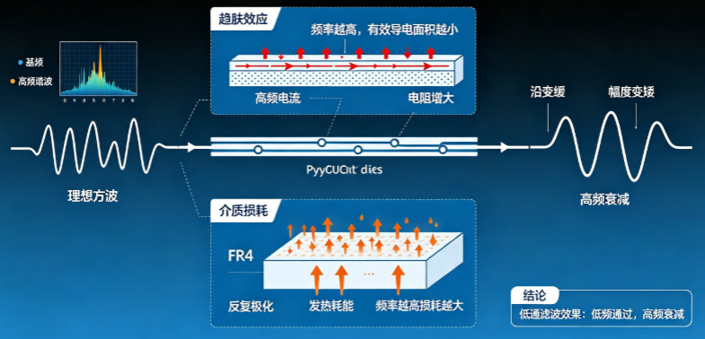
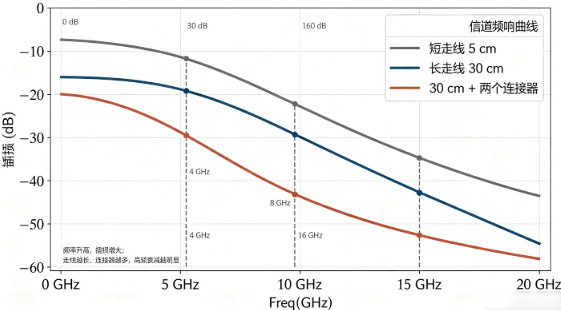
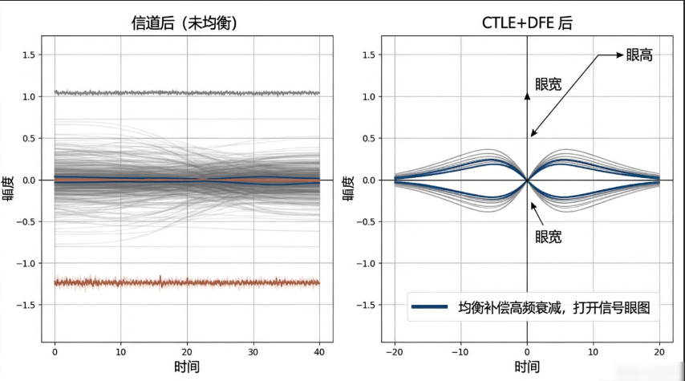
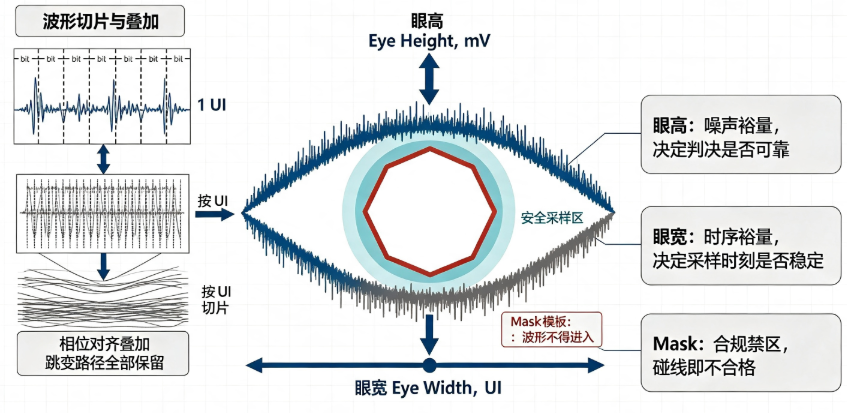
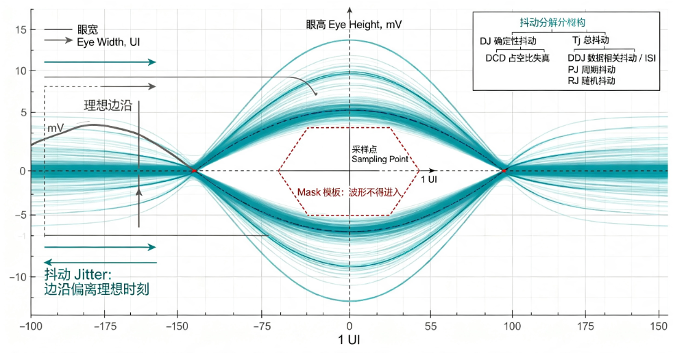

# B-F.16.1 SerDes 通识：均衡、眼图、抖动、信道预算

> 所属章节：第五部 B. 总线协议 > F. 前沿高速串行
>
> 难度：[I] Intermediate ~ [M] Master | 预计阅读时间：45 分钟

## <span class="blue"> 本节导读

PCIe、SATA、USB3、万兆以太网、车载 GMSL——这些接口在协议层千差万别，物理层却全是同一套技术：SerDes（Serializer/Deserializer，串行器/解串器）。一套技术统治了 10 Gbps 以上的世界，所以读懂它一次，所有高速接口的数据手册对你都会同时解锁。

本篇不要求任何高速信号背景。文中出现的每一个术语——dB、UI、CDR、ISI、Nyquist 频率——都会在使用处就地解释。目标读者是天天和 PCIe 设备树、lspci 输出、原厂 PHY 寄存器打交道，但说不清"链路训练到底在训练什么"的嵌入式工程师。

学完之后的现实收益是三种识读能力：看懂数据手册的 SerDes 章节在说什么、看懂原厂给的眼图报告、链路出问题时分得清哪些旋钮在软件手里、哪些必须找硬件同事。

本节覆盖：并行总线为什么必然让位、SerDes 收发链路的完整工作过程、编码方案的四代演进、信道对信号造成的损伤、均衡三件套的机制与代价、眼图与抖动报告的判读、信道预算的算账方法与 redriver/retimer 选型、嵌入式软件能摸到的交界面。

---

## <span class="blue"> 为什么并行走死了

要理解 SerDes 为什么必然出现，先看并行总线是怎么撞上墙的。

并行总线的思路很朴素：要传 32 位数据，就拉 32 根线，配一根时钟线，时钟沿到来时 32 根线上的电平同时被采样。百 MHz 时代这个方案工作得很好。把时钟提到 GHz 之后，三堵墙依次出现。

**第一堵墙：skew（偏移）。** 32 根线的物理长度不可能完全一致，信号在 PCB 走线上的传播速度大约是每纳秒 15 厘米，也就是说，两根走线差 1.5 厘米，信号到达时间就差 100 皮秒。而 PCIe Gen1 的一个 bit 只占 400 皮秒——走线长度差个几毫米，各 bit 的到达窗口就开始互相错位，接收端在任何一个采样时刻都凑不齐一个完整的 32 位字。时钟提得越高，允许的走线长度差越小，layout 工程师很快就无路可走。

**第二堵墙：引脚数。** 64 位数据加控制加时钟，上百个引脚、上百条等长走线，芯片封装和 PCB 层数的成本直接失控。

**第三堵墙：EMI。** 几十根线同时从 0 翻到 1（同步开关输出），瞬态电流叠加、互相串扰、对外辐射，信号劣化不说，电磁兼容认证也过不去。

串行化把这三堵墙一次拆掉：把并行的字拆成 bit 流，用**一对**差分线按极高速率依次发送。差分是用两根线传一个信号——一根传正相信号、一根传反相信号，接收端取两者之差。好处是共模干扰（电源噪声、外部辐射对两根线的影响相同）在相减时被抵消，而且对外辐射也因两根线电流方向相反而互相抵消。skew 问题消失了，因为不再有一把外部时钟需要对齐——**时钟信息直接藏在数据流里**，这是下一节的主题。剩下的唯一敌人，是信道本身。

PCIe 取代 PCI、SATA 取代 PATA，全是同一个剧本。嵌入式里遇到的 RS-485、LVDS、USB 差分对，都是这同一家技术在不同速率段的化身。

---

## <span class="blue"> SerDes 怎么把一个 bit 送过去

先看整条链路的结构，再逐个解释每个环节为什么存在。

<svg viewBox="0 0 720 240" xmlns="http://www.w3.org/2000/svg" style="max-width:720px;width:100%">
<rect x="20" y="60" width="120" height="50" rx="5" fill="none" stroke="currentColor" stroke-width="1.5"/>
<text x="80" y="90" text-anchor="middle" font-size="12" fill="currentColor">并行数据 N bit</text>
<rect x="170" y="60" width="100" height="50" rx="5" fill="none" stroke="currentColor" stroke-width="1.5"/>
<text x="220" y="90" text-anchor="middle" font-size="12" fill="currentColor">并转串</text>
<rect x="300" y="60" width="110" height="50" rx="5" fill="none" stroke="currentColor" stroke-width="1.5"/>
<text x="355" y="82" text-anchor="middle" font-size="12" fill="currentColor">编码+FFE</text>
<text x="355" y="98" text-anchor="middle" font-size="10" fill="currentColor">预加重/去加重</text>
<rect x="440" y="60" width="80" height="50" rx="5" fill="none" stroke="currentColor" stroke-width="1.5"/>
<text x="480" y="90" text-anchor="middle" font-size="12" fill="currentColor">驱动器</text>
<line x1="140" y1="85" x2="170" y2="85" stroke="currentColor" stroke-width="1.5"/>
<line x1="270" y1="85" x2="300" y2="85" stroke="currentColor" stroke-width="1.5"/>
<line x1="410" y1="85" x2="440" y2="85" stroke="currentColor" stroke-width="1.5"/>
<rect x="200" y="140" width="90" height="40" rx="5" fill="none" stroke="currentColor"/>
<text x="245" y="164" text-anchor="middle" font-size="11" fill="currentColor">PLL 时钟</text>
<line x1="245" y1="140" x2="245" y2="110" stroke="currentColor" stroke-dasharray="4,3"/>
<line x1="520" y1="75" x2="590" y2="75" stroke="currentColor" stroke-width="1.5"/>
<line x1="520" y1="95" x2="590" y2="95" stroke="currentColor" stroke-width="1.5"/>
<text x="555" y="65" text-anchor="middle" font-size="11" fill="currentColor">差分对</text>
<text x="598" y="80" font-size="12" fill="currentColor">信道</text>
<text x="598" y="98" font-size="12" fill="currentColor">（PCB/线缆/连接器）</text>
<line x1="640" y1="75" x2="660" y2="75" stroke="currentColor" stroke-width="1.5"/>
<line x1="640" y1="95" x2="660" y2="95" stroke="currentColor" stroke-width="1.5"/>
<text x="150" y="220" font-size="12" fill="currentColor">接收端（镜像）：CTLE/VGA → DFE 判决 → CDR 抠时钟 → 串转并 → 解码</text>
</svg>

**发送侧**做三件事：并行数据按位切开排成串行流；经过编码（原因见下节）；由驱动器推上差分对。发送时钟来自片内 PLL（锁相环，一种把低频参考时钟倍频成 GHz 级高频时钟的电路）——所以 PCIe 设备才需要那颗 100 MHz 参考时钟晶振。

> 信道：发送端和接收端之间信号走过的全部物理路径的统称——PCB 走线、过孔、连接器、线缆，一段不少全算在内。后面所有"损伤""损耗""预算"的讨论，主语都是它。

**接收侧**是发送侧的镜像，但多了一个 SerDes 的灵魂部件：**CDR（Clock Data Recovery，时钟数据恢复）**。

理解 CDR 是理解整个 SerDes 的钥匙。串行链路没有随路时钟线——接收端必须自己回答"每个 bit 的起止时刻在哪"。做法是：接收端内置一个本地振荡器，不断拿数据流里的 0/1 跳变沿来校准自己的相位——每来一个跳变沿，就知道"这里是一个 bit 的边界附近"，逐步把本地时钟锁到和数据流同频同相，锁稳之后就能在每个 bit 的正中央采样。

这个机制直接推出一条铁律：**数据流里必须有足够频繁的 0/1 跳变，CDR 才锁得住**。如果数据流里出现一长串连续的 0（比如传一段全零数据），几十上百个 bit 时间里没有任何跳变沿，本地时钟就会漂走，等跳变再来时已经不知道 bit 边界在哪了——链路失锁。"保证跳变密度"不是编码的优化目标，而是编码存在的理由。下一节的整部编码演进史，都要带着这条铁律去读。

---

## <span class="blue"> 编码：给数据流强制掺入跳变

### 8b/10b：第一代答案

既然任意用户数据可能包含长串连 0，那就不要直接发用户数据——每 8 bit 数据查表换成一个 10 bit 码字再发。码表经过精心设计：任何 10 bit 码字及其拼接，连 0 或连 1 都不超过 5 位，跳变密度有了下限保证。

8b/10b 还顺带解决第二个问题：**直流平衡**。如果数据流里 1 长期比 0 多，信号的平均电平会漂移，而链路上的交流耦合电容（隔离两端直流电平的串接电容）不允许这种漂移存在。码表为每个 8 bit 值备了两个 10 bit 码字（一个 1 偏多、一个 0 偏多），发送器跟踪累计的 0/1 差额交替选用，长期看 0 和 1 的数量严格拉平。

代价是**20% 的开销**：每传 10 个 bit 只有 8 个是数据。PCIe Gen1/2、SATA、USB3.0 用的都是它。2.5 GT/s 的链路实际数据率只有 2 Gbps，这在当年是可接受的税。

> 符号率与比特率：符号率（也叫波特率，PCIe 写作 GT/s）是线上每秒发多少个符号；比特率（Gbps）是每秒实际传多少个数据 bit。NRZ 信号一个符号带 1 个 bit，两者数值相等；编码开销和 PAM4 都会让两者拉开差距——2.5 GT/s 经 8b/10b 后只剩 2 Gbps，而 PAM4 下 32 GT/s 对应 64 Gbps。看到 GT/s 和 Gbps 不一致时，差值里就藏着编码开销或调制阶数。

> 交流耦合：SerDes 链路上串接在差分线中的隔直电容，只允许交流成分（跳变）通过、隔断两端的直流电平，让收发两端的芯片可以各有自己的工作电压。代价是信号的长期平均电平必须为零——这就是直流平衡要求的来源。

### 64b/66b 与 128b/130b：用扰码替代码表

速率上到 10 Gbps 之后，20% 的税变得肉疼。第二代方案换了思路：不搞逐字替换的码表，改成**扰码（scrambling）**——发送端用一个伪随机多项式和数据流做异或，把数据"打乱"成统计上接近随机的序列，接收端用同一个多项式异或回去。随机序列的连 0/连 1 概率极低，跳变密度靠统计保证而非逐字保证。然后每 64 bit 数据前加 2 bit 同步头（固定 01 或 10）作为块边界标记，构成 66 bit 的块。

开销从 20% 降到 3.125%。10G 以太网用 64b/66b，PCIe Gen3~5 用同样思路的 128b/130b（开销约 1.5%）。注意扰码保证的是统计意义而非绝对上限——理论上仍存在连 0 超长的极小概率，工程上靠"概率低到系统寿命内不发生"来接受。

### PAM4 + FEC：频率提不动之后的转向

NRZ（每符号两个电平，代表 1 个 bit）的频率一路推高，到 50 Gbps 量级时信道、工艺都接近极限。第三代方案换了维度：**PAM4 用四个电平，每个符号携带 2 个 bit**，同样波特率下数据率翻倍。PCIe Gen6、56G/112G 以太网走的就是这条路。

代价要算清楚：同样的信号摆幅切成 4 层，相邻电平间距只剩 NRZ 的 1/3——电压域的信噪比预算直接少了约 9.5 dB，误码率从"几乎为零"恶化到"必然存在"。所以 PAM4 链路把 **FEC（前向纠错）从可选项变成了必选项**：发送端给数据附加冗余校验，接收端实时纠正零星误码，把残余误码率压回可接受范围。"编码演进"走到这一步，本质上是在编码效率、信噪比、纠错复杂度三者之间反复换汇。

> 信噪比（SNR）：信号功率与噪声功率的比值，用 dB 表示。它是所有通信链路的根本预算——噪声恒定存在，信号越弱、层与层之间挤得越近，就越难分清"这一层到底是哪个电平"。PAM4 把同样摆幅切成 4 层，等于把相邻电平的间距压到 NRZ 的 1/3，信噪比预算因此直接损失约 9.5 dB。

> 前向纠错（FEC）：发送端在数据里附加冗余校验信息，接收端不请求重传、直接靠冗余实时纠错的机制。"前向"指的是不需要回头重发。代价是额外延迟和少量带宽；收益是把 PAM4 这种"必然有误码"的链路拉回可用区间。

| 编码 | 用于 | 开销 | 一句话 |
|------|------|------|--------|
| 8b/10b | PCIe Gen1/2、SATA、USB3.0 | 20% | 码表替换，跳变与直流平衡双保证 |
| 64b/66b | 10G+ 以太网 | 3.125% | 扰码 + 2 bit 同步头 |
| 128b/130b | PCIe Gen3~5 | ~1.5% | 同思路，块更长 |
| PAM4 + FEC | PCIe Gen6、56G+ 以太网 | — | 每符号 2 bit，必须 FEC 兜底 |

---

## <span class="blue"> 信道对信号做了什么

发送端把信号推上差分对之后，到接收端之间的一切——PCB 走线、过孔、连接器、线缆——合称**信道**。信道对信号做的坏事可以收成一句直觉：**频率越高的成分被吃掉得越多**。

为什么频率越高损耗越大？两个物理机制。**趋肤效应**：高频电流不再均匀流过导体横截面，而是挤在导体表面薄薄一层，频率越高"皮肤"越薄，有效导电面积越小，电阻越大。**介质损耗**：PCB 板材（如 FR4）的绝缘介质在交变电场中反复极化会发热耗能，频率越高损耗越大。两种损耗叠加，使得信道在频域上是一个低通滤波器：低频成分基本无损通过，高频成分严重衰减。

一个数字方波可以分解为基频正弦波加大量高频谐波——陡峭的跳变沿全靠高频成分支撑。高频被吃掉，直观后果就是沿变缓、波形变圆、幅度变矮。



由此引出 SerDes 的核心矛盾：**ISI（码间干扰）**。一个 bit 的波形到达接收端时不再是干脆的方波，而是带着拖尾的软波形，拖尾会糊进后面好几个 bit 的时间窗里。于是接收端看到的波形取决于"前面发过什么"：一个孤立的 1 后面跟一串 0，和夹在两个 1 中间的 0，到达时形状完全不同——**bit 的历史污染了 bit 的现在**。判决门限是固定的一条线，拖尾叠加让某些 bit 的采样值越过门限，就不是"有点变形"，而是直接判错。

> 判决门限：接收端判断"这个采样点是 0 还是 1"用的电压分界线——采样值高于门限判 1，低于判 0（PAM4 有三条门限）。门限是固定的，波形却是被信道揉过的，两者之间的余量（眼高）就是这个链路能扛住多少噪声和干扰的量化表达。

这里需要引入后面反复使用的度量单位 **dB（分贝）**。dB 是比值的对数表达：电压比值取 log 再乘 20。记三个锚点就够日常心算：**−6 dB ≈ 电压减半，−20 dB = 电压剩 1/10，−3 dB ≈ 功率减半**。信道在 8 GHz 处插损 −24 dB，意思就是：8 GHz 的频率成分到达接收端时，电压只剩约 1/16。说"这段走线在 Nyquist 频率处吃掉 24 dB"，和说"高频成分只剩 1/16"是同一句话。

> 💡 Nyquist 频率：数字信号的最高有效频率成分约为波特率的一半。PCIe Gen4 是 16 GT/s，其 Nyquist 频率就是 8 GHz——评估信道够不够用时，就看信道在 8 GHz 处的插损。

另外两个损伤源顺带记住：**反射**——走线阻抗不连续（过孔、连接器、分叉短桩）会让一部分信号弹回来，造成波形振铃；**串扰**——相邻差分对之间的电磁耦合，别人的跳变叠进你的信号。两者最终都体现为眼图闭合，下一节统一处理。



---

## <span class="blue"> 均衡：把信道反着做一遍

信道是一个低通滤波器，均衡的思路就是把它的效果"反向补偿"掉。工程上在三个位置布置了三种机制，合称均衡三件套。

**FFE（Feed-Forward Equalizer，前馈均衡），在发送端。** 既然信道会吃掉高频，发送时就预先"歪着"发：跳变的 bit 用满幅度发，不跳变的连续 bit 故意压低幅度。相对效果等于把高频成分（跳变沿）抬高了。数据手册里的 **de-emphasis（去加重）** 和 **pre-shoot（预冲）** 说的就是 FFE 的两组参数——前者压低非跳变 bit，后者把跳变后第一个 bit 额外拉高。代价是整体发射幅度被压缩：预补偿是用"信号变小"换"高频比例变大"。

**CTLE（Continuous-Time Linear Equalizer，连续时间线性均衡），在接收端的模拟前端。** 它是一个高通滤波器，直接把收到的高频成分放大、低频成分相对抑制，补偿信道的主体衰减。原理干净，代价也直白：高频噪声和串扰跟着信号一起被放大。

**DFE（Decision Feedback Equalizer，判决反馈均衡），在接收端判决器之后。** 前面说过 ISI 是"bit 的历史污染现在"——DFE 对症下药：既然某个 bit 的拖尾由前面已判决的 bit 决定，那判决完一个 bit 后，就把它将造成的拖尾从后续波形里减掉。这是唯一能消除"判决后拖尾"的均衡，也是唯一的非线性均衡。代价是**错误传播**：判错一个 bit，减掉的拖尾就是错的，可能连带判错后面一串——所以高速链路对 DFE 的反馈抽头数有限制，并有错误传播防护设计。

三件套的分工一句话总结：FFE 开环预设（调好就固定），CTLE 模拟域粗调，DFE 数字域精修，三者叠加把一个接近闭合的眼重新撑开。

PCIe 把这套机制标准化成了软件可见的东西：Gen3 起定义了 **P0~P10 共 11 组 TX preset**（de-emphasis 与 pre-shoot 的不同组合），链路训练阶段双方协商，逐组试发测试码型、由接收端反馈质量，最终选定眼图最优的一组 preset——你在 PCIe PHY 寄存器或设备日志里看到的 "link equalization"、"preset"，就是这个过程。



---

## <span class="blue"> 眼图与抖动：链路健康的两张体检单

### 眼图是怎么来的

示波器把接收到的波形按一个 bit 的时间窗（这个时间窗叫 **1 UI，Unit Interval**）切片，把成千上万片按相位对齐叠在一起，就得到眼图。所有 0/1 组合、所有跳变路径叠加后，中间自然张开一个眼睛状的空白区——**这个空白区就是安全采样区**：只要采样时刻落进"眼睛"里，判决就不会错。

```
        ┌─────────────────────────┐
        │     ╱‾‾‾‾‾‾‾‾╲          │   ↑
        │   ╱▒▒▒▒▒▒▒▒▒▒  ╲        │   │ 眼高（Eye Height, mV）
        │  ╱▒▒  安全区   ▒╲       │   ↓
        │  ╲▒▒▒▒▒▒▒▒▒▒  ╱        │
        │    ╲________╱          │
        └─────────────────────────┘
           ←—— 眼宽（Eye Width, UI）——→
```

读眼图看三个量。<BR>
**眼高**：垂直方向的张开度，单位 mV，代表还剩多少噪声裕量——必须大于接收端判决门限的不确定性加协议要求的裕量。<BR>
**眼宽**：水平方向的张开度，以 UI 为单位（0.5 UI 就是半个 bit 时间），代表还剩多少时序裕量。<BR>
**Mask（模板）**：协议规定的禁区六边形，任何波形轨迹碰线即不合规。

> ⚠️ 眼图通过不等于链路没问题。示波器眼图是统计叠加图，10⁻¹² 量级的偶发误码在图上根本看不到——那一两次错误采样被数百万次正常采样淹没了。所以眼图是快速体检，合规判决要靠误码率测试（BERT）或协议层的误码计数（如 PCIe 的 Lane Error）。这个分界在评审原厂眼图报告时尤其重要。



> 误码率（BER，Bit Error Rate）：平均每传多少个 bit 错一个。写作 10⁻¹² 就是"平均每 10¹² 个 bit 错 1 个"——10 Gbps 链路跑满时大约每 100 秒错 1 bit。高速串行链路的事实标准是优于 10⁻¹²，PCIe 即采用此量级；PAM4 链路靠 FEC 把"原始误码率 10⁻⁴ 级"压到"纠错后 10⁻¹² 级"。报抖动、报眼图指标时不带 BER 前提，数值就没有意义。

还有一类不依赖示波器的手段：**片内眼图扫描（on-die eye scan）**。接收芯片内部步进调整采样相位和判决门限，直接输出一张眼图矩阵。部分 SerDes PHY 的调试接口支持导出，作为软件工程师，知道"可以要求原厂或 PHY 驱动导出这个"就足够。

### 抖动：眼宽方向的敌人

> 抖动（jitter）：信号边沿实际到达时刻偏离理想时刻的时间偏移。理想情况下每个 bit 的边界严格等间隔，实际会前后漂移——漂移量直接吃掉眼宽（水平方向的裕量）。

抖动的度量单位是 UI：PCIe Gen4 下 1 UI = 62.5 ps，漂移 62.5 ps 就是 1 个 UI 的抖动。总抖动 Tj 按成因分解，判读报告时照这棵树对号：

```text
Tj（总抖动，必须标注前提，如 Tj@BER=10⁻¹²）
├── DJ（确定性抖动，有界，逐项可追查）
│    ├── DCD  占空比失真：0 和 1 的判决门限不对称
│    ├── DDJ  数据相关抖动：主体就是 ISI，均衡不足时的最大头
│    └── PJ   周期抖动：电源纹波、参考时钟杂散
└── RJ（随机抖动，无界，服从高斯分布）
```

为什么 RJ 必须带 BER 前提：高斯分布的尾巴无限延伸，理论上再大的抖动都有非零概率。所以"RJ = 1 ps"是没有意义的表述，有意义的表述是"10⁻¹² 误码率条件下 Tj ≤ 0.4 UI"——意思是平均每 10¹² 个 bit 错 1 个时，总抖动不超 0.4 个 bit 时间。

这棵树对嵌入式工程师的实际用途，是把"链路不稳"这句模糊的话翻译成可分配的调查方向：**眼图水平收缩先怀疑 DDJ/ISI（均衡没调好，回上一节），再查 PJ（电源纹波和参考时钟质量，找硬件）**。



---

## <span class="blue"> 信道预算与 redriver/retimer

把信道当一本账来算：发射幅度是本钱，走线、过孔、连接器逐项扣插损（dB），均衡器是补贴，最后剩下的必须大于接收端的灵敏度要求。一个量级锚点：PCIe Gen4 规范允许的端到端插损约 **28 dB**（按上一节的 dB 心算，就是高频电压只剩约 1/25，靠均衡补回来）。板材差一档、走线长一截、多两个连接器，预算就见底——这就是为什么高速板的板材选型和走线长度会被硬件工程师卡得很死。

> 接收灵敏度：接收端在指定误码率（通常 10⁻¹²）下能正确判决的最小信号幅度，单位 mV。它是这本账的"最低余额"——信号经过信道衰减和均衡补偿后，到达判决器时的有效幅度必须高于这个数，链路才成立。数据手册里这个指标永远和误码率前提绑定出现。

预算不够时，市场上有两类补救器件，选型分界非常清晰：

| 器件 | 机理 | 效果 | 适用场景 |
|------|------|------|----------|
| Redriver（模拟中继） | 只做 CTLE 式放大，不碰时钟 | 补衰减；**抖动原样传递** | 预算只差几 dB、距离略长的低成本场景 |
| Retimer（重定时器） | 内置完整 CDR，重新采样、再生信号 | 衰减和抖动**全部清零重置**，链路分成两段独立算预算 | 长链路、跨背板、Gen4 以上高速 |

一句话：**redriver 是助听器（放大听到的声音），retimer 是复述者（听清后重新说一遍）**。PCIe Gen4 之后 retimer 还要参与链路训练（协议感知），选型时除了 SI 指标还要确认协议代次兼容性。你在服务器主板或背板上看到的小封装中继芯片，基本就是这两类。

### 链路延伸器件谱系

redriver/retimer 是板级器件。当距离继续拉长——出板卡、出机箱——信道器件就演变成一整条产品谱系。下表按"信号经历的处理程度"从轻到重排列：

| 器件 | 本质 | 对信号做了什么 | 协议感知？ | 典型场景 |
|------|------|----------------|-----------|----------|
| DAC（无源直连铜缆） | 带接插件的屏蔽双绞铜线组件 | 什么都没做，纯信道延长 | 否 | 同机柜内交换机-服务器互联，几米级 |
| ACC（有源铜缆，redriver 版） | 铜缆接头里内嵌 redriver | 模拟放大补衰减 | 否 | 铜缆距离再拉长一两米 |
| AEC（有源铜缆，retimer 版） | 铜缆接头里内嵌 retimer | 重新采样再生 | 是 | 铜缆距离极限，比 AOC 便宜 |
| AOC（有源光缆） | 两端接头固化光电转换，光纤封死在缆内 | 电 → 光 → 电 | 否（电进电出） | 跨机柜几十到上百米 |
| 光模块 + 光纤跳线 | 可插拔光电转换器（SFP/QSFP/OSFP） | 电 → 光（对端模块转回电） | 否 | 机房级、园区级，百米到数十公里 |

读这张表时抓住两个要点：

1. **它们全是 SerDes 层的信道器件**，对本篇前半部分的预算账本负责——DAC 是"账本上再记一段铜线损耗"，AEC 是"预算清零重新分段"，光模块是"把损耗极低的介质（光纤）换进账本"。协议层对这些器件基本无感。
2. **产业归属上它们是数通（以太网/InfiniBand）生态的产品**：SFP/QSFP/OSFP 封装、速率档位（25G/50G/100G per lane）、I2C 管理接口（SFF-8472/CMIS 标准）全是跟着以太网走的。PCIe 传统上是机箱内互联，介质是 PCB、背板和 MCIO/OCuLink 这类铜缆连接器，PCIe 原生走光纤是极小众场景。

> 💡 分工提示：本篇止于"谱系与选型逻辑"。光模块的 I2C 管理面（CMIS/SFF-8636、DOM 数字诊断）详见 B-D.14.5；这些器件在整机里怎么组网（背板、管理面、数据面三张网）详见 B-E.15.5。

---

## <span class="blue"> 嵌入式软件的交界面

SerDes 是模拟电路，但它在软件世界里留了四个把手，按排查顺序排：

**参考时钟。** PCIe 要求 100 MHz、精度 ±300 ppm（ppm 是百万分之一，±300 ppm 即允许偏差 ±30 kHz），通常还带 SSC（扩频时钟——故意让频率小幅抖动以摊薄 EMI 辐射峰值）。参考时钟精度不够、SSC 配置两端不匹配，表现为链路训练失败或偶发降速。设备树、BIOS、时钟芯片配置是第一嫌疑。

**PHY tuning 寄存器。** TX 摆幅、preset、CTLE 增益，多数 SoC 的 PCIe/USB3 PHY 在驱动里暴露这些参数。量产板的 SI 条件不如原厂 EVB 时，原厂通常会给一组"按板调整"的数值——这组数值怎么来的？就是按本篇前半部分的方法论调出来的。

**速率协商结果。** 链路训练失败会自动降速（Gen4 → Gen3 → Gen2）。`lspci -vv` 输出里每个设备有两行关键信息：`LnkCap`（链路能力，声明最高支持几代几 lane）和 `LnkSta`（链路现状，实际跑在几代几 lane）。**LnkSta 低于 LnkCap，就是 SI、供电或时钟问题的实锤信号**——这是软件工程师不借任何仪器就能拿到的 SerDes 健康指标，巡检成本为零。

**误码计数。** PCIe AER（Advanced Error Reporting）、PHY 的 retry/error 计数器。眼图看不见的偶发问题，在这里以计数形式现形——前面说的"眼图体检、误码判决"，在软件侧的落点就是这里。

排查分界也要清楚：软件能改的是 preset、摆幅、时钟配置、降速保底；改不了的是板材、走线拓扑、连接器选型。软件侧确认问题在信道后，正确动作是把它翻译成量化需求（目标速率下需要多少 dB 预算、阻抗公差多少）交给硬件与 layout——**你负责说清楚"需要多少 dB"，他们负责腾出来**。

---

## <span class="blue"> 方案对比（Trade-off）

| 维度 | 评价 |
|------|------|
| 串行 vs 并行 | 引脚/skew/EMI 全胜；代价是把问题转移给了信道与均衡 |
| 8b/10b vs 64b/66b | 逐字保证 vs 统计保证；20% 税 vs 3.125% 税 |
| PAM4 vs NRZ | 同频率带宽翻倍；代价是眼高 1/3、必须 FEC、均衡更难调 |
| FFE 开环 | 简单确定；发射幅度被压缩 |
| DFE 闭环 | 后拖 ISI 唯一解；有错误传播风险 |
| Redriver vs Retimer | 便宜低延迟但不清抖动 vs 预算清零但贵且有延迟 |

---

## <span class="blue"> 本节总结

| 自查项 | 确认标准 |
|--------|----------|
| 并行之死 | skew/引脚/EMI 三堵墙的机理；1.5 cm 走线差 = 100 ps 的量化直觉 |
| SerDes 架构 | 无随路时钟；CDR 从跳变沿锁相位；跳变密度铁律 |
| 编码演进 | 8b/10b（码表、直流平衡）→ 64b/66b（扰码）→ PAM4+FEC（信噪比换带宽） |
| 信道 | 趋肤效应/介质损耗 → 低通特性；ISI 是核心矛盾；dB 心算（−6 dB ≈ 减半） |
| 均衡 | FFE/CTLE/DFE 的位置、机制、代价；PCIe preset 与链路训练 |
| 眼图 | 眼高/眼宽/mask 的读法；眼图 ≠ 误码率；on-die scan 的存在 |
| 抖动 | DJ/RJ 分解树；RJ 必须带 BER 前提；水平收缩先查 ISI 再查 PJ |
| 预算 | 账本模型；redriver/retimer 分界；软件四把手与排查分界 |

---

## <span class="blue"> 配套资源

- **规范**：PCIe Base Specification 的 Physical Layer 章节（preset、链路训练、抖动定义均出自这里）
- **读物**：Howard Johnson《High-Speed Digital Design》，信号完整性经典，按需查阅对应章节
- **工具**：`lspci -vv`（LnkCap/LnkSta 对比）；所用 SoC 原厂的 PHY tuning 指南
- **器件手册**：任一款 PCIe retimer（Astera Labs / Parade / TI），重点看典型应用框图
