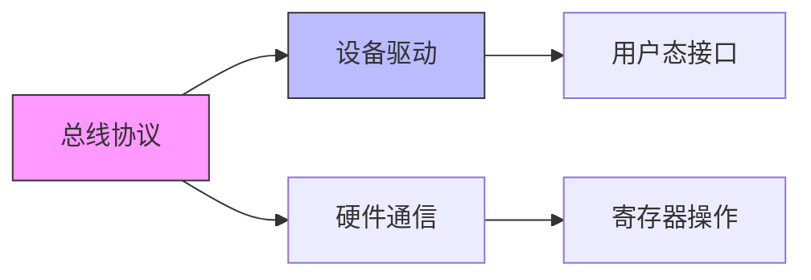

# 总线协议

> BIEM 定位：[B→E] 从低速到高速，掌握嵌入式系统全谱系总线协议 
> 本模块核心价值：总线协议是设备驱动与硬件通信的基础

---

## 模块概述

总线协议是嵌入式系统的**通信基础设施**，决定了设备之间如何交换数据、如何共享资源、如何协调时序。从片内 SoC 总线到工业现场总线，从基础外设通信到高速数据扩展，总线协议覆盖了嵌入式系统从纳米级芯片互联到千米级工厂网络的全尺度通信需求。

与第 III 部的关系：**总线协议是设备驱动与硬件通信的基础**。驱动开发者必须理解所操作硬件的通信协议——I2C 的 ACK 时序、SPI 的 CPOL/CPHA 模式、PCIe 的配置空间枚举，这些直接决定了驱动代码的正确性和性能。

---

## 子目录结构

| 子目录 | 主题 | 难度 |
|--------|------|------|
| [A. 片内总线认知](A. 片内总线认知/README.md) | APB、AHB、AXI、TileLink、NoC、CHI、UCIe 等 SoC 内部互连（B 扩展第一站，由片内向片外） | [B→M] |
| [B. 低速外设接口](B. 低速外设接口/README.md) | I2C、SPI、UART、1-Wire 等基础外设总线 | [B→I] |
| [C. 中高速外设与存储](C. 中高速外设与存储/README.md) | USB、SD、eMMC、MIPI 等高速扩展总线 | [I→E] |
| [D. 专用网络总线](D. 专用网络总线/README.md) | PCIe、CAN、工业以太网、车载与新型总线 | [I→E] |
| [E. 综合实战](E. 综合实战/README.md) | 多总线系统集成、拓扑设计、选型决策 | [I→E] |

---

## 与第 III 部的关系

- **第 III 部**（系统设计与决策）中的设备驱动需要操作具体的总线控制器
- **B 部**（总线协议）提供驱动开发所需的协议知识、时序理解和硬件通信原理
- 两者结合，才能完成从"看懂协议"到"写出驱动"的完整闭环

---

## 小结

| 要点 | 内容 |
|------|------|
| 核心目标 | 掌握嵌入式系统全谱系总线协议 |
| 关键能力 | 总线选型、时序分析、驱动适配、系统集成 |
| 前置知识 | 数字电路基础、C 语言、操作系统原理 |
| 与体系关系 | 总线协议是设备驱动与硬件通信的基础 |
