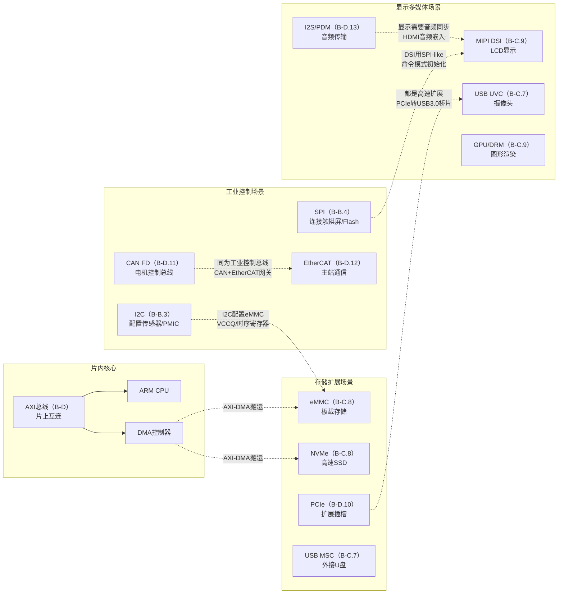
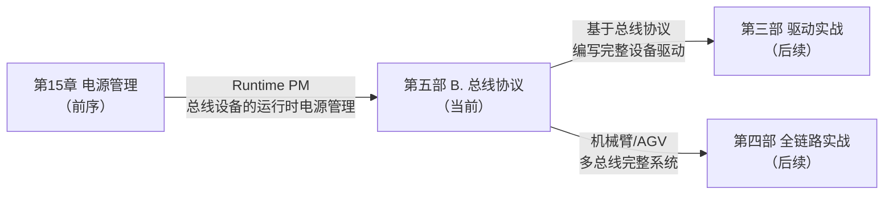

# B.99 知识图谱

> 所属章节：第五部 B. 总线协议 > 知识图谱总览
>
> 难度：[I] | 预计阅读时间：25分钟

##  本节导读

恭喜！如果你已经读到这里，说明你已经走完了第五部 B. 总线协议的全部旅程——从一根GPIO引脚的上下翻转，到PCIe总线上数十GB/s的数据洪流；从I2C总线上两个设备的简短握手，到EtherCAT网络中数百个伺服节点的微秒级同步。本节不是新知识点的堆砌，而是一幅**全局地图**：54个知识点（编号264-315、358-359）的关联脉络、10道自测题帮你检验学习成果、与前后章节的无缝衔接指引。把它当作你嵌入式总线知识体系的"索引页"，随时可以回来查缺补漏。

---

##  一、全部知识点关联图 [I]

下面的图谱展示了第五部 B. 总线协议的完整知识结构。每个方框代表一个知识点（括号内为编号），箭头表示**学习依赖关系**或**技术关联路径**。

```mermaid
flowchart TB
    subgraph BA["B-A 低速外设接口（264-300）"]
        direction TB
        subgraph BA1["B-B.2 基础外设（264-271）"]
            B264["264 GPIO寄存器操作"]
            B265["265 GPIO中断与消抖"]
            B266["266 GPIO设备树配置"]
            B267["267 LED子系统"]
            B268["268 PWM原理与配置"]
            B269["269 按键输入子系统"]
            B270["270 ADC基础与采样"]
            B271["271 看门狗定时器"]
        end
        subgraph BA2["B-B.3 I2C+1-Wire（272-280）"]
            B272["272 I2C协议时序"]
            B273["273 I2C设备地址与寻址"]
            B274["274 I2C设备驱动模型"]
            B275["275 I2C设备树配置"]
            B276["276 I2C-tools调试"]
            B277["277 SMBus协议"]
            B278["278 I2C从设备模拟"]
            B279["279 1-Wire协议基础"]
            B280["280 DS18B20驱动"]
        end
        subgraph BA3["B-B.4 SPI（281-288）"]
            B281["281 SPI协议时序与模式"]
            B282["282 SPI设备树配置"]
            B283["283 SPI驱动框架"]
            B284["284 SPI从设备模拟"]
            B285["285 SPI半双工与全双工"]
            B286["286 SPI Flash访问"]
            B287["287 SPI触摸屏驱动"]
            B288["288 SPI性能优化"]
        end
        subgraph BA4["B-B.5 UART+RS-485（289-294）"]
            B289["289 UART协议与帧格式"]
            B290["290 UART驱动与termios"]
            B291["291 UART设备树配置"]
            B292["292 RS-485半双工控制"]
            B293["293 UART DMA传输"]
            B294["294 UART调试控制台"]
        end
        subgraph BA5["B-B.6 I3C（295-300）"]
            B295["295 I3C协议概述"]
            B296["296 I3C动态地址分配"]
            B297["297 I3C设备树配置"]
            B298["298 I3C与I2C兼容性"]
            B299["299 I3C驱动框架"]
            B300["300 I3C调试与工具"]
        end
    end

    subgraph BB["B-B 中高速外设与存储（301-315）"]
        direction TB
        subgraph BB6["B-C.7 USB（301-308）"]
            B301["301 USB拓扑与枚举"]
            B302["302 USB描述符解析"]
            B303["303 USB Gadget模式"]
            B304["304 USB Host驱动"]
            B305["305 USB OTG切换"]
            B306["306 USB Hub驱动"]
            B307["307 USB摄像头UVC"]
            B308["308 USB转串口CDC-ACM"]
        end
        subgraph BB7["B-C.8 存储（309-315）"]
            B309["309 eMMC协议与分区"]
            B310["310 eMMC设备树配置"]
            B311["311 SD卡协议与检测"]
            B312["312 SD卡驱动框架"]
            B313["313 NVMe SSD基础"]
            B314["314 SATA接口协议"]
            B315["315 Flash文件系统UBIFS"]
        end
    end

    subgraph BC["B-C 专用网络总线（概述性章节）"]
        direction TB
        BC9["B-D.11 CAN FD+CANopen"]
        BC10["B-D.12 工业总线（EtherCAT/Profinet）"]
        BC11["B-D.10 PCIe"]
        BC12["B-D.13 音频（I2S/PDM）"]
    end

    subgraph BD["B-D 片内总线（358-359）"]
        B358["358 AMBA AXI协议"]
        B359["359 APB/AHB桥接"]
    end

    subgraph BE["B-E 实战（360-361）"]
        B360["360 多总线系统集成"]
        B361["361 总线调试与问题定位"]
    end

    B264 --> B266
    B272 --> B274
    B272 --> B277
    B279 --> B280
    B281 --> B283
    B281 --> B285
    B286 --> B315
    B289 --> B290
    B290 --> B293
    B295 --> B298
    B301 --> B302
    B302 --> B304
    B305 --> B303
    B309 --> B310
    B311 --> B312

    B275 --> B310
    B282 --> B297
    B266 --> B275
    B266 --> B282
    B266 --> B291

    BA --> BB
    BB --> BC
    BA --> BC12
    BB --> BC11
    BC9 --> BC10
    BD --> BA1
```

> 💡 **提示**：图谱中**粗箭头**表示学习建议的先后顺序，**细箭头**表示技术关联。建议按 B-A → B-B → B-C → B-D → B-E 的顺序阅读，每个子节内部按编号从小到大推进。

---

##  二、54个知识点一句话速查表 [I]

下表是你办公桌前应该贴的那张"速查纸"。每个知识点用一句话概括核心内容，应急时翻一翻，比再读十页书管用。

| 编号 | 知识点 | 一句话概括 |
|:---:|:---|:---|
| 264 | GPIO寄存器操作 | 通过方向寄存器（GDIR）和数据寄存器（DR）控制引脚输入/输出电平 |
| 265 | GPIO中断与消抖 | 配置中断触发方式（上升/下降/双边沿），软件消抖需10-20ms延时 |
| 266 | GPIO设备树配置 | 使用`gpios`属性绑定引脚，通过`gpio-hog`定义默认状态 |
| 267 | LED子系统 | Linux LED子系统将GPIO/PWM封装为标准化亮度接口，支持触发器 |
| 268 | PWM原理与配置 | 通过周期（period）和占空比（duty_cycle）输出可调波形 |
| 269 | 按键输入子系统 | input子系统统一处理GPIO按键事件，上报EV_KEY类型到用户空间 |
| 270 | ADC基础与采样 | 通过IIO子系统读取模拟电压，注意采样率与分辨率（8/10/12位） |
| 271 | 看门狗定时器 | 硬件定时器超时自动复位，用户空间通过`/dev/watchdog`喂狗 |
| 272 | I2C协议时序 | SCL时钟线同步+SDA数据线，起始位（S）→地址+R/W→ACK→数据→停止位（P） |
| 273 | I2C设备地址与寻址 | 7位地址（0x03-0x77）为主流，10位扩展地址用于高密度场景 |
| 274 | I2C设备驱动模型 | `i2c_driver`注册匹配`i2c_client`，probe中通过`i2c_transfer`通信 |
| 275 | I2C设备树配置 | 在父节点i2c下声明子设备节点，指定`reg`为从机地址 |
| 276 | I2C-tools调试 | `i2cdetect`扫描总线、`i2cget/i2cset`读写寄存器、`i2cdump`批量导出 |
| 277 | SMBus协议 | I2C子集，定义字节/字/块读写命令，多用于电池、温度传感器 |
| 278 | I2C从设备模拟 | 通过`i2c-stub`或GPIO位 bang实现从端，用于协议验证 |
| 279 | 1-Wire协议基础 | 单总线+寄生供电，每位以60μs时隙传输，ROM命令→功能命令→数据 |
| 280 | DS18B20驱动 | 1-Wire温度传感器，分辨率9-12位可配置，转换时间最长750ms |
| 281 | SPI协议时序与模式 | CPOL（时钟极性）+ CPHA（相位）组合为4种模式，双方模式必须匹配 |
| 282 | SPI设备树配置 | 声明`spi-max-frequency`和`reg`片选，`spi-cpha/spi-cpol`指定模式 |
| 283 | SPI驱动框架 | `spi_driver`匹配`spi_device`，使用`spi_sync/spi_async`传输 |
| 284 | SPI从设备模拟 | Linux SPI从驱动（spi-slave）配合DMA缓冲，实现从端数据响应 |
| 285 | SPI半双工与全双工 | 全双工同时收发，半双工分时段传输，Flash常用半双工节省引脚 |
| 286 | SPI Flash访问 | MTD子系统抽象SPI NOR/NAND，通过`flashcp`命令烧写固件 |
| 287 | SPI触摸屏驱动 | 坐标数据通过SPI批量读取，配合中断引脚实现触摸事件上报 |
| 288 | SPI性能优化 | 提升时钟频率、启用DMA、减少片选切换、批量传输替代单字节 |
| 289 | UART协议与帧格式 | 起始位（1）+ 数据位（5-9）+ 校验位（可选）+ 停止位（1-2） |
| 290 | UART驱动与termios | 用户空间通过`termios`结构配置波特率/数据位/校验，`tcsetattr`生效 |
| 291 | UART设备树配置 | 声明`uart-has-rtscts`启用硬件流控，指定`clock-frequency`基准时钟 |
| 292 | RS-485半双工控制 | 通过RTS引脚或GPIO控制收发方向切换，注意切换延时≥收发器 turnaround |
| 293 | UART DMA传输 | 环形缓冲区（ring buffer）+ DMA卸载，降低CPU占用率到5%以下 |
| 294 | UART调试控制台 | `console=ttyS0,115200n8`内核参数，earlycon用于启动早期输出 |
| 295 | I3C协议概述 | MIPI联盟制定，集合I2C的简洁与SPI的速度，最高12.5MHz |
| 296 | I3C动态地址分配 | 总线主设备（Bus Master）通过ENTDAA流程为从设备分配动态地址 |
| 297 | I3C设备树配置 | 使用`i3c`节点，`assigned-address`声明动态分配的目标地址 |
| 298 | I3C与I2C兼容性 | I3C总线向后兼容I2C设备（LVR寄存器标识），混接时注意速度降级 |
| 299 | I3C驱动框架 | `i3c_master_register`注册总线主控，CCC（Common Command Code）管理设备 |
| 300 | I3C调试与工具 | `i3ctransfer`命令行工具，`dev_dbg`开启I3C核心日志追踪 |
| 301 | USB拓扑与枚举 | 星型拓扑，主设备通过RESET→SET_ADDRESS→GET_DESCRIPTOR完成枚举 |
| 302 | USB描述符解析 | 设备→配置→接口→端点四级描述符，`lsusb -v`完整查看 |
| 303 | USB Gadget模式 | 设备端模拟U盘/网卡/串口，`configfs`动态配置复合Gadget |
| 304 | USB Host驱动 | EHCI（USB2.0）/xHCI（USB3.0）控制器驱动，Hub级联最多127设备 |
| 305 | USB OTG切换 | ID引脚检测主/从角色，HNP协议动态交换，DRD双角色设备 |
| 306 | USB Hub驱动 | 内核`hub`自动枚举下游端口，处理热插拔与电源管理（每端口500mA） |
| 307 | USB摄像头UVC | UVC类驱动标准化视频采集，`v4l2-ctl`配置格式/分辨率/帧率 |
| 308 | USB转串口CDC-ACM | CDC-ACM类免驱动，`/dev/ttyACM*`即插即用，注意RTS/CTS映射 |
| 309 | eMMC协议与分区 | 8位并行总线，支持HS200/HS400模式，BOOT/RPMP/GP/User四区 |
| 310 | eMMC设备树配置 | `mmc`节点配置总线宽度和时序，`non-removable`标记板载eMMC |
| 311 | SD卡协议与检测 | 4位总线，CD引脚检测插拔，初始化从ID模式（400kHz）切换到传输模式 |
| 312 | SD卡驱动框架 | `mmc_host`→`mmc_card`→`mmc_blk`，块设备`/dev/mmcblk*` |
| 313 | NVMe SSD基础 | PCIe上的存储协议，多队列（Submission/Completion Queue），延迟低于10μs |
| 314 | SATA接口协议 | AHCI控制器+6Gbps速率，热插拔支持，逐步被NVMe取代 |
| 315 | Flash文件系统UBIFS | UBI管理层+UBIFS文件层，磨损均衡、坏块管理、掉电安全 |
| 358 | AMBA AXI协议 | ARM片内总线，支持突发传输、乱序完成、多主多从交叉开关 |
| 359 | APB/AHB桥接 | AHB高速主总线通过桥接器连接APB低速外设，两级总线架构 |

---

##  三、跨场景关联图 [I]

实际项目中，单一总线往往无法满足需求，**多总线协同**才是常态。下图展示了不同总线技术之间的典型关联路径：

### 三条典型跨总线设计路径

| 场景 | 主总线 | 辅助总线 | 协作方式 |
|:---|:---|:---|:---|
| 工业HMI网关 | CAN FD | I2C + SPI + USB | CAN采集传感器→SPI连接触摸屏→USB上传云端 |
| 智能行车记录仪 | MIPI CSI | I2C + PCIe + SD | MIPI接摄像头→I2C配置sensor→PCIe接WiFi→SD存储 |
| 医疗设备主控 | USB | I2C + UART + NVMe | USB接外设→I2C配置ADC→UART接打印机→NVMe存影像 |

---

##  四、自测题 [I]

### 选择题（5道）

**Q1. 下列哪个场景最适合选用SPI而非I2C？**

A. 连接一个需要频繁读取大量像素数据的触摸屏控制器  
B. 连接一个仅需偶尔读取温度值的数字传感器  
C. 在同一个总线上挂接20个低速监控设备  
D. 需要仅用一根数据线和地线传输数据的极简场景

**答案：A**  
**解析**：SPI支持全双工和MHz级时钟，适合大数据量传输（如触摸屏坐标流）。B适合I2C/SMBus，C适合I2C（多设备地址寻址），D是1-Wire的典型场景。

---

**Q2. CAN FD帧格式相比经典CAN，以下哪项描述是正确的？**

A. 数据段波特率可以高于仲裁段，但数据段最长仍为8字节  
B. 仲裁段保留经典CAN的位速率，数据段可提升至5Mbps或更高，数据段最长64字节  
C. CAN FD不支持标准帧（11位ID），仅支持扩展帧（29位ID）  
D. CAN FD与经典CAN的CRC校验多项式完全相同

**答案：B**  
**解析**：CAN FD的核心改进就是双波特率（仲裁段≤1Mbps，数据段可达5-8Mbps）+ 数据段长度扩展至64字节。A错误在数据段长度，C错误在CAN FD同时支持标准和扩展帧，D错误在CAN FD使用改进的17位/21位CRC。

---

**Q3. 关于MIPI DSI接口的Lane带宽，以下说法正确的是？**

A. 每对Data Lane在HS模式下固定为1Gbps，不可调节  
B. 每Lane带宽取决于具体的DSI版本和时钟配置，DSI-2 v1.0最高可达5Gbps/Lane  
C. MIPI DSI只支持1对Data Lane，无法扩展  
D. MIPI DSI的Command Mode必须以DSI的HS模式传输所有数据

**答案：B**  
**解析**：MIPI DSI带宽随版本演进（DSI-1.x约1-2.5Gbps/Lane，DSI-2可达5Gbps/Lane），且支持1/2/3/4 Lane可配置。C错误在Lane数可扩展，D错误在Command Mode可在LP模式下传输低带宽命令。

---

**Q4. EtherCAT的"飞读飞读"（FBW - Flying Read/Write）操作指的是？**

A. 主站通过广播帧同时读取和写入所有从站的ESC寄存器  
B. 以太网帧在流经每个从站时，从站硬件（ESC）在帧经过的瞬间直接读写帧内数据区域，无需CPU介入  
C. 主站先发送读命令帧，等待所有从站回复后再发送写命令帧  
D. 仅适用于EtherCAT的CoE（CANopen over EtherCAT）协议，不适用于VoE

**答案：B**  
**解析**：EtherCAT的核心机制就是"processing on the fly"——以太网帧顺序穿过每个从站的ESC芯片，ESC在帧经过的纳秒级时间内直接读写数据，主站收到返回帧时已经携带了所有从站数据。A错误在不是ESC寄存器而是过程数据对象（PDO），C错误在不是分离的读写而是同一帧内完成，D错误在FBW是底层机制与协议层无关。

---

**Q5. PCIe的BAR（Base Address Register）的主要作用是？**

A. 存储设备的VID/DID厂商标识，供枚举时识别设备类型  
B. 向系统报告设备需要多少内存或I/O空间，并在配置阶段由系统分配实际基地址  
C. 控制PCIe链路的速率和宽度协商（Link Training）  
D. 保存MSI中断向量号，供中断分发使用

**答案：B**  
**解析**：BAR是PCIe设备向系统申请地址空间的窗口。设备在BAR中写入需要的空间大小和类型（Mem/I/O），系统枚举时分配实际基地址并写回。A是VID/DID寄存器的功能，C是Link Control的功能，D是MSI Capability寄存器的功能。

---

### 简答题（5道）

**Q6. 设计一个同时需要连接温度传感器、EEPROM、OLED显示屏和SPI Flash的嵌入式系统，请为每个外设选择合适的总线并说明理由。**

**答案要点**：
- **温度传感器**（如TMP102）：选I2C。低速、只需读取温度值、PCB走线简单。
- **EEPROM**（如AT24C256）：选I2C。与温度传感器共用总线（地址不同），节省引脚。
- **OLED显示屏**（如SSD1306）：可选I2C或SPI。若刷新要求高选SPI（带宽大），若引脚紧张选I2C。
- **SPI Flash**（如W25Q128）：必须SPI。需要高速读取（50MHz+），且Flash命令集基于SPI。
- **总线分配建议**：I2C总线挂温度传感器+EEPROM+OLED；SPI总线挂Flash；若OLED刷新卡顿再独立分配SPI。

---

**Q7. 解释为什么RS-485在半双工模式下需要方向切换控制，而RS-232不需要。**

**答案要点**：
- RS-232是全双工物理层，有独立的TXD和RXD数据线（各一根信号线+地），收发同时进行，无需方向切换。
- RS-485使用**差分半双工**总线（一对双绞线A/B），同一时刻只能有一个设备发送，其他必须接收。
- 发送前需将收发器切到发送模式（DE/RE引脚），发送完成后切回接收模式。
- 方向切换的延时必须大于收发器的turnaround时间（典型1-2μs），否则最后一个字节可能丢失。
- 内核RS-485驱动通过`SER_RS485_RTS_AFTER_SEND`等标志自动控制GPIO/RTS方向。

---

**Q8. USB Host控制器中EHCI和xHCI有什么区别？在什么场景下必须选用xHCI？**

**答案要点**：
- **EHCI**（Enhanced Host Controller Interface）：USB 2.0（480Mbps）控制器接口，由Intel定义，只支持高速设备。
- **xHCI**（eXtensible Host Controller Interface）：USB 3.x（5Gbps/10Gbps/20Gbps）控制器接口，同时向下兼容USB 2.0/1.1。
- **必须选用xHCI的场景**：需要USB 3.0+速率（如外接NVMe移动硬盘、4K摄像头、10Gbps网卡）；需要USB-C Alt Mode；新SoC已逐步淘汰EHCI仅保留xHCI。
- **内核差异**：EHCI驱动`ehci-hcd.c`，xHCI驱动`xhci-hcd.c`，设备树通过`compatible = "generic-xhci"`或`"generic-ehci"`区分。

---

**Q9. 描述eMMC的BOOT分区在嵌入式系统中的典型用途，以及如何在设备树中配置。**

**答案要点**：
- eMMC有**两个BOOT分区**（BOOT0/BOOT1，各128KB-32MB）和**一个RPMB分区**（Replay Protected Memory Block），以及用户数据区。
- **典型用途**：BOOT0存uboot + 内核（只读保护），BOOT1存备份固件，用户区存根文件系统。
- **配置步骤**：
  1. 设备树`mmc`节点设置`partitions`子节点划分用户区；
  2. 通过`mmc utils`工具的`mmc bootbus`和`mmc bootpart`命令配置BOOT分区大小和使能；
  3. 硬件引脚`BOOT_CFG`决定从哪个BOOT分区启动；
  4. 写保护可通过`mmc writeprotect`设置永久/临时保护。
- **优势**：板载焊接不可移除，比SD卡更可靠；BOOT区独立保护，防止OTA升级误写。

---

**Q10. 简述AXI总线的五个独立通道及其在嵌入式SoC设计中的意义。**

**答案要点**：
- AXI（Advanced eXtensible Interface）有**5个独立通道**：
  - **读地址通道**（AR）：主设备发送读请求地址和突发参数；
  - **读数据通道**（R）：从设备返回读数据和响应；
  - **写地址通道**（AW）：主设备发送写目标地址；
  - **写数据通道**（W）：主设备发送写数据；
  - **写响应通道**（B）：从设备返回写完成确认。
- **独立通道的意义**：
  1. 读/写地址与数据分离，支持**乱序完成**和**流水线并行**；
  2. 写响应通道确保写操作到达目标，支持缓存一致性；
  3. 突发传输（Burst）允许一次地址传输后跟多个数据拍，提高总线利用率；
  4. 多主多从通过**交叉开关（Interconnect）** 仲裁，ARM SoC中CPU、GPU、DMA通过AXI共享DDR。
- **实际影响**：理解AXI有助于分析SoC性能瓶颈（如DDR带宽争用）、调试总线死锁、优化DMA传输对齐。

---

##  五、与前后章关联 [I]

### 与前面章节的衔接

#### ← 承接：第15章 电源管理

第五部 B. 中学习的每一条总线都涉及**电源管理**问题。I2C/SPI/UART设备通常挂在PMIC（电源管理IC）下游，通过I2C控制各路LDO/DC-DC的开关，实现Runtime PM（运行时电源管理）。例如：

- `pm_runtime_get_sync()`在打开摄像头时上电I2C和MIPI CSI；
- `pm_runtime_put_sync()`在关闭时切断电源，将系统待机电流降至mA级；
- 总线驱动通过`dev_pm_ops`挂起/恢复回调，配合系统的`SUSPEND`/`RESUME`流程。

> 💡 **提示**：理解电源管理是写出"可产品化"驱动的分水岭。调试时遇到设备偶发不响应，先检查是不是Runtime PM把电源关了。

#### → 启下：第三部 驱动实战

第五部 B. 让你理解了**协议本身**，第三部将带你把这些协议转化为**可运行的内核驱动代码**：

| 第五部 B. 学到的 | 第三部将实践的 |
|:---|:---|
| I2C协议时序与地址 | 手写一个完整的`i2c_driver`，probe中解析设备树、注册sysfs接口 |
| SPI四种模式与片选 | 编写SPI NOR Flash驱动，支持`mtd`读写和`flashcp`烧写 |
| UART termios配置 | 实现一个USB转串口的`usb_serial_driver`，支持动态波特率 |
| USB描述符与枚举 | 开发自定义USB Gadget，通过configfs暴露控制接口 |
| eMMC分区与BOOT | 编写`mmc_host`控制器驱动，支持HS400模式和命令队列 |

#### → 启下：第四部 全链路实战

第四部将把这些分散的总线技术整合为**完整产品**：

- **机械臂控制器**：CAN FD控制6个伺服电机 → EtherCAT连接主控PLC → I2C读取关节力矩传感器 → SPI连接安全编码器 → USB连接示教器；
- **AGV导航车**：MIPI CSI接摄像头 → I2C配置图像传感器 → PCIe接激光雷达 → UART接IMU → CAN FD连接电机驱动 → eMMC存储地图数据；
- **工业网关**：多路RS-485采集仪表 → 内部I2C/SPI连交换芯片 → USB 4G模块上传云端 → PCIe扩展多网口。

---

##  本节总结

第五部 B. 总线协议共涵盖54个树叶知识点（编号264-315、358-359），按速度和应用场景分为四大板块：

| 板块 | 知识点数 | 核心技能 |
|:---|:---:|:---|
| B-A 低速外设接口 | 37个（264-300） | GPIO/I2C/SPI/UART/I3C的协议时序、驱动模型、设备树配置 |
| B-B 中高速外设与存储 | 15个（301-315） | USB枚举与Gadget、SD/eMMC/NVMe存储体系 |
| B-C 专用网络总线 | 概述性章节 | CAN FD工业控制、EtherCAT实时以太网、PCIe高速扩展、I2S音频 |
| B-D 片内总线 | 2个（358-359） | AXI/APB/AHB SoC内部总线架构 |

**三个核心设计原则**贯穿全篇：

1. **速度匹配原则**：外设带宽需求决定总线选型（GPIO<1Mbps → I2C<3.4Mbps → SPI<100Mbps → USB<20Gbps → PCIe<128GB/s）；
2. **引脚效率原则**：设备数量多时优先I2C（2线多设备），大数据量时优先SPI（全双工高带宽）；
3. **软件抽象原则**：Linux内核通过统一子系统（I2C core/SPI core/USB core）屏蔽硬件差异，驱动开发遵循"设备树+总线核心+设备驱动"三层模型。

---

##  下一步

如果你完成了全部自测题且正确率≥80%，恭喜你，可以进入**第三部 驱动实战**——把协议知识转化为真实可运行的内核代码。如果某些题目做错了，别急着前进，回到对应知识点复习：

- I2C/SPI/UART选型题（Q1/Q6）错 → 重温 B-B.3、B-B.4、B-B.5；
- CAN FD帧格式（Q2）错 → 查看 B-D.11 相关章节；
- MIPI Lane带宽（Q3）错 → 复习 B-C.9 显示接口部分；
- EtherCAT飞读飞写（Q4）错 → 深入 B-D.12 工业总线；
- PCIe BAR（Q5）错 → 回看 B-D.10 PCIe 配置空间；
- 简答题（Q6-Q10）答不完整 → 这是正常现象，简答题覆盖的知识点需要实际项目历练才能完全掌握，建议先进入第三部边写边理解。

---

##  配套资源

| 资源类型 | 内容 | 用途 |
|:---|:---|:---|
| 源码工具包 | `i2c-tools`、`spi-tools`、`usbutils` | 总线调试命令行工具 |
| 设备树参考 | 全志/瑞芯微/恩智浦官方DTS示例 | 查看真实产品的总线配置 |
| 逻辑分析仪 |  Saleae Logic / DSLogic | 抓取I2C/SPI/UART/CAN实际波形 |
| 协议规范 | I2C-bus Specification（NXP）、USB 3.2 Spec、PCIe Base Spec 6.0 | 协议细节官方定义 |
| 内核文档 | `Documentation/devicetree/bindings/`各总线子目录 | 设备树属性权威参考 |
| 在线模拟器 | Wokwi（ESP32 I2C/SPI仿真）、CANoe Lite | 无硬件时验证协议逻辑 |

---

> 💡 **提示**：建议把这54个知识点的速查表打印出来贴在工位前，遇到总线问题时先扫一眼定位范围，再深入查文档。
>
> ⚠️ **陷阱**：知识图谱中的学习路径是"建议顺序"而非"铁律"。如果你正在做一个纯CAN总线项目，完全可以直接从B-D.11开始，有需要时再回查B-A的基础内容。
>
> 🔴 **危险**：总线调试中最容易犯的错误是**时序不匹配**——SPI模式（CPOL/CPHA）配错、UART波特率偏差>2%、I2C上拉电阻过大导致上升沿过缓。养成先用逻辑分析仪抓波形的习惯，能避免80%的"通信不通"问题。
