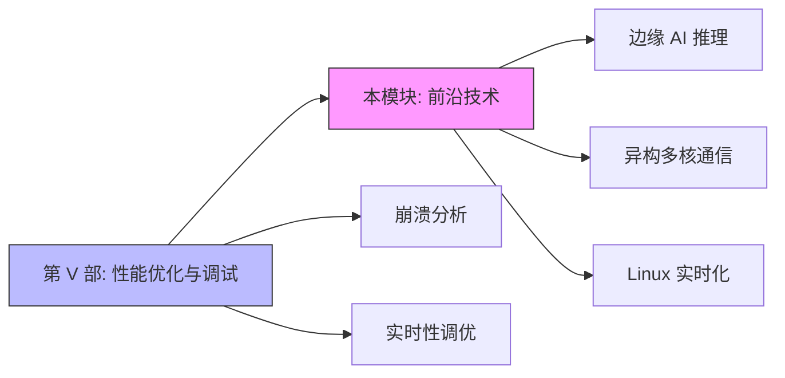

# 专用技术与前沿趋势

> BIEM 定位：[E→M] 从边缘 AI 到虚拟化，探索嵌入式 Linux 的未来方向 
> 本模块核心价值：前沿技术是性能优化的延伸方向

---

## 模块概述

本模块聚焦**嵌入式 Linux 的前沿技术方向**，从边缘 AI 推理（TensorFlow Lite、ONNX Runtime）、异构多核通信（RPMsg、OpenAMP），到 Linux 长期演进路线和嵌入式实时化技术（PREEMPT_RT、Xenomai）。这些技术代表了嵌入式系统正在发生的范式变革——AI 推理下沉到边缘、多核异构协同、确定性实时保障。

与第 V 部的关系：**前沿技术是性能优化的延伸方向**。第 V 部解决的是现有系统的性能瓶颈和稳定性问题，而本模块探索的是下一代嵌入式系统的技术形态——AI 加速、异构计算、实时确定性。

---

## 子目录结构

| 子目录 | 主题 | 难度 |
|--------|------|------|
| [01-边缘AI推理](01-边缘AI推理/README.md) | TensorFlow Lite、ONNX Runtime、NPU 推理加速 | [E→M] |
| [02-异构多核通信](02-异构多核通信/README.md) | RPMsg、OpenAMP、ARM+DSP/MCU 协同 | [E→M] |
| [05-Linux长期演进与技术路线图](05-Linux长期演进与技术路线图/README.md) | 内核演进、eBPF、Rust for Linux、新架构支持 | [M] |
| [06-嵌入式Linux实时化技术](06-嵌入式Linux实时化技术/README.md) | PREEMPT_RT、Xenomai、 deadline 调度、确定性分析 | [E→M] |

---

## 与第 V 部的关系

- **第 V 部**解决当前系统的性能瓶颈和稳定性问题
- **本模块（C 部）**探索未来系统的技术方向——AI 下沉、异构协同、实时确定性
- 两者共同构成从"优化现有"到"定义未来"的完整技术视野

---

## 小结

| 要点 | 内容 |
|------|------|
| 核心目标 | 探索嵌入式 Linux 的未来技术方向 |
| 关键能力 | 边缘 AI 部署、异构通信、实时化配置、技术趋势判断 |
| 前置知识 | 内核原理、驱动开发、性能优化 |
| 与体系关系 | 前沿技术是性能优化的延伸方向 |
