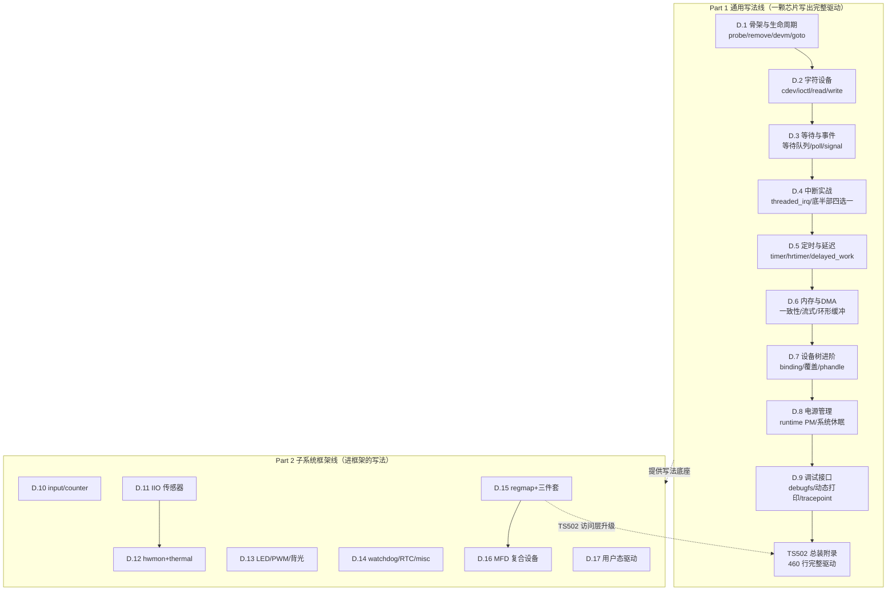

# D.18 子系统选型速查与全扩展知识图谱

> 所属：扩展篇 D. 驱动开发实战 > Part 2 子系统框架线（收官）
>
> 难度：[I] | 预计阅读时间：25 分钟
>
> 与第22章的分工：第22章是设计级的驱动架构决策（选型方法论）；本篇是 D 扩展的索引页——写完之后的"查"，给设备类型到子系统的直达映射、TS502 三形态对照，以及"哪些大件框架本扩展不教、去哪里学"的归属表。

##  本节导读

走完 Part 1 九篇通用写法和 Part 2 八篇框架写法，你已经覆盖了嵌入式驱动的绝大多数日常场景。本篇不引入新知识，交付三样东西：一张**设备 → 子系统速查表**（拿到硬件先查这张表，再翻对应篇目）、一份**TS502 三形态对照**（同一颗芯片三种写法的一页总结）、一张**全扩展知识图谱**加十道自测题。另附一份同样重要的清单——**哪些大件框架 D 扩展不教、为什么、去哪里学**。写清"不教什么"和"教什么"一样是设计决策。

---

##  设备 → 子系统速查表 [I]

拿到一颗外设，按硬件功能定位子系统，再跳到对应篇目：

| 你手里的硬件 | 子系统 / 路线 | 对应篇目 |
|---|---|---|
| 按键、轻触开关、旋转编码器 | input | D.10 |
| 电机码盘、累计脉冲计数 | counter（input REL 的对照语义） | D.10 |
| 温度/电压/电流/风扇监控芯片 | hwmon（+ thermal 联动） | D.12 |
| 通用传感器（IMU、光、气压、化学） | IIO | D.11 |
| 状态灯、调光灯、灯效芯片 | leds（先查 leds-gpio/pwm-leds 零代码） | D.13 |
| 屏幕背光 | backlight | D.13 |
| 蜂鸣器、舵机、调压输出 | pwm | D.13 |
| 看门狗（SoC 内置/外挂芯片） | watchdog（先查内核现成驱动） | D.14 |
| RTC 时钟芯片 | rtc（DS3231 等常见料直接用现成） | D.14 |
| 产测钩子、一次性配置口等小杂项 | misc | D.14 |
| 自定义数据通道、多 ioctl 设备 | cdev 全套 | D.2 |
| 寄存器多、有并发/缓存需求的 I2C/SPI 芯片 | regmap 包装 | D.15 |
| 复合芯片（PMIC、扩展 IO、多功能 codec） | MFD 拆分 | D.16 |
| MMIO 复合设备（子功能在 DT 里） | syscon + simple-mfd 零代码 | D.16 |
| FPGA 原型、硬件未定型、快速验证 | UIO / i2c-dev / spidev | D.17 |
| 要 DMA + 隔离的用户态场景 | VFIO（需 IOMMU） | D.17 |
| 任何驱动都要消费的资源 | clk / regulator / pinctrl | D.15 |
| 阻塞、异步通知、事件上报 | 等待队列 / poll / signal | D.3 |
| 中断接入与底半部 | request_threaded_irq 四选一 | D.4 |
| 周期性任务、消抖、超时 | timer / hrtimer / delayed_work | D.5 |
| 大数据搬运、环形缓冲 | DMA + dma_pool/kfifo | D.6 |

---

##  TS502 三形态对照 [E]

同一颗 TS502 温度+FIFO 芯片，D 扩展给了三种写法，各自的位置：

| 维度 | Part 1 cdev 版（D.1-D.6） | D.11 IIO 版 | D.15 regmap 版 |
|---|---|---|---|
| 用户态接口 | 自建 `/dev/ts502` + ioctl | `/sys/bus/iio/devices/iio:deviceX/` 标准属性 + buffer | 与宿主形态无关（访问层升级，可与前两版叠加） |
| 寄存器访问 | 裸 i2c_smbus 调用 | 裸 i2c_smbus（聚焦框架，未改访问层） | regmap_read/update_bits，内部持锁 |
| 数据通路 | 中断 → kfifo → read/poll | 中断 → iio_triggered_buffer | 不改变数据通路 |
| 调试红利 | 自建 debugfs（D.9） | IIO 生态工具（iio_info、libiio） | regmap debugfs 免费 dump |
| 适用判断 | 数据语义框架装不下、要定制协议 | 标准传感语义，要接入 IIO 生态 | 寄存器多、有并发、要 suspend 恢复 |
| 结论 | 框架外设备的正统做法 | 传感器的首选形态 | 前两者的推荐底层，成熟度标志 |

一句话：IIO 决定"接口长什么样"，regmap 决定"寄存器怎么访问"，cdev 是前两者的兜底——三者解决的是不同层的问题。

---

##  不进 Part 2 的大件框架：归属表 [I]

以下框架体量都够单独成书，D 扩展刻意不收，给出归属：

| 大件框架 | 典型硬件 | 归属 | 不教的理由 |
|---|---|---|---|
| V4L2 / Media Controller | camera sensor、ISP | 第25章（主线视觉专题） | 框架自身复杂度超过 D 全部篇幅，主线有专章 |
| ASoC | 音频 codec、声卡 | B-D.13（总线视角）+ 后续音频专题 | 与 I2S/PCM 总线强耦合，总线侧先讲 |
| DRM/KMS panel | MIPI DSI 屏、显示控制器 | G 扩展（显示专题） | 显示链路独立成体系 |
| netdev | 网卡、MAC/PHY | 第14/26章（网络专题） | 协议栈对接是另一条主线 |
| power_supply | 电量计、充电芯片 | 第三波候选 | 与产品电源策略强耦合，待独立成篇 |
| USB gadget/host 栈 | USB 外设 | 主线 USB 章节 | 枚举与描述符体系自有主线 |
| block / MTD | eMMC、NAND、SPI Flash | 第一部存储与文件系统链路 | 属于存储栈而非"外设驱动写法" |

判断是否需要开新专题的标准：**框架的自有概念数超过"寄存器 + 中断 + DMA"三件套能描述的范围**——V4L2 的 pipeline、ASoC 的 DAPM、DRM 的 plane/CRTC 都是这种情况。

---

##  全扩展知识图谱 [I]

学习路径建议：Part 1 顺序读（写法有依赖链）；Part 2 按需查（拿到什么硬件翻哪篇），但 D.15 regmap 建议在 D.11-D.14 之前看——它是所有框架驱动的底层习惯。

---

##  自测题 [I]

### 选择题（5道）

**Q1. 一颗通过 I2C 接口的十六路 PWM 调光 LED 芯片，正确的做法是？**

A. 写一个 cdev 驱动，暴露 ioctl 给业务调亮度  
B. 注册十六个 led_classdev，brightness_set 回调里直接做 I2C 写  
C. 注册十六个 led_classdev，brightness_set_blocking 回调里做 I2C 写  
D. 用 pwm-leds 兼容声明，零代码解决

**答案：C**
**解析**：I2C 芯片必须自写 led_classdev（框架外无现成），但硬件访问会睡眠，必须挂 blocking 版回调——heartbeat trigger 在原子上下文调 brightness_set，挂错版本立刻 "scheduling while atomic"（D.13）。D 错在 pwm-leds 只支持 SoC 直出的 PWM 通道，管不了 I2C 芯片。

---

**Q2. TS502 的 FIFO_DATA 寄存器（读一次弹一次）在 regmap_config 中应如何声明？**

A. 不用声明，regmap 自动识别  
B. 加入 volatile_reg 回调返回 true  
C. 把 cache_type 设为 REGCACHE_NONE  
D. 在 max_register 中排除它

**答案：B**
**解析**：读弹出寄存器若被缓存，读到的永远是脏数据；volatile 声明让它永远穿透缓存直读硬件（D.15）。C 为单个寄存器放弃全部缓存是因噎废食。

---

**Q3. 一颗 PMIC 内有 RTC、LDO、ADC 三个功能，共用一片 I2C 寄存器空间和一根中断线，子驱动获取寄存器访问能力的正确方式是？**

A. 每个子驱动各自 devm_regmap_init_i2c  
B. 父驱动建 regmap，子驱动 dev_get_regmap(pdev->dev.parent, NULL)  
C. 子驱动各自 i2c_new_client 建独立通道  
D. 通过全局符号导出父驱动的 regmap 指针

**答案：B**
**解析**：共享 regmap 实例的内部锁才是子驱动间互斥的唯一保障；各建各的 regmap 等于各建各的锁，共享总线互踩（D.16）。D 的全局符号破坏设备模型，多实例时直接崩。

---

**Q4. FPGA 原型期，寄存器定义每周都在改，算法组要用 Python 快速验证逻辑，应选？**

A. 直接写内核 cdev 驱动，保证性能  
B. UIO + generic-uio，用户态 mmap + poll  
C. VFIO 直通给虚拟机  
D. 用 debugfs 手工 echo 寄存器

**答案：B**
**解析**：硬件未定型、访问者单一、验证周期短——用户态路线全中（D.17）。寄存器冻结、多进程使用、量产维护任一信号出现时回内核态。

---

**Q5. 关于 misc 与 cdev 的选择，下列哪项是用 cdev 的充分理由？**

A. 代码想少写几行  
B. 设备需要按 minor 编码通道号，且未来会扩展成一组同类节点  
C. 设备是产测用的一次性配置口  
D. 不想处理设备号分配

**答案：B**
**解析**：misc 共享主设备号 10、动态分一个 minor，适合单个小杂项；需要多 minor 语义、成组设备语义时用 cdev（D.14）。判不准时的经验：五年后会不会长出第二个节点。

### 简答题（3道）

**Q6. 写出 probe 里"取资源"的标准顺序与两条铁律，并说明 -EPROBE_DEFER 的正确处理。**

**参考答案**：电（regulator_enable）→ 钟（clk_prepare_enable）→ 复位释放 → 首次寄存器通信，顺序按芯片手册上电时序（D.15）。铁律一：错误路径反向撤销——devm 只管 get 的引用，enable 这类运行时动作必须自己反向关；铁律二：使能后按手册给足稳定时间（msleep）再碰寄存器。-EPROBE_DEFER 用 dev_err_probe() 一行处理，它是正常流程（提供者尚未就绪）而非错误。

**Q7. 一颗温度传感器同时支持阈值报警，hwmon 和 IIO 两条路怎么选？报警怎么接 thermal 框架？**

**参考答案**：纯监控语义（温度/电压/电流给运维看）走 hwmon（D.12）；要进入传感数据生态（缓冲采样、多轴、标定）走 IIO（D.11）。报警接 thermal：hwmon 驱动注册为 thermal zone（devm_thermal_of_zone_register 或 thermal_zone_device_register），温度达到 trip point 时 thermal 框架按 cooling device 策略降温——驱动只报温度，策略归框架。

**Q8. 说明用户态驱动（UIO 路线）与内核驱动在中断处理上的分工差异，以及 UIO handler 为什么必须"按住"中断。**

**参考答案**：UIO 的内核 handler 只做一件事——清中断源或关中断，把中断"按住"；真正的处理逻辑全在用户态，通过 read/poll 收中断计数（D.17）。电平触发的中源若不清除，中断线持续有效，CPU 陷入中断风暴卡死系统；内核 handler 是唯一运行在硬中断上下文、能可靠执行清除动作的位置。内核驱动则相反：顶半部清中断、底半部（threaded_fn）完成全部处理（D.4），用户态只收结果。

---

##  本节总结

| 交付物 | 用途 | 自查问题 |
|------|---------|---------|
| 速查表 | 拿到硬件先定位子系统 | 新料到手知道翻哪篇吗 |
| TS502 三形态 | 接口形态/访问层/兜底三层正交 | 三者的分工说得清吗 |
| 大件归属表 | 不教什么、去哪里学 | camera/音频/屏知道去哪吗 |
| 知识图谱 | Part 1 顺序读、Part 2 按需查 | D.15 为什么是 Part 2 的底座 |
| 自测题 | ≥80% 正确率方可收官 | 错的题回对应篇目重读 |

---

##  下一步

D 扩展至此收官。向上衔接：第22章驱动架构设计把本篇的速查表升级为设计级决策树；B 扩展补全各总线的协议细节（I2C/SPI 时序、PCIe 枚举），与 D 扩展"协议归 B、写法归 D"的分工闭环。想继续练手，推荐路径：拿一块真实板子，把上面的速查表当 checklist，逐类外设确认"现成驱动 / 零代码 / 自写"的归属——这张表填完一遍，驱动选型就成本能了。

螺旋衔接：D 扩展全部内容——第11章写法分类（认知级）→ Part 1/Part 2（框架级）→ 第22章（设计级）。★收官
